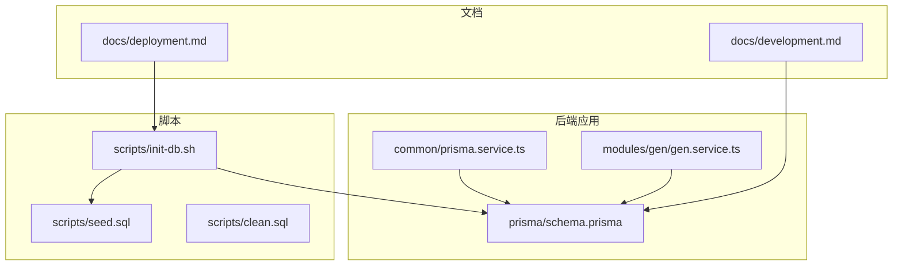
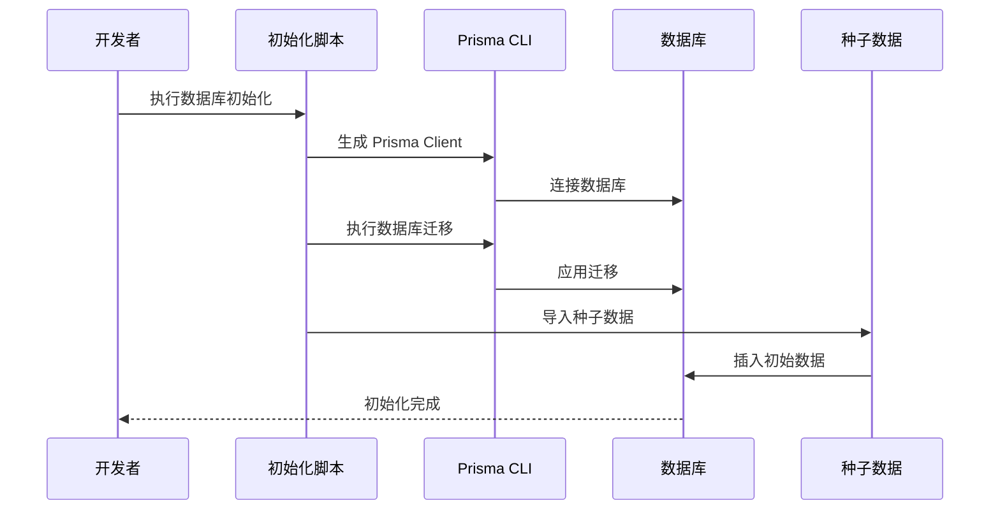
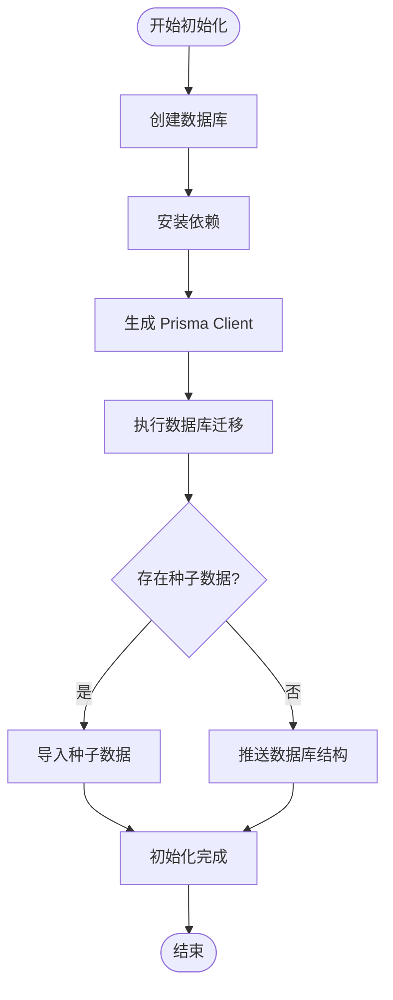
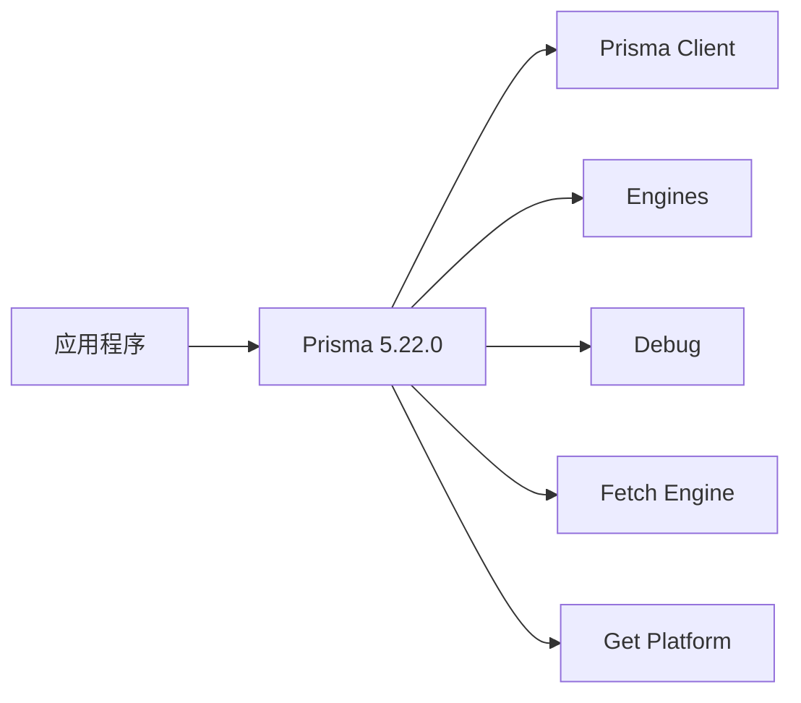

# 数据迁移与版本管理

<cite>
**本文引用的文件**
- [schema.prisma](file://apps/backend/prisma/schema.prisma)
- [init-db.sh](file://scripts/init-db.sh)
- [seed.sql](file://scripts/seed.sql)
- [clean.sql](file://scripts/clean.sql)
- [deployment.md](file://docs/deployment.md)
- [development.md](file://docs/development.md)
- [prisma.service.ts](file://apps/backend/src/common/prisma.service.ts)
- [package.json](file://apps/backend/package.json)
- [env.config.ts](file://apps/backend/src/config/env.config.ts)
- [gen.service.ts](file://apps/backend/src/modules/gen/gen.service.ts)
</cite>

## 目录
1. [简介](#简介)
2. [项目结构](#项目结构)
3. [核心组件](#核心组件)
4. [架构概览](#架构概览)
5. [详细组件分析](#详细组件分析)
6. [依赖关系分析](#依赖关系分析)
7. [性能考虑](#性能考虑)
8. [故障排除指南](#故障排除指南)
9. [结论](#结论)
10. [附录](#附录)

## 简介

本文件详细介绍 Nest-Admin-Pro 项目中的数据迁移与版本管理机制。项目采用 Prisma 作为 ORM 工具，结合 Bash 脚本实现数据库初始化、迁移和种子数据管理。文档涵盖 Prisma Migrate 的工作原理、schema.prisma 文件的版本控制策略、数据库结构变更处理、字段修改、新增表等操作，以及数据迁移的最佳实践。

## 项目结构

该项目采用多应用架构，数据库相关的核心文件位于后端应用的 prisma 目录中，并通过脚本实现自动化初始化流程：

**图表来源**
- [init-db.sh:1-85](file://scripts/init-db.sh#L1-L85)
- [schema.prisma:1-347](file://apps/backend/prisma/schema.prisma#L1-L347)
- [prisma.service.ts:1-22](file://apps/backend/src/common/prisma.service.ts#L1-L22)

**章节来源**
- [init-db.sh:1-85](file://scripts/init-db.sh#L1-L85)
- [schema.prisma:1-347](file://apps/backend/prisma/schema.prisma#L1-L347)
- [prisma.service.ts:1-22](file://apps/backend/src/common/prisma.service.ts#L1-L22)

## 核心组件

### Prisma Schema 定义

项目使用 Prisma Schema 定义数据库模型，包含系统核心模块、日志监控模块、定时任务模块和代码生成模块。每个模型都定义了字段、索引和关系。

**章节来源**
- [schema.prisma:1-347](file://apps/backend/prisma/schema.prisma#L1-L347)

### 数据库连接服务

PrismaService 继承自 PrismaClient，负责数据库连接管理和生命周期控制。该服务在模块初始化时自动连接数据库，在模块销毁时断开连接。

**章节来源**
- [prisma.service.ts:1-22](file://apps/backend/src/common/prisma.service.ts#L1-L22)

### 迁移初始化脚本

init-db.sh 脚本实现了完整的数据库初始化流程，包括数据库创建、依赖安装、Prisma Client 生成、数据库迁移和种子数据导入。

**章节来源**
- [init-db.sh:1-85](file://scripts/init-db.sh#L1-L85)

## 架构概览

项目的数据迁移架构采用分层设计，从底层的 Prisma Schema 到上层的自动化脚本，形成完整的版本管理流程：

**图表来源**
- [init-db.sh:43-79](file://scripts/init-db.sh#L43-L79)
- [seed.sql:1-186](file://scripts/seed.sql#L1-L186)

## 详细组件分析

### Prisma Schema 分析

schema.prisma 文件定义了完整的数据库模型结构，包含多个业务模块：

#### 系统核心模块
- 用户表 (SysUser)：包含用户基本信息、关联角色、部门等
- 角色表 (SysRole)：定义用户角色和权限范围
- 部门表 (SysDept)：支持树形结构的组织架构
- 岗位表 (SysPost)：员工岗位信息管理
- 菜单表 (SysMenu)：系统菜单和权限控制
- 字典类型和数据表 (SysDictType, SysDictData)：系统字典管理
- 系统配置表 (SysConfig)：系统参数配置
- 通知公告表 (SysNotice)：系统消息管理
- 文件表 (SysFile)：文件存储管理
- 租户表 (SysTenant)：多租户支持

**章节来源**
- [schema.prisma:12-347](file://apps/backend/prisma/schema.prisma#L12-L347)

#### 日志监控模块
- 登录日志表 (SysLoginLog)：用户登录行为记录
- 操作日志表 (SysOperLog)：系统操作审计

**章节来源**
- [schema.prisma:211-254](file://apps/backend/prisma/schema.prisma#L211-L254)

#### 定时任务模块
- 任务表 (SysJob)：定时任务配置
- 任务日志表 (SysJobLog)：任务执行记录

**章节来源**
- [schema.prisma:258-289](file://apps/backend/prisma/schema.prisma#L258-L289)

#### 代码生成模块
- 表定义表 (GenTable)：代码生成配置
- 字段定义表 (GenTableField)：字段详细信息

**章节来源**
- [schema.prisma:293-332](file://apps/backend/prisma/schema.prisma#L293-L332)

### 迁移脚本工作流程

**图表来源**
- [init-db.sh:23-79](file://scripts/init-db.sh#L23-L79)

**章节来源**
- [init-db.sh:1-85](file://scripts/init-db.sh#L1-L85)

### 种子数据管理

项目提供了两种种子数据管理方式：

#### 完整种子数据 (seed.sql)
包含完整的系统初始化数据，按外键依赖顺序插入，确保数据完整性。

#### 清理种子数据 (clean.sql)
提供简化版本的初始化数据，用于快速测试和开发环境。

**章节来源**
- [seed.sql:1-186](file://scripts/seed.sql#L1-L186)
- [clean.sql:1-86](file://scripts/clean.sql#L1-L86)

### 代码生成模块集成

gen.service.ts 展示了如何使用 Prisma Client 进行数据库操作，体现了迁移后数据模型的正确性。

**章节来源**
- [gen.service.ts:37-69](file://apps/backend/src/modules/gen/gen.service.ts#L37-L69)

## 依赖关系分析

### 外部依赖

项目使用 Prisma 5.22.0 作为核心依赖，包含完整的引擎生态系统：

**图表来源**
- [package.json:4577-4595](file://apps/backend/package.json#L4577-L4595)

### 环境配置

数据库连接通过环境变量配置，支持多种部署场景：

**章节来源**
- [env.config.ts:24-26](file://apps/backend/src/config/env.config.ts#L24-L26)
- [deployment.md:27-54](file://docs/deployment.md#L27-L54)

**章节来源**
- [package.json:1-50](file://apps/backend/package.json#L1-L50)

## 性能考虑

### 迁移性能优化

1. **批量操作**：种子数据采用批量插入减少数据库往返
2. **索引优化**：为常用查询字段建立索引
3. **连接池管理**：PrismaService 自动管理数据库连接
4. **异步处理**：迁移过程采用异步非阻塞方式

### 数据库设计优化

1. **字段类型选择**：根据业务需求选择合适的数据类型
2. **索引策略**：合理使用索引提升查询性能
3. **关系设计**：通过外键约束保证数据一致性

## 故障排除指南

### 常见问题及解决方案

#### 迁移失败
- 检查数据库连接配置
- 验证 Prisma Client 是否正确生成
- 确认迁移文件完整性

#### 种子数据导入失败
- 检查 SQL 文件语法
- 验证表结构是否匹配
- 确认外键依赖顺序

#### 数据库连接问题
- 检查环境变量配置
- 验证数据库服务状态
- 确认网络连接

**章节来源**
- [init-db.sh:25-31](file://scripts/init-db.sh#L25-L31)
- [init-db.sh:45-51](file://scripts/init-db.sh#L45-L51)
- [init-db.sh:55-67](file://scripts/init-db.sh#L55-L67)

## 结论

Nest-Admin-Pro 项目建立了完善的数据库迁移与版本管理体系。通过 Prisma Schema 的声明式定义、自动化迁移脚本和种子数据管理，实现了数据库结构的版本化控制和数据的完整初始化。该体系支持开发、测试和生产环境的统一管理，为项目的持续演进提供了可靠的基础。

## 附录

### 最佳实践建议

1. **版本控制策略**
   - 每次数据库结构变更创建新的迁移文件
   - 在团队协作中遵循迁移文件命名规范
   - 定期备份数据库结构和数据

2. **环境管理**
   - 开发环境使用 Prisma Migrate
   - 测试环境保持与生产环境一致的迁移策略
   - 生产环境严格控制迁移权限

3. **数据保护**
   - 迁移前进行数据库备份
   - 使用事务确保数据一致性
   - 建立回滚机制

4. **监控和日志**
   - 记录所有数据库变更历史
   - 监控迁移执行状态
   - 建立异常告警机制