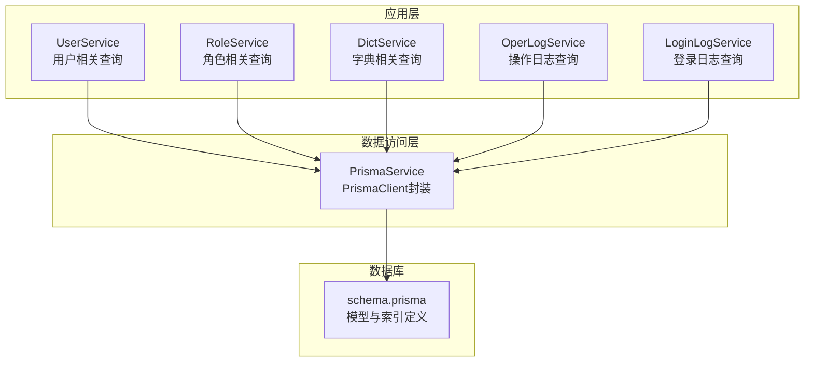
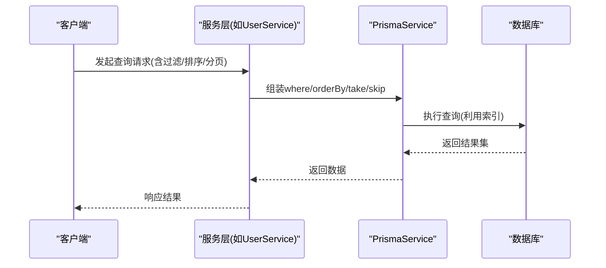
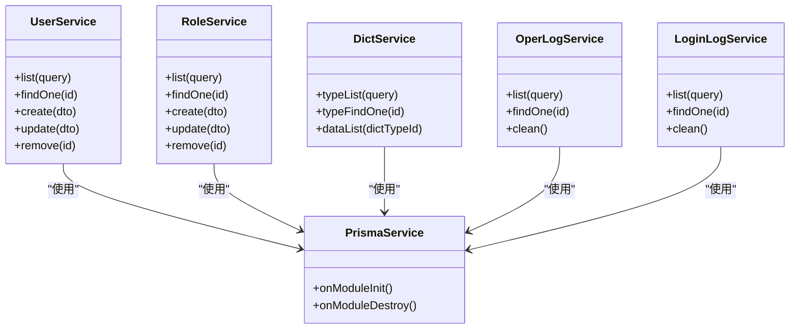

# 索引与约束设计

<cite>
**本文引用的文件**
- [schema.prisma](file://apps/backend/prisma/schema.prisma)
- [prisma.service.ts](file://apps/backend/src/common/prisma.service.ts)
- [user.service.ts](file://apps/backend/src/modules/system/user/user.service.ts)
- [role.service.ts](file://apps/backend/src/modules/system/role/role.service.ts)
- [dict.service.ts](file://apps/backend/src/modules/system/dict/dict.service.ts)
- [oper-log.service.ts](file://apps/backend/src/modules/monitor/oper-log/oper-log.service.ts)
- [login-log.service.ts](file://apps/backend/src/modules/monitor/login-log/login-log.service.ts)
- [redis.service.ts](file://apps/backend/src/cache/redis.service.ts)
- [user.dto.ts](file://apps/backend/src/modules/system/user/dto/user.dto.ts)
</cite>

## 目录
1. [简介](#简介)
2. [项目结构](#项目结构)
3. [核心组件](#核心组件)
4. [架构总览](#架构总览)
5. [详细组件分析](#详细组件分析)
6. [依赖分析](#依赖分析)
7. [性能考量](#性能考量)
8. [故障排查指南](#故障排查指南)
9. [结论](#结论)
10. [附录](#附录)

## 简介
本文件聚焦于数据库索引与约束设计，结合项目中的 Prisma 模式定义与实际查询使用场景，系统阐述索引策略、约束定义、查询优化与最佳实践。内容涵盖：
- Prisma 模式中的索引与约束声明方式
- 单列索引与复合索引的设计原则与性能影响
- 唯一约束、非空约束、默认值约束的应用场景
- 查询性能优化策略：索引选择性、查询计划分析、索引维护
- 根据查询模式设计高效索引结构的方法论
- 结合代码中的查询使用，评估现有索引覆盖度与优化建议

## 项目结构
本项目的数据库模式由 Prisma 管理，核心模式文件位于 apps/backend/prisma/schema.prisma。应用层通过 PrismaService 提供的 PrismaClient 进行数据访问，典型查询集中在各业务模块的服务层（如用户、角色、字典、操作日志、登录日志等）。

图表来源
- [prisma.service.ts:1-22](file://apps/backend/src/common/prisma.service.ts#L1-L22)
- [user.service.ts:1-144](file://apps/backend/src/modules/system/user/user.service.ts#L1-L144)
- [role.service.ts:1-80](file://apps/backend/src/modules/system/role/role.service.ts#L1-L80)
- [dict.service.ts:1-59](file://apps/backend/src/modules/system/dict/dict.service.ts#L1-L59)
- [oper-log.service.ts:1-33](file://apps/backend/src/modules/monitor/oper-log/oper-log.service.ts#L1-L33)
- [login-log.service.ts:1-31](file://apps/backend/src/modules/monitor/login-log/login-log.service.ts#L1-L31)
- [schema.prisma:1-347](file://apps/backend/prisma/schema.prisma#L1-L347)

章节来源
- [prisma.service.ts:1-22](file://apps/backend/src/common/prisma.service.ts#L1-L22)
- [schema.prisma:1-347](file://apps/backend/prisma/schema.prisma#L1-L347)

## 核心组件
- Prisma 模式与索引/约束定义：通过 model 声明字段属性与约束，通过 @@index 定义索引；通过 @unique、@default、可空性等控制约束与默认值。
- 应用查询与索引覆盖：服务层查询广泛使用 where 条件、排序、分页，直接影响索引的选择性与命中率。
- 缓存辅助：RedisService 提供在线用户等缓存能力，可作为查询性能优化的补充手段。

章节来源
- [schema.prisma:1-347](file://apps/backend/prisma/schema.prisma#L1-L347)
- [user.service.ts:18-46](file://apps/backend/src/modules/system/user/user.service.ts#L18-L46)
- [redis.service.ts:1-128](file://apps/backend/src/cache/redis.service.ts#L1-L128)

## 架构总览
下图展示 Prisma 模式、应用查询与数据库索引之间的关系，以及查询路径与潜在优化点。

图表来源
- [user.service.ts:18-46](file://apps/backend/src/modules/system/user/user.service.ts#L18-L46)
- [prisma.service.ts:1-22](file://apps/backend/src/common/prisma.service.ts#L1-L22)
- [schema.prisma:1-347](file://apps/backend/prisma/schema.prisma#L1-L347)

## 详细组件分析

### 数据模型与索引/约束概览
- 用户表 SysUser：主键自增；username 唯一；deptId 外键关联；多处单列索引；包含软删除标记与时间戳。
- 角色表 SysRole：主键自增；code 唯一；多处单列索引。
- 部门表 SysDept：主键自增；树形父子关系；多处单列索引。
- 菜单表 SysMenu：主键自增；树形父子关系；多处单列索引。
- 字典类型/数据：多处单列索引，支持按类型/排序/值检索。
- 系统配置：key 唯一；多处单列索引。
- 通知公告：多处单列索引。
- 文件表：多处单列索引，支持存储介质、对象键、上传者、创建时间、逻辑删除等维度查询。
- 日志表：登录日志与操作日志均有多处单列索引，支撑用户名、IP、时间等高频查询。
- 定时任务：多处单列索引，支撑处理器名与状态等查询。

章节来源
- [schema.prisma:13-38](file://apps/backend/prisma/schema.prisma#L13-L38)
- [schema.prisma:41-56](file://apps/backend/prisma/schema.prisma#L41-L56)
- [schema.prisma:58-75](file://apps/backend/prisma/schema.prisma#L58-L75)
- [schema.prisma:92-116](file://apps/backend/prisma/schema.prisma#L92-L116)
- [schema.prisma:118-131](file://apps/backend/prisma/schema.prisma#L118-L131)
- [schema.prisma:133-150](file://apps/backend/prisma/schema.prisma#L133-L150)
- [schema.prisma:152-165](file://apps/backend/prisma/schema.prisma#L152-L165)
- [schema.prisma:167-180](file://apps/backend/prisma/schema.prisma#L167-L180)
- [schema.prisma:182-207](file://apps/backend/prisma/schema.prisma#L182-L207)
- [schema.prisma:211-229](file://apps/backend/prisma/schema.prisma#L211-L229)
- [schema.prisma:231-254](file://apps/backend/prisma/schema.prisma#L231-L254)
- [schema.prisma:257-289](file://apps/backend/prisma/schema.prisma#L257-L289)
- [schema.prisma:291-332](file://apps/backend/prisma/schema.prisma#L291-L332)
- [schema.prisma:334-346](file://apps/backend/prisma/schema.prisma#L334-L346)

### 约束定义与应用场景
- 唯一约束（@unique）：用于保证业务唯一性，如用户名、角色编码、字典编码、配置键、租户编码等。这些字段常作为高频查询条件或去重依据，需配合单列索引提升查询效率。
- 非空约束与可空性：部分字段允许为空（如邮箱、手机号、部门ID、岗位ID、备注等），用于表达可选信息；主键与自增ID天然非空。
- 默认值约束（@default）：统一初始化策略，如状态默认启用、排序默认顺序、时间戳默认当前时间、字符串默认空串等，减少空值处理复杂度并保持一致性。

章节来源
- [schema.prisma:15-28](file://apps/backend/prisma/schema.prisma#L15-L28)
- [schema.prisma:43-53](file://apps/backend/prisma/schema.prisma#L43-L53)
- [schema.prisma:79-88](file://apps/backend/prisma/schema.prisma#L79-L88)
- [schema.prisma:94-115](file://apps/backend/prisma/schema.prisma#L94-L115)
- [schema.prisma:120-130](file://apps/backend/prisma/schema.prisma#L120-L130)
- [schema.prisma:136-149](file://apps/backend/prisma/schema.prisma#L136-L149)
- [schema.prisma:155-164](file://apps/backend/prisma/schema.prisma#L155-L164)
- [schema.prisma:169-180](file://apps/backend/prisma/schema.prisma#L169-L180)
- [schema.prisma:185-207](file://apps/backend/prisma/schema.prisma#L185-L207)
- [schema.prisma:214-229](file://apps/backend/prisma/schema.prisma#L214-L229)
- [schema.prisma:236-254](file://apps/backend/prisma/schema.prisma#L236-L254)
- [schema.prisma:259-289](file://apps/backend/prisma/schema.prisma#L259-L289)
- [schema.prisma:295-332](file://apps/backend/prisma/schema.prisma#L295-L332)
- [schema.prisma:339-346](file://apps/backend/prisma/schema.prisma#L339-L346)

### 索引策略与设计原则
- 单列索引：为高频过滤字段建立单列索引，如用户表的 username、deptId；角色表的 code；菜单表的 parentId、sort、perms；字典表的 dictTypeId、sort、value；配置表的 key；通知表的 type、status；文件表的 storage、objectKey、uploaderId、createTime、isDelete；日志表的 username、ip、createTime、userId、module；定时任务表的 handler、status 等。
- 复合索引：当查询同时涉及多个字段且选择性高时，可考虑复合索引以提升查询效率。例如：
  - 用户列表查询同时按部门ID与状态过滤，可考虑在 (deptId, status) 上建立复合索引。
  - 登录日志按用户名与状态组合过滤，可考虑在 (username, status) 上建立复合索引。
  - 操作日志按模块与创建时间排序，可考虑在 (module, createTime) 上建立复合索引。
- 设计原则：
  - 优先覆盖高频查询的过滤条件与排序字段。
  - 考虑选择性：高选择性的列更适合作为索引前导列。
  - 平衡写入成本：过多索引会增加插入/更新开销，需权衡读写比例。
  - 避免冗余索引：同一组列的不同顺序可能重复覆盖，应合并精简。

章节来源
- [schema.prisma:36-38](file://apps/backend/prisma/schema.prisma#L36-L38)
- [schema.prisma:55-56](file://apps/backend/prisma/schema.prisma#L55-L56)
- [schema.prisma:73-75](file://apps/backend/prisma/schema.prisma#L73-L75)
- [schema.prisma:113-116](file://apps/backend/prisma/schema.prisma#L113-L116)
- [schema.prisma:130-131](file://apps/backend/prisma/schema.prisma#L130-L131)
- [schema.prisma:147-150](file://apps/backend/prisma/schema.prisma#L147-L150)
- [schema.prisma:164-165](file://apps/backend/prisma/schema.prisma#L164-L165)
- [schema.prisma:178-180](file://apps/backend/prisma/schema.prisma#L178-L180)
- [schema.prisma:202-207](file://apps/backend/prisma/schema.prisma#L202-L207)
- [schema.prisma:226-229](file://apps/backend/prisma/schema.prisma#L226-L229)
- [schema.prisma:251-254](file://apps/backend/prisma/schema.prisma#L251-L254)
- [schema.prisma:272-274](file://apps/backend/prisma/schema.prisma#L272-L274)
- [schema.prisma:307-308](file://apps/backend/prisma/schema.prisma#L307-L308)
- [schema.prisma:330-332](file://apps/backend/prisma/schema.prisma#L330-L332)
- [schema.prisma:339-346](file://apps/backend/prisma/schema.prisma#L339-L346)

### 查询模式与索引覆盖分析
- 用户管理：支持按用户名模糊匹配、昵称模糊匹配、状态过滤、部门ID过滤，并按ID倒序分页。现有索引覆盖了 username、deptId、status 的常见组合，但未覆盖 (deptId, status) 复合过滤场景，建议新增复合索引以提升该类查询性能。
- 角色管理：支持按名称/编码模糊匹配与状态过滤，现有 code 唯一索引满足按编码精确查询需求。
- 字典管理：按类型ID与排序查询字典项，现有 dictTypeId、sort 索引满足基本查询；若存在按值精确/模糊查询，可考虑在 (dictTypeId, value) 或 value 单列上优化。
- 日志查询：操作日志与登录日志均支持按用户名/模块/状态/时间等过滤与排序，现有索引覆盖了常用过滤字段；若出现更多组合过滤，可考虑复合索引。
- 代码生成：按表名查询元信息，现有 tableName 索引满足需求。

章节来源
- [user.service.ts:18-46](file://apps/backend/src/modules/system/user/user.service.ts#L18-L46)
- [user.dto.ts:94-130](file://apps/backend/src/modules/system/user/dto/user.dto.ts#L94-L130)
- [role.service.ts:11-28](file://apps/backend/src/modules/system/role/role.service.ts#L11-L28)
- [dict.service.ts:9-16](file://apps/backend/src/modules/system/dict/dict.service.ts#L9-L16)
- [oper-log.service.ts:8-23](file://apps/backend/src/modules/monitor/oper-log/oper-log.service.ts#L8-L23)
- [login-log.service.ts:8-21](file://apps/backend/src/modules/monitor/login-log/login-log.service.ts#L8-L21)
- [schema.prisma:293-308](file://apps/backend/prisma/schema.prisma#L293-L308)
- [schema.prisma:310-332](file://apps/backend/prisma/schema.prisma#L310-L332)

### 索引选择性与查询计划分析
- 选择性：高选择性的列（如唯一编码、用户名）更适合做单列索引；低选择性列（如状态枚举）单独建索意义有限，建议与高选择性列组成复合索引。
- 查询计划：通过 Prisma 的日志功能（PrismaService 初始化时已开启错误与警告日志）观察 SQL 执行情况，结合数据库 EXPLAIN 分析索引使用情况，识别未命中索引或回表过多的查询。
- 性能瓶颈：对频繁的全表扫描、多次回表、排序开销大的查询，优先考虑复合索引与覆盖索引（将查询所需列纳入索引）。

章节来源
- [prisma.service.ts:8-12](file://apps/backend/src/common/prisma.service.ts#L8-L12)

### 索引维护策略
- 定期统计：监控索引使用率与碎片化程度，清理长期未使用的索引。
- 写多读少场景：适当减少索引数量，优先保留高频过滤/排序字段的索引。
- 写少读多场景：适度增加复合索引，提升查询效率。
- 变更治理：新增/修改索引需评估对写入性能的影响，必要时进行灰度发布与压测验证。

## 依赖分析
- 服务层依赖 PrismaService 进行数据访问，查询构造受 DTO 参数与业务逻辑影响。
- PrismaService 依赖 PrismaClient，负责连接数据库与日志输出。
- 模型定义（schema.prisma）决定索引与约束，直接影响查询性能与数据完整性。

图表来源
- [prisma.service.ts:1-22](file://apps/backend/src/common/prisma.service.ts#L1-L22)
- [user.service.ts:1-144](file://apps/backend/src/modules/system/user/user.service.ts#L1-L144)
- [role.service.ts:1-80](file://apps/backend/src/modules/system/role/role.service.ts#L1-L80)
- [dict.service.ts:1-59](file://apps/backend/src/modules/system/dict/dict.service.ts#L1-L59)
- [oper-log.service.ts:1-33](file://apps/backend/src/modules/monitor/oper-log/oper-log.service.ts#L1-L33)
- [login-log.service.ts:1-31](file://apps/backend/src/modules/monitor/login-log/login-log.service.ts#L1-L31)

章节来源
- [prisma.service.ts:1-22](file://apps/backend/src/common/prisma.service.ts#L1-L22)
- [user.service.ts:1-144](file://apps/backend/src/modules/system/user/user.service.ts#L1-L144)
- [role.service.ts:1-80](file://apps/backend/src/modules/system/role/role.service.ts#L1-L80)
- [dict.service.ts:1-59](file://apps/backend/src/modules/system/dict/dict.service.ts#L1-L59)
- [oper-log.service.ts:1-33](file://apps/backend/src/modules/monitor/oper-log/oper-log.service.ts#L1-L33)
- [login-log.service.ts:1-31](file://apps/backend/src/modules/monitor/login-log/login-log.service.ts#L1-L31)

## 性能考量
- 索引选择性优先：优先为高选择性列建立索引，避免“低选择性+低基数”导致的索引失效。
- 复合索引前导列：将最常用的过滤列放在前导位置，确保查询能命中索引。
- 排序与覆盖：尽量让排序字段进入索引，减少额外排序开销；必要时使用覆盖索引减少回表。
- 分页与延迟加载：对大数据量分页，优先使用基于索引的游标分页或基于主键的范围分页，避免 deep pagination 导致的性能问题。
- 写入与读取平衡：在写多读少场景减少索引数量；在读多写少场景适度增加索引。
- 缓存协同：对热点查询结果使用 Redis 缓存，降低数据库压力；对强一致要求的数据避免缓存穿透。

## 故障排查指南
- 查询慢：开启 Prisma 日志，定位慢查询 SQL；使用数据库 EXPLAIN 分析执行计划，确认是否命中索引。
- 索引未命中：检查查询条件是否与索引列顺序一致，是否存在隐式转换或函数导致索引失效。
- 写入变慢：评估索引数量与写入负载的关系，必要时减少索引或调整索引策略。
- 缓存异常：通过 RedisService 的 info 方法检查连接状态与内存使用，排查缓存过期与序列化问题。

章节来源
- [prisma.service.ts:8-12](file://apps/backend/src/common/prisma.service.ts#L8-L12)
- [redis.service.ts:70-80](file://apps/backend/src/cache/redis.service.ts#L70-L80)

## 结论
本项目在 Prisma 模式中对关键业务字段建立了完善的单列索引与约束，有效支撑了高频查询与数据完整性。为进一步提升性能，建议：
- 针对常见组合过滤（如 (deptId, status)、(username, status)、(module, createTime)）引入复合索引。
- 对热点查询引入 Redis 缓存，降低数据库压力。
- 建立索引变更治理流程，定期评估索引使用率与写入成本，动态优化索引结构。

## 附录
- Prisma 模式文件路径：apps/backend/prisma/schema.prisma
- Prisma 客户端封装：apps/backend/src/common/prisma.service.ts
- 业务查询示例（用户/角色/字典/日志）：apps/backend/src/modules/system/* 与 apps/backend/src/modules/monitor/*