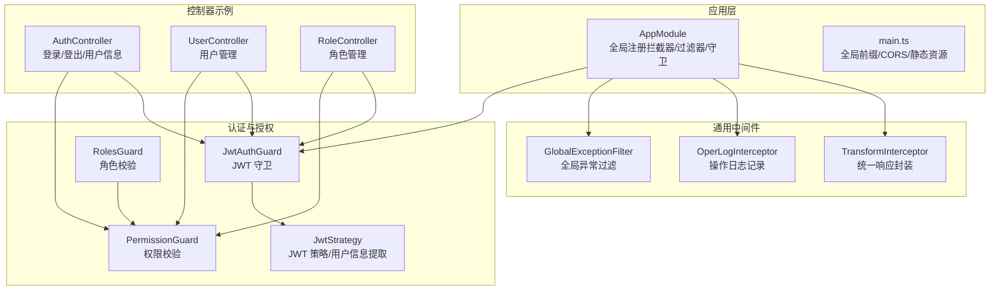
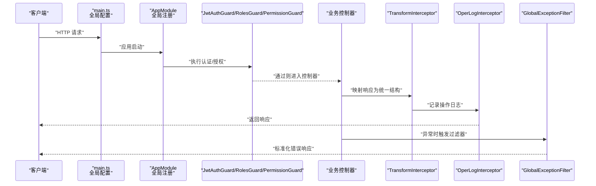
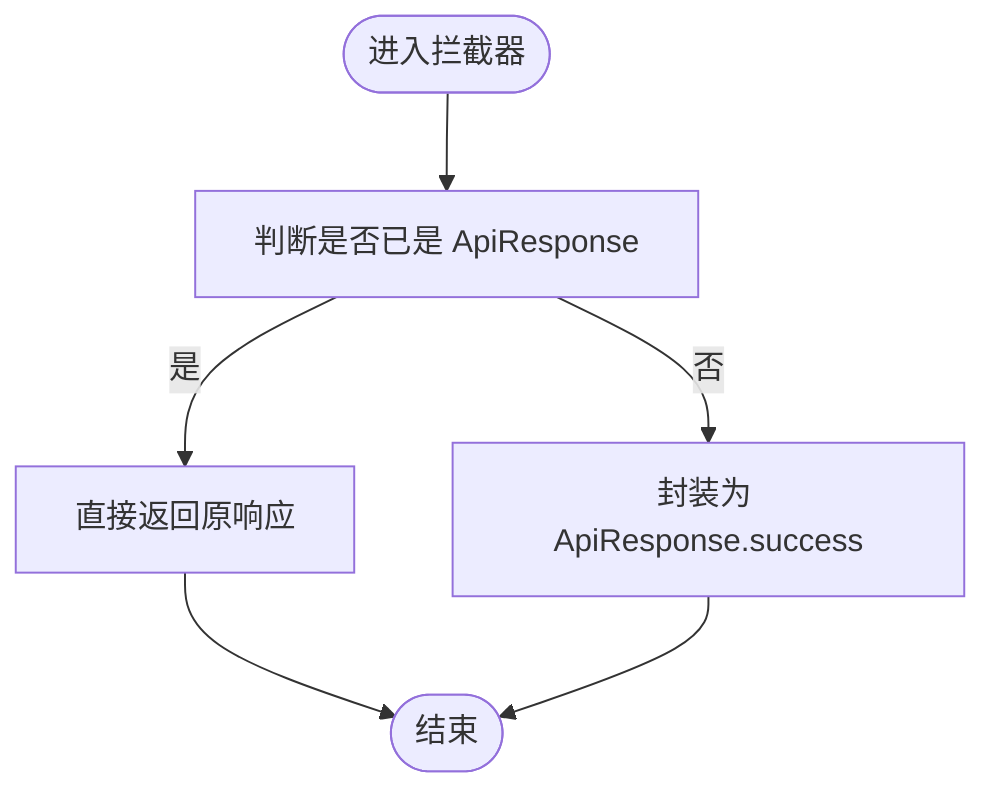
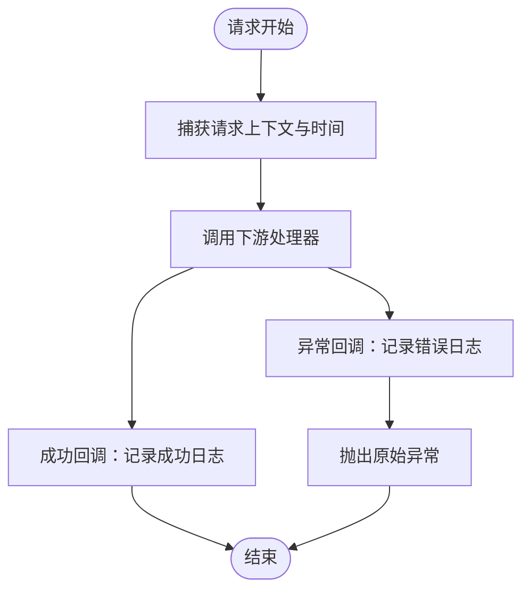
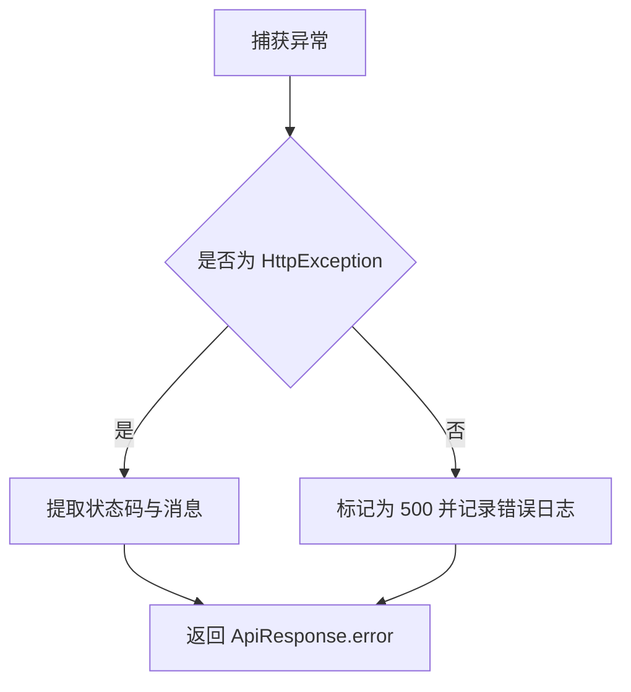
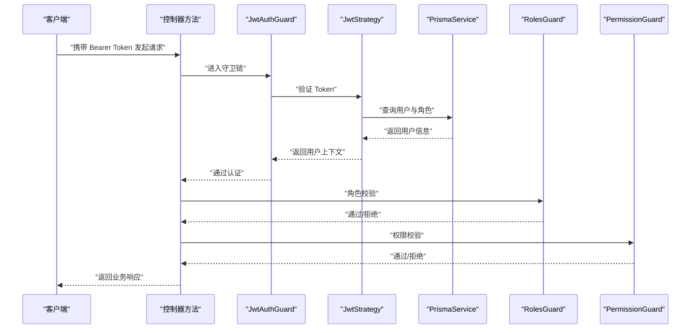
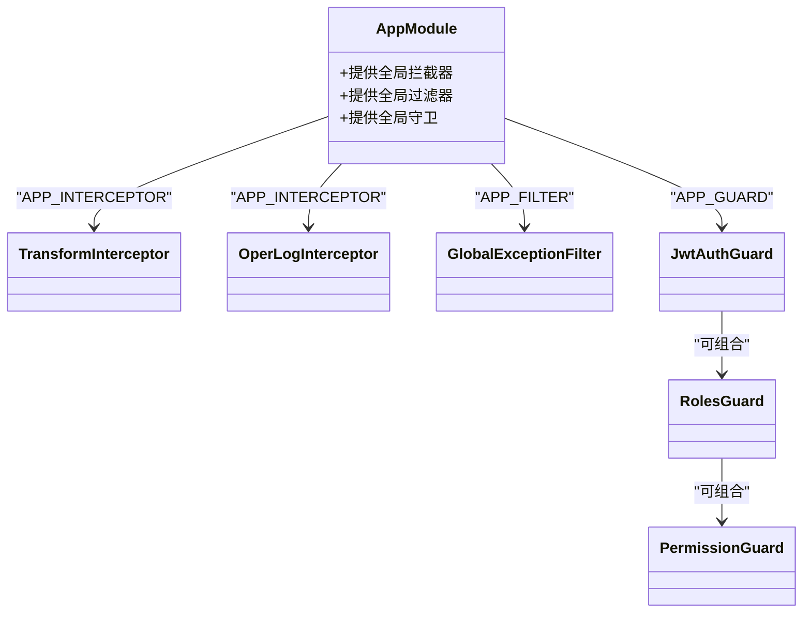
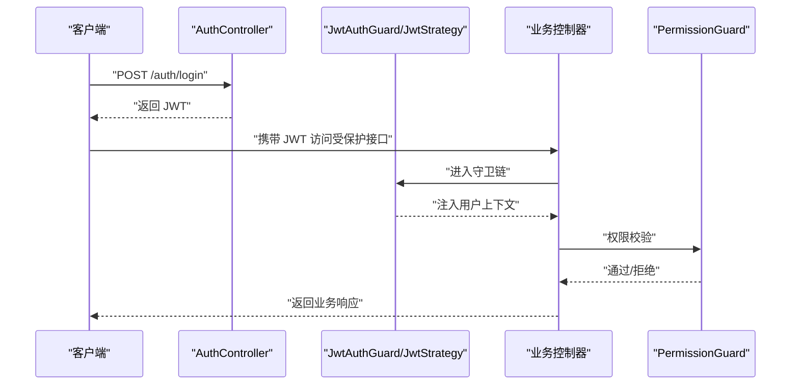
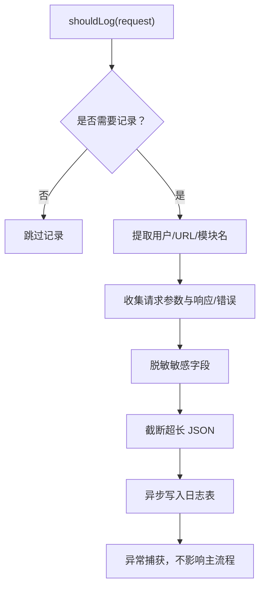
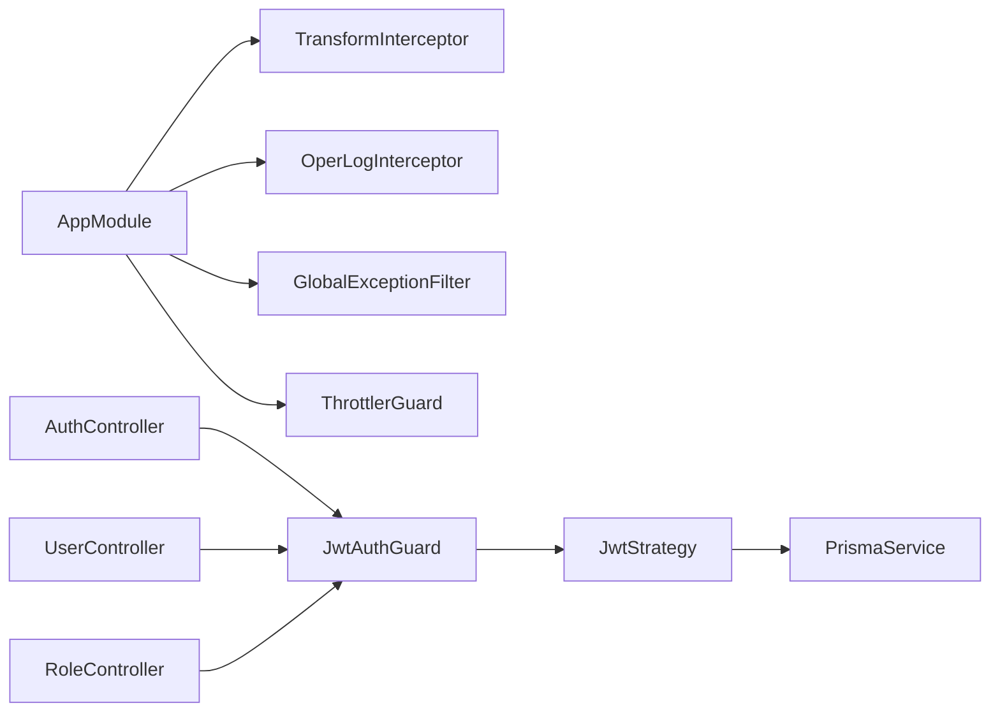

# 中间件体系

<cite>
**本文引用的文件**
- [apps/backend/src/app.module.ts](file://apps/backend/src/app.module.ts)
- [apps/backend/src/main.ts](file://apps/backend/src/main.ts)
- [apps/backend/src/common/transform.interceptor.ts](file://apps/backend/src/common/transform.interceptor.ts)
- [apps/backend/src/common/oper-log.interceptor.ts](file://apps/backend/src/common/oper-log.interceptor.ts)
- [apps/backend/src/common/exception.filter.ts](file://apps/backend/src/common/exception.filter.ts)
- [apps/backend/src/common/api-response.ts](file://apps/backend/src/common/api-response.ts)
- [apps/backend/src/auth/guards.ts](file://apps/backend/src/auth/guards.ts)
- [apps/backend/src/auth/jwt.guard.ts](file://apps/backend/src/auth/jwt.guard.ts)
- [apps/backend/src/auth/jwt.strategy.ts](file://apps/backend/src/auth/jwt.strategy.ts)
- [apps/backend/src/auth/auth.controller.ts](file://apps/backend/src/auth/auth.controller.ts)
- [apps/backend/src/modules/system/user/user.controller.ts](file://apps/backend/src/modules/system/user/user.controller.ts)
- [apps/backend/src/modules/system/role/role.controller.ts](file://apps/backend/src/modules/system/role/role.controller.ts)
</cite>

## 目录
1. [简介](#简介)
2. [项目结构](#项目结构)
3. [核心组件](#核心组件)
4. [架构总览](#架构总览)
5. [详细组件分析](#详细组件分析)
6. [依赖关系分析](#依赖关系分析)
7. [性能考虑](#性能考虑)
8. [故障排查指南](#故障排查指南)
9. [结论](#结论)
10. [附录](#附录)

## 简介
本文件系统性梳理 Nest-Admin-Pro 的中间件体系，重点覆盖以下方面：
- Interceptors（拦截器）：统一响应格式与操作日志记录
- Guards（守卫）：JWT 认证、角色与权限控制
- Filters（过滤器）：全局异常捕获与标准化错误输出
- 全局中间件注册与局部中间件应用方式
- JWT 认证流程、权限验证机制与操作日志记录实现
- 自定义中间件开发指南与性能优化建议

## 项目结构
后端采用标准 NestJS 结构，中间件相关代码集中在以下位置：
- 应用入口与全局注册：app.module.ts、main.ts
- 响应封装与日志：common/transform.interceptor.ts、common/oper-log.interceptor.ts
- 异常处理：common/exception.filter.ts、common/api-response.ts
- 权限控制：auth/guards.ts、auth/jwt.guard.ts、auth/jwt.strategy.ts
- 控制器示例：auth/auth.controller.ts、modules/system/user/user.controller.ts、modules/system/role/role.controller.ts

图表来源
- [apps/backend/src/app.module.ts:18-58](file://apps/backend/src/app.module.ts#L18-L58)
- [apps/backend/src/main.ts:8-47](file://apps/backend/src/main.ts#L8-L47)
- [apps/backend/src/common/transform.interceptor.ts:11-29](file://apps/backend/src/common/transform.interceptor.ts#L11-L29)
- [apps/backend/src/common/oper-log.interceptor.ts:12-28](file://apps/backend/src/common/oper-log.interceptor.ts#L12-L28)
- [apps/backend/src/common/exception.filter.ts:12-37](file://apps/backend/src/common/exception.filter.ts#L12-L37)
- [apps/backend/src/auth/jwt.guard.ts:1-5](file://apps/backend/src/auth/jwt.guard.ts#L1-L5)
- [apps/backend/src/auth/jwt.strategy.ts:8-43](file://apps/backend/src/auth/jwt.strategy.ts#L8-L43)
- [apps/backend/src/auth/guards.ts:19-51](file://apps/backend/src/auth/guards.ts#L19-L51)
- [apps/backend/src/auth/auth.controller.ts:10-87](file://apps/backend/src/auth/auth.controller.ts#L10-L87)
- [apps/backend/src/modules/system/user/user.controller.ts:21-89](file://apps/backend/src/modules/system/user/user.controller.ts#L21-L89)
- [apps/backend/src/modules/system/role/role.controller.ts:12-80](file://apps/backend/src/modules/system/role/role.controller.ts#L12-L80)

章节来源
- [apps/backend/src/app.module.ts:18-58](file://apps/backend/src/app.module.ts#L18-L58)
- [apps/backend/src/main.ts:8-47](file://apps/backend/src/main.ts#L8-L47)

## 核心组件
- 统一响应封装拦截器：将控制器返回值包装为统一 ApiResponse 结构，确保前后端一致的响应格式。
- 操作日志拦截器：在请求完成后记录操作日志，包括用户、URL、方法、参数、耗时、IP、状态等，并对敏感字段进行脱敏。
- 全局异常过滤器：捕获未处理异常，按 HttpException 或 Error 分类输出标准化错误响应。
- JWT 守卫与策略：基于 Passport 的 JWT 守卫负责认证，策略负责从 Token 解析用户并注入到请求上下文。
- 角色与权限守卫：通过反射读取控制器/方法元数据，校验用户角色与权限集合。

章节来源
- [apps/backend/src/common/transform.interceptor.ts:11-29](file://apps/backend/src/common/transform.interceptor.ts#L11-L29)
- [apps/backend/src/common/oper-log.interceptor.ts:12-28](file://apps/backend/src/common/oper-log.interceptor.ts#L12-L28)
- [apps/backend/src/common/exception.filter.ts:12-37](file://apps/backend/src/common/exception.filter.ts#L12-L37)
- [apps/backend/src/common/api-response.ts:1-35](file://apps/backend/src/common/api-response.ts#L1-L35)
- [apps/backend/src/auth/jwt.guard.ts:1-5](file://apps/backend/src/auth/jwt.guard.ts#L1-L5)
- [apps/backend/src/auth/jwt.strategy.ts:8-43](file://apps/backend/src/auth/jwt.strategy.ts#L8-L43)
- [apps/backend/src/auth/guards.ts:19-51](file://apps/backend/src/auth/guards.ts#L19-L51)

## 架构总览
下图展示一次典型请求从进入应用到返回响应的中间件链路，以及认证与权限检查的关键节点。

图表来源
- [apps/backend/src/main.ts:8-47](file://apps/backend/src/main.ts#L8-L47)
- [apps/backend/src/app.module.ts:18-58](file://apps/backend/src/app.module.ts#L18-L58)
- [apps/backend/src/auth/jwt.guard.ts:1-5](file://apps/backend/src/auth/jwt.guard.ts#L1-L5)
- [apps/backend/src/auth/guards.ts:19-51](file://apps/backend/src/auth/guards.ts#L19-L51)
- [apps/backend/src/common/transform.interceptor.ts:11-29](file://apps/backend/src/common/transform.interceptor.ts#L11-L29)
- [apps/backend/src/common/oper-log.interceptor.ts:12-28](file://apps/backend/src/common/oper-log.interceptor.ts#L12-L28)
- [apps/backend/src/common/exception.filter.ts:12-37](file://apps/backend/src/common/exception.filter.ts#L12-L37)

## 详细组件分析

### 统一响应封装拦截器（TransformInterceptor）
- 职责：将控制器返回值包装为统一 ApiResponse 结构；若已为 ApiResponse 则透传。
- 关键点：使用 RxJS map 操作符在响应流上进行转换，保证所有接口返回格式一致。
- 适用场景：所有控制器方法均可受益于该拦截器，无需手动构造统一响应。

图表来源
- [apps/backend/src/common/transform.interceptor.ts:15-28](file://apps/backend/src/common/transform.interceptor.ts#L15-L28)
- [apps/backend/src/common/api-response.ts:12-18](file://apps/backend/src/common/api-response.ts#L12-L18)

章节来源
- [apps/backend/src/common/transform.interceptor.ts:11-29](file://apps/backend/src/common/transform.interceptor.ts#L11-L29)
- [apps/backend/src/common/api-response.ts:1-35](file://apps/backend/src/common/api-response.ts#L1-L35)

### 操作日志拦截器（OperLogInterceptor）
- 职责：在请求完成后记录操作日志，包含用户、模块名、请求方法与 URL、请求参数、响应结果或错误信息、耗时、IP、状态等。
- 过滤规则：仅对非 GET 请求且非特定监控接口进行记录；未登录用户不记录。
- 数据脱敏：对包含密码、令牌、授权、验证码等关键词的字段进行掩码处理。
- 异步写入：日志写入失败不影响主业务流程（捕获异常并忽略）。

图表来源
- [apps/backend/src/common/oper-log.interceptor.ts:15-28](file://apps/backend/src/common/oper-log.interceptor.ts#L15-L28)
- [apps/backend/src/common/oper-log.interceptor.ts:30-61](file://apps/backend/src/common/oper-log.interceptor.ts#L30-L61)
- [apps/backend/src/common/oper-log.interceptor.ts:63-79](file://apps/backend/src/common/oper-log.interceptor.ts#L63-L79)
- [apps/backend/src/common/oper-log.interceptor.ts:81-99](file://apps/backend/src/common/oper-log.interceptor.ts#L81-L99)
- [apps/backend/src/common/oper-log.interceptor.ts:101-109](file://apps/backend/src/common/oper-log.interceptor.ts#L101-L109)

章节来源
- [apps/backend/src/common/oper-log.interceptor.ts:12-111](file://apps/backend/src/common/oper-log.interceptor.ts#L12-L111)

### 全局异常过滤器（GlobalExceptionFilter）
- 职责：捕获所有未处理异常，区分 HttpException 与 Error，输出统一 ApiResponse.error 结构。
- 日志记录：对未捕获的 Error 打印错误堆栈，便于定位问题。
- 适用范围：全局生效，无需在控制器中重复处理。

图表来源
- [apps/backend/src/common/exception.filter.ts:16-36](file://apps/backend/src/common/exception.filter.ts#L16-L36)
- [apps/backend/src/common/api-response.ts:16-18](file://apps/backend/src/common/api-response.ts#L16-L18)

章节来源
- [apps/backend/src/common/exception.filter.ts:12-37](file://apps/backend/src/common/exception.filter.ts#L12-L37)
- [apps/backend/src/common/api-response.ts:1-35](file://apps/backend/src/common/api-response.ts#L1-L35)

### JWT 认证与权限控制
- JWT 守卫：继承 AuthGuard('jwt')，用于保护路由，要求携带有效 Bearer Token。
- JWT 策略：从 Authorization 头解析 JWT，校验密钥与过期时间；从数据库加载用户信息并注入 roles 与 permissions。
- 角色与权限守卫：通过反射读取控制器/方法上的元数据，校验用户角色编码与权限字符串集合。
- 公开接口：通过 Public 装饰器标注，跳过认证流程。

图表来源
- [apps/backend/src/auth/jwt.guard.ts:1-5](file://apps/backend/src/auth/jwt.guard.ts#L1-L5)
- [apps/backend/src/auth/jwt.strategy.ts:20-43](file://apps/backend/src/auth/jwt.strategy.ts#L20-L43)
- [apps/backend/src/auth/guards.ts:19-51](file://apps/backend/src/auth/guards.ts#L19-L51)
- [apps/backend/src/auth/auth.controller.ts:13-19](file://apps/backend/src/auth/auth.controller.ts#L13-L19)

章节来源
- [apps/backend/src/auth/jwt.guard.ts:1-5](file://apps/backend/src/auth/jwt.guard.ts#L1-L5)
- [apps/backend/src/auth/jwt.strategy.ts:8-78](file://apps/backend/src/auth/jwt.strategy.ts#L8-L78)
- [apps/backend/src/auth/guards.ts:10-17](file://apps/backend/src/auth/guards.ts#L10-L17)
- [apps/backend/src/auth/guards.ts:19-51](file://apps/backend/src/auth/guards.ts#L19-L51)

### 全局中间件注册与局部中间件应用
- 全局注册：在 AppModule 中通过 APP_INTERCEPTOR、APP_FILTER、APP_GUARD 提供者注册 TransformInterceptor、OperLogInterceptor、GlobalExceptionFilter、ThrottlerGuard。
- 局部应用：在控制器或方法上使用装饰器（如 @UseGuards、@RequirePermission）实现细粒度控制。

图表来源
- [apps/backend/src/app.module.ts:39-56](file://apps/backend/src/app.module.ts#L39-L56)
- [apps/backend/src/auth/guards.ts:19-51](file://apps/backend/src/auth/guards.ts#L19-L51)
- [apps/backend/src/auth/jwt.guard.ts:1-5](file://apps/backend/src/auth/jwt.guard.ts#L1-L5)

章节来源
- [apps/backend/src/app.module.ts:18-58](file://apps/backend/src/app.module.ts#L18-L58)
- [apps/backend/src/auth/auth.controller.ts:13-19](file://apps/backend/src/auth/auth.controller.ts#L13-L19)
- [apps/backend/src/modules/system/user/user.controller.ts:20-22](file://apps/backend/src/modules/system/user/user.controller.ts#L20-L22)
- [apps/backend/src/modules/system/role/role.controller.ts:12-13](file://apps/backend/src/modules/system/role/role.controller.ts#L12-L13)

### JWT 认证流程与权限验证机制
- 登录与 Token 颁发：AuthController 提供登录接口，返回 JWT。
- Token 校验：JwtAuthGuard 使用 JwtStrategy 校验 Token 并注入用户上下文。
- 权限提取：JwtStrategy 依据用户角色动态计算权限列表（超级管理员与普通用户路径不同）。
- 控制器保护：通过 @UseGuards(JwtAuthGuard, PermissionGuard) 保护具体业务接口，@RequirePermission 指定所需权限。

图表来源
- [apps/backend/src/auth/auth.controller.ts:13-19](file://apps/backend/src/auth/auth.controller.ts#L13-L19)
- [apps/backend/src/auth/jwt.guard.ts:1-5](file://apps/backend/src/auth/jwt.guard.ts#L1-L5)
- [apps/backend/src/auth/jwt.strategy.ts:20-43](file://apps/backend/src/auth/jwt.strategy.ts#L20-L43)
- [apps/backend/src/modules/system/user/user.controller.ts:20-22](file://apps/backend/src/modules/system/user/user.controller.ts#L20-L22)
- [apps/backend/src/modules/system/user/user.controller.ts:27-31](file://apps/backend/src/modules/system/user/user.controller.ts#L27-L31)

章节来源
- [apps/backend/src/auth/auth.controller.ts:10-87](file://apps/backend/src/auth/auth.controller.ts#L10-L87)
- [apps/backend/src/auth/jwt.strategy.ts:45-76](file://apps/backend/src/auth/jwt.strategy.ts#L45-L76)

### 操作日志记录实现
- 触发时机：拦截器在 next.handle() 成功与异常两种分支分别记录日志。
- 记录内容：用户信息、模块名、请求方法与 URL、请求参数（含分页、查询、主体）、响应结果或错误信息、耗时、IP、状态。
- 过滤与脱敏：GET 请求与特定监控接口不记录；对敏感字段进行掩码处理；超长 JSON 截断。
- 写入可靠性：日志写入异常被捕获，避免影响主业务。

图表来源
- [apps/backend/src/common/oper-log.interceptor.ts:30-61](file://apps/backend/src/common/oper-log.interceptor.ts#L30-L61)
- [apps/backend/src/common/oper-log.interceptor.ts:63-70](file://apps/backend/src/common/oper-log.interceptor.ts#L63-L70)
- [apps/backend/src/common/oper-log.interceptor.ts:81-99](file://apps/backend/src/common/oper-log.interceptor.ts#L81-L99)
- [apps/backend/src/common/oper-log.interceptor.ts:101-109](file://apps/backend/src/common/oper-log.interceptor.ts#L101-L109)

章节来源
- [apps/backend/src/common/oper-log.interceptor.ts:12-111](file://apps/backend/src/common/oper-log.interceptor.ts#L12-L111)

## 依赖关系分析
- AppModule 将多个中间件作为全局提供者注册，形成统一的横切关注点。
- 控制器通过装饰器组合使用守卫，实现认证与授权的灵活组合。
- 拦截器与过滤器在请求生命周期中处于不同阶段，互不冲突，共同保障响应一致性与错误处理。

图表来源
- [apps/backend/src/app.module.ts:39-56](file://apps/backend/src/app.module.ts#L39-L56)
- [apps/backend/src/auth/auth.controller.ts:13-19](file://apps/backend/src/auth/auth.controller.ts#L13-L19)
- [apps/backend/src/modules/system/user/user.controller.ts:20-22](file://apps/backend/src/modules/system/user/user.controller.ts#L20-L22)
- [apps/backend/src/modules/system/role/role.controller.ts:12-13](file://apps/backend/src/modules/system/role/role.controller.ts#L12-L13)
- [apps/backend/src/auth/jwt.strategy.ts:20-43](file://apps/backend/src/auth/jwt.strategy.ts#L20-L43)

章节来源
- [apps/backend/src/app.module.ts:18-58](file://apps/backend/src/app.module.ts#L18-L58)
- [apps/backend/src/auth/auth.controller.ts:10-87](file://apps/backend/src/auth/auth.controller.ts#L10-L87)
- [apps/backend/src/modules/system/user/user.controller.ts:21-89](file://apps/backend/src/modules/system/user/user.controller.ts#L21-L89)
- [apps/backend/src/modules/system/role/role.controller.ts:12-80](file://apps/backend/src/modules/system/role/role.controller.ts#L12-L80)

## 性能考虑
- 拦截器与过滤器的顺序：统一响应与日志记录应尽量靠近控制器，减少后续处理成本。
- 日志写入异步化：当前实现已捕获异常，避免阻塞主流程；建议结合队列或批量写入进一步降低 IO 峰值。
- 参数脱敏与 JSON 截断：在高并发场景下，避免对大对象进行深度遍历与序列化，必要时限制请求体大小。
- 缓存权限与角色：JwtStrategy 已从数据库加载用户与角色，建议在上游增加缓存层以减少查询压力。
- 全局守卫与限流：ThrottlerGuard 可配合限流策略，防止暴力破解与滥用。

## 故障排查指南
- 401 未认证：确认请求头是否包含有效的 Bearer Token，Token 是否过期或被篡改。
- 403 权限不足：检查用户角色与权限集合是否满足 @RequirePermission 指定的权限字符串。
- 500 服务器错误：查看全局异常过滤器输出的错误信息与日志，定位具体异常类型。
- 日志缺失：确认请求方法不是 GET，且不在监控接口白名单内；检查日志服务可用性。

章节来源
- [apps/backend/src/common/exception.filter.ts:16-36](file://apps/backend/src/common/exception.filter.ts#L16-L36)
- [apps/backend/src/common/oper-log.interceptor.ts:63-70](file://apps/backend/src/common/oper-log.interceptor.ts#L63-L70)

## 结论
Nest-Admin-Pro 的中间件体系通过全局注册与局部组合的方式，实现了统一响应、操作日志与异常处理的一致性，同时借助 JWT 守卫与角色/权限守卫构建了完善的认证与授权闭环。建议在生产环境中进一步强化日志异步化、权限缓存与限流策略，以提升整体稳定性与性能。

## 附录
- 自定义中间件开发步骤
  - 拦截器：实现 NestInterceptor 接口，在 intercept 中使用 RxJS 操作符处理请求/响应。
  - 过滤器：实现 ExceptionFilter 接口，在 catch 中统一输出错误响应。
  - 守卫：实现 CanActivate 接口，结合 Reflector 读取元数据完成认证与授权。
- 最佳实践
  - 将通用逻辑放入全局提供者，局部装饰器用于差异化控制。
  - 对敏感字段与大对象进行脱敏与截断，避免泄露与内存压力。
  - 在异常过滤器中保留必要的日志与追踪信息，便于排障。