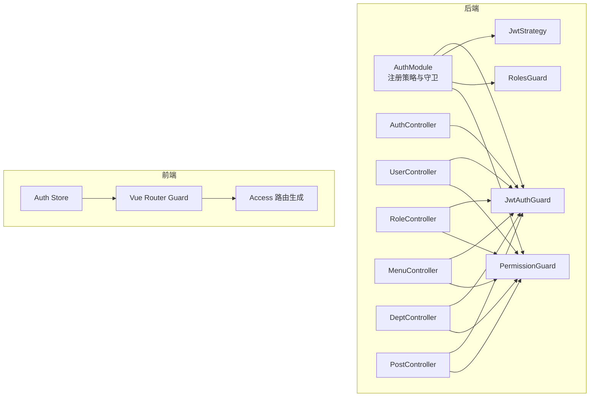
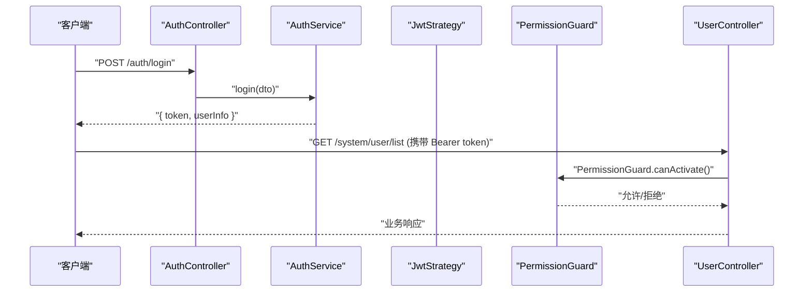
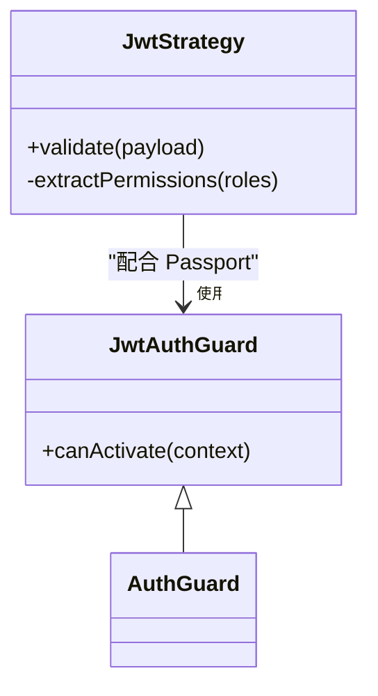
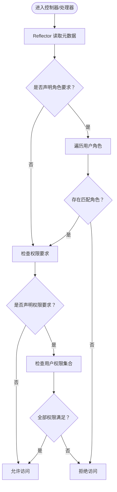
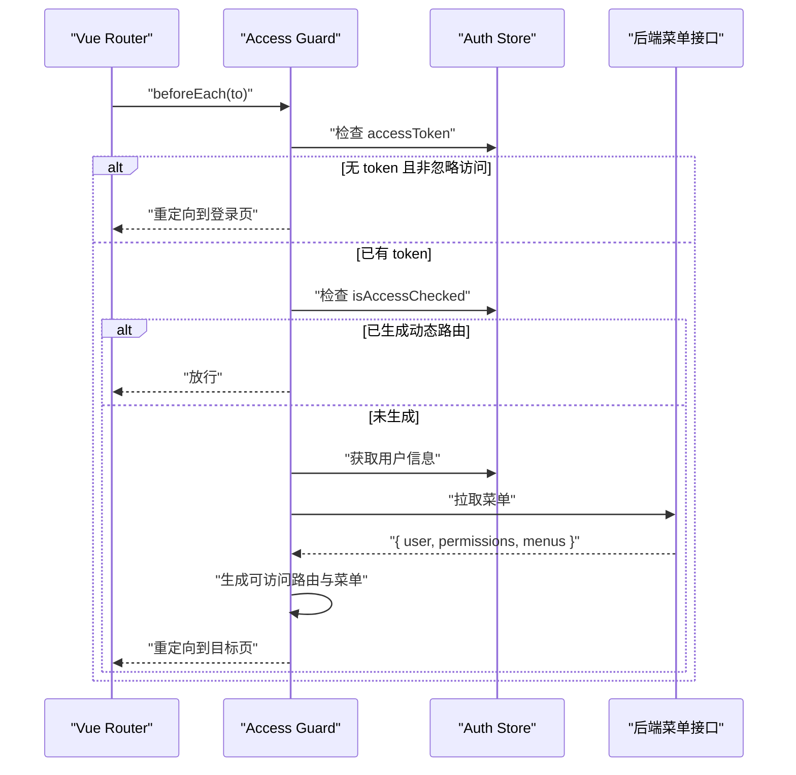
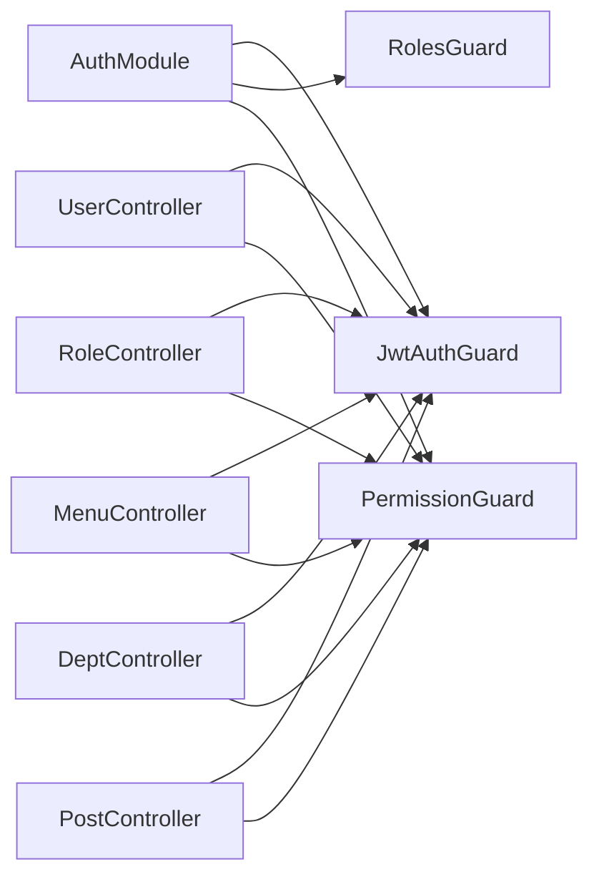

# 守卫

<cite>
**本文引用的文件**
- [apps/backend/src/auth/guards.ts](file://apps/backend/src/auth/guards.ts)
- [apps/backend/src/auth/jwt.guard.ts](file://apps/backend/src/auth/jwt.guard.ts)
- [apps/backend/src/auth/jwt.strategy.ts](file://apps/backend/src/auth/jwt.strategy.ts)
- [apps/backend/src/auth/auth.service.ts](file://apps/backend/src/auth/auth.service.ts)
- [apps/backend/src/auth/auth.controller.ts](file://apps/backend/src/auth/auth.controller.ts)
- [apps/backend/src/auth/auth.module.ts](file://apps/backend/src/auth/auth.module.ts)
- [apps/backend/src/modules/system/user/user.controller.ts](file://apps/backend/src/modules/system/user/user.controller.ts)
- [apps/backend/src/modules/system/role/role.controller.ts](file://apps/backend/src/modules/system/role/role.controller.ts)
- [apps/backend/src/modules/system/menu/menu.controller.ts](file://apps/backend/src/modules/system/menu/menu.controller.ts)
- [apps/backend/src/modules/system/dept/dept.controller.ts](file://apps/backend/src/modules/system/dept/dept.controller.ts)
- [apps/backend/src/modules/system/post/post.controller.ts](file://apps/backend/src/modules/system/post/post.controller.ts)
- [apps/backend/src/app.module.ts](file://apps/backend/src/app.module.ts)
- [apps/vben-admin/apps/web-antd/src/router/guard.ts](file://apps/vben-admin/apps/web-antd/src/router/guard.ts)
- [apps/vben-admin/apps/web-antd/src/router/access.ts](file://apps/vben-admin/apps/web-antd/src/router/access.ts)
- [apps/vben-admin/apps/web-antd/src/store/auth.ts](file://apps/vben-admin/apps/web-antd/src/store/auth.ts)
</cite>

## 目录
1. [简介](#简介)
2. [项目结构](#项目结构)
3. [核心组件](#核心组件)
4. [架构总览](#架构总览)
5. [详细组件分析](#详细组件分析)
6. [依赖关系分析](#依赖关系分析)
7. [性能考量](#性能考量)
8. [故障排查指南](#故障排查指南)
9. [结论](#结论)
10. [附录](#附录)

## 简介
本文件系统性梳理 Nest-Admin-Pro 的“守卫”体系，覆盖后端 JWT 认证与权限守卫、前端路由权限守卫，以及它们在实际业务中的协作方式。重点解释：
- JWT 认证守卫的工作原理：token 验证、用户身份解析、权限集合提取
- 角色权限与按钮级权限的实现机制：元数据标注、反射读取、权限集合比对
- 守卫执行顺序、条件守卫（公开接口）与自定义守卫的开发方法
- 最佳实践与常见问题解决方案

## 项目结构
后端采用 NestJS 模块化架构，认证与权限相关的核心位于 auth 子模块；前端 Vben Admin 使用 Vue Router 守卫进行动态路由与按钮级权限控制。

图表来源
- [apps/backend/src/auth/auth.module.ts:11-28](file://apps/backend/src/auth/auth.module.ts#L11-L28)
- [apps/backend/src/auth/jwt.guard.ts:1-5](file://apps/backend/src/auth/jwt.guard.ts#L1-L5)
- [apps/backend/src/auth/jwt.strategy.ts:1-78](file://apps/backend/src/auth/jwt.strategy.ts#L1-L78)
- [apps/backend/src/auth/guards.ts:1-51](file://apps/backend/src/auth/guards.ts#L1-L51)
- [apps/backend/src/auth/auth.controller.ts:1-87](file://apps/backend/src/auth/auth.controller.ts#L1-L87)
- [apps/backend/src/modules/system/user/user.controller.ts:1-89](file://apps/backend/src/modules/system/user/user.controller.ts#L1-L89)
- [apps/backend/src/modules/system/role/role.controller.ts:1-80](file://apps/backend/src/modules/system/role/role.controller.ts#L1-L80)
- [apps/backend/src/modules/system/menu/menu.controller.ts:1-67](file://apps/backend/src/modules/system/menu/menu.controller.ts#L1-L67)
- [apps/backend/src/modules/system/dept/dept.controller.ts:1-60](file://apps/backend/src/modules/system/dept/dept.controller.ts#L1-L60)
- [apps/backend/src/modules/system/post/post.controller.ts:1-50](file://apps/backend/src/modules/system/post/post.controller.ts#L1-L50)
- [apps/vben-admin/apps/web-antd/src/router/guard.ts:1-134](file://apps/vben-admin/apps/web-antd/src/router/guard.ts#L1-L134)
- [apps/vben-admin/apps/web-antd/src/router/access.ts:1-190](file://apps/vben-admin/apps/web-antd/src/router/access.ts#L1-L190)
- [apps/vben-admin/apps/web-antd/src/store/auth.ts:1-137](file://apps/vben-admin/apps/web-antd/src/store/auth.ts#L1-L137)

章节来源
- [apps/backend/src/auth/auth.module.ts:11-28](file://apps/backend/src/auth/auth.module.ts#L11-L28)
- [apps/backend/src/app.module.ts:39-56](file://apps/backend/src/app.module.ts#L39-L56)

## 核心组件
- JWT 认证守卫：基于 Passport 的 jwt 策略，负责校验请求头中的 Bearer Token，并将解析后的用户信息注入到请求上下文
- 角色守卫：通过反射读取控制器/处理器上的角色元数据，判断用户角色集合是否满足要求
- 权限守卫：通过反射读取处理器上的权限元数据，判断用户权限集合是否包含所需权限
- 公开接口注解：用于标记无需认证即可访问的端点
- 前端路由守卫：在浏览器侧根据用户权限动态生成可访问路由与菜单，支持按钮级权限控制

章节来源
- [apps/backend/src/auth/jwt.guard.ts:1-5](file://apps/backend/src/auth/jwt.guard.ts#L1-L5)
- [apps/backend/src/auth/jwt.strategy.ts:20-43](file://apps/backend/src/auth/jwt.strategy.ts#L20-L43)
- [apps/backend/src/auth/guards.ts:19-51](file://apps/backend/src/auth/guards.ts#L19-L51)
- [apps/vben-admin/apps/web-antd/src/router/guard.ts:47-120](file://apps/vben-admin/apps/web-antd/src/router/guard.ts#L47-L120)
- [apps/vben-admin/apps/web-antd/src/router/access.ts:162-187](file://apps/vben-admin/apps/web-antd/src/router/access.ts#L162-L187)

## 架构总览
后端通过 AuthModule 注册 JwtModule 与 Passport，配置默认策略为 jwt；JwtAuthGuard 继承自 AuthGuard('jwt')，在控制器层统一启用；JwtStrategy 在验证通过后，从数据库加载用户并计算其权限集合，注入到 req.user。角色守卫与权限守卫通过 Reflector 读取装饰器元数据，完成授权判断。前端通过路由守卫与权限存储，动态构建可访问的菜单与路由，并在界面层进行按钮级权限控制。

图表来源
- [apps/backend/src/auth/auth.controller.ts:13-19](file://apps/backend/src/auth/auth.controller.ts#L13-L19)
- [apps/backend/src/auth/auth.service.ts:29-89](file://apps/backend/src/auth/auth.service.ts#L29-L89)
- [apps/backend/src/auth/jwt.strategy.ts:20-43](file://apps/backend/src/auth/jwt.strategy.ts#L20-L43)
- [apps/backend/src/auth/guards.ts:36-51](file://apps/backend/src/auth/guards.ts#L36-L51)
- [apps/backend/src/modules/system/user/user.controller.ts:26-31](file://apps/backend/src/modules/system/user/user.controller.ts#L26-L31)

## 详细组件分析

### JWT 认证守卫与策略
- JwtAuthGuard：继承自 AuthGuard('jwt')，作为统一的认证入口
- JwtStrategy：从请求头解析 Bearer Token，校验签名与过期时间；从数据库加载用户及其角色、部门；根据角色类型与菜单关联计算权限集合；返回标准化的用户对象（包含 id、用户名、昵称、头像、邮箱、电话、部门、角色、权限）

图表来源
- [apps/backend/src/auth/jwt.guard.ts:1-5](file://apps/backend/src/auth/jwt.guard.ts#L1-L5)
- [apps/backend/src/auth/jwt.strategy.ts:8-43](file://apps/backend/src/auth/jwt.strategy.ts#L8-L43)

章节来源
- [apps/backend/src/auth/jwt.guard.ts:1-5](file://apps/backend/src/auth/jwt.guard.ts#L1-L5)
- [apps/backend/src/auth/jwt.strategy.ts:9-43](file://apps/backend/src/auth/jwt.strategy.ts#L9-L43)

### 角色守卫与权限守卫
- 元数据注解：
  - Public：标记公开接口，绕过认证
  - RequireRole：标注所需角色集合
  - RequirePermission：标注所需权限集合
- RolesGuard：读取控制器/处理器的 ROLES_KEY 元数据，若未设置则放行；否则检查 req.user.roles 中是否存在任一匹配角色
- PermissionGuard：读取 PERMS_KEY 元数据，若未设置则放行；否则检查 req.user.permissions 是否包含所有必需权限

图表来源
- [apps/backend/src/auth/guards.ts:19-51](file://apps/backend/src/auth/guards.ts#L19-L51)

章节来源
- [apps/backend/src/auth/guards.ts:10-17](file://apps/backend/src/auth/guards.ts#L10-L17)
- [apps/backend/src/auth/guards.ts:19-51](file://apps/backend/src/auth/guards.ts#L19-L51)

### 公开接口与条件守卫
- Public 装饰器通过 SetMetadata 标记 isPublic=true
- 在控制器或方法上使用 Public，可使该端点无需认证即可访问
- 适用于登录、注册、验证码等场景

章节来源
- [apps/backend/src/auth/guards.ts:10-11](file://apps/backend/src/auth/guards.ts#L10-L11)
- [apps/backend/src/auth/auth.controller.ts:13-26](file://apps/backend/src/auth/auth.controller.ts#L13-L26)

### 守卫执行顺序与组合使用
- 控制器级守卫：在控制器上使用 @UseGuards(JwtAuthGuard, PermissionGuard)，表示先执行认证，再执行权限校验
- 方法级守卫：可在具体方法上叠加 RequirePermission 或 RequireRole，形成更细粒度的授权控制
- 元数据优先级：Reflector 会同时读取处理器与类的元数据，以“处理器优先”的方式合并

章节来源
- [apps/backend/src/modules/system/user/user.controller.ts:22-23](file://apps/backend/src/modules/system/user/user.controller.ts#L22-L23)
- [apps/backend/src/modules/system/user/user.controller.ts:27-31](file://apps/backend/src/modules/system/user/user.controller.ts#L27-L31)
- [apps/backend/src/auth/guards.ts:23-27](file://apps/backend/src/auth/guards.ts#L23-L27)

### 权限集合的动态计算
- 超级管理员：拥有所有菜单的权限
- 普通用户：根据角色绑定的菜单ID集合，查询有效菜单的权限字符串，去重后作为用户权限集合
- 前端路由：后端返回菜单树与权限码，前端据此生成可访问路由与按钮级权限

章节来源
- [apps/backend/src/auth/jwt.strategy.ts:45-76](file://apps/backend/src/auth/jwt.strategy.ts#L45-L76)
- [apps/backend/src/auth/auth.service.ts:144-186](file://apps/backend/src/auth/auth.service.ts#L144-L186)
- [apps/vben-admin/apps/web-antd/src/router/access.ts:93-131](file://apps/vben-admin/apps/web-antd/src/router/access.ts#L93-L131)

### 前端路由守卫与按钮级权限
- 路由守卫：在 beforeEach 中检查 accessToken、核心路由、忽略访问标记；若已生成动态路由则直接放行；否则拉取用户信息与菜单，生成可访问路由与菜单，并重定向到目标页面
- 权限生成：将后端菜单树转换为前端路由结构，设置 authority 元信息；结合权限码控制按钮级可见性
- 登录流程：登录成功后写入 token 与用户信息，拉取用户信息并设置权限码，随后导航至首页

图表来源
- [apps/vben-admin/apps/web-antd/src/router/guard.ts:47-120](file://apps/vben-admin/apps/web-antd/src/router/guard.ts#L47-L120)
- [apps/vben-admin/apps/web-antd/src/router/access.ts:162-187](file://apps/vben-admin/apps/web-antd/src/router/access.ts#L162-L187)
- [apps/vben-admin/apps/web-antd/src/store/auth.ts:27-88](file://apps/vben-admin/apps/web-antd/src/store/auth.ts#L27-L88)

章节来源
- [apps/vben-admin/apps/web-antd/src/router/guard.ts:47-120](file://apps/vben-admin/apps/web-antd/src/router/guard.ts#L47-L120)
- [apps/vben-admin/apps/web-antd/src/router/access.ts:93-131](file://apps/vben-admin/apps/web-antd/src/router/access.ts#L93-L131)
- [apps/vben-admin/apps/web-antd/src/store/auth.ts:44-62](file://apps/vben-admin/apps/web-antd/src/store/auth.ts#L44-L62)

## 依赖关系分析
- AuthModule 导出 JwtAuthGuard、RolesGuard、PermissionGuard，供各业务模块复用
- 各系统模块控制器统一启用 JwtAuthGuard 与 PermissionGuard，确保所有受保护接口均经过认证与权限校验
- 前端通过 Pinia Store 与路由守卫协同，实现运行时权限控制

图表来源
- [apps/backend/src/auth/auth.module.ts:26-27](file://apps/backend/src/auth/auth.module.ts#L26-L27)
- [apps/backend/src/modules/system/user/user.controller.ts:22-23](file://apps/backend/src/modules/system/user/user.controller.ts#L22-L23)
- [apps/backend/src/modules/system/role/role.controller.ts](file://apps/backend/src/modules/system/role/role.controller.ts#L13)
- [apps/backend/src/modules/system/menu/menu.controller.ts](file://apps/backend/src/modules/system/menu/menu.controller.ts#L13)
- [apps/backend/src/modules/system/dept/dept.controller.ts](file://apps/backend/src/modules/system/dept/dept.controller.ts#L13)
- [apps/backend/src/modules/system/post/post.controller.ts](file://apps/backend/src/modules/system/post/post.controller.ts#L10)

章节来源
- [apps/backend/src/auth/auth.module.ts:26-27](file://apps/backend/src/auth/auth.module.ts#L26-L27)
- [apps/backend/src/modules/system/user/user.controller.ts:22-23](file://apps/backend/src/modules/system/user/user.controller.ts#L22-L23)

## 性能考量
- 权限计算复杂度：普通用户的权限来源于角色绑定菜单ID集合的查询与去重，建议在数据库层面为菜单 perms 字段建立索引，减少查询成本
- 超级管理员权限：一次性扫描所有有效菜单的 perms，建议限制菜单数量或引入缓存
- 前端路由生成：仅在首次登录或权限变更时生成，避免重复计算
- Token 失效与刷新：合理设置 jwt 过期时间，结合刷新令牌策略降低频繁登录带来的交互成本

## 故障排查指南
- 认证失败
  - 检查请求头是否正确携带 Bearer Token
  - 确认 JwtModule 的 secret 与前端一致
  - 核对用户状态与删除标记是否导致 Unauthorized
- 权限不足
  - 确认控制器/方法是否正确标注 RequirePermission
  - 检查用户权限集合是否包含所需权限码
  - 排查菜单 perms 字段是否为空或格式异常
- 公开接口仍需认证
  - 确认是否在控制器/方法上正确使用 Public 注解
- 前端路由不生效
  - 检查 accessToken 是否存在
  - 确认 isAccessChecked 标记与动态路由生成逻辑
  - 核对后端返回的菜单树与权限码结构

章节来源
- [apps/backend/src/auth/jwt.strategy.ts:26-28](file://apps/backend/src/auth/jwt.strategy.ts#L26-L28)
- [apps/backend/src/auth/guards.ts:36-51](file://apps/backend/src/auth/guards.ts#L36-L51)
- [apps/backend/src/auth/auth.controller.ts:13-26](file://apps/backend/src/auth/auth.controller.ts#L13-L26)
- [apps/vben-admin/apps/web-antd/src/router/guard.ts:65-86](file://apps/vben-admin/apps/web-antd/src/router/guard.ts#L65-L86)

## 结论
Nest-Admin-Pro 的守卫体系以 JWT 认证为核心，结合角色与权限守卫，实现了从接口到前端路由的全链路权限控制。后端通过策略与守卫分离的设计，保证了认证与授权的可扩展性；前端通过路由守卫与权限码映射，提供了灵活的动态路由与按钮级权限控制。遵循本文最佳实践与排障建议，可有效提升系统的安全性与可维护性。

## 附录
- 自定义守卫开发步骤
  - 实现 CanActivate 接口，使用 Reflector 读取元数据
  - 在 AuthModule 中注册并导出，供业务模块复用
  - 在控制器或方法上使用对应装饰器标注需求
- 最佳实践
  - 将公共接口明确标注为公开
  - 对关键业务接口使用 RequirePermission 精细化控制
  - 前端权限码与后端权限保持一致命名规范
  - 定期清理无效菜单与权限，避免权限集合膨胀