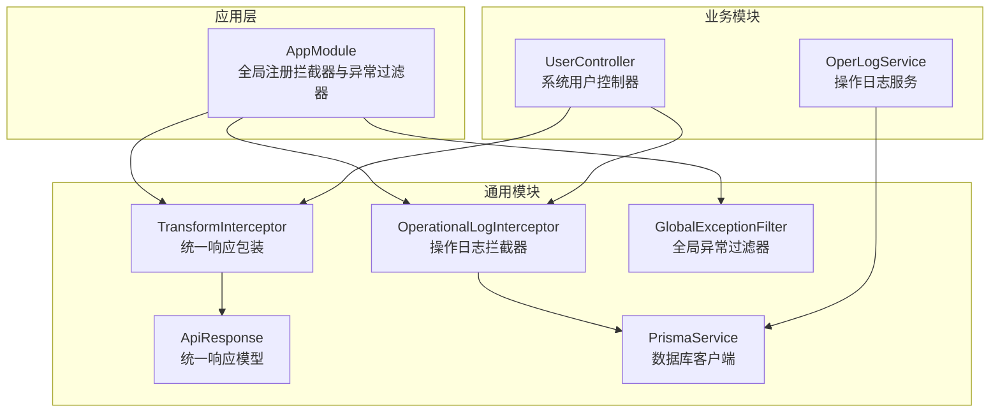
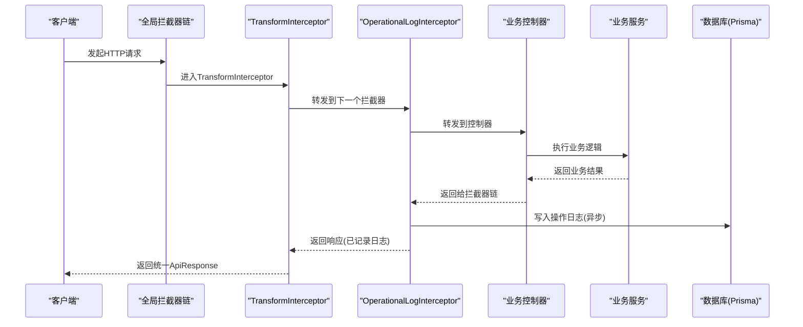
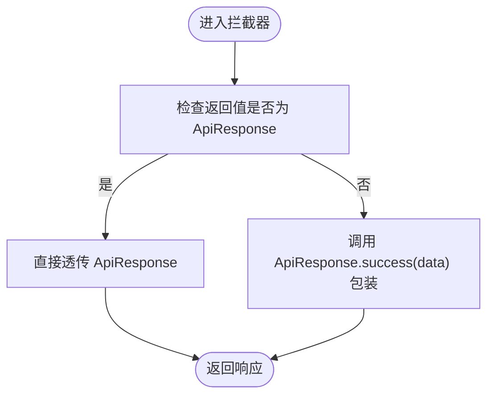
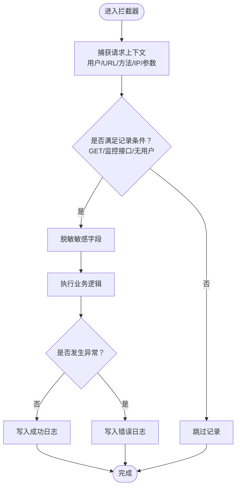
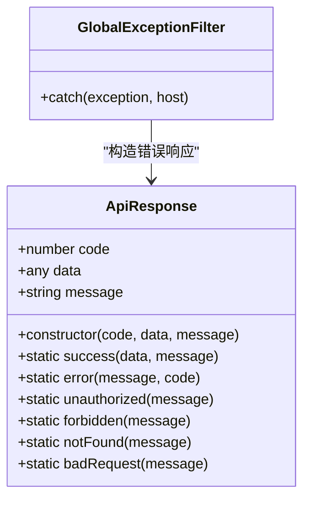
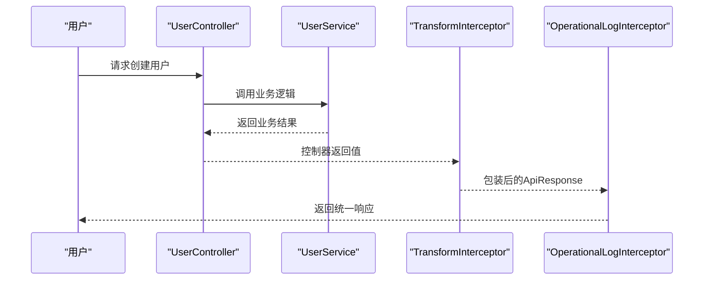
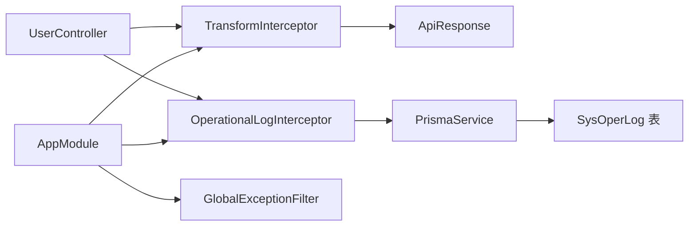

# 拦截器

<cite>
**本文引用的文件**
- [apps/backend/src/common/transform.interceptor.ts](file://apps/backend/src/common/transform.interceptor.ts)
- [apps/backend/src/common/oper-log.interceptor.ts](file://apps/backend/src/common/oper-log.interceptor.ts)
- [apps/backend/src/common/api-response.ts](file://apps/backend/src/common/api-response.ts)
- [apps/backend/src/common/exception.filter.ts](file://apps/backend/src/common/exception.filter.ts)
- [apps/backend/src/common/prisma.service.ts](file://apps/backend/src/common/prisma.service.ts)
- [apps/backend/src/app.module.ts](file://apps/backend/src/app.module.ts)
- [apps/backend/prisma/schema.prisma](file://apps/backend/prisma/schema.prisma)
- [apps/backend/src/modules/system/user/user.controller.ts](file://apps/backend/src/modules/system/user/user.controller.ts)
- [apps/backend/src/modules/system/user/user.service.ts](file://apps/backend/src/modules/system/user/user.service.ts)
- [apps/backend/src/modules/monitor/oper-log/oper-log.controller.ts](file://apps/backend/src/modules/monitor/oper-log/oper-log.controller.ts)
- [apps/backend/src/modules/monitor/oper-log/oper-log.service.ts](file://apps/backend/src/modules/monitor/oper-log/oper-log.service.ts)
</cite>

## 目录
1. [简介](#简介)
2. [项目结构与定位](#项目结构与定位)
3. [核心组件](#核心组件)
4. [架构总览](#架构总览)
5. [详细组件分析](#详细组件分析)
6. [依赖关系分析](#依赖关系分析)
7. [性能考量](#性能考量)
8. [故障排查指南](#故障排查指南)
9. [结论](#结论)
10. [附录：自定义拦截器开发指南与最佳实践](#附录自定义拦截器开发指南与最佳实践)

## 简介
本文件聚焦于 Nest-Admin-Pro 后端的两类关键拦截器：
- TransformInterceptor：统一响应包装，确保所有接口返回统一的 ApiResponse 格式。
- OperationalLogInterceptor：操作日志拦截器，负责捕获请求上下文、记录用户行为、持久化到数据库，并对敏感字段进行脱敏。

同时，文档覆盖拦截器的生命周期、错误处理、性能优化策略，并提供自定义拦截器的开发指南与最佳实践，帮助开发者在不侵入业务代码的前提下，实现一致的响应格式与完善的审计能力。

## 项目结构与定位
拦截器位于后端公共模块中，并通过全局提供者注册，作用于整个应用的所有路由。OperationalLogInterceptor 还依赖数据库（Prisma）进行日志写入；TransformInterceptor 依赖统一响应模型。

图表来源
- [apps/backend/src/app.module.ts:18-58](file://apps/backend/src/app.module.ts#L18-L58)
- [apps/backend/src/common/transform.interceptor.ts:11-29](file://apps/backend/src/common/transform.interceptor.ts#L11-L29)
- [apps/backend/src/common/oper-log.interceptor.ts:11-28](file://apps/backend/src/common/oper-log.interceptor.ts#L11-L28)
- [apps/backend/src/common/api-response.ts:1-35](file://apps/backend/src/common/api-response.ts#L1-L35)
- [apps/backend/src/common/exception.filter.ts:12-36](file://apps/backend/src/common/exception.filter.ts#L12-L36)
- [apps/backend/src/common/prisma.service.ts:1-22](file://apps/backend/src/common/prisma.service.ts#L1-L22)
- [apps/backend/src/modules/system/user/user.controller.ts:20-88](file://apps/backend/src/modules/system/user/user.controller.ts#L20-L88)
- [apps/backend/src/modules/monitor/oper-log/oper-log.service.ts:1-33](file://apps/backend/src/modules/monitor/oper-log/oper-log.service.ts#L1-L33)

章节来源
- [apps/backend/src/app.module.ts:18-58](file://apps/backend/src/app.module.ts#L18-L58)

## 核心组件
- TransformInterceptor：在请求处理完成后，将任意响应体包装为统一的 ApiResponse 结构，避免重复样板代码。
- OperationalLogInterceptor：在请求处理前后捕获上下文信息，记录用户行为、请求参数、响应结果或错误信息，并持久化到数据库。
- ApiResponse：统一响应载体，提供成功、错误、未授权、禁止、未找到、错误请求等静态方法。
- GlobalExceptionFilter：兜底异常过滤器，保证异常也能返回统一的 ApiResponse 格式。
- PrismaService：数据库连接与生命周期管理，OperationalLogInterceptor 通过它写入日志。

章节来源
- [apps/backend/src/common/transform.interceptor.ts:11-29](file://apps/backend/src/common/transform.interceptor.ts#L11-L29)
- [apps/backend/src/common/oper-log.interceptor.ts:11-28](file://apps/backend/src/common/oper-log.interceptor.ts#L11-L28)
- [apps/backend/src/common/api-response.ts:1-35](file://apps/backend/src/common/api-response.ts#L1-L35)
- [apps/backend/src/common/exception.filter.ts:12-36](file://apps/backend/src/common/exception.filter.ts#L12-L36)
- [apps/backend/src/common/prisma.service.ts:1-22](file://apps/backend/src/common/prisma.service.ts#L1-L22)

## 架构总览
拦截器在请求生命周期中的位置如下：
- 请求进入后，先经过全局拦截器链（TransformInterceptor 在前，OperationalLogInterceptor 在后）。
- 控制器执行业务逻辑，返回值被 TransformInterceptor 包装为 ApiResponse。
- OperationalLogInterceptor 记录请求上下文、参数、响应或错误、耗时与 IP 等信息。
- 异常发生时，GlobalExceptionFilter 将异常转换为统一响应格式。

图表来源
- [apps/backend/src/common/transform.interceptor.ts:15-28](file://apps/backend/src/common/transform.interceptor.ts#L15-L28)
- [apps/backend/src/common/oper-log.interceptor.ts:15-28](file://apps/backend/src/common/oper-log.interceptor.ts#L15-L28)
- [apps/backend/src/common/exception.filter.ts:16-35](file://apps/backend/src/common/exception.filter.ts#L16-L35)
- [apps/backend/src/common/prisma.service.ts:14-21](file://apps/backend/src/common/prisma.service.ts#L14-L21)

## 详细组件分析

### TransformInterceptor 数据转换机制
- 目标：将控制器返回的任意数据统一包装为 ApiResponse，确保前端一致的解析体验。
- 实现要点：
  - 检测返回值是否已经是 ApiResponse，若是则直接透传，避免重复包装。
  - 否则调用 ApiResponse.success(data) 包装为统一格式。
  - 使用 RxJS 的 map 操作符在 next.handle() 流上进行转换。
- 生命周期：作为第一个全局拦截器，最先拦截并最后输出响应。
- 错误处理：若业务抛出异常，由 GlobalExceptionFilter 统一转换为错误响应，TransformInterceptor 不会再次包装。

图表来源
- [apps/backend/src/common/transform.interceptor.ts:15-28](file://apps/backend/src/common/transform.interceptor.ts#L15-L28)
- [apps/backend/src/common/api-response.ts:12-14](file://apps/backend/src/common/api-response.ts#L12-L14)

章节来源
- [apps/backend/src/common/transform.interceptor.ts:11-29](file://apps/backend/src/common/transform.interceptor.ts#L11-L29)
- [apps/backend/src/common/api-response.ts:1-35](file://apps/backend/src/common/api-response.ts#L1-L35)

### OperationalLogInterceptor 操作日志记录
- 目标：记录用户行为轨迹，便于审计与问题回溯。
- 关键能力：
  - 请求上下文捕获：从请求对象获取用户信息、URL、方法、IP、参数等。
  - 敏感信息脱敏：对密码、令牌、授权、验证码等字段进行掩码处理。
  - 日志持久化：通过 Prisma 写入数据库，失败不影响主流程。
  - 条件记录：仅对非 GET 请求且非特定监控接口进行记录。
  - 模块名推断：根据 URL 推断模块名，用于分类统计。
  - 响应/错误区分：区分正常响应与异常，记录状态、错误消息与耗时。
- 生命周期：作为第二个全局拦截器，紧随 TransformInterceptor 之后，既可读取原始响应，也可感知异常。
- 错误处理：内部捕获写库异常，保证日志记录不会中断业务请求。

图表来源
- [apps/backend/src/common/oper-log.interceptor.ts:15-79](file://apps/backend/src/common/oper-log.interceptor.ts#L15-L79)
- [apps/backend/src/common/oper-log.interceptor.ts:30-61](file://apps/backend/src/common/oper-log.interceptor.ts#L30-L61)
- [apps/backend/src/common/prisma.service.ts:14-21](file://apps/backend/src/common/prisma.service.ts#L14-L21)

章节来源
- [apps/backend/src/common/oper-log.interceptor.ts:11-111](file://apps/backend/src/common/oper-log.interceptor.ts#L11-L111)
- [apps/backend/src/common/prisma.service.ts:1-22](file://apps/backend/src/common/prisma.service.ts#L1-L22)
- [apps/backend/prisma/schema.prisma:231-254](file://apps/backend/prisma/schema.prisma#L231-L254)

### 统一响应模型与异常过滤器
- ApiResponse：提供 success/error/unauthorized/forbidden/notFound/badRequest 等静态方法，确保前后端契约一致。
- GlobalExceptionFilter：兜底捕获所有未处理异常，将其转换为统一的 ApiResponse 错误响应，避免泄露内部细节。

图表来源
- [apps/backend/src/common/api-response.ts:1-35](file://apps/backend/src/common/api-response.ts#L1-L35)
- [apps/backend/src/common/exception.filter.ts:12-36](file://apps/backend/src/common/exception.filter.ts#L12-L36)

章节来源
- [apps/backend/src/common/api-response.ts:1-35](file://apps/backend/src/common/api-response.ts#L1-L35)
- [apps/backend/src/common/exception.filter.ts:12-36](file://apps/backend/src/common/exception.filter.ts#L12-L36)

### 典型业务流程示例
- 用户管理控制器调用：控制器接收请求，服务执行业务，返回数据。
- TransformInterceptor：将返回值包装为 ApiResponse。
- OperationalLogInterceptor：记录请求上下文与结果，写入数据库。

图表来源
- [apps/backend/src/modules/system/user/user.controller.ts:40-45](file://apps/backend/src/modules/system/user/user.controller.ts#L40-L45)
- [apps/backend/src/modules/system/user/user.service.ts:57-78](file://apps/backend/src/modules/system/user/user.service.ts#L57-L78)
- [apps/backend/src/common/transform.interceptor.ts:15-28](file://apps/backend/src/common/transform.interceptor.ts#L15-L28)
- [apps/backend/src/common/oper-log.interceptor.ts:15-28](file://apps/backend/src/common/oper-log.interceptor.ts#L15-L28)

章节来源
- [apps/backend/src/modules/system/user/user.controller.ts:1-89](file://apps/backend/src/modules/system/user/user.controller.ts#L1-L89)
- [apps/backend/src/modules/system/user/user.service.ts:1-144](file://apps/backend/src/modules/system/user/user.service.ts#L1-L144)
- [apps/backend/src/common/transform.interceptor.ts:11-29](file://apps/backend/src/common/transform.interceptor.ts#L11-L29)
- [apps/backend/src/common/oper-log.interceptor.ts:11-28](file://apps/backend/src/common/oper-log.interceptor.ts#L11-L28)

## 依赖关系分析
- TransformInterceptor 依赖 ApiResponse。
- OperationalLogInterceptor 依赖 PrismaService，写入 SysOperLog 表。
- AppModule 全局注册拦截器与异常过滤器，确保所有请求均受控。
- 业务控制器通过 Guard 保护，OperationalLogInterceptor 仅记录有用户上下文的请求。

图表来源
- [apps/backend/src/app.module.ts:39-55](file://apps/backend/src/app.module.ts#L39-L55)
- [apps/backend/src/common/transform.interceptor.ts](file://apps/backend/src/common/transform.interceptor.ts#L9)
- [apps/backend/src/common/oper-log.interceptor.ts](file://apps/backend/src/common/oper-log.interceptor.ts#L9)
- [apps/backend/src/common/prisma.service.ts:1-22](file://apps/backend/src/common/prisma.service.ts#L1-L22)
- [apps/backend/prisma/schema.prisma:231-254](file://apps/backend/prisma/schema.prisma#L231-L254)
- [apps/backend/src/modules/system/user/user.controller.ts:20-88](file://apps/backend/src/modules/system/user/user.controller.ts#L20-L88)

章节来源
- [apps/backend/src/app.module.ts:18-58](file://apps/backend/src/app.module.ts#L18-L58)
- [apps/backend/prisma/schema.prisma:231-254](file://apps/backend/prisma/schema.prisma#L231-L254)

## 性能考量
- 拦截器链顺序：TransformInterceptor 在前，OperationalLogInterceptor 在后，避免重复包装与多次 IO。
- 异步日志写入：OperationalLogInterceptor 对数据库写入采用异步方式，捕获异常不阻断主流程，降低对业务延迟的影响。
- 参数大小限制：对请求/响应序列化结果进行长度截断，防止超长文本占用过多内存与网络带宽。
- 脱敏成本：对敏感字段进行递归脱敏，建议在高并发场景下避免对大对象进行深度遍历，必要时可结合缓存策略。
- 数据库连接：PrismaService 管理连接生命周期，确保连接池健康与断开安全。

章节来源
- [apps/backend/src/common/oper-log.interceptor.ts:58-60](file://apps/backend/src/common/oper-log.interceptor.ts#L58-L60)
- [apps/backend/src/common/oper-log.interceptor.ts:101-109](file://apps/backend/src/common/oper-log.interceptor.ts#L101-L109)
- [apps/backend/src/common/prisma.service.ts:14-21](file://apps/backend/src/common/prisma.service.ts#L14-L21)

## 故障排查指南
- 响应格式异常
  - 症状：前端收到非统一格式响应。
  - 排查：确认 TransformInterceptor 是否正确注册为全局拦截器；检查控制器是否显式返回 ApiResponse。
  - 参考路径：[apps/backend/src/app.module.ts:48-55](file://apps/backend/src/app.module.ts#L48-L55)，[apps/backend/src/common/transform.interceptor.ts:15-28](file://apps/backend/src/common/transform.interceptor.ts#L15-L28)
- 日志未入库
  - 症状：后台无操作日志记录。
  - 排查：确认 OperationalLogInterceptor 已注册；检查 shouldLog 判定条件（GET/监控接口/无用户）；确认 Prisma 连接正常。
  - 参考路径：[apps/backend/src/common/oper-log.interceptor.ts:63-70](file://apps/backend/src/common/oper-log.interceptor.ts#L63-L70)，[apps/backend/src/common/prisma.service.ts:14-21](file://apps/backend/src/common/prisma.service.ts#L14-L21)
- 敏感信息泄露
  - 症状：日志中出现密码、令牌等敏感字段。
  - 排查：确认 redact 方法对相关字段进行了掩码处理；检查字段命名是否包含关键词。
  - 参考路径：[apps/backend/src/common/oper-log.interceptor.ts:81-99](file://apps/backend/src/common/oper-log.interceptor.ts#L81-L99)
- 异常未统一
  - 症状：异常响应格式不一致。
  - 排查：确认 GlobalExceptionFilter 已注册为全局过滤器；检查控制器是否抛出了未捕获异常。
  - 参考路径：[apps/backend/src/app.module.ts:44-47](file://apps/backend/src/app.module.ts#L44-L47)，[apps/backend/src/common/exception.filter.ts:16-35](file://apps/backend/src/common/exception.filter.ts#L16-L35)

章节来源
- [apps/backend/src/app.module.ts:39-55](file://apps/backend/src/app.module.ts#L39-L55)
- [apps/backend/src/common/oper-log.interceptor.ts:63-70](file://apps/backend/src/common/oper-log.interceptor.ts#L63-L70)
- [apps/backend/src/common/oper-log.interceptor.ts:81-99](file://apps/backend/src/common/oper-log.interceptor.ts#L81-L99)
- [apps/backend/src/common/exception.filter.ts:16-35](file://apps/backend/src/common/exception.filter.ts#L16-L35)

## 结论
- TransformInterceptor 提供了统一的响应包装，简化了前端消费与错误处理。
- OperationalLogInterceptor 提供了完整的用户行为审计能力，具备条件记录、敏感信息脱敏与异步写库等特性。
- 两者配合 GlobalExceptionFilter，形成“统一响应 + 统一日志 + 兜底异常”的完整可观测性体系。
- 在生产环境中，建议结合限流、缓存与数据库连接池配置，进一步提升拦截器链的稳定性与性能。

## 附录：自定义拦截器开发指南与最佳实践
- 开发步骤
  - 定义拦截器类并实现 NestInterceptor 接口。
  - 在构造函数中注入所需依赖（如服务、配置、上下文工具）。
  - 在 intercept 中使用 RxJS 的 pipe 操作符组合 tap/catchError/map 等操作，实现前置处理、后置处理与异常处理。
  - 通过全局提供者注册拦截器，确保其生效范围覆盖目标模块或全站。
- 最佳实践
  - 明确拦截器职责边界：单一职责，避免在一个拦截器中做过多无关的事情。
  - 保持幂等与无副作用：拦截器不应改变业务状态，仅做包装、记录、转换等。
  - 异步与容错：对外部系统（如日志、缓存、远程服务）采用异步调用与异常捕获，避免阻断主流程。
  - 参数与日志安全：对敏感字段进行脱敏；对超长日志进行截断；控制日志粒度与频率。
  - 性能优先：避免在拦截器中进行昂贵计算；合理使用缓存与批量写入。
  - 可观测性：为拦截器添加必要的日志与指标，便于问题定位与性能分析。
- 示例参考
  - TransformInterceptor：统一响应包装与透传逻辑。
  - OperationalLogInterceptor：上下文捕获、条件记录、脱敏与异步写库。
  - GlobalExceptionFilter：统一异常响应格式。

章节来源
- [apps/backend/src/common/transform.interceptor.ts:11-29](file://apps/backend/src/common/transform.interceptor.ts#L11-L29)
- [apps/backend/src/common/oper-log.interceptor.ts:11-28](file://apps/backend/src/common/oper-log.interceptor.ts#L11-L28)
- [apps/backend/src/common/exception.filter.ts:12-36](file://apps/backend/src/common/exception.filter.ts#L12-L36)
- [apps/backend/src/app.module.ts:39-55](file://apps/backend/src/app.module.ts#L39-L55)