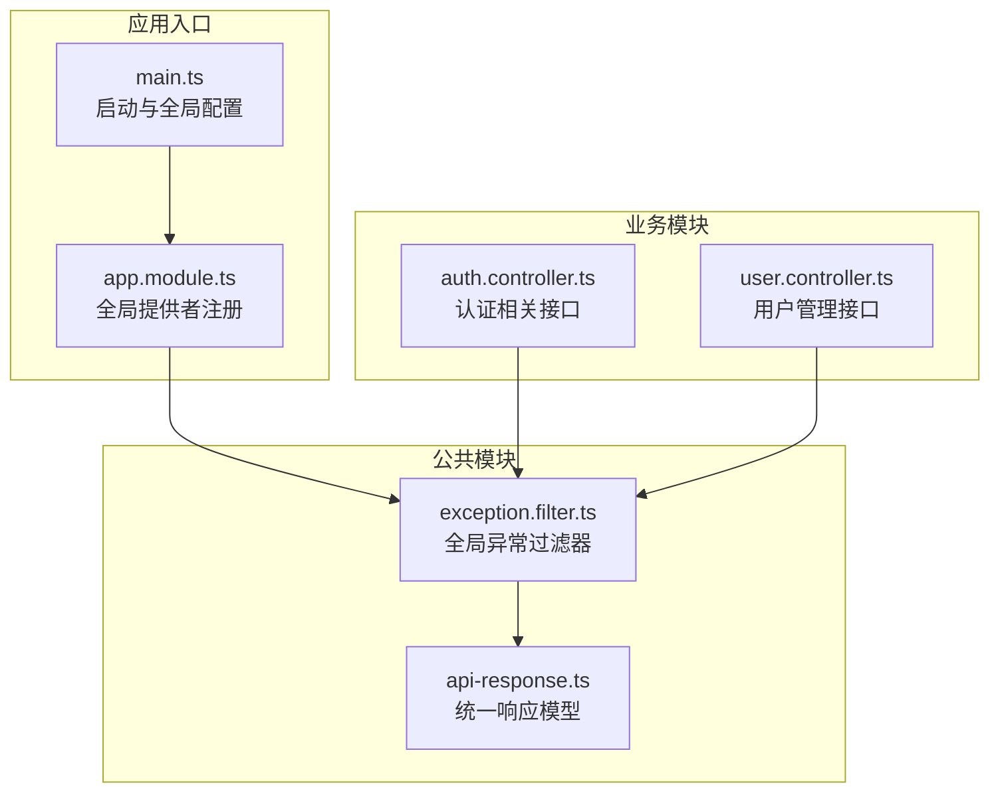
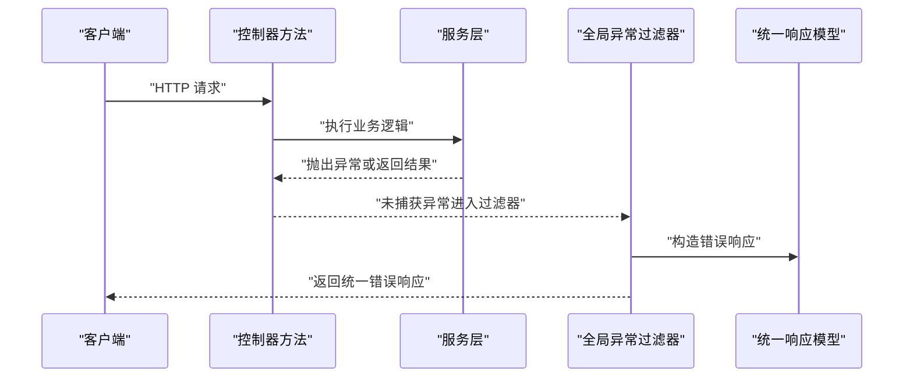
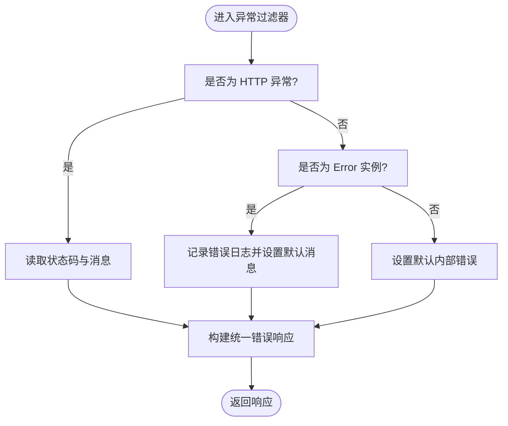
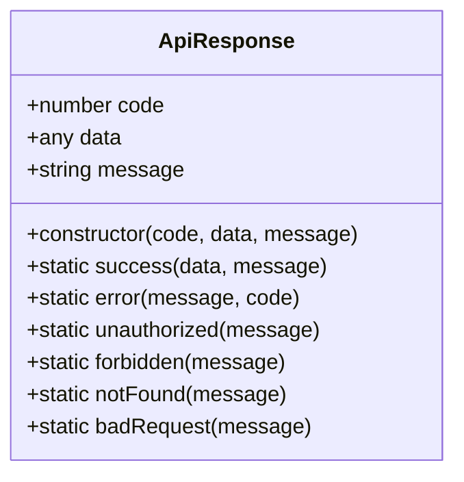
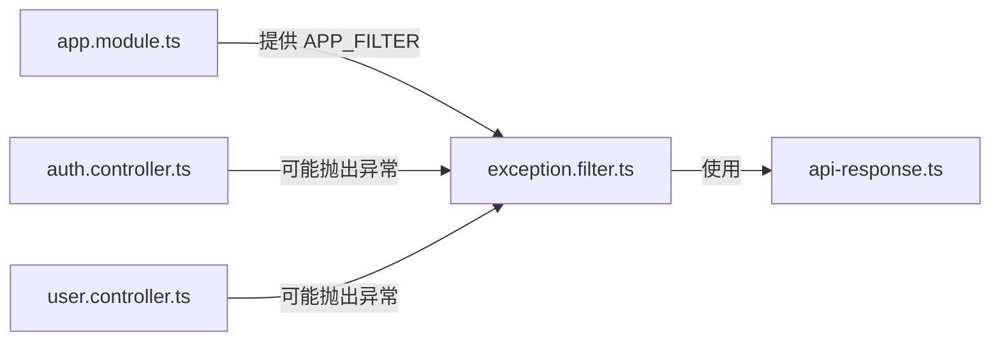

# 过滤器

<cite>
**本文引用的文件**
- [apps/backend/src/common/exception.filter.ts](file://apps/backend/src/common/exception.filter.ts)
- [apps/backend/src/common/api-response.ts](file://apps/backend/src/common/api-response.ts)
- [apps/backend/src/app.module.ts](file://apps/backend/src/app.module.ts)
- [apps/backend/src/main.ts](file://apps/backend/src/main.ts)
- [apps/backend/src/modules/system/user/user.controller.ts](file://apps/backend/src/modules/system/user/user.controller.ts)
- [apps/backend/src/auth/auth.controller.ts](file://apps/backend/src/auth/auth.controller.ts)
</cite>

## 目录
1. [简介](#简介)
2. [项目结构](#项目结构)
3. [核心组件](#核心组件)
4. [架构总览](#架构总览)
5. [详细组件分析](#详细组件分析)
6. [依赖关系分析](#依赖关系分析)
7. [性能考量](#性能考量)
8. [故障排查指南](#故障排查指南)
9. [结论](#结论)
10. [附录](#附录)

## 简介
本文件聚焦 Nest-Admin-Pro 后端（apps/backend）中的异常过滤器与统一错误响应机制，系统性阐述以下内容：
- 异常过滤器的捕获范围与处理流程
- HTTP 异常与未捕获异常的差异化处理策略
- 统一错误响应格式的设计与扩展方法
- 业务异常、参数异常与系统异常的分类处理建议
- 异常日志记录、错误信息国际化与安全返回策略
- 自定义异常类型的创建指南与最佳实践

## 项目结构
后端采用标准 NestJS 结构，异常过滤器与统一响应模型位于公共模块中，并通过全局提供者在应用启动时注册。

图表来源
- [apps/backend/src/main.ts:1-48](file://apps/backend/src/main.ts#L1-L48)
- [apps/backend/src/app.module.ts:14-56](file://apps/backend/src/app.module.ts#L14-L56)
- [apps/backend/src/common/exception.filter.ts:12-37](file://apps/backend/src/common/exception.filter.ts#L12-L37)
- [apps/backend/src/common/api-response.ts:1-35](file://apps/backend/src/common/api-response.ts#L1-L35)
- [apps/backend/src/auth/auth.controller.ts:1-87](file://apps/backend/src/auth/auth.controller.ts#L1-L87)
- [apps/backend/src/modules/system/user/user.controller.ts:1-89](file://apps/backend/src/modules/system/user/user.controller.ts#L1-L89)

章节来源
- [apps/backend/src/main.ts:1-48](file://apps/backend/src/main.ts#L1-L48)
- [apps/backend/src/app.module.ts:14-56](file://apps/backend/src/app.module.ts#L14-L56)

## 核心组件
- 全局异常过滤器：负责捕获所有未处理异常，区分 HTTP 异常与非 HTTP 异常，构造统一错误响应并写入日志。
- 统一响应模型：提供成功与多种错误状态的静态工厂方法，确保前后端一致的响应结构。

关键职责与行为
- 捕获异常：使用装饰器捕获所有异常类型。
- 分类处理：对已知 HTTP 异常读取状态码与消息；对未知错误记录堆栈并返回通用内部错误。
- 统一输出：通过统一响应模型封装错误信息，保证字段一致性。
- 日志记录：对未处理错误进行错误级别日志记录，便于追踪。

章节来源
- [apps/backend/src/common/exception.filter.ts:12-37](file://apps/backend/src/common/exception.filter.ts#L12-L37)
- [apps/backend/src/common/api-response.ts:12-35](file://apps/backend/src/common/api-response.ts#L12-L35)

## 架构总览
下图展示从控制器到异常过滤器再到统一响应的整体调用链路与数据流。

图表来源
- [apps/backend/src/common/exception.filter.ts:16-36](file://apps/backend/src/common/exception.filter.ts#L16-L36)
- [apps/backend/src/common/api-response.ts:16-18](file://apps/backend/src/common/api-response.ts#L16-L18)

## 详细组件分析

### 全局异常过滤器（ExceptionFilter）
- 捕获范围：装饰器声明捕获所有异常。
- 处理策略：
  - 若为 HTTP 异常：读取状态码与响应体中的消息，优先使用结构化消息字段。
  - 若为普通 Error：记录错误日志并返回通用内部错误。
- 输出格式：统一使用统一响应模型的错误工厂方法生成响应体。

图表来源
- [apps/backend/src/common/exception.filter.ts:23-35](file://apps/backend/src/common/exception.filter.ts#L23-L35)

章节来源
- [apps/backend/src/common/exception.filter.ts:12-37](file://apps/backend/src/common/exception.filter.ts#L12-L37)

### 统一响应模型（ApiResponse）
- 成功响应：提供静态工厂方法，便于在正常流程中返回统一结构。
- 错误响应：提供常见错误码的工厂方法，如未授权、禁止访问、未找到、错误请求与内部错误等。
- 扩展建议：新增业务错误码时，可按需在该模型中添加对应工厂方法，保持命名与语义一致。

图表来源
- [apps/backend/src/common/api-response.ts:1-35](file://apps/backend/src/common/api-response.ts#L1-L35)

章节来源
- [apps/backend/src/common/api-response.ts:12-35](file://apps/backend/src/common/api-response.ts#L12-L35)

### 控制器与异常传播
- 控制器方法在业务失败或参数校验失败时抛出异常，交由全局异常过滤器统一处理。
- 示例场景：
  - 参数校验失败：由全局验证管道触发 HTTP 异常，过滤器按 HTTP 状态码返回统一错误。
  - 业务异常：服务层抛出业务异常，过滤器识别为 HTTP 异常并返回相应消息。
  - 未预期错误：服务层抛出 Error，过滤器记录日志并返回内部错误。

章节来源
- [apps/backend/src/modules/system/user/user.controller.ts:26-87](file://apps/backend/src/modules/system/user/user.controller.ts#L26-L87)
- [apps/backend/src/auth/auth.controller.ts:13-86](file://apps/backend/src/auth/auth.controller.ts#L13-L86)

## 依赖关系分析
全局异常过滤器通过依赖注入在应用模块中注册为全局提供者，确保所有路由均受其保护。

图表来源
- [apps/backend/src/app.module.ts:44-47](file://apps/backend/src/app.module.ts#L44-L47)
- [apps/backend/src/common/exception.filter.ts:10](file://apps/backend/src/common/exception.filter.ts#L10)
- [apps/backend/src/common/api-response.ts:1-35](file://apps/backend/src/common/api-response.ts#L1-L35)

章节来源
- [apps/backend/src/app.module.ts:14-56](file://apps/backend/src/app.module.ts#L14-L56)

## 性能考量
- 过滤器仅在异常发生时被调用，对正常路径无性能影响。
- 日志记录为同步操作，建议在生产环境结合日志系统进行采样与聚合，避免高频错误导致日志风暴。
- 响应序列化开销极低，统一模型字段简单明确，不会引入额外计算成本。

## 故障排查指南
- 未捕获异常
  - 现象：返回通用内部错误且控制台出现错误日志。
  - 排查：检查服务层是否抛出 Error；确认过滤器是否正确注册为全局提供者。
- HTTP 异常未按预期返回
  - 现象：状态码或消息与期望不符。
  - 排查：确认服务层抛出的异常是否为 HTTP 异常；检查响应体结构是否包含消息字段。
- 统一响应字段缺失
  - 现象：前端收到的响应缺少特定字段。
  - 排查：确认使用了统一响应模型的工厂方法；若需扩展字段，请在模型中增加相应支持。

章节来源
- [apps/backend/src/common/exception.filter.ts:20-35](file://apps/backend/src/common/exception.filter.ts#L20-L35)
- [apps/backend/src/app.module.ts:44-47](file://apps/backend/src/app.module.ts#L44-L47)

## 结论
本项目的异常过滤器实现了“统一捕获、分类处理、标准化输出”的核心目标，配合统一响应模型，为前后端交互提供了稳定一致的错误契约。通过全局注册与清晰的处理流程，既保证了开发效率，也为后续扩展（如国际化、更细粒度的错误码）奠定了基础。

## 附录

### 异常分类处理策略（建议）
- 业务异常
  - 触发方式：服务层抛出带业务含义的 HTTP 异常。
  - 处理要点：保留业务消息与状态码，必要时附加业务错误码。
- 参数异常
  - 触发方式：全局验证管道自动抛出 HTTP 异常。
  - 处理要点：直接透传验证错误消息，确保前端可读性强。
- 系统异常
  - 触发方式：未捕获的 Error 或底层异常。
  - 处理要点：记录详细日志并返回通用内部错误，避免泄露敏感信息。

### 错误信息国际化与安全返回
- 国际化
  - 在服务层根据上下文选择本地化消息，再交由过滤器统一输出。
  - 可在统一响应模型中扩展语言字段，便于前端按需渲染。
- 安全返回
  - 对于系统异常，仅返回通用提示，不暴露堆栈与内部细节。
  - 对业务异常，可按需返回简明的业务提示，避免过度引导攻击者。

### 自定义异常类型的创建指南
- 设计原则
  - 明确异常用途与状态码映射，便于过滤器正确识别。
  - 在异常响应体中提供可读的消息字段，提升前端体验。
- 扩展步骤
  - 在服务层抛出自定义异常。
  - 确保异常对象包含状态码与消息字段，以便过滤器读取。
  - 如需新增统一响应类型，可在统一响应模型中添加对应工厂方法。