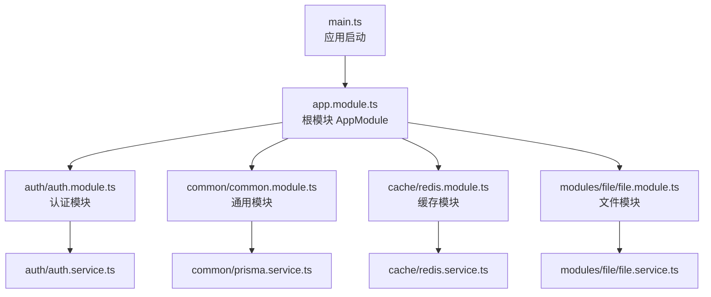
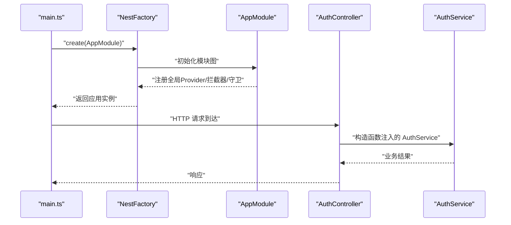
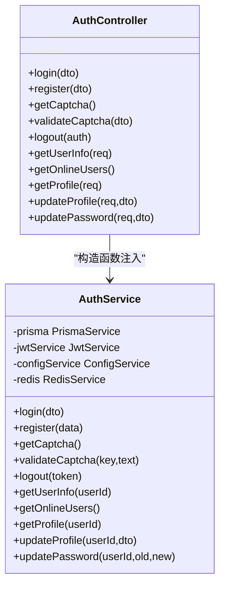
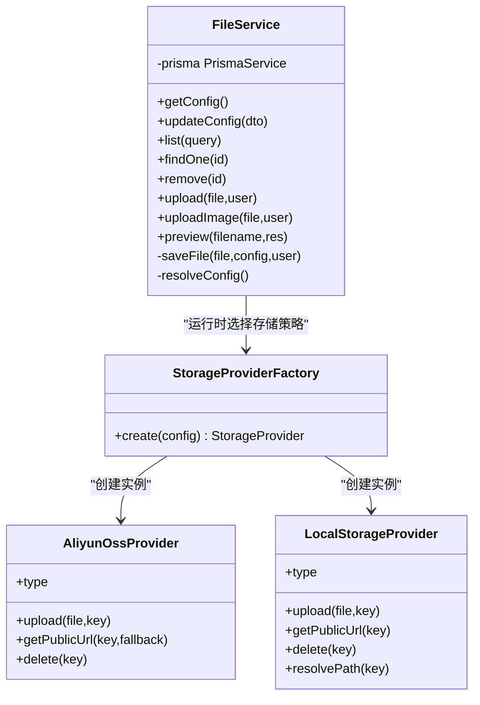
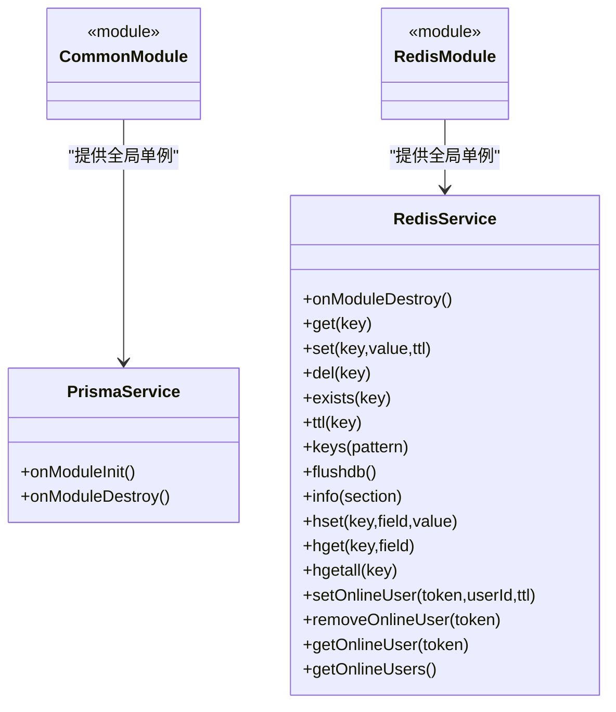
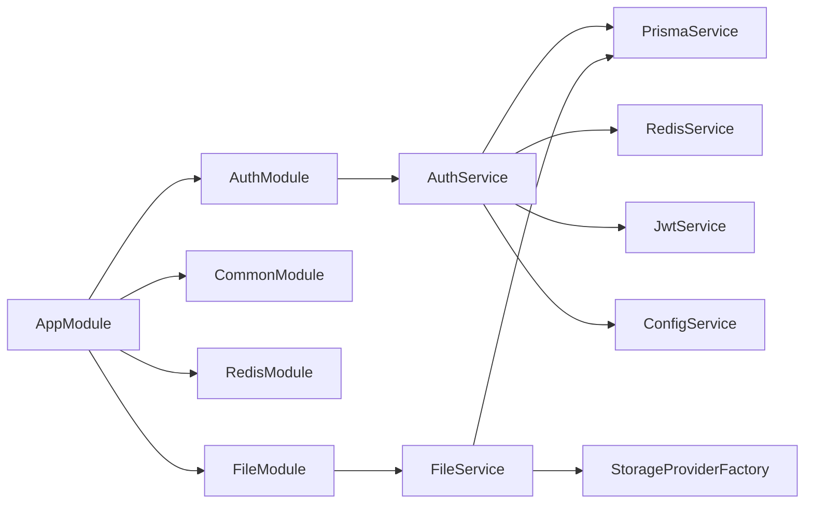

# 依赖注入机制

<cite>
**本文引用的文件**
- [apps/backend/src/app.module.ts](file://apps/backend/src/app.module.ts)
- [apps/backend/src/main.ts](file://apps/backend/src/main.ts)
- [apps/backend/src/auth/auth.module.ts](file://apps/backend/src/auth/auth.module.ts)
- [apps/backend/src/auth/auth.service.ts](file://apps/backend/src/auth/auth.service.ts)
- [apps/backend/src/auth/auth.controller.ts](file://apps/backend/src/auth/auth.controller.ts)
- [apps/backend/src/common/common.module.ts](file://apps/backend/src/common/common.module.ts)
- [apps/backend/src/common/prisma.service.ts](file://apps/backend/src/common/prisma.service.ts)
- [apps/backend/src/cache/redis.module.ts](file://apps/backend/src/cache/redis.module.ts)
- [apps/backend/src/cache/redis.service.ts](file://apps/backend/src/cache/redis.service.ts)
- [apps/backend/src/modules/file/file.module.ts](file://apps/backend/src/modules/file/file.module.ts)
- [apps/backend/src/modules/file/file.service.ts](file://apps/backend/src/modules/file/file.service.ts)
- [apps/backend/src/modules/file/storage/storage-provider.factory.ts](file://apps/backend/src/modules/file/storage/storage-provider.factory.ts)
- [apps/backend/src/modules/file/storage/aliyun-oss.provider.ts](file://apps/backend/src/modules/file/storage/aliyun-oss.provider.ts)
- [apps/backend/src/modules/file/storage/local.provider.ts](file://apps/backend/src/modules/file/storage/local.provider.ts)
</cite>

## 目录
1. [简介](#简介)
2. [项目结构](#项目结构)
3. [核心组件](#核心组件)
4. [架构总览](#架构总览)
5. [详细组件分析](#详细组件分析)
6. [依赖关系分析](#依赖关系分析)
7. [性能考量](#性能考量)
8. [故障排查指南](#故障排查指南)
9. [结论](#结论)

## 简介
本文件系统性梳理 Nest-Admin-Pro 后端（apps/backend）中的依赖注入机制，覆盖以下主题：
- NestJS 依赖注入容器工作原理与配置方式
- @Injectable() 装饰器的使用与作用域
- Provider 的注册与注入方式（类 Provider、异步 Provider、工厂 Provider、值 Provider）
- 模块间依赖关系与循环依赖处理策略
- 单例（Singleton）、工厂（Factory）、值（Value）等 Provider 类型的实际应用
- 最佳实践与常见陷阱

## 项目结构
后端采用标准的 NestJS 应用结构，入口在 main.ts 中创建 NestFactory 实例并加载根模块 AppModule。AppModule 将各功能模块（认证、系统、监控、文件、生成等）聚合为统一的应用边界；CommonModule 与 RedisModule 通过 @Global() 提供全局可注入的服务。

图表来源
- [apps/backend/src/main.ts:1-48](file://apps/backend/src/main.ts#L1-L48)
- [apps/backend/src/app.module.ts:1-59](file://apps/backend/src/app.module.ts#L1-L59)
- [apps/backend/src/auth/auth.module.ts:1-29](file://apps/backend/src/auth/auth.module.ts#L1-L29)
- [apps/backend/src/common/common.module.ts:1-9](file://apps/backend/src/common/common.module.ts#L1-L9)
- [apps/backend/src/cache/redis.module.ts:1-9](file://apps/backend/src/cache/redis.module.ts#L1-L9)
- [apps/backend/src/modules/file/file.module.ts:1-10](file://apps/backend/src/modules/file/file.module.ts#L1-L10)

章节来源
- [apps/backend/src/main.ts:1-48](file://apps/backend/src/main.ts#L1-L48)
- [apps/backend/src/app.module.ts:1-59](file://apps/backend/src/app.module.ts#L1-L59)

## 核心组件
- 根模块与全局 Provider
  - 根模块 AppModule 导入多个子模块，并通过 providers 注册全局守卫、过滤器与拦截器，实现跨模块生效。
  - CommonModule 与 RedisModule 使用 @Global() 声明全局单例服务，使 PrismaService 与 RedisService 在任意模块中均可直接注入。
- 控制器与服务
  - 控制器通过构造函数注入服务，体现依赖注入的“消费方”角色。
  - 服务通过 @Injectable() 声明为可注入单元，内部可继续注入其他服务或工具类。

章节来源
- [apps/backend/src/app.module.ts:18-57](file://apps/backend/src/app.module.ts#L18-L57)
- [apps/backend/src/common/common.module.ts:1-9](file://apps/backend/src/common/common.module.ts#L1-L9)
- [apps/backend/src/cache/redis.module.ts:1-9](file://apps/backend/src/cache/redis.module.ts#L1-L9)
- [apps/backend/src/auth/auth.controller.ts:1-87](file://apps/backend/src/auth/auth.controller.ts#L1-L87)

## 架构总览
下图展示应用启动到请求处理的关键流程：NestFactory 创建应用实例，加载 AppModule，随后控制器按需从容器解析服务实例。

图表来源
- [apps/backend/src/main.ts:8-46](file://apps/backend/src/main.ts#L8-L46)
- [apps/backend/src/app.module.ts:18-57](file://apps/backend/src/app.module.ts#L18-L57)
- [apps/backend/src/auth/auth.controller.ts:10-11](file://apps/backend/src/auth/auth.controller.ts#L10-L11)
- [apps/backend/src/auth/auth.service.ts:20-27](file://apps/backend/src/auth/auth.service.ts#L20-L27)

## 详细组件分析

### 认证模块与服务注入
- 模块装配
  - AuthModule 通过 JwtModule.registerAsync 异步注册 JWT 配置，依赖 ConfigModule 与 ConfigService 获取运行时配置。
  - providers 列表声明了 AuthService、JwtStrategy、JwtAuthGuard、RolesGuard、PermissionGuard，供模块内外使用。
- 服务注入
  - AuthService 使用 @Injectable() 并在构造函数中注入 PrismaService、JwtService、ConfigService、RedisService，形成多依赖协作。
- 控制器注入
  - AuthController 通过构造函数注入 AuthService，控制器层不直接管理业务细节，仅负责路由与参数校验。

图表来源
- [apps/backend/src/auth/auth.controller.ts:10-87](file://apps/backend/src/auth/auth.controller.ts#L10-L87)
- [apps/backend/src/auth/auth.service.ts:20-27](file://apps/backend/src/auth/auth.service.ts#L20-L27)

章节来源
- [apps/backend/src/auth/auth.module.ts:11-28](file://apps/backend/src/auth/auth.module.ts#L11-L28)
- [apps/backend/src/auth/auth.service.ts:20-27](file://apps/backend/src/auth/auth.service.ts#L20-L27)
- [apps/backend/src/auth/auth.controller.ts:10-11](file://apps/backend/src/auth/auth.controller.ts#L10-L11)

### 文件模块与存储 Provider 工厂
- 模块装配
  - FileModule 声明 FileService 作为可注入服务，并导出以供其他模块使用。
- 存储策略选择
  - StorageProviderFactory 根据配置动态创建具体存储提供者（如阿里云 OSS、本地存储等），体现“工厂 Provider”的思想。
- 服务注入
  - FileService 通过构造函数注入 PrismaService，用于持久化文件元数据；同时使用 StorageProviderFactory 进行运行时策略选择。

图表来源
- [apps/backend/src/modules/file/file.module.ts:5-9](file://apps/backend/src/modules/file/file.module.ts#L5-L9)
- [apps/backend/src/modules/file/file.service.ts:41-43](file://apps/backend/src/modules/file/file.service.ts#L41-L43)
- [apps/backend/src/modules/file/storage/storage-provider.factory.ts:8-24](file://apps/backend/src/modules/file/storage/storage-provider.factory.ts#L8-L24)
- [apps/backend/src/modules/file/storage/aliyun-oss.provider.ts:6-50](file://apps/backend/src/modules/file/storage/aliyun-oss.provider.ts#L6-L50)
- [apps/backend/src/modules/file/storage/local.provider.ts:6-45](file://apps/backend/src/modules/file/storage/local.provider.ts#L6-L45)

章节来源
- [apps/backend/src/modules/file/file.module.ts:1-10](file://apps/backend/src/modules/file/file.module.ts#L1-L10)
- [apps/backend/src/modules/file/file.service.ts:41-43](file://apps/backend/src/modules/file/file.service.ts#L41-L43)
- [apps/backend/src/modules/file/storage/storage-provider.factory.ts:1-25](file://apps/backend/src/modules/file/storage/storage-provider.factory.ts#L1-L25)

### 全局模块与单例服务
- 全局单例
  - CommonModule 与 RedisModule 使用 @Global() 声明，使 PrismaService 与 RedisService 成为全局单例，可在应用任意位置注入使用。
- 生命周期钩子
  - PrismaService 在 onModuleInit/onModuleDestroy 中完成数据库连接与断开，确保资源正确释放。
  - RedisService 在销毁时调用 quit()，保证连接池清理。

图表来源
- [apps/backend/src/common/common.module.ts:4-8](file://apps/backend/src/common/common.module.ts#L4-L8)
- [apps/backend/src/common/prisma.service.ts:4-22](file://apps/backend/src/common/prisma.service.ts#L4-L22)
- [apps/backend/src/cache/redis.module.ts:4-8](file://apps/backend/src/cache/redis.module.ts#L4-L8)
- [apps/backend/src/cache/redis.service.ts:5-27](file://apps/backend/src/cache/redis.service.ts#L5-L27)

章节来源
- [apps/backend/src/common/common.module.ts:1-9](file://apps/backend/src/common/common.module.ts#L1-L9)
- [apps/backend/src/cache/redis.module.ts:1-9](file://apps/backend/src/cache/redis.module.ts#L1-L9)
- [apps/backend/src/common/prisma.service.ts:14-21](file://apps/backend/src/common/prisma.service.ts#L14-L21)
- [apps/backend/src/cache/redis.service.ts:25-27](file://apps/backend/src/cache/redis.service.ts#L25-L27)

### Provider 类型与配置示例

- 类 Provider（默认单例）
  - 通过 @Injectable() 声明，Nest 默认以单例模式注册，适合无状态或线程安全的服务。
  - 示例：AuthService、FileService、PrismaService、RedisService。
  
  章节来源
  - [apps/backend/src/auth/auth.service.ts:20-27](file://apps/backend/src/auth/auth.service.ts#L20-L27)
  - [apps/backend/src/modules/file/file.service.ts:41-43](file://apps/backend/src/modules/file/file.service.ts#L41-L43)
  - [apps/backend/src/common/prisma.service.ts:4-5](file://apps/backend/src/common/prisma.service.ts#L4-L5)
  - [apps/backend/src/cache/redis.service.ts:4-5](file://apps/backend/src/cache/redis.service.ts#L4-L5)

- 异步 Provider（useFactory + inject）
  - 通过 JwtModule.registerAsync 展示 useFactory + inject 的异步配置模式，常用于基于 ConfigService 的动态配置。
  
  章节来源
  - [apps/backend/src/auth/auth.module.ts:14-23](file://apps/backend/src/auth/auth.module.ts#L14-L23)

- 工厂 Provider（运行时策略选择）
  - StorageProviderFactory.create(config) 动态创建具体存储提供者，体现“工厂 Provider”在运行时根据配置选择实现的能力。
  
  章节来源
  - [apps/backend/src/modules/file/storage/storage-provider.factory.ts:8-24](file://apps/backend/src/modules/file/storage/storage-provider.factory.ts#L8-L24)

- 值 Provider（常量/配置）
  - 未在代码中直接出现显式 provide/inject 值 Provider 的示例；但可通过 useValue 注册常量或外部实例，适用于需要注入固定值或外部 SDK 实例的场景。
  - 该类型属于 NestJS 标准能力，建议在需要注入固定配置或第三方客户端实例时使用。

- 全局 Provider（@Global）
  - CommonModule 与 RedisModule 使用 @Global() 将服务提升为全局单例，避免在每个模块重复导入。
  
  章节来源
  - [apps/backend/src/common/common.module.ts:4](file://apps/backend/src/common/common.module.ts#L4)
  - [apps/backend/src/cache/redis.module.ts:4](file://apps/backend/src/cache/redis.module.ts#L4)

## 依赖关系分析
- 模块依赖
  - AppModule 组合多个功能模块，形成清晰的分层边界。
  - AuthModule 内部依赖 JwtModule 与 PassportModule，并通过 ConfigService 获取运行时配置。
  - FileModule 依赖 PrismaService 与 StorageProviderFactory，实现文件元数据持久化与存储策略解耦。
- 服务依赖
  - AuthService 依赖 PrismaService、JwtService、ConfigService、RedisService，体现多服务协作。
  - FileService 依赖 PrismaService 与 StorageProviderFactory，实现配置驱动的存储策略切换。
- 循环依赖处理
  - 代码中未发现直接的 A->B->A 的循环依赖；若未来扩展中出现循环依赖，可采用“延迟注入”（通过类型参数或字符串令牌）或拆分模块/服务降低耦合。

图表来源
- [apps/backend/src/app.module.ts:18-38](file://apps/backend/src/app.module.ts#L18-L38)
- [apps/backend/src/auth/auth.module.ts:12-26](file://apps/backend/src/auth/auth.module.ts#L12-L26)
- [apps/backend/src/auth/auth.service.ts:22-26](file://apps/backend/src/auth/auth.service.ts#L22-L26)
- [apps/backend/src/modules/file/file.module.ts:5-8](file://apps/backend/src/modules/file/file.module.ts#L5-L8)
- [apps/backend/src/modules/file/file.service.ts:42-43](file://apps/backend/src/modules/file/file.service.ts#L42-L43)

章节来源
- [apps/backend/src/app.module.ts:18-38](file://apps/backend/src/app.module.ts#L18-L38)
- [apps/backend/src/auth/auth.module.ts:12-26](file://apps/backend/src/auth/auth.module.ts#L12-L26)
- [apps/backend/src/auth/auth.service.ts:22-26](file://apps/backend/src/auth/auth.service.ts#L22-L26)
- [apps/backend/src/modules/file/file.module.ts:5-8](file://apps/backend/src/modules/file/file.module.ts#L5-L8)
- [apps/backend/src/modules/file/file.service.ts:42-43](file://apps/backend/src/modules/file/file.service.ts#L42-L43)

## 性能考量
- 单例复用
  - 使用 @Injectable() 默认单例，减少对象创建与上下文切换开销；对有状态或非线程安全的对象应谨慎设计。
- 异步配置
  - 通过 useFactory + inject 的异步 Provider 可在启动阶段完成外部依赖初始化，避免运行时阻塞。
- 缓存与连接
  - RedisService 与 PrismaService 分别管理连接生命周期，确保资源及时释放，避免内存泄漏。
- 工厂策略
  - 使用工厂 Provider 动态选择存储策略，可在运行时根据配置切换，兼顾灵活性与性能。

## 故障排查指南
- 无法注入服务
  - 确认服务是否在对应模块的 providers 中声明，或是否被 @Global() 提升为全局可用。
  - 若跨模块使用，确认模块已导出该服务（exports）。
- 运行时配置缺失
  - 使用 registerAsync 时，确保 ConfigModule 已正确加载且 ConfigService 可获取所需键值。
- 数据库连接失败
  - 检查 PrismaService 的 onModuleInit 是否抛错，确认数据库地址、凭据与网络连通性。
- Redis 连接异常
  - 检查 RedisService 的构造参数与连接事件回调，确认主机、端口、密码、数据库索引等配置。
- 文件上传路径问题
  - 本地存储时检查 uploadDir 是否存在且具备写权限；远程存储时核对密钥与区域配置。

章节来源
- [apps/backend/src/common/common.module.ts:6-7](file://apps/backend/src/common/common.module.ts#L6-L7)
- [apps/backend/src/cache/redis.module.ts:6-7](file://apps/backend/src/cache/redis.module.ts#L6-L7)
- [apps/backend/src/auth/auth.module.ts:14-23](file://apps/backend/src/auth/auth.module.ts#L14-L23)
- [apps/backend/src/common/prisma.service.ts:14-16](file://apps/backend/src/common/prisma.service.ts#L14-L16)
- [apps/backend/src/cache/redis.service.ts:8-23](file://apps/backend/src/cache/redis.service.ts#L8-L23)
- [apps/backend/src/modules/file/file.service.ts:187-209](file://apps/backend/src/modules/file/file.service.ts#L187-L209)

## 结论
Nest-Admin-Pro 的依赖注入体系以模块为中心，结合 @Injectable()、@Global()、异步 Provider 与工厂 Provider，实现了高内聚、低耦合的服务组织方式。通过在 AppModule 中集中注册全局守卫/过滤器/拦截器，在各功能模块中按需注入服务，既保证了应用边界清晰，又提升了可维护性与可测试性。遵循本文最佳实践与排障建议，可有效规避循环依赖与配置错误，构建稳定高效的后端服务。