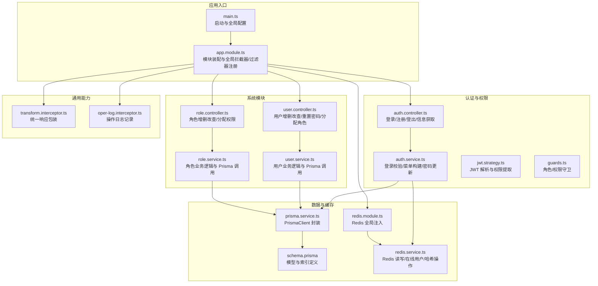
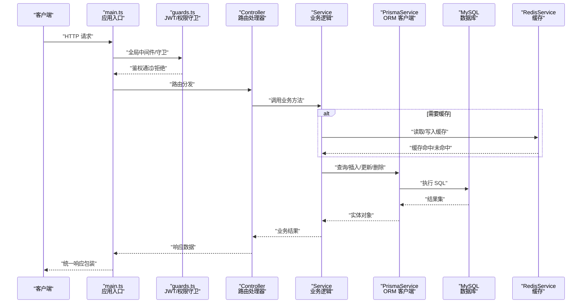
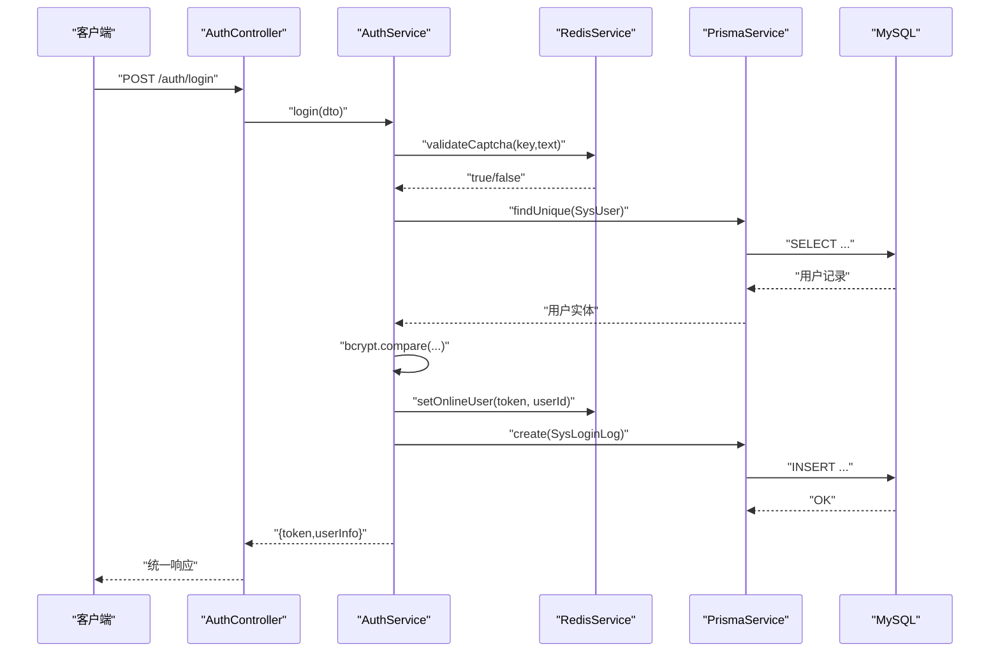
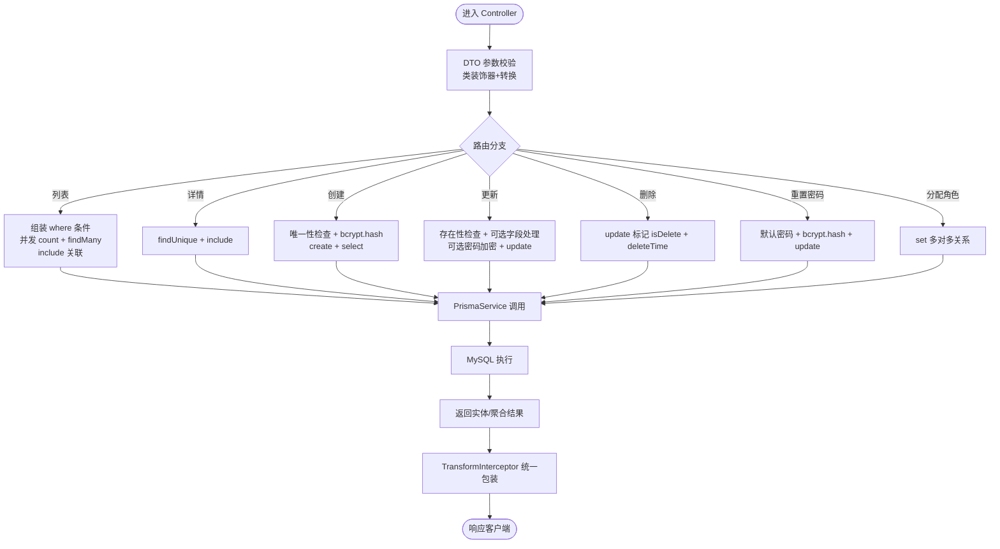
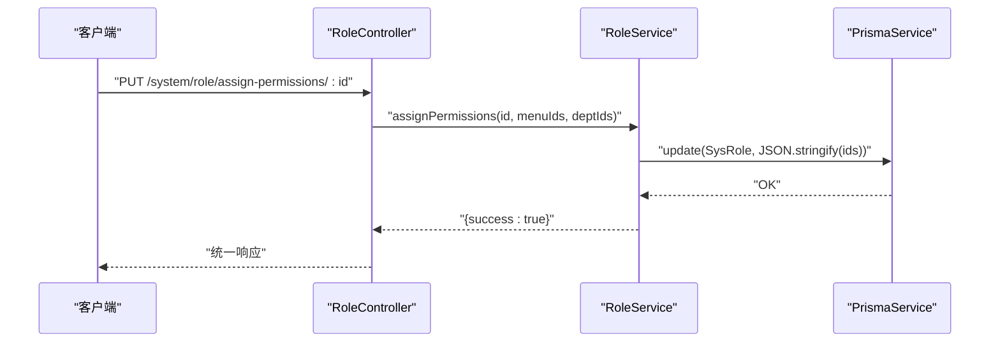
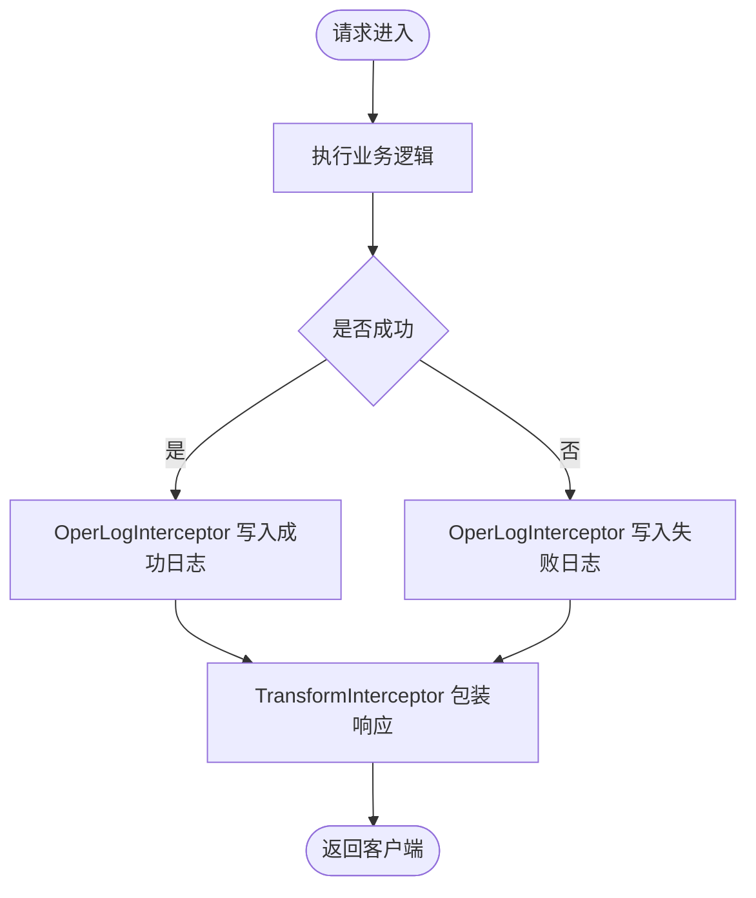
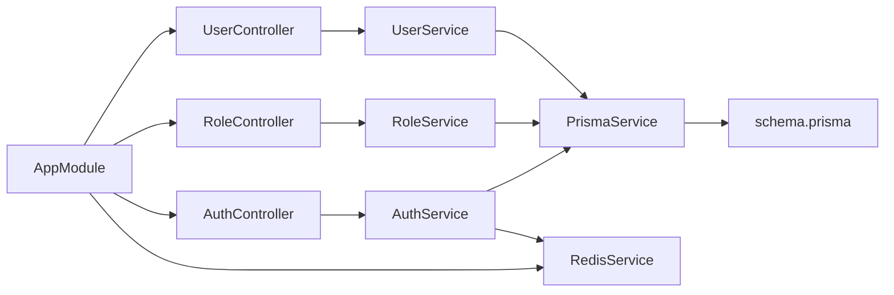
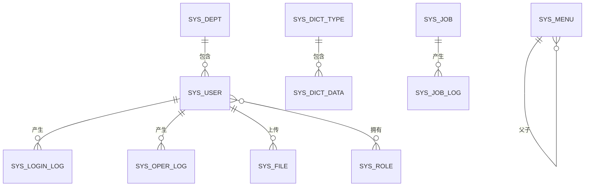

# 数据流设计

<cite>
**本文引用的文件**
- [apps/backend/src/main.ts](file://apps/backend/src/main.ts)
- [apps/backend/src/app.module.ts](file://apps/backend/src/app.module.ts)
- [apps/backend/prisma/schema.prisma](file://apps/backend/prisma/schema.prisma)
- [apps/backend/src/common/prisma.service.ts](file://apps/backend/src/common/prisma.service.ts)
- [apps/backend/src/common/transform.interceptor.ts](file://apps/backend/src/common/transform.interceptor.ts)
- [apps/backend/src/common/oper-log.interceptor.ts](file://apps/backend/src/common/oper-log.interceptor.ts)
- [apps/backend/src/auth/auth.controller.ts](file://apps/backend/src/auth/auth.controller.ts)
- [apps/backend/src/auth/auth.service.ts](file://apps/backend/src/auth/auth.service.ts)
- [apps/backend/src/auth/jwt.strategy.ts](file://apps/backend/src/auth/jwt.strategy.ts)
- [apps/backend/src/auth/guards.ts](file://apps/backend/src/auth/guards.ts)
- [apps/backend/src/modules/system/user/user.controller.ts](file://apps/backend/src/modules/system/user/user.controller.ts)
- [apps/backend/src/modules/system/user/user.service.ts](file://apps/backend/src/modules/system/user/user.service.ts)
- [apps/backend/src/modules/system/user/dto/user.dto.ts](file://apps/backend/src/modules/system/user/dto/user.dto.ts)
- [apps/backend/src/modules/system/role/role.controller.ts](file://apps/backend/src/modules/system/role/role.controller.ts)
- [apps/backend/src/modules/system/role/role.service.ts](file://apps/backend/src/modules/system/role/role.service.ts)
- [apps/backend/src/cache/redis.service.ts](file://apps/backend/src/cache/redis.service.ts)
- [apps/backend/src/cache/redis.module.ts](file://apps/backend/src/cache/redis.module.ts)
</cite>

## 目录
1. [简介](#简介)
2. [项目结构](#项目结构)
3. [核心组件](#核心组件)
4. [架构总览](#架构总览)
5. [详细组件分析](#详细组件分析)
6. [依赖关系分析](#依赖关系分析)
7. [性能考量](#性能考量)
8. [故障排查指南](#故障排查指南)
9. [结论](#结论)
10. [附录](#附录)

## 简介
本文件面向 Nest-Admin-Pro 后端的数据流设计，围绕“从用户请求到数据库持久化”的完整链路进行系统化梳理，覆盖以下要点：
- 请求进入 Controller → 业务逻辑处理 → 数据验证与转换 → 数据库操作 → 响应返回
- Prisma ORM 在数据访问层的角色与查询优化策略
- 缓存策略、事务管理与数据一致性保障机制
- 关键数据流图与关键路径分析，帮助开发者快速理解系统数据处理流程

## 项目结构
后端采用 NestJS 模块化组织，核心入口负责全局中间件与模块装配；数据访问通过 PrismaClient 封装；鉴权与权限控制由 JWT 与自定义守卫实现；缓存使用 Redis 提供在线用户与验证码等场景支持。

图表来源
- [apps/backend/src/main.ts:1-48](file://apps/backend/src/main.ts#L1-L48)
- [apps/backend/src/app.module.ts:1-59](file://apps/backend/src/app.module.ts#L1-L59)
- [apps/backend/src/auth/auth.controller.ts:1-87](file://apps/backend/src/auth/auth.controller.ts#L1-L87)
- [apps/backend/src/auth/auth.service.ts:1-294](file://apps/backend/src/auth/auth.service.ts#L1-L294)
- [apps/backend/src/auth/jwt.strategy.ts:1-78](file://apps/backend/src/auth/jwt.strategy.ts#L1-L78)
- [apps/backend/src/auth/guards.ts:1-51](file://apps/backend/src/auth/guards.ts#L1-L51)
- [apps/backend/src/modules/system/user/user.controller.ts:1-89](file://apps/backend/src/modules/system/user/user.controller.ts#L1-L89)
- [apps/backend/src/modules/system/user/user.service.ts:1-144](file://apps/backend/src/modules/system/user/user.service.ts#L1-L144)
- [apps/backend/src/modules/system/role/role.controller.ts:1-80](file://apps/backend/src/modules/system/role/role.controller.ts#L1-L80)
- [apps/backend/src/modules/system/role/role.service.ts:1-80](file://apps/backend/src/modules/system/role/role.service.ts#L1-L80)
- [apps/backend/src/common/prisma.service.ts:1-22](file://apps/backend/src/common/prisma.service.ts#L1-L22)
- [apps/backend/prisma/schema.prisma:1-347](file://apps/backend/prisma/schema.prisma#L1-L347)
- [apps/backend/src/cache/redis.module.ts:1-9](file://apps/backend/src/cache/redis.module.ts#L1-L9)
- [apps/backend/src/cache/redis.service.ts:1-128](file://apps/backend/src/cache/redis.service.ts#L1-L128)
- [apps/backend/src/common/transform.interceptor.ts:1-29](file://apps/backend/src/common/transform.interceptor.ts#L1-L29)
- [apps/backend/src/common/oper-log.interceptor.ts:1-111](file://apps/backend/src/common/oper-log.interceptor.ts#L1-L111)

章节来源
- [apps/backend/src/main.ts:1-48](file://apps/backend/src/main.ts#L1-L48)
- [apps/backend/src/app.module.ts:1-59](file://apps/backend/src/app.module.ts#L1-L59)

## 核心组件
- 应用入口与全局配置：设置跨域、全局前缀、全局验证管道、Swagger 文档、静态资源服务等。
- 认证与权限：提供登录/注册/登出/信息获取接口，基于 JWT 的身份解析与权限提取，结合角色与权限守卫。
- 系统模块（用户/角色）：提供完整的 CRUD 与相关业务操作，均通过 Prisma 进行数据库访问。
- 数据访问层（Prisma）：封装 PrismaClient，连接数据库并在模块初始化/销毁阶段进行生命周期管理。
- 缓存（Redis）：提供在线用户、验证码、键值与哈希操作等能力，并以全局模块形式注入。
- 通用拦截器：统一响应包装与操作日志记录，确保所有响应格式一致并可审计。

章节来源
- [apps/backend/src/main.ts:1-48](file://apps/backend/src/main.ts#L1-L48)
- [apps/backend/src/auth/auth.controller.ts:1-87](file://apps/backend/src/auth/auth.controller.ts#L1-L87)
- [apps/backend/src/auth/auth.service.ts:1-294](file://apps/backend/src/auth/auth.service.ts#L1-L294)
- [apps/backend/src/modules/system/user/user.controller.ts:1-89](file://apps/backend/src/modules/system/user/user.controller.ts#L1-L89)
- [apps/backend/src/modules/system/user/user.service.ts:1-144](file://apps/backend/src/modules/system/user/user.service.ts#L1-L144)
- [apps/backend/src/common/prisma.service.ts:1-22](file://apps/backend/src/common/prisma.service.ts#L1-L22)
- [apps/backend/src/cache/redis.service.ts:1-128](file://apps/backend/src/cache/redis.service.ts#L1-L128)
- [apps/backend/src/common/transform.interceptor.ts:1-29](file://apps/backend/src/common/transform.interceptor.ts#L1-L29)
- [apps/backend/src/common/oper-log.interceptor.ts:1-111](file://apps/backend/src/common/oper-log.interceptor.ts#L1-L111)

## 架构总览
下图展示从请求进入至数据库持久化的整体数据流，包括鉴权、权限校验、业务处理、数据访问与响应封装。

图表来源
- [apps/backend/src/main.ts:1-48](file://apps/backend/src/main.ts#L1-L48)
- [apps/backend/src/auth/guards.ts:1-51](file://apps/backend/src/auth/guards.ts#L1-L51)
- [apps/backend/src/auth/auth.controller.ts:1-87](file://apps/backend/src/auth/auth.controller.ts#L1-L87)
- [apps/backend/src/auth/auth.service.ts:1-294](file://apps/backend/src/auth/auth.service.ts#L1-L294)
- [apps/backend/src/modules/system/user/user.controller.ts:1-89](file://apps/backend/src/modules/system/user/user.controller.ts#L1-L89)
- [apps/backend/src/modules/system/user/user.service.ts:1-144](file://apps/backend/src/modules/system/user/user.service.ts#L1-L144)
- [apps/backend/src/common/prisma.service.ts:1-22](file://apps/backend/src/common/prisma.service.ts#L1-L22)
- [apps/backend/prisma/schema.prisma:1-347](file://apps/backend/prisma/schema.prisma#L1-L347)
- [apps/backend/src/cache/redis.service.ts:1-128](file://apps/backend/src/cache/redis.service.ts#L1-L128)

## 详细组件分析

### 认证与权限数据流（登录/登出/菜单构建）
- 登录流程：验证码校验 → 用户存在性与状态校验 → 密码比对 → 生成 JWT → 写入在线用户缓存 → 记录登录日志 → 返回 token 与用户信息。
- 权限提取：根据角色集合提取菜单权限，超级管理员拥有全部权限，普通用户按菜单集合过滤。
- 登出流程：移除在线用户缓存键，返回成功信息。

图表来源
- [apps/backend/src/auth/auth.controller.ts:1-87](file://apps/backend/src/auth/auth.controller.ts#L1-L87)
- [apps/backend/src/auth/auth.service.ts:1-294](file://apps/backend/src/auth/auth.service.ts#L1-L294)
- [apps/backend/src/cache/redis.service.ts:1-128](file://apps/backend/src/cache/redis.service.ts#L1-L128)
- [apps/backend/src/common/prisma.service.ts:1-22](file://apps/backend/src/common/prisma.service.ts#L1-L22)
- [apps/backend/prisma/schema.prisma:1-347](file://apps/backend/prisma/schema.prisma#L1-L347)

章节来源
- [apps/backend/src/auth/auth.controller.ts:1-87](file://apps/backend/src/auth/auth.controller.ts#L1-L87)
- [apps/backend/src/auth/auth.service.ts:1-294](file://apps/backend/src/auth/auth.service.ts#L1-L294)
- [apps/backend/src/auth/jwt.strategy.ts:1-78](file://apps/backend/src/auth/jwt.strategy.ts#L1-L78)
- [apps/backend/src/auth/guards.ts:1-51](file://apps/backend/src/auth/guards.ts#L1-L51)

### 用户管理数据流（列表/详情/创建/更新/删除/重置密码/分配角色）
- 列表：动态构造 where 条件（用户名/昵称/状态/部门），并发统计总数与分页查询，包含关联部门与角色，返回脱敏后的用户列表。
- 详情：按主键查询并包含关联信息，不存在则抛异常。
- 创建：用户名唯一性检查，密码加密，持久化用户信息，返回最小化标识。
- 更新：必填 ID 校验，存在性检查，可选字段与密码加密处理，返回最小化标识。
- 删除：软删除标记与时间写入。
- 重置密码：默认密码加密后更新。
- 分配角色：通过 Prisma 的关系更新语法设置多对多关系。

图表来源
- [apps/backend/src/modules/system/user/user.controller.ts:1-89](file://apps/backend/src/modules/system/user/user.controller.ts#L1-L89)
- [apps/backend/src/modules/system/user/user.service.ts:1-144](file://apps/backend/src/modules/system/user/user.service.ts#L1-L144)
- [apps/backend/src/modules/system/user/dto/user.dto.ts:1-131](file://apps/backend/src/modules/system/user/dto/user.dto.ts#L1-L131)
- [apps/backend/src/common/prisma.service.ts:1-22](file://apps/backend/src/common/prisma.service.ts#L1-L22)
- [apps/backend/prisma/schema.prisma:1-347](file://apps/backend/prisma/schema.prisma#L1-L347)
- [apps/backend/src/common/transform.interceptor.ts:1-29](file://apps/backend/src/common/transform.interceptor.ts#L1-L29)

章节来源
- [apps/backend/src/modules/system/user/user.controller.ts:1-89](file://apps/backend/src/modules/system/user/user.controller.ts#L1-L89)
- [apps/backend/src/modules/system/user/user.service.ts:1-144](file://apps/backend/src/modules/system/user/user.service.ts#L1-L144)
- [apps/backend/src/modules/system/user/dto/user.dto.ts:1-131](file://apps/backend/src/modules/system/user/dto/user.dto.ts#L1-L131)

### 角色管理数据流（列表/详情/创建/更新/删除/变更状态/分配权限/获取菜单）
- 列表/详情：基础 CRUD，包含分页与排序。
- 创建/更新：唯一性与存在性校验，状态与数据范围字段处理。
- 删除：直接删除。
- 变更状态：原子更新。
- 分配权限：将菜单 ID 与部门 ID 数组序列化后写入角色记录。
- 获取菜单：解析角色记录中的菜单 ID 列表并返回。

图表来源
- [apps/backend/src/modules/system/role/role.controller.ts:1-80](file://apps/backend/src/modules/system/role/role.controller.ts#L1-L80)
- [apps/backend/src/modules/system/role/role.service.ts:1-80](file://apps/backend/src/modules/system/role/role.service.ts#L1-L80)
- [apps/backend/src/common/prisma.service.ts:1-22](file://apps/backend/src/common/prisma.service.ts#L1-L22)

章节来源
- [apps/backend/src/modules/system/role/role.controller.ts:1-80](file://apps/backend/src/modules/system/role/role.controller.ts#L1-L80)
- [apps/backend/src/modules/system/role/role.service.ts:1-80](file://apps/backend/src/modules/system/role/role.service.ts#L1-L80)

### 操作日志与统一响应
- 操作日志拦截器：在请求完成后或发生错误时记录操作日志，包含用户、模块、请求方法、URL、参数、响应/错误、耗时与 IP 等，避免影响主流程。
- 统一响应拦截器：将业务返回值包装为统一的 ApiResponse 结构，便于前端处理。

图表来源
- [apps/backend/src/common/oper-log.interceptor.ts:1-111](file://apps/backend/src/common/oper-log.interceptor.ts#L1-L111)
- [apps/backend/src/common/transform.interceptor.ts:1-29](file://apps/backend/src/common/transform.interceptor.ts#L1-L29)

章节来源
- [apps/backend/src/common/oper-log.interceptor.ts:1-111](file://apps/backend/src/common/oper-log.interceptor.ts#L1-L111)
- [apps/backend/src/common/transform.interceptor.ts:1-29](file://apps/backend/src/common/transform.interceptor.ts#L1-L29)

## 依赖关系分析
- 控制器依赖服务：Controller 仅负责参数接收与权限注解，具体业务委托给 Service。
- 服务依赖 Prisma 与 Redis：Service 通过 PrismaService 访问数据库，通过 RedisService 访问缓存。
- 拦截器与守卫：全局注册于 AppModule，贯穿所有路由，不侵入业务代码。
- 模块化装配：AppModule 引入认证、系统、监控、文件、代码生成等模块，形成清晰边界。

图表来源
- [apps/backend/src/app.module.ts:1-59](file://apps/backend/src/app.module.ts#L1-L59)
- [apps/backend/src/modules/system/user/user.controller.ts:1-89](file://apps/backend/src/modules/system/user/user.controller.ts#L1-L89)
- [apps/backend/src/modules/system/user/user.service.ts:1-144](file://apps/backend/src/modules/system/user/user.service.ts#L1-L144)
- [apps/backend/src/modules/system/role/role.controller.ts:1-80](file://apps/backend/src/modules/system/role/role.controller.ts#L1-L80)
- [apps/backend/src/modules/system/role/role.service.ts:1-80](file://apps/backend/src/modules/system/role/role.service.ts#L1-L80)
- [apps/backend/src/auth/auth.controller.ts:1-87](file://apps/backend/src/auth/auth.controller.ts#L1-L87)
- [apps/backend/src/auth/auth.service.ts:1-294](file://apps/backend/src/auth/auth.service.ts#L1-L294)
- [apps/backend/src/common/prisma.service.ts:1-22](file://apps/backend/src/common/prisma.service.ts#L1-L22)
- [apps/backend/src/cache/redis.service.ts:1-128](file://apps/backend/src/cache/redis.service.ts#L1-L128)
- [apps/backend/prisma/schema.prisma:1-347](file://apps/backend/prisma/schema.prisma#L1-L347)

章节来源
- [apps/backend/src/app.module.ts:1-59](file://apps/backend/src/app.module.ts#L1-L59)

## 性能考量
- 查询优化
  - 使用并发计数与分页查询减少 IO 压力，列表接口同时进行 count 与 findMany 并发执行。
  - 合理使用 include 关联加载，避免 N+1 查询；仅在必要时包含关联。
  - 依据 schema 中的复合索引与单列索引进行 where 条件匹配，如用户名、部门、菜单权限等。
- 缓存策略
  - 验证码：短期缓存，过期自动失效，降低数据库压力。
  - 在线用户：基于集合与键值的组合存储，支持批量查询与 TTL 管理。
  - 建议：对热点数据（如字典、菜单树、用户权限）引入缓存，注意缓存失效与一致性。
- 事务与一致性
  - 当前用户/角色服务未显式使用事务；对于强一致需求（如批量分配角色、跨表更新），建议在 Service 层使用 Prisma 事务包裹，确保原子性。
- 其他
  - DTO 层启用转换与白名单，减少无效字段进入业务层。
  - 操作日志异步写入，避免阻塞主流程。

## 故障排查指南
- 常见异常与定位
  - 参数校验失败：检查 DTO 装饰器与全局 ValidationPipe 配置。
  - 用户不存在/禁用：检查登录流程中用户状态与软删除标记。
  - 权限不足：确认角色/权限守卫元数据与菜单权限提取逻辑。
  - 缓存异常：检查 Redis 连接参数与事件回调，关注连接错误日志。
  - 数据库连接：确认 PrismaService 初始化与销毁钩子，查看日志输出。
- 排查步骤
  - 开启操作日志拦截器，定位请求方法、URL、参数与耗时。
  - 检查 Prisma 日志级别，定位慢查询与错误 SQL。
  - 对热点接口增加缓存层，观察命中率与延迟变化。
  - 对关键业务引入事务，确保一致性与回滚路径。

章节来源
- [apps/backend/src/common/oper-log.interceptor.ts:1-111](file://apps/backend/src/common/oper-log.interceptor.ts#L1-L111)
- [apps/backend/src/common/prisma.service.ts:1-22](file://apps/backend/src/common/prisma.service.ts#L1-L22)
- [apps/backend/src/cache/redis.service.ts:1-128](file://apps/backend/src/cache/redis.service.ts#L1-L128)

## 结论
本设计文档从数据流视角梳理了 Nest-Admin-Pro 的核心处理链路，明确了鉴权、权限、业务、数据访问与响应封装各环节的职责与协作方式。Prisma 提供了强类型的 ORM 能力与良好的索引利用，Redis 为关键场景提供了高性能缓存。通过拦截器与守卫实现横切关注点，使业务代码保持简洁与可维护。建议在需要强一致性的场景引入事务，并持续优化查询与缓存策略以提升整体性能与稳定性。

## 附录
- 数据模型概览（部分核心表）
  - 用户、角色、部门、岗位、菜单、字典、配置、通知、文件、登录日志、操作日志、定时任务等。
  - 模型间存在一对一/一对多/多对多关系，配合索引提升查询效率。

图表来源
- [apps/backend/prisma/schema.prisma:1-347](file://apps/backend/prisma/schema.prisma#L1-L347)