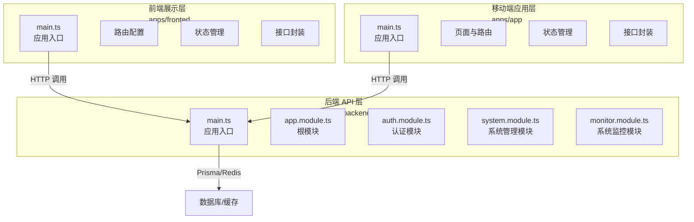
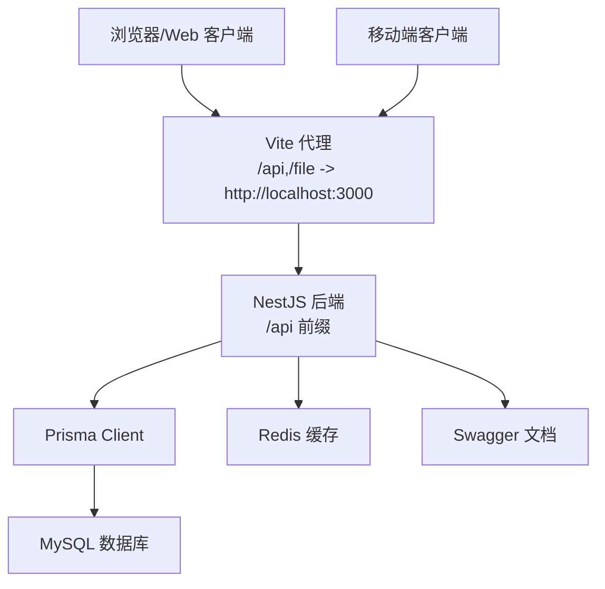
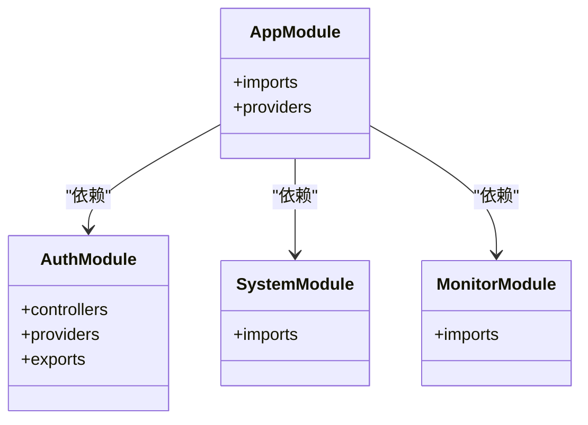
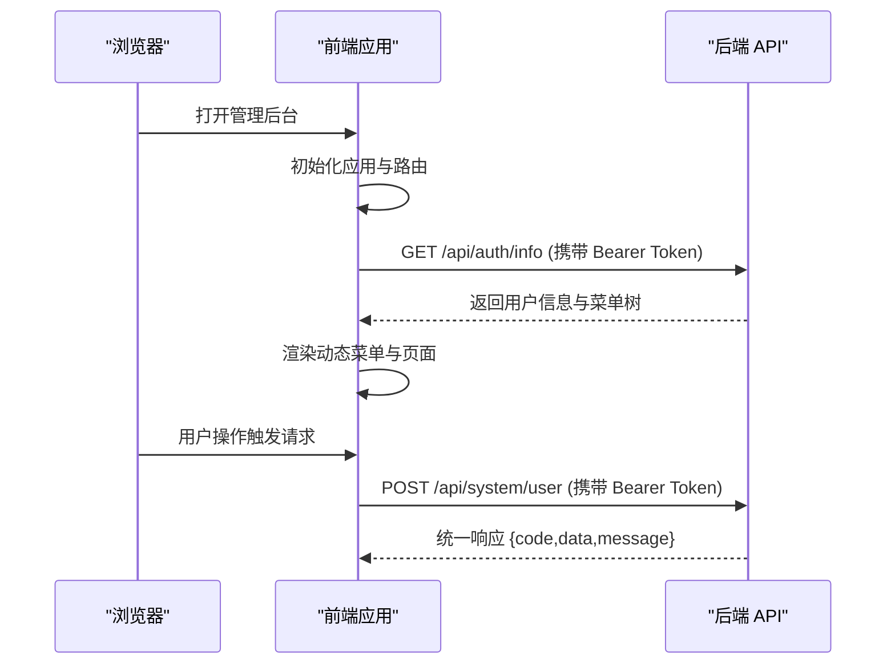
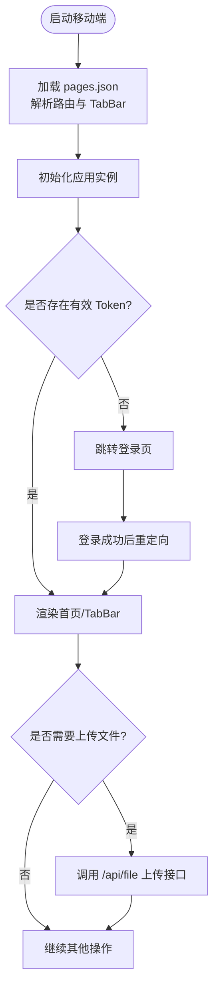
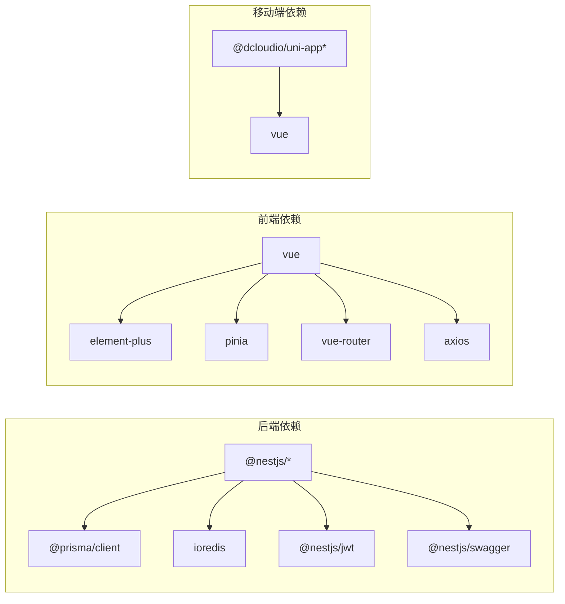

# 整体架构概览

<cite>
**本文引用的文件**
- [README.md](file://README.md)
- [apps/backend/package.json](file://apps/backend/package.json)
- [apps/backend/src/main.ts](file://apps/backend/src/main.ts)
- [apps/backend/src/app.module.ts](file://apps/backend/src/app.module.ts)
- [apps/backend/src/auth/auth.module.ts](file://apps/backend/src/auth/auth.module.ts)
- [apps/backend/src/modules/system/system.module.ts](file://apps/backend/src/modules/system/system.module.ts)
- [apps/backend/src/modules/monitor/monitor.module.ts](file://apps/backend/src/modules/monitor/monitor.module.ts)
- [apps/backend/nest-cli.json](file://apps/backend/nest-cli.json)
- [apps/fronted/package.json](file://apps/fronted/package.json)
- [apps/fronted/src/main.ts](file://apps/fronted/src/main.ts)
- [apps/app/package.json](file://apps/app/package.json)
- [apps/app/src/main.ts](file://apps/app/src/main.ts)
</cite>

## 目录
1. [简介](#简介)
2. [项目结构](#项目结构)
3. [核心组件](#核心组件)
4. [架构总览](#架构总览)
5. [详细组件分析](#详细组件分析)
6. [依赖关系分析](#依赖关系分析)
7. [性能考量](#性能考量)
8. [故障排查指南](#故障排查指南)
9. [结论](#结论)
10. [附录](#附录)

## 简介
Nest-Admin-Pro 是一个基于 NestJS、Prisma、Vue 3、Element Plus 与 UniApp 的全栈后台管理系统模板。项目采用多应用目录组织，将后端 API、Web 管理后台和移动端应用统一置于仓库中，便于中小型管理系统、接单项目或二次开发场景使用。

- 三层架构设计
  - 后端 API 层：NestJS + Prisma + MySQL + Redis + JWT + Swagger
  - 前端展示层：Vue 3 + Element Plus + Vite + Pinia + Vue Router + Axios
  - 移动端应用层：UniApp 3 + Vue 3（支持 H5 与 13 个小程序平台）

- Monorepo 架构组织
  - apps 目录下包含三个子应用：backend（NestJS 后端）、fronted（Vue 3 Web 后台）、app（UniApp 移动端）
  - vben-admin 为另一个独立的前端工程，包含 antd 版本的 Web 后台与内部工具链

- 系统边界与数据流
  - 后端提供统一 REST API（全局前缀 /api），前端与移动端通过 HTTP 客户端调用后端接口
  - 文件上传通过后端静态资源服务暴露 /file 前缀路径
  - 认证采用 JWT Bearer Token，权限控制结合角色与按钮级权限守卫

**章节来源**
- [README.md:18-118](file://README.md#L18-L118)

## 项目结构
项目采用“多应用目录”组织方式，apps 下的三个应用分别承担不同职责：

- apps/backend
  - NestJS 后端 API，负责认证、系统管理、系统监控、文件上传、代码生成等模块
  - 使用 Prisma 管理数据库模型，Redis 提供缓存与会话能力
  - 提供 Swagger 文档与统一响应格式

- apps/fronted
  - Vue 3 + Element Plus 管理后台，包含 16 个页面，支持动态菜单、权限路由、主题切换与国际化
  - 通过代理将 /api 与 /file 转发至后端服务

- apps/app
  - UniApp 移动端应用，支持 H5 与 13 个小程序平台
  - 包含登录、首页、个人中心、资料修改、密码修改等页面

- apps/vben-admin
  - 另一个前端工程，提供 antd 风格的 Web 后台与内部工具链（非本次文档重点）

**图表来源**
- [apps/backend/src/main.ts:1-48](file://apps/backend/src/main.ts#L1-L48)
- [apps/backend/src/app.module.ts:1-59](file://apps/backend/src/app.module.ts#L1-L59)
- [apps/backend/src/auth/auth.module.ts:1-29](file://apps/backend/src/auth/auth.module.ts#L1-L29)
- [apps/backend/src/modules/system/system.module.ts:1-23](file://apps/backend/src/modules/system/system.module.ts#L1-L23)
- [apps/backend/src/modules/monitor/monitor.module.ts:1-11](file://apps/backend/src/modules/monitor/monitor.module.ts#L1-L11)
- [apps/fronted/src/main.ts:1-27](file://apps/fronted/src/main.ts#L1-L27)
- [apps/app/src/main.ts:1-9](file://apps/app/src/main.ts#L1-L9)

**章节来源**
- [README.md:26-118](file://README.md#L26-L118)

## 核心组件
- 后端核心组件
  - 应用入口与全局配置：设置 CORS、全局前缀 /api、全局验证管道、Swagger 文档、静态资源服务
  - 根模块：注册 ConfigModule、ThrottlerModule、ScheduleModule，并注入全局守卫、过滤器与拦截器
  - 认证模块：Passport + JWT，提供 JwtStrategy、JwtAuthGuard、RolesGuard、PermissionGuard
  - 系统管理模块：聚合 user/role/dept/post/menu/dict/config/notice 子模块
  - 系统监控模块：聚合 login-log/oper-log/online/server/cache 子模块

- 前端核心组件
  - 应用入口：创建 Vue 实例，挂载 Element Plus、路由、i18n、主题
  - 状态管理：Pinia
  - 接口封装：Axios 封装与请求拦截器
  - 路由守卫：基于 token 与菜单权限控制访问

- 移动端核心组件
  - 应用入口：SSR 应用工厂
  - 页面与路由：pages.json 配置 TabBar 与页面路由
  - 状态管理：Pinia（注意：package.json 未声明依赖，需手动安装）
  - 接口封装：与后端一致的 Bearer Token 认证

**章节来源**
- [apps/backend/src/main.ts:1-48](file://apps/backend/src/main.ts#L1-L48)
- [apps/backend/src/app.module.ts:18-59](file://apps/backend/src/app.module.ts#L18-L59)
- [apps/backend/src/auth/auth.module.ts:11-29](file://apps/backend/src/auth/auth.module.ts#L11-L29)
- [apps/backend/src/modules/system/system.module.ts:11-23](file://apps/backend/src/modules/system/system.module.ts#L11-L23)
- [apps/backend/src/modules/monitor/monitor.module.ts:8-11](file://apps/backend/src/modules/monitor/monitor.module.ts#L8-L11)
- [apps/fronted/src/main.ts:1-27](file://apps/fronted/src/main.ts#L1-L27)
- [apps/app/package.json:1-72](file://apps/app/package.json#L1-L72)

## 架构总览
系统采用典型的三层架构与前后端分离模式：

- 后端 API 层
  - 通过 NestJS 提供 REST API，统一响应格式与异常处理
  - 使用 Prisma 进行数据库访问，Redis 提供缓存与会话
  - Swagger 提供接口文档，Throttler 限制请求频率

- 前端展示层
  - Vue 3 + Element Plus 构建管理后台，支持动态菜单与权限路由
  - 通过代理将 /api 与 /file 请求转发至后端

- 移动端应用层
  - UniApp 支持多端发布，统一使用 Bearer Token 认证
  - 页面与 TabBar 通过 pages.json 配置

**图表来源**
- [apps/backend/src/main.ts:14-40](file://apps/backend/src/main.ts#L14-L40)
- [apps/fronted/src/main.ts:1-27](file://apps/fronted/src/main.ts#L1-L27)
- [README.md:100](file://README.md#L100)

**章节来源**
- [apps/backend/src/main.ts:14-40](file://apps/backend/src/main.ts#L14-L40)
- [README.md:83-118](file://README.md#L83-L118)

## 详细组件分析

### 后端应用（NestJS）
- 应用入口
  - 设置全局前缀 /api，启用 CORS，注册全局验证管道
  - 配置 Swagger 文档，暴露 /api-docs 与 doc.html
  - 暴露 /file 前缀静态资源，用于文件访问

- 根模块
  - 注册 ConfigModule、ThrottlerModule、ScheduleModule
  - 注入全局守卫（ThrottlerGuard）、过滤器（GlobalExceptionFilter）、拦截器（TransformInterceptor、OperLogInterceptor）

- 认证模块
  - Passport + JWT，提供策略与守卫
  - 支持角色与权限守卫，配合菜单与按钮级权限

- 系统管理与监控模块
  - 系统管理聚合多个子模块（user/role/dept/post/menu/dict/config/notice）
  - 监控模块聚合 login-log/oper-log/online/server/cache

**图表来源**
- [apps/backend/src/app.module.ts:18-59](file://apps/backend/src/app.module.ts#L18-L59)
- [apps/backend/src/auth/auth.module.ts:11-29](file://apps/backend/src/auth/auth.module.ts#L11-L29)
- [apps/backend/src/modules/system/system.module.ts:11-23](file://apps/backend/src/modules/system/system.module.ts#L11-L23)
- [apps/backend/src/modules/monitor/monitor.module.ts:8-11](file://apps/backend/src/modules/monitor/monitor.module.ts#L8-L11)

**章节来源**
- [apps/backend/src/main.ts:8-46](file://apps/backend/src/main.ts#L8-L46)
- [apps/backend/src/app.module.ts:18-59](file://apps/backend/src/app.module.ts#L18-L59)
- [apps/backend/src/auth/auth.module.ts:11-29](file://apps/backend/src/auth/auth.module.ts#L11-L29)
- [apps/backend/src/modules/system/system.module.ts:11-23](file://apps/backend/src/modules/system/system.module.ts#L11-L23)
- [apps/backend/src/modules/monitor/monitor.module.ts:8-11](file://apps/backend/src/modules/monitor/monitor.module.ts#L8-L11)

### 前端应用（Vue 3 + Element Plus）
- 应用入口
  - 初始化 Vue 实例，注册 Element Plus、图标、路由、i18n、主题
  - 使用 Pinia 进行状态管理

- 路由与权限
  - 动态侧边栏菜单：登录后从后端获取菜单树渲染
  - 权限路由守卫：根据 localStorage token 与 userStore.menus 控制访问

- 开发与代理
  - 开发服务器默认端口 5173
  - 已配置代理：/api 与 /file 转发至 http://localhost:3000

**图表来源**
- [apps/fronted/src/main.ts:1-27](file://apps/fronted/src/main.ts#L1-L27)
- [apps/backend/src/main.ts:14-35](file://apps/backend/src/main.ts#L14-L35)

**章节来源**
- [apps/fronted/src/main.ts:1-27](file://apps/fronted/src/main.ts#L1-L27)
- [README.md:85-101](file://README.md#L85-L101)

### 移动端应用（UniApp）
- 应用入口
  - SSR 应用工厂，返回 app 实例

- 页面与路由
  - pages.json 配置页面路由与 TabBar
  - 当前包含登录、首页、个人中心、资料、密码等页面

- 认证与文件上传
  - 使用 JWT Bearer Token 认证，401 自动跳转登录
  - 文件上传头像接口封装

- 多端支持
  - 支持 H5 与 13 个小程序平台（微信、支付宝、百度、字节等）

**图表来源**
- [apps/app/src/main.ts:1-9](file://apps/app/src/main.ts#L1-L9)
- [apps/app/package.json:1-72](file://apps/app/package.json#L1-L72)

**章节来源**
- [apps/app/src/main.ts:1-9](file://apps/app/src/main.ts#L1-L9)
- [apps/app/package.json:1-72](file://apps/app/package.json#L1-L72)
- [README.md:102-118](file://README.md#L102-L118)

## 依赖关系分析
- 技术栈选择与架构决策背景
  - 后端：NestJS 提供模块化与强类型支持；Prisma 简化数据库访问；JWT 实现无状态认证；Swagger 提升接口可发现性
  - 前端：Vue 3 生态完善，Element Plus 提供丰富的 UI 组件；Pinia 简化状态管理；Vite 提供快速开发体验
  - 移动端：UniApp 一套代码多端发布，覆盖 H5 与主流小程序平台

- Monorepo 组织方式
  - apps/backend、apps/fronted、apps/app 分别独立构建与运行
  - vben-admin 作为独立工程，包含 antd 版本的 Web 后台与内部工具链

**图表来源**
- [apps/backend/package.json:16-42](file://apps/backend/package.json#L16-L42)
- [apps/fronted/package.json:11-24](file://apps/fronted/package.json#L11-L24)
- [apps/app/package.json:39-58](file://apps/app/package.json#L39-L58)

**章节来源**
- [apps/backend/package.json:16-42](file://apps/backend/package.json#L16-L42)
- [apps/fronted/package.json:11-24](file://apps/fronted/package.json#L11-L24)
- [apps/app/package.json:39-58](file://apps/app/package.json#L39-L58)
- [README.md:18-25](file://README.md#L18-L25)

## 性能考量
- 后端
  - 全局限流（Throttler）：默认 60 秒内最多 60 次请求，避免滥用
  - 全局验证管道（ValidationPipe）：开启转换与白名单，减少脏数据进入业务层
  - Swagger 文档：便于接口测试与压测准备

- 前端
  - Vite 开发服务器提供快速热更新
  - Element Plus 按需引入与 Tree Shaking 优化打包体积

- 移动端
  - UniApp 多端复用逻辑，减少重复开发成本
  - 建议在生产构建中开启压缩与分包策略

**章节来源**
- [apps/backend/src/app.module.ts:24-29](file://apps/backend/src/app.module.ts#L24-L29)
- [apps/backend/src/main.ts:17-24](file://apps/backend/src/main.ts#L17-L24)
- [README.md:100](file://README.md#L100)

## 故障排查指南
- 移动端依赖缺失
  - 现象：源码中使用 Pinia，但 package.json 未声明依赖
  - 处理：在 apps/app 目录安装 pinia

- 文档与命令不一致
  - 现象：docs 目录部分文档仍使用旧目录名 apps/api 与 apps/web
  - 处理：以实际源码目录 apps/backend 与 apps/fronted 为准

- 根工作区未配置
  - 现象：仓库未配置 pnpm workspace / npm workspace
  - 处理：三个应用需分别进入目录安装依赖与启动

- Swagger 认证
  - 现象：Swagger 需要 Bearer Token
  - 处理：先登录获取 Token，在 Swagger 中启用 Bearer 认证后再测试接口

**章节来源**
- [README.md:368-371](file://README.md#L368-L371)

## 结论
Nest-Admin-Pro 通过清晰的三层架构与多应用目录组织，实现了后端 API、Web 管理后台与移动端应用的一体化开发与部署。后端以 NestJS 为核心，结合 Prisma、Redis、JWT 与 Swagger 构建高可用的 API 层；前端与移动端分别采用 Vue 3 与 UniApp，提供良好的开发体验与跨端能力。建议在团队协作中遵循统一的开发规范与依赖管理策略，确保各子应用的稳定演进。

## 附录
- 常用命令
  - 后端：启动开发、构建、Prisma 生成与数据库推送
  - Web：启动开发、构建与预览
  - 移动端：H5 与各小程序平台的开发与构建命令

**章节来源**
- [README.md:383-412](file://README.md#L383-L412)