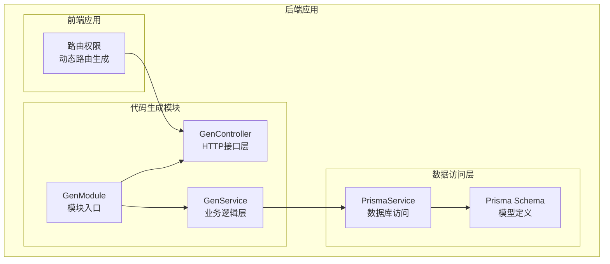
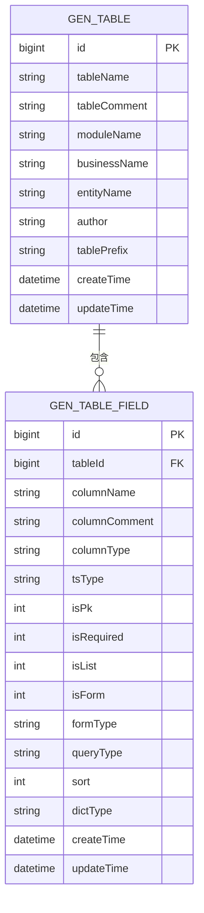
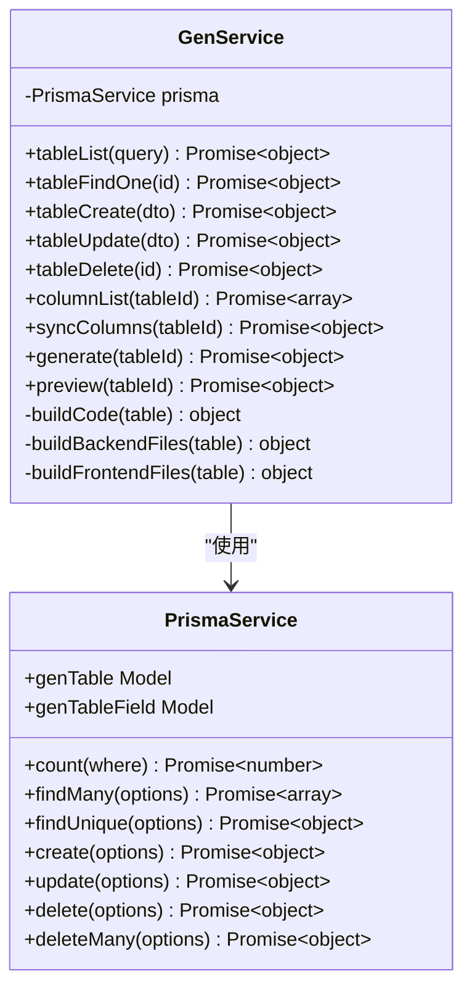
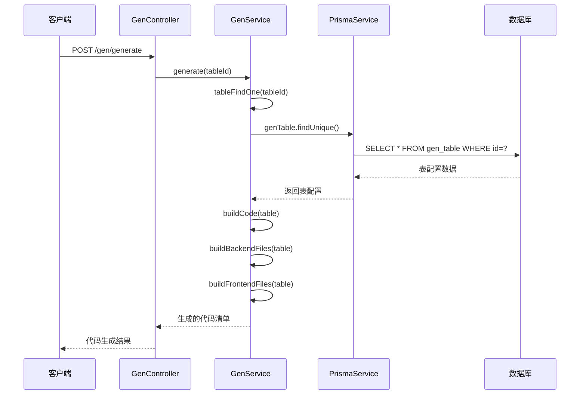
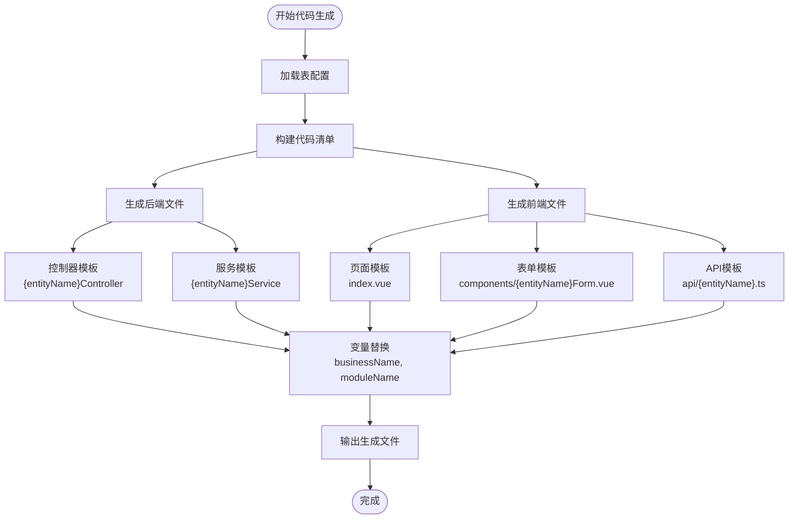
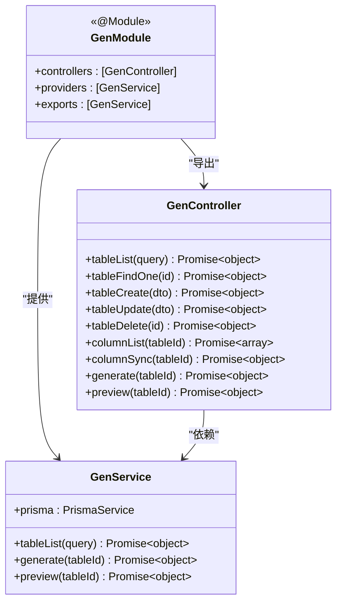
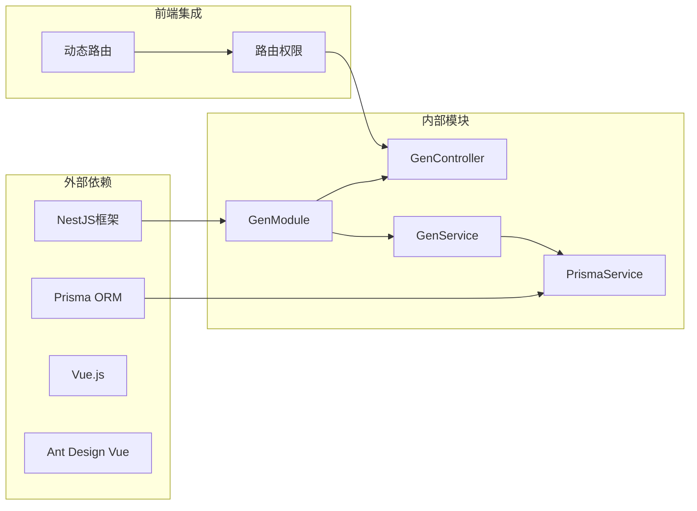
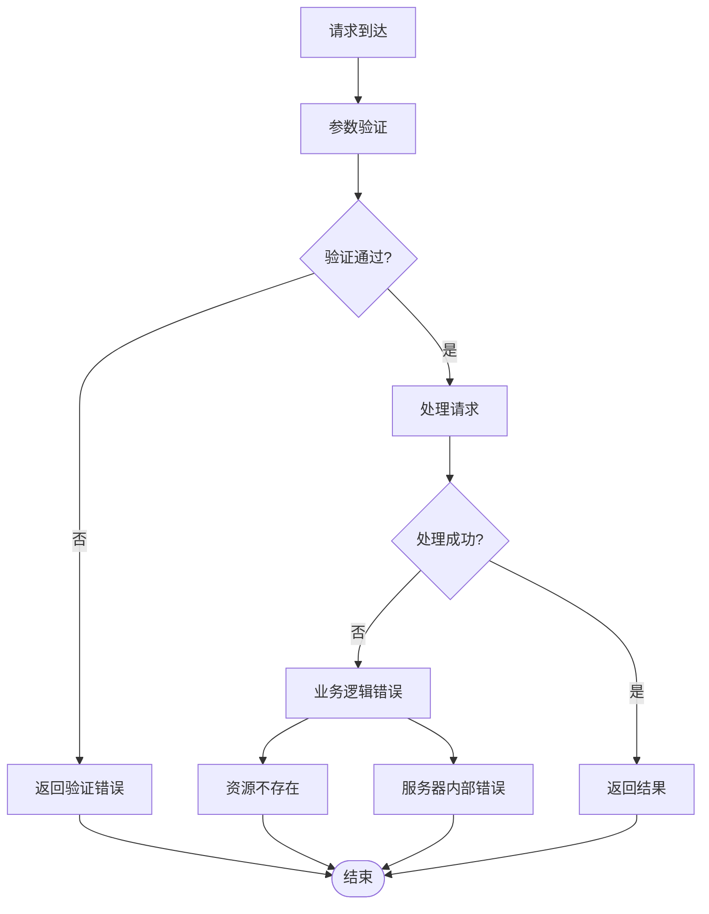

# 代码生成模块

<cite>
**本文档引用的文件**
- [gen.module.ts](file://apps/backend/src/modules/gen/gen.module.ts)
- [gen.controller.ts](file://apps/backend/src/modules/gen/gen.controller.ts)
- [gen.service.ts](file://apps/backend/src/modules/gen/gen.service.ts)
- [schema.prisma](file://apps/backend/prisma/schema.prisma)
- [access.ts](file://apps/vben-admin/apps/web-antd/src/router/access.ts)
</cite>

## 目录
1. [简介](#简介)
2. [项目结构](#项目结构)
3. [核心组件](#核心组件)
4. [架构总览](#架构总览)
5. [详细组件分析](#详细组件分析)
6. [依赖关系分析](#依赖关系分析)
7. [性能考虑](#性能考虑)
8. [故障排除指南](#故障排除指南)
9. [结论](#结论)
10. [附录](#附录)

## 简介
本模块实现了一个可扩展的代码生成系统，支持后端(NestJS)与前端(Vben Admin)的多语言代码生成。系统通过数据库表结构配置驱动，提供表配置管理、字段映射规则、模板引擎、条件生成逻辑以及自定义模板扩展能力。当前实现采用硬编码模板占位符的方式进行代码生成，后续可无缝升级为真正的模板引擎。

## 项目结构
代码生成模块位于后端应用中，采用标准的NestJS模块结构：



**图表来源**
- [gen.module.ts:1-10](file://apps/backend/src/modules/gen/gen.module.ts#L1-L10)
- [gen.controller.ts:1-65](file://apps/backend/src/modules/gen/gen.controller.ts#L1-L65)
- [gen.service.ts:1-105](file://apps/backend/src/modules/gen/gen.service.ts#L1-L105)

**章节来源**
- [gen.module.ts:1-10](file://apps/backend/src/modules/gen/gen.module.ts#L1-L10)
- [gen.controller.ts:1-65](file://apps/backend/src/modules/gen/gen.controller.ts#L1-L65)
- [gen.service.ts:1-105](file://apps/backend/src/modules/gen/gen.service.ts#L1-L105)

## 核心组件
代码生成模块由三个核心组件构成，采用分层架构设计：

### 数据模型
系统基于Prisma Schema定义了完整的代码生成数据模型：



**图表来源**
- [schema.prisma:291-332](file://apps/backend/prisma/schema.prisma#L291-L332)

### 接口层设计
控制器提供RESTful API接口，支持完整的CRUD操作和代码生成功能：

| 接口 | 方法 | 路径 | 功能描述 |
|------|------|------|----------|
| 获取表列表 | GET | `/gen/table/list` | 分页查询生成表配置 |
| 获取表详情 | GET | `/gen/table/:id` | 根据ID获取表配置 |
| 创建表配置 | POST | `/gen/table` | 新建表配置信息 |
| 更新表配置 | PUT | `/gen/table` | 更新现有表配置 |
| 删除表配置 | DELETE | `/gen/table/:id` | 删除表配置及关联字段 |
| 获取字段列表 | GET | `/gen/column/:tableId` | 查询表字段配置 |
| 同步字段 | POST | `/gen/column/sync` | 同步数据库字段到配置 |
| 生成代码 | POST | `/gen/generate` | 执行代码生成任务 |
| 预览代码 | GET | `/gen/preview/:tableId` | 预览生成的代码内容 |

**章节来源**
- [gen.controller.ts:12-64](file://apps/backend/src/modules/gen/gen.controller.ts#L12-L64)

### 业务逻辑层
服务层封装了核心业务逻辑，包括数据访问、代码生成和模板处理：



**图表来源**
- [gen.service.ts:6-105](file://apps/backend/src/modules/gen/gen.service.ts#L6-L105)

**章节来源**
- [gen.service.ts:10-105](file://apps/backend/src/modules/gen/gen.service.ts#L10-L105)

## 架构总览
代码生成模块采用经典的三层架构模式，实现了清晰的关注点分离：



**图表来源**
- [gen.controller.ts:54-58](file://apps/backend/src/modules/gen/gen.controller.ts#L54-L58)
- [gen.service.ts:56-69](file://apps/backend/src/modules/gen/gen.service.ts#L56-L69)

### 模板引擎架构
当前实现采用占位符替换机制，具备向真正模板引擎迁移的扩展性：



**图表来源**
- [gen.service.ts:71-105](file://apps/backend/src/modules/gen/gen.service.ts#L71-L105)

**章节来源**
- [gen.service.ts:71-105](file://apps/backend/src/modules/gen/gen.service.ts#L71-L105)

## 详细组件分析

### GenModule - 模块装配器
负责模块的初始化和依赖注入配置：



**图表来源**
- [gen.module.ts:5-9](file://apps/backend/src/modules/gen/gen.module.ts#L5-L9)

**章节来源**
- [gen.module.ts:1-10](file://apps/backend/src/modules/gen/gen.module.ts#L1-L10)

### GenController - 接口层
实现RESTful API接口，提供完整的代码生成功能：

#### 认证与授权
- 使用JWT认证守卫保护所有接口
- 确保只有认证用户可以访问代码生成功能

#### 数据验证
- 参数类型转换：`ParseIntPipe`确保ID参数为整数
- DTO验证：对请求体数据进行结构验证

#### 错误处理
- 统一的异常处理机制
- 友好的错误信息反馈

**章节来源**
- [gen.controller.ts:1-65](file://apps/backend/src/modules/gen/gen.controller.ts#L1-L65)

### GenService - 业务逻辑层
核心业务逻辑的实现，包含以下关键功能：

#### 数据访问层
- **表配置管理**：支持增删改查完整CRUD操作
- **字段映射**：维护表字段与前端展示的映射关系
- **数据同步**：提供数据库字段同步到配置的功能

#### 代码生成引擎
- **后端代码生成**：生成NestJS控制器和服务类
- **前端代码生成**：生成Vue页面组件和API调用文件
- **模板占位符**：使用变量替换机制生成具体代码

#### 预览功能
- 支持实时预览生成的代码内容
- 便于开发前的代码审查和调整

**章节来源**
- [gen.service.ts:10-105](file://apps/backend/src/modules/gen/gen.service.ts#L10-L105)

### 数据模型详解

#### GenTable - 表配置模型
| 字段名 | 类型 | 描述 | 必填 |
|--------|------|------|------|
| tableName | string | 数据库表名 | 是 |
| tableComment | string | 表注释 | 否 |
| moduleName | string | 模块名 | 是 |
| businessName | string | 业务名称 | 是 |
| entityName | string | 实体类名 | 是 |
| author | string | 作者 | 是 |
| tablePrefix | string | 表前缀 | 否 |

#### GenTableField - 字段配置模型
| 字段名 | 类型 | 描述 | 默认值 |
|--------|------|------|--------|
| columnName | string | 列名 | - |
| columnComment | string | 列注释 | - |
| columnType | string | 数据库类型 | - |
| tsType | string | TypeScript类型 | - |
| isPk | int | 是否主键 | 0 |
| isRequired | int | 是否必填 | 0 |
| isList | int | 是否列表显示 | 1 |
| isForm | int | 是否表单显示 | 1 |
| formType | string | 表单类型 | - |
| queryType | string | 查询类型 | - |
| sort | int | 排序权重 | 0 |
| dictType | string | 字典类型 | - |

**章节来源**
- [schema.prisma:293-332](file://apps/backend/prisma/schema.prisma#L293-L332)

## 依赖关系分析



**图表来源**
- [gen.module.ts:1-10](file://apps/backend/src/modules/gen/gen.module.ts#L1-L10)
- [access.ts:1-58](file://apps/vben-admin/apps/web-antd/src/router/access.ts#L1-L58)

### 外部依赖分析
- **NestJS**: 提供模块化架构和依赖注入容器
- **Prisma**: 提供类型安全的数据库访问和模型定义
- **Vue.js**: 前端框架，支持动态路由和组件化开发
- **Ant Design Vue**: UI组件库，提供丰富的界面元素

### 内部模块耦合
- **低耦合高内聚**: 各模块职责明确，依赖关系清晰
- **接口隔离**: 控制器仅暴露必要的接口给客户端
- **数据访问抽象**: 通过PrismaService抽象数据库操作

**章节来源**
- [gen.controller.ts:1-9](file://apps/backend/src/modules/gen/gen.controller.ts#L1-L9)
- [gen.service.ts:1-8](file://apps/backend/src/modules/gen/gen.service.ts#L1-L8)

## 性能考虑

### 数据访问优化
- **批量查询**: 使用Promise.all并行执行统计和查询操作
- **索引优化**: 在关键字段上建立数据库索引
- **分页查询**: 支持大数据量的分页浏览

### 代码生成性能
- **内存管理**: 采用流式处理避免大文件内存占用
- **缓存策略**: 对频繁访问的配置数据进行缓存
- **异步处理**: 支持长时间运行的代码生成任务

### 并发处理
- **请求限流**: 防止大量并发请求导致系统过载
- **连接池**: 数据库连接池管理，避免连接泄漏
- **超时控制**: 设置合理的请求超时时间

## 故障排除指南

### 常见问题及解决方案

#### 数据库连接问题
**症状**: 无法连接到数据库或查询失败
**解决方案**:
1. 检查DATABASE_URL环境变量配置
2. 验证数据库服务状态
3. 确认Prisma Schema配置正确

#### 权限认证问题
**症状**: 访问接口返回401未授权
**解决方案**:
1. 确认JWT令牌有效且未过期
2. 检查用户权限配置
3. 验证认证守卫配置

#### 代码生成失败
**症状**: 生成代码为空或包含错误占位符
**解决方案**:
1. 检查表配置是否完整
2. 验证字段映射规则
3. 确认模板文件存在

### 错误处理机制
系统实现了完善的错误处理机制：



**章节来源**
- [gen.service.ts:21-25](file://apps/backend/src/modules/gen/gen.service.ts#L21-L25)

## 结论
代码生成模块采用现代化的架构设计，实现了后端与前端的统一代码生成能力。模块具有良好的扩展性和维护性，为后续的功能增强奠定了坚实基础。通过合理的分层设计和依赖管理，系统能够满足复杂项目的代码生成需求。

## 附录

### API使用示例

#### 生成代码示例
```bash
# 生成指定表的代码
POST /gen/generate
{
  "tableId": 1
}

# 预览生成的代码
GET /gen/preview/1
```

#### 表配置示例
```json
{
  "tableName": "sys_user",
  "tableComment": "系统用户表",
  "moduleName": "system",
  "businessName": "用户管理",
  "entityName": "SysUser",
  "author": "开发者",
  "tablePrefix": "sys_"
}
```

### 模板定制指南
1. **变量替换**: 使用`{variableName}`语法定义可替换变量
2. **条件逻辑**: 支持简单的条件判断和循环渲染
3. **自定义模板**: 可扩展模板引擎支持更复杂的模板语法
4. **多语言支持**: 模板中可包含国际化标识符

### 批量生成功能
- 支持按模块批量生成代码
- 提供全量代码生成选项
- 支持增量更新和覆盖模式