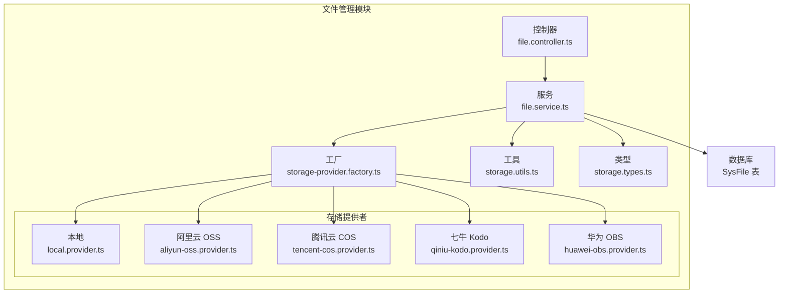
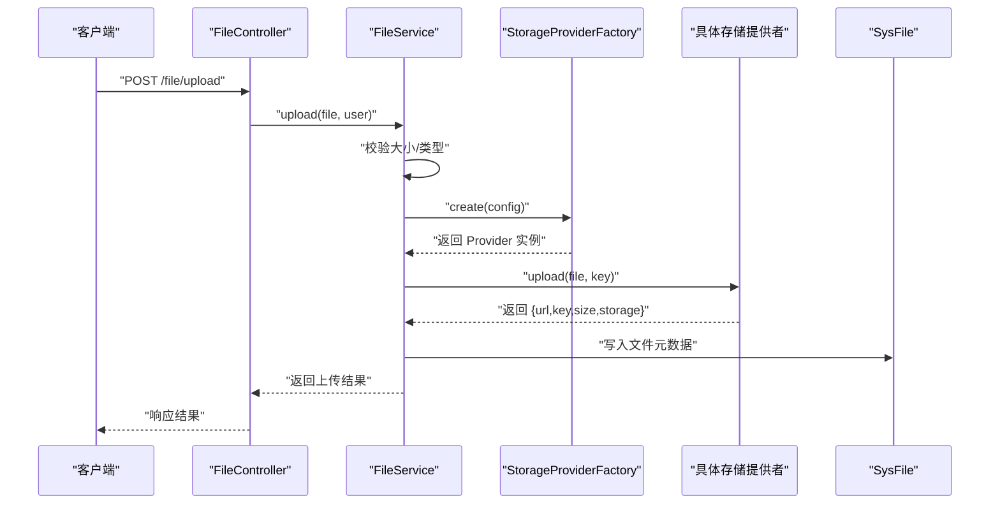
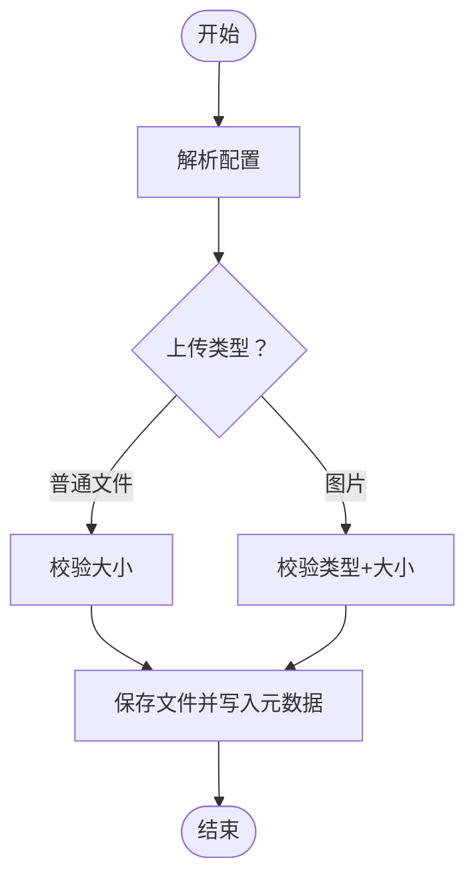
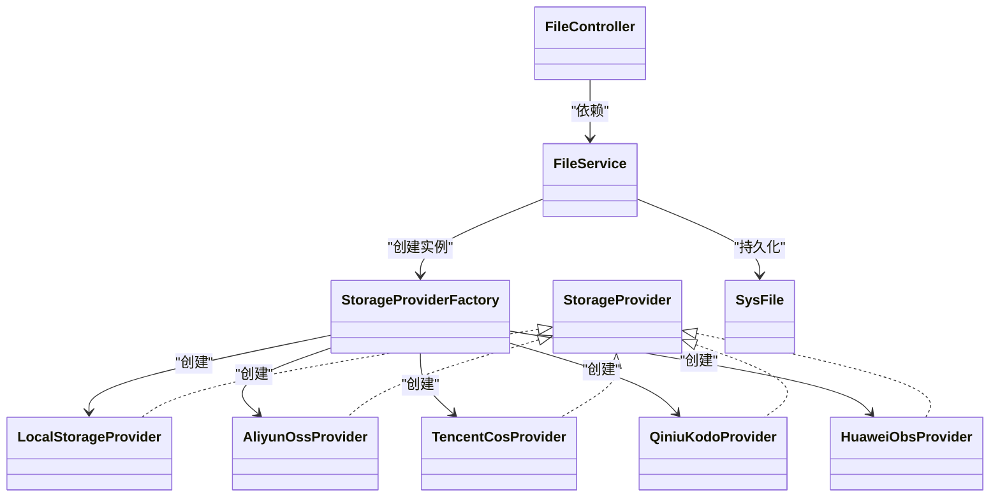

# 文件管理模块

<cite>
**本文引用的文件**
- [apps/backend/src/modules/file/file.module.ts](file://apps/backend/src/modules/file/file.module.ts)
- [apps/backend/src/modules/file/file.controller.ts](file://apps/backend/src/modules/file/file.controller.ts)
- [apps/backend/src/modules/file/file.service.ts](file://apps/backend/src/modules/file/file.service.ts)
- [apps/backend/src/modules/file/storage/storage-provider.factory.ts](file://apps/backend/src/modules/file/storage/storage-provider.factory.ts)
- [apps/backend/src/modules/file/storage/storage.types.ts](file://apps/backend/src/modules/file/storage/storage.types.ts)
- [apps/backend/src/modules/file/storage/storage.utils.ts](file://apps/backend/src/modules/file/storage/storage.utils.ts)
- [apps/backend/src/modules/file/storage/local.provider.ts](file://apps/backend/src/modules/file/storage/local.provider.ts)
- [apps/backend/src/modules/file/storage/aliyun-oss.provider.ts](file://apps/backend/src/modules/file/storage/aliyun-oss.provider.ts)
- [apps/backend/src/modules/file/storage/tencent-cos.provider.ts](file://apps/backend/src/modules/file/storage/tencent-cos.provider.ts)
- [apps/backend/src/modules/file/storage/qiniu-kodo.provider.ts](file://apps/backend/src/modules/file/storage/qiniu-kodo.provider.ts)
- [apps/backend/src/modules/file/storage/huawei-obs.provider.ts](file://apps/backend/src/modules/file/storage/huawei-obs.provider.ts)
- [apps/backend/prisma/schema.prisma](file://apps/backend/prisma/schema.prisma)
</cite>

## 目录
1. [简介](#简介)
2. [项目结构](#项目结构)
3. [核心组件](#核心组件)
4. [架构总览](#架构总览)
5. [详细组件分析](#详细组件分析)
6. [依赖关系分析](#依赖关系分析)
7. [性能与成本优化](#性能与成本优化)
8. [故障排查指南](#故障排查指南)
9. [结论](#结论)
10. [附录：API 使用与前端集成](#附录api-使用与前端集成)

## 简介
本文件管理模块提供统一的文件上传、存储与访问能力，支持多种存储提供商（本地存储、阿里云 OSS、腾讯云 COS、七牛 Kodo、华为 OBS），并内置文件类型校验、大小限制、元数据持久化、URL 生成与访问鉴权控制。通过工厂模式抽象存储提供者，实现可插拔扩展；通过系统配置中心动态切换存储后端；通过 JWT 与权限守卫保障访问安全。

## 项目结构
文件管理模块位于后端应用的 modules/file 目录下，采用按职责分层组织：
- 控制器层：定义文件上传、下载、列表、删除等接口
- 服务层：封装业务逻辑、配置解析、元数据持久化、调用存储提供者
- 存储提供者层：以工厂模式创建具体存储实现（本地、阿里云 OSS、腾讯云 COS、七牛 Kodo、华为 OBS）
- 工具与类型：提供命名规范、URL 构建、配置归一化等通用能力
- 数据模型：基于 Prisma 的 SysFile 表记录文件元数据

图表来源
- [apps/backend/src/modules/file/file.controller.ts:1-100](file://apps/backend/src/modules/file/file.controller.ts#L1-100)
- [apps/backend/src/modules/file/file.service.ts:1-310](file://apps/backend/src/modules/file/file.service.ts#L1-310)
- [apps/backend/src/modules/file/storage/storage-provider.factory.ts:1-25](file://apps/backend/src/modules/file/storage/storage-provider.factory.ts#L1-25)
- [apps/backend/src/modules/file/storage/storage.utils.ts:1-62](file://apps/backend/src/modules/file/storage/storage.utils.ts#L1-62)
- [apps/backend/src/modules/file/storage/storage.types.ts:1-43](file://apps/backend/src/modules/file/storage/storage.types.ts#L1-43)
- [apps/backend/src/modules/file/storage/local.provider.ts:1-46](file://apps/backend/src/modules/file/storage/local.provider.ts#L1-46)
- [apps/backend/src/modules/file/storage/aliyun-oss.provider.ts:1-51](file://apps/backend/src/modules/file/storage/aliyun-oss.provider.ts#L1-51)
- [apps/backend/src/modules/file/storage/tencent-cos.provider.ts:1-74](file://apps/backend/src/modules/file/storage/tencent-cos.provider.ts#L1-74)
- [apps/backend/src/modules/file/storage/qiniu-kodo.provider.ts:1-68](file://apps/backend/src/modules/file/storage/qiniu-kodo.provider.ts#L1-68)
- [apps/backend/src/modules/file/storage/huawei-obs.provider.ts:1-93](file://apps/backend/src/modules/file/storage/huawei-obs.provider.ts#L1-93)
- [apps/backend/prisma/schema.prisma:182-207](file://apps/backend/prisma/schema.prisma#L182-L207)

章节来源
- [apps/backend/src/modules/file/file.module.ts:1-10](file://apps/backend/src/modules/file/file.module.ts#L1-10)
- [apps/backend/src/modules/file/file.controller.ts:1-100](file://apps/backend/src/modules/file/file.controller.ts#L1-100)
- [apps/backend/src/modules/file/file.service.ts:1-310](file://apps/backend/src/modules/file/file.service.ts#L1-310)

## 核心组件
- FileModule：模块入口，导出 FileService，供系统其他模块使用
- FileController：定义文件管理相关接口，含上传、预览/下载、列表、详情、删除、配置查询与更新
- FileService：核心业务逻辑，负责配置解析、文件校验、调用存储提供者、持久化元数据、URL 生成与鉴权
- StorageProviderFactory：工厂类，根据配置选择具体存储提供者实例
- StorageProvider 接口族：统一 upload/delete/getPublicUrl 等能力
- 工具函数：文件名规范化、对象键生成、公共 URL 构建、配置归一化
- 数据模型：SysFile 记录文件原始名、存储键、URL、存储类型、MIME、扩展名、大小、上传人信息等

章节来源
- [apps/backend/src/modules/file/file.module.ts:1-10](file://apps/backend/src/modules/file/file.module.ts#L1-10)
- [apps/backend/src/modules/file/file.controller.ts:1-100](file://apps/backend/src/modules/file/file.controller.ts#L1-100)
- [apps/backend/src/modules/file/file.service.ts:1-310](file://apps/backend/src/modules/file/file.service.ts#L1-310)
- [apps/backend/src/modules/file/storage/storage.types.ts:1-43](file://apps/backend/src/modules/file/storage/storage.types.ts#L1-43)

## 架构总览
文件管理模块采用“控制器-服务-工厂-提供者”的分层架构，配合系统配置中心实现运行时可切换的存储后端。上传流程在内存中接收文件，随后由工厂创建对应存储提供者执行上传，并将元数据写入数据库；预览/下载接口根据存储类型返回重定向或直接文件流。

图表来源
- [apps/backend/src/modules/file/file.controller.ts:77-83](file://apps/backend/src/modules/file/file.controller.ts#L77-83)
- [apps/backend/src/modules/file/file.service.ts:150-209](file://apps/backend/src/modules/file/file.service.ts#L150-209)
- [apps/backend/src/modules/file/storage/storage-provider.factory.ts:8-24](file://apps/backend/src/modules/file/storage/storage-provider.factory.ts#L8-24)

## 详细组件分析

### 控制器：FileController
- 权限与安全
  - 多数接口使用 JWT 与权限守卫，确保登录态与操作权限
  - 预览/下载接口标注为公开访问，便于直接访问已公开资源
- 上传与预览
  - 上传接口使用内存存储，限制单文件大小
  - 图片上传额外进行类型白名单校验
  - 预览接口对非本地存储返回公开 URL 重定向，本地存储进行路径安全校验后返回文件流
- 列表与删除
  - 支持分页、按原文件名/存储类型/MIME 过滤
  - 删除接口先尝试远程删除，再标记数据库记录为删除状态

章节来源
- [apps/backend/src/modules/file/file.controller.ts:1-100](file://apps/backend/src/modules/file/file.controller.ts#L1-100)

### 服务：FileService
- 配置解析与更新
  - 从系统配置表读取存储参数，兼容旧字段别名
  - 支持在线更新存储配置并落库
- 文件校验
  - 上传/图片上传分别校验大小与类型
- 上传流程
  - 生成对象键或本地存储文件名
  - 调用存储提供者上传
  - 写入 SysFile 元数据
- 预览/下载
  - 非本地存储：重定向到公开 URL
  - 本地存储：安全路径校验后返回文件流
- 删除
  - 远程删除失败不影响元数据删除（容错）

图表来源
- [apps/backend/src/modules/file/file.service.ts:150-209](file://apps/backend/src/modules/file/file.service.ts#L150-209)

章节来源
- [apps/backend/src/modules/file/file.service.ts:1-310](file://apps/backend/src/modules/file/file.service.ts#L1-310)

### 存储提供者工厂：StorageProviderFactory
- 根据配置 storage 字段创建对应提供者实例
- 默认回退到本地存储

章节来源
- [apps/backend/src/modules/file/storage/storage-provider.factory.ts:1-25](file://apps/backend/src/modules/file/storage/storage-provider.factory.ts#L1-25)

### 类型与工具：storage.types.ts 与 storage.utils.ts
- 统一的存储提供者接口与配置结构
- 工具函数：随机命名、日期路径对象键生成、原始名规范化、公共 URL 构建、配置归一化、完整性校验

章节来源
- [apps/backend/src/modules/file/storage/storage.types.ts:1-43](file://apps/backend/src/modules/file/storage/storage.types.ts#L1-43)
- [apps/backend/src/modules/file/storage/storage.utils.ts:1-62](file://apps/backend/src/modules/file/storage/storage.utils.ts#L1-62)

### 本地存储：LocalStorageProvider
- 将文件写入本地目录，支持安全路径解析与删除
- 公共 URL 为相对路径

章节来源
- [apps/backend/src/modules/file/storage/local.provider.ts:1-46](file://apps/backend/src/modules/file/storage/local.provider.ts#L1-46)

### 阿里云 OSS：AliyunOssProvider
- 使用官方 SDK 上传、删除、生成 URL
- 必需配置：region/bucket/accessKeyId/accessKeySecret

章节来源
- [apps/backend/src/modules/file/storage/aliyun-oss.provider.ts:1-51](file://apps/backend/src/modules/file/storage/aliyun-oss.provider.ts#L1-51)

### 腾讯云 COS：TencentCosProvider
- 使用 cos-nodejs-sdk-v5 上传、删除、生成 URL
- 可通过 publicUrl 或默认域名生成公开 URL

章节来源
- [apps/backend/src/modules/file/storage/tencent-cos.provider.ts:1-74](file://apps/backend/src/modules/file/storage/tencent-cos.provider.ts#L1-74)

### 七牛 Kodo：QiniuKodoProvider
- 使用上传 Token 方式上传，支持区域解析
- 删除使用 BucketManager

章节来源
- [apps/backend/src/modules/file/storage/qiniu-kodo.provider.ts:1-68](file://apps/backend/src/modules/file/storage/qiniu-kodo.provider.ts#L1-68)

### 华为 OBS：HuaweiObsProvider
- 使用 esdk-obs-nodejs 上传、删除、生成 URL
- 强制要求 endpoint

章节来源
- [apps/backend/src/modules/file/storage/huawei-obs.provider.ts:1-93](file://apps/backend/src/modules/file/storage/huawei-obs.provider.ts#L1-93)

### 数据模型：SysFile
- 记录文件原始名、存储键、URL、存储类型、MIME、扩展名、大小、上传人信息、软删除标记与时间戳
- 提供索引以支持按存储类型、对象键、上传人、创建时间、删除状态检索

章节来源
- [apps/backend/prisma/schema.prisma:182-207](file://apps/backend/prisma/schema.prisma#L182-L207)

## 依赖关系分析
- 控制器依赖服务
- 服务依赖工厂与工具，以及数据库模型
- 工厂依赖各存储提供者实现
- 各存储提供者依赖各自 SDK 与工具函数

图表来源
- [apps/backend/src/modules/file/file.controller.ts:1-100](file://apps/backend/src/modules/file/file.controller.ts#L1-100)
- [apps/backend/src/modules/file/file.service.ts:1-310](file://apps/backend/src/modules/file/file.service.ts#L1-310)
- [apps/backend/src/modules/file/storage/storage-provider.factory.ts:1-25](file://apps/backend/src/modules/file/storage/storage-provider.factory.ts#L1-25)
- [apps/backend/src/modules/file/storage/storage.types.ts:33-38](file://apps/backend/src/modules/file/storage/storage.types.ts#L33-L38)
- [apps/backend/src/modules/file/storage/local.provider.ts:6-26](file://apps/backend/src/modules/file/storage/local.provider.ts#L6-L26)
- [apps/backend/src/modules/file/storage/aliyun-oss.provider.ts:6-34](file://apps/backend/src/modules/file/storage/aliyun-oss.provider.ts#L6-L34)
- [apps/backend/src/modules/file/storage/tencent-cos.provider.ts:7-43](file://apps/backend/src/modules/file/storage/tencent-cos.provider.ts#L7-L43)
- [apps/backend/src/modules/file/storage/qiniu-kodo.provider.ts:7-37](file://apps/backend/src/modules/file/storage/qiniu-kodo.provider.ts#L7-L37)
- [apps/backend/src/modules/file/storage/huawei-obs.provider.ts:8-55](file://apps/backend/src/modules/file/storage/huawei-obs.provider.ts#L8-L55)
- [apps/backend/prisma/schema.prisma:182-207](file://apps/backend/prisma/schema.prisma#L182-L207)

## 性能与成本优化
- 上传缓冲与内存占用
  - 当前使用内存存储接收文件，适合中小文件；大文件建议结合分片上传或直传到云存储
- 并发与限流
  - 在网关或应用层增加请求限流，避免突发上传导致内存压力
- CDN 与静态托管
  - 云存储提供者优先配置 publicUrl，减少回源压力
- 存储生命周期
  - 结合云存储生命周期规则清理过期文件
- 数据库索引
  - SysFile 已有常用索引，避免全表扫描
- 缓存与压缩
  - 对热点文件可引入缓存；图片可按需压缩后再上传

[本节为通用指导，不直接分析具体文件]

## 故障排查指南
- 配置不完整
  - 云存储提供者会校验 region/bucket/accessKeyId/accessKeySecret；缺失会导致上传失败
- 本地路径越界
  - 本地预览时会对路径进行安全校验，若抛出非法路径错误，请检查 uploadDir 与文件名
- 远程删除失败
  - 删除接口对远程删除异常进行容错，仅记录元数据删除；请检查云存储凭证与网络
- 文件过大
  - 上传前会校验大小阈值，超过限制会报错

章节来源
- [apps/backend/src/modules/file/storage/storage.utils.ts:42-46](file://apps/backend/src/modules/file/storage/storage.utils.ts#L42-46)
- [apps/backend/src/modules/file/storage/local.provider.ts:39-44](file://apps/backend/src/modules/file/storage/local.provider.ts#L39-44)
- [apps/backend/src/modules/file/file.service.ts:150-166](file://apps/backend/src/modules/file/file.service.ts#L150-166)

## 结论
该文件管理模块通过工厂模式实现了多存储提供商的统一接入，结合系统配置中心与数据库元数据，提供了稳定、可扩展的文件上传与访问能力。在安全性方面，通过 JWT 与权限守卫、路径安全校验与配置校验，有效降低了风险。建议在生产环境中结合 CDN、生命周期策略与缓存进一步提升性能与降低成本。

[本节为总结性内容，不直接分析具体文件]

## 附录：API 使用与前端集成

### API 列表
- 获取存储配置
  - 方法：GET
  - 路径：/file/config
  - 权限：system:config:list
- 更新存储配置
  - 方法：PUT
  - 路径：/file/config
  - 权限：system:config:list
- 文件列表
  - 方法：GET
  - 路径：/file/list
  - 查询参数：page、limit、originalName、storage、mimeType
  - 权限：system:file:list
- 文件详情
  - 方法：GET
  - 路径：/file/detail/:id
  - 权限：system:file:list
- 删除文件
  - 方法：DELETE
  - 路径：/file/:id
  - 权限：system:file:remove
- 上传文件
  - 方法：POST
  - 路径：/file/upload
  - 表单字段：file
  - 权限：需要登录
- 上传图片
  - 方法：POST
  - 路径：/file/upload-image
  - 表单字段：file
  - 权限：需要登录
- 预览/下载
  - 方法：GET
  - 路径：/file/:filename
  - 权限：公开访问

章节来源
- [apps/backend/src/modules/file/file.controller.ts:37-98](file://apps/backend/src/modules/file/file.controller.ts#L37-98)

### 前端集成最佳实践
- 上传组件
  - 使用表单上传，设置合理的文件大小限制与类型白名单
  - 上传进度可通过分片或第三方 SDK 实现
- 预览与下载
  - 本地存储：直接使用返回的 URL
  - 云存储：优先使用 publicUrl；未配置时由后端生成公开 URL
- 权限与鉴权
  - 确保携带有效的认证头；对于公开资源可直接访问
- 错误处理
  - 对超限、类型不符、网络异常等情况进行用户友好的提示

[本节为通用指导，不直接分析具体文件]