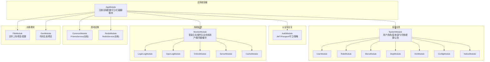
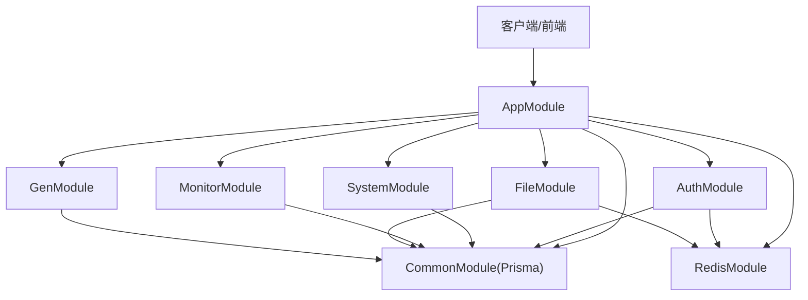
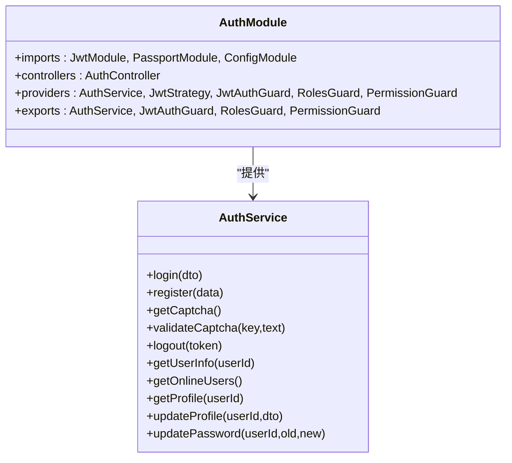
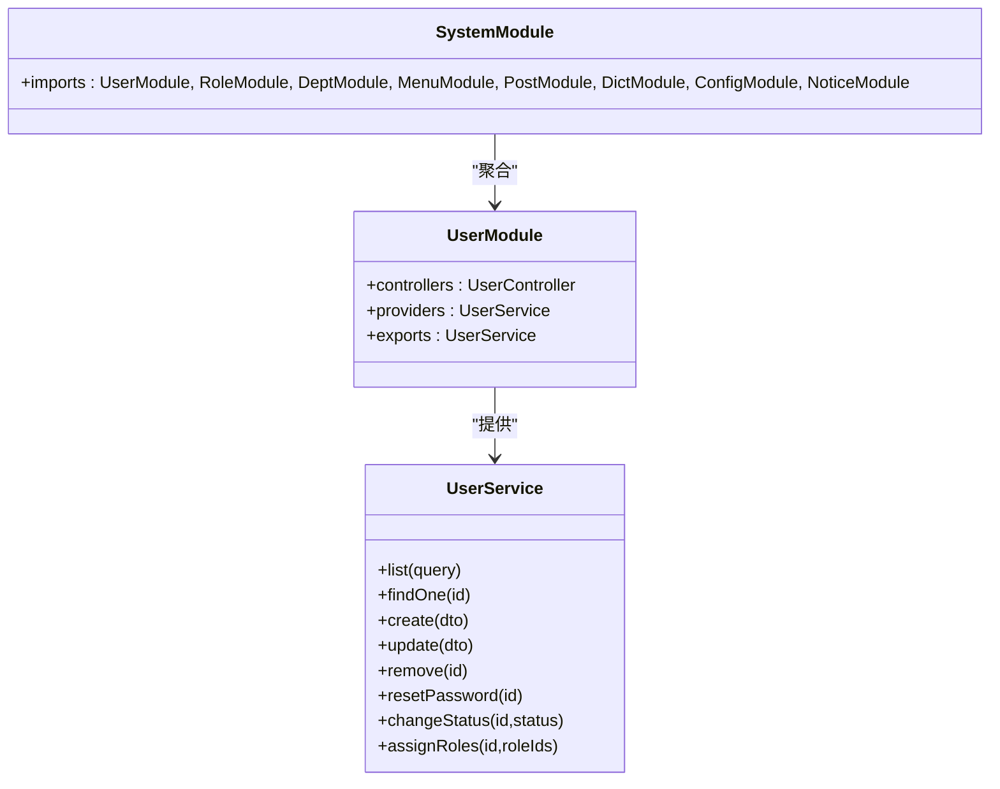
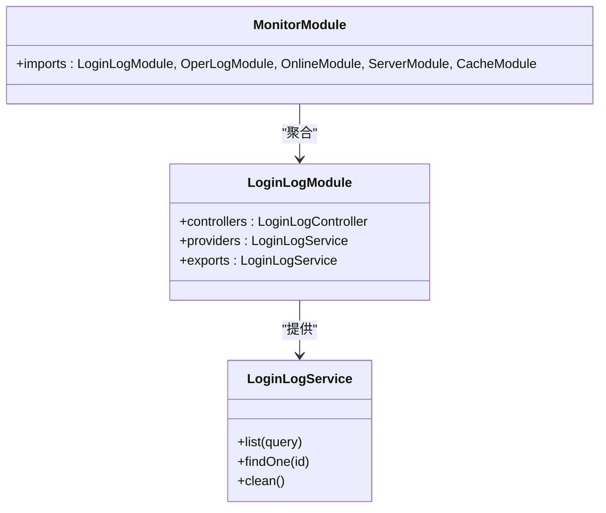
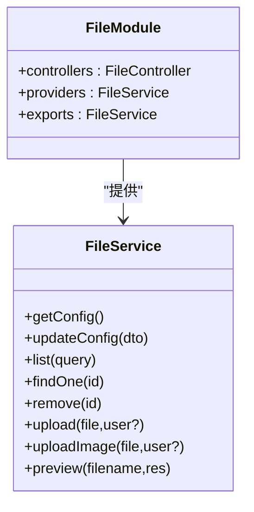
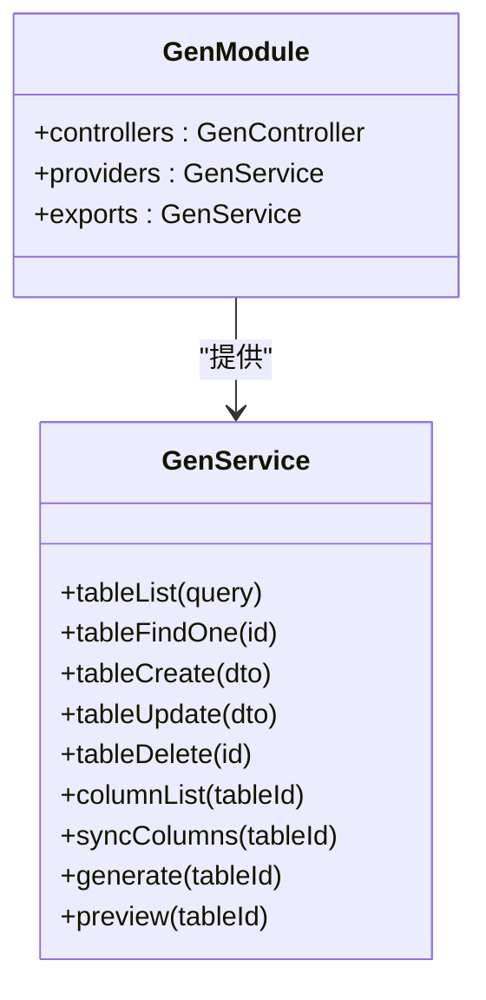
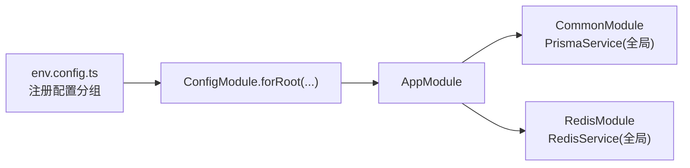
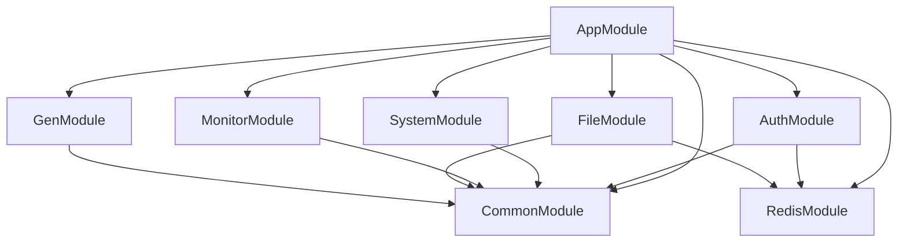

# 模块化设计

<cite>
**本文引用的文件**
- [apps/backend/src/app.module.ts](file://apps/backend/src/app.module.ts)
- [apps/backend/src/auth/auth.module.ts](file://apps/backend/src/auth/auth.module.ts)
- [apps/backend/src/modules/system/system.module.ts](file://apps/backend/src/modules/system/system.module.ts)
- [apps/backend/src/modules/monitor/monitor.module.ts](file://apps/backend/src/modules/monitor/monitor.module.ts)
- [apps/backend/src/modules/file/file.module.ts](file://apps/backend/src/modules/file/file.module.ts)
- [apps/backend/src/modules/gen/gen.module.ts](file://apps/backend/src/modules/gen/gen.module.ts)
- [apps/backend/src/common/common.module.ts](file://apps/backend/src/common/common.module.ts)
- [apps/backend/src/cache/redis.module.ts](file://apps/backend/src/cache/redis.module.ts)
- [apps/backend/src/modules/system/user/user.module.ts](file://apps/backend/src/modules/system/user/user.module.ts)
- [apps/backend/src/modules/system/role/role.module.ts](file://apps/backend/src/modules/system/role/role.module.ts)
- [apps/backend/src/modules/system/menu/menu.module.ts](file://apps/backend/src/modules/system/menu/menu.module.ts)
- [apps/backend/src/modules/monitor/login-log/login-log.module.ts](file://apps/backend/src/modules/monitor/login-log/login-log.module.ts)
- [apps/backend/src/auth/auth.service.ts](file://apps/backend/src/auth/auth.service.ts)
- [apps/backend/src/modules/system/user/user.service.ts](file://apps/backend/src/modules/system/user/user.service.ts)
- [apps/backend/src/modules/monitor/login-log/login-log.service.ts](file://apps/backend/src/modules/monitor/login-log/login-log.service.ts)
- [apps/backend/src/modules/file/file.service.ts](file://apps/backend/src/modules/file/file.service.ts)
- [apps/backend/src/modules/gen/gen.service.ts](file://apps/backend/src/modules/gen/gen.service.ts)
- [apps/backend/src/config/env.config.ts](file://apps/backend/src/config/env.config.ts)
</cite>

## 目录
1. [引言](#引言)
2. [项目结构](#项目结构)
3. [核心组件](#核心组件)
4. [架构总览](#架构总览)
5. [详细组件分析](#详细组件分析)
6. [依赖分析](#依赖分析)
7. [性能考虑](#性能考虑)
8. [故障排查指南](#故障排查指南)
9. [结论](#结论)
10. [附录](#附录)

## 引言
本设计文档围绕 Nest-Admin-Pro 的后端模块化架构展开，重点阐述以下核心模块的设计理念与职责边界：AuthModule（认证授权）、SystemModule（业务数据管理）、MonitorModule（系统监控）、FileModule（文件存储）、GenModule（代码生成）。文档将解释模块间依赖关系与通信机制，梳理模块生命周期管理、配置注入与模块化测试策略，并总结最佳实践与扩展指南，帮助开发者快速理解并安全地新增功能模块。

## 项目结构
后端采用 NestJS 应用入口集中注册各子模块的方式组织代码。AppModule 作为根容器，统一导入配置、限流、调度、全局拦截器与守卫，并装配 AuthModule、SystemModule、MonitorModule、FileModule、GenModule 等子模块。SystemModule 再进一步聚合用户、角色、菜单、部门、字典、配置、公告等业务子模块；MonitorModule 聚合登录日志、操作日志、在线用户、服务器、缓存等监控子模块。

图表来源
- [apps/backend/src/app.module.ts:18-58](file://apps/backend/src/app.module.ts#L18-L58)
- [apps/backend/src/auth/auth.module.ts:11-28](file://apps/backend/src/auth/auth.module.ts#L11-L28)
- [apps/backend/src/modules/system/system.module.ts:11-22](file://apps/backend/src/modules/system/system.module.ts#L11-L22)
- [apps/backend/src/modules/monitor/monitor.module.ts:8-10](file://apps/backend/src/modules/monitor/monitor.module.ts#L8-L10)
- [apps/backend/src/common/common.module.ts:4-8](file://apps/backend/src/common/common.module.ts#L4-L8)
- [apps/backend/src/cache/redis.module.ts:4-8](file://apps/backend/src/cache/redis.module.ts#L4-L8)

章节来源
- [apps/backend/src/app.module.ts:18-58](file://apps/backend/src/app.module.ts#L18-L58)

## 核心组件
- AppModule：应用根模块，负责全局配置加载、限流、任务调度、全局守卫与拦截器注册，并装配所有业务与基础设施模块。
- AuthModule：提供认证授权能力，包括 JWT 签发与校验、基于角色与权限的守卫、验证码校验、登录日志记录与在线用户管理。
- SystemModule：业务数据中枢，聚合用户、角色、菜单、部门、字典、配置、公告等子模块，支撑后台管理系统的核心数据模型。
- MonitorModule：系统运行时监控，聚合登录日志、操作日志、在线用户、服务器状态、缓存状态等子模块，提供可观测性能力。
- FileModule：文件存储与管理，支持本地与多家云存储（通过工厂与类型抽象），提供上传、预览、删除、配置管理等能力。
- GenModule：代码生成模块，面向数据库表定义，生成前后端代码骨架，便于快速落地新业务实体。

章节来源
- [apps/backend/src/app.module.ts:18-58](file://apps/backend/src/app.module.ts#L18-L58)
- [apps/backend/src/auth/auth.module.ts:11-28](file://apps/backend/src/auth/auth.module.ts#L11-L28)
- [apps/backend/src/modules/system/system.module.ts:11-22](file://apps/backend/src/modules/system/system.module.ts#L11-L22)
- [apps/backend/src/modules/monitor/monitor.module.ts:8-10](file://apps/backend/src/modules/monitor/monitor.module.ts#L8-L10)
- [apps/backend/src/modules/file/file.module.ts:5-9](file://apps/backend/src/modules/file/file.module.ts#L5-L9)
- [apps/backend/src/modules/gen/gen.module.ts:5-9](file://apps/backend/src/modules/gen/gen.module.ts#L5-L9)

## 架构总览
模块化架构遵循“根容器装配 + 子模块分层 + 基础设施全局”的原则。AppModule 统一注入全局配置、限流、调度与拦截器；AuthModule 通过 JwtModule 与 Passport 提供认证能力；SystemModule 以领域模型为中心聚合业务子模块；MonitorModule 以事件与指标为中心提供可观测性；FileModule 与 GenModule 分别承担基础设施与开发效率增强。

图表来源
- [apps/backend/src/app.module.ts:18-58](file://apps/backend/src/app.module.ts#L18-L58)
- [apps/backend/src/common/common.module.ts:4-8](file://apps/backend/src/common/common.module.ts#L4-L8)
- [apps/backend/src/cache/redis.module.ts:4-8](file://apps/backend/src/cache/redis.module.ts#L4-L8)

## 详细组件分析

### 认证授权模块（AuthModule）
- 设计理念：以 JWT 为核心的身份认证与授权，结合验证码防刷、登录日志与在线用户管理，形成闭环的安全体系。
- 关键职责：
  - 登录/登出：校验验证码、密码比对、签发 JWT、维护在线用户集合。
  - 用户信息：按角色构建菜单树、提取权限点、返回用户资料。
  - 配置注入：从配置服务读取密钥与过期时间，确保可配置性。
- 依赖关系：依赖 PrismaService 进行用户与登录日志查询，依赖 RedisService 维护在线用户与验证码。
- 生命周期：由 AppModule 注入，JwtModule 与 PassportModule 在模块内初始化，导出守卫与策略供全局使用。

图表来源
- [apps/backend/src/auth/auth.module.ts:11-28](file://apps/backend/src/auth/auth.module.ts#L11-L28)
- [apps/backend/src/auth/auth.service.ts:20-293](file://apps/backend/src/auth/auth.service.ts#L20-L293)

章节来源
- [apps/backend/src/auth/auth.module.ts:11-28](file://apps/backend/src/auth/auth.module.ts#L11-L28)
- [apps/backend/src/auth/auth.service.ts:20-293](file://apps/backend/src/auth/auth.service.ts#L20-L293)

### 业务数据模块（SystemModule）
- 设计理念：以“用户-角色-菜单-部门-字典-配置-公告”为核心的后台业务数据域，采用细粒度子模块解耦，便于独立演进与测试。
- 关键职责：
  - 用户管理：列表、详情、创建、更新、删除、重置密码、状态变更、角色分配。
  - 角色/菜单/部门/字典/配置/公告：提供标准 CRUD 能力与必要的业务约束。
- 依赖关系：依赖 PrismaService 与 RedisService（部分子模块）进行数据持久化与缓存。
- 生命周期：SystemModule 作为聚合容器，内部子模块各自导出服务供上层控制器或其它模块使用。

图表来源
- [apps/backend/src/modules/system/system.module.ts:11-22](file://apps/backend/src/modules/system/system.module.ts#L11-L22)
- [apps/backend/src/modules/system/user/user.module.ts:5-9](file://apps/backend/src/modules/system/user/user.module.ts#L5-L9)
- [apps/backend/src/modules/system/user/user.service.ts:12-143](file://apps/backend/src/modules/system/user/user.service.ts#L12-L143)

章节来源
- [apps/backend/src/modules/system/system.module.ts:11-22](file://apps/backend/src/modules/system/system.module.ts#L11-L22)
- [apps/backend/src/modules/system/user/user.module.ts:5-9](file://apps/backend/src/modules/system/user/user.module.ts#L5-L9)
- [apps/backend/src/modules/system/user/user.service.ts:12-143](file://apps/backend/src/modules/system/user/user.service.ts#L12-L143)

### 系统监控模块（MonitorModule）
- 设计理念：围绕“登录日志、操作日志、在线用户、服务器、缓存”五大维度构建监控体系，保障系统运行稳定与可追溯。
- 关键职责：
  - 登录日志：分页查询、详情、清理。
  - 操作日志/在线用户/服务器/缓存：提供查询与统计能力（具体实现按子模块暴露）。
- 依赖关系：依赖 PrismaService 进行日志与指标持久化。
- 生命周期：MonitorModule 聚合各子模块，子模块各自导出服务。

图表来源
- [apps/backend/src/modules/monitor/monitor.module.ts:8-10](file://apps/backend/src/modules/monitor/monitor.module.ts#L8-L10)
- [apps/backend/src/modules/monitor/login-log/login-log.module.ts:5-9](file://apps/backend/src/modules/monitor/login-log/login-log.module.ts#L5-L9)
- [apps/backend/src/modules/monitor/login-log/login-log.service.ts:4-30](file://apps/backend/src/modules/monitor/login-log/login-log.service.ts#L4-L30)

章节来源
- [apps/backend/src/modules/monitor/monitor.module.ts:8-10](file://apps/backend/src/modules/monitor/monitor.module.ts#L8-L10)
- [apps/backend/src/modules/monitor/login-log/login-log.module.ts:5-9](file://apps/backend/src/modules/monitor/login-log/login-log.module.ts#L5-L9)
- [apps/backend/src/modules/monitor/login-log/login-log.service.ts:4-30](file://apps/backend/src/modules/monitor/login-log/login-log.service.ts#L4-L30)

### 文件存储模块（FileModule）
- 设计理念：通过“配置即代码”的方式抽象多种存储后端（本地/云存储），在不改变上层调用的前提下灵活切换。
- 关键职责：
  - 配置管理：读取/更新文件存储配置（存储类型、上传目录、大小限制、云存储参数等）。
  - 文件操作：上传（普通/图片）、删除、预览、列表查询。
  - 兼容字段：向后兼容旧版字段名，保证客户端平滑升级。
- 依赖关系：依赖 PrismaService 持久化文件元数据，依赖 StorageProviderFactory 与各类云存储 Provider 实现多后端适配。
- 生命周期：FileModule 导出 FileService，供控制器调用；配置通过系统配置表动态生效。

图表来源
- [apps/backend/src/modules/file/file.module.ts:5-9](file://apps/backend/src/modules/file/file.module.ts#L5-L9)
- [apps/backend/src/modules/file/file.service.ts:41-309](file://apps/backend/src/modules/file/file.service.ts#L41-L309)

章节来源
- [apps/backend/src/modules/file/file.module.ts:5-9](file://apps/backend/src/modules/file/file.module.ts#L5-L9)
- [apps/backend/src/modules/file/file.service.ts:41-309](file://apps/backend/src/modules/file/file.service.ts#L41-L309)

### 代码生成模块（GenModule）
- 设计理念：面向数据库表定义的代码生成器，自动生成后端控制器/服务/DTO 与前端页面/接口/表单组件，提升开发效率。
- 关键职责：
  - 表定义管理：增删改查表与字段定义，支持排序与同步。
  - 生成与预览：生成后端/前端代码清单，或返回代码片段用于预览。
- 依赖关系：依赖 PrismaService 进行表与字段元数据管理。
- 生命周期：GenModule 导出 GenService，供控制器调用。

图表来源
- [apps/backend/src/modules/gen/gen.module.ts:5-9](file://apps/backend/src/modules/gen/gen.module.ts#L5-L9)
- [apps/backend/src/modules/gen/gen.service.ts:6-104](file://apps/backend/src/modules/gen/gen.service.ts#L6-L104)

章节来源
- [apps/backend/src/modules/gen/gen.module.ts:5-9](file://apps/backend/src/modules/gen/gen.module.ts#L5-L9)
- [apps/backend/src/modules/gen/gen.service.ts:6-104](file://apps/backend/src/modules/gen/gen.service.ts#L6-L104)

### 配置注入与基础设施
- 全局配置：AppModule 使用 ConfigModule 加载 env.config 中的配置分组（应用、数据库、Redis、邮件、微信等），并通过 ConfigService 注入到各模块。
- 全局服务：
  - PrismaService：通过 Global 模块注入，贯穿所有业务模块。
  - RedisService：通过 Global 模块注入，为认证与文件模块提供在线用户与缓存能力。

图表来源
- [apps/backend/src/config/env.config.ts:3-46](file://apps/backend/src/config/env.config.ts#L3-L46)
- [apps/backend/src/app.module.ts:18-58](file://apps/backend/src/app.module.ts#L18-L58)
- [apps/backend/src/common/common.module.ts:4-8](file://apps/backend/src/common/common.module.ts#L4-L8)
- [apps/backend/src/cache/redis.module.ts:4-8](file://apps/backend/src/cache/redis.module.ts#L4-L8)

章节来源
- [apps/backend/src/config/env.config.ts:3-46](file://apps/backend/src/config/env.config.ts#L3-L46)
- [apps/backend/src/app.module.ts:18-58](file://apps/backend/src/app.module.ts#L18-L58)
- [apps/backend/src/common/common.module.ts:4-8](file://apps/backend/src/common/common.module.ts#L4-L8)
- [apps/backend/src/cache/redis.module.ts:4-8](file://apps/backend/src/cache/redis.module.ts#L4-L8)

## 依赖分析
- 耦合关系：
  - AppModule 与各子模块为“装配关系”，低耦合高内聚。
  - SystemModule 与 MonitorModule 与基础设施模块存在跨域依赖（CommonModule/RedisModule），但通过服务导出避免直接耦合控制器。
  - FileModule 与 GenModule 仅依赖 PrismaService，保持与认证/监控的弱耦合。
- 外部依赖：
  - JWT 与 Passport：用于认证与授权。
  - Redis：用于在线用户与验证码缓存。
  - Prisma：统一数据访问层。
- 循环依赖：当前结构未见循环依赖迹象，模块间通过服务导出与控制器装配维持清晰边界。

图表来源
- [apps/backend/src/app.module.ts:18-58](file://apps/backend/src/app.module.ts#L18-L58)
- [apps/backend/src/auth/auth.module.ts:11-28](file://apps/backend/src/auth/auth.module.ts#L11-L28)
- [apps/backend/src/modules/system/system.module.ts:11-22](file://apps/backend/src/modules/system/system.module.ts#L11-L22)
- [apps/backend/src/modules/monitor/monitor.module.ts:8-10](file://apps/backend/src/modules/monitor/monitor.module.ts#L8-L10)
- [apps/backend/src/modules/file/file.module.ts:5-9](file://apps/backend/src/modules/file/file.module.ts#L5-L9)
- [apps/backend/src/modules/gen/gen.module.ts:5-9](file://apps/backend/src/modules/gen/gen.module.ts#L5-L9)
- [apps/backend/src/common/common.module.ts:4-8](file://apps/backend/src/common/common.module.ts#L4-L8)
- [apps/backend/src/cache/redis.module.ts:4-8](file://apps/backend/src/cache/redis.module.ts#L4-L8)

章节来源
- [apps/backend/src/app.module.ts:18-58](file://apps/backend/src/app.module.ts#L18-L58)

## 性能考虑
- 缓存策略：利用 Redis 缓存在线用户与验证码，降低数据库压力；建议对热点查询（如用户菜单树）增加缓存层。
- 数据库优化：批量查询与分页查询（如用户列表、文件列表）已采用并发计数与分页，建议在高并发场景下引入连接池与只读副本。
- 文件上传：本地上传建议配合 CDN 与对象存储，控制最大文件尺寸与并发上传数量，避免阻塞请求线程。
- 代码生成：生成过程建议异步执行并落盘缓存，避免阻塞主线程。

## 故障排查指南
- 登录失败：
  - 检查验证码是否有效且未过期。
  - 核对用户名是否存在、账户是否启用。
  - 查看登录日志与失败原因。
- 文件上传失败：
  - 检查文件大小与类型限制。
  - 校验存储配置（云存储参数、前缀、CDN 地址）。
  - 确认对象存储可用性与权限。
- 在线用户异常：
  - 检查 Redis 连接与键空间。
  - 确认登出流程是否正确移除在线用户。
- 代码生成异常：
  - 检查表定义与字段定义是否完整。
  - 确认生成目标路径可写。

章节来源
- [apps/backend/src/auth/auth.service.ts:29-133](file://apps/backend/src/auth/auth.service.ts#L29-L133)
- [apps/backend/src/modules/file/file.service.ts:150-209](file://apps/backend/src/modules/file/file.service.ts#L150-L209)
- [apps/backend/src/modules/monitor/login-log/login-log.service.ts:8-30](file://apps/backend/src/modules/monitor/login-log/login-log.service.ts#L8-L30)

## 结论
该模块化设计以 AppModule 为根容器，通过 AuthModule、SystemModule、MonitorModule、FileModule、GenModule 的清晰职责划分与弱耦合依赖，实现了认证安全、业务数据、系统监控、文件存储与代码生成的完整能力矩阵。配合全局配置与基础设施模块，系统具备良好的可扩展性与可维护性。建议在新增模块时遵循“小而美”的子模块设计、明确导出服务、最小化跨模块依赖，并配套完善的测试策略。

## 附录
- 模块化测试策略建议：
  - 单元测试：针对每个 Service 的核心方法（如 AuthService.login、UserService.list、FileService.upload）编写独立测试，使用内存数据库与 Mock Redis。
  - 集成测试：以子模块为单位进行集成，验证控制器到服务的端到端流程。
  - 监控测试：验证登录日志、操作日志、在线用户等监控链路。
  - 配置测试：覆盖 env.config 与系统配置表的读取与回退逻辑。
- 扩展新模块最佳实践：
  - 新建子模块文件夹，定义 module/controller/service/dto，按需导出服务。
  - 在根模块中注册模块，必要时在 AppModule 中注入全局服务。
  - 通过 ConfigService 注入配置，避免硬编码。
  - 明确依赖边界，尽量只依赖 CommonModule 与需要的基础设施模块。
  - 为新模块编写单元与集成测试，确保质量与可维护性。