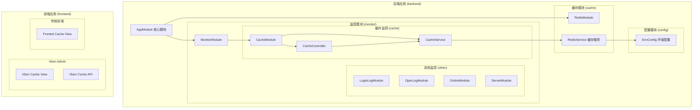
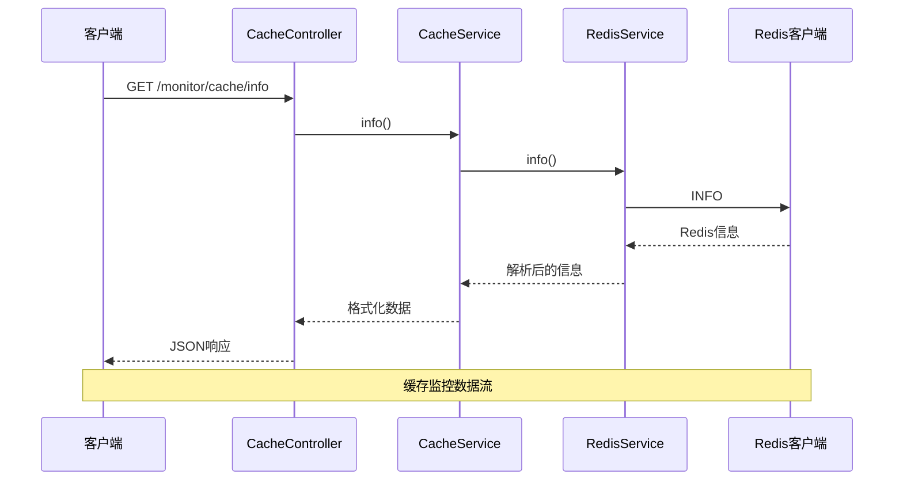
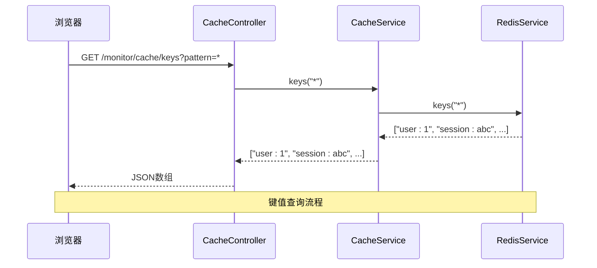

# Redis缓存监控

<cite>
**本文档引用的文件**
- [apps/backend/src/cache/redis.module.ts](file://apps/backend/src/cache/redis.module.ts)
- [apps/backend/src/cache/redis.service.ts](file://apps/backend/src/cache/redis.service.ts)
- [apps/backend/src/config/env.config.ts](file://apps/backend/src/config/env.config.ts)
- [apps/backend/src/modules/monitor/cache/cache.module.ts](file://apps/backend/src/modules/monitor/cache/cache.module.ts)
- [apps/backend/src/modules/monitor/cache/cache.service.ts](file://apps/backend/src/modules/monitor/cache/cache.service.ts)
- [apps/backend/src/modules/monitor/cache/cache.controller.ts](file://apps/backend/src/modules/monitor/cache/cache.controller.ts)
- [apps/backend/src/modules/monitor/monitor.module.ts](file://apps/backend/src/modules/monitor/monitor.module.ts)
- [apps/backend/src/app.module.ts](file://apps/backend/src/app.module.ts)
- [apps/vben-admin/apps/web-antd/src/api/monitor/cache.ts](file://apps/vben-admin/apps/web-antd/src/api/monitor/cache.ts)
- [apps/vben-admin/apps/web-antd/src/views/monitor/cache/index.vue](file://apps/vben-admin/apps/web-antd/src/views/monitor/cache/index.vue)
- [apps/fronted/src/views/monitor/cache/index.vue](file://apps/fronted/src/views/monitor/cache/index.vue)
</cite>

## 目录
1. [简介](#简介)
2. [项目结构](#项目结构)
3. [核心组件](#核心组件)
4. [架构概览](#架构概览)
5. [详细组件分析](#详细组件分析)
6. [依赖关系分析](#依赖关系分析)
7. [性能考虑](#性能考虑)
8. [故障排除指南](#故障排除指南)
9. [结论](#结论)
10. [附录](#附录)

## 简介

本项目实现了完整的Redis缓存监控功能，包括连接池监控、内存使用情况和性能指标跟踪。系统提供了实时的Redis实例健康检查、缓存命中率统计、内存占用监控、连接数跟踪以及命令响应时间分析等功能。

该监控系统采用前后端分离架构，后端基于NestJS框架构建RESTful API，前端提供可视化界面，支持缓存信息查看、键值管理、缓存清理等操作。

## 项目结构

Redis缓存监控功能主要分布在以下模块中：



**图表来源**
- [apps/backend/src/app.module.ts:18-38](file://apps/backend/src/app.module.ts#L18-L38)
- [apps/backend/src/cache/redis.module.ts:4-8](file://apps/backend/src/cache/redis.module.ts#L4-L8)
- [apps/backend/src/modules/monitor/monitor.module.ts:8-9](file://apps/backend/src/modules/monitor/monitor.module.ts#L8-L9)

**章节来源**
- [apps/backend/src/app.module.ts:18-38](file://apps/backend/src/app.module.ts#L18-L38)
- [apps/backend/src/cache/redis.module.ts:4-8](file://apps/backend/src/cache/redis.module.ts#L4-L8)
- [apps/backend/src/modules/monitor/monitor.module.ts:8-9](file://apps/backend/src/modules/monitor/monitor.module.ts#L8-L9)

## 核心组件

### Redis连接池管理

Redis服务通过ioredis库实现高性能连接池管理，支持自动重连、错误处理和优雅关闭。

**章节来源**
- [apps/backend/src/cache/redis.service.ts:8-27](file://apps/backend/src/cache/redis.service.ts#L8-L27)

### 缓存监控API

监控模块提供完整的Redis缓存管理接口，包括信息获取、键值操作和缓存清理功能。

**章节来源**
- [apps/backend/src/modules/monitor/cache/cache.controller.ts:13-48](file://apps/backend/src/modules/monitor/cache/cache.controller.ts#L13-L48)
- [apps/backend/src/modules/monitor/cache/cache.service.ts:8-28](file://apps/backend/src/modules/monitor/cache/cache.service.ts#L8-L28)

### 前端可视化界面

提供两个版本的前端界面：基于Ant Design Vue的现代化界面和基于传统前端框架的界面。

**章节来源**
- [apps/vben-admin/apps/web-antd/src/views/monitor/cache/index.vue:60-113](file://apps/vben-admin/apps/web-antd/src/views/monitor/cache/index.vue#L60-L113)
- [apps/fronted/src/views/monitor/cache/index.vue:1-106](file://apps/fronted/src/views/monitor/cache/index.vue#L1-106)

## 架构概览

系统采用分层架构设计，确保关注点分离和代码可维护性：



**图表来源**
- [apps/backend/src/modules/monitor/cache/cache.controller.ts:16-18](file://apps/backend/src/modules/monitor/cache/cache.controller.ts#L16-L18)
- [apps/backend/src/modules/monitor/cache/cache.service.ts:9](file://apps/backend/src/modules/monitor/cache/cache.service.ts#L9)
- [apps/backend/src/cache/redis.service.ts:70-80](file://apps/backend/src/cache/redis.service.ts#L70-L80)

系统架构特点：
- **模块化设计**：缓存功能独立为模块，便于维护和扩展
- **依赖注入**：利用NestJS的依赖注入机制管理组件关系
- **中间件集成**：集成了JWT认证和权限控制
- **配置管理**：统一的环境变量配置管理

## 详细组件分析

### Redis服务组件

Redis服务是整个缓存系统的核心，负责与Redis数据库建立连接并提供各种缓存操作。

```mermaid
classDiagram
class RedisService {
-client : Redis
+constructor()
+onModuleDestroy() void
+get(key : string) Promise~T|null~
+set(key : string, value : any, ttlSeconds? : number) Promise~void~
+del(key : string) Promise~void~
+exists(key : string) Promise~boolean~
+ttl(key : string) Promise~number~
+keys(pattern : string) Promise~string[]~
+flushdb() Promise~void~
+info(section? : string) Promise~Record~string,string~~
+setOnlineUser(token : string, userId : string, ttlSeconds? : number) Promise~void~
+removeOnlineUser(token : string) Promise~void~
+getOnlineUser(token : string) Promise~string|null~
+getOnlineUsers() Promise~string[]~
+hset(key : string, field : string, value : any) Promise~void~
+hget(key : string, field : string) Promise~T|null~
+hgetall(key : string) Promise~Record~string,T~~
}
class Redis {
+on(event : string, callback : Function) void
+get(key : string) Promise~string~
+set(key : string, value : string) Promise~string~
+setex(key : string, seconds : number, value : string) Promise~string~
+del(keys : string) Promise~number~
+exists(keys : string) Promise~number~
+ttl(key : string) Promise~number~
+keys(pattern : string) Promise~string[]~
+flushdb() Promise~string~
+info(section? : string) Promise~string~
+sadd(key : string, members : string) Promise~number~
+srem(key : string, members : string) Promise~number~
+smembers(key : string) Promise~string[]~
+hset(key : string, field : string, value : string) Promise~number~
+hget(key : string, field : string) Promise~string~
+hgetall(key : string) Promise~Record~string,string~~
}
RedisService --> Redis : 使用
note for RedisService : "提供JSON序列化<br/>支持TTL过期<br/>在线用户管理<br/>哈希操作"
```

**图表来源**
- [apps/backend/src/cache/redis.service.ts:5-127](file://apps/backend/src/cache/redis.service.ts#L5-L127)

**章节来源**
- [apps/backend/src/cache/redis.service.ts:8-27](file://apps/backend/src/cache/redis.service.ts#L8-L27)
- [apps/backend/src/cache/redis.service.ts:29-64](file://apps/backend/src/cache/redis.service.ts#L29-L64)
- [apps/backend/src/cache/redis.service.ts:82-99](file://apps/backend/src/cache/redis.service.ts#L82-L99)
- [apps/backend/src/cache/redis.service.ts:102-127](file://apps/backend/src/cache/redis.service.ts#L102-L127)

### 缓存监控控制器

缓存监控控制器提供RESTful API接口，支持缓存信息查询、键值管理和缓存清理操作。



**图表来源**
- [apps/backend/src/modules/monitor/cache/cache.controller.ts:20-25](file://apps/backend/src/modules/monitor/cache/cache.controller.ts#L20-L25)
- [apps/backend/src/modules/monitor/cache/cache.service.ts:12-14](file://apps/backend/src/modules/monitor/cache/cache.service.ts#L12-L14)

**章节来源**
- [apps/backend/src/modules/monitor/cache/cache.controller.ts:13-48](file://apps/backend/src/modules/monitor/cache/cache.controller.ts#L13-L48)
- [apps/backend/src/modules/monitor/cache/cache.service.ts:8-28](file://apps/backend/src/modules/monitor/cache/cache.service.ts#L8-L28)

### 前端缓存监控界面

前端提供了两种不同的界面实现，都支持相同的缓存监控功能。

**Vben Admin界面特点**：
- 基于Ant Design Vue组件库
- 响应式布局设计
- 实时数据展示
- 操作确认机制

**传统前端界面特点**：
- 基于Element Plus组件
- 卡片式布局
- 键值详情弹窗
- 批量操作支持

**章节来源**
- [apps/vben-admin/apps/web-antd/src/views/monitor/cache/index.vue:13-57](file://apps/vben-admin/apps/web-antd/src/views/monitor/cache/index.vue#L13-L57)
- [apps/fronted/src/views/monitor/cache/index.vue:74-106](file://apps/fronted/src/views/monitor/cache/index.vue#L74-L106)

### 性能指标监控

系统能够监控以下关键性能指标：

```mermaid
flowchart TD
Start([开始监控]) --> CollectInfo["收集Redis信息"]
CollectInfo --> ParseInfo["解析INFO输出"]
ParseInfo --> ExtractMetrics["提取关键指标"]
ExtractMetrics --> MemoryMetrics["内存指标<br/>- used_memory<br/>- used_memory_human<br/>- maxmemory"]
ExtractMetrics --> ConnectionMetrics["连接指标<br/>- connected_clients<br/>- total_connections_received"]
ExtractMetrics --> PerformanceMetrics["性能指标<br/>- instantaneous_ops_per_sec<br/>- total_commands_processed"]
ExtractMetrics --> HitRateMetrics["命中率指标<br/>- keyspace_hits<br/>- keyspace_misses"]
MemoryMetrics --> Display["显示到界面"]
ConnectionMetrics --> Display
PerformanceMetrics --> Display
HitRateMetrics --> Display
Display --> End([结束])
note right of ExtractMetrics : "INFO命令输出格式解析"
note right of MemoryMetrics : "内存使用情况监控"
note right of ConnectionMetrics : "连接池使用情况"
note right of PerformanceMetrics : "命令执行性能"
note right of HitRateMetrics : "缓存命中率计算"
```

**图表来源**
- [apps/backend/src/cache/redis.service.ts:70-80](file://apps/backend/src/cache/redis.service.ts#L70-L80)
- [apps/vben-admin/apps/web-antd/src/api/monitor/cache.ts:3-14](file://apps/vben-admin/apps/web-antd/src/api/monitor/cache.ts#L3-L14)

**章节来源**
- [apps/backend/src/cache/redis.service.ts:70-80](file://apps/backend/src/cache/redis.service.ts#L70-L80)
- [apps/vben-admin/apps/web-antd/src/api/monitor/cache.ts:16-18](file://apps/vben-admin/apps/web-antd/src/api/monitor/cache.ts#L16-L18)

## 依赖关系分析

系统模块间的依赖关系清晰明确，遵循依赖倒置原则：

```mermaid
graph TB
subgraph "应用层"
AppModule[AppModule]
MonitorModule[MonitorModule]
end
subgraph "服务层"
RedisModule[RedisModule]
CacheModule[CacheModule]
end
subgraph "基础设施"
RedisService[RedisService]
CacheService[CacheService]
end
subgraph "接口层"
CacheController[CacheController]
end
subgraph "配置层"
EnvConfig[EnvConfig]
end
AppModule --> RedisModule
AppModule --> MonitorModule
MonitorModule --> CacheModule
CacheModule --> CacheController
CacheModule --> CacheService
CacheService --> RedisService
RedisModule --> RedisService
RedisService --> EnvConfig
RedisService -.->|"使用"| Redis[ioredis客户端]
note for RedisService : "单例模式<br/>连接池管理<br/>错误处理"
note for CacheService : "业务逻辑封装<br/>数据转换"
note for CacheController : "HTTP接口暴露<br/>权限控制"
```

**图表来源**
- [apps/backend/src/app.module.ts:32](file://apps/backend/src/app.module.ts#L32)
- [apps/backend/src/modules/monitor/monitor.module.ts:9](file://apps/backend/src/modules/monitor/monitor.module.ts#L9)
- [apps/backend/src/cache/redis.module.ts:6](file://apps/backend/src/cache/redis.module.ts#L6)

**章节来源**
- [apps/backend/src/app.module.ts:32](file://apps/backend/src/app.module.ts#L32)
- [apps/backend/src/modules/monitor/monitor.module.ts:9](file://apps/backend/src/modules/monitor/monitor.module.ts#L9)
- [apps/backend/src/cache/redis.module.ts:6](file://apps/backend/src/cache/redis.module.ts#L6)

## 性能考虑

### 连接池优化

系统使用ioredis默认连接池配置，建议根据生产环境调整以下参数：

- **最大连接数**：根据并发请求量设置
- **连接超时**：避免长时间阻塞
- **重试间隔**：平衡可用性和性能
- **命令超时**：防止慢查询影响整体性能

### 内存管理策略

```mermaid
flowchart TD
MemStart([内存监控]) --> CheckUsage{"内存使用率"}
CheckUsage --> |正常| Normal["维持现状"]
CheckUsage --> |偏高| HighMem["内存优化"]
CheckUsage --> |过高| Critical["紧急处理"]
HighMem --> SetMaxmemory["设置maxmemory"]
SetMaxmemory --> ConfigurePolicy["配置淘汰策略"]
ConfigurePolicy --> Monitor["持续监控"]
Critical --> FlushDB["清理过期键"]
FlushDB --> OptimizeKeyspace["优化键空间"]
OptimizeKeyspace --> Monitor
Normal --> Monitor
Monitor --> MemEnd([监控结束])
note right of HighMem : "使用率60-80%"
note right of Critical : "使用率>80%"
```

**图表来源**
- [apps/backend/src/cache/redis.service.ts:66-68](file://apps/backend/src/cache/redis.service.ts#L66-L68)

### 缓存命中率优化

缓存命中率是衡量缓存效果的重要指标：

- **命中率计算**：keyspace_hits / (keyspace_hits + keyspace_misses)
- **目标阈值**：>90%为优秀，>80%为良好
- **优化策略**：
  - 调整TTL值，避免过早过期
  - 使用预热机制
  - 优化键命名规范
  - 实施多级缓存策略

## 故障排除指南

### 常见问题诊断

**连接失败排查**：
1. 检查Redis服务器状态
2. 验证网络连通性
3. 确认认证凭据
4. 查看防火墙设置

**性能问题排查**：
1. 监控内存使用率
2. 分析慢查询日志
3. 检查连接池状态
4. 评估键空间分布

**章节来源**
- [apps/backend/src/cache/redis.service.ts:16-22](file://apps/backend/src/cache/redis.service.ts#L16-L22)

### 错误处理机制

系统实现了完善的错误处理机制：

```mermaid
flowchart TD
Request[请求处理] --> TryExecute["尝试执行Redis命令"]
TryExecute --> Success{"执行成功?"}
Success --> |是| ReturnSuccess["返回成功结果"]
Success --> |否| CatchError["捕获异常"]
CatchError --> LogError["记录错误日志"]
LogError --> CheckConnection{"连接有效?"}
CheckConnection --> |是| RetryOperation["重试操作"]
CheckConnection --> |否| Reconnect["重新连接"]
RetryOperation --> FinalResult["最终结果"]
Reconnect --> FinalResult
ReturnSuccess --> FinalResult
FinalResult --> End[结束]
note right of CatchError : "统一错误处理"
note right of CheckConnection : "连接健康检查"
```

**图表来源**
- [apps/backend/src/cache/redis.service.ts:20-22](file://apps/backend/src/cache/redis.service.ts#L20-L22)

**章节来源**
- [apps/backend/src/cache/redis.service.ts:20-22](file://apps/backend/src/cache/redis.service.ts#L20-L22)

## 结论

本Redis缓存监控系统提供了完整的缓存管理解决方案，具有以下优势：

1. **功能完整**：涵盖连接池监控、性能指标跟踪、内存管理等核心功能
2. **架构清晰**：模块化设计便于维护和扩展
3. **用户体验**：提供直观的可视化界面
4. **安全可靠**：集成权限控制和错误处理机制

建议在生产环境中进一步完善：
- 添加更详细的慢查询分析功能
- 实现集群状态监控
- 增加缓存策略优化建议
- 完善告警机制

## 附录

### API接口定义

| 接口 | 方法 | 参数 | 描述 |
|------|------|------|------|
| `/monitor/cache/info` | GET | 无 | 获取Redis实例信息 |
| `/monitor/cache/keys` | GET | `pattern` | 获取匹配的键列表 |
| `/monitor/cache/value` | GET | `key` | 获取指定键的值 |
| `/monitor/cache/clear` | POST | 无 | 清空所有缓存 |
| `/monitor/cache/delete` | POST | `key` | 删除指定键 |

### 环境配置

系统支持通过环境变量配置Redis连接参数：

- `REDIS_HOST`：Redis服务器地址
- `REDIS_PORT`：Redis端口号
- `REDIS_PASSWORD`：认证密码
- `REDIS_DB`：数据库编号

**章节来源**
- [apps/backend/src/config/env.config.ts:28-33](file://apps/backend/src/config/env.config.ts#L28-L33)