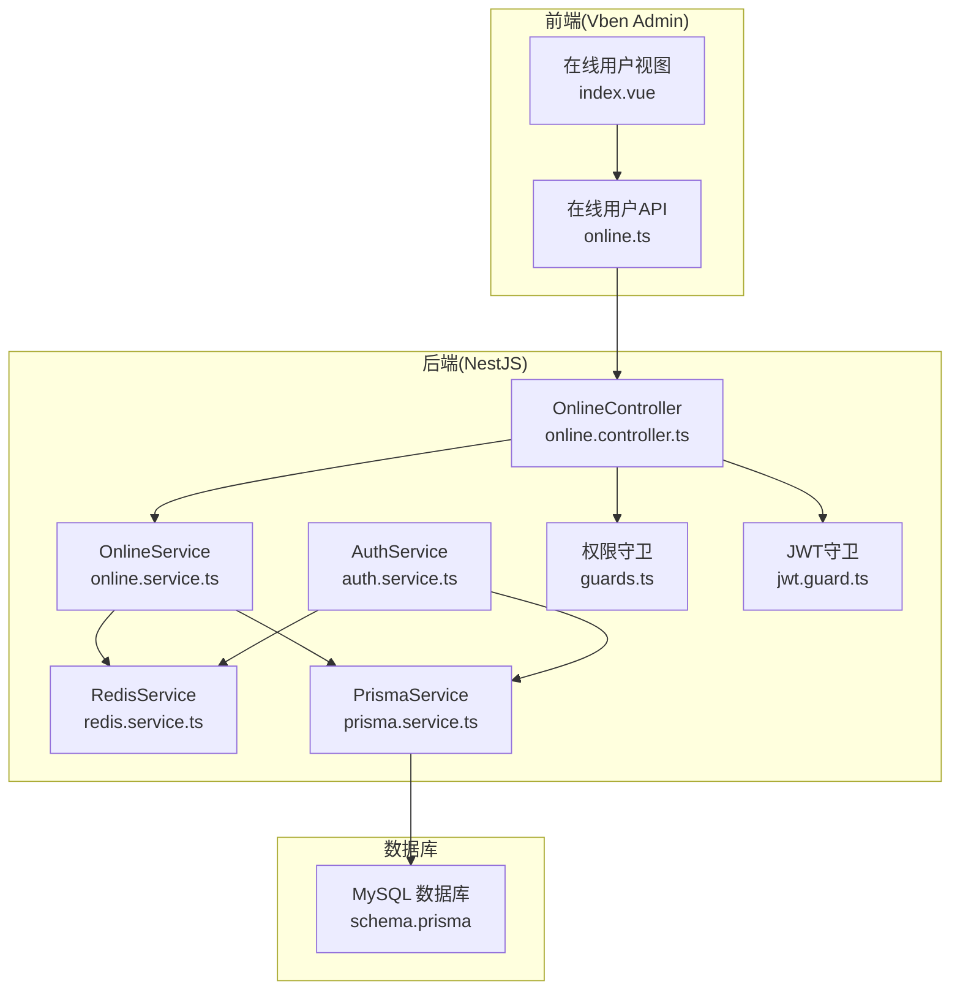
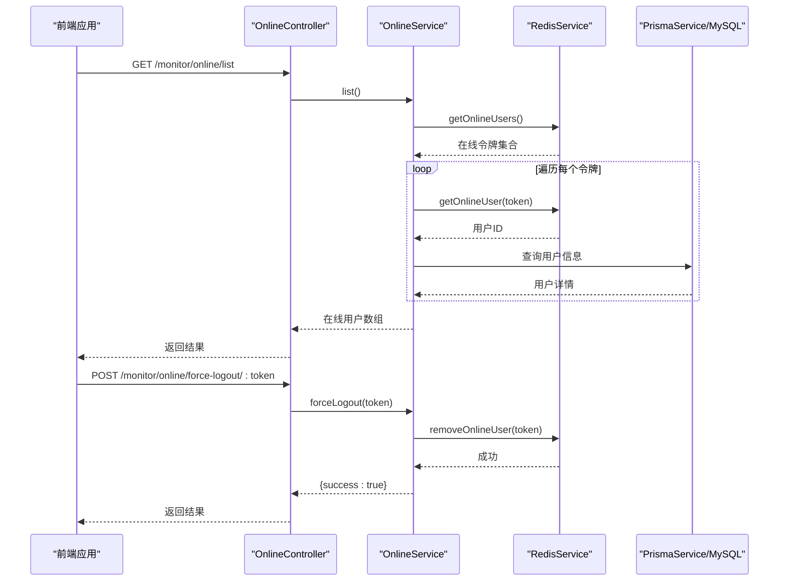
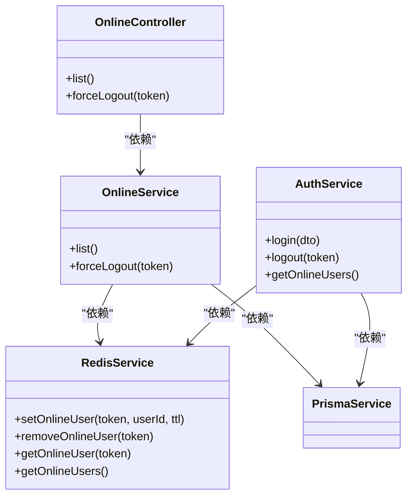

# 在线用户监控

<cite>
**本文档引用的文件**
- [online.controller.ts](file://apps/backend/src/modules/monitor/online/online.controller.ts)
- [online.service.ts](file://apps/backend/src/modules/monitor/online/online.service.ts)
- [online.module.ts](file://apps/backend/src/modules/monitor/online/online.module.ts)
- [redis.service.ts](file://apps/backend/src/cache/redis.service.ts)
- [auth.service.ts](file://apps/backend/src/auth/auth.service.ts)
- [guards.ts](file://apps/backend/src/auth/guards.ts)
- [jwt.guard.ts](file://apps/backend/src/auth/jwt.guard.ts)
- [prisma.service.ts](file://apps/backend/src/common/prisma.service.ts)
- [schema.prisma](file://apps/backend/prisma/schema.prisma)
- [online.ts](file://apps/vben-admin/apps/web-antd/src/api/monitor/online.ts)
- [index.vue](file://apps/vben-admin/apps/web-antd/src/views/monitor/online/index.vue)
- [user.ts](file://apps/app/src/stores/user.ts)
- [request.ts](file://apps/app/src/utils/request.ts)
</cite>

## 目录
1. [简介](#简介)
2. [项目结构](#项目结构)
3. [核心组件](#核心组件)
4. [架构总览](#架构总览)
5. [详细组件分析](#详细组件分析)
6. [依赖关系分析](#依赖关系分析)
7. [性能考虑](#性能考虑)
8. [故障排除指南](#故障排除指南)
9. [结论](#结论)
10. [附录](#附录)

## 简介
本文件针对在线用户监控功能进行系统化技术文档整理，覆盖在线用户状态跟踪、会话管理与并发控制机制。重点包括：用户连接检测、心跳机制、会话超时处理与强制下线；在线用户列表展示、用户活动监控、会话信息管理以及并发访问控制。同时提供在线用户API实现方案、实时状态更新与用户行为分析建议，并总结会话安全策略、并发限制配置与用户状态同步的最佳实践。

## 项目结构
在线用户监控功能由后端NestJS模块与前端Vben Admin界面共同组成，采用JWT鉴权、Redis缓存与MySQL数据库支撑的会话管理方案。

图表来源
- [online.controller.ts:1-28](file://apps/backend/src/modules/monitor/online/online.controller.ts#L1-L28)
- [online.service.ts:1-31](file://apps/backend/src/modules/monitor/online/online.service.ts#L1-L31)
- [redis.service.ts:1-128](file://apps/backend/src/cache/redis.service.ts#L1-L128)
- [auth.service.ts:1-294](file://apps/backend/src/auth/auth.service.ts#L1-L294)
- [guards.ts:1-51](file://apps/backend/src/auth/guards.ts#L1-L51)
- [jwt.guard.ts:1-5](file://apps/backend/src/auth/jwt.guard.ts#L1-L5)
- [prisma.service.ts:1-22](file://apps/backend/src/common/prisma.service.ts#L1-L22)
- [schema.prisma:1-347](file://apps/backend/prisma/schema.prisma#L1-L347)

章节来源
- [online.controller.ts:1-28](file://apps/backend/src/modules/monitor/online/online.controller.ts#L1-L28)
- [online.service.ts:1-31](file://apps/backend/src/modules/monitor/online/online.service.ts#L1-L31)
- [redis.service.ts:1-128](file://apps/backend/src/cache/redis.service.ts#L1-L128)
- [auth.service.ts:1-294](file://apps/backend/src/auth/auth.service.ts#L1-L294)
- [guards.ts:1-51](file://apps/backend/src/auth/guards.ts#L1-L51)
- [jwt.guard.ts:1-5](file://apps/backend/src/auth/jwt.guard.ts#L1-L5)
- [prisma.service.ts:1-22](file://apps/backend/src/common/prisma.service.ts#L1-L22)
- [schema.prisma:1-347](file://apps/backend/prisma/schema.prisma#L1-L347)

## 核心组件
- 在线用户控制器：提供获取在线用户列表与强制下线接口，受JWT与权限守卫保护。
- 在线用户服务：基于Redis集合维护在线用户令牌集合，结合Prisma查询用户基本信息。
- Redis服务：封装Redis客户端，提供在线用户集合与哈希操作，支持过期时间设置。
- 认证服务：在登录成功时将用户加入在线集合，在登出或强制下线时移除。
- 权限守卫：通过注解声明所需权限，确保调用方具备相应权限。
- 前端API与视图：提供在线用户列表展示与强制下线交互。

章节来源
- [online.controller.ts:1-28](file://apps/backend/src/modules/monitor/online/online.controller.ts#L1-L28)
- [online.service.ts:1-31](file://apps/backend/src/modules/monitor/online/online.service.ts#L1-L31)
- [redis.service.ts:82-128](file://apps/backend/src/cache/redis.service.ts#L82-L128)
- [auth.service.ts:29-133](file://apps/backend/src/auth/auth.service.ts#L29-L133)
- [guards.ts:16-51](file://apps/backend/src/auth/guards.ts#L16-L51)

## 架构总览
在线用户监控的整体流程如下：

图表来源
- [online.controller.ts:13-26](file://apps/backend/src/modules/monitor/online/online.controller.ts#L13-L26)
- [online.service.ts:9-30](file://apps/backend/src/modules/monitor/online/online.service.ts#L9-L30)
- [redis.service.ts:82-99](file://apps/backend/src/cache/redis.service.ts#L82-L99)
- [auth.service.ts:130-133](file://apps/backend/src/auth/auth.service.ts#L130-L133)

## 详细组件分析

### 在线用户控制器
- 接口职责
  - 获取在线用户列表：需要指定权限标识。
  - 强制下线：根据令牌移除在线用户。
- 安全控制
  - 使用JWT守卫与权限守卫，确保只有具备相应权限的用户可访问。

章节来源
- [online.controller.ts:1-28](file://apps/backend/src/modules/monitor/online/online.controller.ts#L1-L28)
- [guards.ts:16-51](file://apps/backend/src/auth/guards.ts#L16-L51)
- [jwt.guard.ts:1-5](file://apps/backend/src/auth/jwt.guard.ts#L1-L5)

### 在线用户服务
- 列表构建逻辑
  - 从Redis获取所有在线令牌集合。
  - 对每个令牌查询对应的用户ID并从数据库读取用户信息。
  - 组装返回对象，包含令牌与用户基本信息。
- 强制下线逻辑
  - 从Redis删除对应令牌的在线记录，并从集合中移除该令牌。
- 复杂度分析
  - 列表查询复杂度近似O(n)，n为在线用户数；每次查询用户信息涉及一次数据库查询。

章节来源
- [online.service.ts:9-30](file://apps/backend/src/modules/monitor/online/online.service.ts#L9-L30)
- [redis.service.ts:97-99](file://apps/backend/src/cache/redis.service.ts#L97-L99)
- [prisma.service.ts:1-22](file://apps/backend/src/common/prisma.service.ts#L1-L22)

### Redis服务（在线用户集合）
- 在线用户集合
  - 使用集合存储所有在线令牌，便于快速枚举。
  - 使用键值对存储令牌到用户ID的映射，便于按令牌查询用户。
- 过期策略
  - 在线令牌默认带过期时间，实现自动超时。
- 操作方法
  - 添加在线用户、移除在线用户、批量获取在线用户、查询单个用户。

章节来源
- [redis.service.ts:82-128](file://apps/backend/src/cache/redis.service.ts#L82-L128)

### 认证服务（登录/登出/在线集合）
- 登录流程
  - 校验验证码、校验用户与密码、签发JWT。
  - 将用户加入在线集合，记录登录日志。
- 登出流程
  - 移除在线集合中的用户。
- 在线查询
  - 提供便捷方法直接查询在线用户集合。

章节来源
- [auth.service.ts:29-89](file://apps/backend/src/auth/auth.service.ts#L29-L89)
- [auth.service.ts:130-133](file://apps/backend/src/auth/auth.service.ts#L130-L133)
- [auth.service.ts:205-207](file://apps/backend/src/auth/auth.service.ts#L205-L207)

### 前端集成
- 在线用户API
  - 提供获取列表与强制下线两个接口。
- 在线用户视图
  - 展示在线用户表格，支持强制下线操作。
- 用户状态同步
  - 登录/登出时更新本地状态；强制下线后刷新列表。

章节来源
- [online.ts:1-19](file://apps/vben-admin/apps/web-antd/src/api/monitor/online.ts#L1-L19)
- [index.vue:1-67](file://apps/vben-admin/apps/web-antd/src/views/monitor/online/index.vue#L1-L67)
- [user.ts:51-59](file://apps/app/src/stores/user.ts#L51-L59)
- [request.ts:10-45](file://apps/app/src/utils/request.ts#L10-L45)

### 数据模型与会话存储
- 用户模型
  - 包含基础字段如用户名、昵称、邮箱、电话等。
- 登录日志模型
  - 记录登录状态与消息，用于审计与异常追踪。
- 会话存储
  - 在线用户集合使用Redis集合；令牌到用户ID映射使用字符串键值对，支持过期。

章节来源
- [schema.prisma:13-38](file://apps/backend/prisma/schema.prisma#L13-L38)
- [schema.prisma:212-229](file://apps/backend/prisma/schema.prisma#L212-L229)
- [redis.service.ts:82-99](file://apps/backend/src/cache/redis.service.ts#L82-L99)

## 依赖关系分析

图表来源
- [online.controller.ts:1-28](file://apps/backend/src/modules/monitor/online/online.controller.ts#L1-L28)
- [online.service.ts:1-31](file://apps/backend/src/modules/monitor/online/online.service.ts#L1-L31)
- [redis.service.ts:1-128](file://apps/backend/src/cache/redis.service.ts#L1-L128)
- [auth.service.ts:1-294](file://apps/backend/src/auth/auth.service.ts#L1-L294)
- [prisma.service.ts:1-22](file://apps/backend/src/common/prisma.service.ts#L1-L22)

章节来源
- [online.module.ts:1-10](file://apps/backend/src/modules/monitor/online/online.module.ts#L1-L10)

## 性能考虑
- Redis集合与键值对的组合
  - 在线用户集合使用集合便于快速枚举；令牌到用户ID映射使用字符串键值对，查询开销低。
- 批量查询优化
  - 在线列表查询对每个令牌执行一次数据库查询，建议在高并发场景下：
    - 使用分页或限制最大在线人数。
    - 对用户信息进行缓存（如Redis哈希），减少数据库压力。
- TTL与内存管理
  - 在线令牌设置合理过期时间，避免长期占用内存；定期清理过期键。
- 并发控制
  - 使用Redis原子操作保证在线集合与令牌映射的一致性。
- 网络与序列化
  - Redis值采用JSON序列化，注意字段类型与解析错误处理。

章节来源
- [redis.service.ts:39-47](file://apps/backend/src/cache/redis.service.ts#L39-L47)
- [redis.service.ts:82-99](file://apps/backend/src/cache/redis.service.ts#L82-L99)
- [online.service.ts:9-25](file://apps/backend/src/modules/monitor/online/online.service.ts#L9-L25)

## 故障排除指南
- 无法获取在线用户列表
  - 检查Redis连接是否正常，确认在线集合键是否存在。
  - 确认权限守卫是否正确配置了所需权限标识。
- 强制下线无效
  - 确认传入的令牌有效且存在于在线集合中。
  - 检查Redis删除操作是否成功。
- 登录后未出现在在线列表
  - 检查登录流程是否正确调用了添加在线用户的逻辑。
  - 确认JWT签发与请求头携带是否正确。
- 数据库查询失败
  - 检查Prisma连接与模型定义，确认用户ID存在且未被删除。

章节来源
- [redis.service.ts:16-27](file://apps/backend/src/cache/redis.service.ts#L16-L27)
- [guards.ts:36-51](file://apps/backend/src/auth/guards.ts#L36-L51)
- [auth.service.ts:62-74](file://apps/backend/src/auth/auth.service.ts#L62-L74)
- [online.service.ts:13-23](file://apps/backend/src/modules/monitor/online/online.service.ts#L13-L23)

## 结论
本方案通过JWT鉴权、Redis在线集合与MySQL用户模型，实现了可靠的在线用户监控能力。登录时加入在线集合、登出或强制下线时移除，配合权限守卫与前端交互，形成闭环的会话管理与并发控制机制。建议在高并发场景下引入缓存与分页策略，并完善心跳与超时策略以提升用户体验与系统稳定性。

## 附录

### 在线用户API定义
- 获取在线用户列表
  - 方法：GET
  - 路径：/monitor/online/list
  - 权限：monitor:online:list
  - 返回：在线用户数组，包含令牌与用户基本信息
- 强制下线
  - 方法：POST
  - 路径：/monitor/online/force-logout/{token}
  - 权限：monitor:online:list
  - 参数：token（路径参数）

章节来源
- [online.controller.ts:13-26](file://apps/backend/src/modules/monitor/online/online.controller.ts#L13-L26)
- [guards.ts:16-17](file://apps/backend/src/auth/guards.ts#L16-L17)

### 实时状态更新与用户行为分析建议
- 心跳机制
  - 前端定时向后端上报心跳，后端延长令牌过期时间，维持在线状态。
- 行为分析
  - 结合登录日志与操作日志，统计用户活跃度与关键行为轨迹。
- 可视化
  - 在线用户视图增加状态列（如最近活跃时间）、操作列（强制下线）。

章节来源
- [index.vue:11-44](file://apps/vben-admin/apps/web-antd/src/views/monitor/online/index.vue#L11-L44)
- [schema.prisma:212-229](file://apps/backend/prisma/schema.prisma#L212-L229)

### 会话安全策略与并发限制配置
- 会话安全
  - JWT签名密钥安全存储；严格校验权限与角色。
  - 登录/登出记录审计日志，异常登录及时告警。
- 并发限制
  - 单用户多端登录策略：允许或仅保留最新会话。
  - 在线用户数量上限与分页展示，避免资源耗尽。
- 最佳实践
  - 在线集合与用户信息分离存储，降低耦合。
  - 使用事务或原子操作保证状态一致性。

章节来源
- [guards.ts:16-51](file://apps/backend/src/auth/guards.ts#L16-L51)
- [auth.service.ts:29-89](file://apps/backend/src/auth/auth.service.ts#L29-L89)
- [redis.service.ts:82-99](file://apps/backend/src/cache/redis.service.ts#L82-L99)