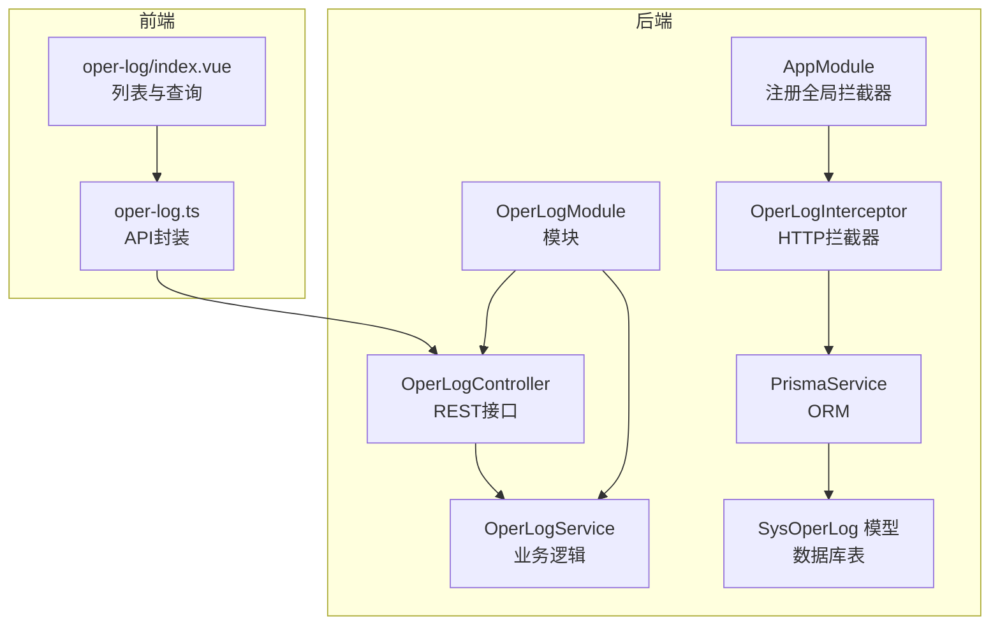
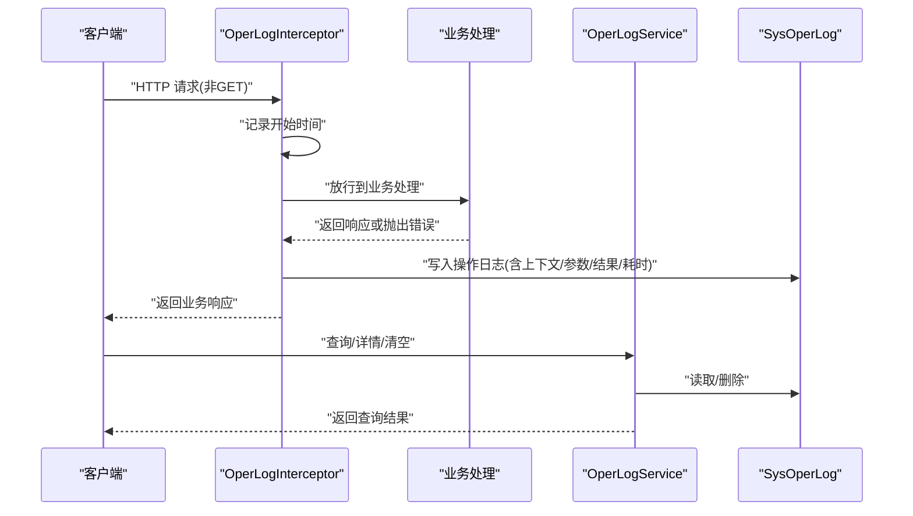
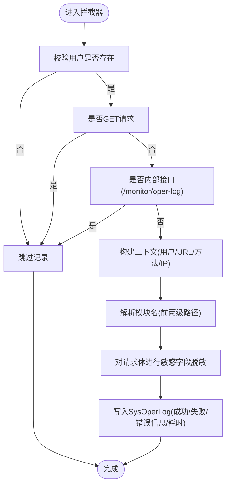
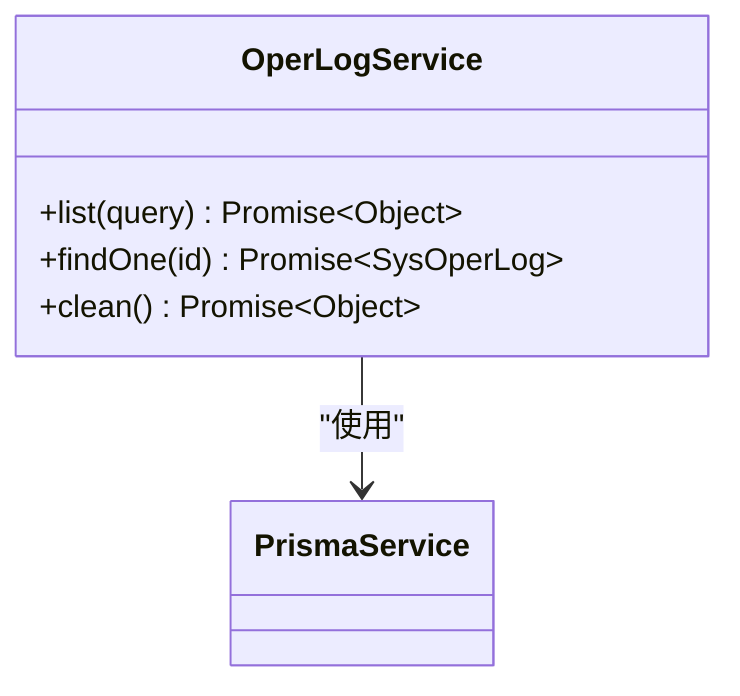
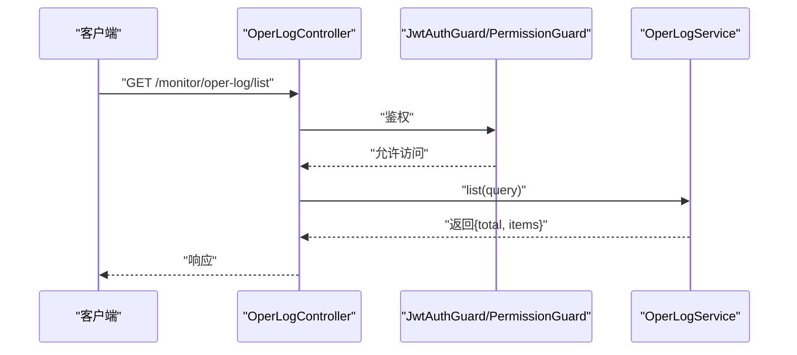
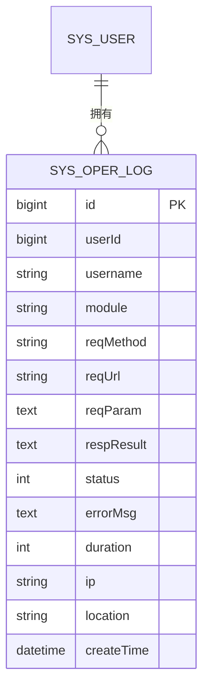
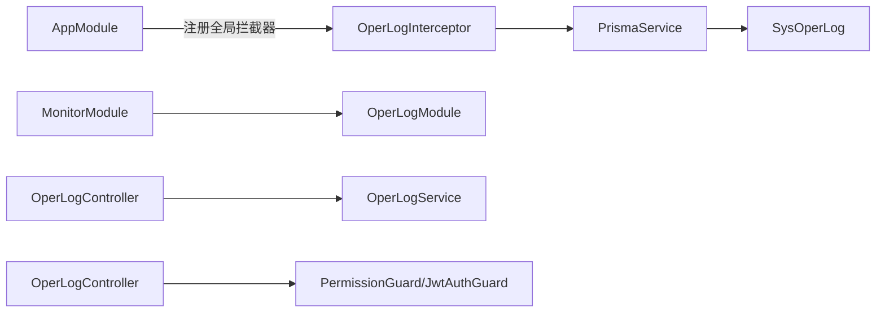

# 操作日志管理

<cite>
**本文引用的文件**
- [apps/backend/src/common/oper-log.interceptor.ts](file://apps/backend/src/common/oper-log.interceptor.ts)
- [apps/backend/src/modules/monitor/oper-log/oper-log.controller.ts](file://apps/backend/src/modules/monitor/oper-log/oper-log.controller.ts)
- [apps/backend/src/modules/monitor/oper-log/oper-log.service.ts](file://apps/backend/src/modules/monitor/oper-log/oper-log.service.ts)
- [apps/backend/src/modules/monitor/oper-log/oper-log.module.ts](file://apps/backend/src/modules/monitor/oper-log/oper-log.module.ts)
- [apps/backend/src/modules/monitor/monitor.module.ts](file://apps/backend/src/modules/monitor/monitor.module.ts)
- [apps/backend/src/app.module.ts](file://apps/backend/src/app.module.ts)
- [apps/backend/prisma/schema.prisma](file://apps/backend/prisma/schema.prisma)
- [apps/backend/src/auth/guards.ts](file://apps/backend/src/auth/guards.ts)
- [apps/vben-admin/apps/web-antd/src/api/monitor/oper-log.ts](file://apps/vben-admin/apps/web-antd/src/api/monitor/oper-log.ts)
- [apps/vben-admin/apps/web-antd/src/views/monitor/oper-log/index.vue](file://apps/vben-admin/apps/web-antd/src/views/monitor/oper-log/index.vue)
</cite>

## 目录
1. [引言](#引言)
2. [项目结构](#项目结构)
3. [核心组件](#核心组件)
4. [架构总览](#架构总览)
5. [详细组件分析](#详细组件分析)
6. [依赖关系分析](#依赖关系分析)
7. [性能考量](#性能考量)
8. [故障排查指南](#故障排查指南)
9. [结论](#结论)
10. [附录](#附录)

## 引言
本文件系统化阐述操作日志管理功能的设计与实现，覆盖拦截器记录机制、日志分类策略、事件捕获流程、上下文信息、敏感数据脱敏、审计与合规、异常检测、API 设计规范、查询接口与前端展示、以及性能影响评估。目标是帮助开发者与运维人员全面理解并高效使用该能力。

## 项目结构
操作日志功能由后端拦截器、服务层、控制器、数据库模型与前端查询界面组成，并通过全局拦截器在应用启动时自动启用。

**图表来源**
- [apps/backend/src/app.module.ts:18-58](file://apps/backend/src/app.module.ts#L18-L58)
- [apps/backend/src/common/oper-log.interceptor.ts:11-28](file://apps/backend/src/common/oper-log.interceptor.ts#L11-L28)
- [apps/backend/src/modules/monitor/oper-log/oper-log.module.ts:1-10](file://apps/backend/src/modules/monitor/oper-log/oper-log.module.ts#L1-L10)
- [apps/backend/src/modules/monitor/oper-log/oper-log.controller.ts:1-35](file://apps/backend/src/modules/monitor/oper-log/oper-log.controller.ts#L1-L35)
- [apps/backend/src/modules/monitor/oper-log/oper-log.service.ts:1-33](file://apps/backend/src/modules/monitor/oper-log/oper-log.service.ts#L1-L33)
- [apps/backend/prisma/schema.prisma:231-254](file://apps/backend/prisma/schema.prisma#L231-L254)
- [apps/vben-admin/apps/web-antd/src/api/monitor/oper-log.ts:1-40](file://apps/vben-admin/apps/web-antd/src/api/monitor/oper-log.ts#L1-L40)
- [apps/vben-admin/apps/web-antd/src/views/monitor/oper-log/index.vue:1-161](file://apps/vben-admin/apps/web-antd/src/views/monitor/oper-log/index.vue#L1-L161)

**章节来源**
- [apps/backend/src/app.module.ts:18-58](file://apps/backend/src/app.module.ts#L18-L58)
- [apps/backend/src/modules/monitor/monitor.module.ts:1-11](file://apps/backend/src/modules/monitor/monitor.module.ts#L1-L11)

## 核心组件
- 拦截器：统一捕获非 GET 的业务请求，记录请求上下文、参数、响应结果或错误、耗时与 IP，并写入数据库。
- 服务层：提供分页查询、详情查询、清空日志等能力。
- 控制器：暴露查询、详情、清空等接口，配合权限守卫保证访问控制。
- 数据模型：SysOperLog 表存储操作日志，包含用户、模块、方法、URL、参数、结果、状态、错误、耗时、IP 等字段。
- 前端：提供查询条件（模块名、IP、状态、时间范围）与分页展示，支持清空日志。

**章节来源**
- [apps/backend/src/common/oper-log.interceptor.ts:11-111](file://apps/backend/src/common/oper-log.interceptor.ts#L11-L111)
- [apps/backend/src/modules/monitor/oper-log/oper-log.service.ts:1-33](file://apps/backend/src/modules/monitor/oper-log/oper-log.service.ts#L1-L33)
- [apps/backend/src/modules/monitor/oper-log/oper-log.controller.ts:1-35](file://apps/backend/src/modules/monitor/oper-log/oper-log.controller.ts#L1-L35)
- [apps/backend/prisma/schema.prisma:231-254](file://apps/backend/prisma/schema.prisma#L231-L254)
- [apps/vben-admin/apps/web-antd/src/views/monitor/oper-log/index.vue:1-161](file://apps/vben-admin/apps/web-antd/src/views/monitor/oper-log/index.vue#L1-L161)

## 架构总览
拦截器在请求进入后记录开始时间；请求完成后根据是否发生错误分别写入成功或失败日志；服务层负责查询与清理；前端通过 API 获取列表并进行筛选与分页。

**图表来源**
- [apps/backend/src/common/oper-log.interceptor.ts:15-28](file://apps/backend/src/common/oper-log.interceptor.ts#L15-L28)
- [apps/backend/src/modules/monitor/oper-log/oper-log.service.ts:8-33](file://apps/backend/src/modules/monitor/oper-log/oper-log.service.ts#L8-L33)
- [apps/backend/prisma/schema.prisma:231-254](file://apps/backend/prisma/schema.prisma#L231-L254)

## 详细组件分析

### 拦截器：OperLogInterceptor
- 记录机制
  - 在拦截器中记录请求开始时间，请求完成后计算耗时。
  - 成功路径调用写日志函数，失败路径通过错误处理管道写入错误日志。
- 上下文信息
  - 用户信息：用户ID、用户名。
  - 请求信息：HTTP 方法、URL、参数、查询、请求体（已脱敏）。
  - 结果与状态：响应结果文本、状态码（成功/失败）、错误信息。
  - 性能指标：耗时毫秒数。
  - 网络信息：客户端IP。
- 过滤策略
  - 忽略未登录用户、GET 请求、特定内部接口（如“/monitor/oper-log”）。
- 日志分类
  - 模块名从URL解析，保留前两级路径作为模块标识。
- 敏感数据脱敏
  - 对请求体按键名包含“password”、“token”、“authorization”、“captcha”等关键词的字段进行掩码处理。
- 写入策略
  - 使用 ORM 异步写入，捕获异常以确保不影响主业务链路。

**图表来源**
- [apps/backend/src/common/oper-log.interceptor.ts:30-79](file://apps/backend/src/common/oper-log.interceptor.ts#L30-L79)

**章节来源**
- [apps/backend/src/common/oper-log.interceptor.ts:11-111](file://apps/backend/src/common/oper-log.interceptor.ts#L11-L111)

### 服务层：OperLogService
- 列表查询：支持分页、按用户名/模块名模糊过滤，按创建时间倒序。
- 单条查询：按ID查询。
- 清空日志：删除所有记录。

**图表来源**
- [apps/backend/src/modules/monitor/oper-log/oper-log.service.ts:1-33](file://apps/backend/src/modules/monitor/oper-log/oper-log.service.ts#L1-L33)

**章节来源**
- [apps/backend/src/modules/monitor/oper-log/oper-log.service.ts:1-33](file://apps/backend/src/modules/monitor/oper-log/oper-log.service.ts#L1-L33)

### 控制器：OperLogController
- 接口
  - GET /monitor/oper-log/list：分页查询。
  - GET /monitor/oper-log/:id：按ID查询。
  - DELETE /monitor/oper-log/clean：清空日志。
- 权限控制
  - 使用 JWT 与权限守卫，要求具备“monitor:oper:list”权限。

**图表来源**
- [apps/backend/src/modules/monitor/oper-log/oper-log.controller.ts:1-35](file://apps/backend/src/modules/monitor/oper-log/oper-log.controller.ts#L1-L35)
- [apps/backend/src/auth/guards.ts:1-51](file://apps/backend/src/auth/guards.ts#L1-L51)

**章节来源**
- [apps/backend/src/modules/monitor/oper-log/oper-log.controller.ts:1-35](file://apps/backend/src/modules/monitor/oper-log/oper-log.controller.ts#L1-L35)
- [apps/backend/src/auth/guards.ts:1-51](file://apps/backend/src/auth/guards.ts#L1-L51)

### 数据模型：SysOperLog
- 字段概览（关键字段）
  - 用户：userId、username
  - 请求：reqMethod、reqUrl、reqParam
  - 响应/错误：respResult、status、errorMsg
  - 性能：duration
  - 网络：ip、location
  - 时间：createTime
- 索引
  - userId、module、createTime 等字段建立索引，提升查询效率。

**图表来源**
- [apps/backend/prisma/schema.prisma:231-254](file://apps/backend/prisma/schema.prisma#L231-L254)

**章节来源**
- [apps/backend/prisma/schema.prisma:231-254](file://apps/backend/prisma/schema.prisma#L231-L254)

### 前端：操作日志页面
- 查询条件
  - 模块名（title）、IP（operIp）、状态（status）、时间范围（startTime/endTime）。
- 分页与表格
  - 支持分页切换、状态标签渲染、加载状态。
- 操作
  - 查询、重置、清空日志（调用后端清空接口）。

**章节来源**
- [apps/vben-admin/apps/web-antd/src/views/monitor/oper-log/index.vue:1-161](file://apps/vben-admin/apps/web-antd/src/views/monitor/oper-log/index.vue#L1-L161)
- [apps/vben-admin/apps/web-antd/src/api/monitor/oper-log.ts:1-40](file://apps/vben-admin/apps/web-antd/src/api/monitor/oper-log.ts#L1-L40)

## 依赖关系分析
- 全局拦截器注册
  - AppModule 将 OperLogInterceptor 注册为全局拦截器，确保所有请求均被记录（除被拦截器显式忽略的场景）。
- 模块组织
  - MonitorModule 导入 OperLogModule，形成监控子系统的统一入口。
- 权限控制
  - 控制器使用 RequirePermission 装饰器限定“monitor:oper:list”，结合 PermissionGuard 实现细粒度授权。

**图表来源**
- [apps/backend/src/app.module.ts:39-55](file://apps/backend/src/app.module.ts#L39-L55)
- [apps/backend/src/modules/monitor/monitor.module.ts:1-11](file://apps/backend/src/modules/monitor/monitor.module.ts#L1-L11)
- [apps/backend/src/modules/monitor/oper-log/oper-log.controller.ts:1-10](file://apps/backend/src/modules/monitor/oper-log/oper-log.controller.ts#L1-L10)
- [apps/backend/src/auth/guards.ts:1-51](file://apps/backend/src/auth/guards.ts#L1-L51)

**章节来源**
- [apps/backend/src/app.module.ts:18-58](file://apps/backend/src/app.module.ts#L18-L58)
- [apps/backend/src/modules/monitor/monitor.module.ts:1-11](file://apps/backend/src/modules/monitor/monitor.module.ts#L1-L11)
- [apps/backend/src/auth/guards.ts:1-51](file://apps/backend/src/auth/guards.ts#L1-L51)

## 性能考量
- 拦截器开销
  - 每次请求新增一次数据库写入，建议在高并发场景下评估数据库写入压力。
- 参数大小限制
  - 请求体与响应体序列化后超过阈值会被截断，避免超长文本占用过多存储与网络带宽。
- 脱敏成本
  - 递归遍历对象进行键名匹配与替换，对大对象有额外 CPU 开销。
- 并发与异步
  - 写入采用异步且捕获异常，避免阻塞主业务链路。
- 建议
  - 合理设置数据库连接池与写入队列；
  - 对高频接口可考虑采样记录；
  - 定期归档历史日志，控制表规模。

**章节来源**
- [apps/backend/src/common/oper-log.interceptor.ts:101-109](file://apps/backend/src/common/oper-log.interceptor.ts#L101-L109)

## 故障排查指南
- 无日志记录
  - 检查是否为 GET 请求或内部接口，确认拦截器过滤规则；
  - 确认用户是否登录，未登录用户会被忽略。
- 写入失败
  - 拦截器内捕获写入异常，不会影响业务响应；可在数据库侧查看连接与权限。
- 权限不足
  - 控制器需要“monitor:oper:list”权限，确认用户权限是否正确下发。
- 查询为空
  - 检查查询条件（模块名、IP、状态、时间范围）是否过于严格；
  - 确认分页参数与排序是否符合预期。

**章节来源**
- [apps/backend/src/common/oper-log.interceptor.ts:63-70](file://apps/backend/src/common/oper-log.interceptor.ts#L63-L70)
- [apps/backend/src/modules/monitor/oper-log/oper-log.controller.ts:13-33](file://apps/backend/src/modules/monitor/oper-log/oper-log.controller.ts#L13-L33)
- [apps/backend/src/auth/guards.ts:36-50](file://apps/backend/src/auth/guards.ts#L36-L50)

## 结论
操作日志管理通过全局拦截器实现了对非 GET 请求的统一记录，覆盖了关键上下文信息与敏感数据脱敏，结合服务层的查询与清理能力，以及前端的可视化界面，形成了完整的审计闭环。在高并发场景下需关注数据库写入与参数序列化的性能影响，并通过权限控制与模块化组织保障安全性与可维护性。

## 附录

### API 设计规范与查询接口实现
- 接口清单
  - GET /monitor/oper-log/list：分页查询，支持按用户名/模块名过滤。
  - GET /monitor/oper-log/:id：按ID查询。
  - DELETE /monitor/oper-log/clean：清空日志。
- 前端封装
  - 提供 getOperLogList、getOperLogDetail、cleanOperLog 等方法，便于组件复用。

**章节来源**
- [apps/backend/src/modules/monitor/oper-log/oper-log.controller.ts:1-35](file://apps/backend/src/modules/monitor/oper-log/oper-log.controller.ts#L1-L35)
- [apps/vben-admin/apps/web-antd/src/api/monitor/oper-log.ts:1-40](file://apps/vben-admin/apps/web-antd/src/api/monitor/oper-log.ts#L1-L40)

### 数据分析与报表建议
- 可基于 SysOperLog 统计维度
  - 按模块统计操作次数与失败率；
  - 按用户统计操作频次与活跃时段；
  - 按IP统计异常访问与失败趋势；
  - 按耗时分布识别慢接口。
- 建议
  - 定期导出日志进行离线分析；
  - 对异常模式（如短时间内大量失败）触发告警。

[本节为概念性建议，无需源码引用]

### 安全审计与合规
- 敏感信息保护
  - 拦截器对密码、令牌、授权头、验证码等字段进行脱敏；
  - 序列化长度限制防止超长文本泄露。
- 访问控制
  - 使用权限守卫确保仅具备“monitor:oper:list”的用户可访问。
- 合规建议
  - 明确日志保留期限与销毁策略；
  - 对关键操作增加二次确认与审计标记。

**章节来源**
- [apps/backend/src/common/oper-log.interceptor.ts:81-109](file://apps/backend/src/common/oper-log.interceptor.ts#L81-L109)
- [apps/backend/src/auth/guards.ts:36-50](file://apps/backend/src/auth/guards.ts#L36-L50)