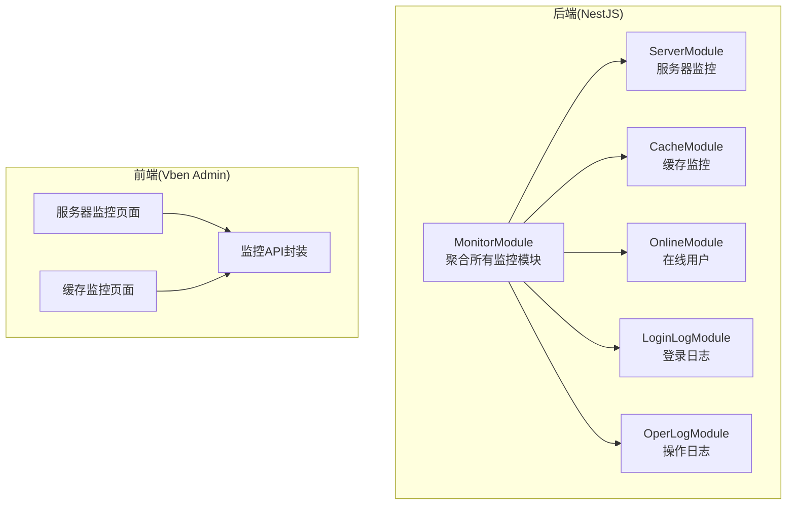
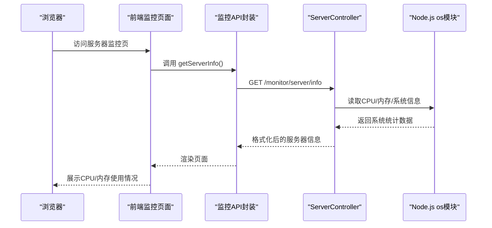
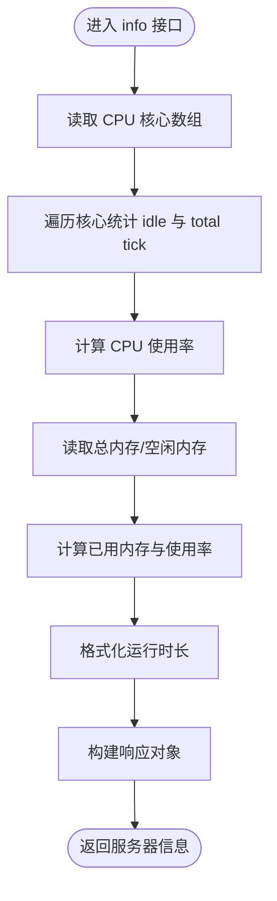
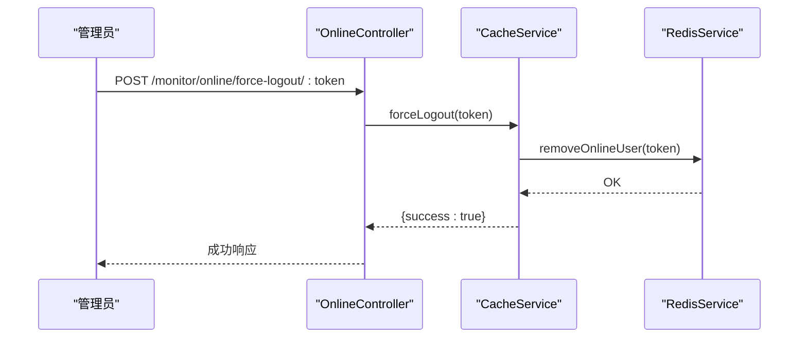
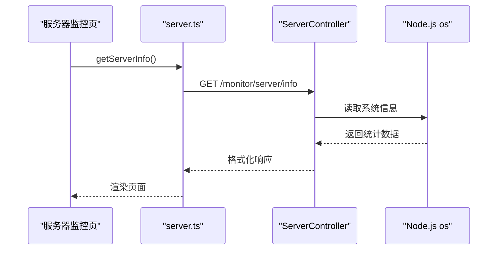
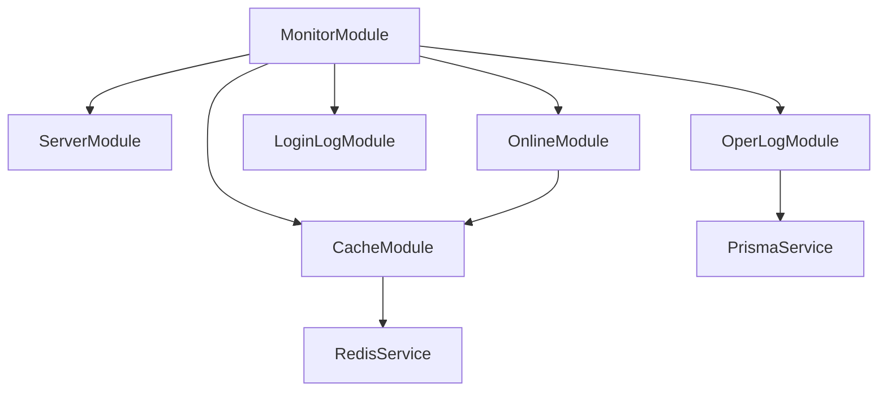

# 服务器性能监控

<cite>
**本文档引用的文件**
- [apps/backend/src/modules/monitor/monitor.module.ts](file://apps/backend/src/modules/monitor/monitor.module.ts)
- [apps/backend/src/modules/monitor/server/server.module.ts](file://apps/backend/src/modules/monitor/server/server.module.ts)
- [apps/backend/src/modules/monitor/server/server.controller.ts](file://apps/backend/src/modules/monitor/server/server.controller.ts)
- [apps/backend/src/modules/monitor/server/server.service.ts](file://apps/backend/src/modules/monitor/server/server.service.ts)
- [apps/backend/src/modules/monitor/cache/cache.controller.ts](file://apps/backend/src/modules/monitor/cache/cache.controller.ts)
- [apps/backend/src/modules/monitor/cache/cache.service.ts](file://apps/backend/src/modules/monitor/cache/cache.service.ts)
- [apps/backend/src/modules/monitor/online/online.controller.ts](file://apps/backend/src/modules/monitor/online/online.controller.ts)
- [apps/backend/src/modules/monitor/login-log/login-log.controller.ts](file://apps/backend/src/modules/monitor/login-log/login-log.controller.ts)
- [apps/backend/src/modules/monitor/oper-log/oper-log.controller.ts](file://apps/backend/src/modules/monitor/oper-log/oper-log.controller.ts)
- [apps/backend/src/modules/monitor/oper-log/oper-log.service.ts](file://apps/backend/src/modules/monitor/oper-log/oper-log.service.ts)
- [apps/backend/src/cache/redis.service.ts](file://apps/backend/src/cache/redis.service.ts)
- [apps/backend/src/cache/redis.module.ts](file://apps/backend/src/cache/redis.module.ts)
- [apps/vben-admin/apps/web-antd/src/views/monitor/server/index.vue](file://apps/vben-admin/apps/web-antd/src/views/monitor/server/index.vue)
- [apps/vben-admin/apps/web-antd/src/api/monitor/server.ts](file://apps/vben-admin/apps/web-antd/src/api/monitor/server.ts)
- [apps/vben-admin/apps/web-antd/src/api/monitor/cache.ts](file://apps/vben-admin/apps/web-antd/src/api/monitor/cache.ts)
- [apps/backend/src/common/oper-log.interceptor.ts](file://apps/backend/src/common/oper-log.interceptor.ts)
</cite>

## 目录
1. [简介](#简介)
2. [项目结构](#项目结构)
3. [核心组件](#核心组件)
4. [架构概览](#架构概览)
5. [详细组件分析](#详细组件分析)
6. [依赖关系分析](#依赖关系分析)
7. [性能考虑](#性能考虑)
8. [故障排查指南](#故障排查指南)
9. [结论](#结论)
10. [附录](#附录)

## 简介
本项目提供了基础的服务器性能监控能力，覆盖系统资源监控（CPU、内存）、缓存监控（Redis）以及用户在线状态管理。当前实现聚焦于以下方面：
- 实时系统信息采集：CPU 使用率、内存使用情况、系统运行时长等
- 缓存状态监控：Redis 连接、键空间命中率、内存使用等
- 在线用户管理：基于 Redis 的在线用户会话管理
- 操作日志记录：通过拦截器自动记录业务请求的详细信息

注意：当前仓库未包含磁盘 IO、网络流量等指标的采集实现；也未提供历史趋势分析、性能基线或告警机制。本文将基于现有代码进行深入分析，并给出扩展建议。

## 项目结构
监控相关功能主要分布在后端 NestJS 应用的 monitor 模块与前端 Vben Admin 的监控页面中。整体采用分层架构：
- 后端：NestJS 模块化设计，MonitorModule 聚合多个子模块（server、cache、online、login-log、oper-log）
- 前端：Vben Admin 提供监控页面与 API 调用封装



图表来源
- [apps/backend/src/modules/monitor/monitor.module.ts:1-11](file://apps/backend/src/modules/monitor/monitor.module.ts#L1-L11)
- [apps/backend/src/modules/monitor/server/server.module.ts:1-10](file://apps/backend/src/modules/monitor/server/server.module.ts#L1-L10)
- [apps/backend/src/modules/monitor/cache/cache.controller.ts:1-50](file://apps/backend/src/modules/monitor/cache/cache.controller.ts#L1-L50)
- [apps/vben-admin/apps/web-antd/src/views/monitor/server/index.vue:1-139](file://apps/vben-admin/apps/web-antd/src/views/monitor/server/index.vue#L1-L139)

章节来源
- [apps/backend/src/modules/monitor/monitor.module.ts:1-11](file://apps/backend/src/modules/monitor/monitor.module.ts#L1-L11)
- [apps/backend/src/modules/monitor/server/server.module.ts:1-10](file://apps/backend/src/modules/monitor/server/server.module.ts#L1-L10)

## 核心组件
- 服务器监控模块：提供系统资源信息采集与格式化输出
- 缓存监控模块：提供 Redis 连接信息、键空间查询与清理能力
- 在线用户模块：基于 Redis 维护在线用户会话
- 操作日志模块：通过拦截器自动记录业务请求日志

章节来源
- [apps/backend/src/modules/monitor/server/server.controller.ts:1-70](file://apps/backend/src/modules/monitor/server/server.controller.ts#L1-L70)
- [apps/backend/src/modules/monitor/cache/cache.controller.ts:1-50](file://apps/backend/src/modules/monitor/cache/cache.controller.ts#L1-L50)
- [apps/backend/src/modules/monitor/online/online.controller.ts:1-28](file://apps/backend/src/modules/monitor/online/online.controller.ts#L1-L28)
- [apps/backend/src/modules/monitor/oper-log/oper-log.controller.ts:1-35](file://apps/backend/src/modules/monitor/oper-log/oper-log.controller.ts#L1-L35)

## 架构概览
下图展示了监控模块的组件交互与数据流向：



图表来源
- [apps/vben-admin/apps/web-antd/src/views/monitor/server/index.vue:1-139](file://apps/vben-admin/apps/web-antd/src/views/monitor/server/index.vue#L1-L139)
- [apps/vben-admin/apps/web-antd/src/api/monitor/server.ts:1-33](file://apps/vben-admin/apps/web-antd/src/api/monitor/server.ts#L1-L33)
- [apps/backend/src/modules/monitor/server/server.controller.ts:1-70](file://apps/backend/src/modules/monitor/server/server.controller.ts#L1-L70)

## 详细组件分析

### 服务器监控组件
- 功能概述
  - 采集 CPU 使用率：通过遍历各核心的 idle/tick 统计计算使用率
  - 采集内存使用：总内存、已用、空闲及使用百分比
  - 采集系统信息：平台、架构、主机名、运行时长
  - 数据格式化：字节单位换算、运行时长人性化显示

- 关键实现点
  - CPU 使用率计算：累加所有核心的 idle 与 total tick，按公式计算使用率
  - 内存格式化：根据字节数自动转换为 B/KB/MB/GB
  - 运行时长格式化：将秒数转换为 d h m 的可读格式



图表来源
- [apps/backend/src/modules/monitor/server/server.controller.ts:14-41](file://apps/backend/src/modules/monitor/server/server.controller.ts#L14-L41)
- [apps/backend/src/modules/monitor/server/server.controller.ts:43-54](file://apps/backend/src/modules/monitor/server/server.controller.ts#L43-L54)
- [apps/backend/src/modules/monitor/server/server.controller.ts:56-68](file://apps/backend/src/modules/monitor/server/server.controller.ts#L56-L68)

章节来源
- [apps/backend/src/modules/monitor/server/server.controller.ts:1-70](file://apps/backend/src/modules/monitor/server/server.controller.ts#L1-L70)
- [apps/backend/src/modules/monitor/server/server.service.ts:1-4](file://apps/backend/src/modules/monitor/server/server.service.ts#L1-L4)

### 缓存监控组件
- 功能概述
  - 获取 Redis 信息：解析 Redis INFO 输出为键值对
  - 键空间查询：支持通配符模式匹配键
  - 键值获取与删除：按 key 获取/删除缓存项
  - 缓存清理：清空数据库

- 关键实现点
  - Redis 连接配置：从环境变量读取 host/port/password/db
  - INFO 解析：按行解析 Redis INFO 输出，过滤注释行
  - 在线用户管理：维护在线用户集合与会话映射

```mermaid
classDiagram
class CacheController {
+info() any
+keys(pattern) string[]
+value(key) any
+clear() {success : true}
+delete(key) {success : true}
}
class CacheService {
-redis RedisService
+info() any
+keys(pattern) string[]
+get(key) any
+clear() void
+delete(key) void
}
class RedisService {
-client Redis
+get(key) any
+set(key, value, ttl) void
+del(key) void
+exists(key) boolean
+ttl(key) number
+keys(pattern) string[]
+flushdb() void
+info(section) any
+setOnlineUser(token, userId, ttl) void
+removeOnlineUser(token) void
+getOnlineUser(token) string
+getOnlineUsers() string[]
+hset(key, field, value) void
+hget(key, field) any
+hgetall(key) any
}
CacheController --> CacheService : "依赖"
CacheService --> RedisService : "使用"
```

图表来源
- [apps/backend/src/modules/monitor/cache/cache.controller.ts:1-50](file://apps/backend/src/modules/monitor/cache/cache.controller.ts#L1-L50)
- [apps/backend/src/modules/monitor/cache/cache.service.ts:1-29](file://apps/backend/src/modules/monitor/cache/cache.service.ts#L1-L29)
- [apps/backend/src/cache/redis.service.ts:1-128](file://apps/backend/src/cache/redis.service.ts#L1-L128)

章节来源
- [apps/backend/src/modules/monitor/cache/cache.controller.ts:1-50](file://apps/backend/src/modules/monitor/cache/cache.controller.ts#L1-L50)
- [apps/backend/src/modules/monitor/cache/cache.service.ts:1-29](file://apps/backend/src/modules/monitor/cache/cache.service.ts#L1-L29)
- [apps/backend/src/cache/redis.service.ts:1-128](file://apps/backend/src/cache/redis.service.ts#L1-L128)

### 在线用户与操作日志组件
- 在线用户模块
  - 提供在线用户列表查询与强制下线接口
  - 基于 Redis 集合维护在线用户 token 列表

- 操作日志模块
  - 通过拦截器自动记录请求方法、URL、参数、响应结果、耗时、IP 等
  - 支持分页查询、按用户名/模块筛选、清理全部日志



图表来源
- [apps/backend/src/modules/monitor/online/online.controller.ts:1-28](file://apps/backend/src/modules/monitor/online/online.controller.ts#L1-L28)
- [apps/backend/src/modules/monitor/cache/cache.service.ts:83-99](file://apps/backend/src/modules/monitor/cache/cache.service.ts#L83-L99)
- [apps/backend/src/cache/redis.service.ts:83-99](file://apps/backend/src/cache/redis.service.ts#L83-L99)

章节来源
- [apps/backend/src/modules/monitor/online/online.controller.ts:1-28](file://apps/backend/src/modules/monitor/online/online.controller.ts#L1-L28)
- [apps/backend/src/modules/monitor/login-log/login-log.controller.ts:1-45](file://apps/backend/src/modules/monitor/login-log/login-log.controller.ts#L1-L45)
- [apps/backend/src/modules/monitor/oper-log/oper-log.controller.ts:1-35](file://apps/backend/src/modules/monitor/oper-log/oper-log.controller.ts#L1-L35)
- [apps/backend/src/modules/monitor/oper-log/oper-log.service.ts:1-33](file://apps/backend/src/modules/monitor/oper-log/oper-log.service.ts#L1-L33)
- [apps/backend/src/common/oper-log.interceptor.ts:33-79](file://apps/backend/src/common/oper-log.interceptor.ts#L33-L79)

### 前端监控页面与API封装
- 服务器监控页面
  - 加载服务器信息并展示 CPU、内存、磁盘使用情况
  - 基于阈值动态调整进度条颜色（低/警告/异常）

- API 封装
  - 定义 ServerInfo 接口类型
  - 提供 getServerInfo 方法调用后端 /monitor/server/info



图表来源
- [apps/vben-admin/apps/web-antd/src/views/monitor/server/index.vue:1-139](file://apps/vben-admin/apps/web-antd/src/views/monitor/server/index.vue#L1-L139)
- [apps/vben-admin/apps/web-antd/src/api/monitor/server.ts:1-33](file://apps/vben-admin/apps/web-antd/src/api/monitor/server.ts#L1-L33)
- [apps/backend/src/modules/monitor/server/server.controller.ts:14-41](file://apps/backend/src/modules/monitor/server/server.controller.ts#L14-L41)

章节来源
- [apps/vben-admin/apps/web-antd/src/views/monitor/server/index.vue:1-139](file://apps/vben-admin/apps/web-antd/src/views/monitor/server/index.vue#L1-L139)
- [apps/vben-admin/apps/web-antd/src/api/monitor/server.ts:1-33](file://apps/vben-admin/apps/web-antd/src/api/monitor/server.ts#L1-L33)

## 依赖关系分析
- 模块耦合
  - MonitorModule 聚合多个子模块，保持高内聚、低耦合
  - ServerModule 仅依赖 Node.js os 模块，无外部服务依赖
  - CacheModule 依赖 RedisService，提供统一的 Redis 访问入口
  - OnlineModule 通过 CacheService 间接依赖 RedisService
  - OperLogModule 依赖 PrismaService 进行数据库操作

- 外部依赖
  - Redis：用于缓存与在线用户管理
  - Prisma：用于操作日志持久化存储



图表来源
- [apps/backend/src/modules/monitor/monitor.module.ts:1-11](file://apps/backend/src/modules/monitor/monitor.module.ts#L1-L11)
- [apps/backend/src/cache/redis.module.ts:1-9](file://apps/backend/src/cache/redis.module.ts#L1-L9)
- [apps/backend/src/modules/monitor/cache/cache.service.ts:1-29](file://apps/backend/src/modules/monitor/cache/cache.service.ts#L1-L29)

章节来源
- [apps/backend/src/modules/monitor/monitor.module.ts:1-11](file://apps/backend/src/modules/monitor/monitor.module.ts#L1-L11)
- [apps/backend/src/cache/redis.module.ts:1-9](file://apps/backend/src/cache/redis.module.ts#L1-L9)

## 性能考虑
- 当前实现特点
  - 服务器监控接口直接读取 Node.js os 模块数据，开销极小
  - 缓存监控通过 Redis INFO 获取状态，解析简单，性能良好
  - 在线用户管理基于 Redis 集合操作，复杂度低
  - 操作日志拦截器在请求完成后异步记录，避免阻塞主流程

- 可扩展方向
  - 引入定时任务定期采集更细粒度指标（如每分钟 CPU/内存曲线），并存储到数据库或时序数据库
  - 建立性能基线与阈值规则，结合告警系统实现异常通知
  - 对磁盘 IO、网络流量等指标进行补充采集（需引入系统级工具或第三方库）
  - 前端增加历史趋势图表与容量规划视图

## 故障排查指南
- 服务器监控接口异常
  - 检查后端是否正确注入 ServerService 并实现 info 方法
  - 确认前端 API 调用路径与权限配置一致

- 缓存监控异常
  - 检查 Redis 连接参数（host/port/password/db）是否正确
  - 确认 Redis 服务可用且 INFO 命令可执行
  - 如出现连接错误，查看控制台日志定位问题

- 在线用户管理异常
  - 检查 Redis 中 online:* 相关键是否存在
  - 确认强制下线接口调用后，对应 token 是否从集合中移除

- 操作日志记录异常
  - 拦截器默认忽略 GET 请求与特定路径，确认请求方法与 URL 符合记录条件
  - 若日志未写入数据库，检查 Prisma 配置与数据库连接

章节来源
- [apps/backend/src/modules/monitor/server/server.controller.ts:1-70](file://apps/backend/src/modules/monitor/server/server.controller.ts#L1-L70)
- [apps/backend/src/cache/redis.service.ts:16-23](file://apps/backend/src/cache/redis.service.ts#L16-L23)
- [apps/backend/src/common/oper-log.interceptor.ts:63-70](file://apps/backend/src/common/oper-log.interceptor.ts#L63-L70)

## 结论
本项目已具备基础的服务器与缓存监控能力，能够满足日常运维的基本需求。若需进一步完善监控体系，建议：
- 补充磁盘 IO、网络流量等指标采集
- 建立历史趋势分析与性能基线
- 实施阈值告警与故障预警机制
- 增强可视化展示与容量规划功能

## 附录
- API 定义（节选）
  - 服务器监控：GET /monitor/server/info
  - 缓存监控：GET /monitor/cache/info，GET /monitor/cache/keys，GET /monitor/cache/value?key=xxx，POST /monitor/cache/clear，POST /monitor/cache/delete?key=xxx
  - 在线用户：GET /monitor/online/list，POST /monitor/online/force-logout/:token
  - 登录日志：GET /monitor/login-log/list，GET /monitor/login-log/:id，DELETE /monitor/login-log/clean
  - 操作日志：GET /monitor/oper-log/list，GET /monitor/oper-log/:id，DELETE /monitor/oper-log/clean

章节来源
- [apps/backend/src/modules/monitor/server/server.controller.ts:14-41](file://apps/backend/src/modules/monitor/server/server.controller.ts#L14-L41)
- [apps/backend/src/modules/monitor/cache/cache.controller.ts:13-48](file://apps/backend/src/modules/monitor/cache/cache.controller.ts#L13-L48)
- [apps/backend/src/modules/monitor/online/online.controller.ts:13-26](file://apps/backend/src/modules/monitor/online/online.controller.ts#L13-L26)
- [apps/backend/src/modules/monitor/login-log/login-log.controller.ts:13-43](file://apps/backend/src/modules/monitor/login-log/login-log.controller.ts#L13-L43)
- [apps/backend/src/modules/monitor/oper-log/oper-log.controller.ts:13-33](file://apps/backend/src/modules/monitor/oper-log/oper-log.controller.ts#L13-L33)