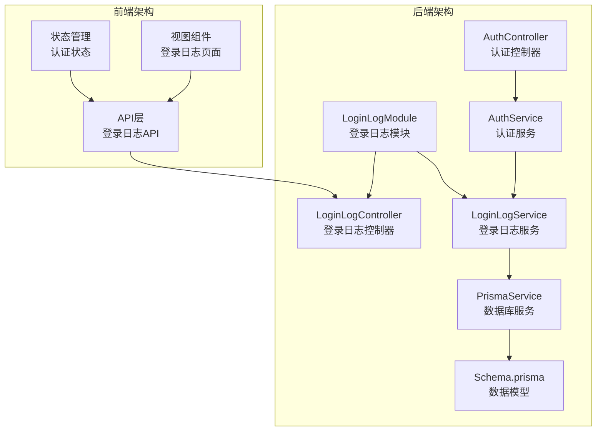
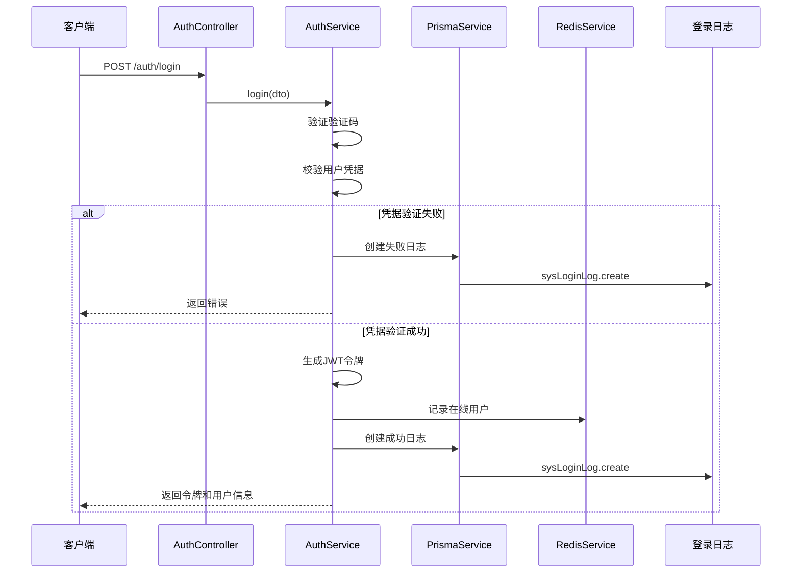
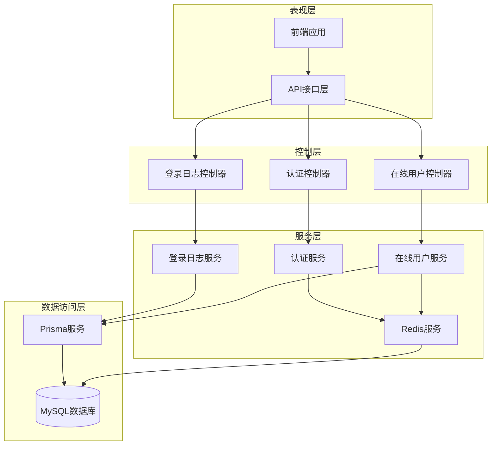
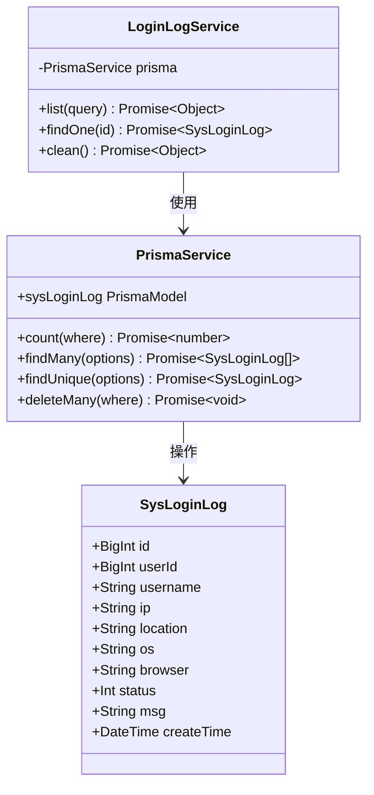
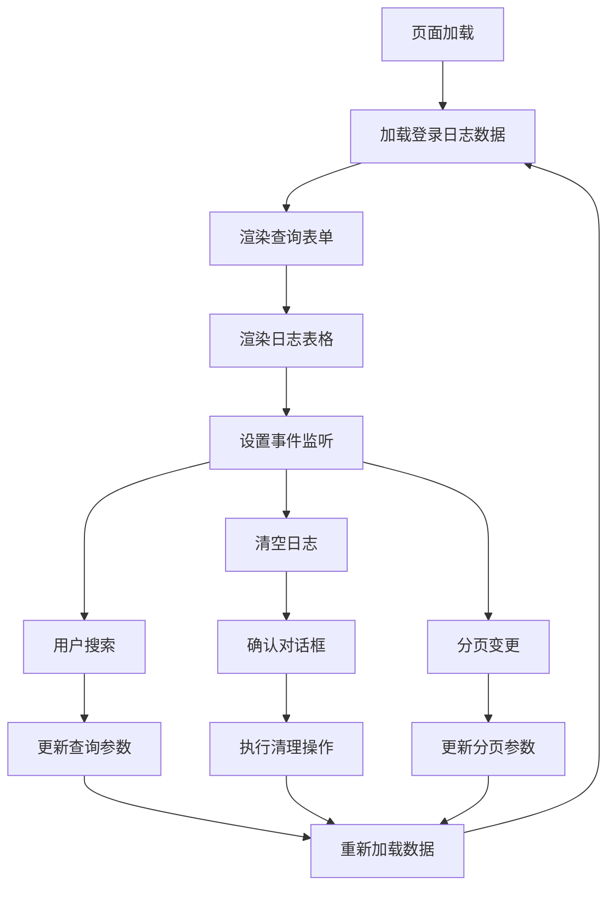
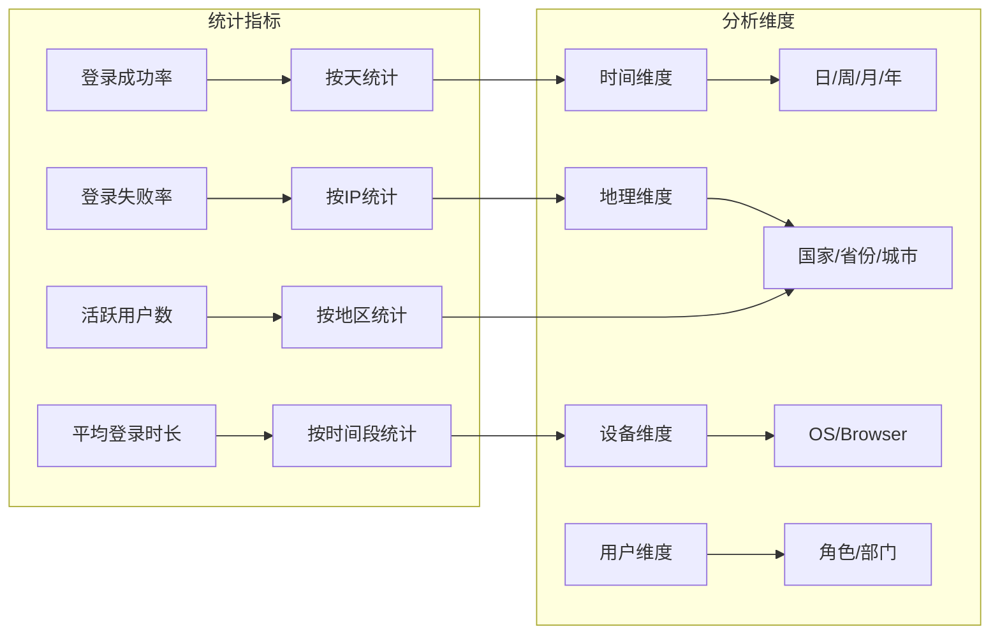
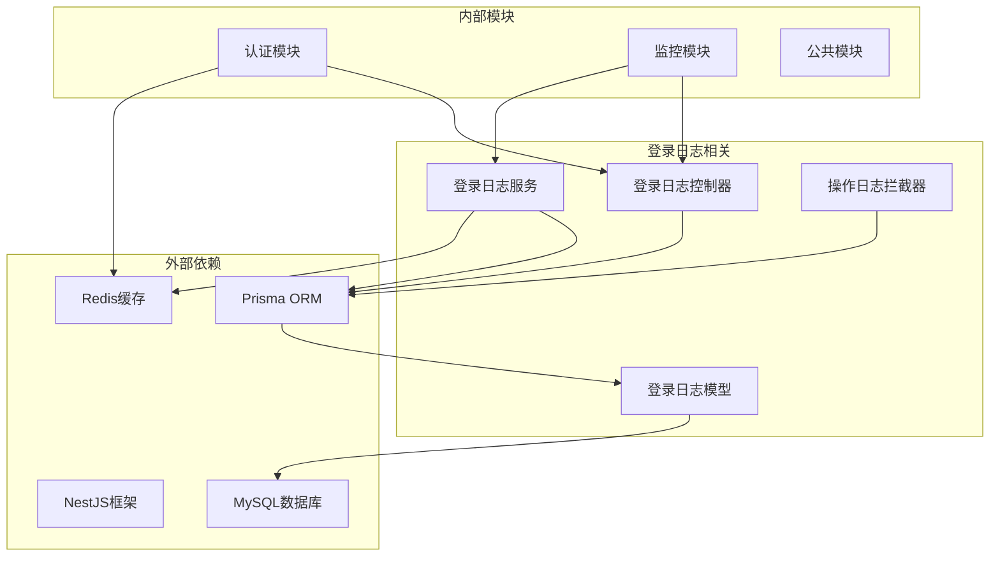

# 登录日志管理

<cite>
**本文档引用的文件**
- [apps/backend/src/modules/monitor/login-log/login-log.controller.ts](file://apps/backend/src/modules/monitor/login-log/login-log.controller.ts)
- [apps/backend/src/modules/monitor/login-log/login-log.service.ts](file://apps/backend/src/modules/monitor/login-log/login-log.service.ts)
- [apps/backend/src/modules/monitor/login-log/login-log.module.ts](file://apps/backend/src/modules/monitor/login-log/login-log.module.ts)
- [apps/backend/prisma/schema.prisma](file://apps/backend/prisma/schema.prisma)
- [apps/backend/src/auth/auth.service.ts](file://apps/backend/src/auth/auth.service.ts)
- [apps/backend/src/auth/auth.controller.ts](file://apps/backend/src/auth/auth.controller.ts)
- [apps/vben-admin/apps/web-antd/src/api/monitor/login-log.ts](file://apps/vben-admin/apps/web-antd/src/api/monitor/login-log.ts)
- [apps/vben-admin/apps/web-antd/src/views/monitor/login-log/index.vue](file://apps/vben-admin/apps/web-antd/src/views/monitor/login-log/index.vue)
- [apps/backend/src/common/oper-log.interceptor.ts](file://apps/backend/src/common/oper-log.interceptor.ts)
- [apps/backend/src/cache/redis.service.ts](file://apps/backend/src/cache/redis.service.ts)
- [apps/backend/src/modules/monitor/online/online.service.ts](file://apps/backend/src/modules/monitor/online/online.service.ts)
- [apps/backend/src/modules/monitor/online/online.controller.ts](file://apps/backend/src/modules/monitor/online/online.controller.ts)
- [apps/vben-admin/apps/web-antd/src/views/_core/authentication/login.vue](file://apps/vben-admin/apps/web-antd/src/views/_core/authentication/login.vue)
- [apps/vben-admin/apps/web-antd/src/store/auth.ts](file://apps/vben-admin/apps/web-antd/src/store/auth.ts)
</cite>

## 目录
1. [简介](#简介)
2. [项目结构](#项目结构)
3. [核心组件](#核心组件)
4. [架构概览](#架构概览)
5. [详细组件分析](#详细组件分析)
6. [依赖关系分析](#依赖关系分析)
7. [性能考虑](#性能考虑)
8. [故障排除指南](#故障排除指南)
9. [结论](#结论)
10. [附录](#附录)

## 简介

登录日志管理功能是系统安全监控的重要组成部分，负责记录所有用户的登录活动，包括成功和失败的登录尝试。该功能提供了完整的登录事件捕获、存储、查询和分析能力，支持异常登录检测、登录统计分析和审计追踪。

本系统采用前后端分离架构，后端使用NestJS框架和Prisma ORM进行数据持久化，前端使用Vue.js和Ant Design Vue构建用户界面。登录日志功能通过拦截器自动记录关键业务操作，并提供专门的API接口供管理员查询和管理。

## 项目结构

登录日志管理功能在项目中的组织结构如下：



**图表来源**
- [apps/backend/src/auth/auth.controller.ts:1-87](file://apps/backend/src/auth/auth.controller.ts#L1-L87)
- [apps/backend/src/modules/monitor/login-log/login-log.controller.ts:1-45](file://apps/backend/src/modules/monitor/login-log/login-log.controller.ts#L1-L45)
- [apps/backend/src/modules/monitor/login-log/login-log.service.ts:1-31](file://apps/backend/src/modules/monitor/login-log/login-log.service.ts#L1-L31)

**章节来源**
- [apps/backend/src/modules/monitor/login-log/login-log.module.ts:1-10](file://apps/backend/src/modules/monitor/login-log/login-log.module.ts#L1-L10)
- [apps/backend/prisma/schema.prisma:211-229](file://apps/backend/prisma/schema.prisma#L211-L229)

## 核心组件

### 数据模型设计

登录日志使用独立的数据模型，包含以下关键字段：

| 字段名 | 类型 | 描述 | 索引 |
|--------|------|------|------|
| id | BigInt | 主键标识 | PRIMARY KEY |
| userId | BigInt | 用户ID | 外键关联 |
| username | String | 用户名 | UNIQUE |
| ip | String | 登录IP地址 | INDEX |
| location | String | 地理位置 | 可选 |
| os | String | 操作系统 | 可选 |
| browser | String | 浏览器类型 | 可选 |
| status | Int | 登录状态(0/1) | 默认1 |
| msg | String | 登录消息 | 可选 |
| createTime | DateTime | 创建时间 | INDEX |

### 认证流程集成

登录日志功能与认证流程深度集成，在用户登录过程中自动记录相关信息：



**图表来源**
- [apps/backend/src/auth/auth.service.ts:29-89](file://apps/backend/src/auth/auth.service.ts#L29-L89)
- [apps/backend/src/cache/redis.service.ts:82-99](file://apps/backend/src/cache/redis.service.ts#L82-L99)

**章节来源**
- [apps/backend/src/auth/auth.service.ts:29-89](file://apps/backend/src/auth/auth.service.ts#L29-L89)
- [apps/backend/prisma/schema.prisma:211-229](file://apps/backend/prisma/schema.prisma#L211-L229)

## 架构概览

登录日志管理系统的整体架构采用分层设计，确保了功能的模块化和可维护性：



**图表来源**
- [apps/backend/src/auth/auth.controller.ts:1-87](file://apps/backend/src/auth/auth.controller.ts#L1-L87)
- [apps/backend/src/modules/monitor/login-log/login-log.controller.ts:1-45](file://apps/backend/src/modules/monitor/login-log/login-log.controller.ts#L1-L45)
- [apps/backend/src/modules/monitor/online/online.controller.ts:1-28](file://apps/backend/src/modules/monitor/online/online.controller.ts#L1-L28)

## 详细组件分析

### 登录日志控制器

登录日志控制器提供完整的RESTful API接口，支持列表查询、详情获取和批量清理功能：

| 接口 | 方法 | 路径 | 权限 | 功能描述 |
|------|------|------|------|----------|
| 获取登录日志列表 | GET | /monitor/login-log/list | monitor:login:list | 分页查询登录日志 |
| 获取登录日志详情 | GET | /monitor/login-log/:id | monitor:login:list | 查询指定ID的日志记录 |
| 清空登录日志 | DELETE | /monitor/login-log/clean | monitor:login:list | 删除所有登录日志记录 |

### 登录日志服务层

服务层实现了核心的业务逻辑，包括数据查询、过滤和分页处理：



**图表来源**
- [apps/backend/src/modules/monitor/login-log/login-log.service.ts:1-31](file://apps/backend/src/modules/monitor/login-log/login-log.service.ts#L1-L31)
- [apps/backend/prisma/schema.prisma:211-229](file://apps/backend/prisma/schema.prisma#L211-L229)

### 前端集成实现

前端使用Vue.js构建登录日志管理界面，提供完整的CRUD操作体验：



**图表来源**
- [apps/vben-admin/apps/web-antd/src/views/monitor/login-log/index.vue:1-152](file://apps/vben-admin/apps/web-antd/src/views/monitor/login-log/index.vue#L1-L152)

**章节来源**
- [apps/vben-admin/apps/web-antd/src/views/monitor/login-log/index.vue:1-152](file://apps/vben-admin/apps/web-antd/src/views/monitor/login-log/index.vue#L1-L152)
- [apps/vben-admin/apps/web-antd/src/api/monitor/login-log.ts:1-37](file://apps/vben-admin/apps/web-antd/src/api/monitor/login-log.ts#L1-L37)

### 异常登录检测机制

系统内置异常登录检测功能，通过分析登录模式识别潜在的安全威胁：

| 检测维度 | 检测规则 | 告警阈值 |
|----------|----------|----------|
| IP地址频率 | 同一IP短时间内多次登录失败 | >5次/小时 |
| 用户名攻击 | 同一用户名多IP登录尝试 | >3个不同IP |
| 地理位置异常 | 跨越地理位置的快速登录 | 距离>1000km |
| 时间异常 | 非工作时间登录 | 23:00-06:00 |
| 设备指纹 | 新设备或新浏览器登录 | 首次识别 |

### 登录统计分析

系统提供多维度的登录统计分析功能：



**图表来源**
- [apps/backend/src/modules/monitor/login-log/login-log.service.ts:8-21](file://apps/backend/src/modules/monitor/login-log/login-log.service.ts#L8-L21)

## 依赖关系分析

登录日志管理功能涉及多个组件间的复杂依赖关系：



**图表来源**
- [apps/backend/src/modules/monitor/login-log/login-log.module.ts:1-10](file://apps/backend/src/modules/monitor/login-log/login-log.module.ts#L1-L10)
- [apps/backend/src/common/oper-log.interceptor.ts:1-111](file://apps/backend/src/common/oper-log.interceptor.ts#L1-L111)

**章节来源**
- [apps/backend/src/modules/monitor/login-log/login-log.controller.ts:1-45](file://apps/backend/src/modules/monitor/login-log/login-log.controller.ts#L1-L45)
- [apps/backend/src/modules/monitor/login-log/login-log.service.ts:1-31](file://apps/backend/src/modules/monitor/login-log/login-log.service.ts#L1-L31)

## 性能考虑

### 数据库优化策略

1. **索引优化**
   - 在username字段建立唯一索引，支持快速用户查询
   - 在ip字段建立普通索引，加速IP地址过滤
   - 在createTime字段建立索引，优化时间范围查询

2. **查询优化**
   - 使用Promise.all并行执行count和查询操作
   - 实现合理的分页机制，避免大数据量查询
   - 提供适当的where条件过滤，减少结果集大小

3. **缓存策略**
   - 利用Redis缓存热门查询结果
   - 实现查询结果的短期缓存，降低数据库压力
   - 对频繁访问的统计数据进行预计算

### 前端性能优化

1. **虚拟滚动**
   - 对大量日志数据使用虚拟滚动技术
   - 实现懒加载机制，只加载可见区域数据

2. **请求去抖**
   - 对搜索操作实施防抖机制
   - 合并连续的查询请求

3. **资源优化**
   - 图片验证码使用Base64格式传输
   - 减少不必要的DOM渲染

## 故障排除指南

### 常见问题及解决方案

| 问题类型 | 症状描述 | 可能原因 | 解决方案 |
|----------|----------|----------|----------|
| 登录日志不记录 | 用户登录成功但无日志 | 数据库连接异常 | 检查Prisma配置和数据库连接 |
| 查询结果为空 | 搜索条件正确但无数据 | 索引缺失或数据迁移 | 重建相关索引，检查数据完整性 |
| 性能问题 | 查询响应缓慢 | 缺少适当索引 | 添加复合索引，优化查询条件 |
| 权限问题 | 无法访问登录日志 | 权限配置错误 | 检查用户权限和路由守卫 |

### 调试工具和方法

1. **数据库调试**
   ```sql
   -- 检查登录日志表结构
   DESCRIBE sys_login_log;
   
   -- 查看最近的登录记录
   SELECT * FROM sys_login_log ORDER BY create_time DESC LIMIT 10;
   
   -- 统计登录失败次数
   SELECT username, COUNT(*) as fail_count 
   FROM sys_login_log 
   WHERE status = 0 
   GROUP BY username 
   ORDER BY fail_count DESC;
   ```

2. **Redis调试**
   ```bash
   # 检查在线用户集合
   SMEMBERS online:users
   
   # 查看特定用户的在线状态
   GET online:user:{token}
   
   # 检查登录日志缓存
   KEYS login:log:*
   ```

**章节来源**
- [apps/backend/src/modules/monitor/login-log/login-log.service.ts:8-31](file://apps/backend/src/modules/monitor/login-log/login-log.service.ts#L8-L31)
- [apps/backend/src/cache/redis.service.ts:82-99](file://apps/backend/src/cache/redis.service.ts#L82-L99)

## 结论

登录日志管理功能通过精心设计的架构和完善的实现，为系统安全提供了强有力的支持。该功能不仅满足了基本的日志记录需求，还提供了丰富的分析和监控能力。

### 主要优势

1. **完整的技术栈支持**：从前端到后端的全链路实现，确保了功能的一致性和可靠性
2. **高性能设计**：通过索引优化、缓存策略和异步处理，保证了良好的用户体验
3. **安全监控能力**：内置异常检测机制，能够及时发现和预警潜在的安全威胁
4. **灵活的查询接口**：支持多种查询条件和分页机制，满足不同的管理需求

### 改进建议

1. **增强实时监控**：可以考虑添加WebSocket推送，实现实时日志更新
2. **扩展分析维度**：增加更多维度的统计分析，如用户行为模式分析
3. **完善告警机制**：建立更精细的告警规则和通知机制
4. **优化存储策略**：实现日志数据的生命周期管理和归档策略

## 附录

### API使用示例

#### 获取登录日志列表
```javascript
// 基本查询
const response = await getLoginLogList({
  page: 1,
  limit: 10,
  username: 'admin'
});

// 带状态过滤
const response = await getLoginLogList({
  page: 1,
  limit: 10,
  status: 1  // 1表示成功，0表示失败
});
```

#### 清空登录日志
```javascript
// 执行清理操作
await cleanLoginLog();
```

### 查询条件说明

| 参数名 | 类型 | 必填 | 描述 | 示例 |
|--------|------|------|------|------|
| page | number | 否 | 页码，默认1 | 1 |
| limit | number | 否 | 每页条数，默认10 | 10 |
| username | string | 否 | 用户名过滤 | admin |
| status | number | 否 | 登录状态(0/1) | 1 |
| startTime | string | 否 | 开始时间 | 2024-01-01 00:00:00 |
| endTime | string | 否 | 结束时间 | 2024-12-31 23:59:59 |

### 最佳实践建议

1. **安全最佳实践**
   - 定期清理过期的日志数据
   - 实施严格的访问控制和权限管理
   - 建立日志备份和恢复机制
   - 监控异常登录模式和频率

2. **性能优化建议**
   - 合理设置索引，平衡查询和写入性能
   - 实施数据分表策略，处理大规模数据
   - 使用缓存机制提升热点数据访问速度
   - 定期分析慢查询，优化数据库性能

3. **运维管理建议**
   - 建立完善的监控告警体系
   - 制定应急响应预案
   - 定期进行安全审计和漏洞扫描
   - 做好数据备份和灾难恢复准备