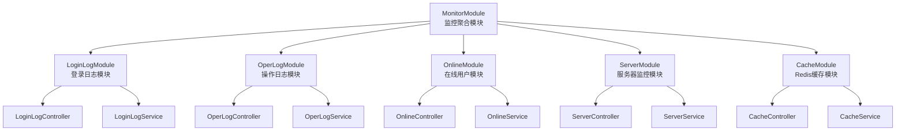
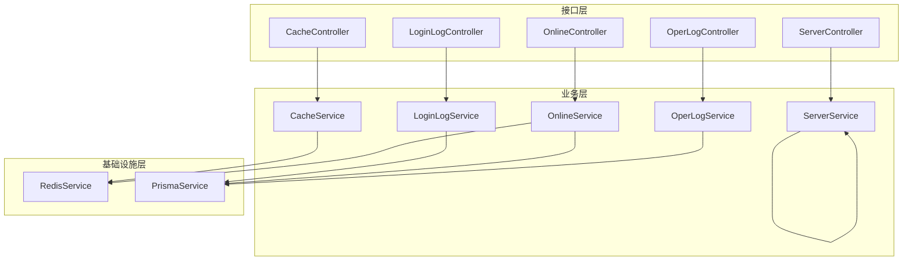
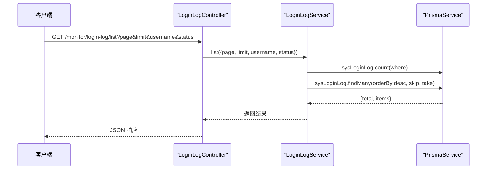
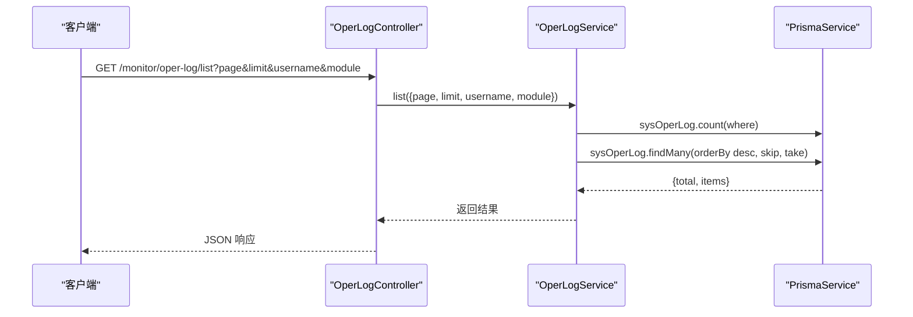
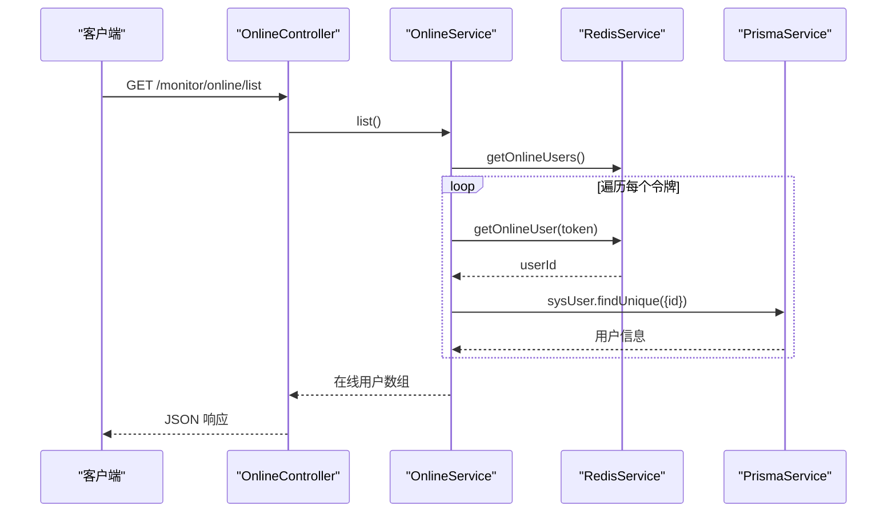
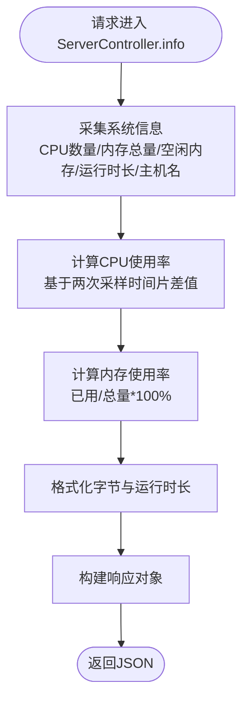
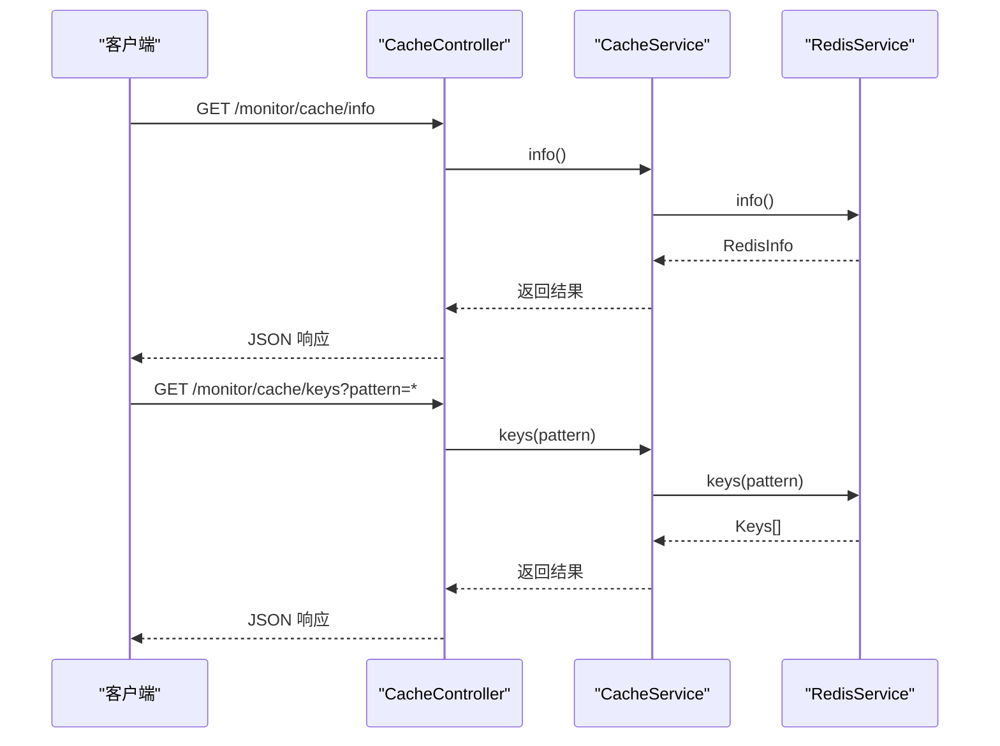
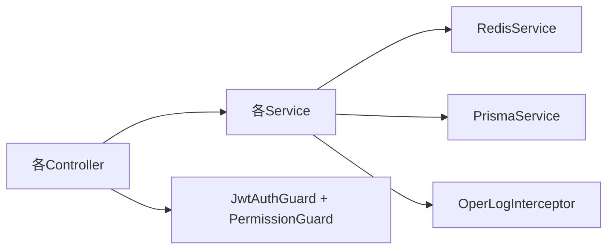

# 监控统计模块

<cite>
**本文档引用的文件**
- [apps/backend/src/modules/monitor/monitor.module.ts](file://apps/backend/src/modules/monitor/monitor.module.ts)
- [apps/backend/src/modules/monitor/cache/cache.module.ts](file://apps/backend/src/modules/monitor/cache/cache.module.ts)
- [apps/backend/src/modules/monitor/cache/cache.controller.ts](file://apps/backend/src/modules/monitor/cache/cache.controller.ts)
- [apps/backend/src/modules/monitor/cache/cache.service.ts](file://apps/backend/src/modules/monitor/cache/cache.service.ts)
- [apps/backend/src/modules/monitor/login-log/login-log.module.ts](file://apps/backend/src/modules/monitor/login-log/login-log.module.ts)
- [apps/backend/src/modules/monitor/login-log/login-log.controller.ts](file://apps/backend/src/modules/monitor/login-log/login-log.controller.ts)
- [apps/backend/src/modules/monitor/login-log/login-log.service.ts](file://apps/backend/src/modules/monitor/login-log/login-log.service.ts)
- [apps/backend/src/modules/monitor/online/online.module.ts](file://apps/backend/src/modules/monitor/online/online.module.ts)
- [apps/backend/src/modules/monitor/online/online.controller.ts](file://apps/backend/src/modules/monitor/online/online.controller.ts)
- [apps/backend/src/modules/monitor/online/online.service.ts](file://apps/backend/src/modules/monitor/online/online.service.ts)
- [apps/backend/src/modules/monitor/oper-log/oper-log.module.ts](file://apps/backend/src/modules/monitor/oper-log/oper-log.module.ts)
- [apps/backend/src/modules/monitor/oper-log/oper-log.controller.ts](file://apps/backend/src/modules/monitor/oper-log/oper-log.controller.ts)
- [apps/backend/src/modules/monitor/oper-log/oper-log.service.ts](file://apps/backend/src/modules/monitor/oper-log/oper-log.service.ts)
- [apps/backend/src/modules/monitor/server/server.module.ts](file://apps/backend/src/modules/monitor/server/server.module.ts)
- [apps/backend/src/modules/monitor/server/server.controller.ts](file://apps/backend/src/modules/monitor/server/server.controller.ts)
- [apps/backend/src/modules/monitor/server/server.service.ts](file://apps/backend/src/modules/monitor/server/server.service.ts)
- [apps/backend/src/cache/redis.service.ts](file://apps/backend/src/cache/redis.service.ts)
- [apps/backend/src/common/prisma.service.ts](file://apps/backend/src/common/prisma.service.ts)
- [apps/backend/src/common/oper-log.interceptor.ts](file://apps/backend/src/common/oper-log.interceptor.ts)
- [apps/backend/src/auth/jwt.guard.ts](file://apps/backend/src/auth/jwt.guard.ts)
- [apps/backend/src/auth/guards.ts](file://apps/backend/src/auth/guards.ts)
</cite>

## 目录
1. [简介](#简介)
2. [项目结构](#项目结构)
3. [核心组件](#核心组件)
4. [架构总览](#架构总览)
5. [详细组件分析](#详细组件分析)
6. [依赖关系分析](#依赖关系分析)
7. [性能考虑](#性能考虑)
8. [故障排查指南](#故障排查指南)
9. [结论](#结论)
10. [附录](#附录)

## 简介
本文件面向监控统计模块（MonitorModule），系统性阐述其设计架构与实现细节，覆盖以下能力域：
- 登录日志管理：分页查询、条件过滤、清理
- 操作日志追踪：分页查询、条件过滤、清理
- 在线用户监控：在线用户列表、强制下线
- 服务器性能监控：CPU、内存、负载、主机信息等
- Redis 缓存监控：连接信息、键空间扫描、值读取、清空与删除

文档同时说明日志收集机制、监控数据采集流程、性能指标计算方法、权限控制与安全策略，并给出监控 API 的设计规范、数据格式定义、实时监控实现建议、系统健康检查、性能瓶颈分析与故障排查指南。

## 项目结构
监控模块采用按功能域划分的子模块组织方式，MonitorModule 作为聚合入口，分别导入 LoginLogModule、OperLogModule、OnlineModule、ServerModule、CacheModule 五个子模块。每个子模块内部包含 Controller、Service、Module 三类文件，遵循“控制器负责接口与鉴权，服务负责业务逻辑与数据访问”的分层原则。

图表来源
- [apps/backend/src/modules/monitor/monitor.module.ts:1-11](file://apps/backend/src/modules/monitor/monitor.module.ts#L1-L11)
- [apps/backend/src/modules/monitor/login-log/login-log.module.ts:1-10](file://apps/backend/src/modules/monitor/login-log/login-log.module.ts#L1-L10)
- [apps/backend/src/modules/monitor/oper-log/oper-log.module.ts:1-10](file://apps/backend/src/modules/monitor/oper-log/oper-log.module.ts#L1-L10)
- [apps/backend/src/modules/monitor/online/online.module.ts:1-10](file://apps/backend/src/modules/monitor/online/online.module.ts#L1-L10)
- [apps/backend/src/modules/monitor/server/server.module.ts:1-10](file://apps/backend/src/modules/monitor/server/server.module.ts#L1-L10)
- [apps/backend/src/modules/monitor/cache/cache.module.ts:1-10](file://apps/backend/src/modules/monitor/cache/cache.module.ts#L1-L10)

章节来源
- [apps/backend/src/modules/monitor/monitor.module.ts:1-11](file://apps/backend/src/modules/monitor/monitor.module.ts#L1-L11)

## 核心组件
- MonitorModule：聚合入口，统一导入各子模块
- 各子模块 Controller：定义 REST 接口、参数校验、权限注解与 Swagger 标签
- 各子模块 Service：封装业务逻辑，调用 Redis 或数据库服务
- RedisService：提供 Redis 连接与命令执行能力（如 info、keys、get、flushdb、del、getOnlineUsers 等）
- PrismaService：提供数据库访问能力（sysLoginLog、sysOperLog、sysUser 等表）

章节来源
- [apps/backend/src/modules/monitor/monitor.module.ts:1-11](file://apps/backend/src/modules/monitor/monitor.module.ts#L1-L11)
- [apps/backend/src/modules/monitor/cache/cache.service.ts:1-29](file://apps/backend/src/modules/monitor/cache/cache.service.ts#L1-L29)
- [apps/backend/src/modules/monitor/login-log/login-log.service.ts:1-31](file://apps/backend/src/modules/monitor/login-log/login-log.service.ts#L1-L31)
- [apps/backend/src/modules/monitor/online/online.service.ts:1-31](file://apps/backend/src/modules/monitor/online/online.service.ts#L1-L31)
- [apps/backend/src/modules/monitor/oper-log/oper-log.service.ts:1-33](file://apps/backend/src/modules/monitor/oper-log/oper-log.service.ts#L1-L33)
- [apps/backend/src/modules/monitor/server/server.controller.ts:1-70](file://apps/backend/src/modules/monitor/server/server.controller.ts#L1-L70)
- [apps/backend/src/cache/redis.service.ts](file://apps/backend/src/cache/redis.service.ts)
- [apps/backend/src/common/prisma.service.ts](file://apps/backend/src/common/prisma.service.ts)

## 架构总览
监控模块整体采用“控制器 + 服务 + 基础设施服务”的分层架构。控制器负责请求接入、参数解析、鉴权与权限控制；服务负责业务编排与数据访问；基础设施服务（RedisService、PrismaService）提供底层能力。

图表来源
- [apps/backend/src/modules/monitor/cache/cache.controller.ts:1-50](file://apps/backend/src/modules/monitor/cache/cache.controller.ts#L1-L50)
- [apps/backend/src/modules/monitor/cache/cache.service.ts:1-29](file://apps/backend/src/modules/monitor/cache/cache.service.ts#L1-L29)
- [apps/backend/src/modules/monitor/login-log/login-log.controller.ts:1-45](file://apps/backend/src/modules/monitor/login-log/login-log.controller.ts#L1-L45)
- [apps/backend/src/modules/monitor/login-log/login-log.service.ts:1-31](file://apps/backend/src/modules/monitor/login-log/login-log.service.ts#L1-L31)
- [apps/backend/src/modules/monitor/online/online.controller.ts:1-28](file://apps/backend/src/modules/monitor/online/online.controller.ts#L1-L28)
- [apps/backend/src/modules/monitor/online/online.service.ts:1-31](file://apps/backend/src/modules/monitor/online/online.service.ts#L1-L31)
- [apps/backend/src/modules/monitor/oper-log/oper-log.controller.ts:1-35](file://apps/backend/src/modules/monitor/oper-log/oper-log.controller.ts#L1-L35)
- [apps/backend/src/modules/monitor/oper-log/oper-log.service.ts:1-33](file://apps/backend/src/modules/monitor/oper-log/oper-log.service.ts#L1-L33)
- [apps/backend/src/modules/monitor/server/server.controller.ts:1-70](file://apps/backend/src/modules/monitor/server/server.controller.ts#L1-L70)
- [apps/backend/src/modules/monitor/server/server.service.ts:1-4](file://apps/backend/src/modules/monitor/server/server.service.ts#L1-L4)
- [apps/backend/src/cache/redis.service.ts](file://apps/backend/src/cache/redis.service.ts)
- [apps/backend/src/common/prisma.service.ts](file://apps/backend/src/common/prisma.service.ts)

## 详细组件分析

### 登录日志管理
- 功能职责
  - 分页查询登录日志，支持用户名与状态过滤
  - 按主键查询单条记录
  - 清理全部登录日志
- 数据来源
  - 使用 PrismaService 访问 sysLoginLog 表
- 性能与复杂度
  - 查询使用 count + 列表的并行模式，避免 N+1，时间复杂度 O(N)
  - 支持模糊匹配 username 字段，注意索引与查询范围
- 安全与权限
  - 需要 monitor:login:list 权限
  - 通过 JWT 与权限守卫保护

图表来源
- [apps/backend/src/modules/monitor/login-log/login-log.controller.ts:1-45](file://apps/backend/src/modules/monitor/login-log/login-log.controller.ts#L1-L45)
- [apps/backend/src/modules/monitor/login-log/login-log.service.ts:1-31](file://apps/backend/src/modules/monitor/login-log/login-log.service.ts#L1-L31)

章节来源
- [apps/backend/src/modules/monitor/login-log/login-log.controller.ts:1-45](file://apps/backend/src/modules/monitor/login-log/login-log.controller.ts#L1-L45)
- [apps/backend/src/modules/monitor/login-log/login-log.service.ts:1-31](file://apps/backend/src/modules/monitor/login-log/login-log.service.ts#L1-L31)

### 操作日志追踪
- 功能职责
  - 分页查询操作日志，支持用户名与模块名过滤
  - 按主键查询单条记录
  - 清理全部操作日志
- 数据来源
  - 使用 PrismaService 访问 sysOperLog 表
- 性能与复杂度
  - 查询使用并行 count + 列表，时间复杂度 O(N)
  - 支持模糊匹配 username 与 module 字段

图表来源
- [apps/backend/src/modules/monitor/oper-log/oper-log.controller.ts:1-35](file://apps/backend/src/modules/monitor/oper-log/oper-log.controller.ts#L1-L35)
- [apps/backend/src/modules/monitor/oper-log/oper-log.service.ts:1-33](file://apps/backend/src/modules/monitor/oper-log/oper-log.service.ts#L1-L33)

章节来源
- [apps/backend/src/modules/monitor/oper-log/oper-log.controller.ts:1-35](file://apps/backend/src/modules/monitor/oper-log/oper-log.controller.ts#L1-L35)
- [apps/backend/src/modules/monitor/oper-log/oper-log.service.ts:1-33](file://apps/backend/src/modules/monitor/oper-log/oper-log.service.ts#L1-L33)

### 在线用户监控
- 功能职责
  - 获取在线用户列表：从 Redis 中读取在线令牌集合，再逐个解析用户信息
  - 强制下线：移除指定令牌对应的在线用户
- 数据来源
  - RedisService 提供在线用户集合与映射
  - PrismaService 查询用户详情
- 性能与复杂度
  - 在线用户数量 M 时，查询复杂度 O(M)，存在循环逐个查询用户信息
  - 可通过批量获取或缓存优化减少数据库压力

图表来源
- [apps/backend/src/modules/monitor/online/online.controller.ts:1-28](file://apps/backend/src/modules/monitor/online/online.controller.ts#L1-L28)
- [apps/backend/src/modules/monitor/online/online.service.ts:1-31](file://apps/backend/src/modules/monitor/online/online.service.ts#L1-L31)
- [apps/backend/src/cache/redis.service.ts](file://apps/backend/src/cache/redis.service.ts)
- [apps/backend/src/common/prisma.service.ts](file://apps/backend/src/common/prisma.service.ts)

章节来源
- [apps/backend/src/modules/monitor/online/online.controller.ts:1-28](file://apps/backend/src/modules/monitor/online/online.controller.ts#L1-L28)
- [apps/backend/src/modules/monitor/online/online.service.ts:1-31](file://apps/backend/src/modules/monitor/online/online.service.ts#L1-L31)

### 服务器性能监控
- 功能职责
  - 获取服务器基础信息：操作系统、主机名、运行时长
  - CPU 使用率：基于多核 CPU 时间片计算
  - 内存使用：总量、已用、剩余、使用率
- 实现要点
  - 使用 Node.js os 模块获取 CPU、内存、运行时长等信息
  - CPU 使用率通过两次采样差值计算，避免瞬时波动
  - 内存使用率 = 已用/总量 × 100%，保留一位小数
  - 字节单位自动格式化为 B/KB/MB/GB

图表来源
- [apps/backend/src/modules/monitor/server/server.controller.ts:1-70](file://apps/backend/src/modules/monitor/server/server.controller.ts#L1-L70)

章节来源
- [apps/backend/src/modules/monitor/server/server.controller.ts:1-70](file://apps/backend/src/modules/monitor/server/server.controller.ts#L1-L70)

### Redis 缓存监控
- 功能职责
  - 获取 Redis 连接信息（info）
  - 键空间扫描（keys，支持通配符）
  - 读取键值（get）
  - 清空数据库（flushdb）
  - 删除指定键（del）
- 实现要点
  - 所有操作委托给 RedisService
  - 清空与删除返回统一的成功标记

图表来源
- [apps/backend/src/modules/monitor/cache/cache.controller.ts:1-50](file://apps/backend/src/modules/monitor/cache/cache.controller.ts#L1-L50)
- [apps/backend/src/modules/monitor/cache/cache.service.ts:1-29](file://apps/backend/src/modules/monitor/cache/cache.service.ts#L1-L29)
- [apps/backend/src/cache/redis.service.ts](file://apps/backend/src/cache/redis.service.ts)

章节来源
- [apps/backend/src/modules/monitor/cache/cache.controller.ts:1-50](file://apps/backend/src/modules/monitor/cache/cache.controller.ts#L1-L50)
- [apps/backend/src/modules/monitor/cache/cache.service.ts:1-29](file://apps/backend/src/modules/monitor/cache/cache.service.ts#L1-L29)

## 依赖关系分析
- 控制器依赖服务：所有控制器均通过构造函数注入对应服务
- 服务依赖基础设施：CacheService 依赖 RedisService；LoginLogService、OperLogService、OnlineService 依赖 PrismaService
- 权限与安全：所有控制器均应用 JwtAuthGuard 与 PermissionGuard，并通过 RequirePermission 注解声明所需权限
- 日志拦截：系统通过 oper-log.interceptor 拦截器记录操作日志，确保关键操作可追溯

图表来源
- [apps/backend/src/modules/monitor/cache/cache.controller.ts:1-50](file://apps/backend/src/modules/monitor/cache/cache.controller.ts#L1-L50)
- [apps/backend/src/modules/monitor/login-log/login-log.controller.ts:1-45](file://apps/backend/src/modules/monitor/login-log/login-log.controller.ts#L1-L45)
- [apps/backend/src/modules/monitor/online/online.controller.ts:1-28](file://apps/backend/src/modules/monitor/online/online.controller.ts#L1-L28)
- [apps/backend/src/modules/monitor/oper-log/oper-log.controller.ts:1-35](file://apps/backend/src/modules/monitor/oper-log/oper-log.controller.ts#L1-L35)
- [apps/backend/src/modules/monitor/server/server.controller.ts:1-70](file://apps/backend/src/modules/monitor/server/server.controller.ts#L1-L70)
- [apps/backend/src/cache/redis.service.ts](file://apps/backend/src/cache/redis.service.ts)
- [apps/backend/src/common/prisma.service.ts](file://apps/backend/src/common/prisma.service.ts)
- [apps/backend/src/common/oper-log.interceptor.ts](file://apps/backend/src/common/oper-log.interceptor.ts)
- [apps/backend/src/auth/jwt.guard.ts](file://apps/backend/src/auth/jwt.guard.ts)
- [apps/backend/src/auth/guards.ts](file://apps/backend/src/auth/guards.ts)

章节来源
- [apps/backend/src/auth/jwt.guard.ts](file://apps/backend/src/auth/jwt.guard.ts)
- [apps/backend/src/auth/guards.ts](file://apps/backend/src/auth/guards.ts)
- [apps/backend/src/common/oper-log.interceptor.ts](file://apps/backend/src/common/oper-log.interceptor.ts)

## 性能考虑
- 查询优化
  - 登录日志与操作日志采用并行 count + 列表，避免顺序阻塞
  - 建议在 sysLoginLog、sysOperLog 的 username、status、module、createTime 等字段建立复合索引以提升过滤与排序性能
- 在线用户监控
  - 当前实现对每个令牌逐一查询用户信息，存在 N 次数据库往返
  - 建议：批量获取用户信息或引入用户缓存，降低数据库压力
- Redis 操作
  - keys 为阻塞命令，生产环境建议使用 scan 替代，避免长时间阻塞
  - flushdb 与 del 为高危操作，建议增加二次确认与审计日志
- 服务器监控
  - CPU 使用率计算需两次采样，建议设置合理的采样间隔，避免频繁计算造成开销
- 缓存与数据库一致性
  - 在线用户信息来源于 Redis 令牌与数据库用户表，需保证两者更新的一致性与时效性

## 故障排查指南
- 登录日志/操作日志为空
  - 检查数据库中 sysLoginLog/sysOperLog 是否存在数据
  - 确认查询参数（用户名、状态/模块）是否过严导致无结果
- 在线用户列表异常
  - 检查 Redis 中在线用户集合与映射是否存在
  - 确认用户表中对应用户是否存在且可查询
- 服务器监控数据异常
  - 检查 Node.js os 模块可用性与权限
  - 确认 CPU 使用率计算的两次采样是否成功
- Redis 缓存监控不可用
  - 检查 Redis 连接配置与网络连通性
  - 确认 keys/get 等命令是否被禁用
- 权限不足
  - 确认当前用户是否具备 monitor:* 权限
  - 检查 JWT 令牌有效性与权限守卫是否生效

## 结论
监控统计模块通过清晰的分层设计与模块化组织，实现了登录日志、操作日志、在线用户、服务器性能与 Redis 缓存的全栈监控能力。结合权限守卫与操作日志拦截器，保障了系统的安全性与可追溯性。建议在生产环境中进一步完善索引、优化 Redis 命令使用、增强在线用户批量查询与缓存策略，并持续关注性能指标与告警阈值的设定。

## 附录

### 监控 API 设计规范与数据格式
- 统一响应结构
  - 成功响应：包含 total（总数）、items（列表）或具体对象
  - 失败响应：包含错误码与错误信息
- 分页约定
  - page：页码，默认 1
  - limit：每页条数，默认 10
- 权限标识
  - 登录日志：monitor:login:list
  - 操作日志：monitor:oper:list
  - 在线用户：monitor:online:list
  - 服务器：monitor:server:list
  - Redis 缓存：monitor:cache:list
- 参数命名与类型
  - 字符串模糊匹配：username、module、pattern
  - 数值过滤：status
  - 主键：id（整型）

章节来源
- [apps/backend/src/modules/monitor/login-log/login-log.controller.ts:1-45](file://apps/backend/src/modules/monitor/login-log/login-log.controller.ts#L1-L45)
- [apps/backend/src/modules/monitor/oper-log/oper-log.controller.ts:1-35](file://apps/backend/src/modules/monitor/oper-log/oper-log.controller.ts#L1-L35)
- [apps/backend/src/modules/monitor/online/online.controller.ts:1-28](file://apps/backend/src/modules/monitor/online/online.controller.ts#L1-L28)
- [apps/backend/src/modules/monitor/server/server.controller.ts:1-70](file://apps/backend/src/modules/monitor/server/server.controller.ts#L1-L70)
- [apps/backend/src/modules/monitor/cache/cache.controller.ts:1-50](file://apps/backend/src/modules/monitor/cache/cache.controller.ts#L1-L50)