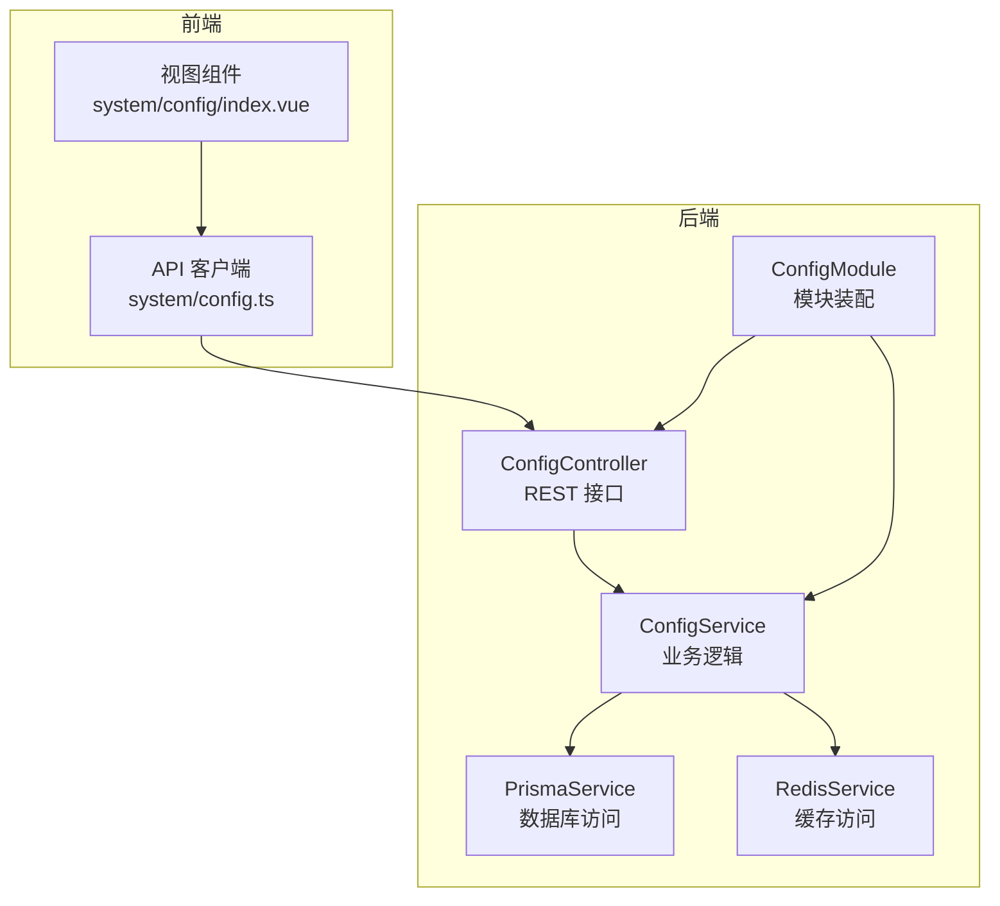
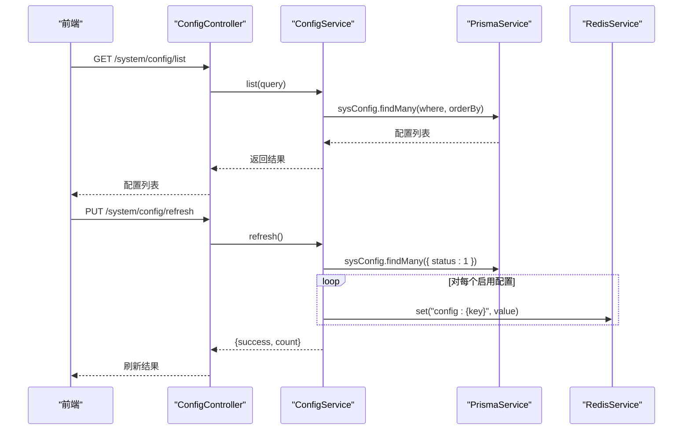
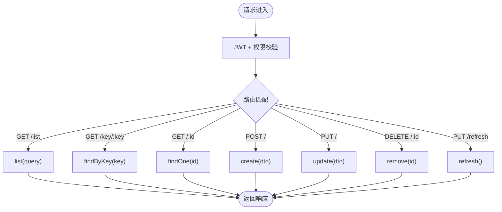
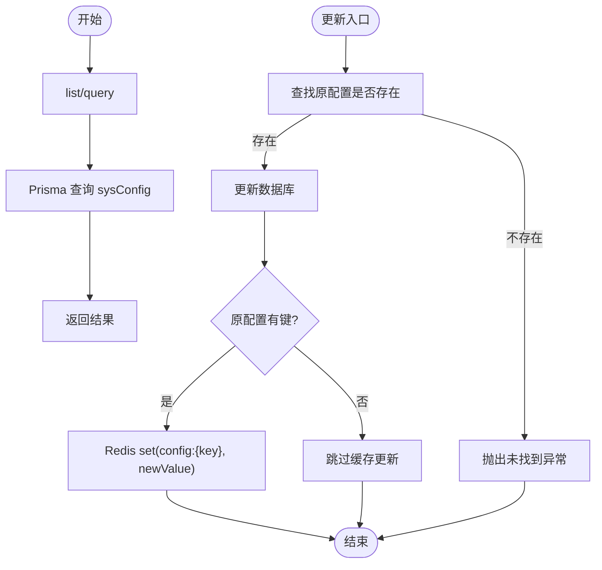
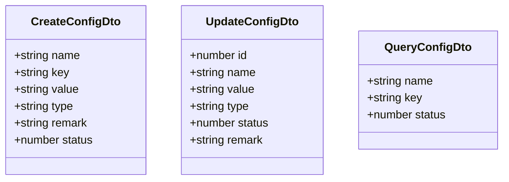
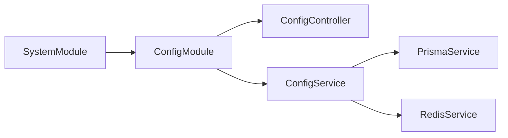

# 参数配置

<cite>
**本文引用的文件列表**
- [config.controller.ts](file://apps/backend/src/modules/system/config/config.controller.ts)
- [config.service.ts](file://apps/backend/src/modules/system/config/config.service.ts)
- [config.dto.ts](file://apps/backend/src/modules/system/config/dto/config.dto.ts)
- [config.module.ts](file://apps/backend/src/modules/system/config/config.module.ts)
- [redis.service.ts](file://apps/backend/src/cache/redis.service.ts)
- [prisma.service.ts](file://apps/backend/src/common/prisma.service.ts)
- [schema.prisma](file://apps/backend/prisma/schema.prisma)
- [config.ts](file://apps/vben-admin/apps/web-antd/src/api/system/config.ts)
- [index.vue](file://apps/vben-admin/apps/web-antd/src/views/system/config/index.vue)
- [system.module.ts](file://apps/backend/src/modules/system/system.module.ts)
</cite>

## 目录
1. [简介](#简介)
2. [项目结构](#项目结构)
3. [核心组件](#核心组件)
4. [架构总览](#架构总览)
5. [详细组件分析](#详细组件分析)
6. [依赖关系分析](#依赖关系分析)
7. [性能考量](#性能考量)
8. [故障排查指南](#故障排查指南)
9. [结论](#结论)
10. [附录](#附录)

## 简介
本文件面向“参数配置”子模块，系统性阐述其设计与实现：包括配置项的增删改查（CRUD）、配置数据的缓存策略、配置变更的实时生效机制、配置数据的安全存储、配置项的分类管理、敏感配置的加密存储、配置数据的版本控制、以及配置变更的日志记录与审计能力。同时，文档对 ConfigController 的 API 设计、ConfigService 中的配置读取优化与缓存更新逻辑、以及 Config DTO 的参数验证与类型转换规则进行深入解析，并提供可视化图示帮助理解。

## 项目结构
参数配置子模块位于后端 NestJS 应用的系统模块下，采用标准的分层与职责分离：
- 控制器层：处理 HTTP 请求与权限校验，调用服务层完成业务逻辑
- 服务层：封装数据访问与缓存更新，协调数据库与缓存
- 数据传输对象（DTO）：统一输入校验与类型转换
- 缓存与数据库：通过 Redis 与 Prisma 进行配置项的读写与持久化
- 前端集成：提供配置管理界面与 API 调用

图表来源
- [config.controller.ts:1-63](file://apps/backend/src/modules/system/config/config.controller.ts#L1-L63)
- [config.service.ts:1-56](file://apps/backend/src/modules/system/config/config.service.ts#L1-L56)
- [config.module.ts:1-10](file://apps/backend/src/modules/system/config/config.module.ts#L1-L10)
- [prisma.service.ts:1-22](file://apps/backend/src/common/prisma.service.ts#L1-L22)
- [redis.service.ts:1-128](file://apps/backend/src/cache/redis.service.ts#L1-L128)
- [config.ts:1-46](file://apps/vben-admin/apps/web-antd/src/api/system/config.ts#L1-L46)
- [index.vue:1-123](file://apps/vben-admin/apps/web-antd/src/views/system/config/index.vue#L1-L123)

章节来源
- [config.controller.ts:1-63](file://apps/backend/src/modules/system/config/config.controller.ts#L1-L63)
- [config.service.ts:1-56](file://apps/backend/src/modules/system/config/config.service.ts#L1-L56)
- [config.module.ts:1-10](file://apps/backend/src/modules/system/config/config.module.ts#L1-L10)
- [system.module.ts:1-23](file://apps/backend/src/modules/system/system.module.ts#L1-L23)

## 核心组件
- ConfigController：定义并实现配置项的查询、创建、更新、删除、按键查询、按ID查询、以及缓存刷新接口；统一使用 JWT 与权限守卫进行安全控制。
- ConfigService：封装 CRUD 与缓存同步逻辑；负责将状态为启用的配置项加载到 Redis；在更新配置时同步缓存。
- DTO（CreateConfigDto、UpdateConfigDto、QueryConfigDto）：基于 class-validator/class-transformer 实现参数校验与类型转换。
- RedisService：提供通用的键值存取、序列化/反序列化、TTL 管理等能力。
- PrismaService：数据库客户端封装，连接 MySQL 并输出日志。
- 前端 API 客户端与视图组件：提供配置列表、搜索、新增/编辑、删除、刷新缓存等交互。

章节来源
- [config.controller.ts:1-63](file://apps/backend/src/modules/system/config/config.controller.ts#L1-L63)
- [config.service.ts:1-56](file://apps/backend/src/modules/system/config/config.service.ts#L1-L56)
- [config.dto.ts:1-28](file://apps/backend/src/modules/system/config/dto/config.dto.ts#L1-L28)
- [redis.service.ts:1-128](file://apps/backend/src/cache/redis.service.ts#L1-L128)
- [prisma.service.ts:1-22](file://apps/backend/src/common/prisma.service.ts#L1-L22)
- [config.ts:1-46](file://apps/vben-admin/apps/web-antd/src/api/system/config.ts#L1-L46)
- [index.vue:1-123](file://apps/vben-admin/apps/web-antd/src/views/system/config/index.vue#L1-L123)

## 架构总览
参数配置模块采用“控制器-服务-数据源”的分层架构，结合 Redis 缓存实现配置项的快速读取与变更后的即时生效。

图表来源
- [config.controller.ts:14-61](file://apps/backend/src/modules/system/config/config.controller.ts#L14-L61)
- [config.service.ts:49-55](file://apps/backend/src/modules/system/config/config.service.ts#L49-L55)
- [prisma.service.ts:1-22](file://apps/backend/src/common/prisma.service.ts#L1-L22)
- [redis.service.ts:39-47](file://apps/backend/src/cache/redis.service.ts#L39-L47)

## 详细组件分析

### ConfigController API 设计
- 权限与安全
  - 使用 JWT 与权限守卫，所有接口均需具备 system:config:list 权限。
- 接口清单
  - GET /system/config/list：分页查询配置项，支持按名称、键名、状态过滤
  - GET /system/config/key/:key：按键获取配置
  - GET /system/config/:id：按ID获取配置
  - POST /system/config：创建配置
  - PUT /system/config：更新配置
  - DELETE /system/config/:id：删除配置
  - PUT /system/config/refresh：刷新配置缓存（将启用的配置写入 Redis）

图表来源
- [config.controller.ts:14-61](file://apps/backend/src/modules/system/config/config.controller.ts#L14-L61)

章节来源
- [config.controller.ts:1-63](file://apps/backend/src/modules/system/config/config.controller.ts#L1-L63)

### ConfigService 配置读取优化与缓存更新逻辑
- 查询优化
  - 支持按名称（模糊）、键名（模糊）、状态过滤；默认按 ID 升序排序，便于分页与一致性展示。
- 写入与缓存同步
  - 创建：直接写入数据库，不主动写缓存（避免未启用配置占用缓存空间）。
  - 更新：先查原配置是否存在，再更新数据库；若原配置存在键，则同步更新 Redis 缓存。
  - 删除：直接删除数据库记录，返回成功标记。
  - 刷新缓存：查询所有启用的配置项，批量写入 Redis，用于启动或运维场景下的全量预热。
- 异常处理
  - 查无配置时抛出“未找到”异常，确保前端可感知错误。

图表来源
- [config.service.ts:10-47](file://apps/backend/src/modules/system/config/config.service.ts#L10-L47)
- [redis.service.ts:39-47](file://apps/backend/src/cache/redis.service.ts#L39-L47)

章节来源
- [config.service.ts:1-56](file://apps/backend/src/modules/system/config/config.service.ts#L1-L56)

### DTO 参数验证与类型转换规则
- CreateConfigDto
  - name、key、value 必填且为字符串
  - type 可选，默认字符串类型
  - remark 可选
  - status 可选，默认启用
- UpdateConfigDto
  - id 必填且为整数
  - 其余字段可选（name、value、type、status、remark）
- QueryConfigDto
  - name、key 可选
  - status 可选，经类型转换为整数

图表来源
- [config.dto.ts:5-27](file://apps/backend/src/modules/system/config/dto/config.dto.ts#L5-L27)

章节来源
- [config.dto.ts:1-28](file://apps/backend/src/modules/system/config/dto/config.dto.ts#L1-L28)

### 配置项的分类管理
- 当前实现仅提供基础字段：名称、键、值、类型、备注、状态、时间戳。
- 分类维度建议扩展方向（概念性说明）：
  - 类型字段可用于区分字符串、数字、布尔、JSON 等，前端据此渲染不同输入控件
  - 状态字段用于启用/禁用，配合缓存刷新策略
  - 备注字段用于说明用途，便于审计与维护

章节来源
- [schema.prisma:152-165](file://apps/backend/prisma/schema.prisma#L152-L165)

### 敏感配置的加密存储
- 当前实现
  - 配置值以明文形式存储于数据库与缓存中
  - 未见专门的敏感字段或加密逻辑
- 建议改进（概念性说明）
  - 新增 sensitive 标记字段与加密开关
  - 在入库前对敏感值进行加密存储，读取时解密返回
  - 结合密钥管理服务与最小权限原则，严格控制密钥访问

章节来源
- [config.service.ts:31-42](file://apps/backend/src/modules/system/config/config.service.ts#L31-L42)
- [redis.service.ts:39-47](file://apps/backend/src/cache/redis.service.ts#L39-L47)

### 配置数据的版本控制
- 当前实现
  - 未见显式的版本号字段或历史表
- 建议改进（概念性说明）
  - 引入版本号字段与配置历史表，记录每次变更的发起人、时间、旧值、新值
  - 提供回滚接口与差异对比

章节来源
- [schema.prisma:152-165](file://apps/backend/prisma/schema.prisma#L152-L165)

### 配置变更的日志记录与审计功能
- 当前实现
  - 未见专门的配置变更日志表或拦截器
- 建议改进（概念性说明）
  - 在服务层增加操作日志拦截器或装饰器，记录关键变更
  - 将变更写入操作日志表，包含用户、IP、时间、变更详情
  - 提供审计查询接口与导出能力

章节来源
- [config.service.ts:37-42](file://apps/backend/src/modules/system/config/config.service.ts#L37-L42)

## 依赖关系分析
- 模块装配
  - ConfigModule 导出 ConfigService，供其他模块复用
  - SystemModule 统一导入 ConfigModule，形成系统级配置管理
- 外部依赖
  - RedisService 提供缓存能力，键命名规范为 config:{key}
  - PrismaService 提供数据库访问，SysConfig 模型定义了配置项的结构

图表来源
- [config.module.ts:5-9](file://apps/backend/src/modules/system/config/config.module.ts#L5-L9)
- [system.module.ts:11-21](file://apps/backend/src/modules/system/system.module.ts#L11-L21)

章节来源
- [config.module.ts:1-10](file://apps/backend/src/modules/system/config/config.module.ts#L1-L10)
- [system.module.ts:1-23](file://apps/backend/src/modules/system/system.module.ts#L1-L23)

## 性能考量
- 读取路径
  - 前端优先从 Redis 获取配置，减少数据库压力；若 Redis 未命中，可在应用侧补充降级策略（如本地缓存或只读副本）
- 写入路径
  - 更新配置后立即同步 Redis，保证多实例间的一致性
- 批量刷新
  - 刷新缓存接口遍历启用配置项，批量写入 Redis；建议在低峰期执行，避免瞬时压力
- 类型与序列化
  - RedisService 对非字符串值进行 JSON 序列化，注意大对象的序列化开销与 TTL 设置

章节来源
- [config.service.ts:49-55](file://apps/backend/src/modules/system/config/config.service.ts#L49-L55)
- [redis.service.ts:39-47](file://apps/backend/src/cache/redis.service.ts#L39-L47)

## 故障排查指南
- 常见问题
  - 配置未生效：检查 Redis 是否连通、键是否正确、是否执行了刷新缓存
  - 更新失败：确认配置存在且键有效；查看服务层异常信息
  - 查询为空：确认过滤条件与状态设置
- 排查步骤
  - 检查 Redis 连接与键空间：使用 keys、ttl、hget 等命令验证
  - 检查数据库连接与模型：确认 SysConfig 表存在且字段完整
  - 查看服务层日志：定位异常抛出点与参数校验失败原因
- 建议工具
  - Redis 客户端：验证键 config:{key} 的存在与值
  - 数据库客户端：验证 SysConfig 记录与状态

章节来源
- [redis.service.ts:1-128](file://apps/backend/src/cache/redis.service.ts#L1-L128)
- [prisma.service.ts:1-22](file://apps/backend/src/common/prisma.service.ts#L1-L22)
- [config.service.ts:19-29](file://apps/backend/src/modules/system/config/config.service.ts#L19-L29)

## 结论
参数配置子模块通过清晰的分层设计与 Redis 缓存实现了配置项的高效读取与变更同步。当前实现满足基本的 CRUD 与缓存刷新需求，建议后续增强敏感配置加密、版本控制与审计日志能力，以提升安全性与可追溯性。前端提供了直观的管理界面，配合后端 API 可满足日常运维场景。

## 附录
- 前端集成
  - API 客户端封装了列表、详情、创建、更新、删除、刷新缓存等方法
  - 视图组件提供查询、分页、弹窗编辑、批量操作等功能

章节来源
- [config.ts:1-46](file://apps/vben-admin/apps/web-antd/src/api/system/config.ts#L1-L46)
- [index.vue:1-123](file://apps/vben-admin/apps/web-antd/src/views/system/config/index.vue#L1-L123)