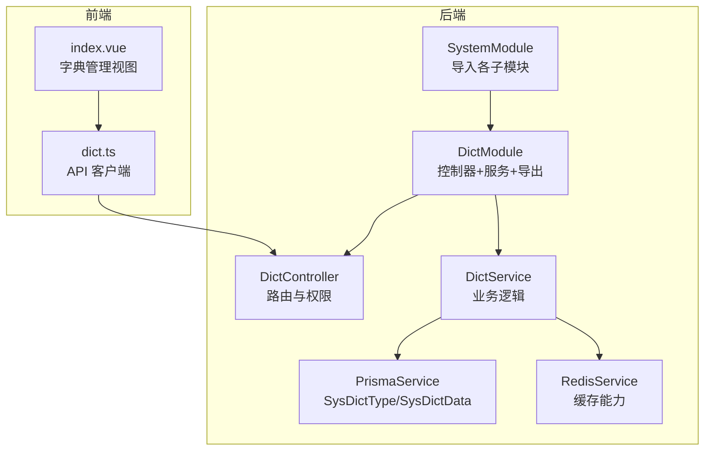
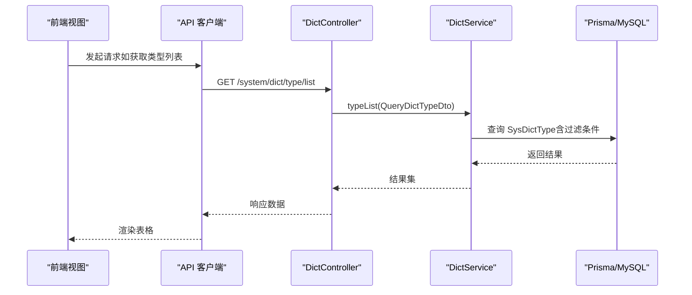
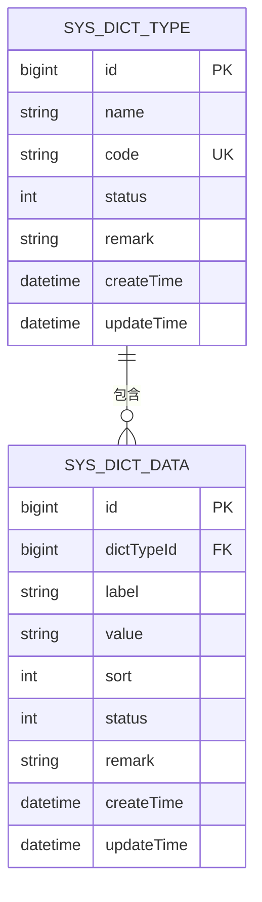
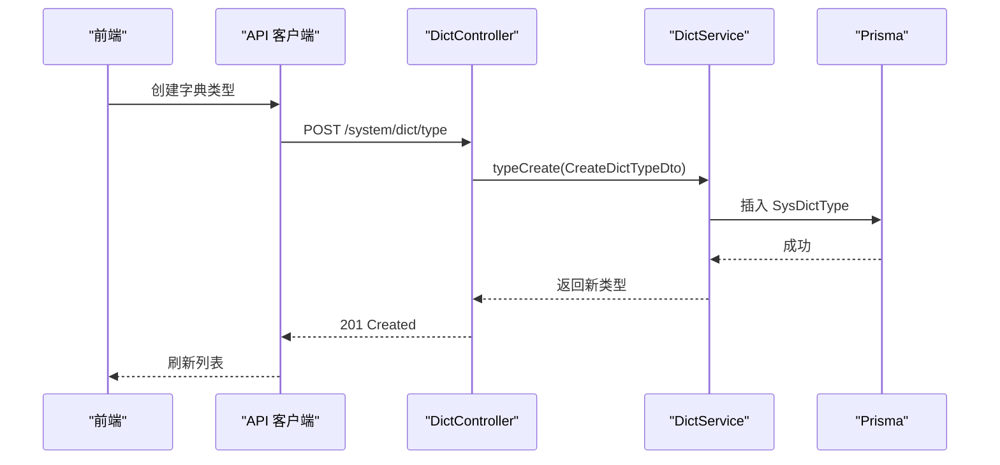
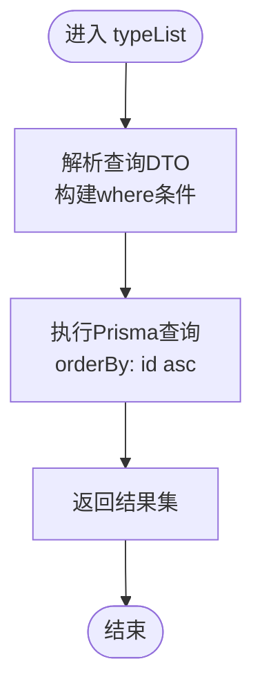
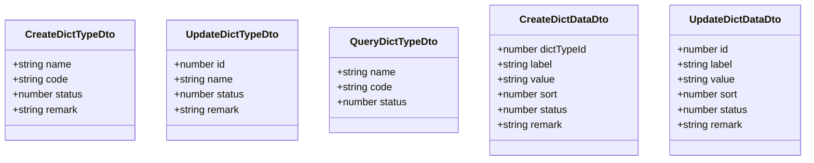
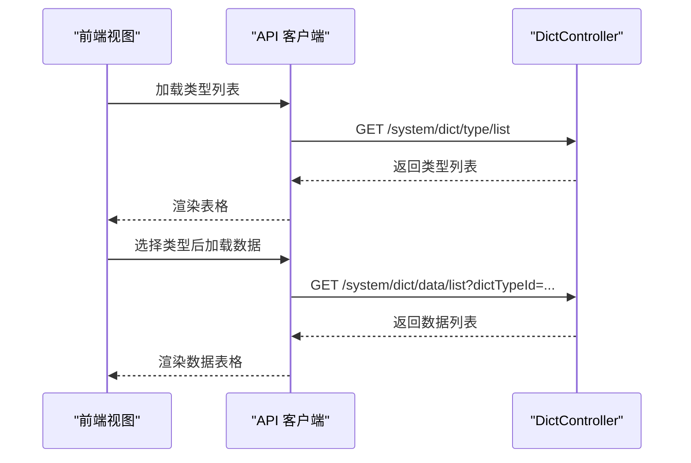
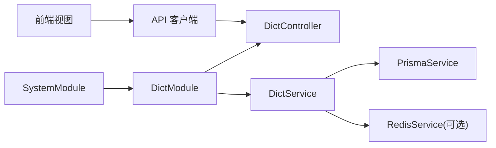

# 字典管理

<cite>
**本文档引用的文件**
- [apps/backend/src/modules/system/dict/dict.controller.ts](file://apps/backend/src/modules/system/dict/dict.controller.ts)
- [apps/backend/src/modules/system/dict/dict.service.ts](file://apps/backend/src/modules/system/dict/dict.service.ts)
- [apps/backend/src/modules/system/dict/dict.module.ts](file://apps/backend/src/modules/system/dict/dict.module.ts)
- [apps/backend/src/modules/system/dict/dto/dict.dto.ts](file://apps/backend/src/modules/system/dict/dto/dict.dto.ts)
- [apps/backend/src/modules/system/system.module.ts](file://apps/backend/src/modules/system/system.module.ts)
- [apps/backend/prisma/schema.prisma](file://apps/backend/prisma/schema.prisma)
- [apps/backend/src/cache/redis.service.ts](file://apps/backend/src/cache/redis.service.ts)
- [apps/backend/src/cache/redis.module.ts](file://apps/backend/src/cache/redis.module.ts)
- [apps/vben-admin/apps/web-antd/src/api/system/dict.ts](file://apps/vben-admin/apps/web-antd/src/api/system/dict.ts)
- [apps/vben-admin/apps/web-antd/src/views/system/dict/index.vue](file://apps/vben-admin/apps/web-antd/src/views/system/dict/index.vue)
</cite>

## 目录
1. [简介](#简介)
2. [项目结构](#项目结构)
3. [核心组件](#核心组件)
4. [架构总览](#架构总览)
5. [详细组件分析](#详细组件分析)
6. [依赖关系分析](#依赖关系分析)
7. [性能考量](#性能考量)
8. [故障排查指南](#故障排查指南)
9. [结论](#结论)
10. [附录](#附录)

## 简介
本文件面向“字典管理”子模块，系统化阐述其设计理念与数据标准化实现，覆盖以下关键点：
- 字典类型管理：字典类型的增删改查、状态控制与唯一性约束
- 字典数据管理：字典数据的增删改查、排序与状态控制
- 数据模型与标准化：基于 Prisma 的 SysDictType 与 SysDictData 表结构，字段语义与索引设计
- 控制器与服务：DictController 的 API 实现、DictService 的查询优化与缓存策略
- DTO 校验：字典类型与数据的输入校验规则与字典分类规则
- 前端展示：字典类型与数据的前端表格展示、分页与交互流程
- 引用与使用：字典在系统中的引用方式与最佳实践

## 项目结构
字典管理位于后端 NestJS 的 system 子模块中，采用按功能域划分的模块化组织方式；前端提供两套视图（vben-admin 与 fronted），均通过统一的 API 接口访问后端。

**图表来源**
- [apps/backend/src/modules/system/system.module.ts:11-22](file://apps/backend/src/modules/system/system.module.ts#L11-L22)
- [apps/backend/src/modules/system/dict/dict.module.ts:5-9](file://apps/backend/src/modules/system/dict/dict.module.ts#L5-L9)
- [apps/backend/src/modules/system/dict/dict.controller.ts:8-10](file://apps/backend/src/modules/system/dict/dict.controller.ts#L8-L10)
- [apps/backend/src/modules/system/dict/dict.service.ts](file://apps/backend/src/modules/system/dict/dict.service.ts#L7)
- [apps/backend/prisma/schema.prisma:118-150](file://apps/backend/prisma/schema.prisma#L118-L150)
- [apps/backend/src/cache/redis.service.ts:5-27](file://apps/backend/src/cache/redis.service.ts#L5-L27)
- [apps/vben-admin/apps/web-antd/src/api/system/dict.ts:1-76](file://apps/vben-admin/apps/web-antd/src/api/system/dict.ts#L1-L76)
- [apps/vben-admin/apps/web-antd/src/views/system/dict/index.vue:1-161](file://apps/vben-admin/apps/web-antd/src/views/system/dict/index.vue#L1-L161)

**章节来源**
- [apps/backend/src/modules/system/system.module.ts:11-22](file://apps/backend/src/modules/system/system.module.ts#L11-L22)
- [apps/backend/src/modules/system/dict/dict.module.ts:5-9](file://apps/backend/src/modules/system/dict/dict.module.ts#L5-L9)

## 核心组件
- DictController：提供字典类型与字典数据的 REST API，包含列表、详情、创建、更新、删除等接口，并应用 JWT 与权限守卫
- DictService：封装字典类型与字典数据的 CRUD 逻辑，负责查询条件拼装、关联数据加载、错误处理与返回结构
- DTO：使用 class-validator/class-transformer 对请求体进行强类型校验与转换
- Prisma 模型：SysDictType 与 SysDictData 定义了字典类型与字典数据的结构、索引与外键关系
- 前端 API 与视图：统一的 API 客户端与表格视图，支持分页、筛选与弹窗编辑

**章节来源**
- [apps/backend/src/modules/system/dict/dict.controller.ts:14-80](file://apps/backend/src/modules/system/dict/dict.controller.ts#L14-L80)
- [apps/backend/src/modules/system/dict/dict.service.ts:9-58](file://apps/backend/src/modules/system/dict/dict.service.ts#L9-L58)
- [apps/backend/src/modules/system/dict/dto/dict.dto.ts:5-41](file://apps/backend/src/modules/system/dict/dto/dict.dto.ts#L5-L41)
- [apps/backend/prisma/schema.prisma:118-150](file://apps/backend/prisma/schema.prisma#L118-L150)
- [apps/vben-admin/apps/web-antd/src/api/system/dict.ts:39-75](file://apps/vben-admin/apps/web-antd/src/api/system/dict.ts#L39-L75)
- [apps/vben-admin/apps/web-antd/src/views/system/dict/index.vue:43-91](file://apps/vben-admin/apps/web-antd/src/views/system/dict/index.vue#L43-L91)

## 架构总览
字典管理采用典型的三层架构：前端视图层通过 API 客户端调用后端控制器，控制器委托服务层执行业务逻辑，服务层通过 Prisma 访问数据库。Redis 在当前实现中未直接用于字典缓存，但可作为后续扩展点。

**图表来源**
- [apps/vben-admin/apps/web-antd/src/views/system/dict/index.vue:43-50](file://apps/vben-admin/apps/web-antd/src/views/system/dict/index.vue#L43-L50)
- [apps/vben-admin/apps/web-antd/src/api/system/dict.ts:40-42](file://apps/vben-admin/apps/web-antd/src/api/system/dict.ts#L40-L42)
- [apps/backend/src/modules/system/dict/dict.controller.ts:15-20](file://apps/backend/src/modules/system/dict/dict.controller.ts#L15-L20)
- [apps/backend/src/modules/system/dict/dict.service.ts:9-16](file://apps/backend/src/modules/system/dict/dict.service.ts#L9-L16)
- [apps/backend/prisma/schema.prisma:118-131](file://apps/backend/prisma/schema.prisma#L118-L131)

## 详细组件分析

### 数据模型与标准化
- SysDictType：字典类型，包含名称、编码（唯一）、状态、备注等字段，并维护与 SysDictData 的一对多关系
- SysDictData：字典数据，包含标签、键值、排序、状态、备注等字段，并通过 dictTypeId 关联到类型
- 索引设计：类型编码唯一索引、数据的类型索引、排序索引、键值索引，保证查询与排序效率

**图表来源**
- [apps/backend/prisma/schema.prisma:118-150](file://apps/backend/prisma/schema.prisma#L118-L150)

**章节来源**
- [apps/backend/prisma/schema.prisma:118-150](file://apps/backend/prisma/schema.prisma#L118-L150)

### DictController API 实现
- 字典类型接口
  - GET /system/dict/type/list：分页与条件查询（名称、编码、状态）
  - GET /system/dict/type/:id：按 ID 获取类型及关联数据
  - POST /system/dict/type：创建类型（名称、编码、状态、备注）
  - PUT /system/dict/type：更新类型（名称、状态、备注）
  - DELETE /system/dict/type/:id：删除类型（若存在关联数据则拒绝删除）
- 字典数据接口
  - GET /system/dict/data/list：按类型 ID 获取数据列表（按排序升序）
  - POST /system/dict/data：创建数据（类型 ID、标签、键值、排序、状态、备注）
  - PUT /system/dict/data：更新数据（标签、键值、排序、状态、备注）
  - DELETE /system/dict/data/:id：删除数据

**图表来源**
- [apps/backend/src/modules/system/dict/dict.controller.ts:29-34](file://apps/backend/src/modules/system/dict/dict.controller.ts#L29-L34)
- [apps/backend/src/modules/system/dict/dict.service.ts:24-26](file://apps/backend/src/modules/system/dict/dict.service.ts#L24-L26)
- [apps/backend/prisma/schema.prisma:118-131](file://apps/backend/prisma/schema.prisma#L118-L131)

**章节来源**
- [apps/backend/src/modules/system/dict/dict.controller.ts:14-80](file://apps/backend/src/modules/system/dict/dict.controller.ts#L14-L80)

### DictService 查询优化与缓存策略
- 查询条件动态拼装：根据传入的查询 DTO 动态构建 where 条件，支持名称模糊匹配、编码模糊匹配与状态过滤
- 关联数据加载：获取类型详情时包含其所有数据项并按排序字段升序排列
- 错误处理：未找到类型或数据时抛出相应异常，确保接口契约清晰
- 缓存策略：当前实现未对字典数据进行缓存；建议在高频读取场景引入 Redis 缓存（见“性能考量”）

**图表来源**
- [apps/backend/src/modules/system/dict/dict.service.ts:9-16](file://apps/backend/src/modules/system/dict/dict.service.ts#L9-L16)

**章节来源**
- [apps/backend/src/modules/system/dict/dict.service.ts:9-58](file://apps/backend/src/modules/system/dict/dict.service.ts#L9-L58)

### DTO 数据验证与字典分类规则
- 字典类型 DTO
  - CreateDictTypeDto：名称、编码为字符串，状态可选，默认启用；备注可选
  - UpdateDictTypeDto：主键必填，其余字段可选
  - QueryDictTypeDto：名称、编码可选，状态为数字类型
- 字典数据 DTO
  - CreateDictDataDto：类型 ID 必填，标签与键值必填，排序与状态可选，默认排序 0、状态 1；备注可选
  - UpdateDictDataDto：主键必填，其余字段可选
- 分类规则
  - 类型唯一性：编码唯一，用于跨模块引用与检索
  - 数据键值唯一性：键值唯一，便于程序化查找与映射
  - 排序字段：统一以 sort 升序排列，保证展示一致性

**图表来源**
- [apps/backend/src/modules/system/dict/dto/dict.dto.ts:5-41](file://apps/backend/src/modules/system/dict/dto/dict.dto.ts#L5-L41)

**章节来源**
- [apps/backend/src/modules/system/dict/dto/dict.dto.ts:5-41](file://apps/backend/src/modules/system/dict/dto/dict.dto.ts#L5-L41)

### 前端展示与交互
- 字典类型页签：支持按名称/编码/状态筛选，分页加载；点击“管理数据”进入对应类型的数据列表
- 字典数据页签：仅在选择类型后可用；支持按标签/状态筛选，分页加载；提供新增/编辑/删除操作
- 表单校验：必填字段通过前端校验，状态使用下拉选择，排序使用数值输入
- API 调用：统一通过 API 客户端发起请求，响应后刷新表格

**图表来源**
- [apps/vben-admin/apps/web-antd/src/views/system/dict/index.vue:43-60](file://apps/vben-admin/apps/web-antd/src/views/system/dict/index.vue#L43-L60)
- [apps/vben-admin/apps/web-antd/src/api/system/dict.ts:40-63](file://apps/vben-admin/apps/web-antd/src/api/system/dict.ts#L40-L63)
- [apps/backend/src/modules/system/dict/dict.controller.ts:52-57](file://apps/backend/src/modules/system/dict/dict.controller.ts#L52-L57)

**章节来源**
- [apps/vben-admin/apps/web-antd/src/views/system/dict/index.vue:1-161](file://apps/vben-admin/apps/web-antd/src/views/system/dict/index.vue#L1-L161)
- [apps/vben-admin/apps/web-antd/src/api/system/dict.ts:39-75](file://apps/vben-admin/apps/web-antd/src/api/system/dict.ts#L39-L75)

## 依赖关系分析
- 模块依赖：SystemModule 导入 DictModule；DictModule 同时导出 DictService 供其他模块复用
- 控制器依赖：DictController 注入 DictService
- 服务依赖：DictService 注入 PrismaService；RedisService 可选注入（当前未在字典模块使用）
- 前端依赖：视图组件依赖 API 客户端；API 客户端依赖后端控制器路由

**图表来源**
- [apps/backend/src/modules/system/system.module.ts:11-22](file://apps/backend/src/modules/system/system.module.ts#L11-L22)
- [apps/backend/src/modules/system/dict/dict.module.ts:5-9](file://apps/backend/src/modules/system/dict/dict.module.ts#L5-L9)
- [apps/backend/src/modules/system/dict/dict.controller.ts:11-12](file://apps/backend/src/modules/system/dict/dict.controller.ts#L11-L12)
- [apps/backend/src/modules/system/dict/dict.service.ts](file://apps/backend/src/modules/system/dict/dict.service.ts#L7)
- [apps/backend/src/cache/redis.service.ts:5-27](file://apps/backend/src/cache/redis.service.ts#L5-L27)
- [apps/vben-admin/apps/web-antd/src/api/system/dict.ts:1-76](file://apps/vben-admin/apps/web-antd/src/api/system/dict.ts#L1-L76)

**章节来源**
- [apps/backend/src/modules/system/system.module.ts:11-22](file://apps/backend/src/modules/system/system.module.ts#L11-L22)
- [apps/backend/src/modules/system/dict/dict.module.ts:5-9](file://apps/backend/src/modules/system/dict/dict.module.ts#L5-L9)

## 性能考量
- 查询性能
  - SysDictType：按名称/编码模糊匹配与状态过滤，建议在高并发场景下对常用查询建立复合索引或引入缓存
  - SysDictData：按类型 ID 查询并按排序字段排序，已具备索引支持
- 缓存策略（建议）
  - 将常用字典类型与数据缓存至 Redis，设置合理的 TTL，降低数据库压力
  - 使用类型编码作为缓存键前缀，避免重复加载
  - 在数据变更时主动失效相关缓存键，保证一致性
- 前端性能
  - 合理设置分页大小，避免一次性加载过多数据
  - 对筛选条件进行防抖，减少不必要的请求

[本节为通用性能建议，不直接分析具体文件]

## 故障排查指南
- 常见错误与处理
  - 删除字典类型失败：若该类型下存在数据，服务层会拒绝删除并返回错误提示
  - 更新/删除不存在的数据：服务层会抛出未找到异常，需检查 ID 是否正确
  - 请求参数校验失败：前端与后端 DTO 校验会拦截非法输入，需根据提示修正
- 排查步骤
  - 检查请求路径与权限：确认路由与权限标识正确
  - 核对 DTO 字段：确保必填字段完整且类型正确
  - 查看数据库约束：确认编码唯一性与外键关系
  - 关注服务层日志：定位异常发生的具体方法与参数

**章节来源**
- [apps/backend/src/modules/system/dict/dict.service.ts:34-38](file://apps/backend/src/modules/system/dict/dict.service.ts#L34-L38)
- [apps/backend/src/modules/system/dict/dict.service.ts:49-52](file://apps/backend/src/modules/system/dict/dict.service.ts#L49-L52)

## 结论
字典管理子模块通过清晰的模块划分、标准化的数据模型与严格的 DTO 校验，实现了类型与数据的全生命周期管理。当前服务层侧重于基础 CRUD 与查询优化，未引入缓存；建议在高频读取场景下引入 Redis 缓存以提升性能。前端提供了直观的表格与表单交互，配合后端 API 实现了完整的字典管理闭环。

[本节为总结性内容，不直接分析具体文件]

## 附录
- API 一览（后端）
  - 类型：GET /system/dict/type/list、GET /system/dict/type/:id、POST /system/dict/type、PUT /system/dict/type、DELETE /system/dict/type/:id
  - 数据：GET /system/dict/data/list、POST /system/dict/data、PUT /system/dict/data、DELETE /system/dict/data/:id
- 前端 API 一览
  - 类型：getDictTypeList、getDictTypeDetail、createDictType、updateDictType、deleteDictType
  - 数据：getDictDataList、createDictData、updateDictData、deleteDictData

**章节来源**
- [apps/backend/src/modules/system/dict/dict.controller.ts:14-80](file://apps/backend/src/modules/system/dict/dict.controller.ts#L14-L80)
- [apps/vben-admin/apps/web-antd/src/api/system/dict.ts:39-75](file://apps/vben-admin/apps/web-antd/src/api/system/dict.ts#L39-L75)