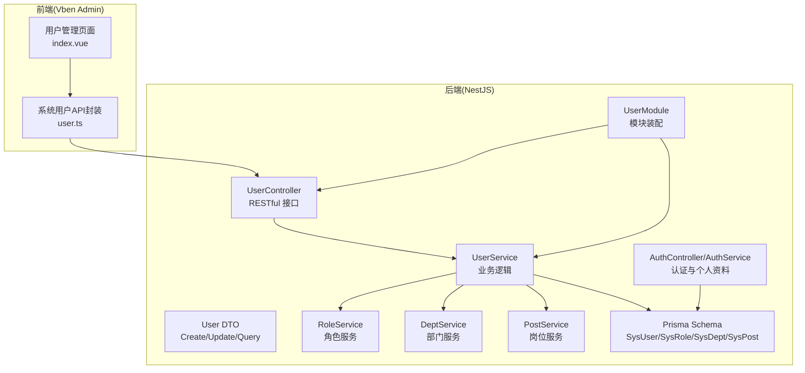
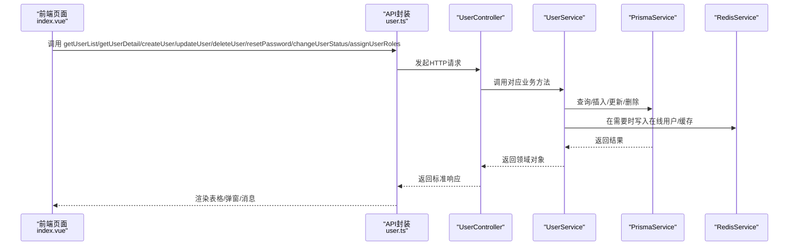
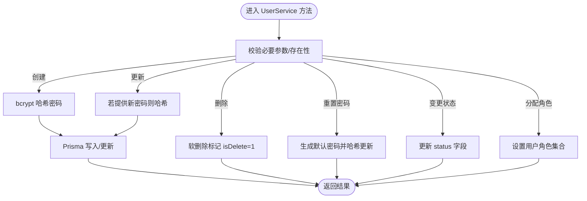
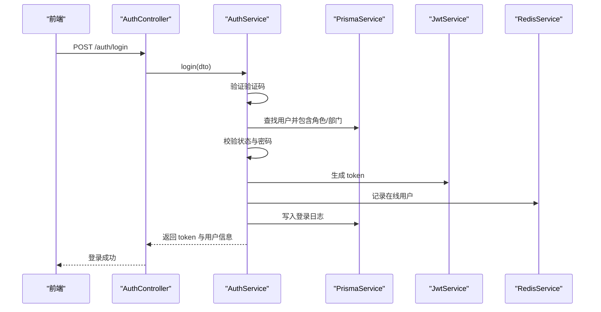
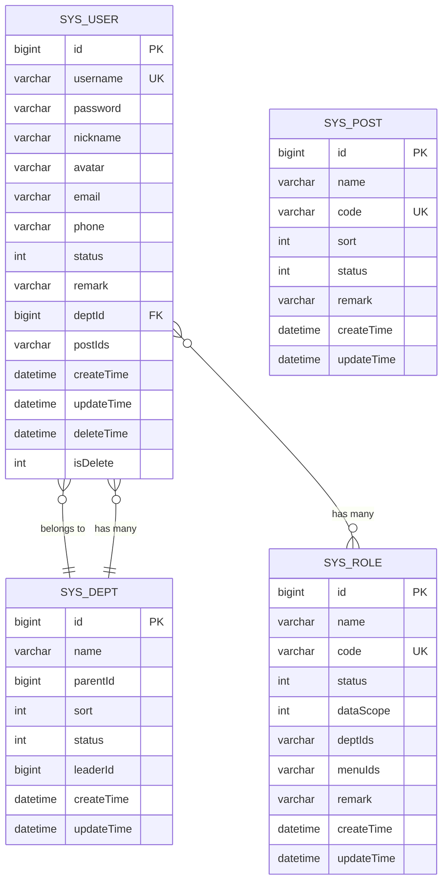
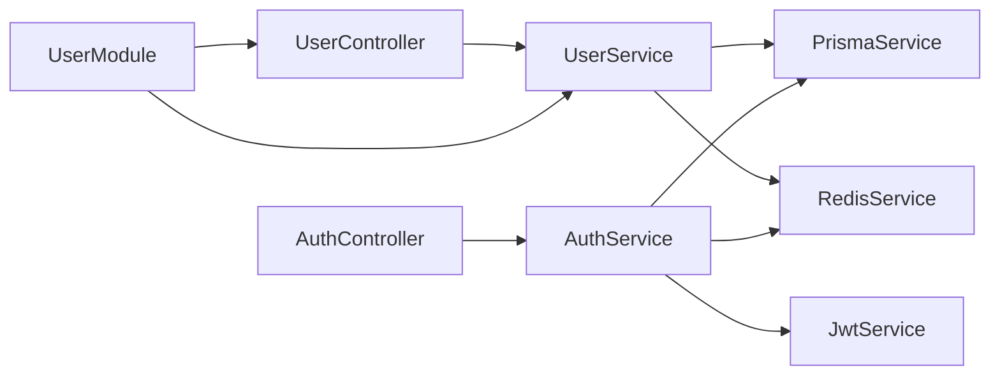

# 用户管理

<cite>
**本文引用的文件**
- [apps/backend/src/modules/system/user/user.controller.ts](file://apps/backend/src/modules/system/user/user.controller.ts)
- [apps/backend/src/modules/system/user/user.service.ts](file://apps/backend/src/modules/system/user/user.service.ts)
- [apps/backend/src/modules/system/user/dto/user.dto.ts](file://apps/backend/src/modules/system/user/dto/user.dto.ts)
- [apps/backend/src/modules/system/user/user.module.ts](file://apps/backend/src/modules/system/user/user.module.ts)
- [apps/backend/src/modules/system/role/role.service.ts](file://apps/backend/src/modules/system/role/role.service.ts)
- [apps/backend/src/modules/system/dept/dept.service.ts](file://apps/backend/src/modules/system/dept/dept.service.ts)
- [apps/backend/src/modules/system/post/post.service.ts](file://apps/backend/src/modules/system/post/post.service.ts)
- [apps/backend/src/auth/auth.controller.ts](file://apps/backend/src/auth/auth.controller.ts)
- [apps/backend/src/auth/auth.service.ts](file://apps/backend/src/auth/auth.service.ts)
- [apps/backend/src/auth/dto/auth.dto.ts](file://apps/backend/src/auth/dto/auth.dto.ts)
- [apps/backend/prisma/schema.prisma](file://apps/backend/prisma/schema.prisma)
- [apps/vben-admin/apps/web-antd/src/views/system/user/index.vue](file://apps/vben-admin/apps/web-antd/src/views/system/user/index.vue)
- [apps/vben-admin/apps/web-antd/src/api/system/user.ts](file://apps/vben-admin/apps/web-antd/src/api/system/user.ts)
</cite>

## 目录
1. [简介](#简介)
2. [项目结构](#项目结构)
3. [核心组件](#核心组件)
4. [架构总览](#架构总览)
5. [详细组件分析](#详细组件分析)
6. [依赖分析](#依赖分析)
7. [性能考虑](#性能考虑)
8. [故障排查指南](#故障排查指南)
9. [结论](#结论)
10. [附录：API 调用示例与错误处理](#附录api-调用示例与错误处理)

## 简介
本文件面向“用户管理”子模块，系统性阐述其 RESTful API 设计、业务逻辑实现、数据验证规则、密码加密策略、用户状态管理与权限分配流程，并覆盖用户注册、登录、个人信息修改、头像上传等关键功能在后端与前端的协同实现。同时，结合 Prisma 数据模型，说明用户与角色、部门、岗位等实体的关系，以及在复杂业务场景下的处理方式。

## 项目结构
用户管理相关代码主要分布在后端 NestJS 应用的 system/user 子模块，配合 auth 认证模块、Prisma 数据模型，以及前端 Vben Admin 的用户管理页面与 API 封装。

图示来源
- [apps/backend/src/modules/system/user/user.controller.ts:1-89](file://apps/backend/src/modules/system/user/user.controller.ts#L1-L89)
- [apps/backend/src/modules/system/user/user.service.ts:1-144](file://apps/backend/src/modules/system/user/user.service.ts#L1-L144)
- [apps/backend/src/modules/system/user/user.module.ts:1-10](file://apps/backend/src/modules/system/user/user.module.ts#L1-L10)
- [apps/backend/src/modules/system/role/role.service.ts:1-80](file://apps/backend/src/modules/system/role/role.service.ts#L1-L80)
- [apps/backend/src/modules/system/dept/dept.service.ts:1-73](file://apps/backend/src/modules/system/dept/dept.service.ts#L1-L73)
- [apps/backend/src/modules/system/post/post.service.ts:1-44](file://apps/backend/src/modules/system/post/post.service.ts#L1-L44)
- [apps/backend/src/auth/auth.controller.ts:1-87](file://apps/backend/src/auth/auth.controller.ts#L1-L87)
- [apps/backend/src/auth/auth.service.ts:1-294](file://apps/backend/src/auth/auth.service.ts#L1-L294)
- [apps/backend/prisma/schema.prisma:1-347](file://apps/backend/prisma/schema.prisma#L1-L347)
- [apps/vben-admin/apps/web-antd/src/views/system/user/index.vue:1-408](file://apps/vben-admin/apps/web-antd/src/views/system/user/index.vue#L1-L408)
- [apps/vben-admin/apps/web-antd/src/api/system/user.ts:1-58](file://apps/vben-admin/apps/web-antd/src/api/system/user.ts#L1-L58)

章节来源
- [apps/backend/src/modules/system/user/user.controller.ts:1-89](file://apps/backend/src/modules/system/user/user.controller.ts#L1-L89)
- [apps/backend/src/modules/system/user/user.service.ts:1-144](file://apps/backend/src/modules/system/user/user.service.ts#L1-L144)
- [apps/backend/src/modules/system/user/user.module.ts:1-10](file://apps/backend/src/modules/system/user/user.module.ts#L1-L10)
- [apps/backend/prisma/schema.prisma:1-347](file://apps/backend/prisma/schema.prisma#L1-L347)
- [apps/vben-admin/apps/web-antd/src/views/system/user/index.vue:1-408](file://apps/vben-admin/apps/web-antd/src/views/system/user/index.vue#L1-L408)
- [apps/vben-admin/apps/web-antd/src/api/system/user.ts:1-58](file://apps/vben-admin/apps/web-antd/src/api/system/user.ts#L1-L58)

## 核心组件
- UserController：提供用户 CRUD、重置密码、变更状态、角色分配等 RESTful 接口，统一鉴权与权限控制。
- UserService：实现用户列表查询、详情获取、创建、更新、软删除、重置密码、状态变更、角色分配等业务逻辑，使用 bcrypt 进行密码哈希。
- User DTO：定义 Create/Update/Query 用户请求体的字段校验规则，确保输入合法性。
- RoleService/DeptService/PostService：为用户管理提供角色、部门、岗位相关能力，支持树形部门结构与岗位集合。
- AuthController/AuthService：提供登录、注册、验证码、退出、个人资料读取与修改、密码修改等认证相关接口。
- Prisma Schema：定义 SysUser、SysRole、SysDept、SysPost 等模型及关系，支撑用户与角色、部门、岗位的多对多/多对一关联。

章节来源
- [apps/backend/src/modules/system/user/user.controller.ts:1-89](file://apps/backend/src/modules/system/user/user.controller.ts#L1-L89)
- [apps/backend/src/modules/system/user/user.service.ts:1-144](file://apps/backend/src/modules/system/user/user.service.ts#L1-L144)
- [apps/backend/src/modules/system/user/dto/user.dto.ts:1-131](file://apps/backend/src/modules/system/user/dto/user.dto.ts#L1-L131)
- [apps/backend/src/modules/system/role/role.service.ts:1-80](file://apps/backend/src/modules/system/role/role.service.ts#L1-L80)
- [apps/backend/src/modules/system/dept/dept.service.ts:1-73](file://apps/backend/src/modules/system/dept/dept.service.ts#L1-L73)
- [apps/backend/src/modules/system/post/post.service.ts:1-44](file://apps/backend/src/modules/system/post/post.service.ts#L1-L44)
- [apps/backend/src/auth/auth.controller.ts:1-87](file://apps/backend/src/auth/auth.controller.ts#L1-L87)
- [apps/backend/src/auth/auth.service.ts:1-294](file://apps/backend/src/auth/auth.service.ts#L1-L294)
- [apps/backend/prisma/schema.prisma:1-347](file://apps/backend/prisma/schema.prisma#L1-L347)

## 架构总览
用户管理采用典型的分层架构：前端通过 API 封装调用后端 UserController；控制器委托 UserService 执行业务；Service 层通过 Prisma 访问数据库；认证与授权由 Auth 模块与 JWT Guard、Permission Guard 共同保障。

图示来源
- [apps/vben-admin/apps/web-antd/src/views/system/user/index.vue:1-408](file://apps/vben-admin/apps/web-antd/src/views/system/user/index.vue#L1-L408)
- [apps/vben-admin/apps/web-antd/src/api/system/user.ts:1-58](file://apps/vben-admin/apps/web-antd/src/api/system/user.ts#L1-L58)
- [apps/backend/src/modules/system/user/user.controller.ts:1-89](file://apps/backend/src/modules/system/user/user.controller.ts#L1-L89)
- [apps/backend/src/modules/system/user/user.service.ts:1-144](file://apps/backend/src/modules/system/user/user.service.ts#L1-L144)

## 详细组件分析

### 用户控制器：UserController
- 路由前缀：/system/user
- 主要接口：
  - GET /list：分页查询用户，支持按用户名、昵称、状态、部门过滤
  - GET /:id：按 ID 获取用户详情
  - POST /：创建用户
  - PUT /：更新用户
  - DELETE /:id：软删除用户
  - PUT /reset-password/:id：重置用户密码
  - PUT /change-status/:id：变更用户状态
  - PUT /assign-roles/:id：为用户分配角色
- 权限控制：所有接口均使用 JwtAuthGuard 与 PermissionGuard，并通过 RequirePermission 注解标注所需权限点，如 system:user:list、system:user:add、system:user:edit、system:user:remove、system:user:resetPwd。

章节来源
- [apps/backend/src/modules/system/user/user.controller.ts:1-89](file://apps/backend/src/modules/system/user/user.controller.ts#L1-L89)

### 用户服务：UserService
- 列表查询：支持多条件过滤与分页，返回用户列表并包含部门与角色信息，同时隐藏密码字段。
- 详情查询：按 ID 查询用户，不存在则抛出异常。
- 创建用户：校验用户名唯一性，使用 bcrypt 对明文密码进行哈希存储。
- 更新用户：校验 ID 存在性，可选更新密码（再次哈希），支持多字段更新。
- 删除用户：执行软删除（标记 isDelete=1 并记录 deleteTime）。
- 重置密码：默认新密码，bcrypt 哈希后更新。
- 变更状态：直接更新 status 字段。
- 分配角色：通过 Prisma 的关系更新，设置用户的角色集合。

图示来源
- [apps/backend/src/modules/system/user/user.service.ts:1-144](file://apps/backend/src/modules/system/user/user.service.ts#L1-L144)

章节来源
- [apps/backend/src/modules/system/user/user.service.ts:1-144](file://apps/backend/src/modules/system/user/user.service.ts#L1-L144)

### 用户 DTO：数据验证规则
- CreateUserDto：用户名、密码必填，昵称/邮箱/电话/备注可选，状态默认 1，deptId 可选，postIds 可选数组。
- UpdateUserDto：id 必填，其余字段均为可选；当提供 password 时会触发重新哈希。
- QueryUserDto：支持 username/nickname/status/deptId 分页查询，page/limit 默认值与最小值约束。

章节来源
- [apps/backend/src/modules/system/user/dto/user.dto.ts:1-131](file://apps/backend/src/modules/system/user/dto/user.dto.ts#L1-L131)

### 认证与个人资料：AuthController/AuthService
- 登录：验证码校验、用户状态检查、密码比对、签发 JWT、记录登录日志与在线用户。
- 注册：用户名唯一性校验、密码哈希、创建用户。
- 个人资料：获取当前用户信息、获取/更新个人资料（昵称、邮箱、电话、头像、备注）、修改密码。
- 退出：移除在线用户缓存。

图示来源
- [apps/backend/src/auth/auth.controller.ts:1-87](file://apps/backend/src/auth/auth.controller.ts#L1-L87)
- [apps/backend/src/auth/auth.service.ts:1-294](file://apps/backend/src/auth/auth.service.ts#L1-L294)

章节来源
- [apps/backend/src/auth/auth.controller.ts:1-87](file://apps/backend/src/auth/auth.controller.ts#L1-L87)
- [apps/backend/src/auth/auth.service.ts:1-294](file://apps/backend/src/auth/auth.service.ts#L1-L294)
- [apps/backend/src/auth/dto/auth.dto.ts:1-91](file://apps/backend/src/auth/dto/auth.dto.ts#L1-L91)

### 数据模型关系：Prisma Schema
- SysUser：用户主表，包含用户名、密码、昵称、头像、邮箱、电话、状态、备注、部门外键、岗位集合（字符串化数组）、软删除字段与时间戳。
- SysRole：角色表，包含名称、编码、状态、数据范围、菜单与部门授权集合（字符串化数组）。
- SysDept：部门表，树形结构（parentId），包含排序、状态、负责人等。
- SysPost：岗位表，包含名称、编码、排序、状态、备注。
- 关系：
  - SysUser 与 SysDept：多对一（deptId 外键）
  - SysUser 与 SysRole：多对多（通过中间关系）
  - SysDept 自引用：父子关系
  - SysPost 与 SysUser：通过字符串化数组的 postIds 关联

图示来源
- [apps/backend/prisma/schema.prisma:1-347](file://apps/backend/prisma/schema.prisma#L1-L347)

章节来源
- [apps/backend/prisma/schema.prisma:1-347](file://apps/backend/prisma/schema.prisma#L1-L347)

### 前端集成：用户管理页面与 API 封装
- 页面功能：搜索（用户名/昵称/状态/部门）、分页、新增/编辑/删除、重置密码、切换状态、分配角色。
- API 封装：getUserList/getUserDetail/createUser/updateUser/deleteUser/resetPassword/changeUserStatus/assignUserRoles。
- 交互流程：页面加载时拉取用户列表与部门/角色数据；操作成功后刷新表格或提示消息。

章节来源
- [apps/vben-admin/apps/web-antd/src/views/system/user/index.vue:1-408](file://apps/vben-admin/apps/web-antd/src/views/system/user/index.vue#L1-L408)
- [apps/vben-admin/apps/web-antd/src/api/system/user.ts:1-58](file://apps/vben-admin/apps/web-antd/src/api/system/user.ts#L1-L58)

## 依赖分析
- 控制器依赖服务：UserController 仅依赖 UserService。
- 服务依赖基础设施：UserService 依赖 PrismaService 与 RedisService；Auth 服务同样依赖 Prisma/JWT/Redis。
- 模块装配：UserModule 导出 UserService，供其他模块复用。
- 外部依赖：bcrypt 用于密码哈希；svg-captcha 与 Redis 用于验证码；Swagger 用于接口文档。

图示来源
- [apps/backend/src/modules/system/user/user.controller.ts:1-89](file://apps/backend/src/modules/system/user/user.controller.ts#L1-L89)
- [apps/backend/src/modules/system/user/user.service.ts:1-144](file://apps/backend/src/modules/system/user/user.service.ts#L1-L144)
- [apps/backend/src/modules/system/user/user.module.ts:1-10](file://apps/backend/src/modules/system/user/user.module.ts#L1-L10)
- [apps/backend/src/auth/auth.controller.ts:1-87](file://apps/backend/src/auth/auth.controller.ts#L1-L87)
- [apps/backend/src/auth/auth.service.ts:1-294](file://apps/backend/src/auth/auth.service.ts#L1-L294)

章节来源
- [apps/backend/src/modules/system/user/user.controller.ts:1-89](file://apps/backend/src/modules/system/user/user.controller.ts#L1-L89)
- [apps/backend/src/modules/system/user/user.service.ts:1-144](file://apps/backend/src/modules/system/user/user.service.ts#L1-L144)
- [apps/backend/src/modules/system/user/user.module.ts:1-10](file://apps/backend/src/modules/system/user/user.module.ts#L1-L10)
- [apps/backend/src/auth/auth.controller.ts:1-87](file://apps/backend/src/auth/auth.controller.ts#L1-L87)
- [apps/backend/src/auth/auth.service.ts:1-294](file://apps/backend/src/auth/auth.service.ts#L1-L294)

## 性能考虑
- 分页查询：列表接口使用 take/skip 实现分页，避免一次性返回大量数据。
- 条件过滤：根据传入条件动态构建 where 条件，减少不必要的全表扫描。
- 关联查询：在需要时包含 dept 与 roles，避免 N+1 查询问题；注意在高并发下对 include 的使用。
- 缓存策略：登录态与在线用户通过 Redis 维护，降低数据库压力。
- 密码哈希成本：bcrypt 的 saltRounds 为 10，平衡安全与性能；可根据服务器能力调整。

## 故障排查指南
- 用户名重复：创建用户时若用户名已存在，将抛出错误；请检查唯一约束与输入。
- 用户不存在：查询/更新/删除/重置密码/变更状态等操作若找不到用户，将抛出未找到异常。
- 密码错误：登录时密码不匹配或账户被禁用会触发未授权异常；请核对用户名、密码与状态。
- 验证码失效：验证码过期或不匹配会导致登录失败；请重新获取并校验。
- 权限不足：访问受控接口但缺少相应权限点会触发鉴权失败；请确认角色与菜单授权。

章节来源
- [apps/backend/src/modules/system/user/user.service.ts:1-144](file://apps/backend/src/modules/system/user/user.service.ts#L1-L144)
- [apps/backend/src/auth/auth.service.ts:1-294](file://apps/backend/src/auth/auth.service.ts#L1-L294)

## 结论
用户管理子模块以清晰的分层设计实现了完整的用户生命周期管理：从 RESTful 接口到业务逻辑，再到数据模型与前端页面的完整闭环。通过 bcrypt 密码哈希、JWT 与权限守卫、Prisma 关系映射与 Redis 缓存，系统在安全性、可维护性与性能之间取得良好平衡。建议在生产环境中进一步完善日志审计、速率限制与更细粒度的权限控制。

## 附录：API 调用示例与错误处理

- 用户列表
  - 方法：GET
  - 路径：/system/user/list
  - 参数：username、nickname、status、deptId、page、limit
  - 成功响应：包含 total 与 items 的分页结果
  - 错误：鉴权失败、权限不足、查询异常

- 获取用户详情
  - 方法：GET
  - 路径：/system/user/:id
  - 成功响应：用户详情（不含密码），包含部门与角色信息
  - 错误：用户不存在、鉴权/权限问题

- 创建用户
  - 方法：POST
  - 路径：/system/user
  - 请求体：CreateUserDto（用户名、密码必填；其他可选）
  - 成功响应：返回创建的用户标识
  - 错误：用户名重复、参数校验失败、内部异常

- 更新用户
  - 方法：PUT
  - 路径：/system/user
  - 请求体：UpdateUserDto（id 必填；password 可选，提供则重新哈希）
  - 成功响应：返回更新后的用户标识
  - 错误：用户不存在、参数校验失败、内部异常

- 删除用户
  - 方法：DELETE
  - 路径：/system/user/:id
  - 成功响应：{ success: true }
  - 错误：用户不存在、内部异常

- 重置密码
  - 方法：PUT
  - 路径：/system/user/reset-password/:id
  - 成功响应：返回新密码明文（仅首次返回，后续不应暴露）
  - 错误：用户不存在、内部异常

- 变更状态
  - 方法：PUT
  - 路径：/system/user/change-status/:id
  - 请求体：{ status: 0|1 }
  - 成功响应：{ success: true }
  - 错误：用户不存在、内部异常

- 分配角色
  - 方法：PUT
  - 路径：/system/user/assign-roles/:id
  - 请求体：{ roleIds: number[] }
  - 成功响应：{ success: true }
  - 错误：用户不存在、内部异常

- 登录
  - 方法：POST
  - 路径：/auth/login
  - 请求体：LoginDto（用户名、密码、验证码键与文本）
  - 成功响应：{ token, userInfo }
  - 错误：验证码无效、用户名/密码错误、账户禁用、内部异常

- 注册
  - 方法：POST
  - 路径：/auth/register
  - 请求体：RegisterDto（用户名、密码、昵称可选）
  - 成功响应：{ id, username }
  - 错误：用户名重复、参数校验失败、内部异常

- 获取验证码
  - 方法：GET
  - 路径：/auth/captcha
  - 成功响应：{ key, img }
  - 错误：验证码生成失败

- 验证验证码
  - 方法：POST
  - 路径：/auth/captcha/validate
  - 请求体：CaptchaDto（key、text）
  - 成功响应：{ valid: boolean }
  - 错误：内部异常

- 获取当前用户信息
  - 方法：GET
  - 路径：/auth/user/info
  - 成功响应：用户基础信息、角色、权限、菜单树
  - 错误：用户不存在、未授权

- 获取个人资料
  - 方法：GET
  - 路径：/auth/profile
  - 成功响应：包含部门、角色、岗位等信息
  - 错误：用户不存在、未授权

- 更新个人资料
  - 方法：PUT
  - 路径：/auth/profile
  - 请求体：UpdateProfileDto（昵称、邮箱、电话、头像、备注可选）
  - 成功响应：更新后的用户信息
  - 错误：用户不存在、未授权、参数校验失败

- 修改密码
  - 方法：PUT
  - 路径：/auth/profile/password
  - 请求体：UpdatePasswordDto（旧密码、新密码）
  - 成功响应：操作成功消息
  - 错误：用户不存在、旧密码错误、参数校验失败、内部异常

章节来源
- [apps/backend/src/modules/system/user/user.controller.ts:1-89](file://apps/backend/src/modules/system/user/user.controller.ts#L1-L89)
- [apps/backend/src/auth/auth.controller.ts:1-87](file://apps/backend/src/auth/auth.controller.ts#L1-L87)
- [apps/vben-admin/apps/web-antd/src/api/system/user.ts:1-58](file://apps/vben-admin/apps/web-antd/src/api/system/user.ts#L1-L58)