# 系统管理模块

<cite>
**本文档引用的文件**
- [apps/backend/src/modules/system/system.module.ts](file://apps/backend/src/modules/system/system.module.ts)
- [apps/backend/src/modules/system/user/user.controller.ts](file://apps/backend/src/modules/system/user/user.controller.ts)
- [apps/backend/src/modules/system/user/user.service.ts](file://apps/backend/src/modules/system/user/user.service.ts)
- [apps/backend/src/modules/system/user/dto/user.dto.ts](file://apps/backend/src/modules/system/user/dto/user.dto.ts)
- [apps/backend/src/modules/system/role/role.controller.ts](file://apps/backend/src/modules/system/role/role.controller.ts)
- [apps/backend/src/modules/system/role/role.service.ts](file://apps/backend/src/modules/system/role/role.service.ts)
- [apps/backend/src/modules/system/dept/dept.controller.ts](file://apps/backend/src/modules/system/dept/dept.controller.ts)
- [apps/backend/src/modules/system/dept/dept.service.ts](file://apps/backend/src/modules/system/dept/dept.service.ts)
- [apps/backend/src/modules/system/menu/menu.controller.ts](file://apps/backend/src/modules/system/menu/menu.controller.ts)
- [apps/backend/src/modules/system/menu/menu.service.ts](file://apps/backend/src/modules/system/menu/menu.service.ts)
- [apps/backend/src/modules/system/dict/dict.controller.ts](file://apps/backend/src/modules/system/dict/dict.controller.ts)
- [apps/backend/src/modules/system/dict/dict.service.ts](file://apps/backend/src/modules/system/dict/dict.service.ts)
- [apps/backend/src/modules/system/config/config.controller.ts](file://apps/backend/src/modules/system/config/config.controller.ts)
- [apps/backend/src/modules/system/post/post.controller.ts](file://apps/backend/src/modules/system/post/post.controller.ts)
- [apps/backend/src/modules/system/notice/notice.controller.ts](file://apps/backend/src/modules/system/notice/notice.controller.ts)
</cite>

## 目录
1. [简介](#简介)
2. [项目结构](#项目结构)
3. [核心组件](#核心组件)
4. [架构总览](#架构总览)
5. [详细组件分析](#详细组件分析)
6. [依赖关系分析](#依赖关系分析)
7. [性能考虑](#性能考虑)
8. [故障排除指南](#故障排除指南)
9. [结论](#结论)
10. [附录](#附录)

## 简介
本文件为系统管理模块的综合技术文档，围绕业务数据管理核心 SystemModule 展开，系统性阐述用户管理、角色管理、部门管理、菜单管理、字典管理、参数配置、岗位管理和通知公告等子模块的设计理念、职责边界、数据模型关系与业务逻辑实现。文档同时覆盖 RESTful API 设计原则、CRUD 操作实现、数据验证规则与业务约束，并提供模块间依赖关系图、控制器设计模式与服务层实现细节，以及 API 调用示例与前端集成指南。

## 项目结构
系统管理模块采用按功能域划分的分层组织方式：每个子模块独立拥有控制器（Controller）、服务（Service）与 DTO（数据传输对象），并通过系统模块统一聚合导出。该结构清晰地分离了表现层、业务层与数据访问层，便于维护与扩展。

```mermaid
graph TB
SM["SystemModule<br/>系统模块入口"] --> UM["UserModule<br/>用户模块"]
SM --> RM["RoleModule<br/>角色模块"]
SM --> DM["DeptModule<br/>部门模块"]
SM --> MUM["MenuModule<br/>菜单模块"]
SM --> PM["PostModule<br/>岗位模块"]
SM --> DICTM["DictModule<br/>字典模块"]
SM --> CM["ConfigModule<br/>参数配置模块"]
SM --> NOM["NoticeModule<br/>通知公告模块"]
UM --> UC["UserController"]
UM --> US["UserService"]
UM --> UDTO["User DTOs"]
RM --> RC["RoleController"]
RM --> RS["RoleService"]
RM --> RDTO["Role DTOs"]
DM --> DC["DeptController"]
DM --> DS["DeptService"]
DM --> DDTO["Dept DTOs"]
MUM --> MC["MenuController"]
MUM --> MS["MenuService"]
MUM --> MDTO["Menu DTOs"]
PM --> PC["PostController"]
PM --> PS["PostService"]
PM --> PDT["Post DTOs"]
DICTM --> DCt["DictController"]
DICTM --> DSct["DictService"]
DICTM --> DDt["Dict DTOs"]
CM --> CC["ConfigController"]
CM --> CS["ConfigService"]
NOM --> NC["NoticeController"]
NOM --> NS["NoticeService"]
```

图表来源
- [apps/backend/src/modules/system/system.module.ts:11-22](file://apps/backend/src/modules/system/system.module.ts#L11-L22)

章节来源
- [apps/backend/src/modules/system/system.module.ts:1-23](file://apps/backend/src/modules/system/system.module.ts#L1-L23)

## 核心组件
- 系统模块聚合器：SystemModule 将用户、角色、部门、菜单、岗位、字典、参数配置与通知公告等子模块统一注册，形成系统管理的统一入口。
- 控制器层：各子模块控制器负责接收请求、参数校验、权限控制与调用服务层，返回标准化响应。
- 服务层：封装具体业务逻辑，包括数据查询、更新、删除、树形构建与路由生成等。
- DTO 层：使用类验证器对输入参数进行约束与转换，确保接口契约清晰与安全。
- 数据访问层：通过 PrismaService 进行数据库读写；部分模块结合 RedisService 进行缓存处理（如用户密码重置场景）。

章节来源
- [apps/backend/src/modules/system/system.module.ts:11-22](file://apps/backend/src/modules/system/system.module.ts#L11-L22)
- [apps/backend/src/modules/system/user/user.controller.ts:20-24](file://apps/backend/src/modules/system/user/user.controller.ts#L20-L24)
- [apps/backend/src/modules/system/user/user.service.ts:11-16](file://apps/backend/src/modules/system/user/user.service.ts#L11-L16)
- [apps/backend/src/modules/system/user/dto/user.dto.ts:5-47](file://apps/backend/src/modules/system/user/dto/user.dto.ts#L5-L47)

## 架构总览
系统管理模块遵循典型的三层架构：控制器负责请求处理与权限校验，服务层承载业务规则，数据访问层负责持久化。模块间通过依赖注入解耦，控制器仅依赖服务接口，服务依赖 Prisma/Redis 等基础设施。

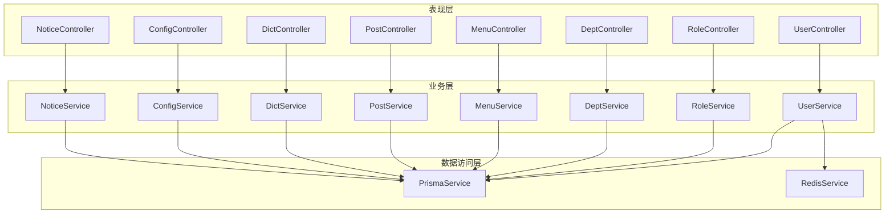

图表来源
- [apps/backend/src/modules/system/user/user.controller.ts:14-24](file://apps/backend/src/modules/system/user/user.controller.ts#L14-L24)
- [apps/backend/src/modules/system/user/user.service.ts:13-16](file://apps/backend/src/modules/system/user/user.service.ts#L13-L16)
- [apps/backend/src/modules/system/user/user.service.ts:6-8](file://apps/backend/src/modules/system/user/user.service.ts#L6-L8)

## 详细组件分析

### 用户管理（User）
- 职责边界：负责用户的增删改查、状态变更、密码重置、角色分配与列表查询。
- 数据模型关系：用户关联部门与角色，查询时包含部门与角色信息并屏蔽敏感字段。
- 业务逻辑实现：
  - 列表查询支持用户名、昵称、状态、部门过滤与分页。
  - 创建用户前检查用户名唯一性，密码使用哈希存储。
  - 更新用户可选更新密码，空值不覆盖。
  - 删除采用软删除标记。
  - 支持批量分配角色与重置密码。
- DTO 验证规则：用户名、昵称、邮箱、电话等字段的字符串长度与可选性约束；分页参数最小值约束。

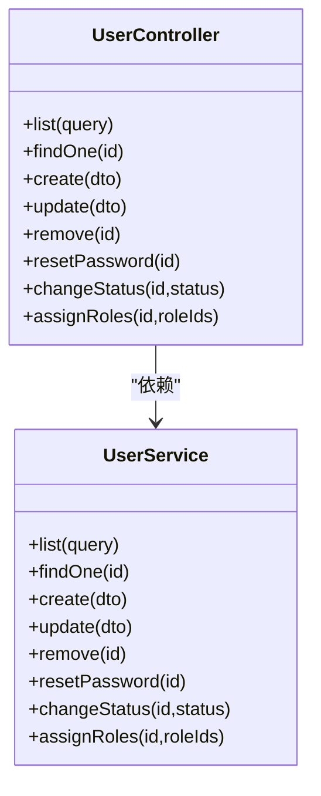

图表来源
- [apps/backend/src/modules/system/user/user.controller.ts:20-88](file://apps/backend/src/modules/system/user/user.controller.ts#L20-L88)
- [apps/backend/src/modules/system/user/user.service.ts:11-144](file://apps/backend/src/modules/system/user/user.service.ts#L11-L144)

章节来源
- [apps/backend/src/modules/system/user/user.controller.ts:26-87](file://apps/backend/src/modules/system/user/user.controller.ts#L26-L87)
- [apps/backend/src/modules/system/user/user.service.ts:18-143](file://apps/backend/src/modules/system/user/user.service.ts#L18-L143)
- [apps/backend/src/modules/system/user/dto/user.dto.ts:5-131](file://apps/backend/src/modules/system/user/dto/user.dto.ts#L5-L131)

### 角色管理（Role）
- 职责边界：角色的增删改查、状态变更、权限分配与菜单/部门授权范围设置。
- 数据模型关系：角色与菜单、部门存在多对多授权关系，授权以 JSON 字符串存储。
- 业务逻辑实现：
  - 列表查询支持名称、编码、状态过滤。
  - 编码唯一性约束。
  - 权限分配支持菜单与部门集合授权。
  - 获取角色授权的菜单与部门 ID 集合。
- DTO 验证规则：名称、编码、状态、数据范围等字段的类型与可选性约束。

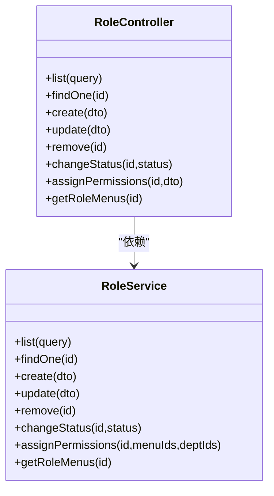

图表来源
- [apps/backend/src/modules/system/role/role.controller.ts:11-79](file://apps/backend/src/modules/system/role/role.controller.ts#L11-L79)
- [apps/backend/src/modules/system/role/role.service.ts:8-79](file://apps/backend/src/modules/system/role/role.service.ts#L8-L79)

章节来源
- [apps/backend/src/modules/system/role/role.controller.ts:17-71](file://apps/backend/src/modules/system/role/role.controller.ts#L17-L71)
- [apps/backend/src/modules/system/role/role.service.ts:11-79](file://apps/backend/src/modules/system/role/role.service.ts#L11-L79)

### 部门管理（Dept）
- 职责边界：部门的增删改查、树形结构构建与父子关系维护。
- 数据模型关系：部门支持层级结构，通过 parentId 关联父节点。
- 业务逻辑实现：
  - 列表与树形结构均按排序升序与 ID 升序排列。
  - 删除前检查是否存在子部门，避免级联删除。
  - 树形构建算法基于父子关系递归生成。
- DTO 验证规则：名称、状态、排序、父 ID、负责人等字段的类型与可选性约束。

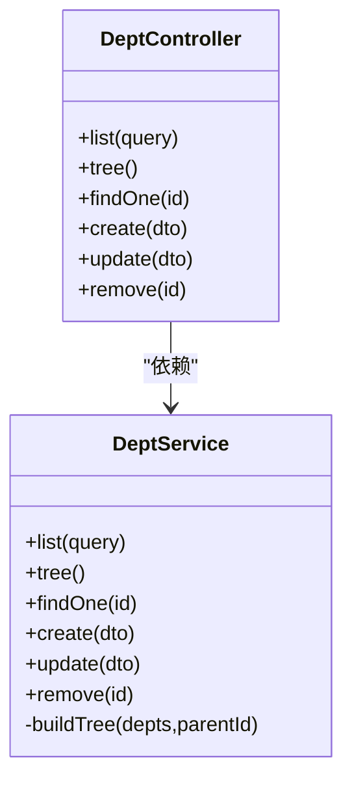

图表来源
- [apps/backend/src/modules/system/dept/dept.controller.ts:11-59](file://apps/backend/src/modules/system/dept/dept.controller.ts#L11-L59)
- [apps/backend/src/modules/system/dept/dept.service.ts:5-72](file://apps/backend/src/modules/system/dept/dept.service.ts#L5-L72)

章节来源
- [apps/backend/src/modules/system/dept/dept.controller.ts:17-58](file://apps/backend/src/modules/system/dept/dept.controller.ts#L17-L58)
- [apps/backend/src/modules/system/dept/dept.service.ts:9-71](file://apps/backend/src/modules/system/dept/dept.service.ts#L9-L71)

### 菜单管理（Menu）
- 职责边界：菜单的增删改查、树形结构构建与用户路由生成。
- 数据模型关系：菜单支持层级结构与类型区分（目录/菜单/按钮），并支持权限标识。
- 业务逻辑实现：
  - 列表与树形结构按排序升序与 ID 升序排列。
  - 路由生成根据用户角色聚合菜单 ID 并筛选有效菜单。
  - 删除前检查是否存在子菜单。
  - 树形构建算法基于父子关系递归生成。
- DTO 验证规则：名称、类型、路径、组件、图标、权限标识、状态、排序等字段的类型与可选性约束。

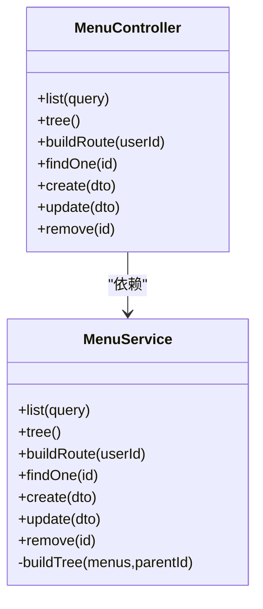

图表来源
- [apps/backend/src/modules/system/menu/menu.controller.ts:11-66](file://apps/backend/src/modules/system/menu/menu.controller.ts#L11-L66)
- [apps/backend/src/modules/system/menu/menu.service.ts:6-94](file://apps/backend/src/modules/system/menu/menu.service.ts#L6-L94)

章节来源
- [apps/backend/src/modules/system/menu/menu.controller.ts:17-65](file://apps/backend/src/modules/system/menu/menu.controller.ts#L17-L65)
- [apps/backend/src/modules/system/menu/menu.service.ts:9-93](file://apps/backend/src/modules/system/menu/menu.service.ts#L9-L93)

### 字典管理（Dict）
- 职责边界：字典类型与字典数据的增删改查，支持类型与数据的联动管理。
- 数据模型关系：字典类型包含多个字典数据项，删除类型前需清空数据。
- 业务逻辑实现：
  - 类型列表支持名称、编码、状态过滤。
  - 数据列表按排序升序排列。
  - 删除类型前检查是否存在关联数据。
- DTO 验证规则：名称、编码、标签、值、排序、状态、备注等字段的类型与可选性约束。

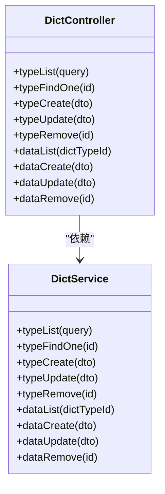

图表来源
- [apps/backend/src/modules/system/dict/dict.controller.ts:8-80](file://apps/backend/src/modules/system/dict/dict.controller.ts#L8-L80)
- [apps/backend/src/modules/system/dict/dict.service.ts:6-59](file://apps/backend/src/modules/system/dict/dict.service.ts#L6-L59)

章节来源
- [apps/backend/src/modules/system/dict/dict.controller.ts:14-79](file://apps/backend/src/modules/system/dict/dict.controller.ts#L14-L79)
- [apps/backend/src/modules/system/dict/dict.service.ts:9-58](file://apps/backend/src/modules/system/dict/dict.service.ts#L9-L58)

### 参数配置（Config）
- 职责边界：系统参数的增删改查与缓存刷新。
- 业务逻辑实现：
  - 支持按键查询与列表查询。
  - 提供缓存刷新接口用于热更新配置。
- DTO 验证规则：名称、键、值、类型、状态、备注等字段的类型与可选性约束。

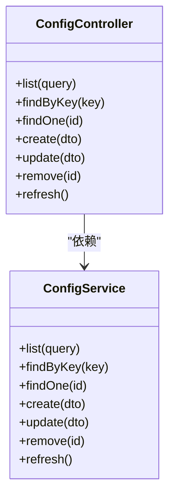

图表来源
- [apps/backend/src/modules/system/config/config.controller.ts:8-62](file://apps/backend/src/modules/system/config/config.controller.ts#L8-L62)

章节来源
- [apps/backend/src/modules/system/config/config.controller.ts:14-61](file://apps/backend/src/modules/system/config/config.controller.ts#L14-L61)

### 岗位管理（Post）
- 职责边界：岗位的增删改查与列表查询。
- 业务逻辑实现：
  - 列表查询支持名称、编码、状态过滤。
  - 删除前检查是否被用户引用（未在代码中显式实现，建议在服务层增加引用检查）。
- DTO 验证规则：名称、编码、状态、排序、备注等字段的类型与可选性约束。

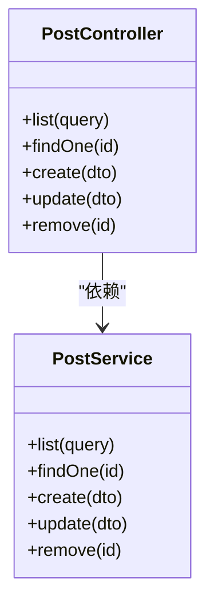

图表来源
- [apps/backend/src/modules/system/post/post.controller.ts:8-49](file://apps/backend/src/modules/system/post/post.controller.ts#L8-L49)

章节来源
- [apps/backend/src/modules/system/post/post.controller.ts:14-48](file://apps/backend/src/modules/system/post/post.controller.ts#L14-L48)

### 通知公告（Notice）
- 职责边界：通知公告的增删改查与列表查询。
- 业务逻辑实现：
  - 支持标题、类型、状态过滤与分页。
- DTO 验证规则：标题、类型、内容、状态、发布者等字段的类型与可选性约束。

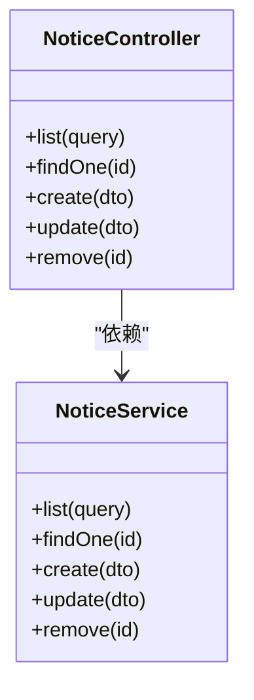

图表来源
- [apps/backend/src/modules/system/notice/notice.controller.ts:8-49](file://apps/backend/src/modules/system/notice/notice.controller.ts#L8-L49)

章节来源
- [apps/backend/src/modules/system/notice/notice.controller.ts:14-48](file://apps/backend/src/modules/system/notice/notice.controller.ts#L14-L48)

## 依赖关系分析
- 模块聚合：SystemModule 统一导入所有子模块，形成集中式装配。
- 控制器到服务：各控制器通过依赖注入获取对应服务实例，保持松耦合。
- 服务到数据访问：服务层统一通过 PrismaService 访问数据库，保证数据一致性与事务控制。
- 权限控制：所有控制器均应用 JWT 与权限守卫，确保接口访问安全。
- 树形构建：部门与菜单模块均实现了通用的树形结构构建算法，复用度高。

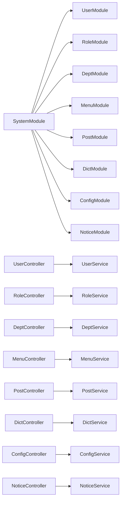

图表来源
- [apps/backend/src/modules/system/system.module.ts:11-22](file://apps/backend/src/modules/system/system.module.ts#L11-L22)

章节来源
- [apps/backend/src/modules/system/system.module.ts:11-22](file://apps/backend/src/modules/system/system.module.ts#L11-L22)

## 性能考虑
- 分页查询：用户、角色、字典类型与参数配置等列表接口均支持分页，建议前端传入合理的页码与条数，避免一次性加载过多数据。
- 批量查询：菜单路由构建会根据用户角色聚合菜单 ID 后一次性查询，减少多次往返。
- 树形构建：部门与菜单的树形结构构建为 O(n) 递归算法，建议后端限制最大层级与节点数量，防止超大组织或菜单树导致性能问题。
- 缓存策略：用户密码重置等场景使用 RedisService，建议结合业务热点数据引入更多缓存以降低数据库压力（当前模块已体现缓存使用思路）。

## 故障排除指南
- 用户名重复：创建用户时若用户名已存在，将抛出错误；请先校验用户名唯一性。
- 用户不存在：查询或更新用户时若用户不存在，将抛出错误；请确认用户 ID 正确。
- 角色编码重复：创建角色时若编码已存在，将抛出错误；请修改角色编码。
- 部门存在子部门：删除部门前需先删除子部门，否则会抛出错误；请先清理子部门。
- 菜单存在子菜单：删除菜单前需先删除子菜单，否则会抛出错误；请先清理子菜单。
- 字典类型存在数据：删除字典类型前需先删除其下所有数据，否则会抛出错误；请先清理数据。
- 权限不足：所有接口均需要相应权限标识，如 system:user:list、system:role:add 等；请确认登录用户具备所需权限。

章节来源
- [apps/backend/src/modules/system/user/user.service.ts:57-61](file://apps/backend/src/modules/system/user/user.service.ts#L57-L61)
- [apps/backend/src/modules/system/user/user.service.ts:53-54](file://apps/backend/src/modules/system/user/user.service.ts#L53-L54)
- [apps/backend/src/modules/system/role/role.service.ts:37-39](file://apps/backend/src/modules/system/role/role.service.ts#L37-L39)
- [apps/backend/src/modules/system/dept/dept.service.ts:67-70](file://apps/backend/src/modules/system/dept/dept.service.ts#L67-L70)
- [apps/backend/src/modules/system/menu/menu.service.ts:89-92](file://apps/backend/src/modules/system/menu/menu.service.ts#L89-L92)
- [apps/backend/src/modules/system/dict/dict.service.ts:35-38](file://apps/backend/src/modules/system/dict/dict.service.ts#L35-L38)

## 结论
系统管理模块通过清晰的职责划分与严格的权限控制，提供了完善的业务数据管理能力。模块间低耦合、高内聚的设计使得扩展与维护更加便捷。建议在后续迭代中进一步完善引用检查（如岗位与用户关联）、引入更细粒度的缓存策略与审计日志，以提升系统的健壮性与可观测性。

## 附录

### RESTful API 设计原则
- 资源命名：使用名词短语，复数形式表示集合，如 /system/user、/system/role。
- 动作映射：GET/POST/PUT/DELETE 对应查询/创建/更新/删除。
- 路径参数：使用 :id 表示资源主键，如 /system/user/:id。
- 查询参数：支持分页与过滤，如 ?page=1&limit=10&username=admin。
- 权限控制：每个接口均标注所需权限标识，如 system:user:list。

### CRUD 操作实现要点
- 列表查询：支持多字段过滤与分页，返回 total 与 items。
- 单条查询：按主键查询，不存在时抛出异常。
- 创建：校验必填字段与唯一性约束，成功返回关键字段。
- 更新：支持部分字段更新，必要时进行额外校验。
- 删除：采用软删除或硬删除策略，删除前进行依赖检查。

### 数据验证规则与业务约束
- 字段类型：字符串、整数、布尔等类型严格约束。
- 可选性：非必填字段使用可选注解，避免空值污染。
- 最小值：分页参数最小值约束，防止非法请求。
- 唯一性：用户名、角色编码、字典类型编码等唯一性约束。
- 引用完整性：删除前检查是否存在子节点或关联数据。

### 典型 API 调用示例（路径参考）
- 获取用户列表
  - 方法与路径：GET /system/user/list
  - 请求参数：分页与过滤参数
  - 返回：分页结果
  - 参考路径：[apps/backend/src/modules/system/user/user.controller.ts:26-31](file://apps/backend/src/modules/system/user/user.controller.ts#L26-L31)
- 创建用户
  - 方法与路径：POST /system/user
  - 请求体：CreateUserDto
  - 返回：创建结果
  - 参考路径：[apps/backend/src/modules/system/user/user.controller.ts:40-45](file://apps/backend/src/modules/system/user/user.controller.ts#L40-L45)
- 更新用户
  - 方法与路径：PUT /system/user
  - 请求体：UpdateUserDto
  - 返回：更新结果
  - 参考路径：[apps/backend/src/modules/system/user/user.controller.ts:47-52](file://apps/backend/src/modules/system/user/user.controller.ts#L47-L52)
- 删除用户
  - 方法与路径：DELETE /system/user/:id
  - 返回：删除成功标志
  - 参考路径：[apps/backend/src/modules/system/user/user.controller.ts:54-60](file://apps/backend/src/modules/system/user/user.controller.ts#L54-L60)
- 重置密码
  - 方法与路径：PUT /system/user/reset-password/:id
  - 返回：新密码明文（仅首次）
  - 参考路径：[apps/backend/src/modules/system/user/user.controller.ts:62-67](file://apps/backend/src/modules/system/user/user.controller.ts#L62-L67)
- 分配角色
  - 方法与路径：PUT /system/user/assign-roles/:id
  - 请求体：roleIds 数组
  - 返回：分配结果
  - 参考路径：[apps/backend/src/modules/system/user/user.controller.ts:79-87](file://apps/backend/src/modules/system/user/user.controller.ts#L79-L87)

- 获取角色列表
  - 方法与路径：GET /system/role/list
  - 返回：分页结果
  - 参考路径：[apps/backend/src/modules/system/role/role.controller.ts:17-22](file://apps/backend/src/modules/system/role/role.controller.ts#L17-L22)
- 创建角色
  - 方法与路径：POST /system/role
  - 请求体：CreateRoleDto
  - 返回：创建结果
  - 参考路径：[apps/backend/src/modules/system/role/role.controller.ts:24-29](file://apps/backend/src/modules/system/role/role.controller.ts#L24-L29)
- 分配权限
  - 方法与路径：PUT /system/role/assign-permissions/:id
  - 请求体：menuIds 与 deptIds
  - 返回：分配结果
  - 参考路径：[apps/backend/src/modules/system/role/role.controller.ts:56-64](file://apps/backend/src/modules/system/role/role.controller.ts#L56-L64)

- 获取部门树
  - 方法与路径：GET /system/dept/tree
  - 返回：树形结构
  - 参考路径：[apps/backend/src/modules/system/dept/dept.controller.ts:24-29](file://apps/backend/src/modules/system/dept/dept.controller.ts#L24-L29)
- 创建部门
  - 方法与路径：POST /system/dept
  - 请求体：CreateDeptDto
  - 返回：创建结果
  - 参考路径：[apps/backend/src/modules/system/dept/dept.controller.ts:38-43](file://apps/backend/src/modules/system/dept/dept.controller.ts#L38-L43)

- 获取菜单树
  - 方法与路径：GET /system/menu/tree
  - 返回：树形结构
  - 参考路径：[apps/backend/src/modules/system/menu/menu.controller.ts:24-29](file://apps/backend/src/modules/system/menu/menu.controller.ts#L24-L29)
- 构建用户路由
  - 方法与路径：GET /system/menu/build-route?userId=1
  - 返回：用户可用菜单树
  - 参考路径：[apps/backend/src/modules/system/menu/menu.controller.ts:31-36](file://apps/backend/src/modules/system/menu/menu.controller.ts#L31-L36)

- 获取字典类型列表
  - 方法与路径：GET /system/dict/type/list
  - 返回：类型列表
  - 参考路径：[apps/backend/src/modules/system/dict/dict.controller.ts:14-20](file://apps/backend/src/modules/system/dict/dict.controller.ts#L14-L20)
- 创建字典数据
  - 方法与路径：POST /system/dict/data
  - 请求体：CreateDictDataDto
  - 返回：创建结果
  - 参考路径：[apps/backend/src/modules/system/dict/dict.controller.ts:59-64](file://apps/backend/src/modules/system/dict/dict.controller.ts#L59-L64)

- 获取参数配置列表
  - 方法与路径：GET /system/config/list
  - 返回：分页结果
  - 参考路径：[apps/backend/src/modules/system/config/config.controller.ts:14-19](file://apps/backend/src/modules/system/config/config.controller.ts#L14-L19)
- 刷新配置缓存
  - 方法与路径：PUT /system/config/refresh
  - 返回：刷新结果
  - 参考路径：[apps/backend/src/modules/system/config/config.controller.ts:56-61](file://apps/backend/src/modules/system/config/config.controller.ts#L56-L61)

- 获取岗位列表
  - 方法与路径：GET /system/post/list
  - 返回：分页结果
  - 参考路径：[apps/backend/src/modules/system/post/post.controller.ts:14-19](file://apps/backend/src/modules/system/post/post.controller.ts#L14-L19)
- 创建岗位
  - 方法与路径：POST /system/post
  - 请求体：CreatePostDto
  - 返回：创建结果
  - 参考路径：[apps/backend/src/modules/system/post/post.controller.ts:28-33](file://apps/backend/src/modules/system/post/post.controller.ts#L28-L33)

- 获取通知公告列表
  - 方法与路径：GET /system/notice/list
  - 返回：分页结果
  - 参考路径：[apps/backend/src/modules/system/notice/notice.controller.ts:14-19](file://apps/backend/src/modules/system/notice/notice.controller.ts#L14-L19)
- 创建通知公告
  - 方法与路径：POST /system/notice
  - 请求体：CreateNoticeDto
  - 返回：创建结果
  - 参考路径：[apps/backend/src/modules/system/notice/notice.controller.ts:28-33](file://apps/backend/src/modules/system/notice/notice.controller.ts#L28-L33)

### 前端集成指南
- 接口调用：前端通过统一的 API 前缀 /system 调用各模块接口，注意携带鉴权头与权限标识。
- 权限控制：前端路由与按钮级权限应与后端权限标识一致，避免越权访问。
- 树形组件：部门树与菜单树可直接使用后端返回的树形结构渲染。
- 分页组件：列表接口返回 total 与 items，前端可直接绑定分页组件。
- 错误处理：捕获后端返回的错误信息，提示用户并引导修复输入。