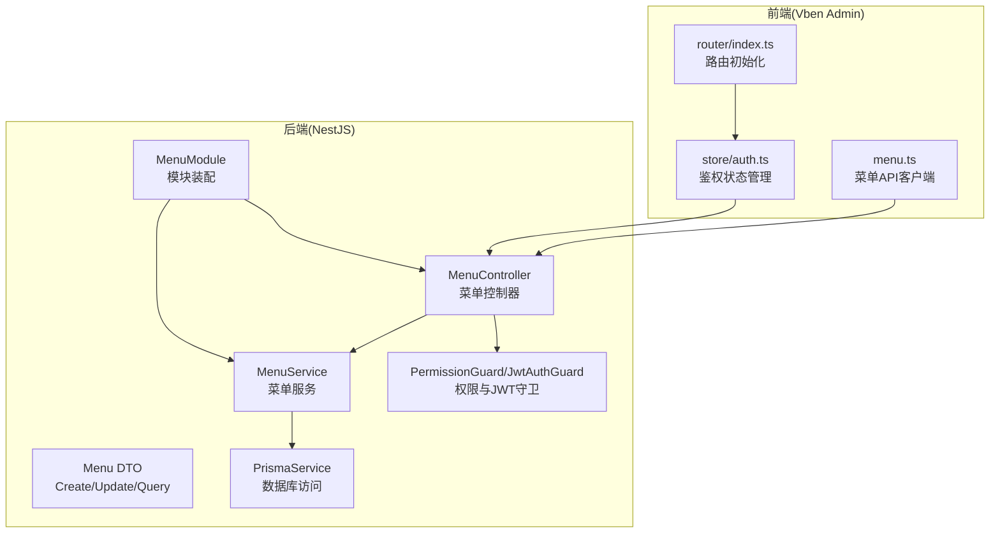
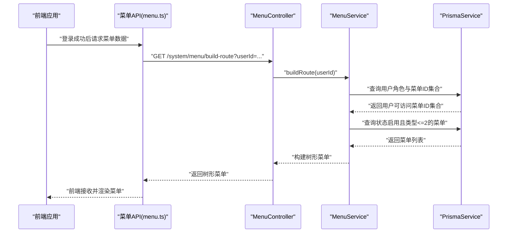
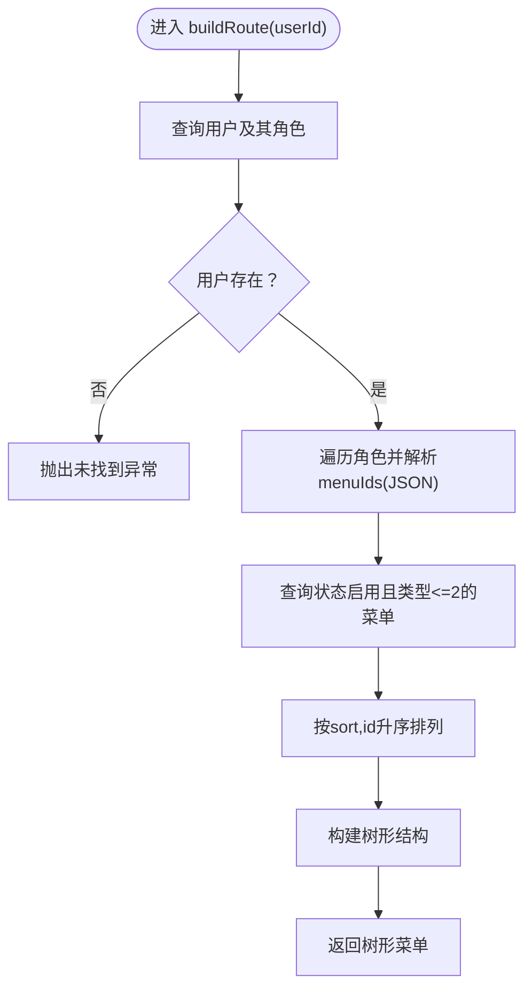
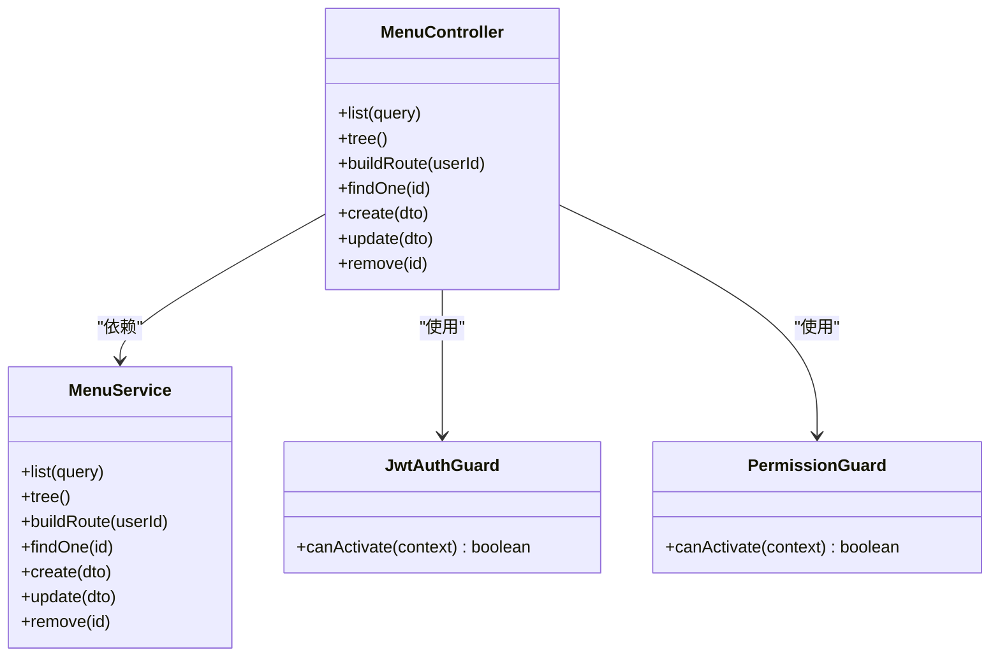
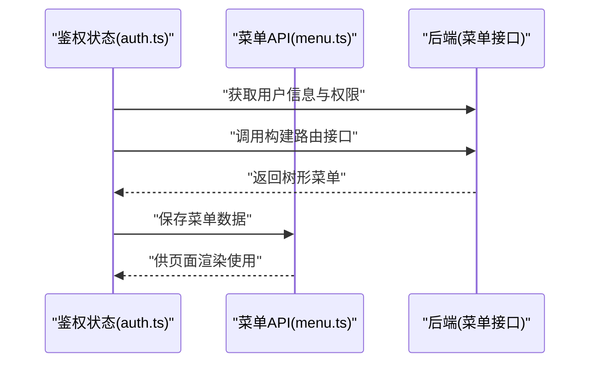
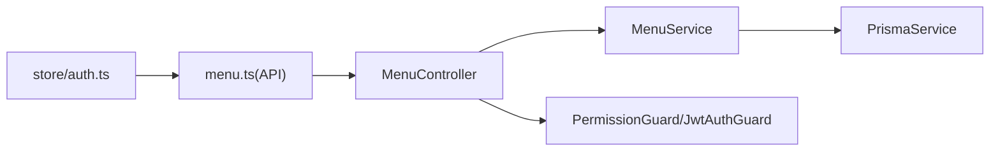

# 菜单管理

<cite>
**本文引用的文件**
- [apps/backend/src/modules/system/menu/menu.controller.ts](file://apps/backend/src/modules/system/menu/menu.controller.ts)
- [apps/backend/src/modules/system/menu/menu.service.ts](file://apps/backend/src/modules/system/menu/menu.service.ts)
- [apps/backend/src/modules/system/menu/dto/menu.dto.ts](file://apps/backend/src/modules/system/menu/dto/menu.dto.ts)
- [apps/backend/src/modules/system/menu/menu.module.ts](file://apps/backend/src/modules/system/menu/menu.module.ts)
- [apps/backend/src/auth/guards.ts](file://apps/backend/src/auth/guards.ts)
- [apps/backend/src/auth/jwt.guard.ts](file://apps/backend/src/auth/jwt.guard.ts)
- [apps/backend/src/common/prisma.service.ts](file://apps/backend/src/common/prisma.service.ts)
- [apps/backend/src/modules/system/user/user.service.ts](file://apps/backend/src/modules/system/user/user.service.ts)
- [apps/vben-admin/apps/web-antd/src/api/system/menu.ts](file://apps/vben-admin/apps/web-antd/src/api/system/menu.ts)
- [apps/vben-admin/apps/web-antd/src/router/index.ts](file://apps/vben-admin/apps/web-antd/src/router/index.ts)
- [apps/vben-admin/apps/web-antd/src/store/auth.ts](file://apps/vben-admin/apps/web-antd/src/store/auth.ts)
</cite>

## 目录
1. [简介](#简介)
2. [项目结构](#项目结构)
3. [核心组件](#核心组件)
4. [架构总览](#架构总览)
5. [详细组件分析](#详细组件分析)
6. [依赖分析](#依赖分析)
7. [性能考虑](#性能考虑)
8. [故障排查指南](#故障排查指南)
9. [结论](#结论)
10. [附录](#附录)

## 简介
本章节面向“菜单管理”子模块，系统性阐述动态菜单系统的实现原理与权限控制机制，覆盖菜单树形结构管理、菜单路由配置、按钮级权限控制、菜单动态加载、前端菜单渲染与后端权限验证流程、菜单与角色的关联关系、菜单图标与排序管理等关键能力。文档以代码为依据，提供从后端服务到前端渲染的全链路说明，并辅以可视化图示帮助理解。

## 项目结构
菜单管理涉及后端 NestJS 模块与前端 Vben Admin 前端应用两部分：
- 后端：系统模块下的菜单子模块，包含控制器、服务、DTO 与模块装配；配合认证与权限守卫、数据库访问层 Prisma。
- 前端：Vben Admin 的菜单 API 客户端、路由与鉴权状态管理，负责菜单数据拉取、路由构建与权限控制。

图表来源
- [apps/backend/src/modules/system/menu/menu.controller.ts:1-67](file://apps/backend/src/modules/system/menu/menu.controller.ts#L1-L67)
- [apps/backend/src/modules/system/menu/menu.service.ts:1-95](file://apps/backend/src/modules/system/menu/menu.service.ts#L1-L95)
- [apps/backend/src/modules/system/menu/dto/menu.dto.ts:1-41](file://apps/backend/src/modules/system/menu/dto/menu.dto.ts#L1-L41)
- [apps/backend/src/modules/system/menu/menu.module.ts:1-10](file://apps/backend/src/modules/system/menu/menu.module.ts#L1-L10)
- [apps/backend/src/auth/guards.ts:1-51](file://apps/backend/src/auth/guards.ts#L1-L51)
- [apps/backend/src/auth/jwt.guard.ts:1-5](file://apps/backend/src/auth/jwt.guard.ts#L1-L5)
- [apps/backend/src/common/prisma.service.ts:1-22](file://apps/backend/src/common/prisma.service.ts#L1-L22)
- [apps/vben-admin/apps/web-antd/src/api/system/menu.ts:1-44](file://apps/vben-admin/apps/web-antd/src/api/system/menu.ts#L1-L44)
- [apps/vben-admin/apps/web-antd/src/router/index.ts:1-38](file://apps/vben-admin/apps/web-antd/src/router/index.ts#L1-L38)
- [apps/vben-admin/apps/web-antd/src/store/auth.ts:1-137](file://apps/vben-admin/apps/web-antd/src/store/auth.ts#L1-L137)

章节来源
- [apps/backend/src/modules/system/menu/menu.controller.ts:1-67](file://apps/backend/src/modules/system/menu/menu.controller.ts#L1-L67)
- [apps/backend/src/modules/system/menu/menu.service.ts:1-95](file://apps/backend/src/modules/system/menu/menu.service.ts#L1-L95)
- [apps/backend/src/modules/system/menu/dto/menu.dto.ts:1-41](file://apps/backend/src/modules/system/menu/dto/menu.dto.ts#L1-L41)
- [apps/backend/src/modules/system/menu/menu.module.ts:1-10](file://apps/backend/src/modules/system/menu/menu.module.ts#L1-L10)
- [apps/backend/src/auth/guards.ts:1-51](file://apps/backend/src/auth/guards.ts#L1-L51)
- [apps/backend/src/auth/jwt.guard.ts:1-5](file://apps/backend/src/auth/jwt.guard.ts#L1-L5)
- [apps/backend/src/common/prisma.service.ts:1-22](file://apps/backend/src/common/prisma.service.ts#L1-L22)
- [apps/vben-admin/apps/web-antd/src/api/system/menu.ts:1-44](file://apps/vben-admin/apps/web-antd/src/api/system/menu.ts#L1-L44)
- [apps/vben-admin/apps/web-antd/src/router/index.ts:1-38](file://apps/vben-admin/apps/web-antd/src/router/index.ts#L1-L38)
- [apps/vben-admin/apps/web-antd/src/store/auth.ts:1-137](file://apps/vben-admin/apps/web-antd/src/store/auth.ts#L1-L137)

## 核心组件
- 菜单控制器：提供菜单列表、树形结构、路由构建、详情、创建、更新、删除等接口，并通过权限守卫进行访问控制。
- 菜单服务：封装菜单数据查询、树形构建、按用户动态生成可访问菜单树、以及 CRUD 操作。
- 菜单 DTO：定义菜单创建、更新、查询的数据传输对象及参数校验规则。
- 权限守卫：基于注解的权限校验，结合用户权限集合判断是否放行。
- 前端菜单 API：封装后端菜单接口调用，供前端页面与状态管理使用。
- 前端路由与鉴权：在登录成功后拉取用户信息与权限，动态构建路由与菜单。

章节来源
- [apps/backend/src/modules/system/menu/menu.controller.ts:17-65](file://apps/backend/src/modules/system/menu/menu.controller.ts#L17-L65)
- [apps/backend/src/modules/system/menu/menu.service.ts:9-94](file://apps/backend/src/modules/system/menu/menu.service.ts#L9-L94)
- [apps/backend/src/modules/system/menu/dto/menu.dto.ts:5-40](file://apps/backend/src/modules/system/menu/dto/menu.dto.ts#L5-L40)
- [apps/backend/src/auth/guards.ts:16-50](file://apps/backend/src/auth/guards.ts#L16-L50)
- [apps/vben-admin/apps/web-antd/src/api/system/menu.ts:21-43](file://apps/vben-admin/apps/web-antd/src/api/system/menu.ts#L21-L43)

## 架构总览
下图展示从用户登录到菜单动态加载与渲染的端到端流程：

图表来源
- [apps/vben-admin/apps/web-antd/src/api/system/menu.ts:21-27](file://apps/vben-admin/apps/web-antd/src/api/system/menu.ts#L21-L27)
- [apps/backend/src/modules/system/menu/menu.controller.ts:31-36](file://apps/backend/src/modules/system/menu/menu.controller.ts#L31-L36)
- [apps/backend/src/modules/system/menu/menu.service.ts:34-55](file://apps/backend/src/modules/system/menu/menu.service.ts#L34-L55)
- [apps/backend/src/common/prisma.service.ts:1-22](file://apps/backend/src/common/prisma.service.ts#L1-L22)

## 详细组件分析

### 菜单控制器 API 设计
- 接口分组：系统-菜单管理，统一前缀 system/menu。
- 访问控制：全局启用 JWT 与权限守卫，每个方法通过 RequirePermission 注解声明所需权限点。
- 主要接口：
  - GET /list：按条件查询并返回树形菜单。
  - GET /tree：返回状态启用的树形菜单。
  - GET /build-route：根据用户ID构建其可访问菜单树。
  - GET /:id：按ID查询菜单详情。
  - POST：创建菜单。
  - PUT：更新菜单。
  - DELETE /:id：删除菜单（存在子节点则拒绝）。

章节来源
- [apps/backend/src/modules/system/menu/menu.controller.ts:17-65](file://apps/backend/src/modules/system/menu/menu.controller.ts#L17-L65)
- [apps/backend/src/auth/guards.ts:16-17](file://apps/backend/src/auth/guards.ts#L16-L17)

### 菜单服务：递归查询与权限过滤
- 列表查询：支持名称模糊匹配、类型与状态过滤，按排序与ID升序排列，随后构建树形结构。
- 树形查询：仅返回状态启用的菜单，按排序与ID升序排列后构建树。
- 动态路由构建：
  - 通过用户ID查询用户及其角色。
  - 角色中存储菜单ID集合（JSON 字符串），解析后去重汇总。
  - 查询状态启用、类型小于等于2的菜单，按排序与ID升序排列后构建树。
- CRUD：
  - 创建：默认值处理（如类型、父级、排序、状态、外链、缓存、显示等）。
  - 更新：先校验是否存在，再更新字段。
  - 删除：若存在子节点则拒绝删除。

图表来源
- [apps/backend/src/modules/system/menu/menu.service.ts:34-55](file://apps/backend/src/modules/system/menu/menu.service.ts#L34-L55)

章节来源
- [apps/backend/src/modules/system/menu/menu.service.ts:9-94](file://apps/backend/src/modules/system/menu/menu.service.ts#L9-L94)

### 菜单 DTO：类型验证与层级校验
- CreateMenuDto/UpdateMenuDto：对名称、类型、父级、路径、组件、图标、排序、权限标识、状态、外链、缓存、显示等字段进行字符串或整数校验；类型与状态使用数字转换器。
- QueryMenuDto：支持名称、类型、状态的可选查询，类型与状态经数字转换器处理。
- 层级校验：服务端通过父子ID与集合比对实现树形构建，未见显式 DTO 层级深度校验，建议在业务侧补充父级合法性与循环引用检测。

章节来源
- [apps/backend/src/modules/system/menu/dto/menu.dto.ts:5-40](file://apps/backend/src/modules/system/menu/dto/menu.dto.ts#L5-L40)

### 权限控制机制
- JWT 守卫：确保请求携带有效令牌。
- 权限守卫：通过 RequirePermission 注解声明所需权限点，守卫从请求上下文提取用户权限集合，判断是否满足全部权限要求。
- 用户与角色关联：用户服务中返回的角色集合用于前端与后端的权限判定；菜单服务在动态路由构建时也依赖角色中的菜单ID集合。

图表来源
- [apps/backend/src/auth/guards.ts:19-50](file://apps/backend/src/auth/guards.ts#L19-L50)
- [apps/backend/src/auth/jwt.guard.ts:1-5](file://apps/backend/src/auth/jwt.guard.ts#L1-L5)
- [apps/backend/src/modules/system/menu/menu.controller.ts:1-14](file://apps/backend/src/modules/system/menu/menu.controller.ts#L1-L14)
- [apps/backend/src/modules/system/menu/menu.service.ts:1-8](file://apps/backend/src/modules/system/menu/menu.service.ts#L1-L8)

章节来源
- [apps/backend/src/auth/guards.ts:16-50](file://apps/backend/src/auth/guards.ts#L16-L50)
- [apps/backend/src/auth/jwt.guard.ts:1-5](file://apps/backend/src/auth/jwt.guard.ts#L1-L5)
- [apps/backend/src/modules/system/menu/menu.controller.ts:1-14](file://apps/backend/src/modules/system/menu/menu.controller.ts#L1-L14)

### 前端菜单渲染与动态加载
- 菜单 API 客户端：封装列表、树形、详情、创建、更新、删除等接口，供页面与状态管理调用。
- 鉴权与路由：登录成功后，前端从后端获取用户信息与权限，设置访问令牌与权限码；随后可调用构建路由接口获取菜单树并渲染。
- 路由初始化：路由在应用启动时完成初始化与守卫注册，菜单树用于生成导航与路由表。

图表来源
- [apps/vben-admin/apps/web-antd/src/store/auth.ts:44-61](file://apps/vben-admin/apps/web-antd/src/store/auth.ts#L44-L61)
- [apps/vben-admin/apps/web-antd/src/api/system/menu.ts:21-27](file://apps/vben-admin/apps/web-antd/src/api/system/menu.ts#L21-L27)
- [apps/vben-admin/apps/web-antd/src/router/index.ts:1-38](file://apps/vben-admin/apps/web-antd/src/router/index.ts#L1-L38)

章节来源
- [apps/vben-admin/apps/web-antd/src/api/system/menu.ts:1-44](file://apps/vben-admin/apps/web-antd/src/api/system/menu.ts#L1-L44)
- [apps/vben-admin/apps/web-antd/src/store/auth.ts:27-88](file://apps/vben-admin/apps/web-antd/src/store/auth.ts#L27-L88)
- [apps/vben-admin/apps/web-antd/src/router/index.ts:1-38](file://apps/vben-admin/apps/web-antd/src/router/index.ts#L1-L38)

### 菜单与角色的关联关系
- 角色维度：角色实体中存储菜单ID集合（JSON 字符串），服务端在构建用户可访问菜单树时解析该集合，形成最终可用菜单集合。
- 用户维度：用户服务返回用户的角色集合，前端与后端均可据此进行权限与菜单控制。
- 关联一致性：建议在角色更新菜单ID集合时进行格式校验与重复去除，避免重复与非法值影响菜单树构建。

章节来源
- [apps/backend/src/modules/system/menu/menu.service.ts:34-55](file://apps/backend/src/modules/system/menu/menu.service.ts#L34-L55)
- [apps/backend/src/modules/system/user/user.service.ts:135-143](file://apps/backend/src/modules/system/user/user.service.ts#L135-L143)

### 菜单图标与排序管理
- 图标字段：菜单实体包含图标字段，前端渲染时直接使用。
- 排序字段：查询与树形构建均按排序字段与ID升序排列，保证展示顺序稳定可控。
- 类型限制：动态路由构建时过滤类型小于等于2的菜单，通常用于区分目录、菜单与按钮等不同层级。

章节来源
- [apps/backend/src/modules/system/menu/menu.service.ts:19-25](file://apps/backend/src/modules/system/menu/menu.service.ts#L19-L25)
- [apps/backend/src/modules/system/menu/menu.service.ts:34-55](file://apps/backend/src/modules/system/menu/menu.service.ts#L34-L55)

## 依赖分析
- 控制器依赖服务与守卫，服务依赖数据库访问层与 DTO。
- 前端通过 API 客户端与后端交互，鉴权状态管理驱动菜单数据拉取与路由构建。
- 模块装配将控制器与服务导出，便于系统其他模块复用。

图表来源
- [apps/backend/src/modules/system/menu/menu.controller.ts:1-14](file://apps/backend/src/modules/system/menu/menu.controller.ts#L1-L14)
- [apps/backend/src/modules/system/menu/menu.service.ts:1-8](file://apps/backend/src/modules/system/menu/menu.service.ts#L1-L8)
- [apps/backend/src/common/prisma.service.ts:1-22](file://apps/backend/src/common/prisma.service.ts#L1-L22)
- [apps/backend/src/auth/guards.ts:1-51](file://apps/backend/src/auth/guards.ts#L1-L51)
- [apps/vben-admin/apps/web-antd/src/api/system/menu.ts:1-44](file://apps/vben-admin/apps/web-antd/src/api/system/menu.ts#L1-L44)
- [apps/vben-admin/apps/web-antd/src/store/auth.ts:1-137](file://apps/vben-admin/apps/web-antd/src/store/auth.ts#L1-L137)

章节来源
- [apps/backend/src/modules/system/menu/menu.module.ts:1-10](file://apps/backend/src/modules/system/menu/menu.module.ts#L1-L10)
- [apps/backend/src/modules/system/menu/menu.controller.ts:1-14](file://apps/backend/src/modules/system/menu/menu.controller.ts#L1-L14)
- [apps/backend/src/modules/system/menu/menu.service.ts:1-8](file://apps/backend/src/modules/system/menu/menu.service.ts#L1-L8)

## 性能考虑
- 查询优化：树形构建采用一次查询后在内存中递归组装，适合中小规模菜单；大规模菜单建议数据库层面实现层级查询或引入物化路径。
- 过滤策略：动态路由构建时先聚合用户可访问菜单ID，再一次性查询，减少多次往返。
- 缓存建议：菜单树与用户权限可结合 Redis 缓存，降低重复计算与数据库压力。
- 排序与索引：确保菜单表在排序字段与状态字段上建立索引，提升查询效率。

## 故障排查指南
- 删除失败：若提示无法删除存在子节点的菜单，请先清理子菜单后再执行删除。
- 权限不足：确认请求头携带有效令牌且具备对应权限点；检查用户权限集合与角色菜单ID集合是否正确。
- 菜单不显示：检查菜单状态是否启用、类型是否小于等于2、排序字段是否合理。
- 前端无菜单：确认登录后已调用构建路由接口并成功返回树形菜单；检查路由守卫与鉴权状态是否正常。

章节来源
- [apps/backend/src/modules/system/menu/menu.service.ts:88-93](file://apps/backend/src/modules/system/menu/menu.service.ts#L88-L93)
- [apps/backend/src/auth/guards.ts:36-50](file://apps/backend/src/auth/guards.ts#L36-L50)
- [apps/vben-admin/apps/web-antd/src/store/auth.ts:44-61](file://apps/vben-admin/apps/web-antd/src/store/auth.ts#L44-L61)

## 结论
菜单管理子模块通过清晰的控制器-服务-守卫分层设计，实现了菜单树形管理、动态路由构建与权限控制的闭环。后端以 Prisma 作为数据访问层，前端以 API 客户端与状态管理协同完成菜单渲染与路由生成。整体架构具备良好的扩展性，可在现有基础上进一步完善层级校验、缓存策略与大规模菜单场景的性能优化。

## 附录
- 菜单类型与状态：类型小于等于2的菜单参与动态路由构建；状态启用的菜单才被返回。
- 排序与层级：按排序与ID升序排列；树形构建基于父子ID映射。
- 角色菜单ID：角色实体中以JSON字符串形式存储菜单ID集合，服务端解析后参与权限过滤。