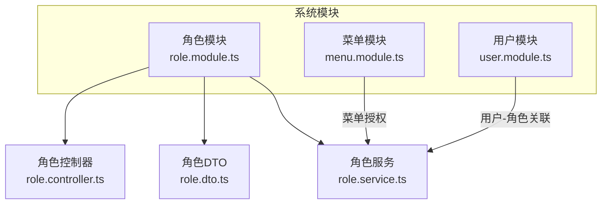
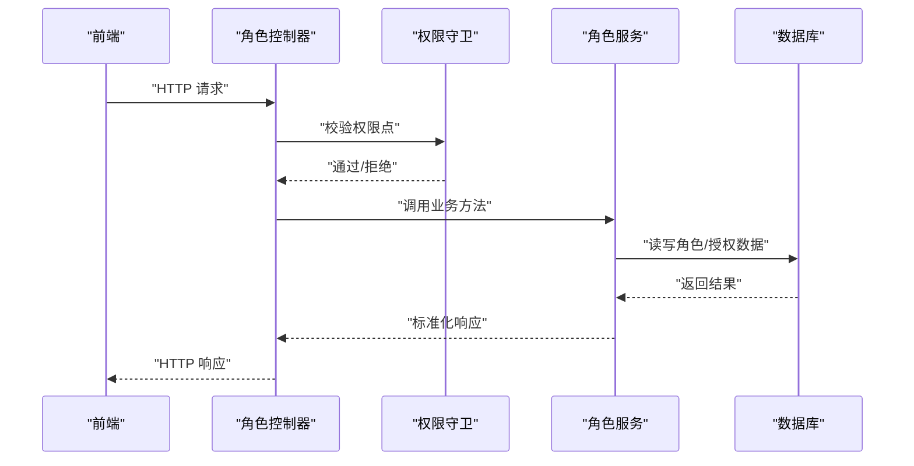
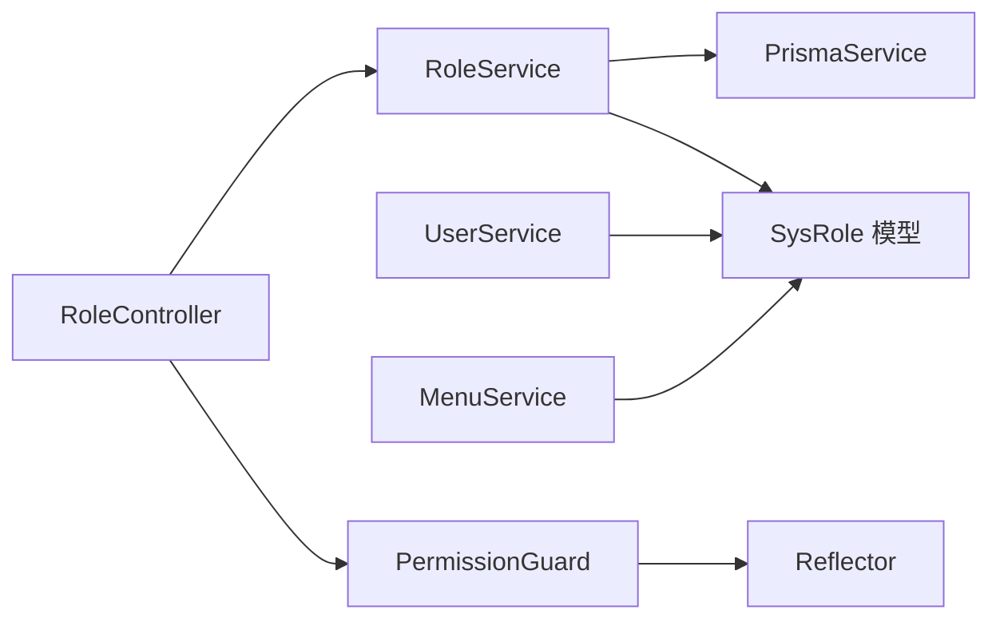

# 角色管理

<cite>
**本文引用的文件**
- [apps/backend/src/modules/system/role/role.controller.ts](file://apps/backend/src/modules/system/role/role.controller.ts)
- [apps/backend/src/modules/system/role/role.service.ts](file://apps/backend/src/modules/system/role/role.service.ts)
- [apps/backend/src/modules/system/role/dto/role.dto.ts](file://apps/backend/src/modules/system/role/dto/role.dto.ts)
- [apps/backend/src/modules/system/role/role.module.ts](file://apps/backend/src/modules/system/role/role.module.ts)
- [apps/backend/src/modules/system/user/user.service.ts](file://apps/backend/src/modules/system/user/user.service.ts)
- [apps/backend/src/modules/system/menu/menu.service.ts](file://apps/backend/src/modules/system/menu/menu.service.ts)
- [apps/backend/src/auth/guards.ts](file://apps/backend/src/auth/guards.ts)
- [apps/backend/prisma/schema.prisma](file://apps/backend/prisma/schema.prisma)
- [apps/backend/src/modules/system/system.module.ts](file://apps/backend/src/modules/system/system.module.ts)
- [apps/vben-admin/apps/web-antd/src/api/system/role.ts](file://apps/vben-admin/apps/web-antd/src/api/system/role.ts)
- [apps/vben-admin/apps/web-antd/src/views/system/role/index.vue](file://apps/vben-admin/apps/web-antd/src/views/system/role/index.vue)
</cite>

## 目录
1. [简介](#简介)
2. [项目结构](#项目结构)
3. [核心组件](#核心组件)
4. [架构总览](#架构总览)
5. [详细组件分析](#详细组件分析)
6. [依赖分析](#依赖分析)
7. [性能考虑](#性能考虑)
8. [故障排查指南](#故障排查指南)
9. [结论](#结论)
10. [附录](#附录)

## 简介
本章节概述角色管理子模块的目标与职责：提供角色的全生命周期管理（CRUD）、权限分配（菜单与部门范围）、状态变更与查询能力，并通过鉴权守卫确保接口访问安全。同时，角色与用户、菜单之间存在明确的数据关联关系，支持基于角色的路由生成与权限校验。

## 项目结构
角色管理子模块位于后端 NestJS 应用的系统模块下，采用按功能分层组织：
- 控制器 RoleController：暴露 REST 接口，负责请求参数解析与权限注解
- 服务 RoleService：封装业务逻辑，与数据库交互并返回标准化结果
- DTO：对输入参数进行校验与转换
- 模块 RoleModule：装配控制器与服务
- 关联模块：用户模块（用户-角色多对多）、菜单模块（角色-菜单授权）

图表来源
- [apps/backend/src/modules/system/system.module.ts:1-23](file://apps/backend/src/modules/system/system.module.ts#L1-L23)
- [apps/backend/src/modules/system/role/role.module.ts:1-10](file://apps/backend/src/modules/system/role/role.module.ts#L1-L10)

章节来源
- [apps/backend/src/modules/system/system.module.ts:1-23](file://apps/backend/src/modules/system/system.module.ts#L1-L23)
- [apps/backend/src/modules/system/role/role.module.ts:1-10](file://apps/backend/src/modules/system/role/role.module.ts#L1-L10)

## 核心组件
- 角色控制器 RoleController：提供列表、创建、更新、删除、状态变更、权限分配、菜单查询等接口；统一使用 JWT 与权限守卫
- 角色服务 RoleService：实现分页查询、详情、创建、更新、删除、启用/停用、分配权限（菜单与部门范围）等
- 角色 DTO：对创建、更新、查询、权限分配的输入参数进行校验与类型转换
- 权限守卫 PermissionGuard：基于 RequirePermission 注解校验用户是否具备所需权限点
- 数据模型 SysRole：包含角色基本信息、状态、数据范围、菜单与部门授权集合字段

章节来源
- [apps/backend/src/modules/system/role/role.controller.ts:1-80](file://apps/backend/src/modules/system/role/role.controller.ts#L1-L80)
- [apps/backend/src/modules/system/role/role.service.ts:1-80](file://apps/backend/src/modules/system/role/role.service.ts#L1-L80)
- [apps/backend/src/modules/system/role/dto/role.dto.ts:1-38](file://apps/backend/src/modules/system/role/dto/role.dto.ts#L1-L38)
- [apps/backend/src/auth/guards.ts:1-51](file://apps/backend/src/auth/guards.ts#L1-L51)
- [apps/backend/prisma/schema.prisma:40-56](file://apps/backend/prisma/schema.prisma#L40-L56)

## 架构总览
角色管理的调用链路如下：
- 前端通过 API 发起请求
- 控制器解析参数并应用权限注解
- 服务执行业务逻辑并与数据库交互
- 返回标准化响应

图表来源
- [apps/backend/src/modules/system/role/role.controller.ts:1-80](file://apps/backend/src/modules/system/role/role.controller.ts#L1-L80)
- [apps/backend/src/auth/guards.ts:36-51](file://apps/backend/src/auth/guards.ts#L36-L51)
- [apps/backend/src/modules/system/role/role.service.ts:1-80](file://apps/backend/src/modules/system/role/role.service.ts#L1-L80)

## 详细组件分析

### 角色控制器 RoleController
- 设计原则
  - 使用 Swagger 注解标注接口用途与权限点
  - 统一使用 JWT 与权限守卫，确保接口访问安全
  - 参数解析采用内置管道与 DTO 校验，保证入参一致性
- 主要接口
  - 列表查询：支持名称、编码、状态过滤，分页参数校验
  - 创建角色：校验编码唯一性，设置默认状态与数据范围
  - 更新角色：校验 ID 存在性，允许更新名称、数据范围与状态
  - 删除角色：物理删除
  - 变更状态：批量或单个状态切换
  - 分配权限：接收菜单 ID 与可选部门 ID 数组，持久化为字符串
  - 获取角色菜单：解析存储的菜单 ID 集合
  - 获取角色详情：按 ID 查询

章节来源
- [apps/backend/src/modules/system/role/role.controller.ts:1-80](file://apps/backend/src/modules/system/role/role.controller.ts#L1-L80)

### 角色服务 RoleService
- 查询与分页：根据条件动态拼装 where 条件，支持并发统计与分页查询
- 创建：检查编码唯一性，创建时设置默认状态与数据范围
- 更新：校验 ID 存在性，更新名称、数据范围与状态
- 删除：删除角色记录
- 状态变更：直接更新状态字段
- 权限分配：将菜单 ID 与部门 ID（可选）序列化后保存
- 菜单查询：解析角色已授权的菜单 ID 与部门 ID 集合

章节来源
- [apps/backend/src/modules/system/role/role.service.ts:1-80](file://apps/backend/src/modules/system/role/role.service.ts#L1-L80)

### 角色 DTO 参数校验
- CreateRoleDto：名称与编码必填，数据范围可选
- UpdateRoleDto：ID 必填，名称、数据范围、状态可选
- QueryRoleDto：名称、编码、状态可选，分页参数带最小值约束
- AssignPermDto：菜单 ID 必填数组，部门 ID 可选数组

章节来源
- [apps/backend/src/modules/system/role/dto/role.dto.ts:1-38](file://apps/backend/src/modules/system/role/dto/role.dto.ts#L1-L38)

### 权限验证逻辑（PermissionGuard）
- RequirePermission 注解声明所需权限点
- 守卫从请求上下文提取用户信息，校验其权限集合是否包含所需权限点
- 未声明权限点的接口默认放行

章节来源
- [apps/backend/src/auth/guards.ts:16-51](file://apps/backend/src/auth/guards.ts#L16-L51)

### 角色与用户的关联关系
- 用户与角色为多对多关系，通过中间关联实现
- 用户服务提供分配角色的方法，支持设置用户的角色集合
- 路由构建时，菜单服务会聚合用户所有角色的菜单授权集合，生成可用路由树

章节来源
- [apps/backend/prisma/schema.prisma:40-56](file://apps/backend/prisma/schema.prisma#L40-L56)
- [apps/backend/src/modules/system/user/user.service.ts:135-143](file://apps/backend/src/modules/system/user/user.service.ts#L135-L143)
- [apps/backend/src/modules/system/menu/menu.service.ts:34-55](file://apps/backend/src/modules/system/menu/menu.service.ts#L34-L55)

### 角色与菜单权限的绑定机制
- 角色表存储菜单 ID 与部门 ID 的字符串集合（JSON 序列化）
- 菜单服务在构建用户路由时，遍历用户角色的菜单 ID 集合，查询有效菜单并构建树结构
- 支持按菜单类型过滤（如目录/页面），仅返回可用菜单

章节来源
- [apps/backend/src/modules/system/role/role.service.ts:64-79](file://apps/backend/src/modules/system/role/role.service.ts#L64-L79)
- [apps/backend/src/modules/system/menu/menu.service.ts:34-55](file://apps/backend/src/modules/system/menu/menu.service.ts#L34-L55)
- [apps/backend/prisma/schema.prisma:40-56](file://apps/backend/prisma/schema.prisma#L40-L56)

### 角色数据范围的实现方式
- 角色表包含 dataScope 字段，默认值为 1
- 服务在创建角色时若未显式传入则使用默认值
- 前端与后端其他模块可通过该字段配合菜单与部门授权实现数据范围控制策略（例如仅本部门、自定义范围等）

章节来源
- [apps/backend/src/modules/system/role/role.service.ts:36-42](file://apps/backend/src/modules/system/role/role.service.ts#L36-L42)
- [apps/backend/prisma/schema.prisma:40-56](file://apps/backend/prisma/schema.prisma#L40-L56)

### 角色继承关系
- 当前实现未体现“角色继承”概念，角色间不存在层级或继承字段
- 若需实现继承，可在角色表新增父级引用或引入额外映射表，并在权限计算阶段合并继承链

章节来源
- [apps/backend/prisma/schema.prisma:40-56](file://apps/backend/prisma/schema.prisma#L40-L56)

### API 设计与最佳实践
- 接口命名规范：遵循 REST 风格，资源路径以 system/role 为前缀
- 权限点设计：每个接口均标注 RequirePermission，建议统一维护权限清单
- 输入校验：使用 DTO 与类验证器，避免脏数据进入业务层
- 错误处理：对重复编码、资源不存在等场景抛出明确异常
- 数据范围：结合 dataScope 与部门授权实现灵活的数据访问控制
- 前后端协同：前端通过 API 层调用后端接口，视图组件负责展示与交互

章节来源
- [apps/backend/src/modules/system/role/role.controller.ts:1-80](file://apps/backend/src/modules/system/role/role.controller.ts#L1-L80)
- [apps/backend/src/modules/system/role/dto/role.dto.ts:1-38](file://apps/backend/src/modules/system/role/dto/role.dto.ts#L1-L38)
- [apps/vben-admin/apps/web-antd/src/api/system/role.ts](file://apps/vben-admin/apps/web-antd/src/api/system/role.ts)
- [apps/vben-admin/apps/web-antd/src/views/system/role/index.vue](file://apps/vben-admin/apps/web-antd/src/views/system/role/index.vue)

## 依赖分析
- 控制器依赖服务：RoleController 仅依赖 RoleService
- 服务依赖 PrismaService：RoleService 通过 Prisma 访问 SysRole 表
- 权限守卫依赖 Reflector：从控制器/方法元数据读取权限点
- 用户与菜单模块：用户服务维护用户-角色关联；菜单服务维护用户-菜单路由构建
- 角色模块导出服务：RoleModule 向外部模块提供 RoleService

图表来源
- [apps/backend/src/modules/system/role/role.controller.ts:1-80](file://apps/backend/src/modules/system/role/role.controller.ts#L1-L80)
- [apps/backend/src/modules/system/role/role.service.ts:1-80](file://apps/backend/src/modules/system/role/role.service.ts#L1-L80)
- [apps/backend/src/auth/guards.ts:1-51](file://apps/backend/src/auth/guards.ts#L1-L51)
- [apps/backend/prisma/schema.prisma:40-56](file://apps/backend/prisma/schema.prisma#L40-L56)

章节来源
- [apps/backend/src/modules/system/role/role.controller.ts:1-80](file://apps/backend/src/modules/system/role/role.controller.ts#L1-L80)
- [apps/backend/src/modules/system/role/role.service.ts:1-80](file://apps/backend/src/modules/system/role/role.service.ts#L1-L80)
- [apps/backend/src/auth/guards.ts:1-51](file://apps/backend/src/auth/guards.ts#L1-L51)
- [apps/backend/prisma/schema.prisma:40-56](file://apps/backend/prisma/schema.prisma#L40-L56)

## 性能考虑
- 分页查询：使用 count 与 findMany 并行执行，减少往返延迟
- 条件过滤：按需拼装 where 条件，避免不必要的索引扫描
- JSON 字符串存储：菜单与部门 ID 采用字符串存储，查询时解析，注意字段长度与索引策略
- 权限计算：在构建用户路由时对菜单 ID 进行去重与过滤，避免重复查询

## 故障排查指南
- 编码冲突：创建角色时报错提示编码已存在，检查是否存在重复编码
- 资源不存在：查询或更新角色时未找到对应 ID，确认 ID 是否正确
- 权限不足：接口返回未授权，检查当前登录用户是否具备所需权限点
- 菜单授权为空：获取角色菜单返回空集合，确认是否已调用分配权限接口并成功持久化

章节来源
- [apps/backend/src/modules/system/role/role.service.ts:36-42](file://apps/backend/src/modules/system/role/role.service.ts#L36-L42)
- [apps/backend/src/modules/system/role/role.service.ts:30-34](file://apps/backend/src/modules/system/role/role.service.ts#L30-L34)
- [apps/backend/src/auth/guards.ts:36-51](file://apps/backend/src/auth/guards.ts#L36-L51)

## 结论
角色管理子模块通过清晰的分层设计与严格的参数校验，提供了稳定的角色 CRUD 与权限分配能力。结合用户-角色、角色-菜单的关联关系，可实现灵活的路由与数据范围控制。建议后续扩展角色继承与更细粒度的数据权限策略，以满足复杂业务场景。

## 附录
- 常见使用场景
  - 新建角色并分配菜单与部门范围
  - 将用户分配到多个角色以叠加权限
  - 基于角色数据范围限制数据可见性
- 前端集成
  - 通过前端 API 层调用后端接口，视图组件负责表格、表单与权限点的展示与交互

章节来源
- [apps/vben-admin/apps/web-antd/src/api/system/role.ts](file://apps/vben-admin/apps/web-antd/src/api/system/role.ts)
- [apps/vben-admin/apps/web-antd/src/views/system/role/index.vue](file://apps/vben-admin/apps/web-antd/src/views/system/role/index.vue)