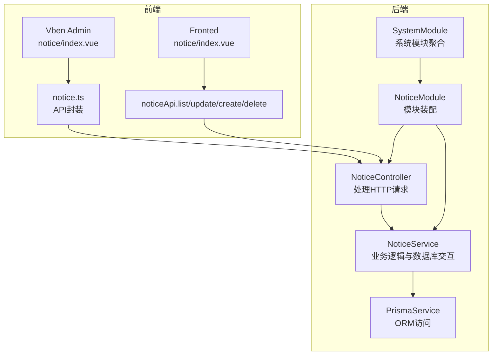
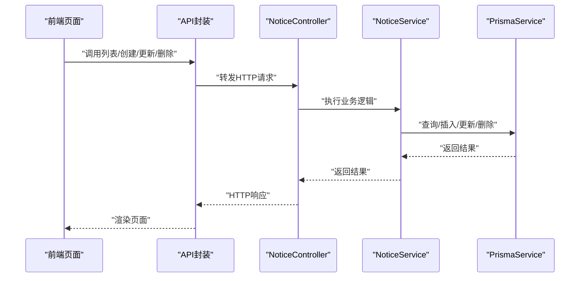
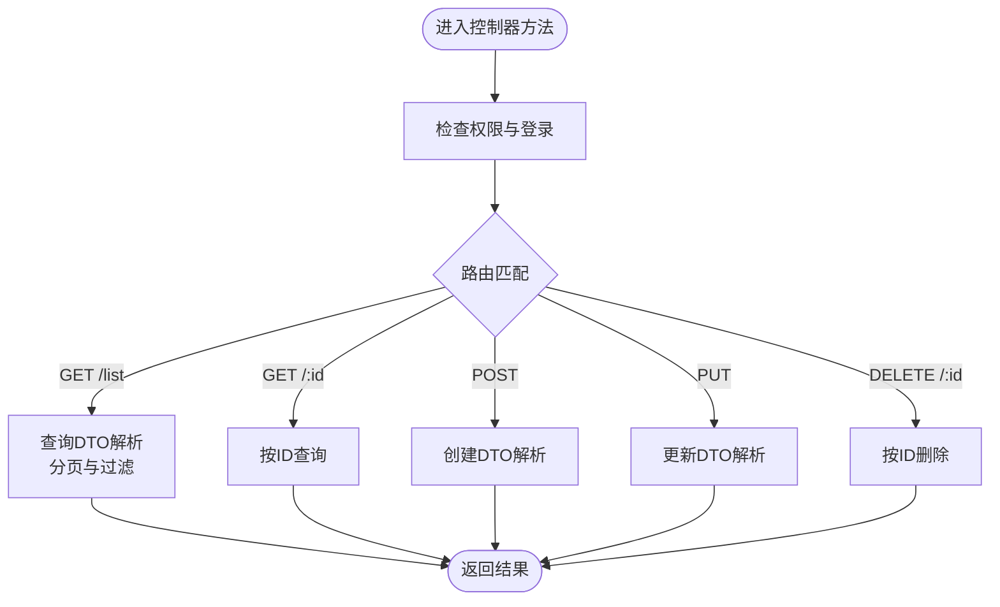
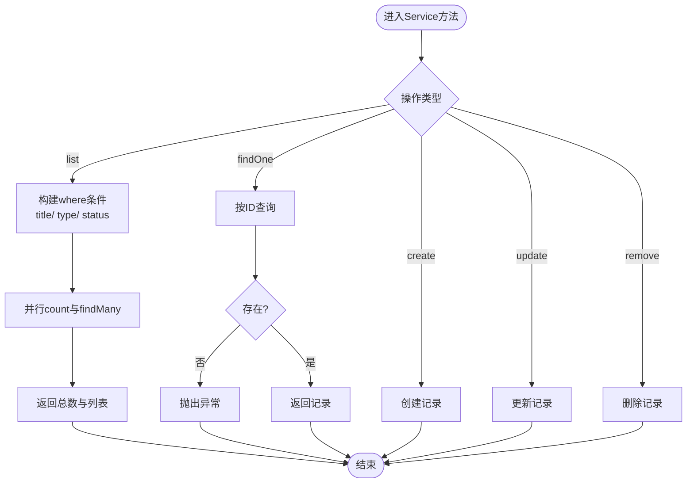
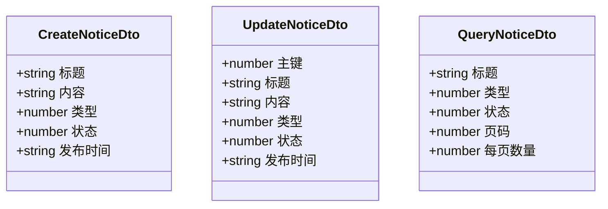
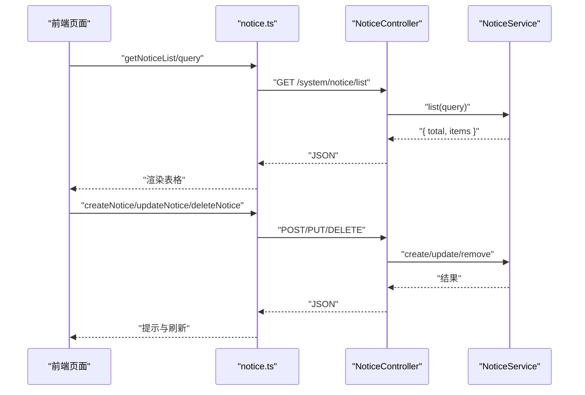
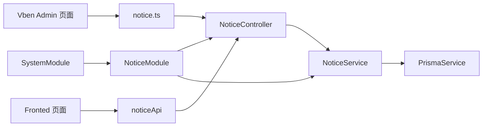

# 通知公告

<cite>
**本文引用的文件**
- [apps/backend/src/modules/system/notice/notice.controller.ts](file://apps/backend/src/modules/system/notice/notice.controller.ts)
- [apps/backend/src/modules/system/notice/notice.service.ts](file://apps/backend/src/modules/system/notice/notice.service.ts)
- [apps/backend/src/modules/system/notice/dto/notice.dto.ts](file://apps/backend/src/modules/system/notice/dto/notice.dto.ts)
- [apps/backend/src/modules/system/notice/notice.module.ts](file://apps/backend/src/modules/system/notice/notice.module.ts)
- [apps/backend/src/modules/system/system.module.ts](file://apps/backend/src/modules/system/system.module.ts)
- [apps/backend/prisma/schema.prisma](file://apps/backend/prisma/schema.prisma)
- [apps/vben-admin/apps/web-antd/src/api/system/notice.ts](file://apps/vben-admin/apps/web-antd/src/api/system/notice.ts)
- [apps/vben-admin/apps/web-antd/src/views/system/notice/index.vue](file://apps/vben-admin/apps/web-antd/src/views/system/notice/index.vue)
- [apps/fronted/src/views/system/notice/index.vue](file://apps/fronted/src/views/system/notice/index.vue)
</cite>

## 目录
1. [简介](#简介)
2. [项目结构](#项目结构)
3. [核心组件](#核心组件)
4. [架构总览](#架构总览)
5. [详细组件分析](#详细组件分析)
6. [依赖关系分析](#依赖关系分析)
7. [性能考虑](#性能考虑)
8. [故障排查指南](#故障排查指南)
9. [结论](#结论)
10. [附录](#附录)

## 简介
本文件面向“通知公告”子模块，提供从后端控制器到前端界面的完整技术文档。重点覆盖以下方面：
- 公告的发布与管理：创建、编辑、删除、列表查询
- 公告的分类与状态：类型字段与状态字段的含义与使用
- 公告的定时发布：publishTime 字段的使用场景与注意事项
- 数据校验与 DTO 规则：前后端统一的数据契约与验证策略
- 阅读状态与推送：当前仓库未包含阅读状态与批量推送功能，后续可按需扩展
- 效果分析：当前仓库未包含阅读统计与效果分析，后续可按需扩展

## 项目结构
通知公告模块采用典型的 NestJS 分层架构：
- 控制器层：处理 HTTP 请求与响应，负责鉴权与权限校验
- 服务层：封装业务逻辑，与数据库交互
- DTO 层：定义请求与查询参数的数据结构与校验规则
- 前端层：提供公告的增删改查界面与分页查询能力

**图表来源**
- [apps/backend/src/modules/system/notice/notice.controller.ts:1-50](file://apps/backend/src/modules/system/notice/notice.controller.ts#L1-L50)
- [apps/backend/src/modules/system/notice/notice.service.ts:1-44](file://apps/backend/src/modules/system/notice/notice.service.ts#L1-L44)
- [apps/backend/src/modules/system/notice/notice.module.ts:1-10](file://apps/backend/src/modules/system/notice/notice.module.ts#L1-L10)
- [apps/backend/src/modules/system/system.module.ts:1-23](file://apps/backend/src/modules/system/system.module.ts#L1-L23)
- [apps/vben-admin/apps/web-antd/src/views/system/notice/index.vue:1-143](file://apps/vben-admin/apps/web-antd/src/views/system/notice/index.vue#L1-L143)
- [apps/vben-admin/apps/web-antd/src/api/system/notice.ts:1-40](file://apps/vben-admin/apps/web-antd/src/api/system/notice.ts#L1-L40)
- [apps/fronted/src/views/system/notice/index.vue:1-157](file://apps/fronted/src/views/system/notice/index.vue#L1-L157)

**章节来源**
- [apps/backend/src/modules/system/notice/notice.controller.ts:1-50](file://apps/backend/src/modules/system/notice/notice.controller.ts#L1-L50)
- [apps/backend/src/modules/system/notice/notice.service.ts:1-44](file://apps/backend/src/modules/system/notice/notice.service.ts#L1-L44)
- [apps/backend/src/modules/system/notice/notice.module.ts:1-10](file://apps/backend/src/modules/system/notice/notice.module.ts#L1-L10)
- [apps/backend/src/modules/system/system.module.ts:1-23](file://apps/backend/src/modules/system/system.module.ts#L1-L23)

## 核心组件
- NoticeController：提供公告的列表查询、详情获取、创建、更新、删除等接口，并通过 JWT 与权限守卫进行安全控制
- NoticeService：封装公告的查询、创建、更新、删除逻辑，使用 Prisma 进行数据库访问
- DTO（CreateNoticeDto、UpdateNoticeDto、QueryNoticeDto）：定义请求体与查询参数的字段与校验规则
- 前端页面：提供公告的增删改查与分页展示，支持按标题、类型、状态过滤

**章节来源**
- [apps/backend/src/modules/system/notice/notice.controller.ts:1-50](file://apps/backend/src/modules/system/notice/notice.controller.ts#L1-L50)
- [apps/backend/src/modules/system/notice/notice.service.ts:1-44](file://apps/backend/src/modules/system/notice/notice.service.ts#L1-L44)
- [apps/backend/src/modules/system/notice/dto/notice.dto.ts:1-29](file://apps/backend/src/modules/system/notice/dto/notice.dto.ts#L1-L29)
- [apps/vben-admin/apps/web-antd/src/views/system/notice/index.vue:1-143](file://apps/vben-admin/apps/web-antd/src/views/system/notice/index.vue#L1-L143)
- [apps/fronted/src/views/system/notice/index.vue:1-157](file://apps/fronted/src/views/system/notice/index.vue#L1-L157)

## 架构总览
通知公告模块遵循“控制器-服务-数据访问”的分层设计，前端通过 API 封装调用后端接口，后端通过 Prisma 访问 MySQL 数据库。

**图表来源**
- [apps/vben-admin/apps/web-antd/src/api/system/notice.ts:1-40](file://apps/vben-admin/apps/web-antd/src/api/system/notice.ts#L1-L40)
- [apps/backend/src/modules/system/notice/notice.controller.ts:1-50](file://apps/backend/src/modules/system/notice/notice.controller.ts#L1-L50)
- [apps/backend/src/modules/system/notice/notice.service.ts:1-44](file://apps/backend/src/modules/system/notice/notice.service.ts#L1-L44)

## 详细组件分析

### NoticeController API 实现
- 列表查询：支持按标题（模糊匹配）、类型、状态过滤，分页参数 page、limit 默认最小值为 1
- 单条查询：按主键查询公告详情
- 创建公告：接收标题、内容、类型、状态、发布时间
- 更新公告：接收主键与可选字段，按需更新
- 删除公告：按主键删除

**图表来源**
- [apps/backend/src/modules/system/notice/notice.controller.ts:1-50](file://apps/backend/src/modules/system/notice/notice.controller.ts#L1-L50)

**章节来源**
- [apps/backend/src/modules/system/notice/notice.controller.ts:14-48](file://apps/backend/src/modules/system/notice/notice.controller.ts#L14-L48)

### NoticeService 查询逻辑与阅读状态管理
- 列表查询：根据标题、类型、状态构建 where 条件，使用并行计数与分页查询提升性能
- 单条查询：未找到抛出异常
- 创建/更新/删除：基于 Prisma 的 create/update/delete 操作

**图表来源**
- [apps/backend/src/modules/system/notice/notice.service.ts:9-43](file://apps/backend/src/modules/system/notice/notice.service.ts#L9-L43)

**章节来源**
- [apps/backend/src/modules/system/notice/notice.service.ts:9-43](file://apps/backend/src/modules/system/notice/notice.service.ts#L9-L43)

### DTO 数据验证与公告类型规则
- CreateNoticeDto：标题与内容必填；类型与状态可选，默认值在服务层设置；发布时间可选
- UpdateNoticeDto：主键必填；其余字段可选
- QueryNoticeDto：标题可选；类型与状态可选；分页参数 page、limit 必须为整数且最小为 1

**图表来源**
- [apps/backend/src/modules/system/notice/dto/notice.dto.ts:5-28](file://apps/backend/src/modules/system/notice/dto/notice.dto.ts#L5-L28)

**章节来源**
- [apps/backend/src/modules/system/notice/dto/notice.dto.ts:5-28](file://apps/backend/src/modules/system/notice/dto/notice.dto.ts#L5-L28)

### 前端集成与界面交互
- Vben Admin 页面：提供查询表单（标题、类型、状态）、分页表格、新增/编辑弹窗、删除确认
- Fronted 页面：提供类似的查询与分页能力，支持日期选择器用于定时发布
- API 封装：统一的 GET/POST/PUT/DELETE 方法，便于复用

**图表来源**
- [apps/vben-admin/apps/web-antd/src/views/system/notice/index.vue:25-74](file://apps/vben-admin/apps/web-antd/src/views/system/notice/index.vue#L25-L74)
- [apps/vben-admin/apps/web-antd/src/api/system/notice.ts:21-39](file://apps/vben-admin/apps/web-antd/src/api/system/notice.ts#L21-L39)
- [apps/backend/src/modules/system/notice/notice.controller.ts:14-48](file://apps/backend/src/modules/system/notice/notice.controller.ts#L14-L48)

**章节来源**
- [apps/vben-admin/apps/web-antd/src/views/system/notice/index.vue:1-143](file://apps/vben-admin/apps/web-antd/src/views/system/notice/index.vue#L1-L143)
- [apps/vben-admin/apps/web-antd/src/api/system/notice.ts:1-40](file://apps/vben-admin/apps/web-antd/src/api/system/notice.ts#L1-L40)
- [apps/fronted/src/views/system/notice/index.vue:1-157](file://apps/fronted/src/views/system/notice/index.vue#L1-L157)

## 依赖关系分析
- NoticeModule 导出 NoticeService，供其他模块复用
- SystemModule 聚合 NoticeModule，形成系统模块化组织
- 前端通过统一 API 封装调用后端控制器

**图表来源**
- [apps/backend/src/modules/system/notice/notice.module.ts:5-9](file://apps/backend/src/modules/system/notice/notice.module.ts#L5-L9)
- [apps/backend/src/modules/system/system.module.ts:9-20](file://apps/backend/src/modules/system/system.module.ts#L9-L20)
- [apps/vben-admin/apps/web-antd/src/api/system/notice.ts:1-40](file://apps/vben-admin/apps/web-antd/src/api/system/notice.ts#L1-L40)

**章节来源**
- [apps/backend/src/modules/system/notice/notice.module.ts:1-10](file://apps/backend/src/modules/system/notice/notice.module.ts#L1-L10)
- [apps/backend/src/modules/system/system.module.ts:1-23](file://apps/backend/src/modules/system/system.module.ts#L1-L23)

## 性能考虑
- 列表查询使用并行计数与分页查询，减少数据库压力
- 使用索引优化常见查询字段（类型、状态），建议在生产环境确保数据库索引生效
- 建议对标题模糊查询添加长度限制，避免过长关键字导致性能问题

[本节为通用性能建议，不直接分析具体文件]

## 故障排查指南
- 404 未找到：单条查询未命中会抛出异常，前端需捕获并提示
- 参数校验失败：DTO 校验不通过将返回 400，需检查请求体字段类型与必填项
- 权限不足：控制器使用了 JWT 与权限守卫，需确认 Token 与权限是否正确

**章节来源**
- [apps/backend/src/modules/system/notice/notice.service.ts:22-26](file://apps/backend/src/modules/system/notice/notice.service.ts#L22-L26)
- [apps/backend/src/modules/system/notice/dto/notice.dto.ts:22-28](file://apps/backend/src/modules/system/notice/dto/notice.dto.ts#L22-L28)
- [apps/backend/src/modules/system/notice/notice.controller.ts:10-11](file://apps/backend/src/modules/system/notice/notice.controller.ts#L10-L11)

## 结论
通知公告模块实现了公告的全生命周期管理：创建、查询、更新、删除，并通过 DTO 与守卫保证数据与安全。当前仓库未包含阅读状态与批量推送、阅读统计与效果分析功能，可在现有架构基础上扩展。建议后续增加：
- 阅读状态表与推送队列
- 阅读统计与效果分析报表
- 定时发布任务调度（结合 publishTime）

[本节为总结性内容，不直接分析具体文件]

## 附录

### 数据模型与字段说明
- SysNotice 表：包含标题、内容、类型、状态、发布时间、创建/更新时间等字段
- 建议在数据库层面为 type、status 添加索引以提升查询性能

**章节来源**
- [apps/backend/prisma/schema.prisma:167-180](file://apps/backend/prisma/schema.prisma#L167-L180)

### API 定义概览
- GET /system/notice/list：分页查询公告
- GET /system/notice/:id：获取公告详情
- POST /system/notice：创建公告
- PUT /system/notice：更新公告
- DELETE /system/notice/:id：删除公告

**章节来源**
- [apps/backend/src/modules/system/notice/notice.controller.ts:14-48](file://apps/backend/src/modules/system/notice/notice.controller.ts#L14-L48)
- [apps/vben-admin/apps/web-antd/src/api/system/notice.ts:21-39](file://apps/vben-admin/apps/web-antd/src/api/system/notice.ts#L21-L39)