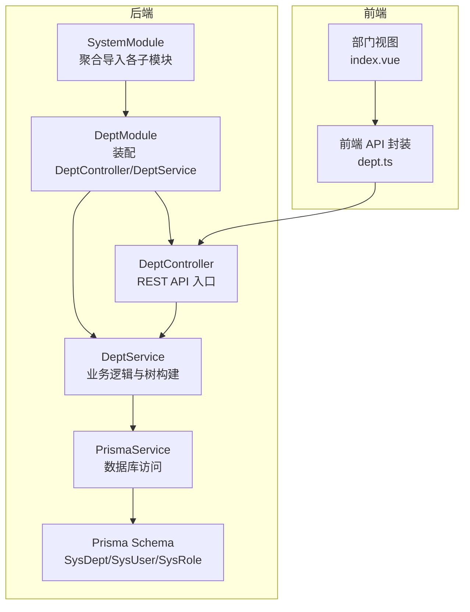
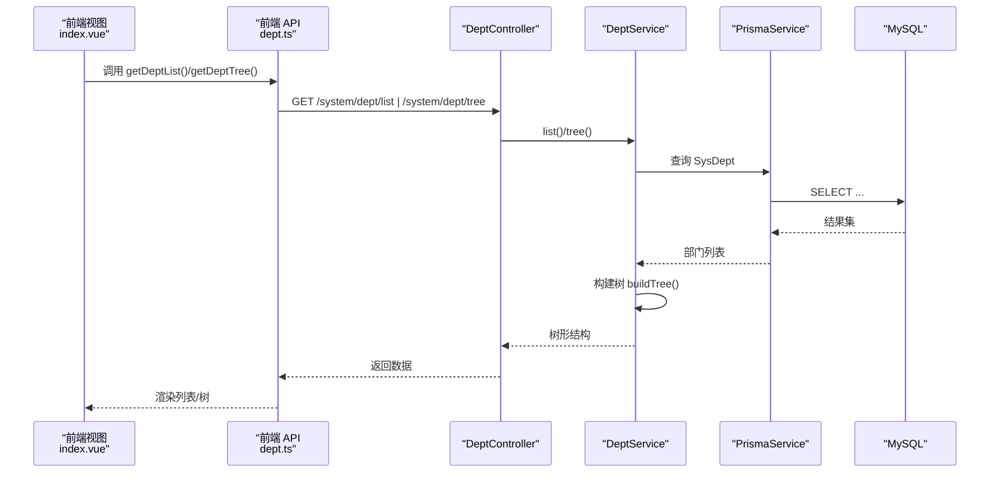
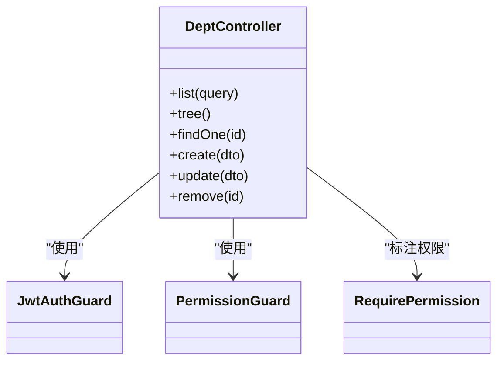
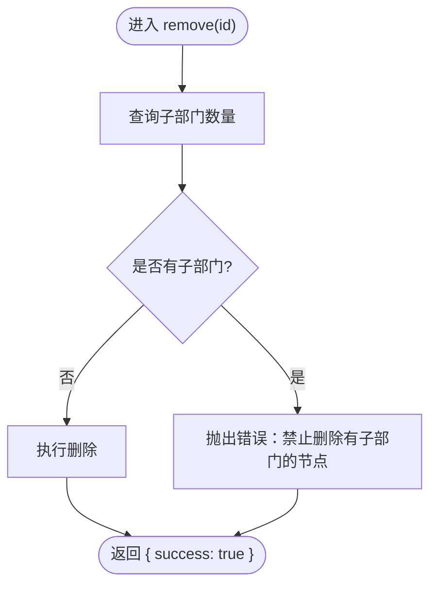
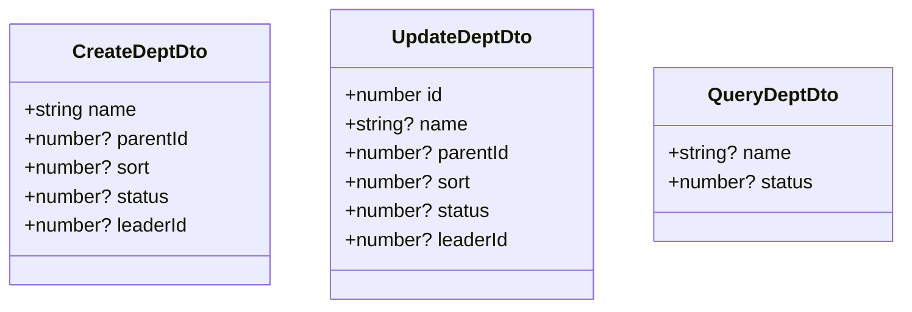
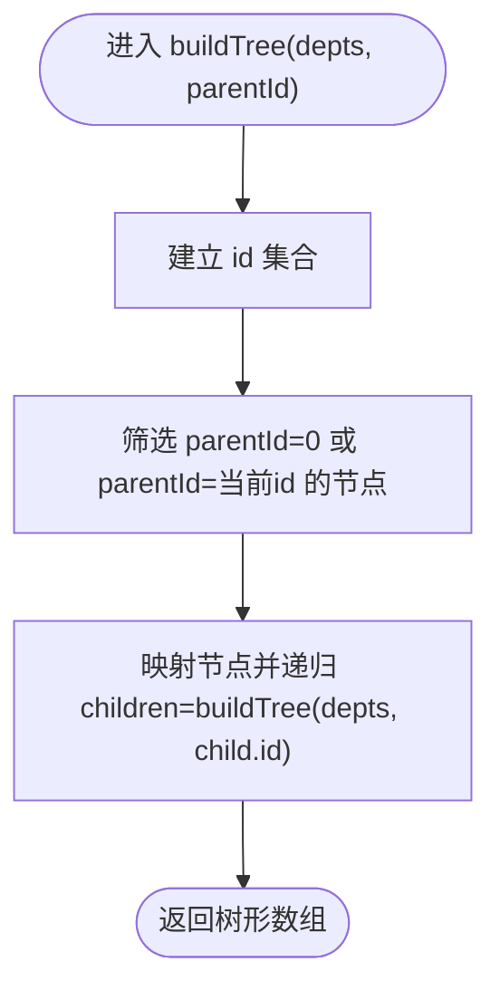
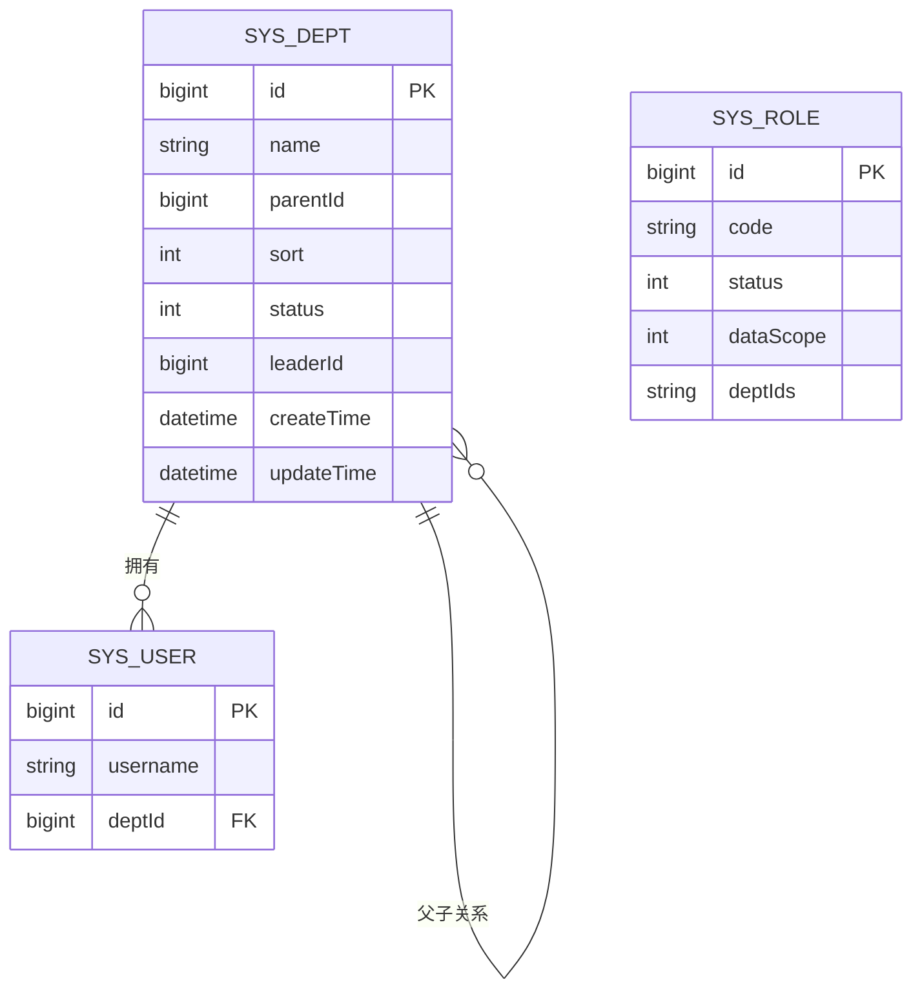
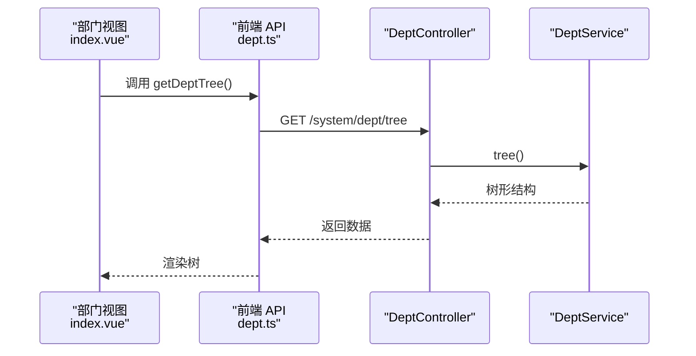
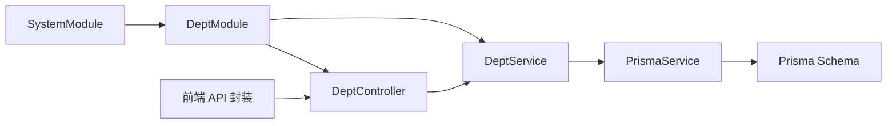

# 部门管理

<cite>
**本文引用的文件**
- [apps/backend/src/modules/system/dept/dept.controller.ts](file://apps/backend/src/modules/system/dept/dept.controller.ts)
- [apps/backend/src/modules/system/dept/dept.service.ts](file://apps/backend/src/modules/system/dept/dept.service.ts)
- [apps/backend/src/modules/system/dept/dto/dept.dto.ts](file://apps/backend/src/modules/system/dept/dto/dept.dto.ts)
- [apps/backend/src/modules/system/dept/dept.module.ts](file://apps/backend/src/modules/system/dept/dept.module.ts)
- [apps/backend/src/modules/system/system.module.ts](file://apps/backend/src/modules/system/system.module.ts)
- [apps/backend/src/auth/guards.ts](file://apps/backend/src/auth/guards.ts)
- [apps/backend/src/common/prisma.service.ts](file://apps/backend/src/common/prisma.service.ts)
- [apps/backend/prisma/schema.prisma](file://apps/backend/prisma/schema.prisma)
- [apps/vben-admin/apps/web-antd/src/api/system/dept.ts](file://apps/vben-admin/apps/web-antd/src/api/system/dept.ts)
- [apps/vben-admin/apps/web-antd/src/views/system/dept/index.vue](file://apps/vben-admin/apps/web-antd/src/views/system/dept/index.vue)
</cite>

## 目录
1. [简介](#简介)
2. [项目结构](#项目结构)
3. [核心组件](#核心组件)
4. [架构总览](#架构总览)
5. [详细组件分析](#详细组件分析)
6. [依赖分析](#依赖分析)
7. [性能考虑](#性能考虑)
8. [故障排查指南](#故障排查指南)
9. [结论](#结论)
10. [附录](#附录)

## 简介
本文件面向“部门管理”子模块，系统性阐述其在系统中的定位、层级结构设计与组织架构实现，覆盖以下关键主题：
- 部门树形结构管理：基于 parentId 的父子关系建模与树构建算法
- 部门 CRUD 操作：列表、树结构、详情、创建、更新、删除
- 部门负责人管理：leaderId 字段与用户关联
- 数据范围控制：结合角色的数据范围字段与部门树联动
- RESTful API 设计：DeptController 的端点与鉴权策略
- 服务层递归算法：buildTree 的层级关系处理
- DTO 校验：CreateDeptDto/UpdateDeptDto/QueryDeptDto 的字段约束与层级校验思路
- 复杂业务场景：父子关系维护、人员统计、权限继承

## 项目结构
部门管理位于后端 NestJS 应用的 system 子模块下，采用按领域分层的模块化组织方式：
- 控制器：负责接收请求、参数解析、鉴权与响应包装
- 服务：封装业务逻辑，包含树形结构构建、CRUD 操作与数据一致性校验
- DTO：输入参数的校验与序列化
- 模块：装配控制器与服务，向系统模块导出能力
- 前端：提供部门列表、树选择、新增/编辑/删除交互

图表来源
- [apps/backend/src/modules/system/system.module.ts:11-22](file://apps/backend/src/modules/system/system.module.ts#L11-L22)
- [apps/backend/src/modules/system/dept/dept.module.ts:5-9](file://apps/backend/src/modules/system/dept/dept.module.ts#L5-L9)
- [apps/backend/src/modules/system/dept/dept.controller.ts:12-15](file://apps/backend/src/modules/system/dept/dept.controller.ts#L12-L15)
- [apps/backend/src/modules/system/dept/dept.service.ts:7](file://apps/backend/src/modules/system/dept/dept.service.ts#L7)
- [apps/backend/src/common/prisma.service.ts](file://apps/backend/src/common/prisma.service.ts)
- [apps/backend/prisma/schema.prisma:58-75](file://apps/backend/prisma/schema.prisma#L58-L75)

章节来源
- [apps/backend/src/modules/system/system.module.ts:11-22](file://apps/backend/src/modules/system/system.module.ts#L11-L22)
- [apps/backend/src/modules/system/dept/dept.module.ts:5-9](file://apps/backend/src/modules/system/dept/dept.module.ts#L5-L9)

## 核心组件
- 控制器（DeptController）：暴露 RESTful 接口，统一鉴权与权限控制
- 服务（DeptService）：实现树形结构构建、CRUD 与删除前检查
- DTO（Create/Update/Query Dept）：参数校验与默认值处理
- 模块（DeptModule）：装配控制器与服务
- 前端 API（dept.ts）：与后端接口对齐的调用封装
- 前端视图（index.vue）：部门列表、树选择、增删改交互

章节来源
- [apps/backend/src/modules/system/dept/dept.controller.ts:14-59](file://apps/backend/src/modules/system/dept/dept.controller.ts#L14-L59)
- [apps/backend/src/modules/system/dept/dept.service.ts:6-72](file://apps/backend/src/modules/system/dept/dept.service.ts#L6-L72)
- [apps/backend/src/modules/system/dept/dto/dept.dto.ts:5-26](file://apps/backend/src/modules/system/dept/dto/dept.dto.ts#L5-L26)
- [apps/backend/src/modules/system/dept/dept.module.ts:5-9](file://apps/backend/src/modules/system/dept/dept.module.ts#L5-L9)
- [apps/vben-admin/apps/web-antd/src/api/system/dept.ts:15-37](file://apps/vben-admin/apps/web-antd/src/api/system/dept.ts#L15-L37)
- [apps/vben-admin/apps/web-antd/src/views/system/dept/index.vue:23-62](file://apps/vben-admin/apps/web-antd/src/views/system/dept/index.vue#L23-L62)

## 架构总览
部门管理遵循“控制器-服务-数据访问”的分层架构，配合 Prisma 对 SysDept 进行持久化，通过 JWT 与权限守卫保障安全。

图表来源
- [apps/vben-admin/apps/web-antd/src/views/system/dept/index.vue:23-29](file://apps/vben-admin/apps/web-antd/src/views/system/dept/index.vue#L23-L29)
- [apps/vben-admin/apps/web-antd/src/api/system/dept.ts:15-21](file://apps/vben-admin/apps/web-antd/src/api/system/dept.ts#L15-L21)
- [apps/backend/src/modules/system/dept/dept.controller.ts:17-29](file://apps/backend/src/modules/system/dept/dept.controller.ts#L17-L29)
- [apps/backend/src/modules/system/dept/dept.service.ts:9-27](file://apps/backend/src/modules/system/dept/dept.service.ts#L9-L27)

## 详细组件分析

### 控制器：DeptController
- 路由前缀：/system/dept
- 鉴权：使用 JwtAuthGuard 与 PermissionGuard，并通过 RequirePermission 注解声明所需权限
- 主要端点：
  - GET /list：按条件查询并返回树形结构
  - GET /tree：返回启用状态的树形结构
  - GET /:id：按 ID 获取部门详情
  - POST：创建部门
  - PUT：更新部门
  - DELETE /:id：删除部门（禁止删除有子部门的节点）

图表来源
- [apps/backend/src/modules/system/dept/dept.controller.ts:14-59](file://apps/backend/src/modules/system/dept/dept.controller.ts#L14-L59)
- [apps/backend/src/auth/guards.ts:17-17](file://apps/backend/src/auth/guards.ts#L17-L17)

章节来源
- [apps/backend/src/modules/system/dept/dept.controller.ts:17-59](file://apps/backend/src/modules/system/dept/dept.controller.ts#L17-L59)
- [apps/backend/src/auth/guards.ts:36-50](file://apps/backend/src/auth/guards.ts#L36-L50)

### 服务：DeptService
- 列表查询：支持按名称模糊匹配与状态过滤，结果按 sort、id 排序后构建树
- 树结构：仅返回 status=1 的节点，构建层级关系
- 树构建算法：buildTree 使用递归与集合查找，先筛选根或指定父节点的节点，再递归填充 children
- 单条查询：未找到抛出异常
- 创建：写入 name、parentId、sort、status、leaderId
- 更新：按 id 查找并更新对应字段
- 删除：若存在子部门则拒绝删除；否则执行删除

图表来源
- [apps/backend/src/modules/system/dept/dept.service.ts:66-71](file://apps/backend/src/modules/system/dept/dept.service.ts#L66-L71)

章节来源
- [apps/backend/src/modules/system/dept/dept.service.ts:9-72](file://apps/backend/src/modules/system/dept/dept.service.ts#L9-L72)

### DTO：部门数据传输对象
- CreateDeptDto：创建时必须提供 name，其他字段可选（parentId 默认 0，sort 默认 0，status 默认 1，leaderId 可空）
- UpdateDeptDto：更新时必须提供 id，其余字段可选
- QueryDeptDto：支持按 name（模糊）、status（数字）查询

图表来源
- [apps/backend/src/modules/system/dept/dto/dept.dto.ts:5-26](file://apps/backend/src/modules/system/dept/dto/dept.dto.ts#L5-L26)

章节来源
- [apps/backend/src/modules/system/dept/dto/dept.dto.ts:5-26](file://apps/backend/src/modules/system/dept/dto/dept.dto.ts#L5-L26)

### 树形结构构建算法
- 输入：SysDept 列表（已排序）
- 过滤：根据 parentId 或是否为根节点（parentId 不在集合内）筛选
- 递归：对每个节点递归构建 children
- 时间复杂度：O(n)，空间复杂度：O(h)，h 为树高

图表来源
- [apps/backend/src/modules/system/dept/dept.service.ts:29-37](file://apps/backend/src/modules/system/dept/dept.service.ts#L29-L37)

章节来源
- [apps/backend/src/modules/system/dept/dept.service.ts:29-37](file://apps/backend/src/modules/system/dept/dept.service.ts#L29-L37)

### 权限与鉴权
- 控制器方法均标注 RequirePermission('system:dept:list')，确保调用者具备相应权限
- 鉴权链路：JwtAuthGuard 提供用户身份，PermissionGuard 校验 permissions 是否包含所需权限

章节来源
- [apps/backend/src/modules/system/dept/dept.controller.ts:18-54](file://apps/backend/src/modules/system/dept/dept.controller.ts#L18-L54)
- [apps/backend/src/auth/guards.ts:36-50](file://apps/backend/src/auth/guards.ts#L36-L50)

### 数据模型与关系
- SysDept：包含 id、name、parentId、sort、status、leaderId、时间戳
- 关系：自引用父子关系（children 与 parent），与 SysUser 建立一对多
- 索引：parentId、sort 用于高效查询与排序

图表来源
- [apps/backend/prisma/schema.prisma:58-75](file://apps/backend/prisma/schema.prisma#L58-L75)
- [apps/backend/prisma/schema.prisma:13-38](file://apps/backend/prisma/schema.prisma#L13-L38)
- [apps/backend/prisma/schema.prisma:40-56](file://apps/backend/prisma/schema.prisma#L40-L56)

章节来源
- [apps/backend/prisma/schema.prisma:58-75](file://apps/backend/prisma/schema.prisma#L58-L75)

### 前端集成
- API 封装：提供 list、tree、detail、create、update、delete 方法
- 视图：加载部门树/列表，支持新增、编辑、删除，TreeSelect 用于选择上级部门

图表来源
- [apps/vben-admin/apps/web-antd/src/views/system/dept/index.vue:23-29](file://apps/vben-admin/apps/web-antd/src/views/system/dept/index.vue#L23-L29)
- [apps/vben-admin/apps/web-antd/src/api/system/dept.ts:19-21](file://apps/vben-admin/apps/web-antd/src/api/system/dept.ts#L19-L21)
- [apps/backend/src/modules/system/dept/dept.controller.ts:24-29](file://apps/backend/src/modules/system/dept/dept.controller.ts#L24-L29)
- [apps/backend/src/modules/system/dept/dept.service.ts:21-27](file://apps/backend/src/modules/system/dept/dept.service.ts#L21-L27)

章节来源
- [apps/vben-admin/apps/web-antd/src/api/system/dept.ts:15-37](file://apps/vben-admin/apps/web-antd/src/api/system/dept.ts#L15-L37)
- [apps/vben-admin/apps/web-antd/src/views/system/dept/index.vue:23-62](file://apps/vben-admin/apps/web-antd/src/views/system/dept/index.vue#L23-L62)

## 依赖分析
- 控制器依赖服务：DeptController 依赖 DeptService 提供的业务能力
- 服务依赖数据访问：DeptService 通过 PrismaService 访问 SysDept
- 模块装配：DeptModule 导出 DeptService，SystemModule 聚合 DeptModule
- 前端依赖后端：前端 API 封装与后端控制器端点一一对应

图表来源
- [apps/backend/src/modules/system/dept/dept.controller.ts:14-15](file://apps/backend/src/modules/system/dept/dept.controller.ts#L14-L15)
- [apps/backend/src/modules/system/dept/dept.service.ts:7](file://apps/backend/src/modules/system/dept/dept.service.ts#L7)
- [apps/backend/src/modules/system/dept/dept.module.ts:5-9](file://apps/backend/src/modules/system/dept/dept.module.ts#L5-L9)
- [apps/backend/src/modules/system/system.module.ts:11-22](file://apps/backend/src/modules/system/system.module.ts#L11-L22)
- [apps/vben-admin/apps/web-antd/src/api/system/dept.ts:15-37](file://apps/vben-admin/apps/web-antd/src/api/system/dept.ts#L15-L37)

章节来源
- [apps/backend/src/modules/system/dept/dept.controller.ts:14-15](file://apps/backend/src/modules/system/dept/dept.controller.ts#L14-L15)
- [apps/backend/src/modules/system/dept/dept.service.ts:7](file://apps/backend/src/modules/system/dept/dept.service.ts#L7)
- [apps/backend/src/modules/system/dept/dept.module.ts:5-9](file://apps/backend/src/modules/system/dept/dept.module.ts#L5-L9)
- [apps/backend/src/modules/system/system.module.ts:11-22](file://apps/backend/src/modules/system/system.module.ts#L11-L22)

## 性能考虑
- 查询排序：按 sort、id 排序，保证树构建顺序稳定且高效
- 索引优化：SysDept 的 parentId、sort 建有索引，有利于树构建与分页查询
- 递归构建：buildTree 为 O(n) 线性扫描+递归，避免嵌套循环
- 批量查询：列表查询支持条件过滤，减少前端二次处理

## 故障排查指南
- 删除失败（提示“不能删除有子部门的节点”）：该部门存在子部门，请先删除或迁移子部门后再试
- 部门未显示：确认 status=1 且 parentId 正确；树接口仅返回启用状态
- 权限不足：调用 /system/dept/* 需具备 system:dept:list 权限
- 参数校验失败：检查 Create/Update DTO 字段类型与必填项

章节来源
- [apps/backend/src/modules/system/dept/dept.service.ts:66-71](file://apps/backend/src/modules/system/dept/dept.service.ts#L66-L71)
- [apps/backend/src/modules/system/dept/dept.controller.ts:18-54](file://apps/backend/src/modules/system/dept/dept.controller.ts#L18-L54)
- [apps/backend/src/modules/system/dept/dto/dept.dto.ts:5-26](file://apps/backend/src/modules/system/dept/dto/dept.dto.ts#L5-L26)

## 结论
部门管理子模块以清晰的分层架构实现了树形组织结构的完整生命周期管理，结合权限守卫与 DTO 校验，确保了安全性与数据一致性。服务层的递归树构建算法简洁高效，适配中大型组织规模。通过与用户、角色模块的协同，可进一步扩展至数据范围控制与权限继承等高级场景。

## 附录
- RESTful 端点一览
  - GET /system/dept/list：部门树（可带 name/status 查询）
  - GET /system/dept/tree：启用状态的部门树
  - GET /system/dept/:id：部门详情
  - POST /system/dept：创建部门
  - PUT /system/dept：更新部门
  - DELETE /system/dept/:id：删除部门（禁止删除有子部门的节点）
- 前端交互要点
  - TreeSelect 使用部门树作为上级部门选择
  - 新增/编辑弹窗校验必填项
  - 删除前二次确认