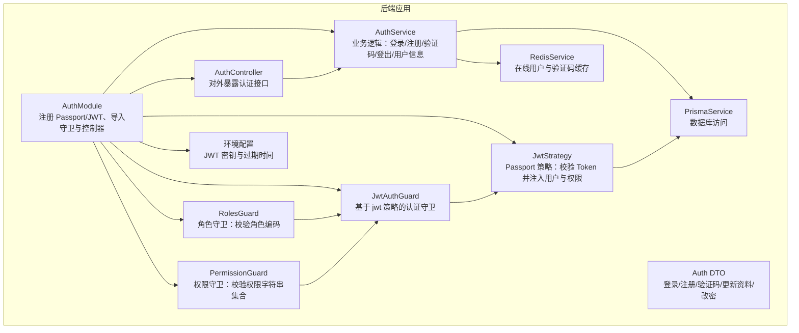
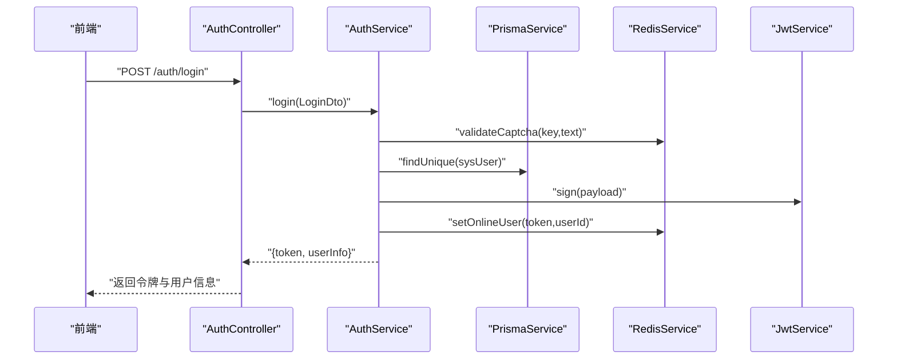
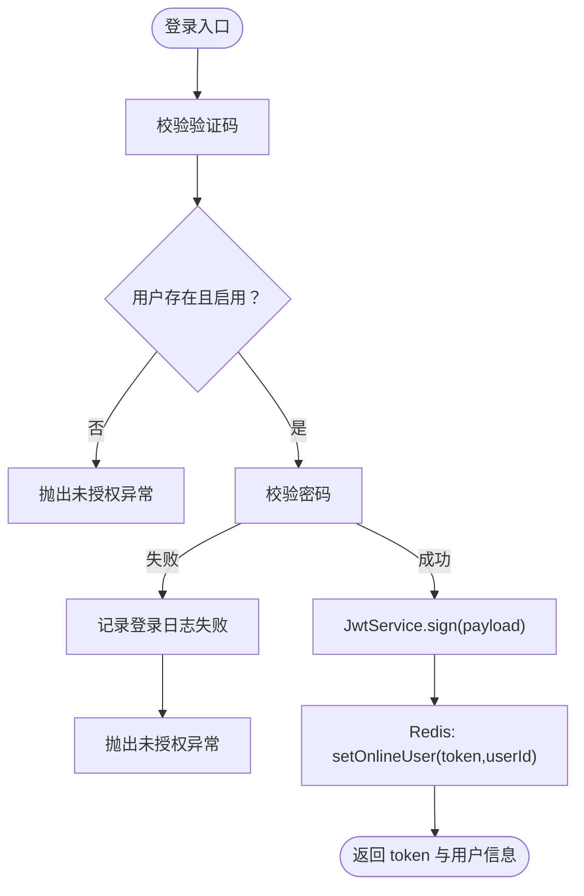
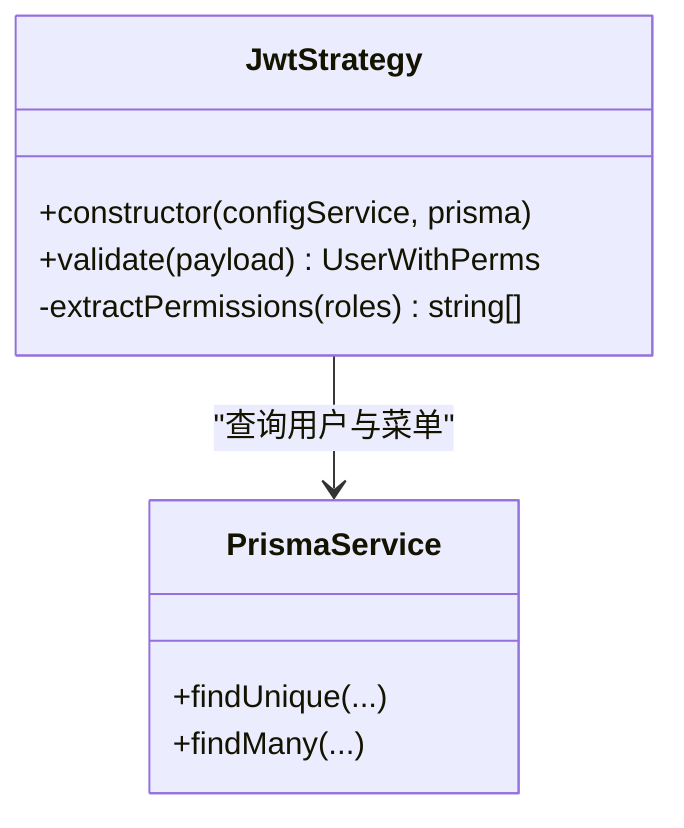
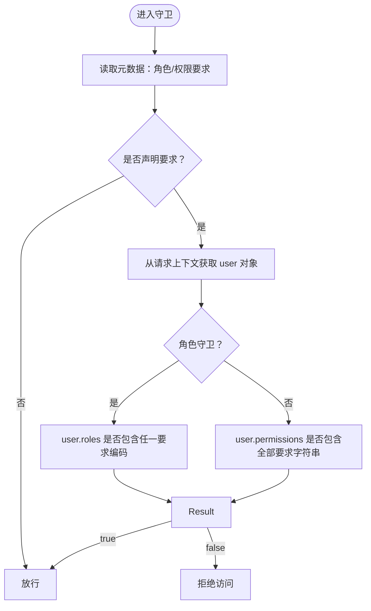
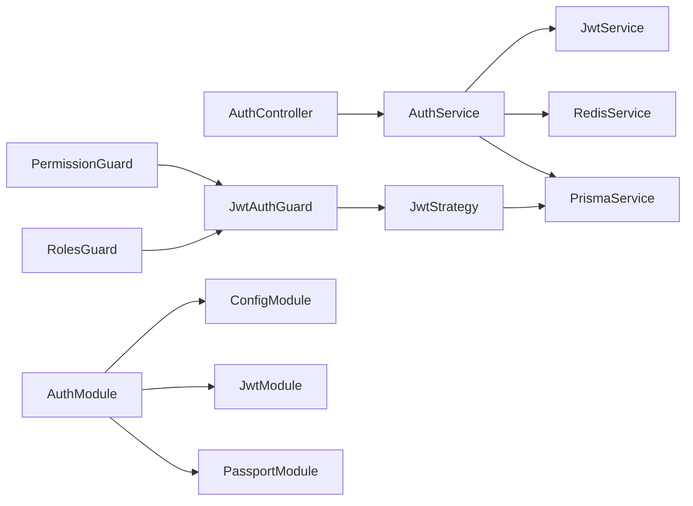

# 认证授权模块

<cite>
**本文引用的文件**
- [apps/backend/src/auth/auth.module.ts](file://apps/backend/src/auth/auth.module.ts)
- [apps/backend/src/auth/auth.controller.ts](file://apps/backend/src/auth/auth.controller.ts)
- [apps/backend/src/auth/auth.service.ts](file://apps/backend/src/auth/auth.service.ts)
- [apps/backend/src/auth/jwt.strategy.ts](file://apps/backend/src/auth/jwt.strategy.ts)
- [apps/backend/src/auth/jwt.guard.ts](file://apps/backend/src/auth/jwt.guard.ts)
- [apps/backend/src/auth/guards.ts](file://apps/backend/src/auth/guards.ts)
- [apps/backend/src/auth/dto/auth.dto.ts](file://apps/backend/src/auth/dto/auth.dto.ts)
- [apps/backend/src/config/env.config.ts](file://apps/backend/src/config/env.config.ts)
- [apps/backend/src/cache/redis.service.ts](file://apps/backend/src/cache/redis.service.ts)
- [apps/backend/src/common/prisma.service.ts](file://apps/backend/src/common/prisma.service.ts)
- [apps/backend/src/app.module.ts](file://apps/backend/src/app.module.ts)
- [apps/vben-admin/apps/web-antd/src/api/core/auth.ts](file://apps/vben-admin/apps/web-antd/src/api/core/auth.ts)
- [apps/vben-admin/apps/web-antd/src/router/guard.ts](file://apps/vben-admin/apps/web-antd/src/router/guard.ts)
- [apps/vben-admin/apps/web-antd/src/store/auth.ts](file://apps/vben-admin/apps/web-antd/src/store/auth.ts)
</cite>

## 目录
1. [简介](#简介)
2. [项目结构](#项目结构)
3. [核心组件](#核心组件)
4. [架构总览](#架构总览)
5. [详细组件分析](#详细组件分析)
6. [依赖关系分析](#依赖关系分析)
7. [性能考量](#性能考量)
8. [故障排查指南](#故障排查指南)
9. [结论](#结论)
10. [附录](#附录)

## 简介
本文件系统性阐述认证授权模块的设计与实现，覆盖以下关键主题：
- JWT 认证机制：配置、签发与验证流程
- Passport 策略：从请求头提取 Token 并校验用户状态
- 角色权限守卫：基于元数据的角色与权限校验
- 按钮级权限控制：菜单权限字符串到前端的映射与使用
- 认证流程：登录、注册、验证码、登出、个人信息获取
- 中间件与全局守卫：全局异常过滤器、拦截器、节流保护
- 错误处理策略与安全最佳实践
- 在控制器中使用守卫的实际示例路径与扩展建议

## 项目结构
认证授权模块位于后端应用的 auth 目录，围绕 NestJS 的 Passport 与 JWT 模块构建，并通过 Prisma 进行数据库访问，Redis 实现在线用户与验证码缓存。

**图表来源**
- [apps/backend/src/auth/auth.module.ts:11-28](file://apps/backend/src/auth/auth.module.ts#L11-L28)
- [apps/backend/src/auth/auth.controller.ts:9-11](file://apps/backend/src/auth/auth.controller.ts#L9-L11)
- [apps/backend/src/auth/auth.service.ts:20-27](file://apps/backend/src/auth/auth.service.ts#L20-L27)
- [apps/backend/src/auth/jwt.strategy.ts:7-18](file://apps/backend/src/auth/jwt.strategy.ts#L7-L18)
- [apps/backend/src/auth/jwt.guard.ts:1-5](file://apps/backend/src/auth/jwt.guard.ts#L1-L5)
- [apps/backend/src/auth/guards.ts:19-50](file://apps/backend/src/auth/guards.ts#L19-L50)
- [apps/backend/src/auth/dto/auth.dto.ts:1-91](file://apps/backend/src/auth/dto/auth.dto.ts#L1-L91)
- [apps/backend/src/config/env.config.ts:3-22](file://apps/backend/src/config/env.config.ts#L3-L22)
- [apps/backend/src/common/prisma.service.ts:5-21](file://apps/backend/src/common/prisma.service.ts#L5-L21)
- [apps/backend/src/cache/redis.service.ts:5-27](file://apps/backend/src/cache/redis.service.ts#L5-L27)

**章节来源**
- [apps/backend/src/auth/auth.module.ts:1-29](file://apps/backend/src/auth/auth.module.ts#L1-L29)
- [apps/backend/src/app.module.ts:18-58](file://apps/backend/src/app.module.ts#L18-L58)

## 核心组件
- AuthModule：集中注册 Passport 默认策略为 jwt；异步配置 JwtModule 的 secret 与过期时间；导出 AuthService 与各类守卫供其他模块使用
- AuthController：提供登录、注册、验证码、登出、用户信息、在线用户、个人资料、修改密码等接口
- AuthService：实现登录校验（验证码、用户名、密码）、签发 JWT、记录登录日志、构建用户菜单树、在线用户管理、密码更新等
- JwtStrategy：从 Authorization 头解析 Bearer Token，校验用户存在性与状态，聚合角色与权限
- JwtAuthGuard：基于 jwt 策略的认证守卫
- RolesGuard：基于元数据的角色编码校验
- PermissionGuard：基于元数据的权限字符串集合校验
- Auth DTO：对登录、注册、验证码、更新资料、修改密码等输入进行校验
- 环境配置：读取 JWT 密钥与过期时间
- RedisService：验证码存储与在线用户集合维护
- PrismaService：数据库连接与访问

**章节来源**
- [apps/backend/src/auth/auth.module.ts:11-28](file://apps/backend/src/auth/auth.module.ts#L11-L28)
- [apps/backend/src/auth/auth.controller.ts:1-87](file://apps/backend/src/auth/auth.controller.ts#L1-L87)
- [apps/backend/src/auth/auth.service.ts:20-294](file://apps/backend/src/auth/auth.service.ts#L20-L294)
- [apps/backend/src/auth/jwt.strategy.ts:7-78](file://apps/backend/src/auth/jwt.strategy.ts#L7-L78)
- [apps/backend/src/auth/jwt.guard.ts:1-5](file://apps/backend/src/auth/jwt.guard.ts#L1-L5)
- [apps/backend/src/auth/guards.ts:1-51](file://apps/backend/src/auth/guards.ts#L1-L51)
- [apps/backend/src/auth/dto/auth.dto.ts:1-91](file://apps/backend/src/auth/dto/auth.dto.ts#L1-L91)
- [apps/backend/src/config/env.config.ts:3-22](file://apps/backend/src/config/env.config.ts#L3-L22)
- [apps/backend/src/cache/redis.service.ts:5-128](file://apps/backend/src/cache/redis.service.ts#L5-L128)
- [apps/backend/src/common/prisma.service.ts:5-22](file://apps/backend/src/common/prisma.service.ts#L5-L22)

## 架构总览
认证授权模块采用“策略 + 守卫”的分层设计：
- 策略层：JwtStrategy 负责 Token 解析与用户/权限注入
- 守卫层：JwtAuthGuard（认证）、RolesGuard（角色）、PermissionGuard（权限）负责不同粒度的访问控制
- 控制器层：AuthController 通过装饰器组合使用守卫，暴露 REST 接口
- 数据与缓存：AuthService 组合 Prisma 与 Redis，完成业务与状态持久化

**图表来源**
- [apps/backend/src/auth/auth.controller.ts:13-19](file://apps/backend/src/auth/auth.controller.ts#L13-L19)
- [apps/backend/src/auth/auth.service.ts:29-89](file://apps/backend/src/auth/auth.service.ts#L29-L89)
- [apps/backend/src/cache/redis.service.ts:83-91](file://apps/backend/src/cache/redis.service.ts#L83-L91)
- [apps/backend/src/common/prisma.service.ts:5-22](file://apps/backend/src/common/prisma.service.ts#L5-L22)

## 详细组件分析

### JWT 配置与 Token 签发/验证
- 配置来源：通过 ConfigModule 注入 ConfigService，从环境变量 app.jwtSecret 与 app.jwtExpiresIn 读取密钥与过期时间
- 签发：登录成功后根据用户 ID 与用户名构造 payload，调用 JwtService.sign 生成 token
- 验证：JwtStrategy 从 Authorization 头提取 Bearer Token，校验过期与签名，查询用户并注入角色与权限

**图表来源**
- [apps/backend/src/auth/auth.service.ts:29-89](file://apps/backend/src/auth/auth.service.ts#L29-L89)
- [apps/backend/src/auth/jwt.strategy.ts:20-43](file://apps/backend/src/auth/jwt.strategy.ts#L20-L43)
- [apps/backend/src/cache/redis.service.ts:83-91](file://apps/backend/src/cache/redis.service.ts#L83-L91)

**章节来源**
- [apps/backend/src/auth/auth.module.ts:14-23](file://apps/backend/src/auth/auth.module.ts#L14-L23)
- [apps/backend/src/config/env.config.ts:3-22](file://apps/backend/src/config/env.config.ts#L3-L22)
- [apps/backend/src/auth/auth.service.ts:62-64](file://apps/backend/src/auth/auth.service.ts#L62-L64)

### Passport 策略配置与实现
- JwtStrategy 初始化时设置从 Authorization 头提取 Bearer Token、禁用过期忽略、读取密钥
- validate 方法：查询用户、校验状态、聚合角色与权限，返回包含用户与权限的对象
- 权限聚合规则：超级管理员拥有所有菜单权限字符串；普通用户由其角色绑定的菜单 ID 集合推导

**图表来源**
- [apps/backend/src/auth/jwt.strategy.ts:7-78](file://apps/backend/src/auth/jwt.strategy.ts#L7-L78)
- [apps/backend/src/common/prisma.service.ts:5-22](file://apps/backend/src/common/prisma.service.ts#L5-L22)

**章节来源**
- [apps/backend/src/auth/jwt.strategy.ts:9-43](file://apps/backend/src/auth/jwt.strategy.ts#L9-L43)

### 角色权限守卫与按钮级权限控制
- 元数据装饰器：
  - Public：标记接口无需认证
  - RequireRole：声明所需角色编码集合
  - RequirePermission：声明所需权限字符串集合
- RolesGuard：若未声明角色要求则放行；否则检查用户角色编码是否包含任一要求
- PermissionGuard：若未声明权限要求则放行；否则检查用户权限字符串集合是否包含全部要求
- 使用场景：在控制器方法或类上使用装饰器，结合 JwtAuthGuard 实现细粒度访问控制

**图表来源**
- [apps/backend/src/auth/guards.ts:19-50](file://apps/backend/src/auth/guards.ts#L19-L50)

**章节来源**
- [apps/backend/src/auth/guards.ts:10-17](file://apps/backend/src/auth/guards.ts#L10-L17)
- [apps/backend/src/auth/guards.ts:19-50](file://apps/backend/src/auth/guards.ts#L19-L50)

### 认证 DTO 定义
- LoginDto：用户名、密码、验证码键、验证码文本
- RegisterDto：用户名、密码、昵称
- CaptchaDto：验证码键、验证码文本
- UpdateProfileDto：昵称、邮箱、电话、头像、备注
- UpdatePasswordDto：旧密码、新密码（最小长度约束）

这些 DTO 用于控制器参数校验，确保输入合法性。

**章节来源**
- [apps/backend/src/auth/dto/auth.dto.ts:43-91](file://apps/backend/src/auth/dto/auth.dto.ts#L43-L91)

### 控制器中的守卫使用示例
- 公开接口：使用 Public 装饰器，如登录、注册、验证码、验证码校验
- 需认证接口：使用 JwtAuthGuard，如登出、获取用户信息、在线用户、个人资料、修改密码
- 可结合角色/权限守卫：在控制器方法或类上添加 RequireRole 或 RequirePermission 装饰器

示例路径（不展示具体代码内容）：
- [apps/backend/src/auth/auth.controller.ts:13-19](file://apps/backend/src/auth/auth.controller.ts#L13-L19)
- [apps/backend/src/auth/auth.controller.ts:21-26](file://apps/backend/src/auth/auth.controller.ts#L21-L26)
- [apps/backend/src/auth/auth.controller.ts:28-42](file://apps/backend/src/auth/auth.controller.ts#L28-L42)
- [apps/backend/src/auth/auth.controller.ts:44-51](file://apps/backend/src/auth/auth.controller.ts#L44-L51)
- [apps/backend/src/auth/auth.controller.ts:53-58](file://apps/backend/src/auth/auth.controller.ts#L53-L58)
- [apps/backend/src/auth/auth.controller.ts:67-72](file://apps/backend/src/auth/auth.controller.ts#L67-L72)
- [apps/backend/src/auth/auth.controller.ts:74-86](file://apps/backend/src/auth/auth.controller.ts#L74-L86)

**章节来源**
- [apps/backend/src/auth/auth.controller.ts:1-87](file://apps/backend/src/auth/auth.controller.ts#L1-L87)

### 权限验证机制与菜单树构建
- 用户信息接口会根据用户角色计算可访问菜单 ID 集合，构建嵌套菜单树（过滤掉隐藏与非路由类型）
- 权限字符串来源于菜单的 perms 字段，超级管理员拥有所有非空权限字符串
- 前端据此生成可访问菜单与路由，并将权限码写入访问状态，用于按钮级权限控制

**章节来源**
- [apps/backend/src/auth/auth.service.ts:135-187](file://apps/backend/src/auth/auth.service.ts#L135-L187)
- [apps/backend/src/auth/jwt.strategy.ts:45-76](file://apps/backend/src/auth/jwt.strategy.ts#L45-L76)

### 认证中间件与全局配置
- 全局守卫：ThrottlerGuard（限流）
- 全局异常过滤器：统一异常格式
- 全局拦截器：响应体转换、操作日志拦截
- AuthModule 内部注册 Passport 默认策略为 jwt，并异步配置 JwtModule 的 secret 与过期时间

**章节来源**
- [apps/backend/src/app.module.ts:39-56](file://apps/backend/src/app.module.ts#L39-L56)
- [apps/backend/src/auth/auth.module.ts:11-28](file://apps/backend/src/auth/auth.module.ts#L11-L28)

### 前端集成与路由守卫
- 前端通过 API 层发起登录、获取验证码、登出、获取用户信息等请求
- 登录成功后将 token 存入访问状态，拉取用户信息并设置权限码
- 路由守卫根据访问状态与用户角色生成可访问菜单与路由，实现页面级与按钮级权限控制

**章节来源**
- [apps/vben-admin/apps/web-antd/src/api/core/auth.ts:68-91](file://apps/vben-admin/apps/web-antd/src/api/core/auth.ts#L68-L91)
- [apps/vben-admin/apps/web-antd/src/store/auth.ts:27-88](file://apps/vben-admin/apps/web-antd/src/store/auth.ts#L27-L88)
- [apps/vben-admin/apps/web-antd/src/router/guard.ts:47-120](file://apps/vben-admin/apps/web-antd/src/router/guard.ts#L47-L120)

## 依赖关系分析

**图表来源**
- [apps/backend/src/auth/auth.controller.ts:1-11](file://apps/backend/src/auth/auth.controller.ts#L1-L11)
- [apps/backend/src/auth/auth.service.ts:20-27](file://apps/backend/src/auth/auth.service.ts#L20-L27)
- [apps/backend/src/auth/jwt.strategy.ts:7-18](file://apps/backend/src/auth/jwt.strategy.ts#L7-L18)
- [apps/backend/src/auth/jwt.guard.ts:1-5](file://apps/backend/src/auth/jwt.guard.ts#L1-L5)
- [apps/backend/src/auth/guards.ts:19-50](file://apps/backend/src/auth/guards.ts#L19-L50)
- [apps/backend/src/auth/auth.module.ts:11-28](file://apps/backend/src/auth/auth.module.ts#L11-L28)

**章节来源**
- [apps/backend/src/auth/auth.module.ts:1-29](file://apps/backend/src/auth/auth.module.ts#L1-L29)

## 性能考量
- Token 过期时间：通过配置项控制，默认 7 天，可根据业务调整
- 缓存命中：验证码与在线用户均使用 Redis，注意 TTL 设置与键空间清理
- 查询优化：权限聚合与菜单树构建涉及多表查询，建议在菜单与角色关联字段建立索引
- 并发与限流：全局 ThrottlerGuard 提供基础限流保护，建议针对登录接口单独限流策略

[本节为通用指导，无需列出具体文件来源]

## 故障排查指南
- 未授权异常
  - 用户名或密码错误、账户被禁用、用户不存在或已删除
  - 验证码无效或过期
- Token 相关
  - 签名密钥不一致、过期时间配置错误、请求头未携带 Bearer Token
- 权限不足
  - 用户角色不满足 RequireRole 要求、缺少 RequiredPermission 所需权限字符串
- 登录日志与在线用户
  - 登录失败会记录日志；登出会移除在线用户；可通过 Redis 查看在线集合

**章节来源**
- [apps/backend/src/auth/auth.service.ts:30-60](file://apps/backend/src/auth/auth.service.ts#L30-L60)
- [apps/backend/src/auth/jwt.strategy.ts:20-28](file://apps/backend/src/auth/jwt.strategy.ts#L20-L28)
- [apps/backend/src/cache/redis.service.ts:82-99](file://apps/backend/src/cache/redis.service.ts#L82-L99)

## 结论
本认证授权模块以 JWT 为核心，结合 Passport 策略与自定义守卫，实现了从登录到权限控制的完整闭环。通过环境配置灵活管理密钥与过期时间，利用 Redis 与 Prisma 提升性能与可靠性。前端配合路由守卫与权限码，实现页面与按钮级精细化控制。建议在生产环境中强化密钥管理、完善审计日志与监控告警，并针对高并发场景优化缓存与数据库访问。

[本节为总结性内容，无需列出具体文件来源]

## 附录

### JWT 配置选项
- app.jwtSecret：JWT 签名密钥
- app.jwtExpiresIn：Token 过期间隔（如 7d）

**章节来源**
- [apps/backend/src/config/env.config.ts:3-22](file://apps/backend/src/config/env.config.ts#L3-L22)
- [apps/backend/src/auth/auth.module.ts:14-23](file://apps/backend/src/auth/auth.module.ts#L14-L23)

### 认证 DTO 字段说明
- 登录：用户名、密码、验证码键、验证码文本
- 注册：用户名、密码、昵称
- 验证码：键、文本
- 更新资料：昵称、邮箱、电话、头像、备注
- 修改密码：旧密码、新密码（最小长度约束）

**章节来源**
- [apps/backend/src/auth/dto/auth.dto.ts:43-91](file://apps/backend/src/auth/dto/auth.dto.ts#L43-L91)

### 守卫使用场景与实现原理
- JwtAuthGuard：基于 passport-jwt 的认证守卫
- RolesGuard：基于元数据的角色编码匹配
- PermissionGuard：基于元数据的权限字符串集合匹配
- Public：跳过认证流程

**章节来源**
- [apps/backend/src/auth/jwt.guard.ts:1-5](file://apps/backend/src/auth/jwt.guard.ts#L1-L5)
- [apps/backend/src/auth/guards.ts:10-17](file://apps/backend/src/auth/guards.ts#L10-L17)
- [apps/backend/src/auth/guards.ts:19-50](file://apps/backend/src/auth/guards.ts#L19-L50)

### 在控制器中使用守卫的示例路径
- 登录：[apps/backend/src/auth/auth.controller.ts:13-19](file://apps/backend/src/auth/auth.controller.ts#L13-L19)
- 注册：[apps/backend/src/auth/auth.controller.ts:21-26](file://apps/backend/src/auth/auth.controller.ts#L21-L26)
- 验证码：[apps/backend/src/auth/auth.controller.ts:28-42](file://apps/backend/src/auth/auth.controller.ts#L28-L42)
- 登出：[apps/backend/src/auth/auth.controller.ts:44-51](file://apps/backend/src/auth/auth.controller.ts#L44-L51)
- 用户信息：[apps/backend/src/auth/auth.controller.ts:53-58](file://apps/backend/src/auth/auth.controller.ts#L53-L58)
- 在线用户：[apps/backend/src/auth/auth.controller.ts:60-65](file://apps/backend/src/auth/auth.controller.ts#L60-L65)
- 个人资料：[apps/backend/src/auth/auth.controller.ts:67-72](file://apps/backend/src/auth/auth.controller.ts#L67-L72)
- 修改密码：[apps/backend/src/auth/auth.controller.ts:74-86](file://apps/backend/src/auth/auth.controller.ts#L74-L86)

**章节来源**
- [apps/backend/src/auth/auth.controller.ts:1-87](file://apps/backend/src/auth/auth.controller.ts#L1-L87)