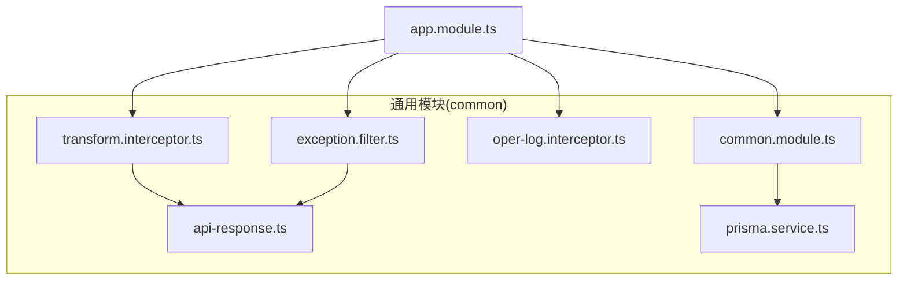
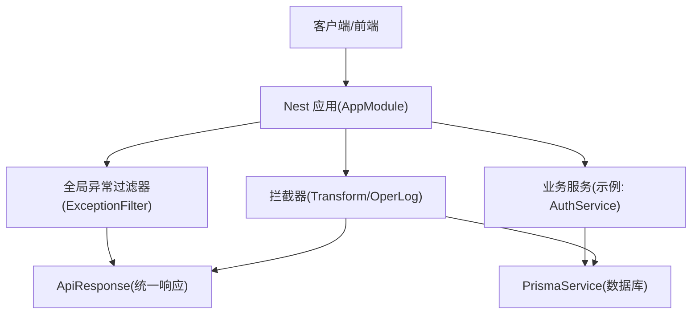
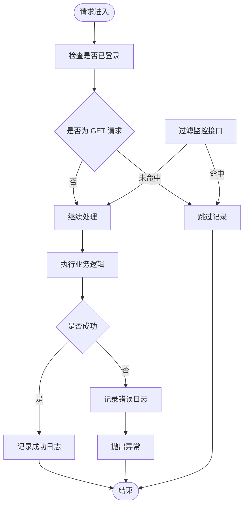
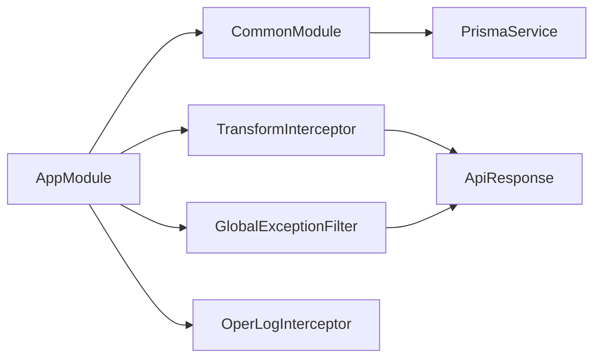

# 通用模块

<cite>
**本文引用的文件**
- [apps/backend/src/common/common.module.ts](file://apps/backend/src/common/common.module.ts)
- [apps/backend/src/common/api-response.ts](file://apps/backend/src/common/api-response.ts)
- [apps/backend/src/common/exception.filter.ts](file://apps/backend/src/common/exception.filter.ts)
- [apps/backend/src/common/oper-log.interceptor.ts](file://apps/backend/src/common/oper-log.interceptor.ts)
- [apps/backend/src/common/transform.interceptor.ts](file://apps/backend/src/common/transform.interceptor.ts)
- [apps/backend/src/common/prisma.service.ts](file://apps/backend/src/common/prisma.service.ts)
- [apps/backend/src/app.module.ts](file://apps/backend/src/app.module.ts)
- [apps/backend/src/auth/auth.service.ts](file://apps/backend/src/auth/auth.service.ts)
</cite>

## 目录
1. [简介](#简介)
2. [项目结构](#项目结构)
3. [核心组件](#核心组件)
4. [架构总览](#架构总览)
5. [详细组件分析](#详细组件分析)
6. [依赖关系分析](#依赖关系分析)
7. [性能考量](#性能考量)
8. [故障排查指南](#故障排查指南)
9. [结论](#结论)
10. [附录](#附录)

## 简介
本文件系统化梳理通用模块提供的基础设施能力，覆盖统一 API 响应格式、全局异常处理、操作日志拦截器、数据转换拦截器与数据库连接管理。文档从架构视角解释中间件的作用机制、配置选项与适用场景，并给出响应标准化策略、错误码规范、日志记录格式与性能监控集成建议。最后提供中间件配置指南、自定义扩展方法与最佳实践，以及具体使用示例与调试技巧。

## 项目结构
通用模块位于后端应用的 common 目录，围绕统一响应、异常过滤、拦截器与数据库客户端封装形成基础层，供业务模块复用。

图示来源
- [apps/backend/src/common/common.module.ts:1-9](file://apps/backend/src/common/common.module.ts#L1-L9)
- [apps/backend/src/common/api-response.ts:1-35](file://apps/backend/src/common/api-response.ts#L1-L35)
- [apps/backend/src/common/exception.filter.ts:1-37](file://apps/backend/src/common/exception.filter.ts#L1-L37)
- [apps/backend/src/common/oper-log.interceptor.ts:1-111](file://apps/backend/src/common/oper-log.interceptor.ts#L1-L111)
- [apps/backend/src/common/transform.interceptor.ts:1-29](file://apps/backend/src/common/transform.interceptor.ts#L1-L29)
- [apps/backend/src/common/prisma.service.ts:1-22](file://apps/backend/src/common/prisma.service.ts#L1-L22)
- [apps/backend/src/app.module.ts:1-59](file://apps/backend/src/app.module.ts#L1-L59)

章节来源
- [apps/backend/src/common/common.module.ts:1-9](file://apps/backend/src/common/common.module.ts#L1-L9)
- [apps/backend/src/app.module.ts:1-59](file://apps/backend/src/app.module.ts#L1-L59)

## 核心组件
- 统一 API 响应格式：提供标准字段与静态工厂方法，便于全链路输出一致的数据契约。
- 全局异常处理：捕获未处理异常与 HttpException，统一返回标准化错误响应。
- 数据转换拦截器：将控制器返回值包装为统一响应格式，避免重复样板代码。
- 操作日志拦截器：在请求生命周期内记录用户、URL、参数、耗时、结果与错误等信息。
- 数据库连接管理：基于 Prisma 的客户端封装，提供连接初始化、断开与日志级别控制。

章节来源
- [apps/backend/src/common/api-response.ts:1-35](file://apps/backend/src/common/api-response.ts#L1-L35)
- [apps/backend/src/common/exception.filter.ts:1-37](file://apps/backend/src/common/exception.filter.ts#L1-L37)
- [apps/backend/src/common/transform.interceptor.ts:1-29](file://apps/backend/src/common/transform.interceptor.ts#L1-L29)
- [apps/backend/src/common/oper-log.interceptor.ts:1-111](file://apps/backend/src/common/oper-log.interceptor.ts#L1-L111)
- [apps/backend/src/common/prisma.service.ts:1-22](file://apps/backend/src/common/prisma.service.ts#L1-L22)

## 架构总览
通用模块通过全局注册的方式接入应用，形成“统一响应 + 异常过滤 + 拦截器”的基础设施层，业务模块无需关心底层细节即可获得一致的交互体验与可观测性。

图示来源
- [apps/backend/src/app.module.ts:18-58](file://apps/backend/src/app.module.ts#L18-L58)
- [apps/backend/src/common/exception.filter.ts:12-36](file://apps/backend/src/common/exception.filter.ts#L12-L36)
- [apps/backend/src/common/transform.interceptor.ts:11-28](file://apps/backend/src/common/transform.interceptor.ts#L11-L28)
- [apps/backend/src/common/oper-log.interceptor.ts:11-27](file://apps/backend/src/common/oper-log.interceptor.ts#L11-L27)
- [apps/backend/src/common/api-response.ts:1-35](file://apps/backend/src/common/api-response.ts#L1-L35)
- [apps/backend/src/common/prisma.service.ts:4-21](file://apps/backend/src/common/prisma.service.ts#L4-L21)

## 详细组件分析

### 统一 API 响应格式
- 设计要点
  - 固定字段：状态码、数据体、消息。
  - 工厂方法：success/error/unauthorized/forbidden/notFound/badRequest 等，便于快速构建标准响应。
- 使用场景
  - 控制器直接返回业务数据时，由数据转换拦截器自动包装。
  - 业务逻辑中显式构造错误响应，保持前后端契约一致。
- 配置与扩展
  - 可在工厂方法基础上增加上下文字段（如 traceId、timestamp）以增强可观测性。
  - 若需分页/树形结构等特殊包装，可在拦截器或业务层二次封装。

章节来源
- [apps/backend/src/common/api-response.ts:1-35](file://apps/backend/src/common/api-response.ts#L1-L35)

### 全局异常处理
- 作用机制
  - 捕获所有未处理异常与 HttpException，提取状态码与消息，统一返回标准化错误响应。
  - 对未识别异常记录错误日志，避免异常泄漏。
- 错误码规范建议
  - 1xx：信息提示类（保留）
  - 2xx：成功（统一使用 200）
  - 4xx：客户端错误（400/401/403/404）
  - 5xx：服务端错误（500）
  - 可扩展自定义业务错误码区间（如 1000+），并与消息映射表配合。
- 日志与监控
  - 未捕获异常写入日志，便于追踪堆栈。
  - 结合监控系统上报错误指标与 P99。

章节来源
- [apps/backend/src/common/exception.filter.ts:12-36](file://apps/backend/src/common/exception.filter.ts#L12-L36)
- [apps/backend/src/common/api-response.ts:16-34](file://apps/backend/src/common/api-response.ts#L16-L34)

### 数据转换拦截器
- 作用机制
  - 在请求处理完成后，将返回值包装为统一响应格式。
  - 若返回值已是统一响应对象，则透传，避免重复包装。
- 性能与兼容性
  - map 操作轻量，对整体性能影响可忽略。
  - 与 Swagger/文档工具配合良好，统一契约利于生成文档。
- 自定义扩展
  - 可在 map 中加入序列化前处理（如脱敏、字段裁剪）。
  - 可按模块/控制器粒度启用/禁用该拦截器。

章节来源
- [apps/backend/src/common/transform.interceptor.ts:11-28](file://apps/backend/src/common/transform.interceptor.ts#L11-L28)
- [apps/backend/src/common/api-response.ts:12-18](file://apps/backend/src/common/api-response.ts#L12-L18)

### 操作日志拦截器
- 作用机制
  - 在请求生命周期内记录开始时间，成功时写入成功日志，失败时写入错误日志。
  - 记录用户信息、URL、请求方法、参数、响应结果、耗时、IP、错误信息等。
- 过滤策略
  - 跳过 GET 请求与特定监控接口，降低日志噪音。
  - 仅对已登录用户记录，避免匿名访问日志污染。
- 参数脱敏
  - 对包含敏感关键词的字段进行脱敏处理，保障数据安全。
- 日志格式与存储
  - 建议统一 JSON 字段结构，便于检索与可视化。
  - 写入数据库时注意字段长度限制与索引设计（如用户ID、模块名、耗时）。
- 性能监控集成
  - 将耗时指标上报监控系统，结合 P95/P99 分析热点接口。
  - 对异常率与错误类型进行聚合统计。

图示来源
- [apps/backend/src/common/oper-log.interceptor.ts:15-27](file://apps/backend/src/common/oper-log.interceptor.ts#L15-L27)
- [apps/backend/src/common/oper-log.interceptor.ts:30-61](file://apps/backend/src/common/oper-log.interceptor.ts#L30-L61)
- [apps/backend/src/common/oper-log.interceptor.ts:63-70](file://apps/backend/src/common/oper-log.interceptor.ts#L63-L70)
- [apps/backend/src/common/oper-log.interceptor.ts:81-99](file://apps/backend/src/common/oper-log.interceptor.ts#L81-L99)

章节来源
- [apps/backend/src/common/oper-log.interceptor.ts:11-111](file://apps/backend/src/common/oper-log.interceptor.ts#L11-L111)

### 数据库连接管理
- 设计要点
  - 基于 PrismaClient 扩展，配置日志级别（错误/警告）。
  - 在模块初始化与销毁阶段自动连接/断开，保证生命周期可控。
- 连接池与高可用
  - 可通过环境变量配置连接池大小、超时时间等参数（在 Prisma 客户端层面）。
  - 建议在生产环境开启连接健康检查与重连策略。
- 事务与并发
  - 在拦截器或服务层合理使用事务，避免长事务导致锁竞争。
  - 对高频写入接口进行限流与降级准备。

章节来源
- [apps/backend/src/common/prisma.service.ts:4-21](file://apps/backend/src/common/prisma.service.ts#L4-L21)

## 依赖关系分析
通用模块通过全局模块导出数据库服务，应用主模块集中注册异常过滤器与拦截器，形成“基础设施 → 应用入口 → 业务服务”的清晰分层。

图示来源
- [apps/backend/src/app.module.ts:39-56](file://apps/backend/src/app.module.ts#L39-L56)
- [apps/backend/src/common/common.module.ts:4-8](file://apps/backend/src/common/common.module.ts#L4-L8)
- [apps/backend/src/common/exception.filter.ts:12-36](file://apps/backend/src/common/exception.filter.ts#L12-L36)
- [apps/backend/src/common/transform.interceptor.ts:11-28](file://apps/backend/src/common/transform.interceptor.ts#L11-L28)
- [apps/backend/src/common/oper-log.interceptor.ts:11-27](file://apps/backend/src/common/oper-log.interceptor.ts#L11-L27)
- [apps/backend/src/common/api-response.ts:1-35](file://apps/backend/src/common/api-response.ts#L1-L35)

章节来源
- [apps/backend/src/app.module.ts:18-58](file://apps/backend/src/app.module.ts#L18-L58)
- [apps/backend/src/common/common.module.ts:1-9](file://apps/backend/src/common/common.module.ts#L1-L9)

## 性能考量
- 响应标准化
  - 通过拦截器统一包装，减少重复序列化与样板代码，提升一致性与可维护性。
- 异常处理
  - 全局过滤器避免业务层分散处理异常，降低分支复杂度与潜在遗漏。
- 操作日志
  - 对敏感字段脱敏与长度截断，防止日志过大影响 IO。
  - 合理选择记录范围（排除 GET 与监控接口），降低写入压力。
- 数据库
  - 合理设置日志级别，避免过多警告/错误日志影响性能。
  - 使用连接池与事务优化，避免频繁连接/断开带来的开销。

## 故障排查指南
- 统一响应未生效
  - 检查应用模块是否正确注册了数据转换拦截器。
  - 排查业务返回值是否已被拦截器包裹。
- 异常未被全局过滤器捕获
  - 确认异常类型是否为 HttpException 或 Error。
  - 查看日志中是否有未捕获异常的堆栈信息。
- 操作日志缺失
  - 确认请求是否已登录且非 GET。
  - 检查是否命中了监控接口过滤规则。
  - 核对数据库写入是否报错（拦截器内部已吞掉写入异常，但可通过日志定位）。
- 数据库连接问题
  - 关注 PrismaService 初始化与销毁日志，确认连接状态。
  - 检查环境变量与连接字符串配置。

章节来源
- [apps/backend/src/app.module.ts:39-56](file://apps/backend/src/app.module.ts#L39-L56)
- [apps/backend/src/common/oper-log.interceptor.ts:30-61](file://apps/backend/src/common/oper-log.interceptor.ts#L30-L61)
- [apps/backend/src/common/prisma.service.ts:14-21](file://apps/backend/src/common/prisma.service.ts#L14-L21)

## 结论
通用模块通过统一响应、全局异常处理、拦截器与数据库封装，为上层业务提供了稳定、可观测、易扩展的基础能力。遵循本文的配置与最佳实践，可在保证一致性的同时提升开发效率与系统稳定性。

## 附录

### 中间件配置指南
- 注册顺序
  - 先注册全局异常过滤器，再注册拦截器，最后注册数据库服务。
- 拦截器启用策略
  - 可按模块/控制器粒度启用/禁用数据转换拦截器，满足差异化需求。
  - 操作日志拦截器默认对 GET 与监控接口不记录，必要时可调整过滤条件。
- 数据库连接
  - 在 Prisma 客户端层面配置连接池与日志级别，结合环境变量进行切换。

章节来源
- [apps/backend/src/app.module.ts:39-56](file://apps/backend/src/app.module.ts#L39-L56)
- [apps/backend/src/common/oper-log.interceptor.ts:63-70](file://apps/backend/src/common/oper-log.interceptor.ts#L63-L70)
- [apps/backend/src/common/prisma.service.ts:8-12](file://apps/backend/src/common/prisma.service.ts#L8-L12)

### 自定义扩展方法
- 统一响应
  - 新增业务错误码与消息映射，保持前后端一致。
  - 在拦截器中增加序列化前处理（如字段裁剪、脱敏）。
- 异常处理
  - 增加特定异常类型的分类处理与告警联动。
- 操作日志
  - 增加白名单/黑名单控制，支持按模块/接口精细开关。
  - 扩展日志字段（如 traceId、租户ID、请求头等）。
- 数据库
  - 增加连接池参数与健康检查，结合监控系统进行容量评估。

章节来源
- [apps/backend/src/common/api-response.ts:12-34](file://apps/backend/src/common/api-response.ts#L12-L34)
- [apps/backend/src/common/oper-log.interceptor.ts:81-99](file://apps/backend/src/common/oper-log.interceptor.ts#L81-L99)
- [apps/backend/src/common/prisma.service.ts:8-12](file://apps/backend/src/common/prisma.service.ts#L8-L12)

### 使用示例与调试技巧
- 示例路径
  - 登出接口返回统一响应：[apps/backend/src/auth/auth.service.ts:130-133](file://apps/backend/src/auth/auth.service.ts#L130-L133)
  - 修改密码成功返回统一响应：[apps/backend/src/auth/auth.service.ts:291](file://apps/backend/src/auth/auth.service.ts#L291)
- 调试技巧
  - 在拦截器中打印关键字段（如用户ID、URL、耗时），快速定位问题。
  - 对异常日志增加上下文信息（如 traceId），便于跨服务追踪。
  - 使用数据库客户端的日志级别区分错误与警告，聚焦真实问题。

章节来源
- [apps/backend/src/auth/auth.service.ts:130-133](file://apps/backend/src/auth/auth.service.ts#L130-L133)
- [apps/backend/src/auth/auth.service.ts:291](file://apps/backend/src/auth/auth.service.ts#L291)