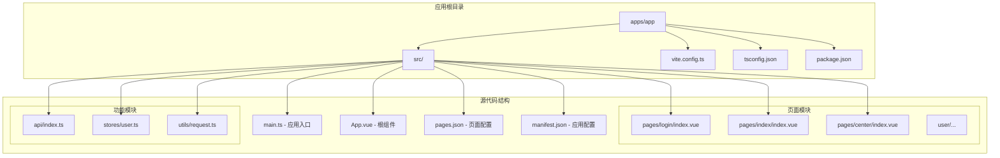
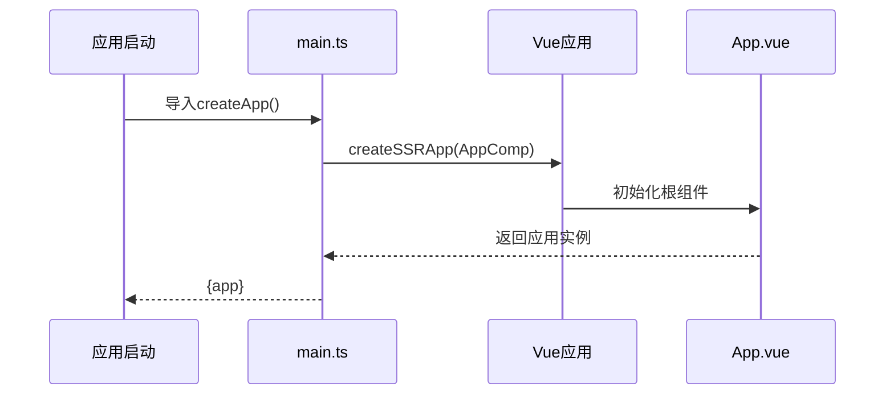
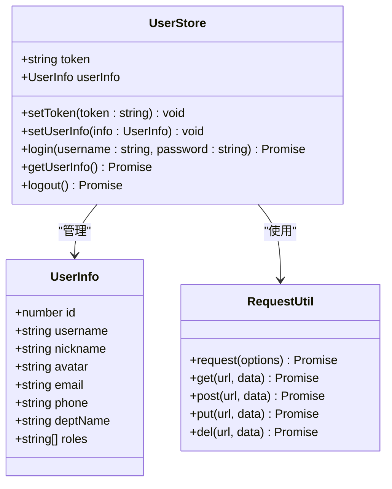
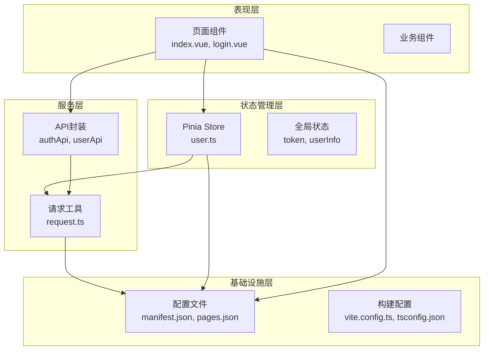
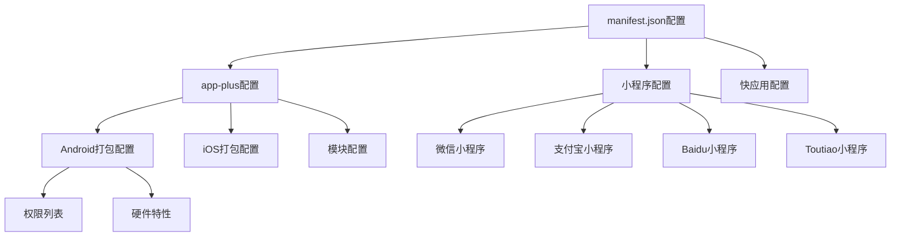
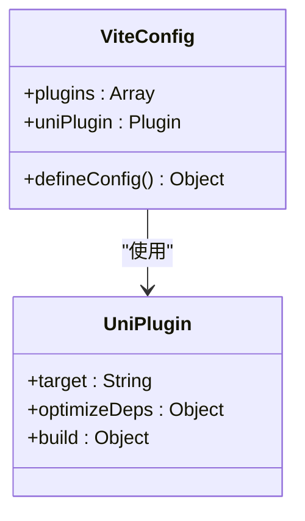
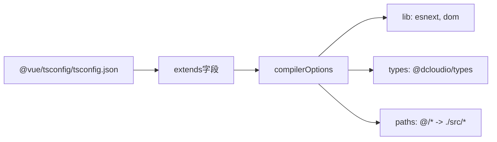
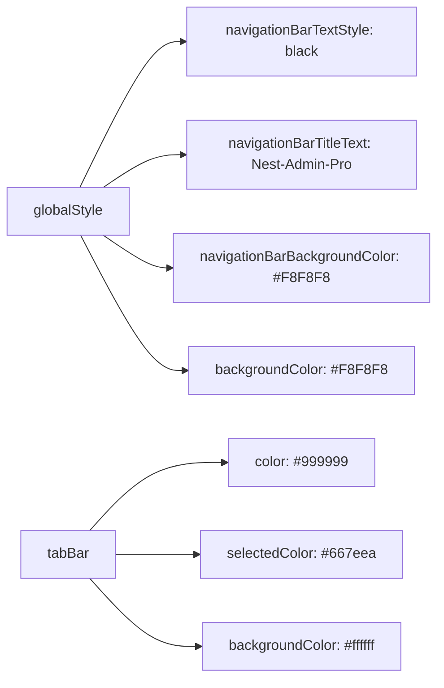
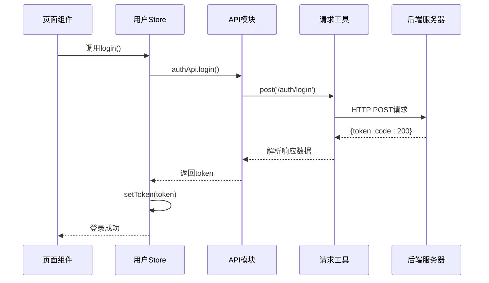

# UniApp项目配置

<cite>
**本文档引用的文件**
- [apps/app/src/main.ts](file://apps/app/src/main.ts)
- [apps/app/src/manifest.json](file://apps/app/src/manifest.json)
- [apps/app/vite.config.ts](file://apps/app/vite.config.ts)
- [apps/app/tsconfig.json](file://apps/app/tsconfig.json)
- [apps/app/package.json](file://apps/app/package.json)
- [apps/app/src/pages.json](file://apps/app/src/pages.json)
- [apps/app/src/App.vue](file://apps/app/src/App.vue)
- [apps/app/src/env.d.ts](file://apps/app/src/env.d.ts)
- [apps/app/src/shime-uni.d.ts](file://apps/app/src/shime-uni.d.ts)
- [apps/app/src/stores/user.ts](file://apps/app/src/stores/user.ts)
- [apps/app/src/utils/request.ts](file://apps/app/src/utils/request.ts)
- [apps/app/src/api/index.ts](file://apps/app/src/api/index.ts)
- [apps/app/src/pages/index/index.vue](file://apps/app/src/pages/index/index.vue)
- [apps/app/src/pages/login/index.vue](file://apps/app/src/pages/login/index.vue)
</cite>

## 目录
1. [简介](#简介)
2. [项目结构](#项目结构)
3. [核心组件](#核心组件)
4. [架构概览](#架构概览)
5. [详细组件分析](#详细组件分析)
6. [依赖关系分析](#依赖关系分析)
7. [性能考虑](#性能考虑)
8. [故障排除指南](#故障排除指南)
9. [结论](#结论)
10. [附录](#附录)

## 简介

本文件为基于Vue 3的UniApp项目配置的详细技术文档。UniApp是一个使用Vue 3 + TypeScript构建的跨平台应用开发框架，支持同时编译到H5、微信小程序、支付宝小程序、百度小程序、字节跳动小程序等多个目标平台。本文档将深入解析项目的核心配置文件、应用入口、全局状态管理以及跨平台编译配置，并提供性能优化建议和常见问题解决方案。

## 项目结构

该UniApp项目采用标准的src目录结构，包含应用入口、页面配置、API接口、状态管理、工具函数等模块化组织方式：



**图表来源**
- [apps/app/src/main.ts:1-9](file://apps/app/src/main.ts#L1-L9)
- [apps/app/src/pages.json:1-61](file://apps/app/src/pages.json#L1-L61)
- [apps/app/src/manifest.json:1-73](file://apps/app/src/manifest.json#L1-L73)

**章节来源**
- [apps/app/src/main.ts:1-9](file://apps/app/src/main.ts#L1-L9)
- [apps/app/src/pages.json:1-61](file://apps/app/src/pages.json#L1-L61)
- [apps/app/src/manifest.json:1-73](file://apps/app/src/manifest.json#L1-L73)

## 核心组件

### 应用入口配置

应用入口文件采用SSR模式创建，提供统一的应用实例创建函数：



**图表来源**
- [apps/app/src/main.ts:1-9](file://apps/app/src/main.ts#L1-L9)
- [apps/app/src/App.vue:1-14](file://apps/app/src/App.vue#L1-L14)

### 全局状态管理

项目使用Pinia进行全局状态管理，用户状态存储包含认证令牌和用户信息：



**图表来源**
- [apps/app/src/stores/user.ts:1-61](file://apps/app/src/stores/user.ts#L1-L61)
- [apps/app/src/utils/request.ts:1-57](file://apps/app/src/utils/request.ts#L1-L57)

**章节来源**
- [apps/app/src/main.ts:1-9](file://apps/app/src/main.ts#L1-L9)
- [apps/app/src/stores/user.ts:1-61](file://apps/app/src/stores/user.ts#L1-L61)
- [apps/app/src/utils/request.ts:1-57](file://apps/app/src/utils/request.ts#L1-L57)

## 架构概览

项目采用分层架构设计，各层职责清晰分离：



**图表来源**
- [apps/app/src/pages/index/index.vue:1-158](file://apps/app/src/pages/index/index.vue#L1-L158)
- [apps/app/src/pages/login/index.vue:1-162](file://apps/app/src/pages/login/index.vue#L1-L162)
- [apps/app/src/stores/user.ts:1-61](file://apps/app/src/stores/user.ts#L1-L61)
- [apps/app/src/api/index.ts:1-37](file://apps/app/src/api/index.ts#L1-L37)

## 详细组件分析

### manifest.json 应用配置

manifest.json是UniApp的核心配置文件，定义了应用的基本信息、权限配置和多端编译选项：

#### 基本应用信息
- **应用名称**: 通过 `name` 字段配置
- **版本信息**: `versionName` 和 `versionCode` 控制版本管理
- **转换设置**: `transformPx` 控制px单位转换

#### 平台特定配置



**图表来源**
- [apps/app/src/manifest.json:1-73](file://apps/app/src/manifest.json#L1-L73)

#### 权限配置详解

Android权限配置包含网络、相机、振动等多种系统权限：

| 权限类别 | 权限示例 | 用途描述 |
|---------|---------|----------|
| 网络权限 | CHANGE_NETWORK_STATE, ACCESS_NETWORK_STATE | 网络状态检测和连接管理 |
| 存储权限 | MOUNT_UNMOUNT_FILESYSTEMS, WRITE_SETTINGS | 文件系统操作和系统设置 |
| 设备权限 | VIBRATE, FLASHLIGHT | 震动反馈和闪光灯控制 |
| 相机权限 | CAMERA, AUTOFOCUS | 图像采集和自动对焦 |

**章节来源**
- [apps/app/src/manifest.json:1-73](file://apps/app/src/manifest.json#L1-L73)

### 构建配置分析

#### Vite配置
项目使用Vite作为构建工具，集成UniApp插件：



**图表来源**
- [apps/app/vite.config.ts:1-8](file://apps/app/vite.config.ts#L1-L8)

#### TypeScript配置
tsconfig.json继承Vue官方配置，扩展UniApp类型支持：



**图表来源**
- [apps/app/tsconfig.json:1-14](file://apps/app/tsconfig.json#L1-L14)

**章节来源**
- [apps/app/vite.config.ts:1-8](file://apps/app/vite.config.ts#L1-L8)
- [apps/app/tsconfig.json:1-14](file://apps/app/tsconfig.json#L1-L14)

### 页面路由配置

pages.json定义了应用的页面路由结构和全局样式：

#### 页面路由结构
- **登录页面**: `/pages/login/index` - 用户认证入口
- **首页**: `/pages/index/index` - 主要内容展示
- **用户中心**: `/pages/center/index` - 用户个人信息
- **个人资料**: `/pages/user/profile` - 个人详细信息
- **修改密码**: `/pages/user/password` - 密码安全设置

#### 导航栏配置
全局导航栏设置包括标题文本、背景颜色和文字颜色：



**图表来源**
- [apps/app/src/pages.json:35-61](file://apps/app/src/pages.json#L35-L61)

**章节来源**
- [apps/app/src/pages.json:1-61](file://apps/app/src/pages.json#L1-L61)

### API接口设计

项目采用模块化的API设计，统一管理HTTP请求：



**图表来源**
- [apps/app/src/stores/user.ts:30-37](file://apps/app/src/stores/user.ts#L30-L37)
- [apps/app/src/api/index.ts:5-11](file://apps/app/src/api/index.ts#L5-L11)
- [apps/app/src/utils/request.ts:10-45](file://apps/app/src/utils/request.ts#L10-L45)

**章节来源**
- [apps/app/src/api/index.ts:1-37](file://apps/app/src/api/index.ts#L1-L37)
- [apps/app/src/utils/request.ts:1-57](file://apps/app/src/utils/request.ts#L1-L57)

## 依赖关系分析

### 核心依赖关系

```mermaid
graph TB
subgraph "运行时依赖"
Vue[Vue 3.4.21]
Pinia[Pinia状态管理]
UniApp[UniApp框架]
I18n[vue-i18n]
end
subgraph "开发时依赖"
Vite[Vite 5.2.8]
TypeScript[TypeScript 4.9.4]
UniTypes[@dcloudio/types]
UniPlugin[@dcloudio/vite-plugin-uni]
end
subgraph "平台特定依赖"
H5[uni-app-h5]
WeChat[uni-mp-weixin]
Alipay[uni-mp-alipay]
Baidu[uni-mp-baidu]
Toutiao[uni-mp-toutiao]
end
UniApp --> Vue
Pinia --> Vue
UniApp --> Pinia
UniApp --> I18n
Vite --> UniPlugin
UniPlugin --> UniApp
WeChat --> UniApp
Alipay --> UniApp
Baidu --> UniApp
Toutiao --> UniApp
```

**图表来源**
- [apps/app/package.json:39-70](file://apps/app/package.json#L39-L70)

### 开发脚本配置

项目提供了丰富的开发脚本，支持多平台开发和构建：

| 脚本命令 | 目标平台 | 功能描述 |
|---------|---------|----------|
| dev:h5 | H5 Web | 开发模式运行H5版本 |
| dev:h5:ssr | H5 SSR | 开发模式运行SSR版本 |
| dev:mp-weixin | 微信小程序 | 开发模式运行微信小程序 |
| dev:mp-alipay | 支付宝小程序 | 开发模式运行支付宝小程序 |
| build:h5 | H5 Web | 生产模式构建H5版本 |
| build:mp-weixin | 微信小程序 | 生产模式构建小程序版本 |

**章节来源**
- [apps/app/package.json:4-38](file://apps/app/package.json#L4-L38)

## 性能考虑

### 构建优化策略

1. **Tree Shaking**: 通过ES6模块导入导出实现无用代码消除
2. **代码分割**: 按需加载页面组件和API模块
3. **资源压缩**: 生产环境自动压缩JavaScript和CSS文件
4. **缓存策略**: 利用浏览器缓存机制提升二次加载速度

### 运行时性能优化

1. **状态管理优化**: 使用Pinia的响应式状态管理减少不必要的重渲染
2. **图片资源优化**: 采用适当的图片格式和尺寸，支持懒加载
3. **网络请求优化**: 实现请求缓存和错误重试机制
4. **内存管理**: 及时清理事件监听器和定时器

## 故障排除指南

### 常见配置问题

#### 1. 页面路由配置错误
**问题症状**: 页面无法正常显示或路由跳转失败
**解决方法**: 检查pages.json中的路径配置是否正确，确保路径以`pages/`开头

#### 2. API请求失败
**问题症状**: 登录或数据获取接口返回401错误
**解决方法**: 检查后端服务器地址配置，确认token存储和传递逻辑

#### 3. 平台兼容性问题
**问题症状**: 某些API在特定平台不可用
**解决方法**: 使用条件编译或平台检测，提供降级方案

#### 4. 类型检查错误
**问题症状**: TypeScript编译时报错
**解决方法**: 检查tsconfig.json配置，确保类型声明文件正确引入

**章节来源**
- [apps/app/src/utils/request.ts:31-37](file://apps/app/src/utils/request.ts#L31-L37)
- [apps/app/src/stores/user.ts:44-49](file://apps/app/src/stores/user.ts#L44-L49)

## 结论

本UniApp项目配置文档详细介绍了基于Vue 3的跨平台应用开发配置方案。通过合理的项目结构设计、完善的配置文件管理和优化的性能策略，项目实现了良好的可维护性和跨平台兼容性。

关键配置要点包括：
- 使用SSR模式创建应用实例，支持服务端渲染
- 采用模块化的状态管理架构
- 完善的多平台编译配置和权限管理
- 清晰的页面路由和全局样式配置
- 健壮的API接口设计和错误处理机制

这些配置为后续的功能扩展和维护奠定了坚实的基础。

## 附录

### 项目初始化步骤

1. **环境准备**: 确保Node.js版本满足要求
2. **依赖安装**: 执行`npm install`安装项目依赖
3. **开发启动**: 使用`npm run dev:h5`启动开发服务器
4. **平台调试**: 使用对应平台的开发者工具进行调试

### 跨平台编译配置

项目支持以下平台的编译和部署：
- H5 Web应用
- 微信小程序
- 支付宝小程序
- 百度小程序
- 字节跳动小程序
- 华为快应用
- HarmonyOS应用

### 性能优化建议

1. **代码层面**: 使用Composition API替代Options API，实现更好的逻辑复用
2. **资源层面**: 优化图片资源，使用WebP格式，实现懒加载
3. **网络层面**: 实现请求缓存，减少重复网络请求
4. **构建层面**: 启用代码分割，按需加载非关键资源