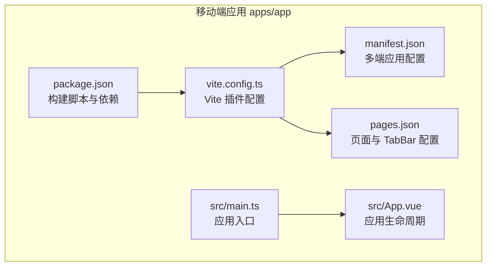
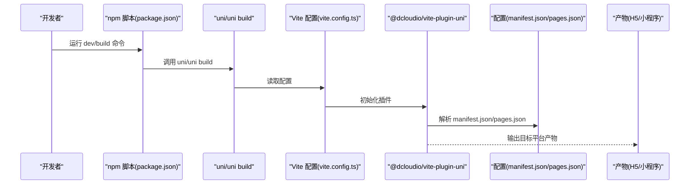
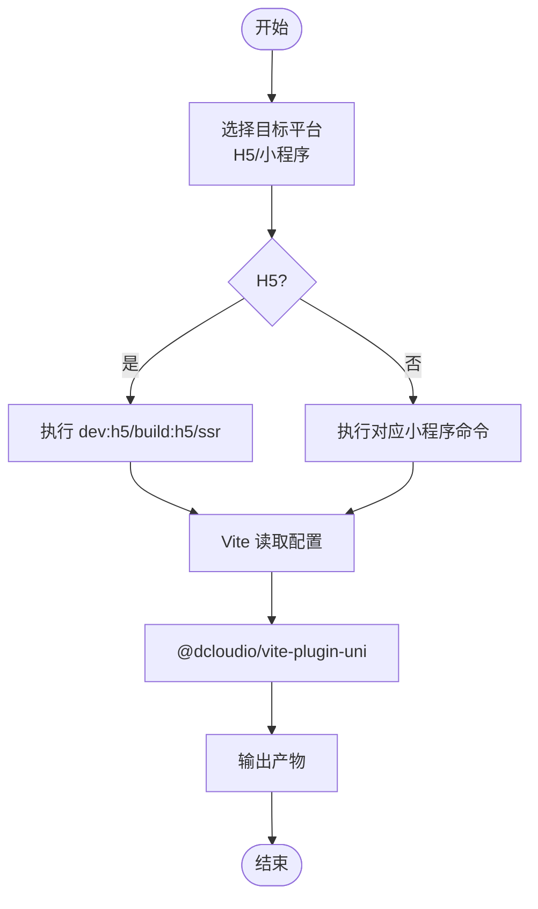
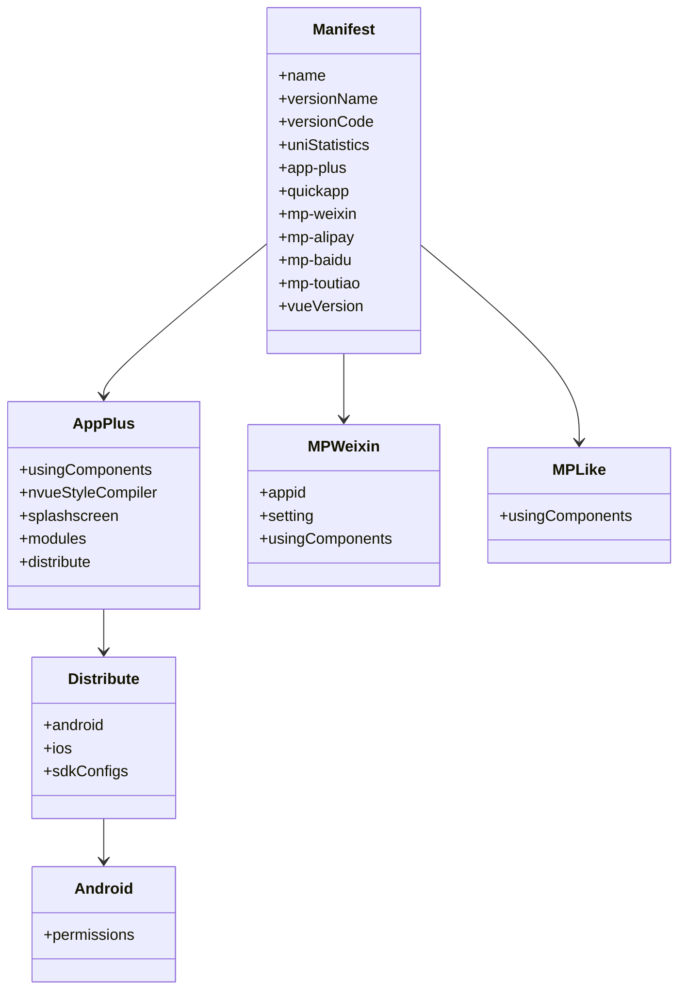
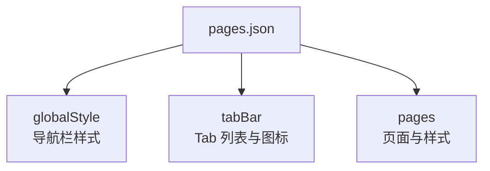
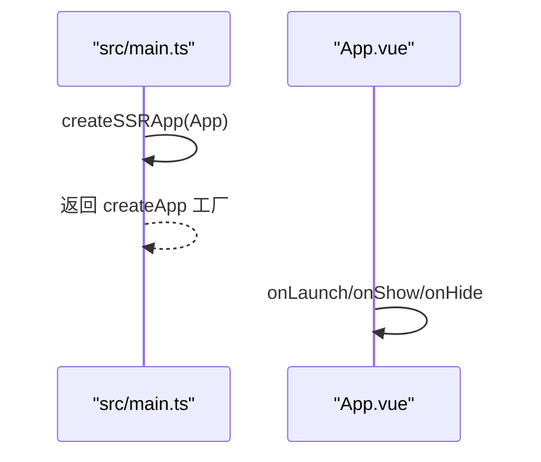
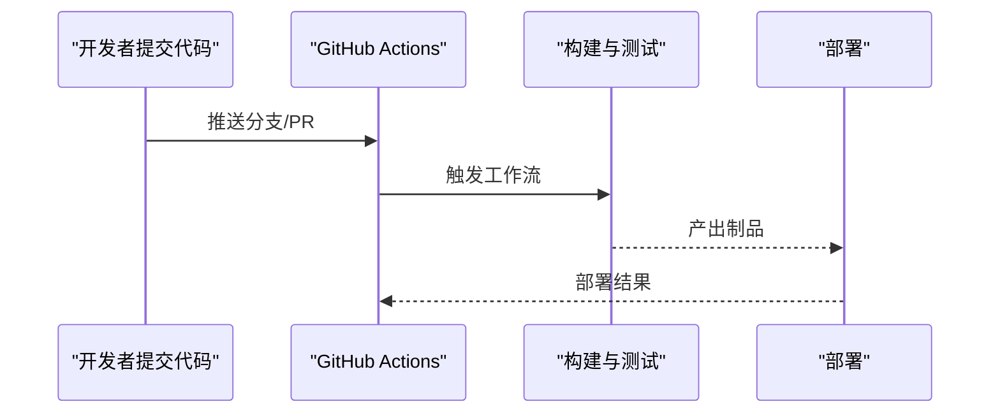
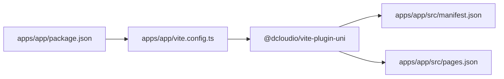

# 多平台发布部署

<cite>
**本文引用的文件**
- [apps/app/package.json](file://apps/app/package.json)
- [apps/app/vite.config.ts](file://apps/app/vite.config.ts)
- [apps/app/src/manifest.json](file://apps/app/src/manifest.json)
- [apps/app/src/pages.json](file://apps/app/src/pages.json)
- [apps/app/src/main.ts](file://apps/app/src/main.ts)
- [apps/app/src/App.vue](file://apps/app/src/App.vue)
- [README.md](file://README.md)
- [docs/deployment.md](file://docs/deployment.md)
- [apps/vben-admin/scripts/deploy/Dockerfile](file://apps/vben-admin/scripts/deploy/Dockerfile)
- [apps/vben-admin/.github/workflows/deploy.yml](file://apps/vben-admin/.github/workflows/deploy.yml)
- [apps/vben-admin/.github/workflows/rerun.yml](file://apps/vben-admin/.github/workflows/rerun.yml)
</cite>

## 目录
1. [简介](#简介)
2. [项目结构](#项目结构)
3. [核心组件](#核心组件)
4. [架构总览](#架构总览)
5. [详细组件分析](#详细组件分析)
6. [依赖关系分析](#依赖关系分析)
7. [性能考虑](#性能考虑)
8. [故障排查指南](#故障排查指南)
9. [结论](#结论)
10. [附录](#附录)

## 简介
本文件面向多平台发布部署，围绕 UniApp 项目在 H5 与多端小程序（微信小程序、支付宝小程序、百度小程序、字节跳动小程序等）的编译与发布进行系统化说明。内容涵盖：
- 多端编译与打包流程
- 平台特殊配置、权限与审核要点
- 构建过程、资源优化与包体积控制
- 发布流程、版本管理与更新机制
- 平台差异处理、兼容性测试与性能监控
- CI/CD 集成、自动化部署与最佳实践
- 平台特色功能利用与限制处理

## 项目结构
本仓库采用多应用目录组织，移动端 UniApp 位于 apps/app，包含页面、配置与构建脚本；另有后端、Web 管理后台与 vben-admin 示例工程。移动端多端构建与配置主要集中在 apps/app。

**图表来源**
- [apps/app/package.json:1-72](file://apps/app/package.json#L1-L72)
- [apps/app/vite.config.ts:1-8](file://apps/app/vite.config.ts#L1-L8)
- [apps/app/src/manifest.json:1-73](file://apps/app/src/manifest.json#L1-L73)
- [apps/app/src/pages.json:1-61](file://apps/app/src/pages.json#L1-L61)
- [apps/app/src/main.ts:1-9](file://apps/app/src/main.ts#L1-L9)
- [apps/app/src/App.vue:1-14](file://apps/app/src/App.vue#L1-L14)

**章节来源**
- [README.md:26-69](file://README.md#L26-L69)
- [apps/app/package.json:1-72](file://apps/app/package.json#L1-L72)
- [apps/app/vite.config.ts:1-8](file://apps/app/vite.config.ts#L1-L8)

## 核心组件
- 构建脚本与多端命令：通过 package.json 提供 dev/build 脚本，覆盖 H5 与多端小程序（含微信、支付宝、百度、字节等）。
- Vite 配置：使用 @dcloudio/vite-plugin-uni 插件驱动多端编译。
- 应用清单 manifest.json：定义版本号、平台特定配置（如小程序 appid、权限、模块等）。
- 页面路由与 TabBar：pages.json 统一管理页面与 TabBar 列表。
- 应用入口与生命周期：src/main.ts 创建 SSR 应用，App.vue 注册应用生命周期钩子。

**章节来源**
- [apps/app/package.json:4-38](file://apps/app/package.json#L4-L38)
- [apps/app/vite.config.ts:5-7](file://apps/app/vite.config.ts#L5-L7)
- [apps/app/src/manifest.json:1-73](file://apps/app/src/manifest.json#L1-L73)
- [apps/app/src/pages.json:1-61](file://apps/app/src/pages.json#L1-L61)
- [apps/app/src/main.ts:1-9](file://apps/app/src/main.ts#L1-L9)
- [apps/app/src/App.vue:1-14](file://apps/app/src/App.vue#L1-L14)

## 架构总览
下图展示 UniApp 多端构建与发布的关键路径：开发者通过 npm scripts 调用 uni/uni build，Vite 配置加载 @dcloudio/vite-plugin-uni，读取 manifest.json 与 pages.json，最终输出 H5 或各小程序平台产物。

**图表来源**
- [apps/app/package.json:4-38](file://apps/app/package.json#L4-L38)
- [apps/app/vite.config.ts:5-7](file://apps/app/vite.config.ts#L5-L7)
- [apps/app/src/manifest.json:1-73](file://apps/app/src/manifest.json#L1-L73)
- [apps/app/src/pages.json:1-61](file://apps/app/src/pages.json#L1-L61)

## 详细组件分析

### 构建与多端编译
- H5 开发与构建：提供 dev:h5、build:h5、dev:h5:ssr、build:h5:ssr 等脚本，支持服务端渲染模式。
- 小程序多端：覆盖 mp-weixin、mp-alipay、mp-baidu、mp-toutiao 等平台的开发与构建命令。
- Vite 插件：通过 @dcloudio/vite-plugin-uni 实现多端编译与平台适配。

**图表来源**
- [apps/app/package.json:4-38](file://apps/app/package.json#L4-L38)
- [apps/app/vite.config.ts:5-7](file://apps/app/vite.config.ts#L5-L7)

**章节来源**
- [apps/app/package.json:4-38](file://apps/app/package.json#L4-L38)
- [apps/app/vite.config.ts:1-8](file://apps/app/vite.config.ts#L1-L8)

### 应用清单与平台配置
- 版本与统计：versionName/versionCode、uniStatistics 控制统计上报。
- 5+App 分发：app-plus.distribute.android/ios.permissions、modules、sdkConfigs 等。
- 快应用：quickapp 空配置预留。
- 小程序平台：mp-weixin、mp-alipay、mp-baidu、mp-toutiao 等平台的 setting、appid、usingComponents 等。
- Vue 版本：vueVersion 指定 Vue 3。

**图表来源**
- [apps/app/src/manifest.json:1-73](file://apps/app/src/manifest.json#L1-L73)

**章节来源**
- [apps/app/src/manifest.json:1-73](file://apps/app/src/manifest.json#L1-L73)

### 页面路由与 TabBar
- pages.json 管理页面列表、全局导航样式与 TabBar。
- 示例包含登录、首页、个人中心、资料与密码修改等页面，并配置了 TabBar 列表与图标路径。

**图表来源**
- [apps/app/src/pages.json:1-61](file://apps/app/src/pages.json#L1-L61)

**章节来源**
- [apps/app/src/pages.json:1-61](file://apps/app/src/pages.json#L1-L61)

### 应用入口与生命周期
- src/main.ts 使用 createSSRApp 创建应用实例，导出 createApp 工厂函数。
- App.vue 注册 onLaunch/onShow/onHide 生命周期钩子，便于平台差异处理与初始化逻辑。

**图表来源**
- [apps/app/src/main.ts:1-9](file://apps/app/src/main.ts#L1-L9)
- [apps/app/src/App.vue:1-14](file://apps/app/src/App.vue#L1-L14)

**章节来源**
- [apps/app/src/main.ts:1-9](file://apps/app/src/main.ts#L1-L9)
- [apps/app/src/App.vue:1-14](file://apps/app/src/App.vue#L1-L14)

### 平台特殊配置与权限
- Android 权限：在 app-plus.distribute.android.permissions 中声明所需权限与硬件特性，如网络状态、相机、闪光灯等。
- 小程序 appid：mp-weixin.appid 需在微信公众平台配置；其他平台类似。
- 审核要点：H5 与小程序均需遵守平台审核规范，注意隐私政策、用户协议与敏感权限使用场景。

**章节来源**
- [apps/app/src/manifest.json:22-47](file://apps/app/src/manifest.json#L22-L47)
- [apps/app/src/manifest.json:52-67](file://apps/app/src/manifest.json#L52-L67)

### 构建流程与资源优化
- 构建命令：H5 与各小程序平台均有独立 dev/build 脚本，便于快速迭代与发布。
- 资源优化建议：
  - 图片与字体压缩、按需引入组件与第三方库。
  - 使用条件编译与按需加载减少首屏体积。
  - 合理拆分页面与模块，避免一次性加载过多资源。
- 包体积控制：结合平台特性，剔除未使用模块、精简依赖与静态资源。

**章节来源**
- [apps/app/package.json:4-38](file://apps/app/package.json#L4-L38)

### 发布流程、版本管理与更新
- 版本管理：通过 manifest.json 的 versionName/versionCode 管理版本，配合平台审核与灰度发布策略。
- 发布流程：先本地构建验证，再提交平台审核；审核通过后上线并推送更新。
- 更新机制：平台侧支持热更新与强制更新策略，需在 manifest.json 与平台后台配置。

**章节来源**
- [apps/app/src/manifest.json:5-6](file://apps/app/src/manifest.json#L5-L6)

### 平台差异处理与兼容性测试
- 平台差异：H5 与小程序在 API、组件与运行时存在差异，需通过条件编译与平台适配层处理。
- 兼容性测试：在各目标平台模拟器与真机上进行功能与性能测试，关注首屏加载、交互流畅度与稳定性。

**章节来源**
- [README.md:102-118](file://README.md#L102-L118)

### 性能监控与持续集成
- 性能监控：接入平台自带监控或第三方 SDK，关注首屏时间、白屏时间、崩溃率与用户留存。
- CI/CD：结合 GitHub Actions 实现自动化构建与部署，支持重试与多分支流水线。

**图表来源**
- [apps/vben-admin/.github/workflows/deploy.yml:136-172](file://apps/vben-admin/.github/workflows/deploy.yml#L136-L172)
- [apps/vben-admin/.github/workflows/rerun.yml:1-19](file://apps/vben-admin/.github/workflows/rerun.yml#L1-L19)

**章节来源**
- [apps/vben-admin/.github/workflows/deploy.yml:136-172](file://apps/vben-admin/.github/workflows/deploy.yml#L136-L172)
- [apps/vben-admin/.github/workflows/rerun.yml:1-19](file://apps/vben-admin/.github/workflows/rerun.yml#L1-L19)

## 依赖关系分析
- package.json 定义多端构建脚本与依赖，统一管理 @dcloudio/uni-* 生态。
- vite.config.ts 仅一行插件配置，集中于 @dcloudio/vite-plugin-uni。
- manifest.json 与 pages.json 作为多端编译的输入配置，决定产物形态与页面结构。

**图表来源**
- [apps/app/package.json:1-72](file://apps/app/package.json#L1-L72)
- [apps/app/vite.config.ts:1-8](file://apps/app/vite.config.ts#L1-L8)
- [apps/app/src/manifest.json:1-73](file://apps/app/src/manifest.json#L1-L73)
- [apps/app/src/pages.json:1-61](file://apps/app/src/pages.json#L1-L61)

**章节来源**
- [apps/app/package.json:1-72](file://apps/app/package.json#L1-L72)
- [apps/app/vite.config.ts:1-8](file://apps/app/vite.config.ts#L1-L8)
- [apps/app/src/manifest.json:1-73](file://apps/app/src/manifest.json#L1-L73)
- [apps/app/src/pages.json:1-61](file://apps/app/src/pages.json#L1-L61)

## 性能考虑
- 构建阶段：合理拆分依赖、启用压缩与 Tree Shaking，减少冗余代码。
- 运行阶段：按需加载、懒加载页面与组件，降低首屏压力。
- 平台特性：充分利用各平台缓存与离线能力，提升用户体验。

## 故障排查指南
- 构建失败：检查 npm 脚本与依赖版本，确认 @dcloudio/uni-* 与 @dcloudio/vite-plugin-uni 版本匹配。
- 配置错误：核对 manifest.json 与 pages.json 的字段拼写与平台特定设置。
- 平台审核问题：确保隐私政策与权限说明清晰，避免敏感权限滥用。
- CI/CD 失败：查看工作流日志，确认构建步骤与部署凭据配置正确。

**章节来源**
- [apps/app/package.json:39-71](file://apps/app/package.json#L39-L71)
- [apps/app/src/manifest.json:1-73](file://apps/app/src/manifest.json#L1-L73)
- [apps/app/src/pages.json:1-61](file://apps/app/src/pages.json#L1-L61)
- [apps/vben-admin/.github/workflows/deploy.yml:136-172](file://apps/vben-admin/.github/workflows/deploy.yml#L136-L172)

## 结论
本项目以 UniApp 为核心，通过标准化的构建脚本与配置文件实现 H5 与多端小程序的统一编译与发布。建议在实际落地中：
- 明确各平台的权限与审核要求，提前准备 appid 与合规材料；
- 建立完善的资源优化与包体积控制策略；
- 设计稳定的发布流程与版本管理机制；
- 引入 CI/CD 与自动化部署，保障交付效率与质量；
- 持续进行兼容性测试与性能监控，确保用户体验。

## 附录
- 参考文档与部署指南：后端与前端部署参考 docs/deployment.md；移动端常用命令参考 README.md 的“常用命令”部分。
- Docker 与 Nginx：vben-admin 示例工程提供了 Dockerfile 与 Nginx 配置，可作为前端静态部署参考。

**章节来源**
- [README.md:383-412](file://README.md#L383-L412)
- [docs/deployment.md:1-262](file://docs/deployment.md#L1-L262)
- [apps/vben-admin/scripts/deploy/Dockerfile:1-39](file://apps/vben-admin/scripts/deploy/Dockerfile#L1-L39)