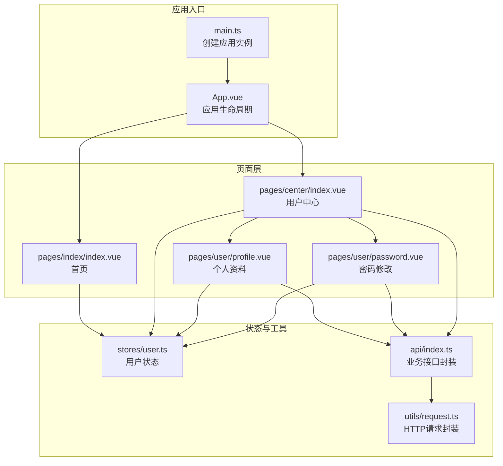
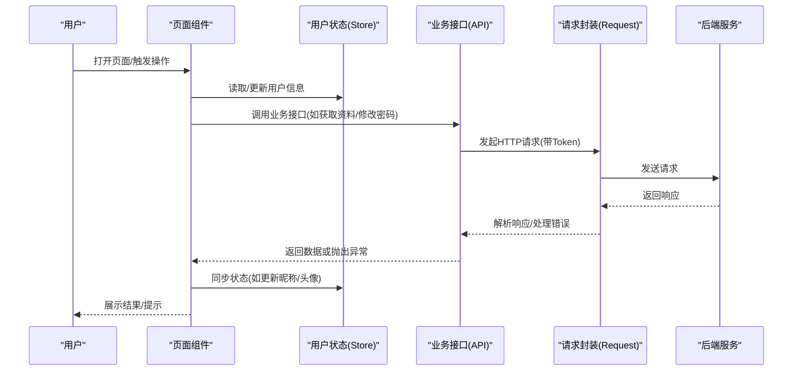
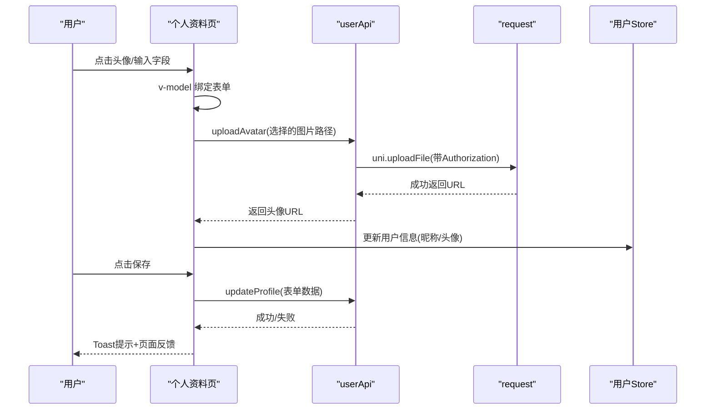
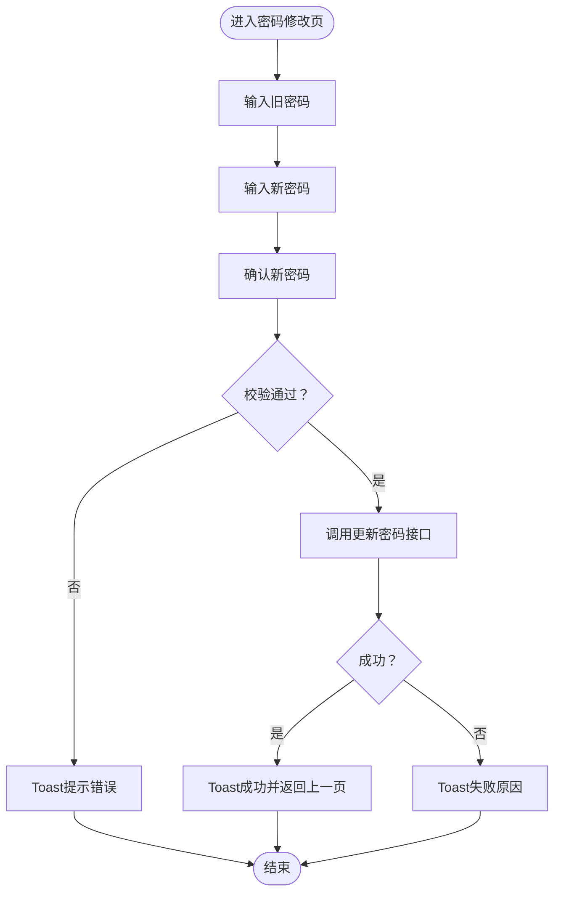
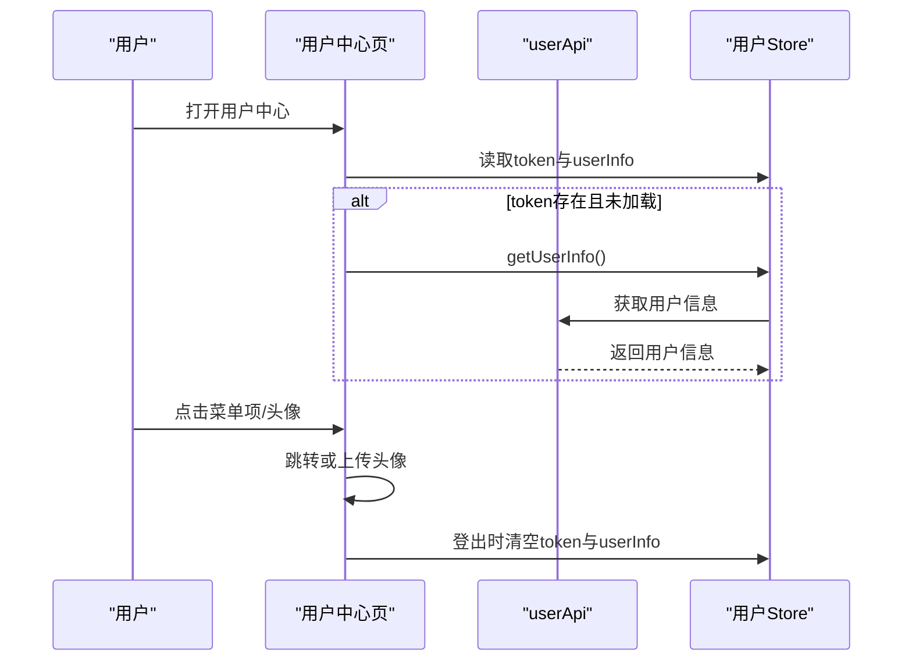
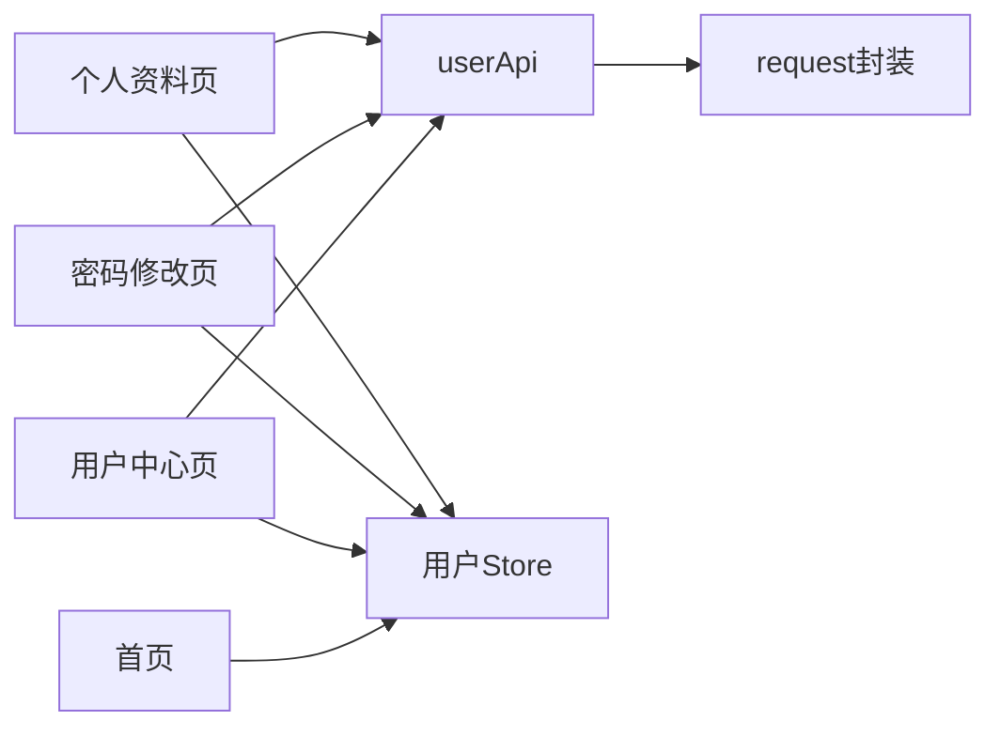

# 移动端UI组件

<cite>
**本文引用的文件**
- [apps/app/src/pages/user/profile.vue](file://apps/app/src/pages/user/profile.vue)
- [apps/app/src/pages/user/password.vue](file://apps/app/src/pages/user/password.vue)
- [apps/app/src/pages/center/index.vue](file://apps/app/src/pages/center/index.vue)
- [apps/app/src/pages/index/index.vue](file://apps/app/src/pages/index/index.vue)
- [apps/app/src/stores/user.ts](file://apps/app/src/stores/user.ts)
- [apps/app/src/utils/request.ts](file://apps/app/src/utils/request.ts)
- [apps/app/src/api/index.ts](file://apps/app/src/api/index.ts)
- [apps/app/src/pages.json](file://apps/app/src/pages.json)
- [apps/app/src/App.vue](file://apps/app/src/App.vue)
- [apps/app/src/main.ts](file://apps/app/src/main.ts)
- [apps/app/package.json](file://apps/app/package.json)
</cite>

## 目录
1. [简介](#简介)
2. [项目结构](#项目结构)
3. [核心组件](#核心组件)
4. [架构总览](#架构总览)
5. [详细组件分析](#详细组件分析)
6. [依赖关系分析](#依赖关系分析)
7. [性能考虑](#性能考虑)
8. [故障排查指南](#故障排查指南)
9. [结论](#结论)
10. [附录](#附录)

## 简介
本文件聚焦移动端UI组件的设计与实现，基于基于 uni-app 的多端统一工程（支持微信小程序、H5、App 等），系统梳理了移动端特有的表单组件、列表组件、卡片组件等的使用与定制方式；并深入讲解个人资料页与密码修改页等业务页面的数据绑定、表单校验与提交流程。同时，结合项目中的样式组织与主题机制，给出移动端响应式设计与屏幕适配策略、样式系统（CSS 变量、主题定制、样式覆盖）的使用方法，并总结组件复用、性能优化与用户体验提升的最佳实践，以及跨平台 UI 兼容性与平台特有组件的使用建议。

## 项目结构
移动端应用位于 apps/app，采用 uni-app 多端统一开发模式，页面通过 pages.json 声明路由与导航栏配置，页面以 Vue 单文件组件形式组织，业务逻辑通过 Pinia 状态管理与自定义请求封装对接后端接口。

**图表来源**
- [apps/app/src/main.ts:1-9](file://apps/app/src/main.ts#L1-L9)
- [apps/app/src/App.vue:1-14](file://apps/app/src/App.vue#L1-L14)
- [apps/app/src/pages/index/index.vue:1-158](file://apps/app/src/pages/index/index.vue#L1-L158)
- [apps/app/src/pages/center/index.vue:1-168](file://apps/app/src/pages/center/index.vue#L1-L168)
- [apps/app/src/pages/user/profile.vue:1-173](file://apps/app/src/pages/user/profile.vue#L1-L173)
- [apps/app/src/pages/user/password.vue:1-109](file://apps/app/src/pages/user/password.vue#L1-L109)
- [apps/app/src/stores/user.ts:1-61](file://apps/app/src/stores/user.ts#L1-L61)
- [apps/app/src/api/index.ts:1-37](file://apps/app/src/api/index.ts#L1-L37)
- [apps/app/src/utils/request.ts:1-57](file://apps/app/src/utils/request.ts#L1-L57)

**章节来源**
- [apps/app/src/pages.json:1-61](file://apps/app/src/pages.json#L1-L61)
- [apps/app/src/main.ts:1-9](file://apps/app/src/main.ts#L1-L9)
- [apps/app/src/App.vue:1-14](file://apps/app/src/App.vue#L1-L14)

## 核心组件
- 表单组件：在个人资料页与密码修改页中广泛使用输入框与按钮，配合 v-model 实现双向数据绑定，结合 uni.showToast 提示用户操作结果。
- 列表组件：用户中心菜单项采用简单列表布局，通过点击事件跳转至对应页面。
- 卡片组件：首页公告卡片、用户中心卡片、个人资料表单容器均采用圆角背景与阴影等视觉卡片化设计。
- 导航与路由：pages.json 配置全局导航栏与 tabBar，页面间通过 uni.navigateTo/switchTab/navigateBack 进行跳转。
- 状态管理：Pinia 用户仓库负责登录态与用户信息缓存，避免重复请求。
- 请求封装：统一封装 uni.request/uni.uploadFile，自动注入 Authorization 头，处理鉴权失败与错误提示。

**章节来源**
- [apps/app/src/pages/user/profile.vue:1-173](file://apps/app/src/pages/user/profile.vue#L1-L173)
- [apps/app/src/pages/user/password.vue:1-109](file://apps/app/src/pages/user/password.vue#L1-L109)
- [apps/app/src/pages/center/index.vue:1-168](file://apps/app/src/pages/center/index.vue#L1-L168)
- [apps/app/src/pages/index/index.vue:1-158](file://apps/app/src/pages/index/index.vue#L1-L158)
- [apps/app/src/stores/user.ts:1-61](file://apps/app/src/stores/user.ts#L1-L61)
- [apps/app/src/utils/request.ts:1-57](file://apps/app/src/utils/request.ts#L1-L57)
- [apps/app/src/api/index.ts:1-37](file://apps/app/src/api/index.ts#L1-L37)
- [apps/app/src/pages.json:1-61](file://apps/app/src/pages.json#L1-L61)

## 架构总览
移动端 UI 架构围绕“页面组件 + 状态管理 + 接口封装”的三层结构展开，页面组件负责视图与交互，Pinia 负责用户态与本地缓存，接口封装负责网络请求与错误处理，pages.json 统一管理路由与导航样式。

**图表来源**
- [apps/app/src/pages/user/profile.vue:38-93](file://apps/app/src/pages/user/profile.vue#L38-L93)
- [apps/app/src/pages/user/password.vue:24-64](file://apps/app/src/pages/user/password.vue#L24-L64)
- [apps/app/src/stores/user.ts:14-61](file://apps/app/src/stores/user.ts#L14-L61)
- [apps/app/src/api/index.ts:13-37](file://apps/app/src/api/index.ts#L13-L37)
- [apps/app/src/utils/request.ts:10-45](file://apps/app/src/utils/request.ts#L10-L45)

## 详细组件分析

### 个人资料页面（表单组件）
- 数据模型：使用 reactive 定义表单字段，包含用户名、昵称、邮箱、手机、头像、备注等。
- 生命周期：onShow 钩子中拉取用户资料并填充表单。
- 交互流程：
  - 头像选择：调用 uni.chooseImage 选择图片，上传至文件接口，成功后更新表单头像字段。
  - 保存：调用更新资料接口，成功后同步 Pinia 中的用户信息并提示。
- 样式要点：渐变背景头像区、卡片式表单容器、标签对齐与输入区域留白，提交按钮采用渐变色与圆角。

**图表来源**
- [apps/app/src/pages/user/profile.vue:38-93](file://apps/app/src/pages/user/profile.vue#L38-L93)
- [apps/app/src/api/index.ts:17-36](file://apps/app/src/api/index.ts#L17-L36)
- [apps/app/src/utils/request.ts:10-45](file://apps/app/src/utils/request.ts#L10-L45)
- [apps/app/src/stores/user.ts:20-28](file://apps/app/src/stores/user.ts#L20-L28)

**章节来源**
- [apps/app/src/pages/user/profile.vue:1-173](file://apps/app/src/pages/user/profile.vue#L1-L173)
- [apps/app/src/api/index.ts:13-37](file://apps/app/src/api/index.ts#L13-L37)
- [apps/app/src/stores/user.ts:14-28](file://apps/app/src/stores/user.ts#L14-L28)

### 密码修改页面（表单组件）
- 数据模型：旧密码、新密码、确认密码。
- 校验规则：必填校验、新旧密码一致性、长度校验。
- 提交流程：通过 updatePassword 接口提交，成功后 Toast 提示并延时返回上一页。

**图表来源**
- [apps/app/src/pages/user/password.vue:24-64](file://apps/app/src/pages/user/password.vue#L24-L64)

**章节来源**
- [apps/app/src/pages/user/password.vue:1-109](file://apps/app/src/pages/user/password.vue#L1-L109)

### 用户中心（列表与卡片）
- 卡片：顶部用户信息卡片，展示头像、昵称、用户名，支持头像点击上传。
- 列表：菜单项列表，包含“个人资料”、“修改密码”、“退出登录”，点击跳转对应页面或执行登出动作。
- 状态：onShow 钩子中若存在 Token 且未加载用户信息，则主动拉取。

**图表来源**
- [apps/app/src/pages/center/index.vue:33-79](file://apps/app/src/pages/center/index.vue#L33-L79)
- [apps/app/src/stores/user.ts:39-59](file://apps/app/src/stores/user.ts#L39-L59)
- [apps/app/src/api/index.ts:5-11](file://apps/app/src/api/index.ts#L5-L11)

**章节来源**
- [apps/app/src/pages/center/index.vue:1-168](file://apps/app/src/pages/center/index.vue#L1-L168)
- [apps/app/src/stores/user.ts:14-59](file://apps/app/src/stores/user.ts#L14-L59)

### 首页（卡片与快速操作）
- 卡片：顶部公告卡片，展示系统通知内容。
- 快速操作：底部三宫格快捷入口，点击触发相应行为或提示“即将上线”。

**章节来源**
- [apps/app/src/pages/index/index.vue:1-158](file://apps/app/src/pages/index/index.vue#L1-L158)

## 依赖关系分析
- 页面依赖：用户中心依赖用户状态与上传接口；个人资料与密码修改依赖用户相关接口；首页依赖用户状态用于展示。
- 状态依赖：所有页面共享用户状态，避免重复请求与状态分散。
- 请求依赖：业务接口统一通过 request 封装，集中处理鉴权与错误提示。
- 多端依赖：package.json 显示支持多端构建，页面通过 uni.xxx API 保证跨平台一致性。

**图表来源**
- [apps/app/src/pages/user/profile.vue:38-42](file://apps/app/src/pages/user/profile.vue#L38-L42)
- [apps/app/src/pages/user/password.vue:24-26](file://apps/app/src/pages/user/password.vue#L24-L26)
- [apps/app/src/pages/center/index.vue:33-39](file://apps/app/src/pages/center/index.vue#L33-L39)
- [apps/app/src/api/index.ts:13-37](file://apps/app/src/api/index.ts#L13-L37)
- [apps/app/src/utils/request.ts:10-45](file://apps/app/src/utils/request.ts#L10-L45)
- [apps/app/src/stores/user.ts:14-28](file://apps/app/src/stores/user.ts#L14-L28)

**章节来源**
- [apps/app/src/pages/user/profile.vue:38-42](file://apps/app/src/pages/user/profile.vue#L38-L42)
- [apps/app/src/pages/user/password.vue:24-26](file://apps/app/src/pages/user/password.vue#L24-L26)
- [apps/app/src/pages/center/index.vue:33-39](file://apps/app/src/pages/center/index.vue#L33-L39)
- [apps/app/src/api/index.ts:1-37](file://apps/app/src/api/index.ts#L1-L37)
- [apps/app/src/utils/request.ts:1-57](file://apps/app/src/utils/request.ts#L1-L57)
- [apps/app/src/stores/user.ts:1-61](file://apps/app/src/stores/user.ts#L1-L61)
- [apps/app/package.json:1-72](file://apps/app/package.json#L1-L72)

## 性能考虑
- 网络请求优化
  - 使用统一封装的 request，减少重复代码与错误处理分散。
  - 对上传场景使用 uni.uploadFile 并在成功后及时更新本地状态，避免二次请求。
- 状态缓存
  - 用户信息与 Token 存储于本地存储，onShow 钩子按需拉取，降低重复请求。
- 视图渲染
  - 使用 scoped 样式与合理布局，避免过度嵌套导致的重排。
  - 图片懒加载与压缩参数已在头像上传处体现，可扩展至其他资源。
- 路由与导航
  - 使用 navigateTo/switchTab/navigateBack 精准控制页面栈，减少不必要的页面重建。

[本节为通用指导，无需具体文件引用]

## 故障排查指南
- 登录态失效
  - 当后端返回 401 时，request 封装会清除本地 Token 并跳转至登录页，检查后端鉴权逻辑与 Token 有效期。
- 网络错误
  - request 在 fail 回调中统一提示网络错误，检查网络权限与域名配置。
- 上传失败
  - 检查上传接口返回格式与鉴权头是否正确，确保 Authorization 头拼接格式符合预期。
- 页面跳转异常
  - 确认 pages.json 中页面路径与标题配置正确，导航栏样式与 tabBar 配置无误。

**章节来源**
- [apps/app/src/utils/request.ts:31-37](file://apps/app/src/utils/request.ts#L31-L37)
- [apps/app/src/pages.json:1-61](file://apps/app/src/pages.json#L1-L61)

## 结论
本项目在移动端 UI 设计上遵循“卡片化 + 渐变背景 + 圆角与阴影”的视觉风格，通过统一的状态管理与接口封装，实现了表单类页面（个人资料、密码修改）与列表/卡片类页面（用户中心、首页）的良好复用与可维护性。结合 pages.json 的路由与导航配置，以及 request 封装的错误处理与鉴权机制，整体具备较好的跨平台兼容性与用户体验。后续可在图片懒加载、复杂表单校验、主题切换等方面进一步增强。

[本节为总结性内容，无需具体文件引用]

## 附录

### 响应式设计与屏幕适配策略
- 使用 rpx 单位进行布局适配，保证在不同 DPR 下的视觉一致性。
- 通过 flex 布局与 gap 控制元素间距，避免固定像素导致的不一致。
- 在卡片与列表中使用圆角与阴影，提升移动端触控反馈与层次感。

**章节来源**
- [apps/app/src/pages/user/profile.vue:96-173](file://apps/app/src/pages/user/profile.vue#L96-L173)
- [apps/app/src/pages/user/password.vue:67-109](file://apps/app/src/pages/user/password.vue#L67-L109)
- [apps/app/src/pages/center/index.vue:81-168](file://apps/app/src/pages/center/index.vue#L81-L168)
- [apps/app/src/pages/index/index.vue:60-158](file://apps/app/src/pages/index/index.vue#L60-L158)

### 样式系统与主题定制
- 主题变量：项目中展示了通过 CSS 变量驱动主题的思路（参考 vben-admin 的主题变量更新逻辑），可在移动端项目中借鉴，将主色、圆角半径、背景色等抽象为 CSS 变量，便于统一管理与动态切换。
- 样式覆盖：优先使用 scoped 样式隔离页面样式，必要时通过深度选择器或全局样式进行覆盖，注意避免样式冲突。
- 组件复用：将公共卡片、列表、表单样式抽取为可复用的样式块，减少重复定义。

[本节为通用指导，无需具体文件引用]

### 跨平台UI兼容性与平台特性
- 多端构建：通过 package.json 的脚本与依赖，支持微信小程序、H5、App 等多端构建，页面通过 uni.xxx API 实现跨平台一致性。
- 平台差异：在需要时可通过条件编译或运行时判断处理平台差异，但当前项目以 uni 生态统一实现为主。

**章节来源**
- [apps/app/package.json:1-72](file://apps/app/package.json#L1-L72)