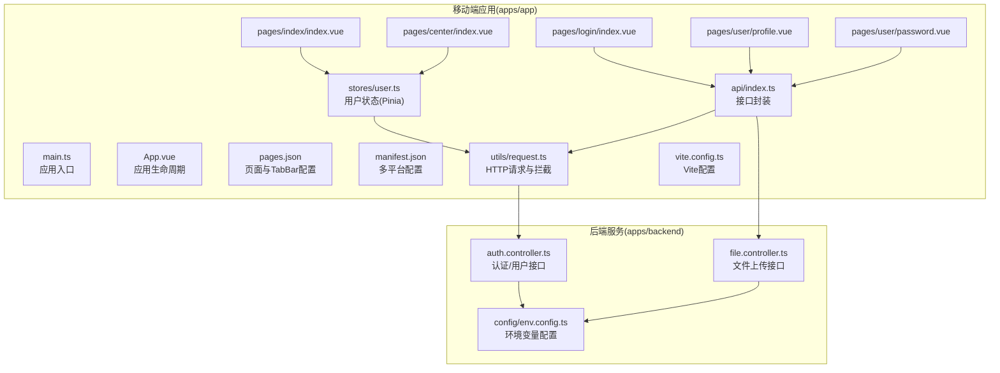
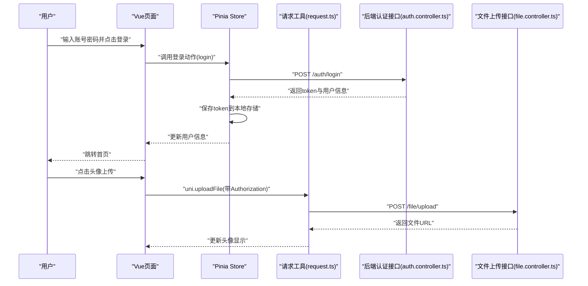
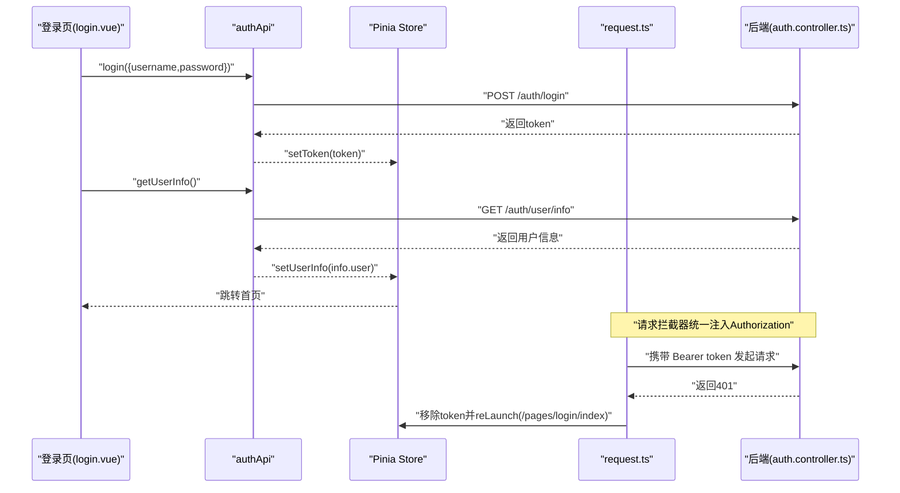
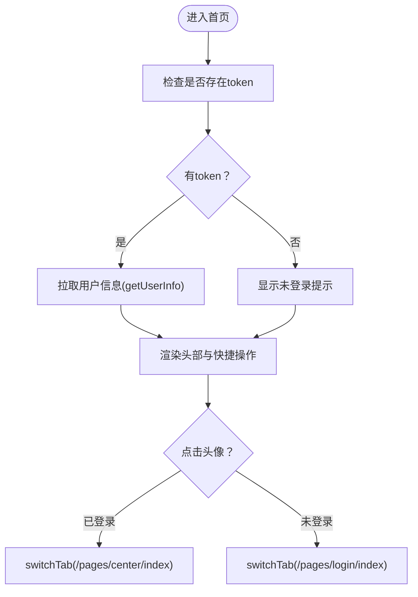
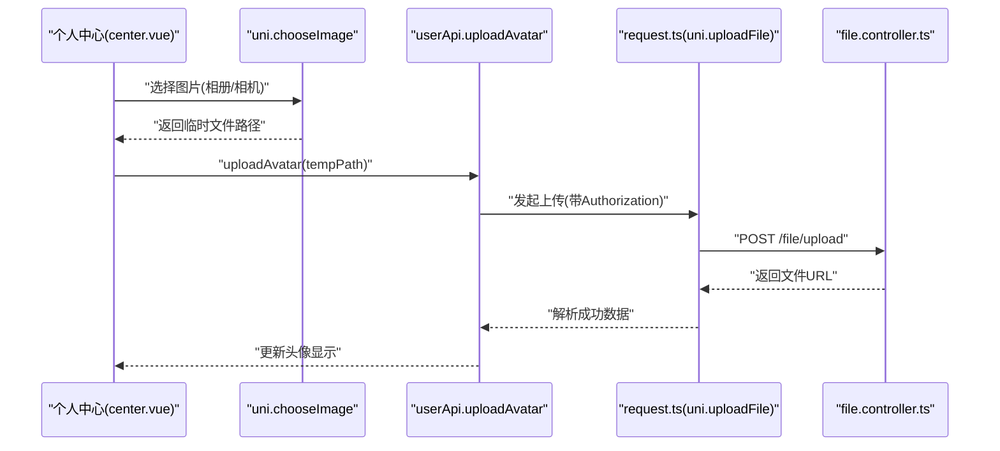
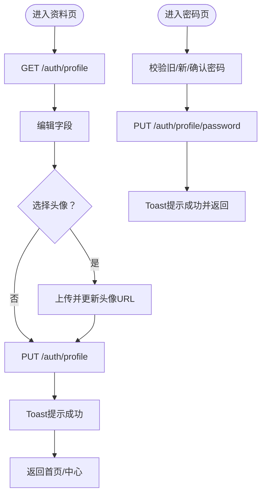
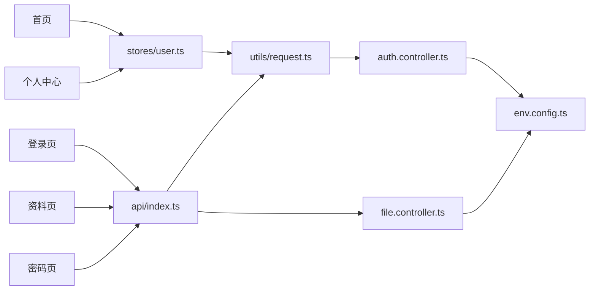

# 移动端开发

<cite>
**本文引用的文件**
- [apps/app/src/main.ts](file://apps/app/src/main.ts)
- [apps/app/src/App.vue](file://apps/app/src/App.vue)
- [apps/app/src/pages.json](file://apps/app/src/pages.json)
- [apps/app/src/manifest.json](file://apps/app/src/manifest.json)
- [apps/app/src/utils/request.ts](file://apps/app/src/utils/request.ts)
- [apps/app/src/stores/user.ts](file://apps/app/src/stores/user.ts)
- [apps/app/src/api/index.ts](file://apps/app/src/api/index.ts)
- [apps/app/src/pages/login/index.vue](file://apps/app/src/pages/login/index.vue)
- [apps/app/src/pages/index/index.vue](file://apps/app/src/pages/index/index.vue)
- [apps/app/src/pages/center/index.vue](file://apps/app/src/pages/center/index.vue)
- [apps/app/src/pages/user/profile.vue](file://apps/app/src/pages/user/profile.vue)
- [apps/app/src/pages/user/password.vue](file://apps/app/src/pages/user/password.vue)
- [apps/backend/src/auth/auth.controller.ts](file://apps/backend/src/auth/auth.controller.ts)
- [apps/backend/src/modules/file/file.controller.ts](file://apps/backend/src/modules/file/file.controller.ts)
- [apps/backend/src/config/env.config.ts](file://apps/backend/src/config/env.config.ts)
- [apps/app/package.json](file://apps/app/package.json)
- [apps/app/vite.config.ts](file://apps/app/vite.config.ts)
- [README.md](file://README.md)
- [docs/faq.md](file://docs/faq.md)
</cite>

## 目录
1. [简介](#简介)
2. [项目结构](#项目结构)
3. [核心组件](#核心组件)
4. [架构总览](#架构总览)
5. [详细组件分析](#详细组件分析)
6. [依赖关系分析](#依赖关系分析)
7. [性能考虑](#性能考虑)
8. [故障排查指南](#故障排查指南)
9. [结论](#结论)
10. [附录](#附录)

## 简介
本文件面向基于 UniApp 的跨平台移动应用开发，系统梳理移动端工程的项目结构、页面路由与多平台适配策略；深入讲解登录认证、首页仪表盘、个人中心、资料修改、密码修改等页面的设计与实现；阐述 JWT Bearer Token 在移动端的应用及 401 自动跳转登录机制；说明文件上传与头像上传的实现要点；给出微信、支付宝、百度、字节跳动等小程序平台的配置与发布流程建议；并总结移动端性能优化、用户体验与兼容性最佳实践。

## 项目结构
移动端工程位于 apps/app，采用 Vue 3 + TypeScript + Vite + UniApp 插件的组合，通过 manifest.json 与 pages.json 实现多端统一与差异化配置。核心目录与职责如下：
- src
  - api：封装鉴权与用户相关接口，以及文件上传接口
  - pages：页面级组件，包含登录、首页、个人中心、资料与密码修改
  - stores：Pinia 状态管理，集中维护 token 与用户信息
  - utils：网络请求工具，内置 JWT Bearer Token 注入与 401 自动跳转逻辑
  - 入口与清单：main.ts、App.vue、pages.json、manifest.json、vite.config.ts
- package.json：定义多平台开发与构建脚本
- backend：后端 API（NestJS），提供认证、用户资料、文件上传等接口

**图表来源**
- [apps/app/src/main.ts:1-9](file://apps/app/src/main.ts#L1-L9)
- [apps/app/src/App.vue:1-14](file://apps/app/src/App.vue#L1-L14)
- [apps/app/src/pages.json:1-61](file://apps/app/src/pages.json#L1-L61)
- [apps/app/src/manifest.json:1-73](file://apps/app/src/manifest.json#L1-L73)
- [apps/app/src/api/index.ts:1-37](file://apps/app/src/api/index.ts#L1-L37)
- [apps/app/src/stores/user.ts:1-61](file://apps/app/src/stores/user.ts#L1-L61)
- [apps/app/src/utils/request.ts:1-57](file://apps/app/src/utils/request.ts#L1-L57)
- [apps/app/src/pages/login/index.vue:1-162](file://apps/app/src/pages/login/index.vue#L1-L162)
- [apps/app/src/pages/index/index.vue:1-158](file://apps/app/src/pages/index/index.vue#L1-L158)
- [apps/app/src/pages/center/index.vue:1-168](file://apps/app/src/pages/center/index.vue#L1-L168)
- [apps/app/src/pages/user/profile.vue:1-173](file://apps/app/src/pages/user/profile.vue#L1-L173)
- [apps/app/src/pages/user/password.vue:1-109](file://apps/app/src/pages/user/password.vue#L1-L109)
- [apps/backend/src/auth/auth.controller.ts:1-87](file://apps/backend/src/auth/auth.controller.ts#L1-L87)
- [apps/backend/src/modules/file/file.controller.ts:1-100](file://apps/backend/src/modules/file/file.controller.ts#L1-L100)
- [apps/backend/src/config/env.config.ts:1-47](file://apps/backend/src/config/env.config.ts#L1-L47)

**章节来源**
- [apps/app/src/pages.json:1-61](file://apps/app/src/pages.json#L1-L61)
- [apps/app/src/manifest.json:1-73](file://apps/app/src/manifest.json#L1-L73)
- [apps/app/src/api/index.ts:1-37](file://apps/app/src/api/index.ts#L1-L37)
- [apps/app/src/stores/user.ts:1-61](file://apps/app/src/stores/user.ts#L1-L61)
- [apps/app/src/utils/request.ts:1-57](file://apps/app/src/utils/request.ts#L1-L57)
- [apps/app/src/pages/login/index.vue:1-162](file://apps/app/src/pages/login/index.vue#L1-L162)
- [apps/app/src/pages/index/index.vue:1-158](file://apps/app/src/pages/index/index.vue#L1-L158)
- [apps/app/src/pages/center/index.vue:1-168](file://apps/app/src/pages/center/index.vue#L1-L168)
- [apps/app/src/pages/user/profile.vue:1-173](file://apps/app/src/pages/user/profile.vue#L1-L173)
- [apps/app/src/pages/user/password.vue:1-109](file://apps/app/src/pages/user/password.vue#L1-L109)
- [apps/backend/src/auth/auth.controller.ts:1-87](file://apps/backend/src/auth/auth.controller.ts#L1-L87)
- [apps/backend/src/modules/file/file.controller.ts:1-100](file://apps/backend/src/modules/file/file.controller.ts#L1-L100)
- [apps/backend/src/config/env.config.ts:1-47](file://apps/backend/src/config/env.config.ts#L1-L47)
- [apps/app/package.json:1-72](file://apps/app/package.json#L1-L72)
- [apps/app/vite.config.ts:1-8](file://apps/app/vite.config.ts#L1-L8)

## 核心组件
- 应用入口与生命周期
  - main.ts 创建 SSR 应用实例，供各端加载
  - App.vue 定义应用生命周期钩子（启动、显示、隐藏）
- 页面与 TabBar
  - pages.json 统一声明页面路径、导航栏标题与全局样式；定义 TabBar 列表与图标
- 多平台配置
  - manifest.json 配置版本号、Splash、权限与各小程序平台（微信/支付宝/百度/字节）开关
- 网络层
  - utils/request.ts 封装 uni.request/uni.uploadFile，统一注入 Authorization: Bearer token，处理 401 自动清理 token 并跳转登录
- 状态管理
  - stores/user.ts 使用 Pinia 管理 token 与用户信息，提供登录、获取用户信息、登出动作
- 接口封装
  - api/index.ts 提供 authApi 与 userApi，其中头像上传通过 uni.uploadFile 实现并返回可直接使用的图片 URL

**章节来源**
- [apps/app/src/main.ts:1-9](file://apps/app/src/main.ts#L1-L9)
- [apps/app/src/App.vue:1-14](file://apps/app/src/App.vue#L1-L14)
- [apps/app/src/pages.json:1-61](file://apps/app/src/pages.json#L1-L61)
- [apps/app/src/manifest.json:1-73](file://apps/app/src/manifest.json#L1-L73)
- [apps/app/src/utils/request.ts:1-57](file://apps/app/src/utils/request.ts#L1-L57)
- [apps/app/src/stores/user.ts:1-61](file://apps/app/src/stores/user.ts#L1-L61)
- [apps/app/src/api/index.ts:1-37](file://apps/app/src/api/index.ts#L1-L37)

## 架构总览
移动端与后端通过 HTTP 协议通信，移动端负责 UI 展示与交互，后端提供认证、用户资料与文件上传等能力。JWT Bearer Token 作为认证凭证贯穿请求头，401 时自动清除本地 token 并跳转登录页。

**图表来源**
- [apps/app/src/stores/user.ts:30-37](file://apps/app/src/stores/user.ts#L30-L37)
- [apps/app/src/utils/request.ts:10-45](file://apps/app/src/utils/request.ts#L10-L45)
- [apps/app/src/api/index.ts:17-36](file://apps/app/src/api/index.ts#L17-L36)
- [apps/backend/src/auth/auth.controller.ts:14-19](file://apps/backend/src/auth/auth.controller.ts#L14-L19)
- [apps/backend/src/modules/file/file.controller.ts:77-83](file://apps/backend/src/modules/file/file.controller.ts#L77-L83)

## 详细组件分析

### 登录认证与 401 自动跳转
- 登录流程
  - 登录页收集用户名、密码与验证码，调用 authApi.login 获取 token
  - 成功后使用 token 调用 getUserInfo 获取用户信息并写入 Pinia
  - 登录成功后跳转首页
- 401 自动跳转
  - request.ts 在响应中检测 code=401，移除本地 token 并 reLaunch 到登录页
  - 该机制确保无感登出与安全兜底

**图表来源**
- [apps/app/src/pages/login/index.vue:53-71](file://apps/app/src/pages/login/index.vue#L53-L71)
- [apps/app/src/stores/user.ts:30-37](file://apps/app/src/stores/user.ts#L30-L37)
- [apps/app/src/utils/request.ts:10-45](file://apps/app/src/utils/request.ts#L10-L45)
- [apps/backend/src/auth/auth.controller.ts:54-58](file://apps/backend/src/auth/auth.controller.ts#L54-L58)

**章节来源**
- [apps/app/src/pages/login/index.vue:1-162](file://apps/app/src/pages/login/index.vue#L1-L162)
- [apps/app/src/stores/user.ts:1-61](file://apps/app/src/stores/user.ts#L1-L61)
- [apps/app/src/utils/request.ts:1-57](file://apps/app/src/utils/request.ts#L1-L57)
- [apps/backend/src/auth/auth.controller.ts:1-87](file://apps/backend/src/auth/auth.controller.ts#L1-L87)

### 首页仪表盘
- 功能要点
  - 展示用户头像与昵称、角色列表
  - 点击头像区域根据是否登录决定跳转个人中心或登录页
  - 支持“我的任务”“设置”等快捷入口占位
- 生命周期
  - onShow 时若存在 token 且未拉取用户信息，则主动拉取一次

**图表来源**
- [apps/app/src/pages/index/index.vue:39-51](file://apps/app/src/pages/index/index.vue#L39-L51)

**章节来源**
- [apps/app/src/pages/index/index.vue:1-158](file://apps/app/src/pages/index/index.vue#L1-L158)

### 个人中心与头像上传
- 功能要点
  - 展示头像、昵称、用户名
  - 点击头像触发 uni.chooseImage，选择相册或相机图片
  - 通过 userApi.uploadAvatar 调用 uni.uploadFile，上传后更新头像显示
  - 提供“个人资料”“修改密码”“退出登录”入口
- 退出登录
  - 调用 userStore.logout 清空 token 与用户信息，提示后回到个人中心

**图表来源**
- [apps/app/src/pages/center/index.vue:47-62](file://apps/app/src/pages/center/index.vue#L47-L62)
- [apps/app/src/api/index.ts:17-36](file://apps/app/src/api/index.ts#L17-L36)
- [apps/backend/src/modules/file/file.controller.ts:77-83](file://apps/backend/src/modules/file/file.controller.ts#L77-L83)

**章节来源**
- [apps/app/src/pages/center/index.vue:1-168](file://apps/app/src/pages/center/index.vue#L1-L168)
- [apps/app/src/api/index.ts:1-37](file://apps/app/src/api/index.ts#L1-L37)
- [apps/backend/src/modules/file/file.controller.ts:1-100](file://apps/backend/src/modules/file/file.controller.ts#L1-L100)

### 资料修改与密码修改
- 个人资料
  - 加载用户资料后允许编辑昵称、邮箱、手机、备注
  - 选择头像时复用上传逻辑，提交后同步更新 Pinia 中的用户信息
- 修改密码
  - 校验旧密码、新密码、确认密码一致性与长度
  - 提交后提示成功并返回上一页

**图表来源**
- [apps/app/src/pages/user/profile.vue:55-93](file://apps/app/src/pages/user/profile.vue#L55-L93)
- [apps/app/src/pages/user/password.vue:34-64](file://apps/app/src/pages/user/password.vue#L34-L64)
- [apps/backend/src/auth/auth.controller.ts:68-86](file://apps/backend/src/auth/auth.controller.ts#L68-L86)

**章节来源**
- [apps/app/src/pages/user/profile.vue:1-173](file://apps/app/src/pages/user/profile.vue#L1-L173)
- [apps/app/src/pages/user/password.vue:1-109](file://apps/app/src/pages/user/password.vue#L1-L109)
- [apps/backend/src/auth/auth.controller.ts:1-87](file://apps/backend/src/auth/auth.controller.ts#L1-L87)

### 多平台适配与发布
- 多平台支持
  - package.json 提供多平台开发与构建脚本（H5、微信、支付宝、百度、字节等）
  - manifest.json 配置各小程序平台的 appid、组件化开关等
- 发布建议
  - Android 权限与相机硬件声明已在 manifest.json 中配置
  - 各平台需在对应开放平台完成应用创建与 appid 填写
  - 构建时按平台选择对应脚本进行打包

**章节来源**
- [apps/app/package.json:1-72](file://apps/app/package.json#L1-L72)
- [apps/app/src/manifest.json:52-71](file://apps/app/src/manifest.json#L52-L71)

## 依赖关系分析
- 组件耦合
  - 页面组件依赖 api 封装与 Pinia store
  - store 依赖 request 工具进行网络请求
  - api 依赖 request 实现统一认证与上传
- 后端接口
  - 认证接口：登录、登出、获取用户信息、获取/校验验证码
  - 用户接口：获取/更新资料、修改密码
  - 文件接口：上传文件/图片、预览下载
- 环境配置
  - 后端通过 config/env.config.ts 读取 JWT、上传目录、最大文件大小、对象存储等配置

**图表来源**
- [apps/app/src/pages/login/index.vue:27-31](file://apps/app/src/pages/login/index.vue#L27-L31)
- [apps/app/src/pages/index/index.vue:32-37](file://apps/app/src/pages/index/index.vue#L32-L37)
- [apps/app/src/pages/center/index.vue:34-39](file://apps/app/src/pages/center/index.vue#L34-L39)
- [apps/app/src/pages/user/profile.vue:38-44](file://apps/app/src/pages/user/profile.vue#L38-L44)
- [apps/app/src/pages/user/password.vue:24-26](file://apps/app/src/pages/user/password.vue#L24-L26)
- [apps/app/src/api/index.ts:1-37](file://apps/app/src/api/index.ts#L1-L37)
- [apps/app/src/stores/user.ts:1-61](file://apps/app/src/stores/user.ts#L1-L61)
- [apps/app/src/utils/request.ts:1-57](file://apps/app/src/utils/request.ts#L1-L57)
- [apps/backend/src/auth/auth.controller.ts:1-87](file://apps/backend/src/auth/auth.controller.ts#L1-L87)
- [apps/backend/src/modules/file/file.controller.ts:1-100](file://apps/backend/src/modules/file/file.controller.ts#L1-L100)
- [apps/backend/src/config/env.config.ts:1-47](file://apps/backend/src/config/env.config.ts#L1-L47)

**章节来源**
- [apps/app/src/api/index.ts:1-37](file://apps/app/src/api/index.ts#L1-L37)
- [apps/app/src/stores/user.ts:1-61](file://apps/app/src/stores/user.ts#L1-L61)
- [apps/app/src/utils/request.ts:1-57](file://apps/app/src/utils/request.ts#L1-L57)
- [apps/backend/src/auth/auth.controller.ts:1-87](file://apps/backend/src/auth/auth.controller.ts#L1-L87)
- [apps/backend/src/modules/file/file.controller.ts:1-100](file://apps/backend/src/modules/file/file.controller.ts#L1-L100)
- [apps/backend/src/config/env.config.ts:1-47](file://apps/backend/src/config/env.config.ts#L1-L47)

## 性能考虑
- 网络层
  - 统一注入 Authorization，避免重复拼接
  - 401 自动跳转减少无效重试与页面卡顿
- 图片与头像
  - 上传前压缩尺寸，降低带宽与等待时间
  - 优先使用 CDN 返回的图片 URL，减少二次请求
- 页面渲染
  - 首页 onShow 再拉取用户信息，避免重复请求
  - TabBar 页面尽量复用数据，减少重复渲染
- 构建与分发
  - 按平台构建，避免不必要的资源打包
  - 合理配置缓存与懒加载，缩短首屏时间

## 故障排查指南
- 登录失败/验证码错误
  - 参考 FAQ 中的验证码开关与数据库配置说明
- Token 过期
  - 默认 7 天过期，过期后会自动 401 跳转登录
- 移动端常见问题
  - 微信登录需在 manifest.json 填写 appid，并在后端配置相应参数
  - 若页面空白，检查后端 API 是否运行、代理配置是否正确

**章节来源**
- [docs/faq.md:63-104](file://docs/faq.md#L63-L104)
- [apps/backend/src/config/env.config.ts:6-7](file://apps/backend/src/config/env.config.ts#L6-L7)
- [apps/app/src/manifest.json:52-58](file://apps/app/src/manifest.json#L52-L58)

## 结论
本项目以 UniApp 为基础，结合 Vue 3 + Pinia + TypeScript + Vite，实现了跨平台移动端应用的典型业务场景。通过统一的请求封装与 JWT 认证机制，保障了安全性与易用性；通过清晰的页面与状态管理划分，提升了可维护性。配合后端认证与文件上传接口，满足了登录、仪表盘、个人中心、资料与密码修改等核心功能需求。建议在实际落地时完善平台差异与性能优化策略，持续迭代用户体验。

## 附录
- 快速开始与平台脚本
  - 参考 package.json 中的开发与构建脚本，按需选择目标平台
- 环境变量与后端配置
  - 参考后端 env.config.ts 的关键项，确保 JWT、上传目录、文件大小限制与对象存储配置正确

**章节来源**
- [apps/app/package.json:1-72](file://apps/app/package.json#L1-L72)
- [apps/backend/src/config/env.config.ts:1-47](file://apps/backend/src/config/env.config.ts#L1-L47)
- [README.md:102-118](file://README.md#L102-L118)