# 移动端认证系统

<cite>
**本文档引用的文件**
- [apps/app/src/stores/user.ts](file://apps/app/src/stores/user.ts)
- [apps/app/src/utils/request.ts](file://apps/app/src/utils/request.ts)
- [apps/app/src/pages/login/index.vue](file://apps/app/src/pages/login/index.vue)
- [apps/app/src/api/index.ts](file://apps/app/src/api/index.ts)
- [apps/backend/src/auth/auth.service.ts](file://apps/backend/src/auth/auth.service.ts)
- [apps/backend/src/auth/auth.controller.ts](file://apps/backend/src/auth/auth.controller.ts)
- [apps/backend/src/auth/jwt.strategy.ts](file://apps/backend/src/auth/jwt.strategy.ts)
- [apps/backend/src/auth/jwt.guard.ts](file://apps/backend/src/auth/jwt.guard.ts)
- [apps/backend/src/auth/guards.ts](file://apps/backend/src/auth/guards.ts)
- [apps/backend/src/cache/redis.service.ts](file://apps/backend/src/cache/redis.service.ts)
- [apps/backend/src/common/exception.filter.ts](file://apps/backend/src/common/exception.filter.ts)
- [apps/backend/src/auth/dto/auth.dto.ts](file://apps/backend/src/auth/dto/auth.dto.ts)
</cite>

## 目录
1. [简介](#简介)
2. [项目结构](#项目结构)
3. [核心组件](#核心组件)
4. [架构总览](#架构总览)
5. [详细组件分析](#详细组件分析)
6. [依赖关系分析](#依赖关系分析)
7. [性能考虑](#性能考虑)
8. [故障排除指南](#故障排除指南)
9. [结论](#结论)
10. [附录](#附录)

## 简介
本文件面向移动端认证系统的实现与维护，围绕 JWT Bearer Token 在 UniApp 前端与 NestJS 后端之间的协作进行深入解析。内容涵盖登录流程、Token 获取与存储策略（含 localStorage 与安全存储）、401 未授权自动跳转登录机制、用户状态管理与登录状态检查、Token 刷新机制、移动端特有的安全考量（Token 加密存储、防篡改、会话管理）、登录失败与网络异常处理以及用户体验优化方案，并讨论不同平台的认证差异与兼容性处理。

## 项目结构
移动端认证系统由前端 UniApp 应用与后端 NestJS 应用组成，前后端通过 HTTP API 协议交互，采用 JWT Bearer Token 进行无状态认证。前端负责用户界面、登录表单、Token 存储与请求拦截；后端负责用户认证、权限校验、会话管理与全局异常处理。

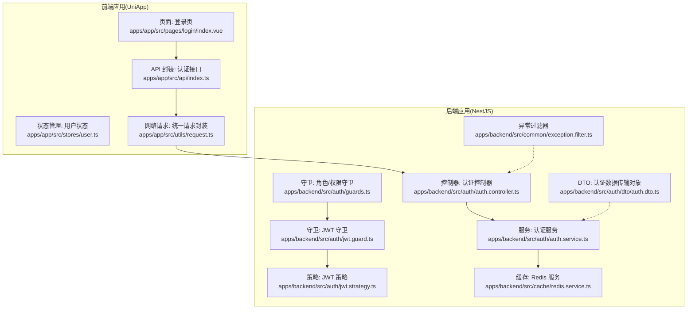

**图表来源**
- [apps/app/src/pages/login/index.vue:1-162](file://apps/app/src/pages/login/index.vue#L1-L162)
- [apps/app/src/stores/user.ts:1-61](file://apps/app/src/stores/user.ts#L1-L61)
- [apps/app/src/utils/request.ts:1-57](file://apps/app/src/utils/request.ts#L1-L57)
- [apps/app/src/api/index.ts:1-37](file://apps/app/src/api/index.ts#L1-L37)
- [apps/backend/src/auth/auth.controller.ts:1-87](file://apps/backend/src/auth/auth.controller.ts#L1-L87)
- [apps/backend/src/auth/auth.service.ts:1-294](file://apps/backend/src/auth/auth.service.ts#L1-L294)
- [apps/backend/src/auth/jwt.guard.ts:1-5](file://apps/backend/src/auth/jwt.guard.ts#L1-L5)
- [apps/backend/src/auth/jwt.strategy.ts:1-78](file://apps/backend/src/auth/jwt.strategy.ts#L1-L78)
- [apps/backend/src/auth/guards.ts:1-51](file://apps/backend/src/auth/guards.ts#L1-L51)
- [apps/backend/src/cache/redis.service.ts:1-128](file://apps/backend/src/cache/redis.service.ts#L1-L128)
- [apps/backend/src/common/exception.filter.ts:1-37](file://apps/backend/src/common/exception.filter.ts#L1-L37)
- [apps/backend/src/auth/dto/auth.dto.ts:1-91](file://apps/backend/src/auth/dto/auth.dto.ts#L1-L91)

**章节来源**
- [apps/app/src/pages/login/index.vue:1-162](file://apps/app/src/pages/login/index.vue#L1-L162)
- [apps/app/src/stores/user.ts:1-61](file://apps/app/src/stores/user.ts#L1-L61)
- [apps/app/src/utils/request.ts:1-57](file://apps/app/src/utils/request.ts#L1-L57)
- [apps/app/src/api/index.ts:1-37](file://apps/app/src/api/index.ts#L1-L37)
- [apps/backend/src/auth/auth.controller.ts:1-87](file://apps/backend/src/auth/auth.controller.ts#L1-L87)
- [apps/backend/src/auth/auth.service.ts:1-294](file://apps/backend/src/auth/auth.service.ts#L1-L294)
- [apps/backend/src/auth/jwt.guard.ts:1-5](file://apps/backend/src/auth/jwt.guard.ts#L1-L5)
- [apps/backend/src/auth/jwt.strategy.ts:1-78](file://apps/backend/src/auth/jwt.strategy.ts#L1-L78)
- [apps/backend/src/auth/guards.ts:1-51](file://apps/backend/src/auth/guards.ts#L1-L51)
- [apps/backend/src/cache/redis.service.ts:1-128](file://apps/backend/src/cache/redis.service.ts#L1-L128)
- [apps/backend/src/common/exception.filter.ts:1-37](file://apps/backend/src/common/exception.filter.ts#L1-L37)
- [apps/backend/src/auth/dto/auth.dto.ts:1-91](file://apps/backend/src/auth/dto/auth.dto.ts#L1-L91)

## 核心组件
- 前端用户状态管理：负责 Token 的读取、设置与清除，以及用户信息的获取与持久化。
- 前端统一请求封装：自动为每个请求添加 Authorization 头部，处理 401 未授权跳转与网络异常提示。
- 前端认证 API 封装：提供登录、登出、获取用户信息等接口调用方法。
- 后端认证控制器：暴露登录、注册、验证码、登出、用户信息等接口。
- 后端认证服务：执行登录验证、生成 JWT、用户信息查询、在线用户管理与密码更新。
- 后端 JWT 策略与守卫：从请求头提取 Bearer Token，验证签名与有效期，并注入用户上下文。
- 后端角色/权限守卫：基于元数据进行角色与权限校验。
- 后端 Redis 服务：维护在线用户集合与会话生命周期。
- 全局异常过滤器：统一返回错误响应格式。
- DTO 数据传输对象：定义登录、注册、验证码等输入参数的校验规则。

**章节来源**
- [apps/app/src/stores/user.ts:1-61](file://apps/app/src/stores/user.ts#L1-L61)
- [apps/app/src/utils/request.ts:1-57](file://apps/app/src/utils/request.ts#L1-L57)
- [apps/app/src/api/index.ts:1-37](file://apps/app/src/api/index.ts#L1-L37)
- [apps/backend/src/auth/auth.controller.ts:1-87](file://apps/backend/src/auth/auth.controller.ts#L1-L87)
- [apps/backend/src/auth/auth.service.ts:1-294](file://apps/backend/src/auth/auth.service.ts#L1-L294)
- [apps/backend/src/auth/jwt.strategy.ts:1-78](file://apps/backend/src/auth/jwt.strategy.ts#L1-L78)
- [apps/backend/src/auth/jwt.guard.ts:1-5](file://apps/backend/src/auth/jwt.guard.ts#L1-L5)
- [apps/backend/src/auth/guards.ts:1-51](file://apps/backend/src/auth/guards.ts#L1-L51)
- [apps/backend/src/cache/redis.service.ts:1-128](file://apps/backend/src/cache/redis.service.ts#L1-L128)
- [apps/backend/src/common/exception.filter.ts:1-37](file://apps/backend/src/common/exception.filter.ts#L1-L37)
- [apps/backend/src/auth/dto/auth.dto.ts:1-91](file://apps/backend/src/auth/dto/auth.dto.ts#L1-L91)

## 架构总览
移动端认证系统采用前后端分离架构，前端通过 HTTP 请求访问后端接口，后端使用 JWT 进行无状态认证。登录成功后，后端签发 JWT，前端将其存储在本地并随后续请求附带 Authorization 头部。后端通过 JWT 策略解析 Token 并注入用户信息，配合守卫实现路由级鉴权与权限控制。

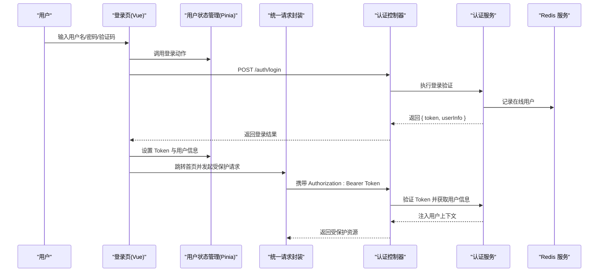

**图表来源**
- [apps/app/src/pages/login/index.vue:53-71](file://apps/app/src/pages/login/index.vue#L53-L71)
- [apps/app/src/stores/user.ts:30-37](file://apps/app/src/stores/user.ts#L30-L37)
- [apps/app/src/utils/request.ts:10-45](file://apps/app/src/utils/request.ts#L10-L45)
- [apps/app/src/api/index.ts:5-11](file://apps/app/src/api/index.ts#L5-L11)
- [apps/backend/src/auth/auth.controller.ts:13-19](file://apps/backend/src/auth/auth.controller.ts#L13-L19)
- [apps/backend/src/auth/auth.service.ts:29-89](file://apps/backend/src/auth/auth.service.ts#L29-L89)
- [apps/backend/src/cache/redis.service.ts:82-99](file://apps/backend/src/cache/redis.service.ts#L82-L99)

## 详细组件分析

### 前端用户状态管理（Pinia Store）
- 初始化：从本地存储读取 Token，若存在则保持登录态。
- 登录动作：调用认证接口获取 Token，保存到本地存储并设置用户信息。
- 获取用户信息：调用后端接口获取当前用户详情，失败时清理 Token 并重置状态。
- 登出动作：调用后端登出接口，最终清空 Token 与用户信息并移除本地存储。

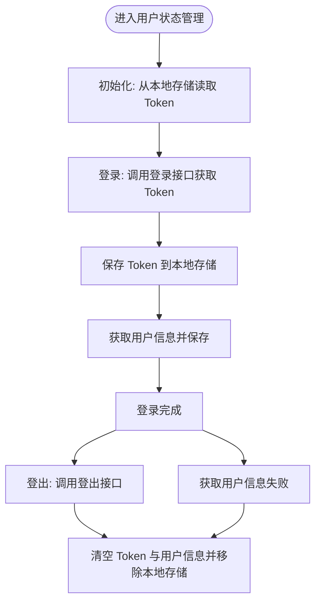

**图表来源**
- [apps/app/src/stores/user.ts:14-61](file://apps/app/src/stores/user.ts#L14-L61)

**章节来源**
- [apps/app/src/stores/user.ts:1-61](file://apps/app/src/stores/user.ts#L1-L61)

### 前端统一请求封装（拦截与重定向）
- 自动附加 Authorization 头：每次请求前从本地存储读取 Token 并添加到请求头。
- 401 未授权处理：当后端返回 401 时，清除本地 Token 并跳转至登录页。
- 网络异常处理：捕获网络错误并提示用户。
- 成功与失败回调：根据后端返回码决定业务分支。

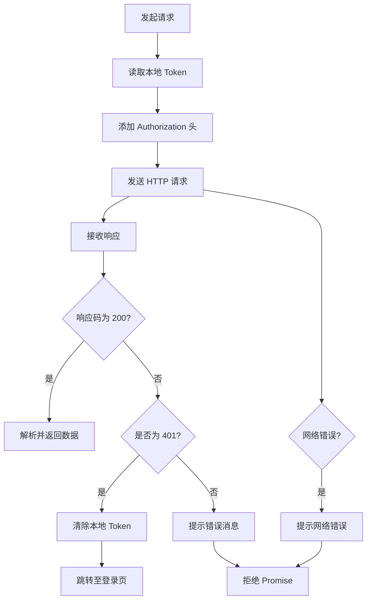

**图表来源**
- [apps/app/src/utils/request.ts:10-45](file://apps/app/src/utils/request.ts#L10-L45)

**章节来源**
- [apps/app/src/utils/request.ts:1-57](file://apps/app/src/utils/request.ts#L1-L57)

### 前端认证 API 封装
- 提供登录、微信登录、获取用户信息、登出等常用接口。
- 文件上传支持：通过 uni.uploadFile 发起上传请求并携带 Authorization 头。

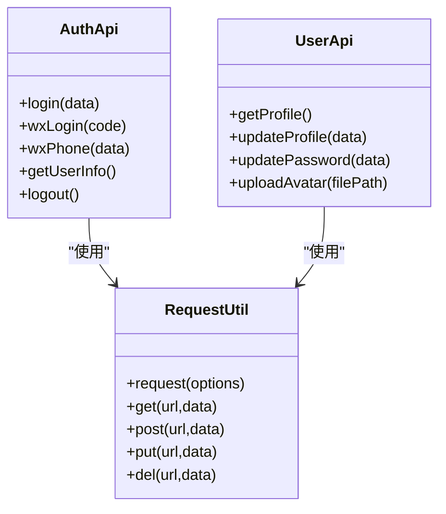

**图表来源**
- [apps/app/src/api/index.ts:5-37](file://apps/app/src/api/index.ts#L5-L37)
- [apps/app/src/utils/request.ts:10-57](file://apps/app/src/utils/request.ts#L10-L57)

**章节来源**
- [apps/app/src/api/index.ts:1-37](file://apps/app/src/api/index.ts#L1-L37)

### 后端认证控制器与服务
- 控制器暴露登录、注册、验证码、登出、用户信息、在线用户、个人资料等接口。
- 认证服务执行登录验证（验证码校验、密码比对、账户状态检查）、签发 JWT、记录在线用户、查询用户信息与菜单权限树、更新密码等。

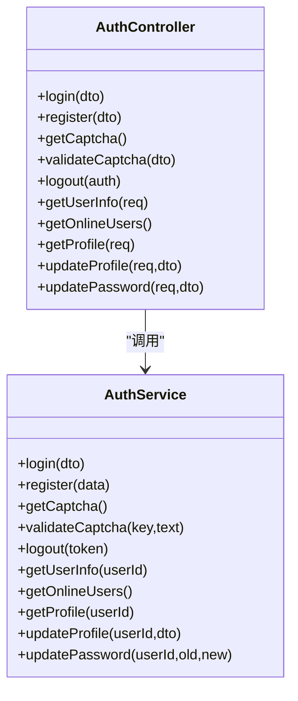

**图表来源**
- [apps/backend/src/auth/auth.controller.ts:10-87](file://apps/backend/src/auth/auth.controller.ts#L10-L87)
- [apps/backend/src/auth/auth.service.ts:21-294](file://apps/backend/src/auth/auth.service.ts#L21-L294)

**章节来源**
- [apps/backend/src/auth/auth.controller.ts:1-87](file://apps/backend/src/auth/auth.controller.ts#L1-L87)
- [apps/backend/src/auth/auth.service.ts:1-294](file://apps/backend/src/auth/auth.service.ts#L1-L294)

### JWT 策略与守卫
- JWT 策略：从 Authorization 头中提取 Bearer Token，验证签名与有效期，查询用户并注入角色与权限。
- JWT 守卫：继承自 AuthGuard('jwt')，用于路由级鉴权。
- 角色/权限守卫：基于反射元数据进行角色与权限校验。

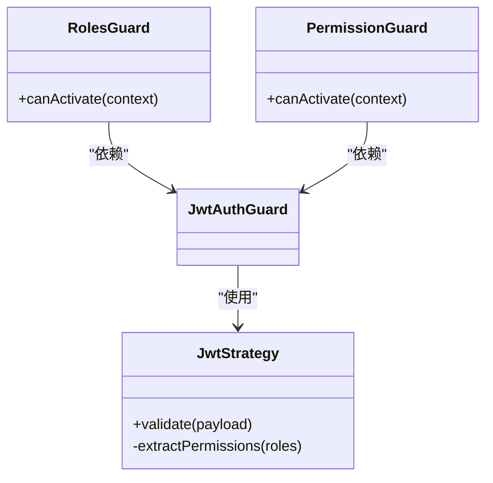

**图表来源**
- [apps/backend/src/auth/jwt.strategy.ts:8-78](file://apps/backend/src/auth/jwt.strategy.ts#L8-L78)
- [apps/backend/src/auth/jwt.guard.ts:1-5](file://apps/backend/src/auth/jwt.guard.ts#L1-L5)
- [apps/backend/src/auth/guards.ts:19-51](file://apps/backend/src/auth/guards.ts#L19-L51)

**章节来源**
- [apps/backend/src/auth/jwt.strategy.ts:1-78](file://apps/backend/src/auth/jwt.strategy.ts#L1-L78)
- [apps/backend/src/auth/jwt.guard.ts:1-5](file://apps/backend/src/auth/jwt.guard.ts#L1-L5)
- [apps/backend/src/auth/guards.ts:1-51](file://apps/backend/src/auth/guards.ts#L1-L51)

### 在线用户与会话管理（Redis）
- 维护在线用户集合：登录时写入在线用户映射，登出时删除。
- 支持查询在线用户列表与 TTL 查询，便于会话统计与清理。

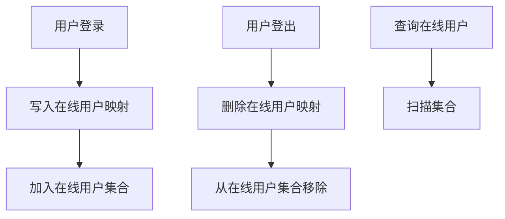

**图表来源**
- [apps/backend/src/cache/redis.service.ts:82-99](file://apps/backend/src/cache/redis.service.ts#L82-L99)

**章节来源**
- [apps/backend/src/cache/redis.service.ts:1-128](file://apps/backend/src/cache/redis.service.ts#L1-L128)

### 登录流程（前端）
- 渲染登录页，加载验证码图片。
- 用户提交表单，校验必填字段。
- 调用登录接口获取 Token，保存到本地存储并拉取用户信息。
- 成功后提示并跳转首页，失败时刷新验证码并提示错误。

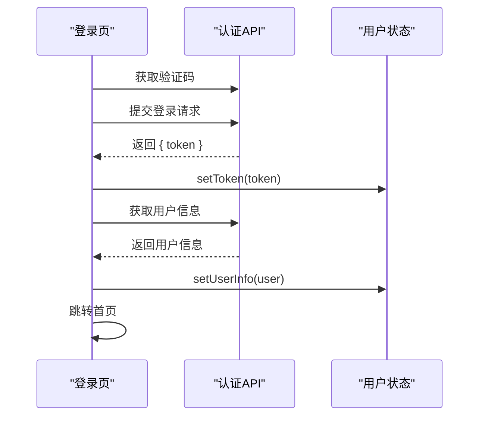

**图表来源**
- [apps/app/src/pages/login/index.vue:43-71](file://apps/app/src/pages/login/index.vue#L43-L71)
- [apps/app/src/api/index.ts:5-11](file://apps/app/src/api/index.ts#L5-L11)
- [apps/app/src/stores/user.ts:30-37](file://apps/app/src/stores/user.ts#L30-L37)

**章节来源**
- [apps/app/src/pages/login/index.vue:1-162](file://apps/app/src/pages/login/index.vue#L1-L162)
- [apps/app/src/api/index.ts:1-37](file://apps/app/src/api/index.ts#L1-L37)
- [apps/app/src/stores/user.ts:1-61](file://apps/app/src/stores/user.ts#L1-L61)

### 401 未授权自动跳转登录机制
- 前端请求拦截：当响应码为 401 时，清除本地 Token 并跳转至登录页。
- 后端策略：JWT 策略校验失败或用户状态异常时抛出未授权异常。

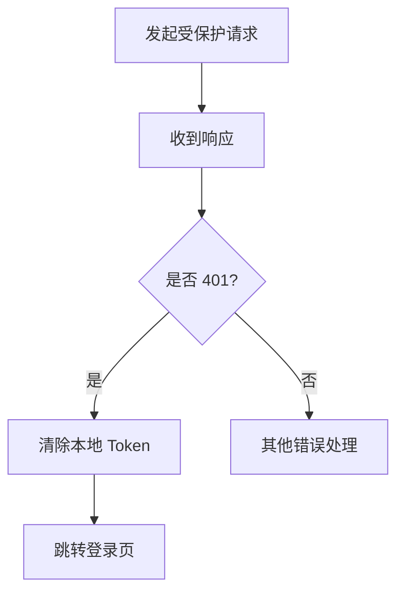

**图表来源**
- [apps/app/src/utils/request.ts:31-34](file://apps/app/src/utils/request.ts#L31-L34)
- [apps/backend/src/auth/jwt.strategy.ts:20-28](file://apps/backend/src/auth/jwt.strategy.ts#L20-L28)

**章节来源**
- [apps/app/src/utils/request.ts:1-57](file://apps/app/src/utils/request.ts#L1-L57)
- [apps/backend/src/auth/jwt.strategy.ts:1-78](file://apps/backend/src/auth/jwt.strategy.ts#L1-L78)

### 用户状态管理与登录状态检查
- 登录状态检查：通过读取本地存储中的 Token 判断是否已登录。
- 用户信息同步：登录后拉取用户信息并缓存，后续接口可直接使用。

**章节来源**
- [apps/app/src/stores/user.ts:14-28](file://apps/app/src/stores/user.ts#L14-L28)
- [apps/app/src/utils/request.ts:10-20](file://apps/app/src/utils/request.ts#L10-L20)

### Token 刷新机制
- 当前实现：前端未实现自动刷新 Token 的逻辑，建议在请求拦截器中增加刷新 Token 的判断与重试机制，避免频繁重新登录。
- 可选方案：引入双 Token（Access/Refresh）模型，后端提供刷新接口，前端在 Access Token 过期时静默刷新。

[本节为通用实现建议，不直接分析具体文件]

### 移动端特有的认证安全考虑
- Token 存储：当前使用本地存储（如 uni.setStorageSync），建议结合更安全的存储方案（如加密存储、硬件安全模块）以降低被窃取风险。
- 防篡改措施：对 Token 进行完整性校验（如 HMAC），并在服务端校验签名。
- 会话管理：利用 Redis 维护在线用户集合，支持强制下线与会话统计。
- HTTPS 传输：确保所有认证相关请求走 HTTPS，防止中间人攻击。
- 设备绑定与风险检测：结合设备指纹、IP 地址与登录行为进行风控。

**章节来源**
- [apps/backend/src/cache/redis.service.ts:82-99](file://apps/backend/src/cache/redis.service.ts#L82-L99)

### 登录失败处理、网络异常处理与用户体验优化
- 登录失败：前端提示错误信息并刷新验证码，避免重复尝试。
- 网络异常：统一提示“网络错误”，增强用户感知。
- 用户体验优化：登录成功后延迟提示，减少闪烁；加载验证码时避免阻塞主流程。

**章节来源**
- [apps/app/src/pages/login/index.vue:53-71](file://apps/app/src/pages/login/index.vue#L53-L71)
- [apps/app/src/utils/request.ts:39-42](file://apps/app/src/utils/request.ts#L39-L42)

### 不同平台的认证差异与兼容性处理
- 平台差异：不同小程序平台对本地存储、网络请求与页面跳转的 API 可能存在细微差异，需在各平台测试并做兼容适配。
- 统一抽象：通过封装统一的存储与网络请求接口，隔离平台差异，提升可移植性。

[本节为通用实现建议，不直接分析具体文件]

## 依赖关系分析
- 前端依赖：登录页依赖用户状态管理与认证 API；统一请求封装依赖本地存储与网络请求；认证 API 依赖统一请求封装。
- 后端依赖：控制器依赖认证服务；认证服务依赖数据库与 Redis；守卫依赖策略；全局异常过滤器统一处理异常。

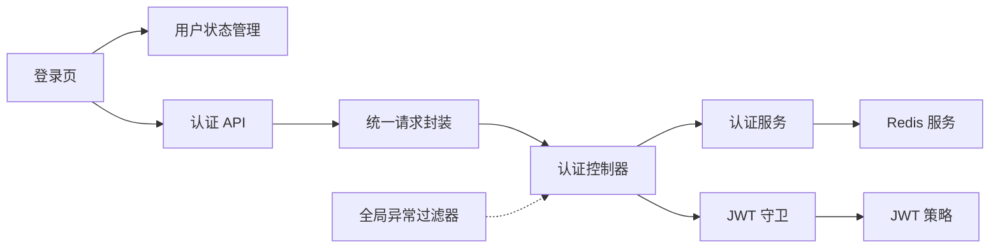

**图表来源**
- [apps/app/src/pages/login/index.vue:25-71](file://apps/app/src/pages/login/index.vue#L25-L71)
- [apps/app/src/stores/user.ts:20-37](file://apps/app/src/stores/user.ts#L20-L37)
- [apps/app/src/api/index.ts:5-11](file://apps/app/src/api/index.ts#L5-L11)
- [apps/app/src/utils/request.ts:10-45](file://apps/app/src/utils/request.ts#L10-L45)
- [apps/backend/src/auth/auth.controller.ts:10-87](file://apps/backend/src/auth/auth.controller.ts#L10-L87)
- [apps/backend/src/auth/auth.service.ts:21-294](file://apps/backend/src/auth/auth.service.ts#L21-L294)
- [apps/backend/src/cache/redis.service.ts:1-128](file://apps/backend/src/cache/redis.service.ts#L1-L128)
- [apps/backend/src/auth/jwt.guard.ts:1-5](file://apps/backend/src/auth/jwt.guard.ts#L1-L5)
- [apps/backend/src/auth/jwt.strategy.ts:8-18](file://apps/backend/src/auth/jwt.strategy.ts#L8-L18)
- [apps/backend/src/common/exception.filter.ts:12-37](file://apps/backend/src/common/exception.filter.ts#L12-L37)

**章节来源**
- [apps/app/src/pages/login/index.vue:1-162](file://apps/app/src/pages/login/index.vue#L1-L162)
- [apps/app/src/stores/user.ts:1-61](file://apps/app/src/stores/user.ts#L1-L61)
- [apps/app/src/api/index.ts:1-37](file://apps/app/src/api/index.ts#L1-L37)
- [apps/app/src/utils/request.ts:1-57](file://apps/app/src/utils/request.ts#L1-L57)
- [apps/backend/src/auth/auth.controller.ts:1-87](file://apps/backend/src/auth/auth.controller.ts#L1-L87)
- [apps/backend/src/auth/auth.service.ts:1-294](file://apps/backend/src/auth/auth.service.ts#L1-L294)
- [apps/backend/src/cache/redis.service.ts:1-128](file://apps/backend/src/cache/redis.service.ts#L1-L128)
- [apps/backend/src/auth/jwt.guard.ts:1-5](file://apps/backend/src/auth/jwt.guard.ts#L1-L5)
- [apps/backend/src/auth/jwt.strategy.ts:1-78](file://apps/backend/src/auth/jwt.strategy.ts#L1-L78)
- [apps/backend/src/common/exception.filter.ts:1-37](file://apps/backend/src/common/exception.filter.ts#L1-L37)

## 性能考虑
- 减少不必要的 Token 读取：在高频请求场景中，可将 Token 缓存在内存中，避免频繁访问本地存储。
- 批量接口合并：将多个小请求合并为批量请求，降低网络开销。
- 后端缓存：对用户信息与菜单权限进行缓存，减少数据库查询压力。
- 网络层优化：启用压缩与长连接，提升移动端弱网环境下的体验。

[本节为通用指导，不直接分析具体文件]

## 故障排除指南
- 登录失败：检查用户名/密码/验证码是否正确，确认后端验证码校验逻辑与 Redis 存储。
- 401 未授权：检查 Token 是否过期或被清除，确认 JWT 策略与守卫配置。
- 网络异常：检查网络连通性与代理设置，查看统一请求封装中的错误提示。
- 全局异常：查看全局异常过滤器输出的日志，定位具体异常类型与堆栈。

**章节来源**
- [apps/backend/src/common/exception.filter.ts:12-37](file://apps/backend/src/common/exception.filter.ts#L12-L37)
- [apps/app/src/utils/request.ts:31-42](file://apps/app/src/utils/request.ts#L31-L42)

## 结论
该移动端认证系统通过 JWT Bearer Token 实现了前后端分离的无状态认证，前端负责 Token 的获取与存储、请求拦截与错误处理，后端负责用户认证、权限校验与会话管理。系统具备基本的登录流程、401 自动跳转与错误提示能力，建议进一步完善 Token 刷新机制、安全存储与跨平台兼容性，以提升安全性与用户体验。

## 附录
- 前端文件路径参考：
  - 登录页：apps/app/src/pages/login/index.vue
  - 用户状态：apps/app/src/stores/user.ts
  - 请求封装：apps/app/src/utils/request.ts
  - API 封装：apps/app/src/api/index.ts
- 后端文件路径参考：
  - 认证控制器：apps/backend/src/auth/auth.controller.ts
  - 认证服务：apps/backend/src/auth/auth.service.ts
  - JWT 策略与守卫：apps/backend/src/auth/jwt.strategy.ts、apps/backend/src/auth/jwt.guard.ts
  - 角色/权限守卫：apps/backend/src/auth/guards.ts
  - Redis 服务：apps/backend/src/cache/redis.service.ts
  - 全局异常过滤器：apps/backend/src/common/exception.filter.ts
  - DTO：apps/backend/src/auth/dto/auth.dto.ts