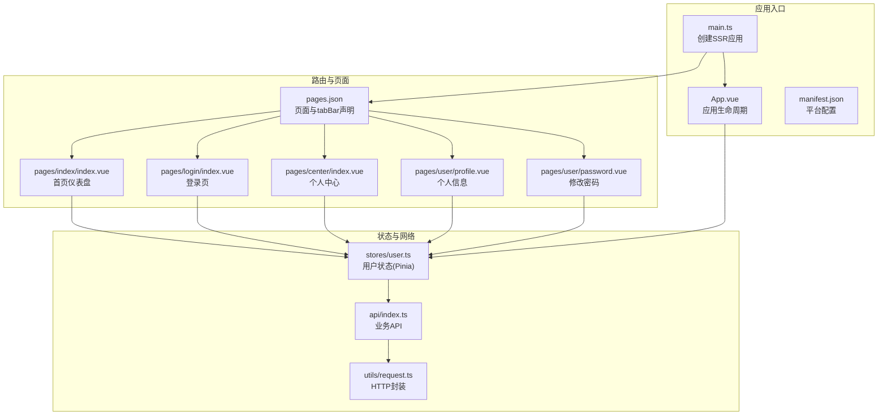
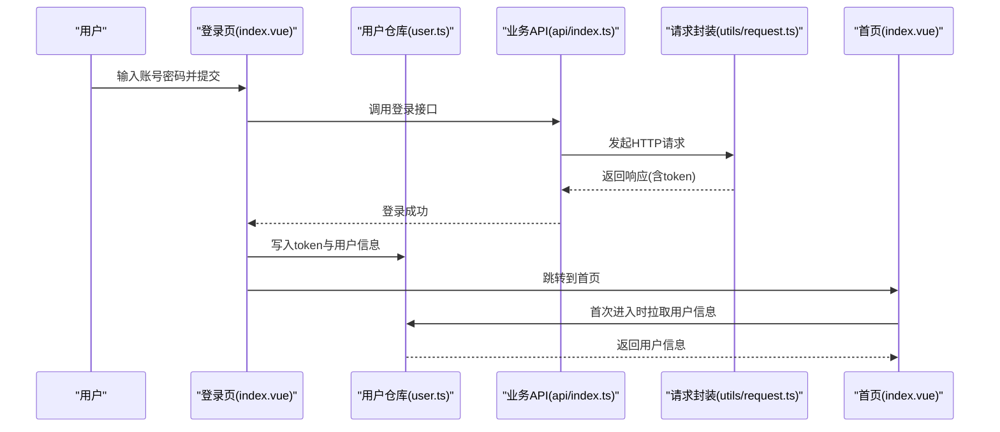
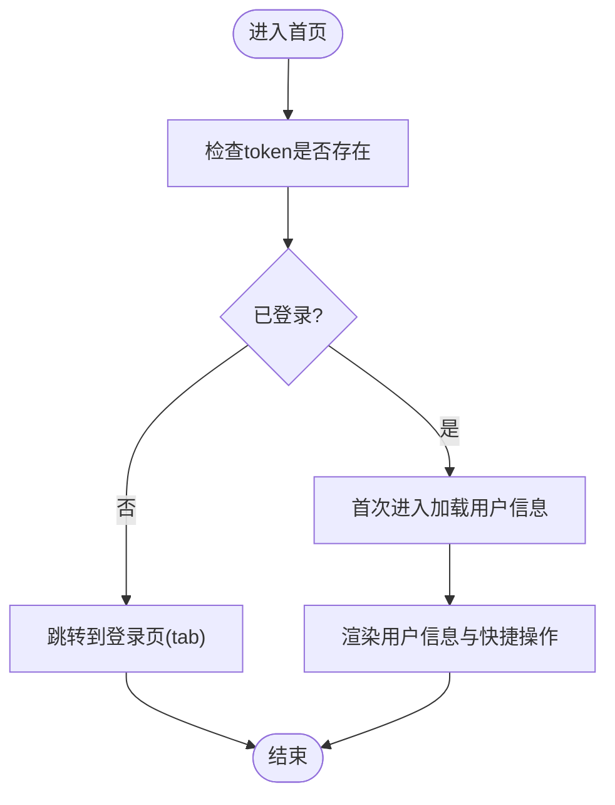
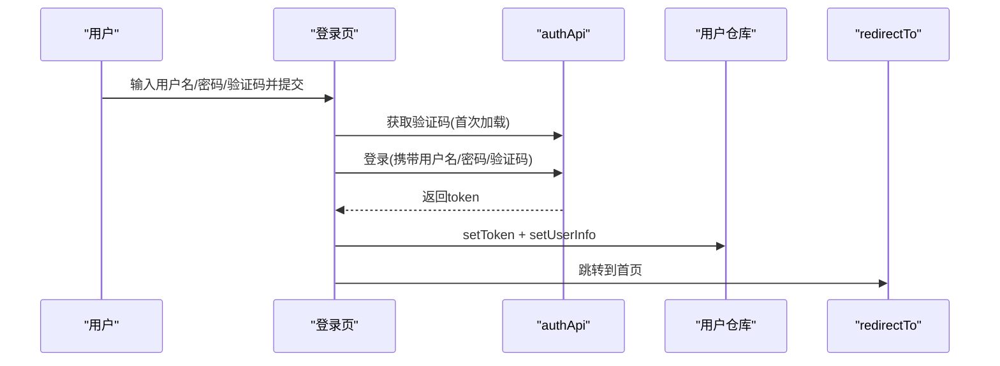
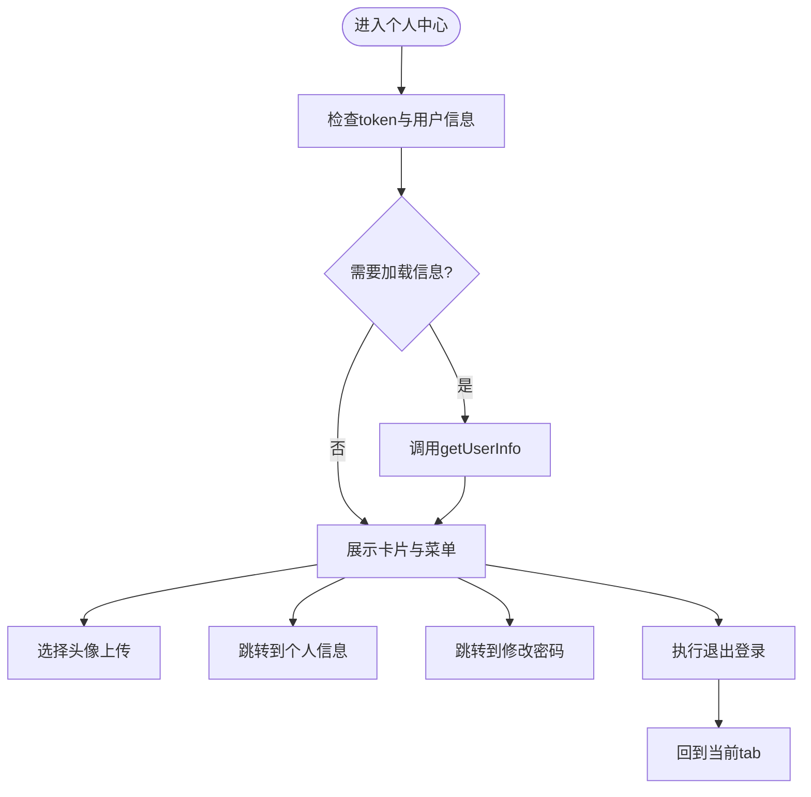
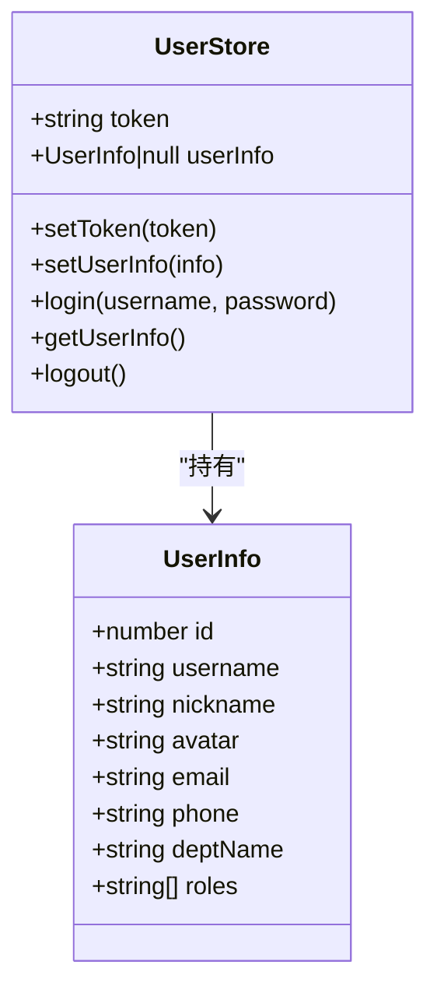
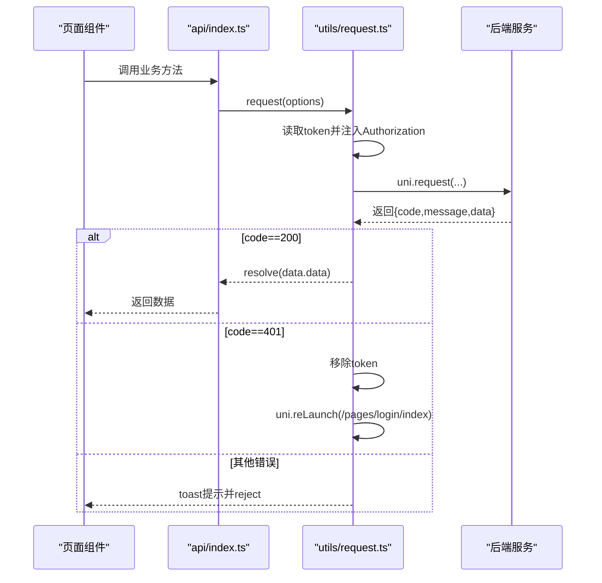
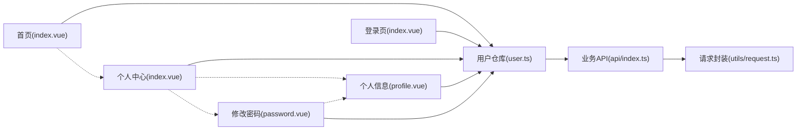

# 页面路由与导航

<cite>
**本文引用的文件**
- [apps/app/src/pages.json](file://apps/app/src/pages.json)
- [apps/app/src/main.ts](file://apps/app/src/main.ts)
- [apps/app/src/App.vue](file://apps/app/src/App.vue)
- [apps/app/src/stores/user.ts](file://apps/app/src/stores/user.ts)
- [apps/app/src/utils/request.ts](file://apps/app/src/utils/request.ts)
- [apps/app/src/api/index.ts](file://apps/app/src/api/index.ts)
- [apps/app/src/pages/index/index.vue](file://apps/app/src/pages/index/index.vue)
- [apps/app/src/pages/login/index.vue](file://apps/app/src/pages/login/index.vue)
- [apps/app/src/pages/center/index.vue](file://apps/app/src/pages/center/index.vue)
- [apps/app/src/pages/user/profile.vue](file://apps/app/src/pages/user/profile.vue)
- [apps/app/src/pages/user/password.vue](file://apps/app/src/pages/user/password.vue)
- [apps/app/src/manifest.json](file://apps/app/src/manifest.json)
- [apps/app/src/env.d.ts](file://apps/app/src/env.d.ts)
- [apps/app/src/shime-uni.d.ts](file://apps/app/src/shime-uni.d.ts)
</cite>

## 目录
1. [简介](#简介)
2. [项目结构](#项目结构)
3. [核心组件](#核心组件)
4. [架构总览](#架构总览)
5. [详细组件分析](#详细组件分析)
6. [依赖关系分析](#依赖关系分析)
7. [性能考虑](#性能考虑)
8. [故障排查指南](#故障排查指南)
9. [结论](#结论)
10. [附录](#附录)

## 简介
本文件系统性梳理移动端页面路由与导航体系，围绕 pages.json 路由配置、页面组件实现（首页仪表盘、登录页、个人中心等）、导航方式与参数传递、状态管理、移动端导航栏与 tabBar 配置、页面切换动画、路由守卫与生命周期管理、性能优化以及多小程序平台差异与适配策略展开。目标是帮助开发者在 uni-app 生态下高效构建稳定、可维护的移动端页面导航。

## 项目结构
移动端应用位于 apps/app，采用 uni-app + Vue 3 + Pinia 架构，页面路由通过 pages.json 统一声明，页面组件位于 src/pages 下，全局状态通过 src/stores 管理，网络请求封装于 src/utils/request.ts，并通过 src/api/index.ts 对外暴露接口。

图表来源
- [apps/app/src/main.ts:1-9](file://apps/app/src/main.ts#L1-L9)
- [apps/app/src/App.vue:1-14](file://apps/app/src/App.vue#L1-L14)
- [apps/app/src/pages.json:1-61](file://apps/app/src/pages.json#L1-L61)
- [apps/app/src/stores/user.ts:1-61](file://apps/app/src/stores/user.ts#L1-L61)
- [apps/app/src/utils/request.ts:1-57](file://apps/app/src/utils/request.ts#L1-L57)
- [apps/app/src/api/index.ts:1-37](file://apps/app/src/api/index.ts#L1-L37)

章节来源
- [apps/app/src/pages.json:1-61](file://apps/app/src/pages.json#L1-L61)
- [apps/app/src/main.ts:1-9](file://apps/app/src/main.ts#L1-L9)
- [apps/app/src/App.vue:1-14](file://apps/app/src/App.vue#L1-L14)
- [apps/app/src/manifest.json:1-73](file://apps/app/src/manifest.json#L1-L73)

## 核心组件
- 路由配置：通过 pages.json 声明页面路径、窗口样式与全局样式、tabBar 列表及图标。
- 页面组件：首页、登录页、个人中心、个人信息、修改密码等，均使用 uni-app 导航 API 实现跳转。
- 状态管理：Pinia 用户仓库负责 token、用户信息持久化与读取。
- 网络层：统一请求封装，自动注入 Authorization 头，处理 401 自动登出与提示。
- 平台配置：manifest.json 提供各小程序平台的组件化开关与权限配置。

章节来源
- [apps/app/src/pages.json:1-61](file://apps/app/src/pages.json#L1-L61)
- [apps/app/src/stores/user.ts:1-61](file://apps/app/src/stores/user.ts#L1-L61)
- [apps/app/src/utils/request.ts:1-57](file://apps/app/src/utils/request.ts#L1-L57)
- [apps/app/src/api/index.ts:1-37](file://apps/app/src/api/index.ts#L1-L37)

## 架构总览
移动端导航以 pages.json 为根，页面间通过 uni.navigateTo、uni.redirectTo、uni.switchTab、uni.navigateBack 等 API 进行切换；全局状态通过 Pinia 管理用户会话；网络请求统一拦截与错误处理，遇到 401 自动触发登出并回到登录页。

图表来源
- [apps/app/src/pages/login/index.vue:53-71](file://apps/app/src/pages/login/index.vue#L53-L71)
- [apps/app/src/stores/user.ts:30-37](file://apps/app/src/stores/user.ts#L30-L37)
- [apps/app/src/api/index.ts:5-11](file://apps/app/src/api/index.ts#L5-L11)
- [apps/app/src/utils/request.ts:10-45](file://apps/app/src/utils/request.ts#L10-L45)
- [apps/app/src/pages/index/index.vue:39-43](file://apps/app/src/pages/index/index.vue#L39-L43)

## 详细组件分析

### 路由配置与窗口样式
- 页面声明：pages.json 的 pages 数组中声明了登录、首页、个人中心、个人信息、修改密码五个页面，每个页面可独立设置标题与导航样式。
- 全局样式：globalStyle 控制导航栏文字颜色、标题、背景色与页面背景色。
- tabBar：定义两个标签页，分别指向首页与个人中心，配置选中与未选中图标、文字与边框样式。

章节来源
- [apps/app/src/pages.json:1-61](file://apps/app/src/pages.json#L1-L61)

### 首页仪表盘（pages/index/index.vue）
- 功能要点
  - 展示用户头像与昵称、角色列表。
  - 支持点击头像进入个人中心或登录页（依据是否已登录）。
  - 提供快捷操作入口（占位功能）。
- 生命周期
  - onShow 中在存在 token 且未加载用户信息时主动拉取用户信息。
- 导航行为
  - 使用 uni.switchTab 在已登录与未登录之间切换至对应 tab 页面。

图表来源
- [apps/app/src/pages/index/index.vue:39-51](file://apps/app/src/pages/index/index.vue#L39-L51)
- [apps/app/src/stores/user.ts:39-49](file://apps/app/src/stores/user.ts#L39-L49)

章节来源
- [apps/app/src/pages/index/index.vue:1-158](file://apps/app/src/pages/index/index.vue#L1-L158)

### 登录页（pages/login/index.vue）
- 功能要点
  - 表单输入用户名、密码、验证码。
  - 点击图片刷新验证码，提交后调用登录接口，写入 token 与用户信息。
  - 成功后延迟跳转到首页。
- 验证码机制
  - 通过 authApi.captcha 获取验证码图片与 key。
- 错误处理
  - 参数校验失败与接口异常均进行 toast 提示，并重新加载验证码。

图表来源
- [apps/app/src/pages/login/index.vue:43-71](file://apps/app/src/pages/login/index.vue#L43-L71)
- [apps/app/src/api/index.ts:5-11](file://apps/app/src/api/index.ts#L5-L11)
- [apps/app/src/stores/user.ts:20-28](file://apps/app/src/stores/user.ts#L20-L28)

章节来源
- [apps/app/src/pages/login/index.vue:1-162](file://apps/app/src/pages/login/index.vue#L1-L162)

### 个人中心（pages/center/index.vue）
- 功能要点
  - 展示用户头像、昵称、用户名。
  - 支持更换头像（相册或相机），上传后更新本地头像显示。
  - 跳转到个人信息与修改密码页面。
  - 提供退出登录，清空本地状态并回到当前 tab。
- 生命周期
  - onShow 中在已登录但未加载用户信息时主动拉取。

图表来源
- [apps/app/src/pages/center/index.vue:41-78](file://apps/app/src/pages/center/index.vue#L41-L78)
- [apps/app/src/api/index.ts:5-11](file://apps/app/src/api/index.ts#L5-L11)
- [apps/app/src/stores/user.ts:51-59](file://apps/app/src/stores/user.ts#L51-L59)

章节来源
- [apps/app/src/pages/center/index.vue:1-168](file://apps/app/src/pages/center/index.vue#L1-L168)

### 个人信息（pages/user/profile.vue）
- 功能要点
  - 展示并编辑用户昵称、邮箱、电话、备注等字段。
  - 支持更换头像并上传，成功后更新本地视图与用户仓库中的用户信息。
- 生命周期
  - onShow 中拉取用户资料并填充表单。

章节来源
- [apps/app/src/pages/user/profile.vue:1-173](file://apps/app/src/pages/user/profile.vue#L1-L173)

### 修改密码（pages/user/password.vue）
- 功能要点
  - 校验旧密码、新密码、确认密码一致性与长度。
  - 提交后提示成功并返回上一页。
- 导航行为
  - 使用 uni.navigateBack 返回上一页。

章节来源
- [apps/app/src/pages/user/password.vue:1-109](file://apps/app/src/pages/user/password.vue#L1-L109)

### 状态管理（stores/user.ts）
- 数据模型
  - token：存储在本地缓存，用于鉴权。
  - userInfo：用户信息对象，包含 id、username、nickname、avatar、email、phone、deptName、roles 等。
- 关键动作
  - setToken：写入本地缓存并同步状态。
  - setUserInfo：设置用户信息。
  - login：调用登录接口，写入 token 与用户信息。
  - getUserInfo：拉取用户信息，异常时清理 token。
  - logout：调用登出接口并清理本地状态。

图表来源
- [apps/app/src/stores/user.ts:1-61](file://apps/app/src/stores/user.ts#L1-L61)

章节来源
- [apps/app/src/stores/user.ts:1-61](file://apps/app/src/stores/user.ts#L1-L61)

### 网络层与路由守卫（utils/request.ts 与 api/index.ts）
- 请求封装
  - 自动从本地缓存读取 token 并注入 Authorization 头。
  - 统一处理响应码，当 code 为 401 时移除 token 并通过 uni.reLaunch 回到登录页。
  - 网络错误统一 toast 提示。
- 业务 API
  - authApi：登录、微信登录、获取用户信息、登出。
  - userApi：获取/更新个人信息、修改密码、上传头像（uploadFile）。

图表来源
- [apps/app/src/utils/request.ts:10-45](file://apps/app/src/utils/request.ts#L10-L45)
- [apps/app/src/api/index.ts:5-37](file://apps/app/src/api/index.ts#L5-L37)

章节来源
- [apps/app/src/utils/request.ts:1-57](file://apps/app/src/utils/request.ts#L1-L57)
- [apps/app/src/api/index.ts:1-37](file://apps/app/src/api/index.ts#L1-L37)

## 依赖关系分析
- 页面到状态：首页、登录页、个人中心、个人信息、修改密码均依赖用户仓库。
- 状态到网络：用户仓库通过业务 API 调用请求封装完成登录、登出、信息拉取与更新。
- 页面到页面：首页通过 switchTab 访问个人中心；个人中心通过 navigateTo 访问详情页；修改密码通过 navigateBack 返回。

图表来源
- [apps/app/src/pages/index/index.vue:39-51](file://apps/app/src/pages/index/index.vue#L39-L51)
- [apps/app/src/pages/center/index.vue:64-70](file://apps/app/src/pages/center/index.vue#L64-L70)
- [apps/app/src/pages/user/password.vue:58-64](file://apps/app/src/pages/user/password.vue#L58-L64)
- [apps/app/src/stores/user.ts:1-61](file://apps/app/src/stores/user.ts#L1-L61)
- [apps/app/src/api/index.ts:1-37](file://apps/app/src/api/index.ts#L1-L37)
- [apps/app/src/utils/request.ts:1-57](file://apps/app/src/utils/request.ts#L1-L57)

章节来源
- [apps/app/src/pages/index/index.vue:1-158](file://apps/app/src/pages/index/index.vue#L1-L158)
- [apps/app/src/pages/center/index.vue:1-168](file://apps/app/src/pages/center/index.vue#L1-L168)
- [apps/app/src/pages/user/password.vue:1-109](file://apps/app/src/pages/user/password.vue#L1-L109)
- [apps/app/src/stores/user.ts:1-61](file://apps/app/src/stores/user.ts#L1-L61)
- [apps/app/src/api/index.ts:1-37](file://apps/app/src/api/index.ts#L1-L37)
- [apps/app/src/utils/request.ts:1-57](file://apps/app/src/utils/request.ts#L1-L57)

## 性能考虑
- 页面懒加载与按需导入
  - 在用户仓库中对 API 模块采用动态 import，减少首屏体积。
- 缓存与本地存储
  - token 与用户信息使用本地缓存，避免重复请求。
- 图片与资源
  - 头像上传建议压缩与裁剪，减少带宽与渲染压力。
- 导航策略
  - 同 tab 内部使用 navigateTo，跨 tab 使用 switchTab，避免不必要的页面重建。
- 生命周期优化
  - onShow 中仅在必要时拉取用户信息，避免重复请求。

章节来源
- [apps/app/src/stores/user.ts:30-37](file://apps/app/src/stores/user.ts#L30-L37)
- [apps/app/src/pages/index/index.vue:39-43](file://apps/app/src/pages/index/index.vue#L39-L43)
- [apps/app/src/pages/center/index.vue:41-45](file://apps/app/src/pages/center/index.vue#L41-L45)

## 故障排查指南
- 登录后无法进入首页
  - 检查登录成功后是否正确写入 token 与用户信息，确认跳转逻辑。
  - 参考：[apps/app/src/pages/login/index.vue:53-71](file://apps/app/src/pages/login/index.vue#L53-L71)
- 401 自动登出后未回到登录页
  - 检查请求封装中 reLaunch 的路径是否正确，确保 pages.json 中登录页路径一致。
  - 参考：[apps/app/src/utils/request.ts:31-34](file://apps/app/src/utils/request.ts#L31-L34)，[apps/app/src/pages.json:4-8](file://apps/app/src/pages.json#L4-L8)
- 个人中心头像上传失败
  - 检查上传接口返回与本地缓存更新逻辑，确认 toast 提示与异常分支。
  - 参考：[apps/app/src/pages/center/index.vue:47-62](file://apps/app/src/pages/center/index.vue#L47-L62)
- 修改密码校验不通过
  - 检查旧密码、新密码、确认密码长度与一致性校验逻辑。
  - 参考：[apps/app/src/pages/user/password.vue:34-64](file://apps/app/src/pages/user/password.vue#L34-L64)

章节来源
- [apps/app/src/pages/login/index.vue:53-71](file://apps/app/src/pages/login/index.vue#L53-L71)
- [apps/app/src/utils/request.ts:31-34](file://apps/app/src/utils/request.ts#L31-L34)
- [apps/app/src/pages.json:4-8](file://apps/app/src/pages.json#L4-L8)
- [apps/app/src/pages/center/index.vue:47-62](file://apps/app/src/pages/center/index.vue#L47-L62)
- [apps/app/src/pages/user/password.vue:34-64](file://apps/app/src/pages/user/password.vue#L34-L64)

## 结论
该移动端路由与导航体系以 pages.json 为核心，结合 uni-app 导航 API 与 Pinia 状态管理，实现了清晰的页面关系与稳定的会话流程。配合统一的请求封装与 401 自动登出机制，保证了用户体验与安全性。建议在后续迭代中进一步完善路由守卫、页面预加载与缓存策略，以提升性能与稳定性。

## 附录

### 页面与导航方式对照
- 首页 → 个人中心：switchTab
- 个人中心 → 个人信息/修改密码：navigateTo
- 修改密码 → 上一页：navigateBack
- 登录成功 → 首页：redirectTo

章节来源
- [apps/app/src/pages/index/index.vue:45-51](file://apps/app/src/pages/index/index.vue#L45-L51)
- [apps/app/src/pages/center/index.vue:64-70](file://apps/app/src/pages/center/index.vue#L64-L70)
- [apps/app/src/pages/user/password.vue:58-64](file://apps/app/src/pages/user/password.vue#L58-L64)

### 移动端导航栏与 tabBar 配置
- 导航栏标题与样式：在 pages.json 中为每个页面的 style 字段设置 navigationBarTitleText 与 navigationStyle。
- 全局样式：globalStyle 统一导航栏文字颜色、标题与背景色。
- tabBar：配置颜色、选中色、背景色、边框样式与列表项（pagePath、iconPath、selectedIconPath、text）。

章节来源
- [apps/app/src/pages.json:5-40](file://apps/app/src/pages.json#L5-L40)
- [apps/app/src/pages.json:41-60](file://apps/app/src/pages.json#L41-L60)

### 不同小程序平台的路由差异与适配
- 平台配置：manifest.json 中 mp-weixin、mp-alipay、mp-baidu、mp-toutiao 等节点开启 usingComponents，确保组件化能力一致。
- 权限与模块：Android 权限清单与相机等硬件权限在 manifest.json 中集中声明，避免运行期报错。
- 通用适配建议
  - 使用 uni-app 导航 API（navigateTo、redirectTo、switchTab、navigateBack）替代平台特定实现。
  - 在 pages.json 中统一声明页面与 tabBar，避免各平台差异导致的路径不一致。
  - 对于平台特有能力（如微信登录），通过条件编译或平台检测进行差异化处理。

章节来源
- [apps/app/src/manifest.json:52-67](file://apps/app/src/manifest.json#L52-L67)
- [apps/app/src/manifest.json:24-41](file://apps/app/src/manifest.json#L24-L41)

### 类型与环境声明
- env.d.ts：为 .vue 文件提供类型支持。
- shime-uni.d.ts：为 Vue 组件混入 uni-app 的 App 与 Page 生命周期钩子类型。

章节来源
- [apps/app/src/env.d.ts:1-9](file://apps/app/src/env.d.ts#L1-L9)
- [apps/app/src/shime-uni.d.ts:1-6](file://apps/app/src/shime-uni.d.ts#L1-L6)