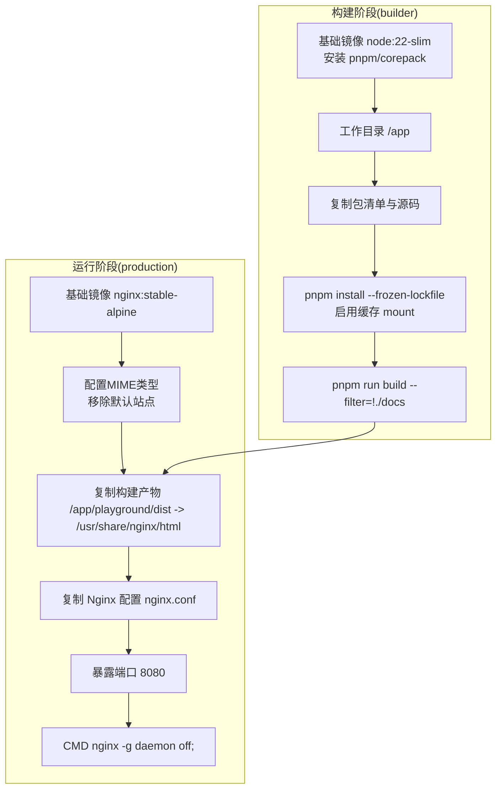
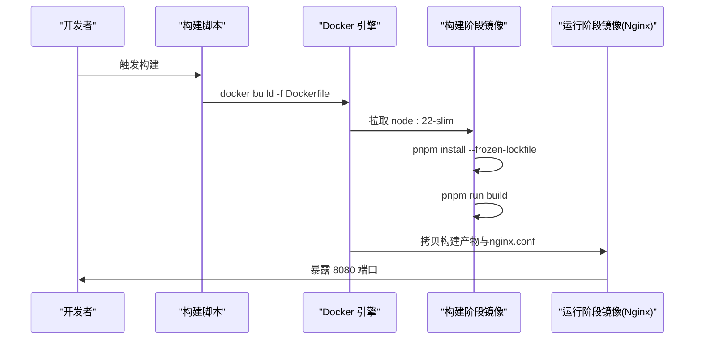
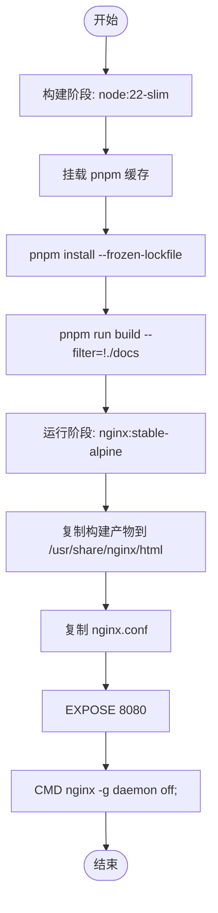
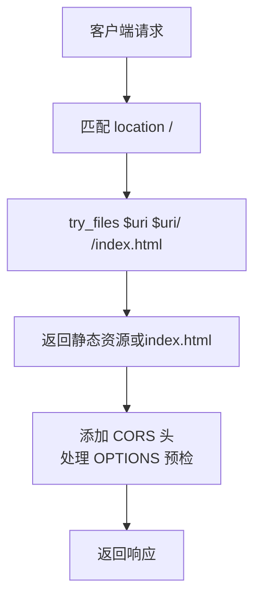
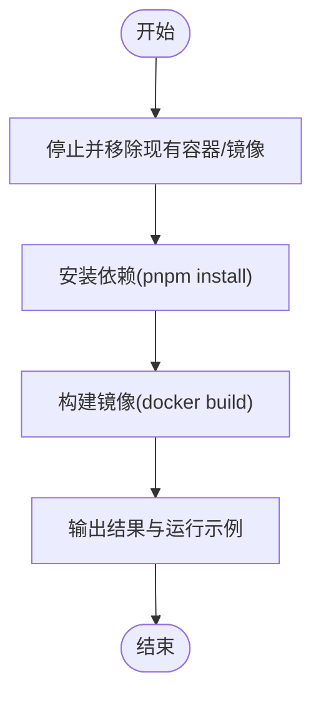
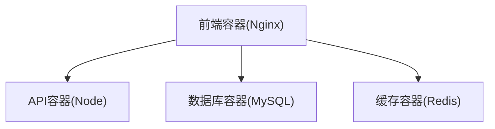
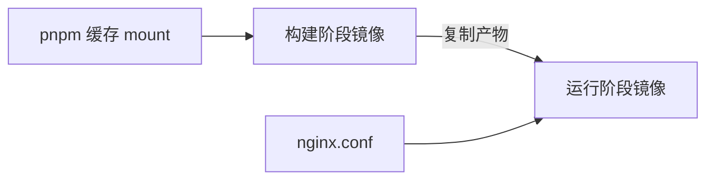

# Docker容器化部署

<cite>
**本文档引用的文件**
- [Dockerfile](file://apps/vben-admin/scripts/deploy/Dockerfile)
- [.dockerignore](file://apps/vben-admin/.dockerignore)
- [nginx.conf](file://apps/vben-admin/scripts/deploy/nginx.conf)
- [build-local-docker-image.sh](file://apps/vben-admin/scripts/deploy/build-local-docker-image.sh)
- [package.json](file://apps/vben-admin/package.json)
- [env.config.ts](file://apps/backend/src/config/env.config.ts)
- [deployment.md](file://docs/deployment.md)
- [env.ts](file://apps/vben-admin/internal/vite-config/src/utils/env.ts)
</cite>

## 目录
1. [简介](#简介)
2. [项目结构](#项目结构)
3. [核心组件](#核心组件)
4. [架构总览](#架构总览)
5. [详细组件分析](#详细组件分析)
6. [依赖关系分析](#依赖关系分析)
7. [性能考虑](#性能考虑)
8. [故障排查指南](#故障排查指南)
9. [结论](#结论)
10. [附录](#附录)

## 简介
本文件面向Nest-Admin-Pro项目的Docker容器化部署，围绕前端Vben Admin的单页应用构建与运行展开，系统性说明Dockerfile的多阶段构建策略、镜像优化技巧、依赖管理方式；详解容器运行时配置（端口映射、环境变量传递、卷挂载）；提供容器编排思路与最佳实践；总结镜像构建优化（层缓存、体积压缩、安全扫描）；并给出容器监控与日志管理建议及故障排查方法。

## 项目结构
前端采用Vite构建，最终产物由Nginx提供静态服务。Dockerfile通过两阶段构建：第一阶段使用NodeSlim安装依赖并构建前端产物；第二阶段使用Nginx稳定版Alpine作为运行时，复制构建产物与Nginx配置，暴露8080端口并以前台模式启动Nginx。

**图表来源**
- [Dockerfile:1-39](file://apps/vben-admin/scripts/deploy/Dockerfile#L1-L39)

**章节来源**
- [Dockerfile:1-39](file://apps/vben-admin/scripts/deploy/Dockerfile#L1-L39)
- [.dockerignore:1-8](file://apps/vben-admin/.dockerignore#L1-L8)

## 核心组件
- 多阶段构建
  - 构建阶段：基于node:22-slim，启用pnpm缓存mount，冻结锁文件安装依赖，执行前端构建。
  - 运行阶段：基于nginx:stable-alpine，仅复制构建产物与Nginx配置，最小化运行时依赖。
- 依赖管理
  - 使用pnpm作为包管理器，结合Docker缓存mount提升重复构建速度。
  - 通过--frozen-lockfile确保依赖版本一致性。
- 运行时配置
  - Nginx监听8080端口，开启CORS头，支持SPA路由回退到index.html。
  - 通过环境变量控制Node内存上限、时区、CI模式等。
- 构建脚本
  - 提供本地镜像构建脚本，包含依赖安装、镜像构建、容器清理与运行示例输出。

**章节来源**
- [Dockerfile:1-39](file://apps/vben-admin/scripts/deploy/Dockerfile#L1-L39)
- [build-local-docker-image.sh:1-56](file://apps/vben-admin/scripts/deploy/build-local-docker-image.sh#L1-L56)
- [nginx.conf:1-76](file://apps/vben-admin/scripts/deploy/nginx.conf#L1-L76)

## 架构总览
下图展示从源码到容器运行的整体流程：开发者在宿主机执行构建脚本或直接使用Dockerfile，构建阶段产出静态资源；运行阶段由Nginx提供静态文件服务，并对API请求进行反向代理（若需要）。

**图表来源**
- [build-local-docker-image.sh:25-28](file://apps/vben-admin/scripts/deploy/build-local-docker-image.sh#L25-L28)
- [Dockerfile:1-39](file://apps/vben-admin/scripts/deploy/Dockerfile#L1-L39)

## 详细组件分析

### Dockerfile 多阶段构建分析
- 构建阶段
  - 基础镜像：node:22-slim，安装corepack以启用pnpm。
  - 工作目录与缓存：设置工作目录，复制包清单与源码，使用--mount=type=cache挂载pnpm store以复用依赖缓存。
  - 依赖安装与构建：--frozen-lockfile保证锁定文件一致；过滤掉docs子包避免构建。
- 运行阶段
  - 基础镜像：nginx:stable-alpine，配置MIME类型，删除默认站点。
  - 资源复制：将构建产物复制到/usr/share/nginx/html，复制nginx.conf覆盖默认配置。
  - 端口与启动：暴露8080，前台运行nginx。

**图表来源**
- [Dockerfile:1-39](file://apps/vben-admin/scripts/deploy/Dockerfile#L1-L39)

**章节来源**
- [Dockerfile:1-39](file://apps/vben-admin/scripts/deploy/Dockerfile#L1-L39)

### Nginx 配置与CORS处理
- MIME类型与静态资源：定义JS、CSS、HTML类型，确保浏览器正确解析。
- SPA路由回退：location /下使用try_files $uri $uri/ /index.html，解决前端路由刷新问题。
- CORS支持：为跨域请求添加标准CORS头，并对OPTIONS预检请求返回204。
- 端口监听：监听8080端口，便于容器端口映射。

**图表来源**
- [nginx.conf:49-74](file://apps/vben-admin/scripts/deploy/nginx.conf#L49-L74)

**章节来源**
- [nginx.conf:1-76](file://apps/vben-admin/scripts/deploy/nginx.conf#L1-L76)

### 构建脚本与本地开发流程
- 自动化流程：停止并移除同名容器与镜像，安装依赖，构建镜像，输出运行示例命令。
- 日志记录：所有步骤输出写入日志文件，便于排障。
- 运行示例：构建成功后输出docker run示例，映射8010:8080。

**图表来源**
- [build-local-docker-image.sh:8-41](file://apps/vben-admin/scripts/deploy/build-local-docker-image.sh#L8-L41)

**章节来源**
- [build-local-docker-image.sh:1-56](file://apps/vben-admin/scripts/deploy/build-local-docker-image.sh#L1-L56)

### 容器运行时配置
- 端口映射
  - 运行阶段暴露8080，建议在docker run或compose中映射到宿主端口，如8010:8080。
- 环境变量传递
  - 构建阶段设置TZ、CI、NODE_OPTIONS等，可在docker run时通过-e传入覆盖。
  - 前端运行时可通过.env.*文件注入构建期环境变量（VITE_*），由构建工具转换为运行时可用配置。
- 卷挂载
  - 若需持久化或热更新，可将构建产物目录挂载为卷（谨慎使用，建议仅开发环境）。
  - 上传目录或日志目录建议挂载至宿主机持久卷。

**章节来源**
- [Dockerfile:4-8](file://apps/vben-admin/scripts/deploy/Dockerfile#L4-L8)
- [nginx.conf:49-74](file://apps/vben-admin/scripts/deploy/nginx.conf#L49-L74)
- [env.ts:66-93](file://apps/vben-admin/internal/vite-config/src/utils/env.ts#L66-L93)

### 容器编排与容器间通信
- 单容器运行
  - 前端容器独立运行，提供静态资源服务；API服务可单独部署在其他容器或外部服务。
- 多容器编排（概念性说明）
  - 若需与后端API通信，可在同一网络内通过服务名访问，例如将前端容器与API容器置于同一network，前端通过相对路径或环境变量配置的API地址进行调用。
  - 数据库与缓存（MySQL/Redis）可按需加入编排，实现一键拉起完整环境。

[此图为概念性编排示意，不对应具体源码文件]

## 依赖关系分析
- 组件耦合
  - 构建阶段与运行阶段通过中间产物解耦，降低运行镜像体积。
  - Nginx配置与构建产物强关联，需保持一致性。
- 外部依赖
  - Node:22-slim提供构建环境；nginx:stable-alpine提供运行时。
  - pnpm缓存mount减少网络与I/O开销。
- 潜在循环依赖
  - 当前结构无循环依赖；注意不要在运行阶段引入构建期依赖。

**图表来源**
- [Dockerfile:1-39](file://apps/vben-admin/scripts/deploy/Dockerfile#L1-L39)

**章节来源**
- [Dockerfile:1-39](file://apps/vben-admin/scripts/deploy/Dockerfile#L1-L39)

## 性能考虑
- 层缓存利用
  - 将包清单与源码复制分步进行，优先触发缓存命中；使用--mount=type=cache复用pnpm store。
- 体积压缩
  - 使用Alpine基础镜像减小体积；仅复制必要文件（构建产物与配置）。
  - 在Nginx中可启用Gzip压缩（当前配置注释掉，可根据需求开启）。
- 启动性能
  - 使用前台模式运行Nginx，避免守护进程导致容器退出。
  - 控制Node内存上限（NODE_OPTIONS）避免OOM。

**章节来源**
- [Dockerfile:1-39](file://apps/vben-admin/scripts/deploy/Dockerfile#L1-L39)
- [nginx.conf:33-47](file://apps/vben-admin/scripts/deploy/nginx.conf#L33-L47)

## 故障排查指南
- 构建失败
  - 检查pnpm install是否因网络或锁文件不一致失败；确认--frozen-lockfile策略。
  - 查看构建脚本日志文件定位错误。
- 容器无法启动
  - 确认端口未被占用；检查EXPOSE与docker run映射是否一致。
  - 查看Nginx错误日志（可临时开启error_log）。
- 跨域与路由问题
  - 确认CORS头已添加；检查Nginx location块与try_files配置。
  - 前端路由刷新导致404时，确认SPA回退到index.html的配置。
- 环境变量与配置
  - 前端构建期环境变量需以VITE_前缀；运行时可通过.env.*加载。
  - 后端环境变量（如数据库、Redis、JWT等）需在运行时容器中正确传递。

**章节来源**
- [build-local-docker-image.sh:30-41](file://apps/vben-admin/scripts/deploy/build-local-docker-image.sh#L30-L41)
- [nginx.conf:57-66](file://apps/vben-admin/scripts/deploy/nginx.conf#L57-L66)
- [env.ts:37-64](file://apps/vben-admin/internal/vite-config/src/utils/env.ts#L37-L64)
- [env.config.ts:3-47](file://apps/backend/src/config/env.config.ts#L3-L47)

## 结论
该Docker方案通过多阶段构建与Nginx运行时实现了“小而快”的前端容器化部署：构建期专注依赖与产物生成，运行期专注静态资源服务与路由回退。配合缓存mount与Alpine基础镜像，显著提升了构建效率与镜像体积表现。建议在生产环境中结合容器编排平台统一管理，完善监控与日志采集，并根据业务需要扩展API网关或反向代理层。

## 附录
- 前端构建与运行参考
  - 前端工程根目录的package.json脚本可用于理解构建流程与产物位置。
- 后端环境变量参考
  - 后端配置模块集中读取环境变量，建议在容器运行时通过-e或.env文件注入。
- 文档与脚本
  - 仓库提供了完整的部署文档与本地构建脚本，可作为容器化部署的起点。

**章节来源**
- [package.json:27-53](file://apps/vben-admin/package.json#L27-L53)
- [env.config.ts:3-47](file://apps/backend/src/config/env.config.ts#L3-L47)
- [deployment.md:154-224](file://docs/deployment.md#L154-L224)