# Nginx反向代理配置

<cite>
**本文档引用的文件**
- [nginx.conf](file://apps/vben-admin/scripts/deploy/nginx.conf)
- [Dockerfile](file://apps/vben-admin/scripts/deploy/Dockerfile)
- [vite.config.ts](file://apps/vben-admin/apps/web-antd/vite.config.ts)
- [auth.ts](file://apps/vben-admin/apps/web-antd/src/api/core/auth.ts)
- [main.ts](file://apps/backend/src/main.ts)
- [deployment.md](file://docs/deployment.md)
- [.env.production](file://apps/vben-admin/apps/web-antd/.env.production)
- [.env.development](file://apps/vben-admin/apps/web-antd/.env.development)
</cite>

## 目录
1. [简介](#简介)
2. [项目结构](#项目结构)
3. [核心组件](#核心组件)
4. [架构概览](#架构概览)
5. [详细组件分析](#详细组件分析)
6. [依赖关系分析](#依赖关系分析)
7. [性能考虑](#性能考虑)
8. [故障排除指南](#故障排除指南)
9. [结论](#结论)

## 简介

本文件提供了Nest-Admin-Pro项目的Nginx反向代理配置全面文档。该系统采用前后端分离架构，前端通过Vite构建，后端基于NestJS，Nginx作为反向代理服务器提供静态资源服务和API转发。

项目包含三个主要应用：
- **前端应用**：基于Vite的单页应用，构建后产物由Nginx托管
- **后端服务**：NestJS API服务器，默认监听3000端口
- **反向代理**：Nginx服务器，默认监听8080端口

## 项目结构

项目采用多包管理架构，Nginx配置位于独立的部署脚本目录中：

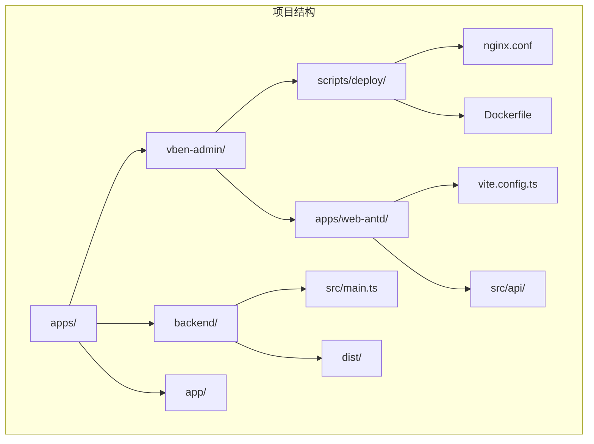

**图表来源**
- [nginx.conf:1-76](file://apps/vben-admin/scripts/deploy/nginx.conf#L1-L76)
- [Dockerfile:1-39](file://apps/vben-admin/scripts/deploy/Dockerfile#L1-L39)

**章节来源**
- [nginx.conf:1-76](file://apps/vben-admin/scripts/deploy/nginx.conf#L1-L76)
- [Dockerfile:1-39](file://apps/vben-admin/scripts/deploy/Dockerfile#L1-L39)

## 核心组件

### Nginx配置结构

Nginx配置采用标准的三层结构设计：

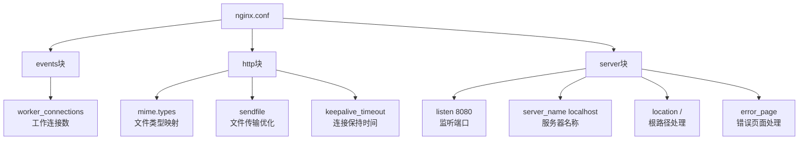

**图表来源**
- [nginx.conf:12-75](file://apps/vben-admin/scripts/deploy/nginx.conf#L12-L75)

### 静态资源服务配置

前端构建产物通过Nginx进行静态文件托管，支持SPA路由：

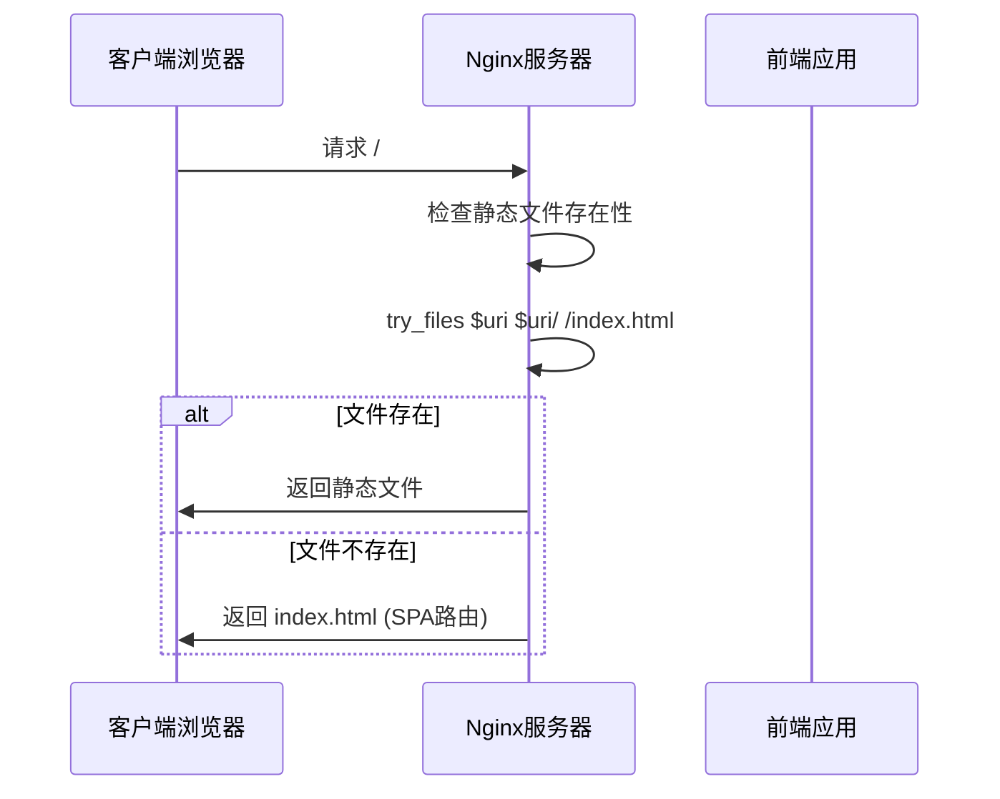

**图表来源**
- [nginx.conf:53-56](file://apps/vben-admin/scripts/deploy/nginx.conf#L53-L56)

**章节来源**
- [nginx.conf:49-74](file://apps/vben-admin/scripts/deploy/nginx.conf#L49-L74)

## 架构概览

系统采用反向代理架构，所有请求首先经过Nginx，然后根据路径规则转发到相应服务：

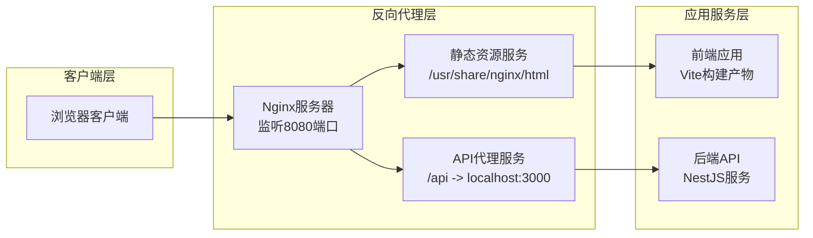

**图表来源**
- [nginx.conf:49-74](file://apps/vben-admin/scripts/deploy/nginx.conf#L49-L74)
- [main.ts:42-46](file://apps/backend/src/main.ts#L42-L46)

## 详细组件分析

### Server块配置分析

Server块是Nginx配置的核心部分，定义了虚拟主机的行为：

| 配置项 | 值 | 说明 |
|--------|-----|------|
| listen | 8080 | 监听端口，前端开发环境常用 |
| server_name | localhost | 服务器名称，支持多个域名 |
| root | /usr/share/nginx/html | 静态文件根目录 |
| index | index.html | 默认索引文件 |

**章节来源**
- [nginx.conf:49-56](file://apps/vben-admin/scripts/deploy/nginx.conf#L49-L56)

### Location规则详解

Location规则定义了不同路径的处理逻辑：

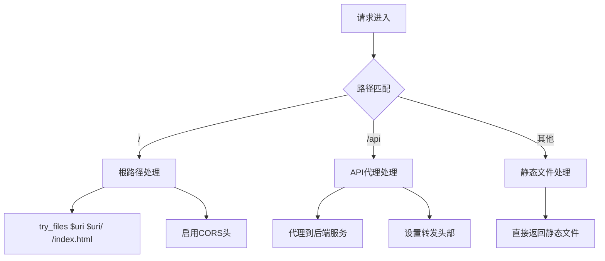

**图表来源**
- [nginx.conf:53-67](file://apps/vben-admin/scripts/deploy/nginx.conf#L53-L67)

### CORS配置实现

系统实现了完整的跨域资源共享(CORS)支持：

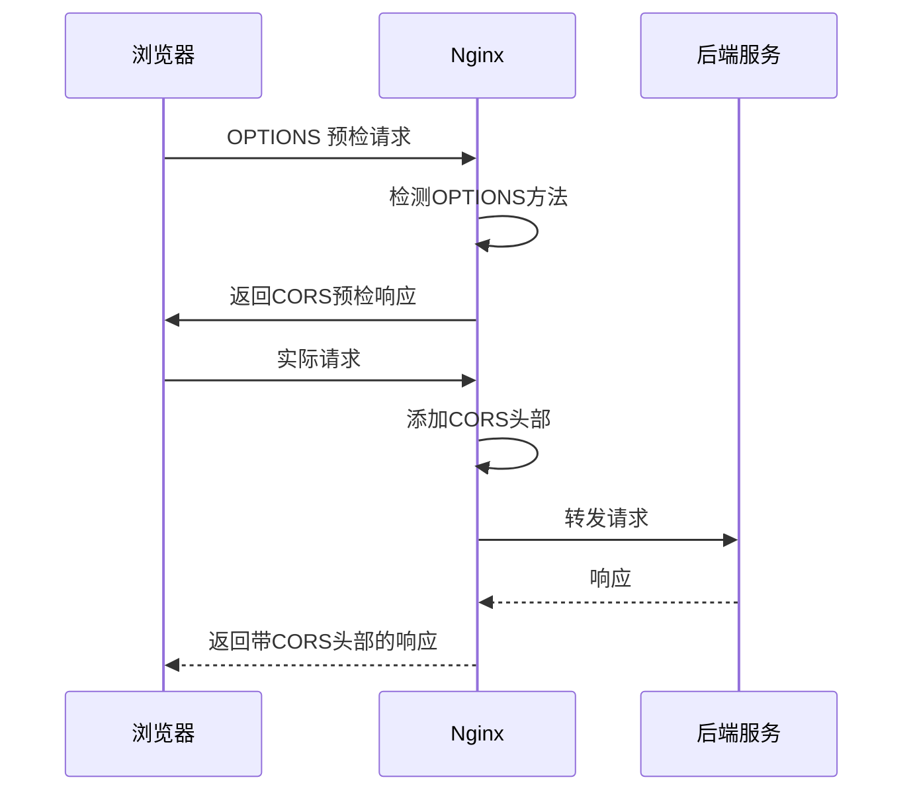

**图表来源**
- [nginx.conf:57-66](file://apps/vben-admin/scripts/deploy/nginx.conf#L57-L66)

**章节来源**
- [nginx.conf:57-66](file://apps/vben-admin/scripts/deploy/nginx.conf#L57-L66)

### API代理转发规则

API代理配置实现了前端到后端的请求转发：

| 配置项 | 值 | 说明 |
|--------|-----|------|
| proxy_pass | http://localhost:3000 | 后端服务地址 |
| proxy_set_header Host | $host | 传递原始主机名 |
| proxy_set_header X-Real-IP | $remote_addr | 传递真实IP |
| proxy_set_header X-Forwarded-For | $proxy_add_x_forwarded_for | 传递转发链路 |

**章节来源**
- [vite.config.ts:8-19](file://apps/vben-admin/apps/web-antd/vite.config.ts#L8-L19)
- [auth.ts:68-90](file://apps/vben-admin/apps/web-antd/src/api/core/auth.ts#L68-L90)

### 静态资源托管配置

前端构建产物的静态文件托管配置：

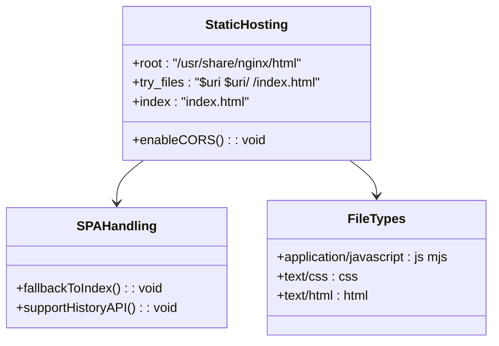

**图表来源**
- [nginx.conf:53-25](file://apps/vben-admin/scripts/deploy/nginx.conf#L53-L25)

**章节来源**
- [nginx.conf:53-25](file://apps/vben-admin/scripts/deploy/nginx.conf#L53-L25)

## 依赖关系分析

### 组件间依赖关系

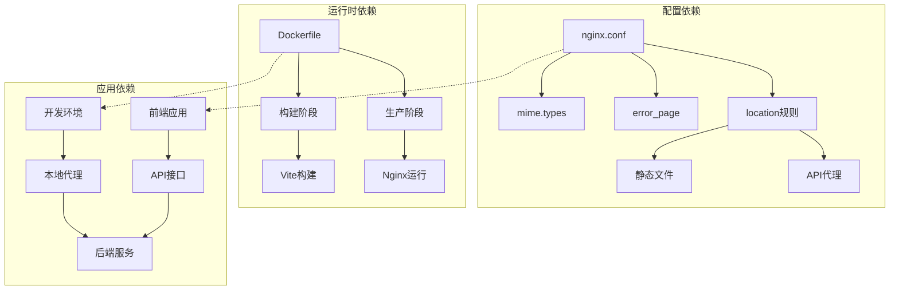

**图表来源**
- [Dockerfile:23-38](file://apps/vben-admin/scripts/deploy/Dockerfile#L23-L38)
- [vite.config.ts:7-20](file://apps/vben-admin/apps/web-antd/vite.config.ts#L7-L20)

### 环境变量配置

前端应用的环境变量影响Nginx配置：

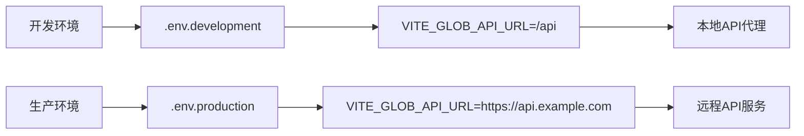

**图表来源**
- [.env.development:6-7](file://apps/vben-admin/apps/web-antd/.env.development#L6-L7)
- [.env.production:4-5](file://apps/vben-admin/apps/web-antd/.env.production#L4-L5)

**章节来源**
- [.env.development:1-17](file://apps/vben-admin/apps/web-antd/.env.development#L1-L17)
- [.env.production:1-20](file://apps/vben-admin/apps/web-antd/.env.production#L1-L20)

## 性能考虑

### 连接池配置

Nginx连接池配置对性能有重要影响：

| 配置项 | 建议值 | 影响 |
|--------|--------|------|
| worker_processes | 1 | 根据CPU核心数调整 |
| worker_connections | 1024 | 单个工作进程最大连接数 |
| keepalive_timeout | 65 | 连接保持时间 |

### 缓冲区优化

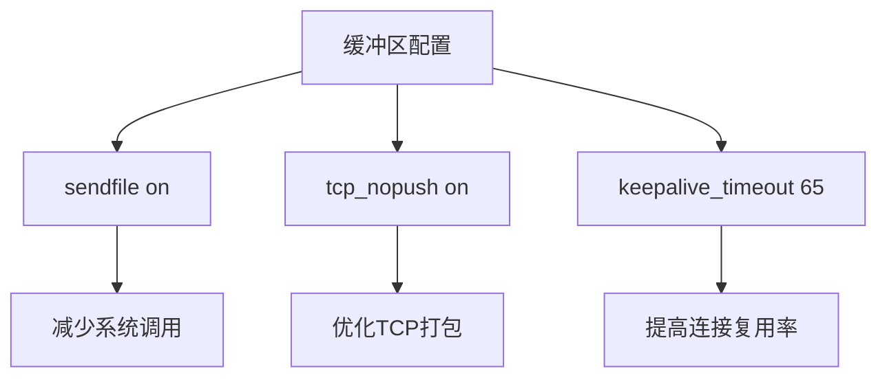

### 压缩配置

虽然当前配置注释掉了gzip，但提供了完整的配置模板：

| 压缩选项 | 作用 | 性能影响 |
|----------|------|----------|
| gzip on | 启用压缩 | CPU开销增加 |
| gzip_types | 压缩类型 | 影响压缩效果 |
| gzip_comp_level | 压缩级别 | 1最快，9最省空间 |
| gzip_vary | 响应头 | 支持Vary头 |

**章节来源**
- [nginx.conf:33-47](file://apps/vben-admin/scripts/deploy/nginx.conf#L33-L47)

## 故障排除指南

### 常见问题及解决方案

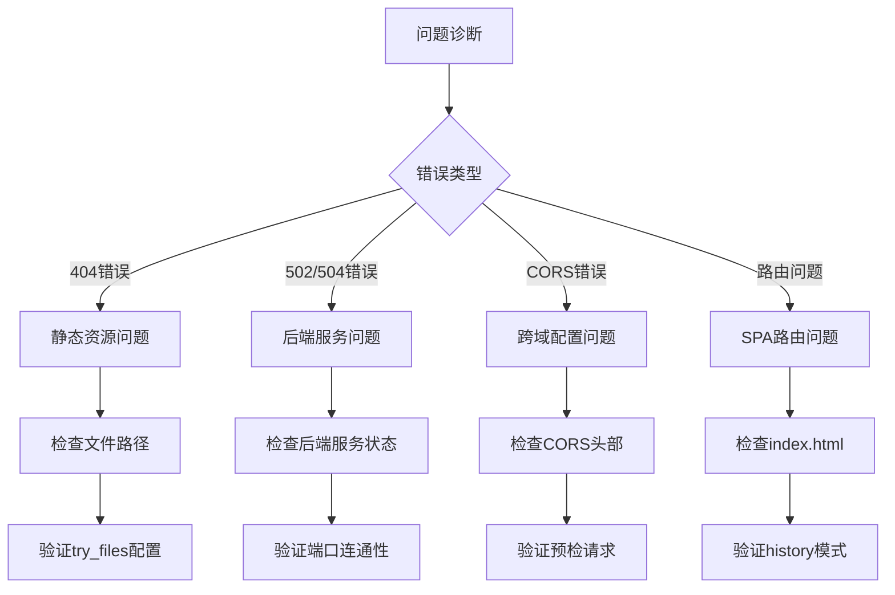

### 端口冲突排查

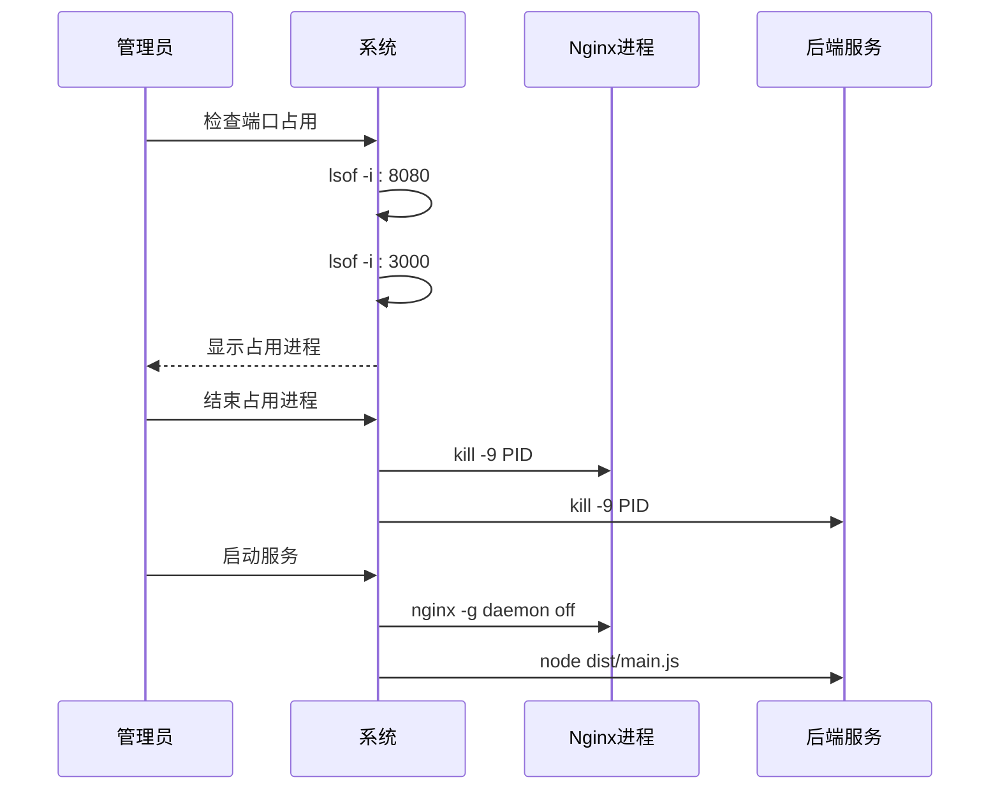

### 静态资源404解决

确保Nginx配置包含正确的try_files指令：

```nginx
location / {
    root /usr/share/nginx/html;
    try_files $uri $uri/ /index.html;
    index index.html;
}
```

**章节来源**
- [deployment.md:256-261](file://docs/deployment.md#L256-L261)

### CORS问题诊断

检查CORS配置的完整性：

```nginx
# 允许所有来源（开发环境）
add_header 'Access-Control-Allow-Origin' '*';

# 允许的方法
add_header 'Access-Control-Allow-Methods' 'GET, POST, OPTIONS';

# 允许的头部
add_header 'Access-Control-Allow-Headers' 'DNT,X-CustomHeader,Keep-Alive,User-Agent,X-Requested-With,If-Modified-Since,Cache-Control,Content-Type';

# 预检请求缓存
if ($request_method = 'OPTIONS') {
    add_header 'Access-Control-Max-Age' 1728000;
    add_header 'Content-Type' 'text/plain charset=UTF-8';
    add_header 'Content-Length' 0;
    return 204;
}
```

**章节来源**
- [nginx.conf:57-66](file://apps/vben-admin/scripts/deploy/nginx.conf#L57-L66)

## 结论

本Nginx反向代理配置文档详细介绍了Nest-Admin-Pro项目的部署架构和配置要点。系统采用简洁高效的配置方案，通过单一Nginx实例同时处理静态资源服务和API代理转发，配合Docker容器化部署，实现了开发和生产的统一配置管理。

关键优势包括：
- **简化架构**：单一Nginx实例处理多种服务类型
- **开发友好**：支持热重载和本地代理
- **生产就绪**：容器化部署，易于扩展
- **性能优化**：合理的连接池和缓冲区配置

建议在生产环境中进一步完善SSL/TLS配置、健康检查和监控集成，以提升系统的安全性和可观测性。