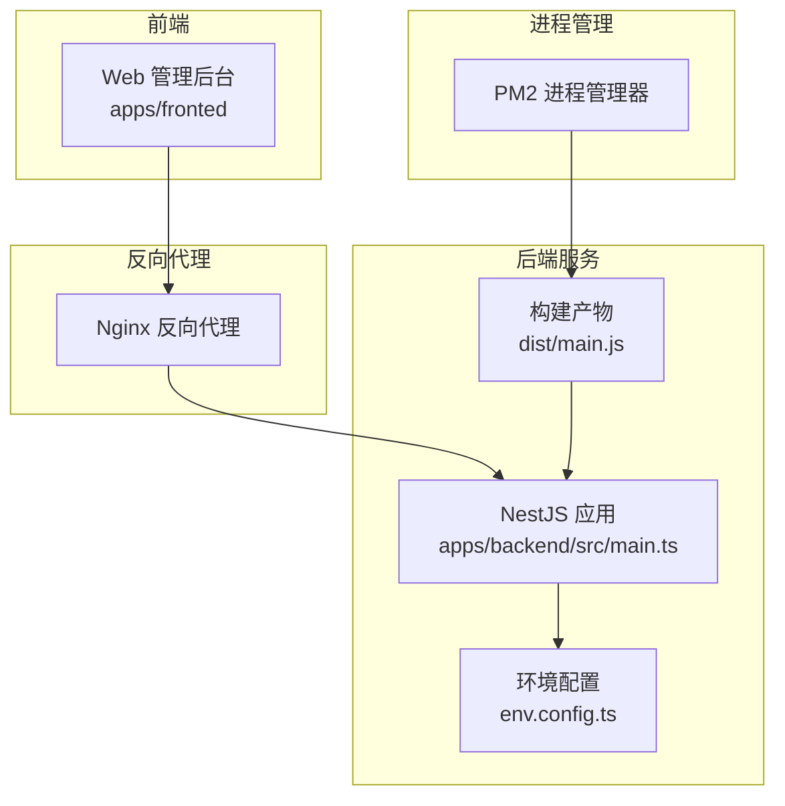
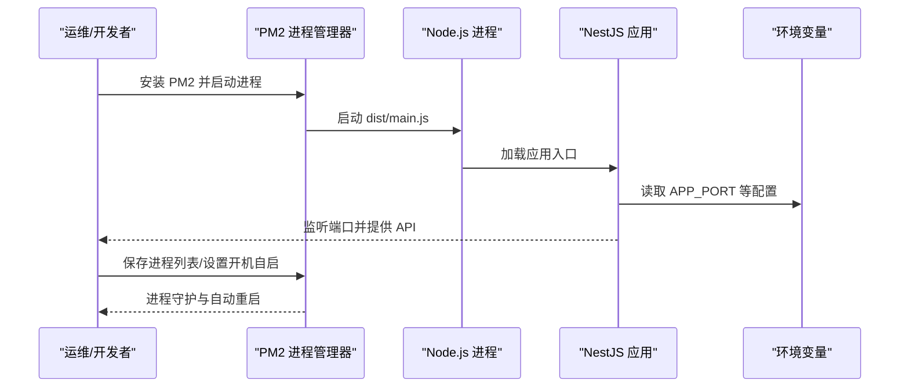
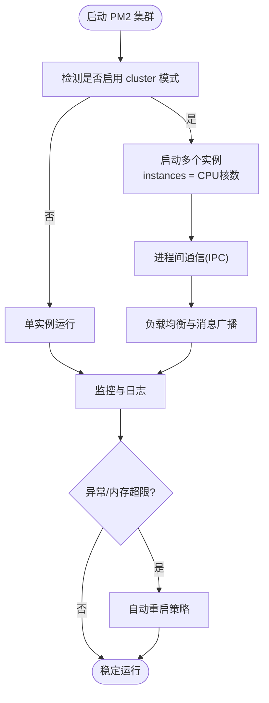
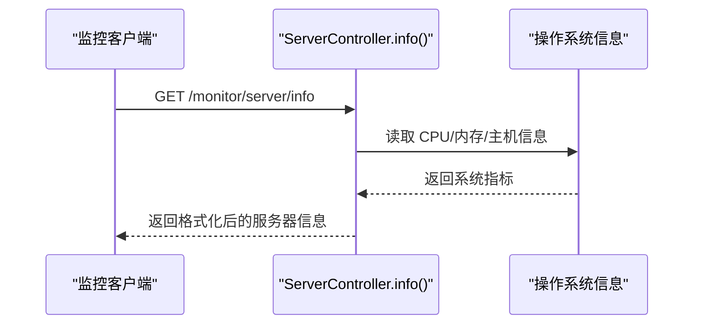
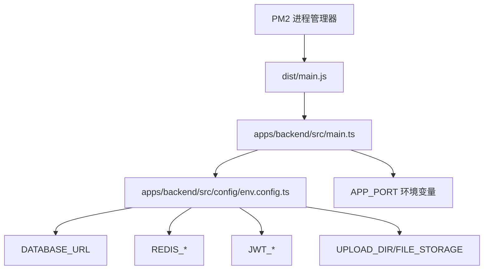

# PM2进程管理

<cite>
**本文引用的文件**
- [deployment.md](file://docs/deployment.md)
- [README.md](file://README.md)
- [main.ts](file://apps/backend/src/main.ts)
- [env.config.ts](file://apps/backend/src/config/env.config.ts)
- [package.json](file://apps/backend/package.json)
- [server.controller.ts](file://apps/backend/src/modules/monitor/server/server.controller.ts)
- [clustering.js](file://apps/backend/node_modules/log4js/lib/clustering.js)
- [log4js.d.ts](file://apps/backend/node_modules/log4js/types/log4js.d.ts)
</cite>

## 目录
1. [简介](#简介)
2. [项目结构](#项目结构)
3. [核心组件](#核心组件)
4. [架构总览](#架构总览)
5. [详细组件分析](#详细组件分析)
6. [依赖关系分析](#依赖关系分析)
7. [性能考虑](#性能考虑)
8. [故障排查指南](#故障排查指南)
9. [结论](#结论)
10. [附录](#附录)

## 简介
本文件面向在生产环境中使用 PM2 管理 NestJS 后端服务的工程实践，结合仓库现有部署文档与代码实现，系统性地阐述 PM2 的安装与使用、ecosystem 配置结构、环境变量与日志管理、进程守护与自动重启策略、负载均衡与集群模式、日志轮转与远程采集、性能监控与指标收集，以及常见问题排查方法。内容严格基于仓库中的部署文档与后端实现，确保可操作性与准确性。

## 项目结构
后端服务采用 NestJS 框架，生产运行时通过 Node.js 直接启动构建产物；PM2 作为进程管理器负责守护与自动重启。前端通过 Nginx 反向代理访问后端 API。整体关系如下：

**图表来源**
- [deployment.md:83-97](file://docs/deployment.md#L83-L97)
- [main.ts:42-46](file://apps/backend/src/main.ts#L42-L46)
- [env.config.ts:3-22](file://apps/backend/src/config/env.config.ts#L3-L22)

**章节来源**
- [deployment.md:83-97](file://docs/deployment.md#L83-L97)
- [README.md:73-83](file://README.md#L73-L83)
- [main.ts:42-46](file://apps/backend/src/main.ts#L42-L46)

## 核心组件
- PM2 进程管理器：负责启动、守护、自动重启、开机自启、进程列表持久化等。
- NestJS 应用：监听端口并提供 API 服务，读取环境变量进行配置。
- 环境变量配置：集中于配置模块，支持端口、JWT、文件存储、数据库、Redis 等。
- 日志与监控：内置服务器信息接口，便于监控内存、CPU 使用率与运行时长。

**章节来源**
- [deployment.md:83-97](file://docs/deployment.md#L83-L97)
- [env.config.ts:3-47](file://apps/backend/src/config/env.config.ts#L3-L47)
- [server.controller.ts:14-41](file://apps/backend/src/modules/monitor/server/server.controller.ts#L14-L41)

## 架构总览
PM2 在生产环境中的典型工作流如下：

**图表来源**
- [deployment.md:83-97](file://docs/deployment.md#L83-L97)
- [main.ts:42-46](file://apps/backend/src/main.ts#L42-L46)
- [env.config.ts:3-22](file://apps/backend/src/config/env.config.ts#L3-L22)

## 详细组件分析

### PM2 安装与基本使用
- 全局安装 PM2：使用包管理器进行全局安装。
- 启动应用：通过 PM2 启动构建产物入口文件，并设置进程名称。
- 保存进程列表与开机自启：持久化当前进程列表，并配置系统启动时自动恢复。
- 生产环境命令参考路径：[deployment.md:83-97](file://docs/deployment.md#L83-L97)

**章节来源**
- [deployment.md:83-97](file://docs/deployment.md#L83-L97)

### ecosystem.config.js 配置结构
PM2 官方推荐使用 ecosystem.config.js 统一管理多应用与环境。结合本项目，建议配置要点如下：
- 应用配置
  - script：指向构建产物入口文件（例如 dist/main.js）。
  - name：进程名称（例如 nest-api）。
  - cwd：工作目录（指向后端应用根目录）。
  - execMode：可选 cluster 模式（见“负载均衡”章节）。
  - instances：集群实例数（见“负载均衡”章节）。
- 环境变量
  - env_production：生产环境变量，覆盖默认 env。
  - 重要变量：APP_PORT、DATABASE_URL、REDIS_*、JWT_*、UPLOAD_DIR、FILE_STORAGE 等。
- 日志管理
  - out_file、err_file：标准输出与错误输出日志路径。
  - log_date_format：日志时间戳格式。
  - merge_logs：合并输出与错误日志。
  - logrotate：启用日志轮转（系统自带 logrotate 或 PM2 logrotate 插件）。
- 监控与健康检查
  - max_memory_restart：内存阈值触发重启。
  - cron_restart：定时重启策略。
  - kill_timeout：优雅停止等待时间。
  - restart_delay：异常重启间隔。
- 进程守护与自动重启
  - min_uptime：最小运行时间，避免频繁误重启。
  - max_restarts：最大重启次数。
  - exp_backoff重启：指数退避策略（PM2 内置）。
- 进程间通信与集群
  - cluster 模式：启用多实例共享端口。
  - NODE_APP_INSTANCE：PM2 集群实例变量（log4js 识别）。
- 远程日志与监控
  - 结合系统日志轮转工具（如 logrotate）或云平台日志服务。
  - 使用 PM2 生态插件（如 pm2-logrotate）进行日志轮转与归档。

注：本节为配置结构说明，具体字段与示例请参考 PM2 官方文档与本仓库部署命令路径。

**章节来源**
- [deployment.md:83-97](file://docs/deployment.md#L83-L97)
- [env.config.ts:3-47](file://apps/backend/src/config/env.config.ts#L3-L47)
- [clustering.js:16-21](file://apps/backend/node_modules/log4js/lib/clustering.js#L16-L21)
- [clustering.js:49-74](file://apps/backend/node_modules/log4js/lib/clustering.js#L49-L74)
- [log4js.d.ts:408-409](file://apps/backend/node_modules/log4js/types/log4js.d.ts#L408-L409)

### 进程守护与自动重启策略
- 异常重启策略
  - 异常退出：PM2 默认自动重启。
  - 代码异常：结合 max_memory_restart、restart_delay、exp_backoff 等策略降低抖动。
- 内存监控与限制
  - 通过 max_memory_restart 设置内存阈值，超过阈值自动重启。
  - 结合应用内日志与外部监控系统（如 Prometheus/Grafana）持续观察。
- CPU 使用限制
  - PM2 不直接限制 CPU，可通过外部工具（如 cgroups、systemd）或应用内节流策略配合实现。
- 运行时保护
  - min_uptime 与 max_restarts 防止“启动-崩溃-重启”循环。
  - kill_timeout 保证优雅退出，避免请求中断。

**章节来源**
- [deployment.md:83-97](file://docs/deployment.md#L83-L97)

### 负载均衡与集群模式
- 多实例运行
  - 使用 cluster 模式与 instances 指定实例数量，通常为 CPU 核数。
  - 实例间通过共享端口与 IPC 通信，PM2 自动处理进程间负载分发。
- 进程间通信
  - PM2 提供广播与事件机制，适合日志聚合与状态同步。
  - log4js 通过 pm2 与 pm2InstanceVar 识别 PM2 集群主进程，避免重复监听。
- 环境变量与实例隔离
  - 使用 NODE_APP_INSTANCE 区分不同实例的日志与行为。
  - 通过 ecosystem 的 env_production 为不同实例设置差异化配置。

**图表来源**
- [clustering.js:16-21](file://apps/backend/node_modules/log4js/lib/clustering.js#L16-L21)
- [clustering.js:49-74](file://apps/backend/node_modules/log4js/lib/clustering.js#L49-L74)
- [log4js.d.ts:408-409](file://apps/backend/node_modules/log4js/types/log4js.d.ts#L408-L409)

**章节来源**
- [clustering.js:16-21](file://apps/backend/node_modules/log4js/lib/clustering.js#L16-L21)
- [clustering.js:49-74](file://apps/backend/node_modules/log4js/lib/clustering.js#L49-L74)
- [log4js.d.ts:408-409](file://apps/backend/node_modules/log4js/types/log4js.d.ts#L408-L409)

### 日志管理与轮转
- 输出位置与格式
  - 使用 out_file、err_file 指定输出文件；结合 log_date_format 设置时间戳。
  - merge_logs 合并输出，便于统一检索。
- 日志轮转
  - PM2 内置 logrotate 插件或系统级 logrotate 工具均可实现按天/按大小轮转。
  - 建议保留最近 30 天日志，压缩历史日志。
- 远程日志收集
  - 将 out_file/err_file 重定向到集中式日志系统（如 ELK、Fluentd、Loki）。
  - 结合 PM2 生态插件实现日志采集与归档。
- PM2 集群日志
  - log4js 通过 pm2 与 pm2InstanceVar 识别 PM2 集群主进程，避免重复监听与日志冲突。

**章节来源**
- [clustering.js:16-21](file://apps/backend/node_modules/log4js/lib/clustering.js#L16-L21)
- [clustering.js:49-74](file://apps/backend/node_modules/log4js/lib/clustering.js#L49-L74)
- [log4js.d.ts:408-409](file://apps/backend/node_modules/log4js/types/log4js.d.ts#L408-L409)

### 性能监控与指标收集
- 内存使用
  - 通过 max_memory_restart 限制内存峰值；结合应用内服务器信息接口获取实时内存与 CPU 使用率。
- 响应时间与吞吐
  - 建议接入 APM（如 Prometheus + Grafana）或 Node.js 原生性能分析工具。
- 错误统计
  - 结合日志轮转与远程日志系统，建立错误告警规则（如错误率、异常堆栈频率）。
- 服务器信息接口
  - 项目提供服务器信息接口，返回 CPU 数量、CPU 使用率、内存总量/已用/空闲、运行时长等关键指标，便于前端监控面板展示。

**图表来源**
- [server.controller.ts:14-41](file://apps/backend/src/modules/monitor/server/server.controller.ts#L14-L41)

**章节来源**
- [server.controller.ts:14-41](file://apps/backend/src/modules/monitor/server/server.controller.ts#L14-L41)

## 依赖关系分析
PM2 与后端应用的依赖关系如下：

**图表来源**
- [deployment.md:83-97](file://docs/deployment.md#L83-L97)
- [main.ts:42-46](file://apps/backend/src/main.ts#L42-L46)
- [env.config.ts:3-47](file://apps/backend/src/config/env.config.ts#L3-L47)

**章节来源**
- [deployment.md:83-97](file://docs/deployment.md#L83-L97)
- [main.ts:42-46](file://apps/backend/src/main.ts#L42-L46)
- [env.config.ts:3-47](file://apps/backend/src/config/env.config.ts#L3-L47)

## 性能考虑
- 实例数量：通常设置为 CPU 核数，避免过度并发导致上下文切换开销增大。
- 内存阈值：合理设置 max_memory_restart，防止内存泄漏导致进程崩溃。
- 日志写入：避免高频小日志，减少磁盘 IO；必要时开启异步日志或缓冲。
- 端口与反向代理：通过 Nginx 聚合请求，减少直连压力。
- 监控与告警：建立内存、CPU、错误率、响应时间的多维监控体系。

## 故障排查指南
- 端口被占用
  - 使用系统工具查找占用进程并释放端口，再重启 PM2 进程。
  - 参考路径：[deployment.md:228-239](file://docs/deployment.md#L228-L239)
- 数据库连接失败
  - 检查数据库服务状态、连接字符串与凭据；确认网络可达。
  - 参考路径：[deployment.md:241-246](file://docs/deployment.md#L241-L246)
- Redis 连接失败
  - 若不使用 Redis，可在环境变量中禁用相关功能；否则检查服务与凭据。
  - 参考路径：[deployment.md:247-250](file://docs/deployment.md#L247-L250)
- 跨域问题
  - 后端已启用 CORS，若仍出现跨域，检查前端代理与后端允许来源配置。
  - 参考路径：[deployment.md:252-255](file://docs/deployment.md#L252-L255)
- 静态资源 404
  - 确认 Nginx 配置中 try_files 设置正确，指向正确的静态文件目录。
  - 参考路径：[deployment.md:256-261](file://docs/deployment.md#L256-L261)
- PM2 进程异常退出
  - 查看 out_file/err_file 日志定位错误；检查 max_memory_restart 是否过低导致频繁重启。
  - 参考路径：[deployment.md:83-97](file://docs/deployment.md#L83-L97)

**章节来源**
- [deployment.md:228-239](file://docs/deployment.md#L228-L239)
- [deployment.md:241-246](file://docs/deployment.md#L241-L246)
- [deployment.md:247-250](file://docs/deployment.md#L247-L250)
- [deployment.md:252-255](file://docs/deployment.md#L252-L255)
- [deployment.md:256-261](file://docs/deployment.md#L256-L261)
- [deployment.md:83-97](file://docs/deployment.md#L83-L97)

## 结论
通过 PM2 管理 NestJS 后端服务，可显著提升生产环境的稳定性与可观测性。结合本仓库的部署流程与后端配置，建议优先完成 PM2 安装、进程守护、日志轮转与集群配置，并配套完善监控与告警体系，以实现高可用与可维护的线上运行环境。

## 附录
- 生产环境启动命令参考路径：[deployment.md:83-97](file://docs/deployment.md#L83-L97)
- 环境变量配置参考路径：[env.config.ts:3-47](file://apps/backend/src/config/env.config.ts#L3-L47)
- 应用入口与端口监听参考路径：[main.ts:42-46](file://apps/backend/src/main.ts#L42-L46)
- 服务器信息接口参考路径：[server.controller.ts:14-41](file://apps/backend/src/modules/monitor/server/server.controller.ts#L14-L41)