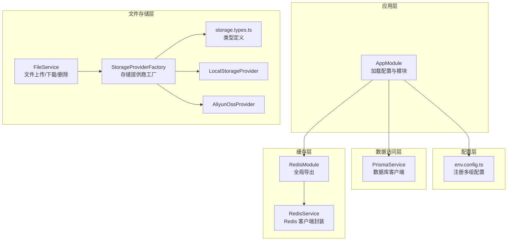
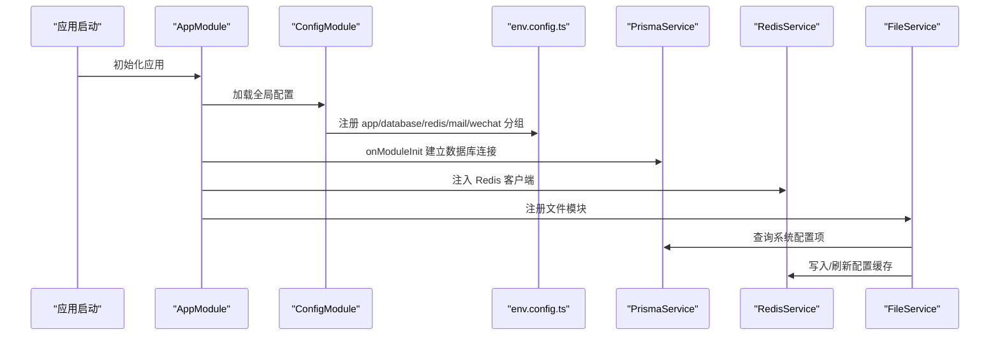
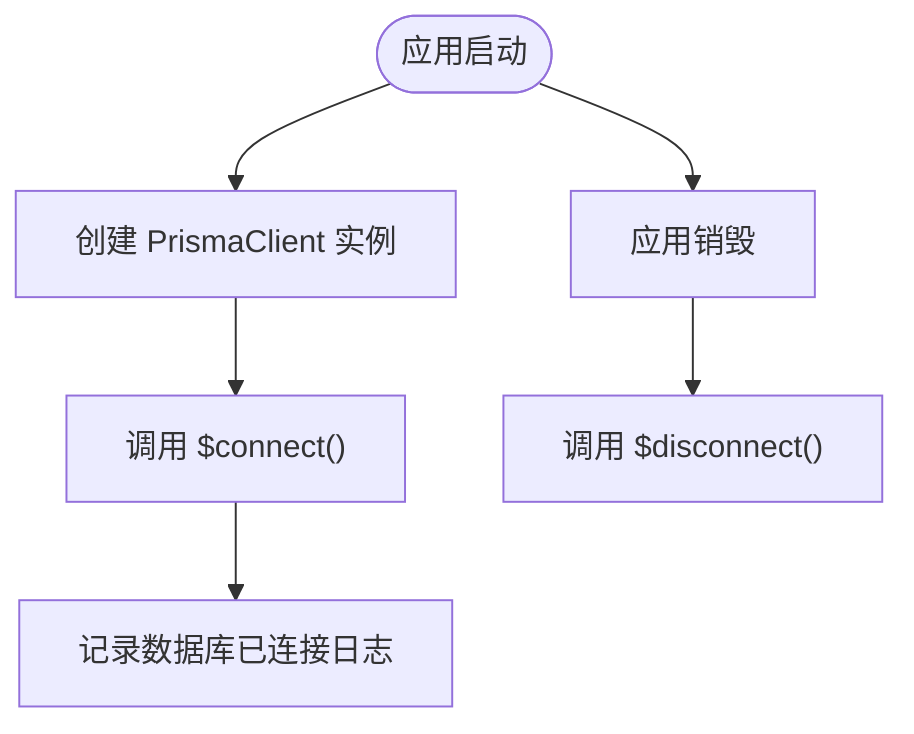
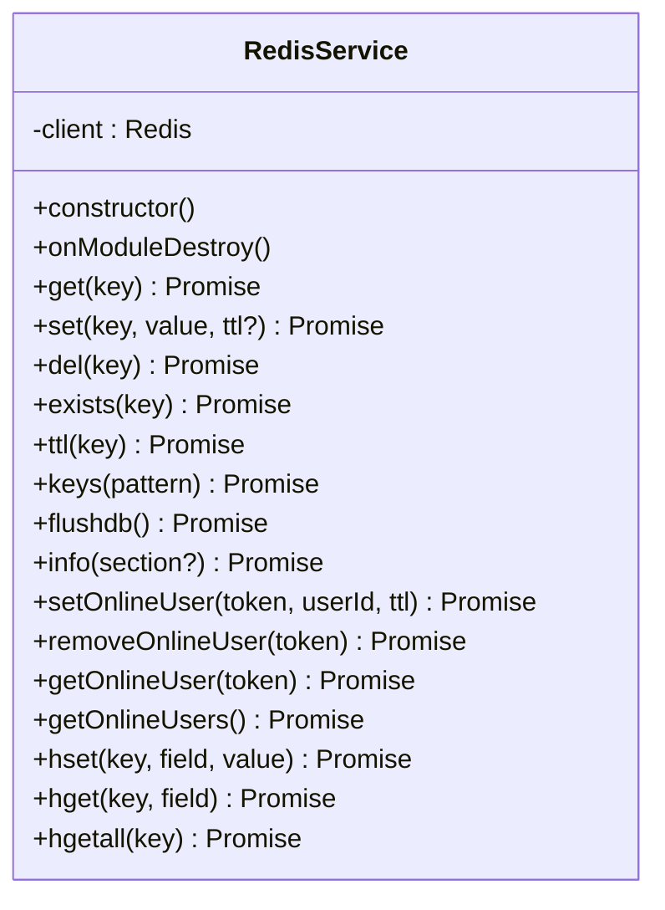
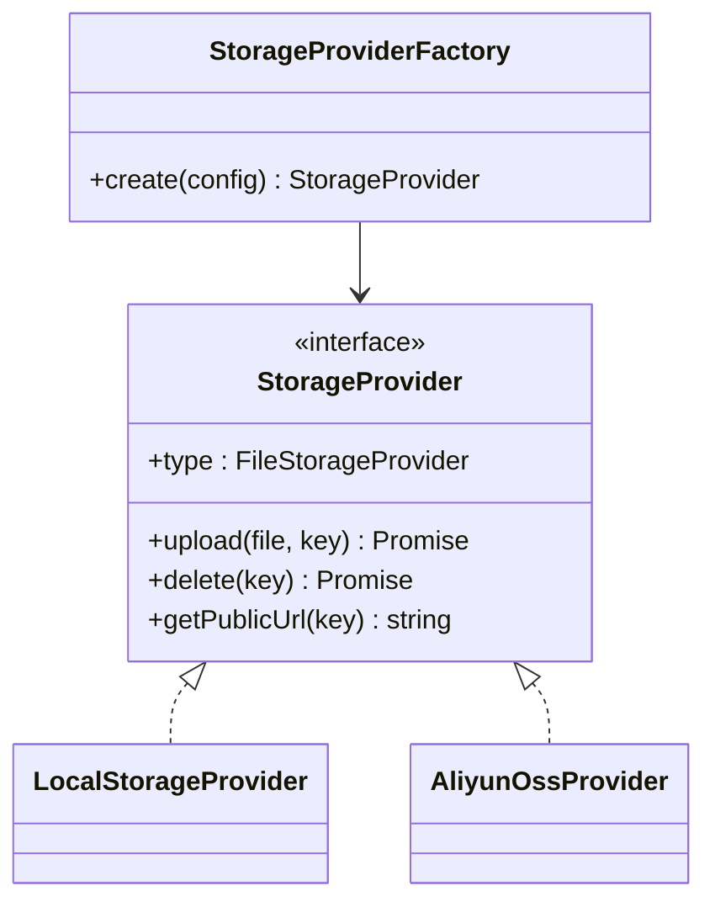
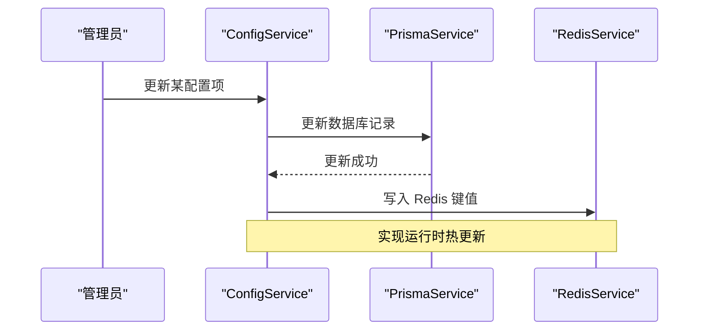
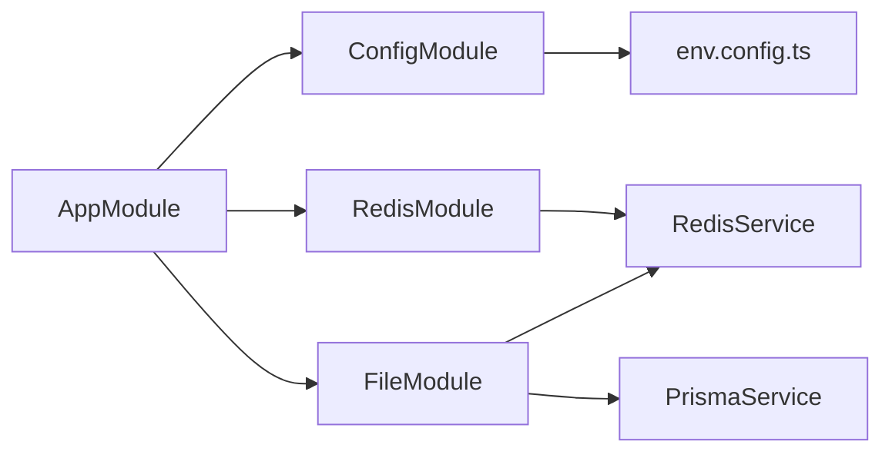
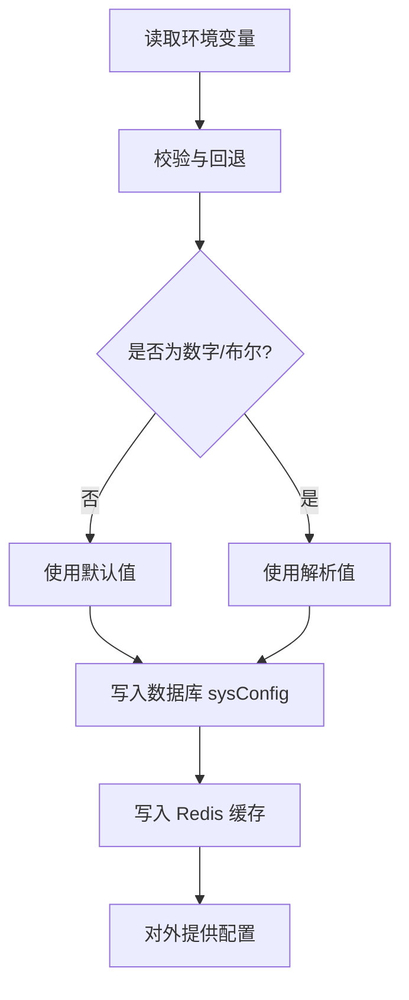

# 环境配置管理

<cite>
**本文档引用的文件**
- [apps/backend/src/config/env.config.ts](file://apps/backend/src/config/env.config.ts)
- [apps/backend/src/cache/redis.module.ts](file://apps/backend/src/cache/redis.module.ts)
- [apps/backend/src/cache/redis.service.ts](file://apps/backend/src/cache/redis.service.ts)
- [apps/backend/src/common/prisma.service.ts](file://apps/backend/src/common/prisma.service.ts)
- [apps/backend/src/modules/system/config/config.service.ts](file://apps/backend/src/modules/system/config/config.service.ts)
- [apps/backend/src/modules/file/file.service.ts](file://apps/backend/src/modules/file/file.service.ts)
- [apps/backend/src/modules/file/storage/storage-provider.factory.ts](file://apps/backend/src/modules/file/storage/storage-provider.factory.ts)
- [apps/backend/src/modules/file/storage/storage.types.ts](file://apps/backend/src/modules/file/storage/storage.types.ts)
- [apps/backend/src/modules/file/storage/local.provider.ts](file://apps/backend/src/modules/file/storage/local.provider.ts)
- [apps/backend/src/modules/file/storage/aliyun-oss.provider.ts](file://apps/backend/src/modules/file/storage/aliyun-oss.provider.ts)
- [apps/backend/src/app.module.ts](file://apps/backend/src/app.module.ts)
- [apps/backend/src/main.ts](file://apps/backend/src/main.ts)
</cite>

## 目录
1. [简介](#简介)
2. [项目结构](#项目结构)
3. [核心组件](#核心组件)
4. [架构总览](#架构总览)
5. [详细组件分析](#详细组件分析)
6. [依赖关系分析](#依赖关系分析)
7. [性能考虑](#性能考虑)
8. [故障排查指南](#故障排查指南)
9. [结论](#结论)
10. [附录](#附录)

## 简介
本文件系统性梳理后端服务的环境配置管理，覆盖开发、测试与生产三类环境的差异化配置要点；阐述环境变量的组织方式（含敏感信息处理）、数据库连接与连接池、缓存（Redis）配置、第三方服务（文件存储、邮件等）集成方式；并给出配置验证与热更新机制的设计思路与最佳实践。

## 项目结构
后端采用 NestJS 架构，配置模块化管理：
- 应用级配置通过 ConfigModule 加载，集中注册应用、数据库、Redis、邮件、微信等配置分组
- 缓存模块以全局单例形式注入 Redis 客户端
- 文件模块支持本地与多家云存储（阿里云 OSS、腾讯 COS、七牛 Kodo、华为 OBS），通过工厂模式按配置选择
- 数据库使用 Prisma，连接在应用启动阶段建立

图表来源
- [apps/backend/src/app.module.ts:18-58](file://apps/backend/src/app.module.ts#L18-L58)
- [apps/backend/src/config/env.config.ts:3-47](file://apps/backend/src/config/env.config.ts#L3-L47)
- [apps/backend/src/common/prisma.service.ts:5-22](file://apps/backend/src/common/prisma.service.ts#L5-L22)
- [apps/backend/src/cache/redis.module.ts:4-9](file://apps/backend/src/cache/redis.module.ts#L4-L9)
- [apps/backend/src/cache/redis.service.ts:8-27](file://apps/backend/src/cache/redis.service.ts#L8-L27)
- [apps/backend/src/modules/file/file.service.ts:41-310](file://apps/backend/src/modules/file/file.service.ts#L41-L310)
- [apps/backend/src/modules/file/storage/storage-provider.factory.ts:8-25](file://apps/backend/src/modules/file/storage/storage-provider.factory.ts#L8-L25)
- [apps/backend/src/modules/file/storage/storage.types.ts:10-43](file://apps/backend/src/modules/file/storage/storage.types.ts#L10-L43)
- [apps/backend/src/modules/file/storage/local.provider.ts:6-46](file://apps/backend/src/modules/file/storage/local.provider.ts#L6-L46)
- [apps/backend/src/modules/file/storage/aliyun-oss.provider.ts:6-51](file://apps/backend/src/modules/file/storage/aliyun-oss.provider.ts#L6-L51)

章节来源
- [apps/backend/src/app.module.ts:18-58](file://apps/backend/src/app.module.ts#L18-L58)
- [apps/backend/src/config/env.config.ts:3-47](file://apps/backend/src/config/env.config.ts#L3-L47)

## 核心组件
- 配置注册中心：通过 ConfigModule 加载 env.config.ts 中注册的应用、数据库、Redis、邮件、微信等配置分组
- 数据库连接：PrismaService 在初始化时建立连接，并记录日志
- 缓存连接：RedisService 在构造函数中创建 Redis 客户端实例，监听连接事件与错误
- 文件存储：FileService 统一解析与持久化文件存储配置，通过 StorageProviderFactory 选择具体实现
- 系统配置：ConfigService 支持从数据库读取配置并写入 Redis，实现运行时配置热更新

章节来源
- [apps/backend/src/config/env.config.ts:3-47](file://apps/backend/src/config/env.config.ts#L3-L47)
- [apps/backend/src/common/prisma.service.ts:5-22](file://apps/backend/src/common/prisma.service.ts#L5-L22)
- [apps/backend/src/cache/redis.service.ts:8-27](file://apps/backend/src/cache/redis.service.ts#L8-L27)
- [apps/backend/src/modules/file/file.service.ts:41-310](file://apps/backend/src/modules/file/file.service.ts#L41-L310)
- [apps/backend/src/modules/system/config/config.service.ts:6-56](file://apps/backend/src/modules/system/config/config.service.ts#L6-L56)

## 架构总览
下图展示配置在系统中的装配与使用路径，以及关键交互点：

图表来源
- [apps/backend/src/app.module.ts:20-38](file://apps/backend/src/app.module.ts#L20-L38)
- [apps/backend/src/config/env.config.ts:3-47](file://apps/backend/src/config/env.config.ts#L3-L47)
- [apps/backend/src/common/prisma.service.ts:14-21](file://apps/backend/src/common/prisma.service.ts#L14-L21)
- [apps/backend/src/cache/redis.service.ts:8-27](file://apps/backend/src/cache/redis.service.ts#L8-L27)
- [apps/backend/src/modules/file/file.service.ts:211-257](file://apps/backend/src/modules/file/file.service.ts#L211-L257)

## 详细组件分析

### 配置注册与环境变量映射
- 应用配置：端口、环境名、JWT 密钥与过期时间、上传目录、最大文件/图片尺寸、文件存储类型与云存储参数（兼容多厂商）
- 数据库配置：统一通过 DATABASE_URL 提供连接串
- Redis 配置：主机、端口、密码、数据库索引
- 邮件配置：SMTP 主机、端口、用户名、密码、发件人
- 微信配置：应用 ID 与密钥

建议的环境变量清单（按用途分类）：
- 应用运行：APP_PORT、APP_ENV、JWT_SECRET、JWT_EXPIRES_IN、UPLOAD_DIR、MAX_IMAGE_SIZE、MAX_FILE_SIZE、FILE_STORAGE
- 云存储：FILE_CLOUD_REGION/FILE_CLOUD_BUCKET/FILE_CLOUD_ENDPOINT/FILE_CLOUD_PREFIX/FILE_CLOUD_PUBLIC_URL、OSS_* 兼容前缀
- 数据库：DATABASE_URL
- 缓存：REDIS_HOST、REDIS_PORT、REDIS_PASSWORD、REDIS_DB
- 邮件：MAIL_HOST、MAIL_PORT、MAIL_USER、MAIL_PASS、MAIL_FROM
- 微信：WECHAT_APPID、WECHAT_SECRET

章节来源
- [apps/backend/src/config/env.config.ts:3-47](file://apps/backend/src/config/env.config.ts#L3-L47)

### 数据库连接配置
- 连接串：通过 DATABASE_URL 注入，由 PrismaClient 在初始化时使用
- 日志级别：默认记录 error 与 warn 级别日志
- 生命周期：应用启动时连接，关闭时断开

图表来源
- [apps/backend/src/common/prisma.service.ts:8-21](file://apps/backend/src/common/prisma.service.ts#L8-L21)

章节来源
- [apps/backend/src/common/prisma.service.ts:5-22](file://apps/backend/src/common/prisma.service.ts#L5-L22)

### 缓存配置（Redis）
- 连接参数：host、port、password、db
- 客户端行为：构造时建立连接，监听 connect/error 事件
- 常用操作：键值存取、哈希读写、在线用户集合维护、TTL 查询、flushdb 清库、info 解析
- 在线用户场景：基于 setex 与集合操作维护在线会话

图表来源
- [apps/backend/src/cache/redis.service.ts:5-128](file://apps/backend/src/cache/redis.service.ts#L5-L128)

章节来源
- [apps/backend/src/cache/redis.module.ts:4-9](file://apps/backend/src/cache/redis.module.ts#L4-L9)
- [apps/backend/src/cache/redis.service.ts:8-27](file://apps/backend/src/cache/redis.service.ts#L8-L27)

### 第三方服务配置（文件存储）
- 存储提供商：本地、阿里云 OSS、腾讯 COS、七牛 Kodo、华为 OBS
- 工厂模式：根据配置选择具体 Provider
- 配置来源：优先从数据库 sysConfig 读取，回退到环境变量
- 关键字段：存储类型、上传目录、最大文件/图片大小、区域、桶、凭证、Endpoint、前缀、公开域名、HTTPS

图表来源
- [apps/backend/src/modules/file/storage/storage-provider.factory.ts:8-25](file://apps/backend/src/modules/file/storage/storage-provider.factory.ts#L8-L25)
- [apps/backend/src/modules/file/storage/storage.types.ts:33-43](file://apps/backend/src/modules/file/storage/storage.types.ts#L33-L43)
- [apps/backend/src/modules/file/storage/local.provider.ts:6-46](file://apps/backend/src/modules/file/storage/local.provider.ts#L6-L46)
- [apps/backend/src/modules/file/storage/aliyun-oss.provider.ts:6-51](file://apps/backend/src/modules/file/storage/aliyun-oss.provider.ts#L6-L51)

章节来源
- [apps/backend/src/modules/file/file.service.ts:41-310](file://apps/backend/src/modules/file/file.service.ts#L41-L310)
- [apps/backend/src/modules/file/storage/storage.types.ts:10-43](file://apps/backend/src/modules/file/storage/storage.types.ts#L10-L43)

### 配置验证与热更新机制
- 配置验证：FileService 在解析配置时对数值与布尔值进行校验与回退
- 热更新：ConfigService 将有效配置写入 Redis，作为运行时缓存；当数据库配置变更时，可触发刷新逻辑

图表来源
- [apps/backend/src/modules/system/config/config.service.ts:37-55](file://apps/backend/src/modules/system/config/config.service.ts#L37-L55)

章节来源
- [apps/backend/src/modules/system/config/config.service.ts:6-56](file://apps/backend/src/modules/system/config/config.service.ts#L6-L56)

## 依赖关系分析
- AppModule 负责装配 ConfigModule、RedisModule、各业务模块与全局拦截器/守卫
- ConfigModule 通过 env.config.ts 注册多组配置，供其他模块通过 ConfigService 获取
- FileService 依赖 PrismaService 与 RedisService，用于配置持久化与缓存
- RedisService 为全局单例，被多个模块共享

图表来源
- [apps/backend/src/app.module.ts:18-58](file://apps/backend/src/app.module.ts#L18-L58)
- [apps/backend/src/config/env.config.ts:3-47](file://apps/backend/src/config/env.config.ts#L3-L47)
- [apps/backend/src/cache/redis.module.ts:4-9](file://apps/backend/src/cache/redis.module.ts#L4-L9)
- [apps/backend/src/common/prisma.service.ts:5-22](file://apps/backend/src/common/prisma.service.ts#L5-L22)

章节来源
- [apps/backend/src/app.module.ts:18-58](file://apps/backend/src/app.module.ts#L18-L58)

## 性能考虑
- Redis 连接复用：RedisService 单例持有客户端，避免重复创建连接
- 文件上传限制：在服务端对最大文件/图片大小进行校验，防止异常流量
- 数据库连接：Prisma 默认日志级别为 error/warn，减少不必要的日志开销
- 静态资源：上传目录通过静态资源中间件暴露，注意生产环境的安全与带宽控制

## 故障排查指南
- Redis 连接失败：检查 REDIS_HOST/REDIS_PORT/REDIS_PASSWORD/REDIS_DB 是否正确；查看控制台输出的连接错误日志
- 数据库无法连接：确认 DATABASE_URL 格式与可达性；查看 PrismaService 的连接日志
- 文件上传失败：核对 MAX_IMAGE_SIZE/MAX_FILE_SIZE 与实际文件大小；检查存储提供商的凭证与 Endpoint
- 配置未生效：确认数据库 sysConfig 中对应键的状态与值；调用刷新接口将配置写入 Redis

章节来源
- [apps/backend/src/cache/redis.service.ts:16-22](file://apps/backend/src/cache/redis.service.ts#L16-L22)
- [apps/backend/src/common/prisma.service.ts:14-16](file://apps/backend/src/common/prisma.service.ts#L14-L16)
- [apps/backend/src/modules/file/file.service.ts:150-166](file://apps/backend/src/modules/file/file.service.ts#L150-L166)
- [apps/backend/src/modules/system/config/config.service.ts:49-55](file://apps/backend/src/modules/system/config/config.service.ts#L49-L55)

## 结论
本项目通过 ConfigModule 将各类配置集中管理，并结合数据库与 Redis 实现运行时配置的持久化与热更新。文件存储模块采用工厂模式适配多种提供商，具备良好的扩展性。建议在生产环境中强化敏感信息保护与访问控制，完善配置变更审计与回滚机制。

## 附录

### 不同环境的配置差异建议
- 开发环境
  - 端口：APP_PORT=3000
  - 上传目录：UPLOAD_DIR=./uploads
  - 最大文件/图片：适当放宽
  - Redis：本地开发实例
  - 数据库：本地或测试库连接串
- 测试环境
  - 端口：APP_PORT=3001
  - 上传目录：独立隔离目录
  - Redis：独立实例
  - 数据库：独立测试库
- 生产环境
  - 端口：APP_PORT=8000
  - 上传目录：只读挂载或云存储
  - Redis：集群/哨兵/密码认证
  - 数据库：高可用主从/只读副本
  - 邮件/云存储：使用官方 Endpoint 与证书校验

### .env 文件管理与敏感信息保护
- 使用 .env 文件承载非敏感配置，敏感信息通过平台密钥管理服务注入（如容器环境变量、KMS）
- 对外不提交 .env 文件，仅提交示例模板（.env.example）
- 在 CI/CD 中通过环境变量注入，避免硬编码

### 配置加密与传输安全
- Redis 与数据库连接建议启用 TLS
- 邮件与云存储凭证使用最小权限原则，定期轮换
- 通过网络隔离与防火墙限制访问范围

### 配置验证与热更新流程
- 启动时：ConfigModule 加载 env.config.ts，Prisma/Redis 建连
- 运行时：ConfigService 将有效配置写入 Redis；FileService 按需从数据库与环境变量解析并回退
- 变更检测：提供刷新接口，批量写入 Redis；前端或后台任务定时拉取最新配置

图表来源
- [apps/backend/src/modules/file/file.service.ts:259-267](file://apps/backend/src/modules/file/file.service.ts#L259-L267)
- [apps/backend/src/modules/system/config/config.service.ts:49-55](file://apps/backend/src/modules/system/config/config.service.ts#L49-L55)