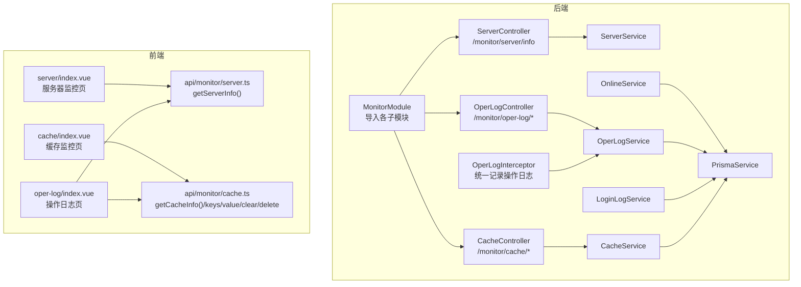
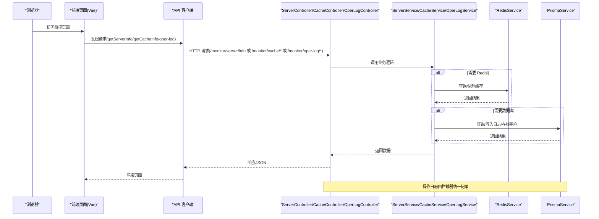
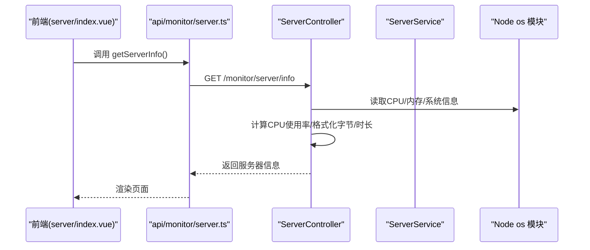
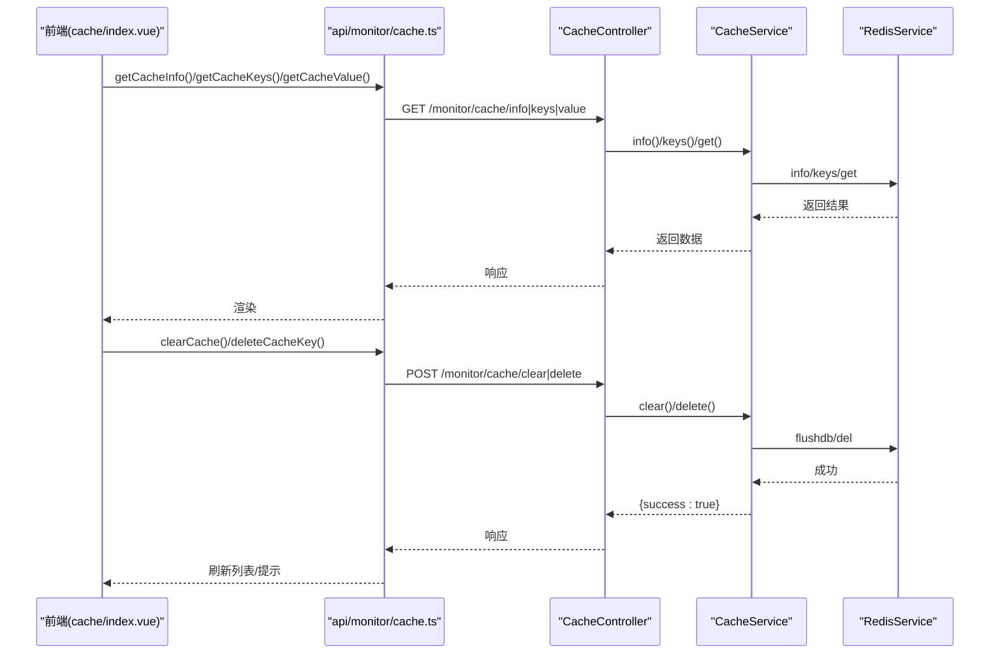
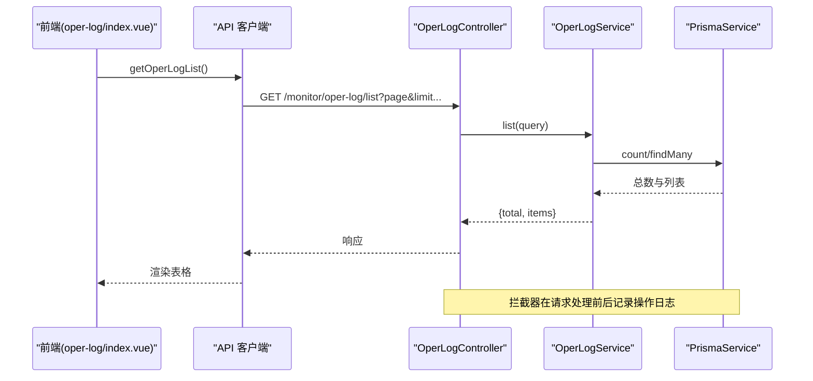
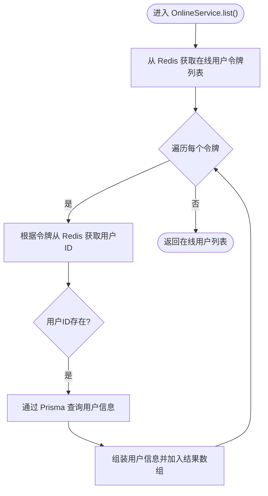
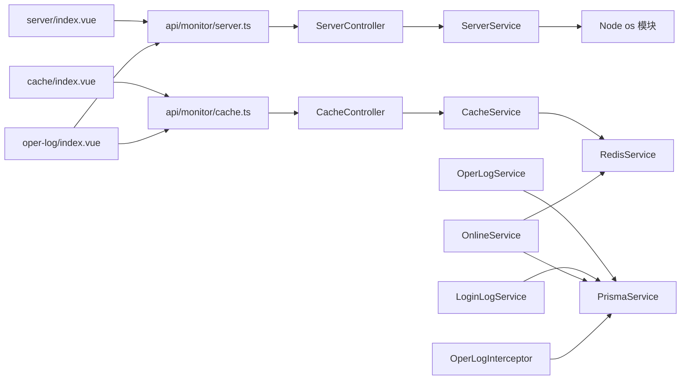

# 监控告警配置

<cite>
**本文引用的文件**
- [apps/backend/src/modules/monitor/monitor.module.ts](file://apps/backend/src/modules/monitor/monitor.module.ts)
- [apps/backend/src/modules/monitor/server/server.controller.ts](file://apps/backend/src/modules/monitor/server/server.controller.ts)
- [apps/backend/src/modules/monitor/server/server.service.ts](file://apps/backend/src/modules/monitor/server/server.service.ts)
- [apps/backend/src/modules/monitor/cache/cache.controller.ts](file://apps/backend/src/modules/monitor/cache/cache.controller.ts)
- [apps/backend/src/modules/monitor/cache/cache.service.ts](file://apps/backend/src/modules/monitor/cache/cache.service.ts)
- [apps/backend/src/modules/monitor/oper-log/oper-log.controller.ts](file://apps/backend/src/modules/monitor/oper-log/oper-log.controller.ts)
- [apps/backend/src/modules/monitor/oper-log/oper-log.service.ts](file://apps/backend/src/modules/monitor/oper-log/oper-log.service.ts)
- [apps/backend/src/modules/monitor/login-log/login-log.service.ts](file://apps/backend/src/modules/monitor/login-log/login-log.service.ts)
- [apps/backend/src/modules/monitor/online/online.service.ts](file://apps/backend/src/modules/monitor/online/online.service.ts)
- [apps/backend/src/common/oper-log.interceptor.ts](file://apps/backend/src/common/oper-log.interceptor.ts)
- [apps/backend/src/common/prisma.service.ts](file://apps/backend/src/common/prisma.service.ts)
- [apps/vben-admin/apps/web-antd/src/views/monitor/server/index.vue](file://apps/vben-admin/apps/web-antd/src/views/monitor/server/index.vue)
- [apps/vben-admin/apps/web-antd/src/views/monitor/cache/index.vue](file://apps/vben-admin/apps/web-antd/src/views/monitor/cache/index.vue)
- [apps/vben-admin/apps/web-antd/src/views/monitor/oper-log/index.vue](file://apps/vben-admin/apps/web-antd/src/views/monitor/oper-log/index.vue)
- [apps/vben-admin/apps/web-antd/src/api/monitor/server.ts](file://apps/vben-admin/apps/web-antd/src/api/monitor/server.ts)
- [apps/vben-admin/apps/web-antd/src/api/monitor/cache.ts](file://apps/vben-admin/apps/web-antd/src/api/monitor/cache.ts)
</cite>

## 目录
1. [简介](#简介)
2. [项目结构](#项目结构)
3. [核心组件](#核心组件)
4. [架构总览](#架构总览)
5. [详细组件分析](#详细组件分析)
6. [依赖关系分析](#依赖关系分析)
7. [性能考虑](#性能考虑)
8. [故障排查指南](#故障排查指南)
9. [结论](#结论)
10. [附录](#附录)

## 简介
本文件面向监控与告警配置，围绕应用健康检查（HTTP健康检查端点、数据库连接检查、外部服务可用性检测）、性能指标采集（CPU 使用率、内存占用、请求响应时间、错误率统计）、日志监控（错误日志收集、异常堆栈跟踪、关键事件告警）、告警规则设置（阈值配置、告警级别、通知渠道）、监控仪表板配置（Grafana 仪表板、Prometheus 查询与可视化图表）、监控数据存储与归档策略（数据保留期限、历史数据分析）以及监控系统故障排查与性能优化建议进行系统化说明。  
本项目后端采用 NestJS + Prisma，前端采用 Vben Admin，监控模块通过控制器暴露 REST 接口，拦截器记录操作日志，Redis 提供缓存监控能力，数据库用于持久化日志与在线用户信息。

## 项目结构
监控相关代码主要分布在后端的 monitor 模块与前端的 monitor 页面中，形成“接口层-业务层-数据层”的清晰分层；同时通过拦截器实现统一的操作日志采集。

图示来源
- [apps/backend/src/modules/monitor/monitor.module.ts:1-11](file://apps/backend/src/modules/monitor/monitor.module.ts#L1-L11)
- [apps/backend/src/modules/monitor/server/server.controller.ts:1-70](file://apps/backend/src/modules/monitor/server/server.controller.ts#L1-L70)
- [apps/backend/src/modules/monitor/cache/cache.controller.ts:1-50](file://apps/backend/src/modules/monitor/cache/cache.controller.ts#L1-L50)
- [apps/backend/src/modules/monitor/oper-log/oper-log.controller.ts:1-34](file://apps/backend/src/modules/monitor/oper-log/oper-log.controller.ts#L1-L34)
- [apps/backend/src/common/oper-log.interceptor.ts:33-79](file://apps/backend/src/common/oper-log.interceptor.ts#L33-L79)
- [apps/vben-admin/apps/web-antd/src/views/monitor/server/index.vue:1-139](file://apps/vben-admin/apps/web-antd/src/views/monitor/server/index.vue#L1-L139)
- [apps/vben-admin/apps/web-antd/src/views/monitor/cache/index.vue:1-114](file://apps/vben-admin/apps/web-antd/src/views/monitor/cache/index.vue#L1-L114)
- [apps/vben-admin/apps/web-antd/src/views/monitor/oper-log/index.vue:1-161](file://apps/vben-admin/apps/web-antd/src/views/monitor/oper-log/index.vue#L1-L161)
- [apps/vben-admin/apps/web-antd/src/api/monitor/server.ts:1-33](file://apps/vben-admin/apps/web-antd/src/api/monitor/server.ts#L1-L33)
- [apps/vben-admin/apps/web-antd/src/api/monitor/cache.ts:1-35](file://apps/vben-admin/apps/web-antd/src/api/monitor/cache.ts#L1-L35)

章节来源
- [apps/backend/src/modules/monitor/monitor.module.ts:1-11](file://apps/backend/src/modules/monitor/monitor.module.ts#L1-L11)

## 核心组件
- 监控模块聚合：MonitorModule 导入登录日志、操作日志、在线用户、服务器、缓存等子模块，统一对外暴露监控能力。
- 服务器监控：ServerController 提供 /monitor/server/info 接口，返回 CPU、内存、磁盘、系统信息等；计算 CPU 使用率与格式化字节/时长。
- 缓存监控：CacheController 提供 /monitor/cache/info、/monitor/cache/keys、/monitor/cache/value、/monitor/cache/clear、/monitor/cache/delete 等接口，结合 CacheService 与 RedisService 实现缓存信息查询与清理。
- 日志监控：OperLogController 提供 /monitor/oper-log/list、/monitor/oper-log/:id、/monitor/oper-log/clean 接口，OperLogService 负责分页查询与清理；LoginLogService 提供登录日志查询；OnlineService 结合 Redis 与 Prisma 获取在线用户并支持强制下线。
- 统一日志：OperLogInterceptor 在请求处理前后记录操作日志，包含用户、模块、方法、参数、结果、耗时、IP、状态等字段，异常时记录错误信息，且对敏感字段进行脱敏。

章节来源
- [apps/backend/src/modules/monitor/monitor.module.ts:1-11](file://apps/backend/src/modules/monitor/monitor.module.ts#L1-L11)
- [apps/backend/src/modules/monitor/server/server.controller.ts:1-70](file://apps/backend/src/modules/monitor/server/server.controller.ts#L1-L70)
- [apps/backend/src/modules/monitor/cache/cache.controller.ts:1-50](file://apps/backend/src/modules/monitor/cache/cache.controller.ts#L1-L50)
- [apps/backend/src/modules/monitor/oper-log/oper-log.controller.ts:1-34](file://apps/backend/src/modules/monitor/oper-log/oper-log.controller.ts#L1-L34)
- [apps/backend/src/modules/monitor/oper-log/oper-log.service.ts:1-33](file://apps/backend/src/modules/monitor/oper-log/oper-log.service.ts#L1-L33)
- [apps/backend/src/modules/monitor/login-log/login-log.service.ts:1-31](file://apps/backend/src/modules/monitor/login-log/login-log.service.ts#L1-L31)
- [apps/backend/src/modules/monitor/online/online.service.ts:1-31](file://apps/backend/src/modules/monitor/online/online.service.ts#L1-L31)
- [apps/backend/src/common/oper-log.interceptor.ts:33-79](file://apps/backend/src/common/oper-log.interceptor.ts#L33-L79)

## 架构总览
下图展示从浏览器到后端控制器、服务与数据层的整体调用链路，以及日志拦截器在请求生命周期中的作用。

图示来源
- [apps/backend/src/modules/monitor/server/server.controller.ts:1-70](file://apps/backend/src/modules/monitor/server/server.controller.ts#L1-L70)
- [apps/backend/src/modules/monitor/cache/cache.controller.ts:1-50](file://apps/backend/src/modules/monitor/cache/cache.controller.ts#L1-L50)
- [apps/backend/src/modules/monitor/oper-log/oper-log.controller.ts:1-34](file://apps/backend/src/modules/monitor/oper-log/oper-log.controller.ts#L1-L34)
- [apps/backend/src/common/oper-log.interceptor.ts:33-79](file://apps/backend/src/common/oper-log.interceptor.ts#L33-L79)
- [apps/backend/src/common/prisma.service.ts:1-22](file://apps/backend/src/common/prisma.service.ts#L1-L22)

## 详细组件分析

### 服务器监控组件
- 功能职责：提供服务器基础信息与资源使用情况，包括 CPU 型号/核心数/使用率、内存总量/已用/空闲/使用率、磁盘总量/已用/使用率、系统信息与运行时长。
- 关键流程：控制器读取系统信息并计算 CPU 使用率，格式化字节与运行时长，返回结构化数据。
- 前端展示：server/index.vue 通过 API 获取数据并以卡片+进度条形式展示，按使用率阈值高亮不同状态。

图示来源
- [apps/vben-admin/apps/web-antd/src/views/monitor/server/index.vue:1-139](file://apps/vben-admin/apps/web-antd/src/views/monitor/server/index.vue#L1-L139)
- [apps/vben-admin/apps/web-antd/src/api/monitor/server.ts:1-33](file://apps/vben-admin/apps/web-antd/src/api/monitor/server.ts#L1-L33)
- [apps/backend/src/modules/monitor/server/server.controller.ts:14-41](file://apps/backend/src/modules/monitor/server/server.controller.ts#L14-L41)

章节来源
- [apps/backend/src/modules/monitor/server/server.controller.ts:1-70](file://apps/backend/src/modules/monitor/server/server.controller.ts#L1-L70)
- [apps/vben-admin/apps/web-antd/src/views/monitor/server/index.vue:1-139](file://apps/vben-admin/apps/web-antd/src/views/monitor/server/index.vue#L1-L139)
- [apps/vben-admin/apps/web-antd/src/api/monitor/server.ts:1-33](file://apps/vben-admin/apps/web-antd/src/api/monitor/server.ts#L1-L33)

### 缓存监控组件
- 功能职责：提供 Redis 连接信息、键列表、键值查询、全量清理与单键删除。
- 关键流程：CacheController 将请求委派给 CacheService，后者通过 RedisService 执行具体操作；清理与删除操作返回成功状态。
- 前端展示：cache/index.vue 展示 Redis 信息与键列表，支持清空全部与删除单键，点击“查看”显示键值详情。

图示来源
- [apps/vben-admin/apps/web-antd/src/views/monitor/cache/index.vue:1-114](file://apps/vben-admin/apps/web-antd/src/views/monitor/cache/index.vue#L1-L114)
- [apps/vben-admin/apps/web-antd/src/api/monitor/cache.ts:1-35](file://apps/vben-admin/apps/web-antd/src/api/monitor/cache.ts#L1-L35)
- [apps/backend/src/modules/monitor/cache/cache.controller.ts:1-50](file://apps/backend/src/modules/monitor/cache/cache.controller.ts#L1-L50)
- [apps/backend/src/modules/monitor/cache/cache.service.ts:1-29](file://apps/backend/src/modules/monitor/cache/cache.service.ts#L1-L29)

章节来源
- [apps/backend/src/modules/monitor/cache/cache.controller.ts:1-50](file://apps/backend/src/modules/monitor/cache/cache.controller.ts#L1-L50)
- [apps/backend/src/modules/monitor/cache/cache.service.ts:1-29](file://apps/backend/src/modules/monitor/cache/cache.service.ts#L1-L29)
- [apps/vben-admin/apps/web-antd/src/views/monitor/cache/index.vue:1-114](file://apps/vben-admin/apps/web-antd/src/views/monitor/cache/index.vue#L1-L114)
- [apps/vben-admin/apps/web-antd/src/api/monitor/cache.ts:1-35](file://apps/vben-admin/apps/web-antd/src/api/monitor/cache.ts#L1-L35)

### 操作日志与登录日志组件
- 功能职责：OperLogController 提供操作日志列表、详情与清空；LoginLogService 提供登录日志列表与详情；OnlineService 获取在线用户并支持强制下线。
- 数据持久化：OperLogService 与 LoginLogService 基于 PrismaService 访问数据库，实现分页查询、条件过滤与清理。
- 统一日志：OperLogInterceptor 在请求处理前后记录操作日志，包含用户、模块、方法、参数、结果、耗时、IP、状态等字段，异常时记录错误信息，且对敏感字段进行脱敏。

图示来源
- [apps/backend/src/modules/monitor/oper-log/oper-log.controller.ts:1-34](file://apps/backend/src/modules/monitor/oper-log/oper-log.controller.ts#L1-L34)
- [apps/backend/src/modules/monitor/oper-log/oper-log.service.ts:1-33](file://apps/backend/src/modules/monitor/oper-log/oper-log.service.ts#L1-L33)
- [apps/backend/src/common/oper-log.interceptor.ts:33-79](file://apps/backend/src/common/oper-log.interceptor.ts#L33-L79)
- [apps/backend/src/common/prisma.service.ts:1-22](file://apps/backend/src/common/prisma.service.ts#L1-L22)

章节来源
- [apps/backend/src/modules/monitor/oper-log/oper-log.controller.ts:1-34](file://apps/backend/src/modules/monitor/oper-log/oper-log.controller.ts#L1-L34)
- [apps/backend/src/modules/monitor/oper-log/oper-log.service.ts:1-33](file://apps/backend/src/modules/monitor/oper-log/oper-log.service.ts#L1-L33)
- [apps/backend/src/modules/monitor/login-log/login-log.service.ts:1-31](file://apps/backend/src/modules/monitor/login-log/login-log.service.ts#L1-L31)
- [apps/backend/src/modules/monitor/online/online.service.ts:1-31](file://apps/backend/src/modules/monitor/online/online.service.ts#L1-L31)
- [apps/backend/src/common/oper-log.interceptor.ts:33-79](file://apps/backend/src/common/oper-log.interceptor.ts#L33-L79)
- [apps/backend/src/common/prisma.service.ts:1-22](file://apps/backend/src/common/prisma.service.ts#L1-L22)

### 在线用户与强制下线
- 功能职责：OnlineService 通过 Redis 获取在线用户令牌集合，再根据令牌映射到用户信息，支持强制下线。
- 数据来源：Redis 存储在线用户映射，Prisma 查询用户基本信息。

图示来源
- [apps/backend/src/modules/monitor/online/online.service.ts:9-25](file://apps/backend/src/modules/monitor/online/online.service.ts#L9-L25)

章节来源
- [apps/backend/src/modules/monitor/online/online.service.ts:1-31](file://apps/backend/src/modules/monitor/online/online.service.ts#L1-L31)

## 依赖关系分析
- 模块聚合：MonitorModule 导入 LoginLogModule、OperLogModule、OnlineModule、ServerModule、CacheModule，集中管理监控相关功能。
- 控制器依赖：各 Controller 依赖对应 Service；Service 依赖 RedisService 或 PrismaService；拦截器依赖 PrismaService 写入日志。
- 前后端交互：前端通过 API 客户端调用后端 /monitor/* 接口，渲染监控页面。

图示来源
- [apps/backend/src/modules/monitor/monitor.module.ts:1-11](file://apps/backend/src/modules/monitor/monitor.module.ts#L1-L11)
- [apps/backend/src/modules/monitor/server/server.controller.ts:1-70](file://apps/backend/src/modules/monitor/server/server.controller.ts#L1-L70)
- [apps/backend/src/modules/monitor/cache/cache.controller.ts:1-50](file://apps/backend/src/modules/monitor/cache/cache.controller.ts#L1-L50)
- [apps/backend/src/modules/monitor/oper-log/oper-log.controller.ts:1-34](file://apps/backend/src/modules/monitor/oper-log/oper-log.controller.ts#L1-L34)
- [apps/backend/src/common/oper-log.interceptor.ts:33-79](file://apps/backend/src/common/oper-log.interceptor.ts#L33-L79)
- [apps/backend/src/common/prisma.service.ts:1-22](file://apps/backend/src/common/prisma.service.ts#L1-L22)

章节来源
- [apps/backend/src/modules/monitor/monitor.module.ts:1-11](file://apps/backend/src/modules/monitor/monitor.module.ts#L1-L11)

## 性能考虑
- 服务器监控：CPU 使用率计算基于系统采样，建议在高并发场景下降低采集频率或使用更高效的采样策略；内存与磁盘使用为瞬时值，适合短周期展示。
- 缓存监控：keys 查询可能产生大量键，建议限制分页大小与默认模式；批量清理需谨慎，可增加确认步骤。
- 日志监控：分页查询与条件过滤已实现，建议对高频查询建立索引；拦截器写入日志不应阻塞主流程，当前实现已捕获异常避免影响业务。
- 数据库连接：PrismaService 已开启错误与警告日志，便于定位慢查询与连接问题；建议在生产环境配置连接池参数与超时策略。

## 故障排查指南
- 数据库连接检查
  - 现象：应用启动时报数据库连接失败或查询异常。
  - 排查：检查 PrismaService 的日志输出与连接配置；确认数据库服务可达与凭据正确。
  - 参考路径：[apps/backend/src/common/prisma.service.ts:1-22](file://apps/backend/src/common/prisma.service.ts#L1-L22)
- 外部服务可用性检测（Redis）
  - 现象：缓存相关接口报错或无响应。
  - 排查：确认 Redis 服务运行正常；检查 CacheService 对 RedisService 的调用是否成功；核对网络连通性与认证配置。
  - 参考路径：[apps/backend/src/modules/monitor/cache/cache.service.ts:1-29](file://apps/backend/src/modules/monitor/cache/cache.service.ts#L1-L29)
- 操作日志无法写入
  - 现象：业务执行正常但日志表无记录。
  - 排查：确认 OperLogInterceptor 是否生效；检查 PrismaService 写入是否抛出异常；关注拦截器对异常的捕获与忽略逻辑。
  - 参考路径：[apps/backend/src/common/oper-log.interceptor.ts:33-79](file://apps/backend/src/common/oper-log.interceptor.ts#L33-L79)
- 在线用户查询为空
  - 现象：在线用户列表为空。
  - 排查：确认 Redis 中在线用户键是否存在；检查 OnlineService 的令牌与用户映射逻辑；核对用户信息查询权限。
  - 参考路径：[apps/backend/src/modules/monitor/online/online.service.ts:1-31](file://apps/backend/src/modules/monitor/online/online.service.ts#L1-L31)

章节来源
- [apps/backend/src/common/prisma.service.ts:1-22](file://apps/backend/src/common/prisma.service.ts#L1-L22)
- [apps/backend/src/modules/monitor/cache/cache.service.ts:1-29](file://apps/backend/src/modules/monitor/cache/cache.service.ts#L1-L29)
- [apps/backend/src/common/oper-log.interceptor.ts:33-79](file://apps/backend/src/common/oper-log.interceptor.ts#L33-L79)
- [apps/backend/src/modules/monitor/online/online.service.ts:1-31](file://apps/backend/src/modules/monitor/online/online.service.ts#L1-L31)

## 结论
本项目提供了完善的监控与日志基础设施：服务器资源监控、缓存状态监控、操作与登录日志管理，以及统一的日志拦截机制。结合前端可视化页面，能够快速定位问题并评估系统健康状况。后续可在现有基础上扩展 Prometheus/Grafana 监控体系，完善告警规则与通知渠道，制定数据保留与归档策略，持续优化性能与稳定性。

## 附录

### 应用健康检查配置建议
- HTTP 健康检查端点：建议在网关或反向代理层暴露 /health 接口，返回应用与数据库、缓存的连通状态；若使用容器编排，可结合 liveness/readiness 探针。
- 数据库连接检查：通过 PrismaService 的连接状态与日志判断；在生产环境启用连接池与超时配置。
- 外部服务可用性检测：对 Redis、对象存储等外部依赖增加 ping/信息查询接口，失败时记录告警。

### 性能指标采集建议
- CPU 使用率：结合 Node os 模块与系统采样，建议每 10-30 秒采样一次，避免过高开销。
- 内存占用：记录 heapUsed/heapTotal/rss 等指标，配合 GC 事件统计。
- 请求响应时间：在拦截器中记录耗时，区分接口与模块维度。
- 错误率统计：基于状态码与异常日志统计错误率，按模块与路由聚合。

### 日志监控配置建议
- 错误日志收集：统一通过拦截器记录操作日志，包含用户、模块、方法、参数、耗时、IP、状态与错误信息。
- 异常堆栈跟踪：在异常过滤器中记录堆栈信息，便于定位问题根因。
- 关键事件告警：对登录失败、高危操作、系统异常等事件触发即时告警。

### 告警规则设置建议
- 阈值配置：CPU 使用率 > 80% 持续 5 分钟；内存使用率 > 85%；请求错误率 > 5%；Redis 连接数异常波动；在线用户异常增长。
- 告警级别：严重（S0）、重要（S1）、次要（S2）、提示（S3）。
- 通知渠道：邮件、企业微信、钉钉、Slack 等，按级别分流。

### 监控仪表板配置建议
- Grafana 仪表板：基于 Prometheus 抓取的指标构建面板，包括 CPU、内存、磁盘、请求速率、错误率、缓存命中率、在线用户趋势等。
- Prometheus 查询：使用 rate()、increase()、histogram_quantile() 等函数进行指标计算与聚合。
- 可视化图表：折线图展示趋势，热力图展示错误分布，表格展示实时告警。

### 监控数据存储与归档策略建议
- 数据保留期限：短期（15 天）用于告警与实时监控，中期（90 天）用于趋势分析，长期（1 年以上）用于合规与审计归档。
- 历史数据分析：按日/周/月生成报表，识别异常模式与容量规划依据。