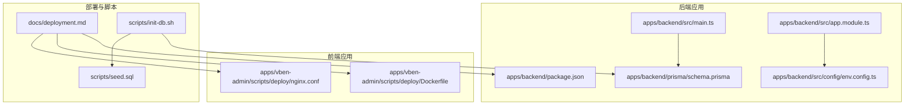
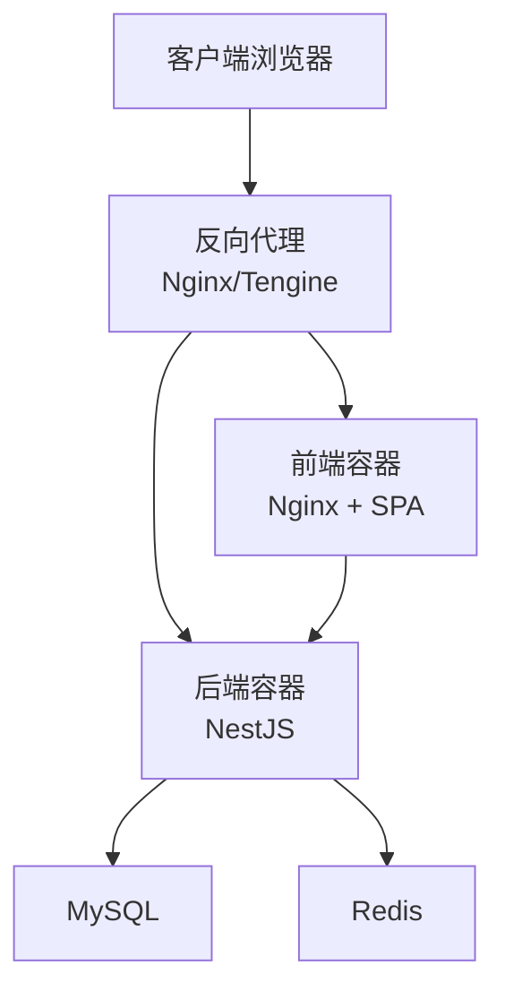
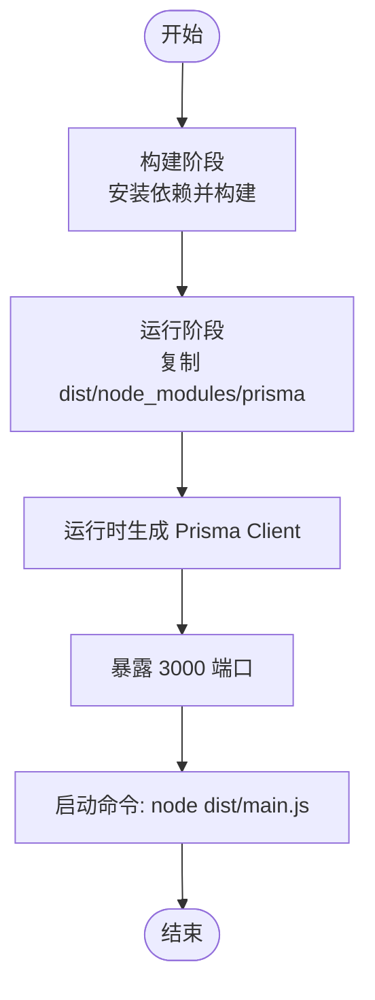
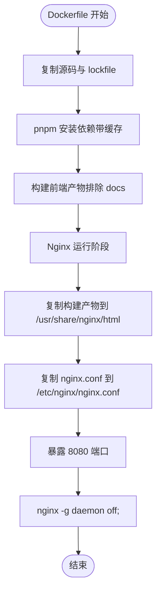
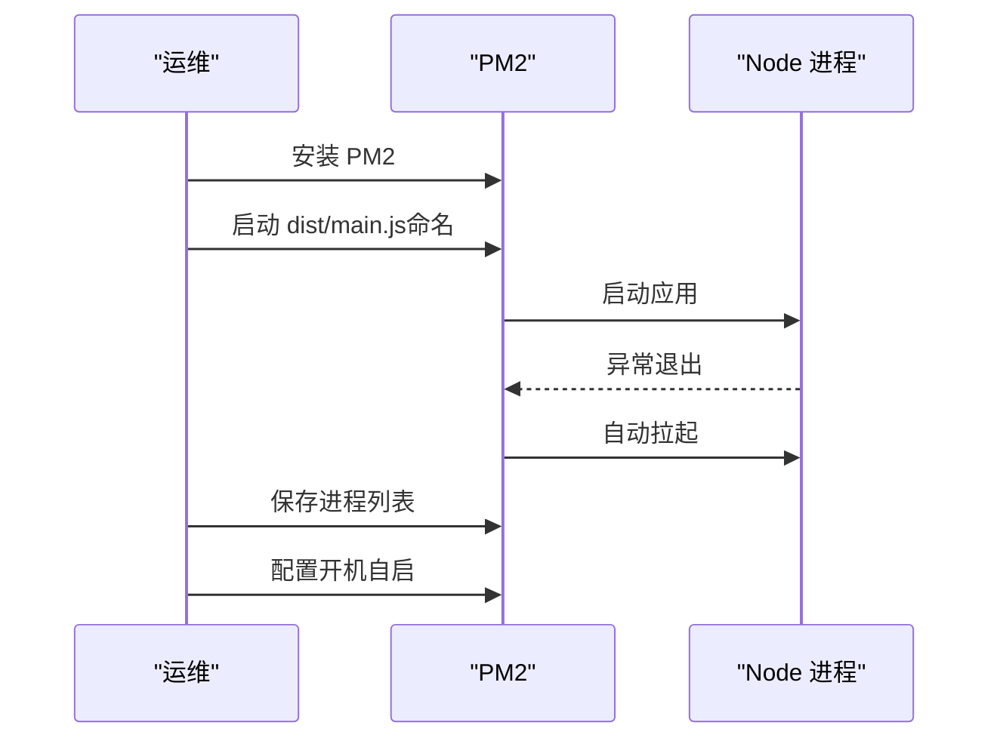
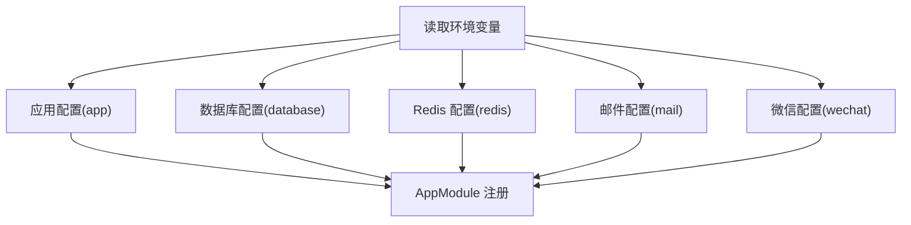
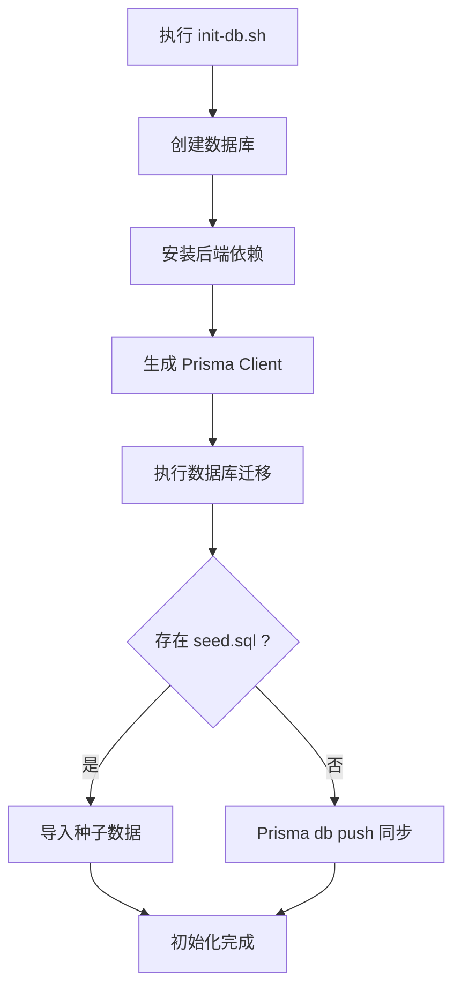
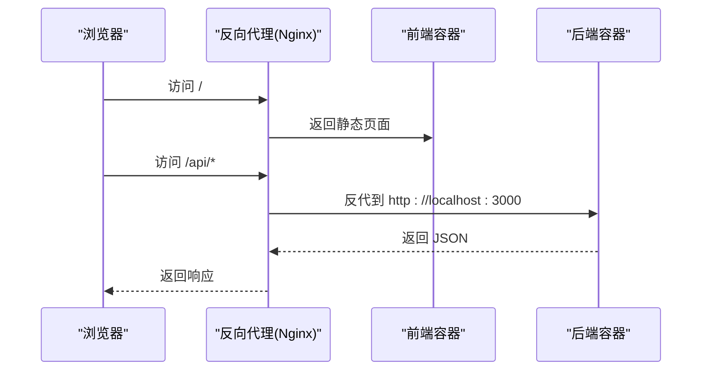
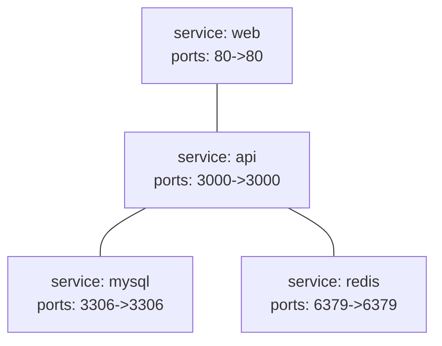
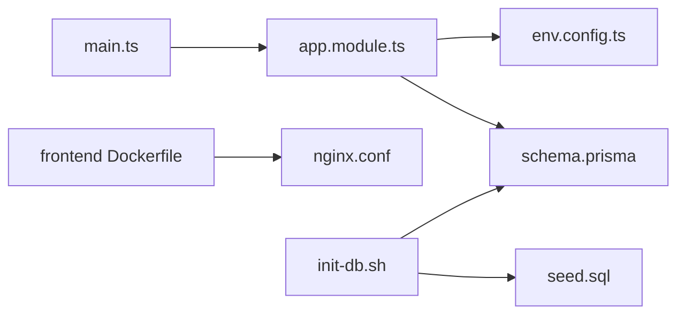

# 部署指南

<cite>
**本文引用的文件**
- [apps/backend/package.json](file://apps/backend/package.json)
- [apps/backend/src/main.ts](file://apps/backend/src/main.ts)
- [apps/backend/src/app.module.ts](file://apps/backend/src/app.module.ts)
- [apps/backend/src/config/env.config.ts](file://apps/backend/src/config/env.config.ts)
- [apps/backend/prisma/schema.prisma](file://apps/backend/prisma/schema.prisma)
- [docs/deployment.md](file://docs/deployment.md)
- [apps/vben-admin/scripts/deploy/Dockerfile](file://apps/vben-admin/scripts/deploy/Dockerfile)
- [apps/vben-admin/scripts/deploy/nginx.conf](file://apps/vben-admin/scripts/deploy/nginx.conf)
- [scripts/init-db.sh](file://scripts/init-db.sh)
- [scripts/seed.sql](file://scripts/seed.sql)
</cite>

## 目录
1. [简介](#简介)
2. [项目结构](#项目结构)
3. [核心组件](#核心组件)
4. [架构总览](#架构总览)
5. [详细组件分析](#详细组件分析)
6. [依赖关系分析](#依赖关系分析)
7. [性能考虑](#性能考虑)
8. [故障排查指南](#故障排查指南)
9. [结论](#结论)
10. [附录](#附录)

## 简介
本指南面向运维与开发团队，提供从零到一的完整部署方案：涵盖后端 NestJS 应用的 Docker 容器化与 docker-compose 编排、Nginx 反向代理与静态资源服务、PM2 进程管理与自动重启、数据库迁移与种子数据初始化、以及多环境配置差异、监控告警与高可用滚动更新最佳实践。文档中的所有步骤与示例均基于仓库现有文件与脚本，确保可复现性与一致性。

## 项目结构
该仓库采用多包工作区组织，主要包含：
- 后端 NestJS 应用：apps/backend
- 前端 Vben Admin 应用：apps/vben-admin（含多套前端实现）
- 文档与脚本：docs、scripts

**图表来源**
- [apps/backend/package.json:1-50](file://apps/backend/package.json#L1-L50)
- [apps/backend/src/main.ts:1-48](file://apps/backend/src/main.ts#L1-L48)
- [apps/backend/src/app.module.ts:1-59](file://apps/backend/src/app.module.ts#L1-L59)
- [apps/backend/src/config/env.config.ts:1-47](file://apps/backend/src/config/env.config.ts#L1-L47)
- [apps/backend/prisma/schema.prisma:1-347](file://apps/backend/prisma/schema.prisma#L1-L347)
- [apps/vben-admin/scripts/deploy/Dockerfile:1-39](file://apps/vben-admin/scripts/deploy/Dockerfile#L1-L39)
- [apps/vben-admin/scripts/deploy/nginx.conf:1-76](file://apps/vben-admin/scripts/deploy/nginx.conf#L1-L76)
- [docs/deployment.md:1-262](file://docs/deployment.md#L1-L262)
- [scripts/init-db.sh:1-85](file://scripts/init-db.sh#L1-L85)
- [scripts/seed.sql:1-186](file://scripts/seed.sql#L1-L186)

**章节来源**
- [docs/deployment.md:1-262](file://docs/deployment.md#L1-L262)

## 核心组件
- 后端服务（NestJS）
  - 启动入口与全局配置：[apps/backend/src/main.ts:1-48](file://apps/backend/src/main.ts#L1-L48)
  - 模块装配与全局守卫/拦截器/过滤器注册：[apps/backend/src/app.module.ts:1-59](file://apps/backend/src/app.module.ts#L1-L59)
  - 环境变量加载与分组配置（应用、数据库、Redis、邮件、微信等）：[apps/backend/src/config/env.config.ts:1-47](file://apps/backend/src/config/env.config.ts#L1-L47)
  - 数据库模型定义（Prisma）：[apps/backend/prisma/schema.prisma:1-347](file://apps/backend/prisma/schema.prisma#L1-L347)
  - 包管理与构建脚本：[apps/backend/package.json:1-50](file://apps/backend/package.json#L1-L50)
- 前端服务（Vite/Vben Admin）
  - 多阶段 Dockerfile（构建+Nginx）：[apps/vben-admin/scripts/deploy/Dockerfile:1-39](file://apps/vben-admin/scripts/deploy/Dockerfile#L1-L39)
  - Nginx 配置（CORS、静态资源、SPA 回退）：[apps/vben-admin/scripts/deploy/nginx.conf:1-76](file://apps/vben-admin/scripts/deploy/nginx.conf#L1-L76)
- 部署与运维
  - 统一部署文档与示例：[docs/deployment.md:1-262](file://docs/deployment.md#L1-L262)
  - 数据库初始化脚本与种子数据：[scripts/init-db.sh:1-85](file://scripts/init-db.sh#L1-L85)、[scripts/seed.sql:1-186](file://scripts/seed.sql#L1-L186)

**章节来源**
- [apps/backend/src/main.ts:1-48](file://apps/backend/src/main.ts#L1-L48)
- [apps/backend/src/app.module.ts:1-59](file://apps/backend/src/app.module.ts#L1-L59)
- [apps/backend/src/config/env.config.ts:1-47](file://apps/backend/src/config/env.config.ts#L1-L47)
- [apps/backend/prisma/schema.prisma:1-347](file://apps/backend/prisma/schema.prisma#L1-L347)
- [apps/backend/package.json:1-50](file://apps/backend/package.json#L1-L50)
- [apps/vben-admin/scripts/deploy/Dockerfile:1-39](file://apps/vben-admin/scripts/deploy/Dockerfile#L1-L39)
- [apps/vben-admin/scripts/deploy/nginx.conf:1-76](file://apps/vben-admin/scripts/deploy/nginx.conf#L1-L76)
- [docs/deployment.md:1-262](file://docs/deployment.md#L1-L262)
- [scripts/init-db.sh:1-85](file://scripts/init-db.sh#L1-L85)
- [scripts/seed.sql:1-186](file://scripts/seed.sql#L1-L186)

## 架构总览
整体部署由“前端容器+Nginx”和“后端容器+数据库+缓存”两部分组成，通过 docker-compose 实现一键编排；生产环境建议配合反向代理（Nginx/Tengine）与 SSL 证书，实现静态资源加速、API 代理与安全加固。

**图表来源**
- [docs/deployment.md:154-224](file://docs/deployment.md#L154-L224)
- [apps/vben-admin/scripts/deploy/nginx.conf:49-74](file://apps/vben-admin/scripts/deploy/nginx.conf#L49-L74)
- [apps/backend/src/main.ts:37-40](file://apps/backend/src/main.ts#L37-L40)

## 详细组件分析

### 后端容器化与镜像优化
- 多阶段构建
  - 构建阶段：使用 Node LTS 镜像，安装 pnpm 并执行构建，产物位于 dist 目录。
  - 运行阶段：仅复制 dist、node_modules 与 prisma 目录，减少镜像体积。
- Prisma 生成
  - 在最终镜像中执行 Prisma Client 生成，确保运行时具备数据库客户端。
- 端口暴露与启动
  - 暴露 3000 端口，CMD 启动 node dist/main.js。

**图表来源**
- [apps/backend/package.json:6-11](file://apps/backend/package.json#L6-L11)
- [docs/deployment.md:156-178](file://docs/deployment.md#L156-L178)

**章节来源**
- [apps/backend/package.json:1-50](file://apps/backend/package.json#L1-L50)
- [docs/deployment.md:154-178](file://docs/deployment.md#L154-L178)

### 前端容器化与 Nginx 反向代理
- Dockerfile 流程
  - 使用 Node slim 镜像进行多包构建，利用 pnpm store 缓存提升速度。
  - 使用 Nginx stable-alpine 作为运行时镜像，复制构建产物与 Nginx 配置。
  - 暴露 8080 端口，前台运行 Nginx。
- Nginx 配置要点
  - 静态资源根目录与 SPA 回退（try_files）。
  - CORS 头注入，支持跨域开发调试。
  - MIME 类型扩展，确保 JS/JSON 正确解析。

**图表来源**
- [apps/vben-admin/scripts/deploy/Dockerfile:1-39](file://apps/vben-admin/scripts/deploy/Dockerfile#L1-L39)
- [apps/vben-admin/scripts/deploy/nginx.conf:49-74](file://apps/vben-admin/scripts/deploy/nginx.conf#L49-L74)

**章节来源**
- [apps/vben-admin/scripts/deploy/Dockerfile:1-39](file://apps/vben-admin/scripts/deploy/Dockerfile#L1-L39)
- [apps/vben-admin/scripts/deploy/nginx.conf:1-76](file://apps/vben-admin/scripts/deploy/nginx.conf#L1-L76)

### PM2 进程管理与自动重启
- 安装与启动
  - 全局安装 PM2，启动后端 dist/main.js，并命名进程。
- 自动化
  - 保存进程列表，配置开机自启，实现崩溃后的自动重启。

**图表来源**
- [docs/deployment.md:83-97](file://docs/deployment.md#L83-L97)

**章节来源**
- [docs/deployment.md:83-97](file://docs/deployment.md#L83-L97)

### 环境变量与多环境配置
- 后端环境变量分组
  - 应用层：端口、环境、JWT、上传目录、文件大小、对象存储配置等。
  - 数据库层：DATABASE_URL。
  - 缓存层：REDIS_HOST、REDIS_PORT、REDIS_PASSWORD、REDIS_DB。
  - 邮件与微信等扩展配置。
- 前端与后端的差异化
  - 前端以 Nginx 静态托管为主，无需 Node 进程常驻。
  - 后端通过 ConfigModule 加载，支持多环境切换与默认值。

**图表来源**
- [apps/backend/src/config/env.config.ts:3-46](file://apps/backend/src/config/env.config.ts#L3-L46)
- [apps/backend/src/app.module.ts:18-56](file://apps/backend/src/app.module.ts#L18-L56)

**章节来源**
- [apps/backend/src/config/env.config.ts:1-47](file://apps/backend/src/config/env.config.ts#L1-L47)
- [apps/backend/src/app.module.ts:1-59](file://apps/backend/src/app.module.ts#L1-L59)

### 数据库迁移与种子数据
- 迁移与生成
  - 通过 Prisma Schema 定义数据模型，使用 generate/migrate 命令生成客户端并执行迁移。
- 初始化脚本
  - 自动创建数据库、安装依赖、生成 Prisma Client、执行迁移、导入种子数据或回退到 db push。
- 种子数据
  - 提供完整的初始化 SQL，包含部门、岗位、角色、用户、菜单、字典、系统配置、通知公告、租户等。

**图表来源**
- [scripts/init-db.sh:23-79](file://scripts/init-db.sh#L23-L79)
- [scripts/seed.sql:1-186](file://scripts/seed.sql#L1-L186)
- [apps/backend/prisma/schema.prisma:1-347](file://apps/backend/prisma/schema.prisma#L1-L347)

**章节来源**
- [scripts/init-db.sh:1-85](file://scripts/init-db.sh#L1-L85)
- [scripts/seed.sql:1-186](file://scripts/seed.sql#L1-L186)
- [apps/backend/prisma/schema.prisma:1-347](file://apps/backend/prisma/schema.prisma#L1-L347)

### 反向代理与静态资源服务
- Nginx 配置要点
  - 监听 8080（容器内），根目录指向前端构建产物。
  - SPA 回退：try_files $uri $uri/ /index.html。
  - CORS 支持：为开发场景添加跨域头。
- API 代理转发
  - 建议在生产反向代理（如 Tengine/OpenResty）上配置 /api 前缀转发至后端 3000 端口。
- SSL 证书
  - 建议使用 Let’s Encrypt 自动签发，结合 HTTP-01 或 DNS-01 验证，开启 HSTS 与 TLS 最低版本约束。

**图表来源**
- [apps/vben-admin/scripts/deploy/nginx.conf:49-74](file://apps/vben-admin/scripts/deploy/nginx.conf#L49-L74)
- [apps/backend/src/main.ts:37-40](file://apps/backend/src/main.ts#L37-L40)
- [docs/deployment.md:124-152](file://docs/deployment.md#L124-L152)

**章节来源**
- [apps/vben-admin/scripts/deploy/nginx.conf:1-76](file://apps/vben-admin/scripts/deploy/nginx.conf#L1-L76)
- [apps/backend/src/main.ts:1-48](file://apps/backend/src/main.ts#L1-L48)
- [docs/deployment.md:124-152](file://docs/deployment.md#L124-L152)

### docker-compose 编排
- 服务编排
  - api：后端服务，映射 3000 端口，依赖 mysql 与 redis。
  - web：前端服务，映射 80 端口，依赖 api。
  - mysql：持久化卷，设置 root 密码与数据库名。
  - redis：持久化卷，暴露 6379。
- 环境变量
  - 通过环境变量传递 DATABASE_URL 与 REDIS_HOST，实现服务发现与配置解耦。

**图表来源**
- [docs/deployment.md:180-224](file://docs/deployment.md#L180-L224)

**章节来源**
- [docs/deployment.md:180-224](file://docs/deployment.md#L180-L224)

### 监控告警与健康检查
- 健康检查
  - 后端可通过 /api/doc.html 或 /api-docs 访问 Swagger 文档，用于健康探针。
  - 建议在反向代理层增加 /health 探针，返回 200 表示存活。
- 性能指标
  - 使用 Prometheus + Grafana 收集 CPU、内存、请求量与延迟。
  - 结合日志采集（ELK/EFK）对错误日志进行聚合与告警。
- 告警策略
  - 请求错误率、P95/P99 延迟、队列积压、磁盘/内存/CPU 阈值告警。

[本节为通用运维建议，不直接分析具体文件，故无章节来源]

### 高可用与滚动更新
- 负载均衡
  - 使用 Nginx/Tengine 做四层/七层负载均衡，后端多实例横向扩展。
- 滚动更新
  - docker-compose：停止旧容器、拉取新镜像、启动新容器、健康检查通过后删除旧容器。
  - Kubernetes：Deployment + RollingUpdate + readinessProbe/livenessProbe。
- 数据持久化
  - MySQL/Redis 使用 named volumes，避免容器重建导致数据丢失。

[本节为通用运维建议，不直接分析具体文件，故无章节来源]

## 依赖关系分析
- 后端
  - NestJS 核心模块、Swagger、Throttler、Schedule、Prisma、Redis、JWT、Passport 等。
  - 通过 ConfigModule 加载环境变量，AppModule 统一装配。
- 前端
  - Vite 构建，Nginx 静态托管；Dockerfile 中使用 pnpm 缓存与多包过滤。
- 运维
  - init-db.sh 串联数据库初始化流程；deployment.md 提供统一部署步骤。

**图表来源**
- [apps/backend/src/main.ts:1-48](file://apps/backend/src/main.ts#L1-L48)
- [apps/backend/src/app.module.ts:1-59](file://apps/backend/src/app.module.ts#L1-L59)
- [apps/backend/src/config/env.config.ts:1-47](file://apps/backend/src/config/env.config.ts#L1-L47)
- [apps/backend/prisma/schema.prisma:1-347](file://apps/backend/prisma/schema.prisma#L1-L347)
- [apps/vben-admin/scripts/deploy/Dockerfile:1-39](file://apps/vben-admin/scripts/deploy/Dockerfile#L1-L39)
- [apps/vben-admin/scripts/deploy/nginx.conf:1-76](file://apps/vben-admin/scripts/deploy/nginx.conf#L1-L76)
- [scripts/init-db.sh:1-85](file://scripts/init-db.sh#L1-L85)
- [scripts/seed.sql:1-186](file://scripts/seed.sql#L1-L186)

**章节来源**
- [apps/backend/src/main.ts:1-48](file://apps/backend/src/main.ts#L1-L48)
- [apps/backend/src/app.module.ts:1-59](file://apps/backend/src/app.module.ts#L1-L59)
- [apps/backend/src/config/env.config.ts:1-47](file://apps/backend/src/config/env.config.ts#L1-L47)
- [apps/backend/prisma/schema.prisma:1-347](file://apps/backend/prisma/schema.prisma#L1-L347)
- [apps/vben-admin/scripts/deploy/Dockerfile:1-39](file://apps/vben-admin/scripts/deploy/Dockerfile#L1-L39)
- [apps/vben-admin/scripts/deploy/nginx.conf:1-76](file://apps/vben-admin/scripts/deploy/nginx.conf#L1-L76)
- [scripts/init-db.sh:1-85](file://scripts/init-db.sh#L1-L85)
- [scripts/seed.sql:1-186](file://scripts/seed.sql#L1-L186)

## 性能考虑
- 前端
  - 使用 pnpm 缓存与多包过滤，减少重复安装时间。
  - Nginx 启用静态资源压缩与缓存头，降低带宽与延迟。
- 后端
  - 使用 Throttler 限流，防止突发流量击垮服务。
  - Prisma Client 生成于运行时，避免冷启动抖动。
- 数据库
  - 使用连接池与索引优化，定期清理日志与临时表。

[本节为通用性能建议，不直接分析具体文件，故无章节来源]

## 故障排查指南
- 端口被占用
  - Linux/Mac：使用 lsof/netstat 查找 PID 并终止进程。
- 数据库连接失败
  - 检查 MySQL 服务状态、连接凭据与数据库是否存在。
- Redis 连接失败
  - 若不使用缓存，可在配置中禁用相关模块或设置 REDIS_ENABLED=false。
- 跨域问题
  - 后端已启用 CORS；若仍异常，检查网关/反向代理是否覆盖了相关头。
- 静态资源 404
  - 确认 Nginx 的 try_files 配置与 root 路径正确。

**章节来源**
- [docs/deployment.md:226-261](file://docs/deployment.md#L226-L261)

## 结论
本指南基于仓库现有文件，提供了从容器化、反向代理、进程管理到数据库初始化与运维监控的完整部署路径。建议在生产环境中补充 SSL 证书、健康检查、性能监控与告警策略，并结合负载均衡与滚动更新实现高可用与平滑发布。

## 附录
- 快速参考
  - 后端构建与启动：参见 [apps/backend/package.json:6-11](file://apps/backend/package.json#L6-L11) 与 [docs/deployment.md:72-81](file://docs/deployment.md#L72-L81)
  - 前端 Dockerfile 与 Nginx 配置：参见 [apps/vben-admin/scripts/deploy/Dockerfile:1-39](file://apps/vben-admin/scripts/deploy/Dockerfile#L1-L39)、[apps/vben-admin/scripts/deploy/nginx.conf:1-76](file://apps/vben-admin/scripts/deploy/nginx.conf#L1-L76)
  - docker-compose 编排：参见 [docs/deployment.md:180-224](file://docs/deployment.md#L180-L224)
  - 数据库初始化脚本与种子数据：参见 [scripts/init-db.sh:1-85](file://scripts/init-db.sh#L1-L85)、[scripts/seed.sql:1-186](file://scripts/seed.sql#L1-L186)