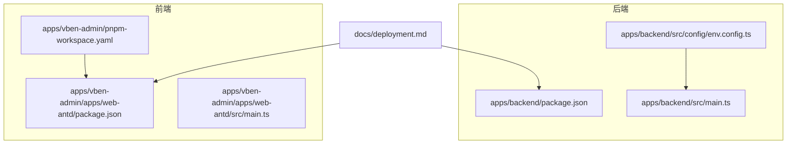
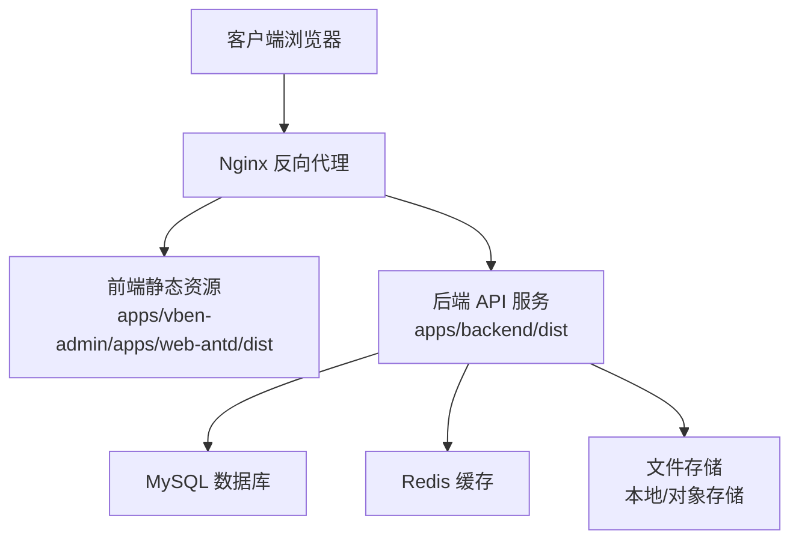
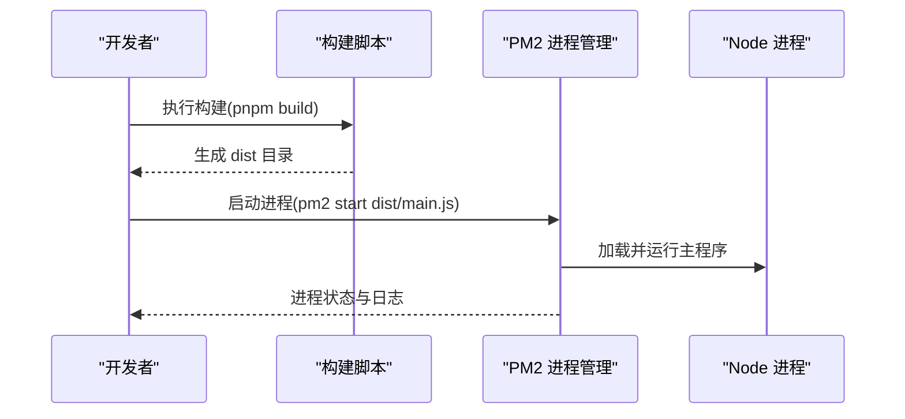
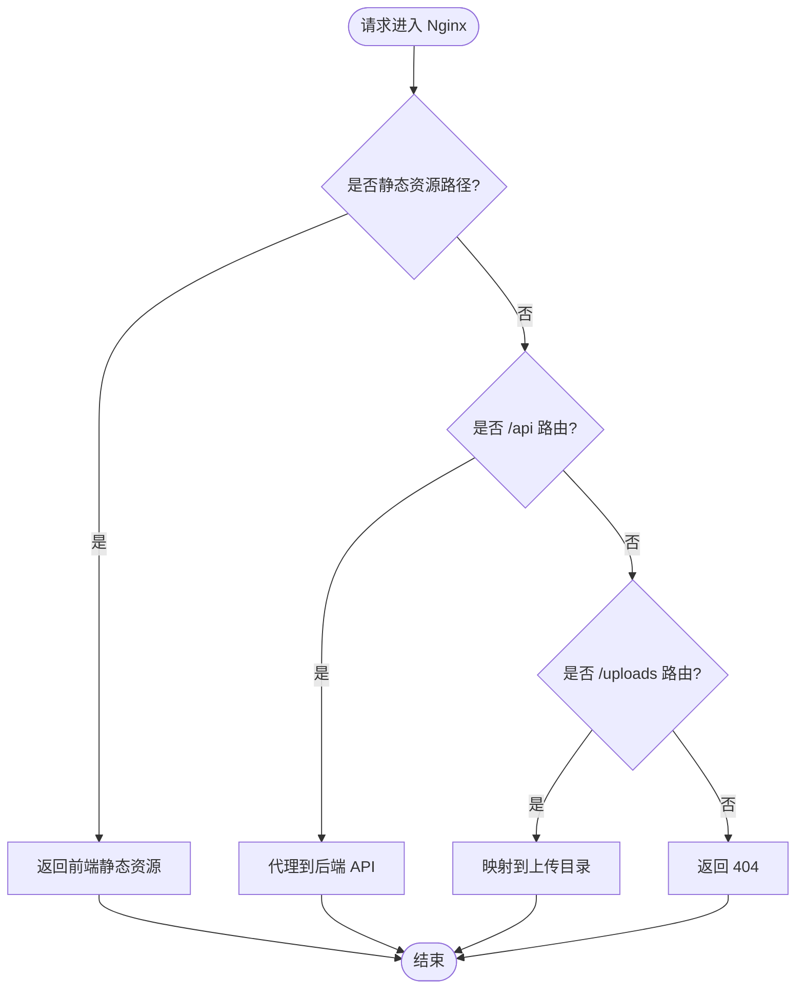
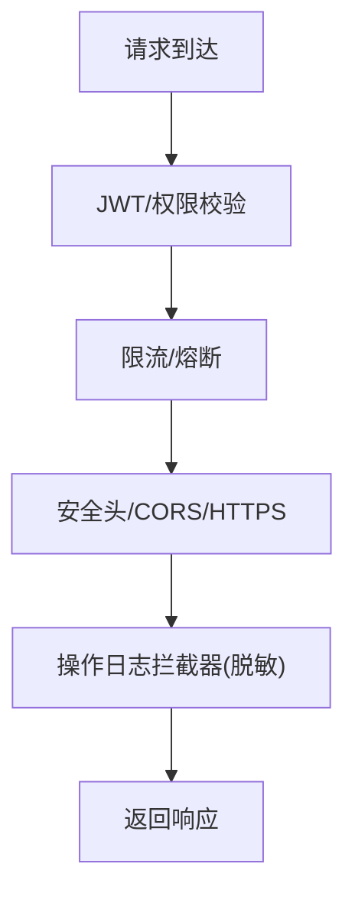
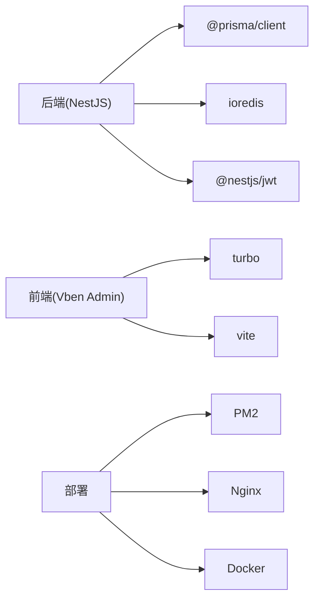

# 部署最佳实践

<cite>
**本文档引用的文件**
- [deployment.md](file://docs/deployment.md)
- [env.config.ts](file://apps/backend/src/config/env.config.ts)
- [package.json](file://apps/backend/package.json)
- [package.json](file://apps/vben-admin/package.json)
- [package.json](file://apps/vben-admin/apps/web-antd/package.json)
- [pnpm-workspace.yaml](file://apps/vben-admin/pnpm-workspace.yaml)
- [oper-log.interceptor.ts](file://apps/backend/src/common/oper-log.interceptor.ts)
</cite>

## 目录
1. [简介](#简介)
2. [项目结构](#项目结构)
3. [核心组件](#核心组件)
4. [架构总览](#架构总览)
5. [详细组件分析](#详细组件分析)
6. [依赖关系分析](#依赖关系分析)
7. [性能考虑](#性能考虑)
8. [故障排查指南](#故障排查指南)
9. [结论](#结论)
10. [附录](#附录)

## 简介
本指南面向部署工程师与运维团队，围绕高可用部署架构、滚动更新策略、安全加固、备份恢复、性能优化、运维自动化以及部署前后验证流程，结合仓库现有部署文档与配置，提供系统化落地建议。内容涵盖后端（NestJS）、前端（Vben Admin）与基础设施（MySQL、Redis、Nginx、Docker）的协同部署最佳实践。

## 项目结构
该仓库采用多应用组织方式：后端基于 NestJS，前端采用 Vben Admin 的多包工作区（monorepo），并通过 pnpm workspace 管理依赖。部署相关的关键位置如下：
- 后端应用：apps/backend（NestJS 应用）
- 前端应用：apps/vben-admin/apps/web-antd（Ant Design Vue 前端）
- 部署文档：docs/deployment.md
- 环境配置：apps/backend/src/config/env.config.ts
- 工作区配置：apps/vben-admin/pnpm-workspace.yaml

**图表来源**
- [deployment.md](file://docs/deployment.md)
- [env.config.ts](file://apps/backend/src/config/env.config.ts)
- [package.json](file://apps/backend/package.json)
- [package.json](file://apps/vben-admin/apps/web-antd/package.json)
- [pnpm-workspace.yaml](file://apps/vben-admin/pnpm-workspace.yaml)

**章节来源**
- [deployment.md](file://docs/deployment.md)
- [env.config.ts](file://apps/backend/src/config/env.config.ts)
- [package.json](file://apps/backend/package.json)
- [package.json](file://apps/vben-admin/apps/web-antd/package.json)
- [pnpm-workspace.yaml](file://apps/vben-admin/pnpm-workspace.yaml)

## 核心组件
- 后端服务（NestJS）
  - 环境变量集中配置于 env.config.ts，支持数据库、Redis、JWT、文件存储等关键参数。
  - 提供开发与生产构建脚本，生产模式下通过 node 启动 dist/main.js。
- 前端服务（Vben Admin）
  - 使用 pnpm workspace 管理多包，web-antd 为具体前端应用，提供开发与生产构建脚本。
  - 工作区配置统一版本与依赖策略，便于 CI/CD 环境复现。
- 部署文档
  - 覆盖环境要求、后端/前端部署步骤、PM2 生产部署、Nginx 反向代理、Docker Compose 编排与常见问题。

**章节来源**
- [env.config.ts](file://apps/backend/src/config/env.config.ts)
- [package.json](file://apps/backend/package.json)
- [package.json](file://apps/vben-admin/apps/web-antd/package.json)
- [pnpm-workspace.yaml](file://apps/vben-admin/pnpm-workspace.yaml)
- [deployment.md](file://docs/deployment.md)

## 架构总览
整体部署架构由“前端静态站点 + 后端 API + 数据库 + 缓存”组成，可通过 Nginx 提供反向代理与静态资源服务，Docker Compose 实现本地编排，PM2 实现生产进程守护。

**图表来源**
- [deployment.md](file://docs/deployment.md)

## 详细组件分析

### 后端部署与配置
- 环境变量与配置
  - 数据库连接、Redis 连接、JWT 密钥与过期时间、文件上传目录与大小限制、对象存储区域/桶/域名等均通过环境变量注入。
  - 建议在生产环境使用密钥管理服务或容器编排平台的安全注入机制，避免明文配置。
- 启动与进程管理
  - 开发模式：pnpm start:dev；生产模式：pnpm build + pnpm start:prod。
  - PM2 部署：全局安装 PM2，启动 dist/main.js 并持久化进程与开机自启。
- Docker 部署
  - 提供后端 Dockerfile 与 docker-compose.yml，包含 MySQL 与 Redis 服务编排，便于本地快速验证。

**图表来源**
- [deployment.md](file://docs/deployment.md)
- [package.json](file://apps/backend/package.json)

**章节来源**
- [env.config.ts](file://apps/backend/src/config/env.config.ts)
- [package.json](file://apps/backend/package.json)
- [deployment.md](file://docs/deployment.md)

### 前端部署与 Nginx 配置
- 构建与产物
  - 前端应用提供开发与生产构建脚本，生产构建输出静态资源到 dist 目录。
- Nginx 反向代理
  - 静态资源根目录指向 dist；/api 路由转发至后端；/uploads 路由映射到后端上传目录。
  - 建议启用 gzip/HTTP2、设置合理的缓存头与安全响应头。

**图表来源**
- [deployment.md](file://docs/deployment.md)

**章节来源**
- [package.json](file://apps/vben-admin/apps/web-antd/package.json)
- [deployment.md](file://docs/deployment.md)

### Docker 编排与多节点部署
- docker-compose.yml 提供后端、前端、MySQL、Redis 的基础编排，适合本地开发与小规模测试。
- 多节点部署建议
  - 使用容器编排平台（如 Kubernetes）实现多副本、健康检查、滚动更新与自动扩缩容。
  - 将数据库与缓存作为外部服务或托管实例，避免单点故障。
  - 通过 Ingress/LoadBalancer 暴露服务，配置会话亲和与超时策略。

**章节来源**
- [deployment.md](file://docs/deployment.md)

### 滚动更新策略
- 零停机部署
  - 使用 PM2 集群模式或容器编排的滚动更新，确保新旧实例交替切换。
  - 在更新前执行预检（健康检查、数据库迁移就绪），更新后进行回滚预案。
- 蓝绿部署
  - 维护两套环境（蓝色/绿色），切换流量至新版本，失败则立即切回。
- 金丝雀发布
  - 逐步将部分流量导入新版本，结合监控指标（错误率、延迟）决定全量发布。

[本节为概念性指导，无需源码引用]

### 安全加固措施
- 网络安全
  - 仅暴露必要端口，使用防火墙与 WAF；TLS/HTTPS 强制开启；限制 API 访问频率（限流）。
- 访问控制
  - 后端已内置 JWT 与守卫机制；建议启用 HTTPS 传输、安全 Cookie、CSRF 防护与 CORS 白名单。
- 数据加密
  - 敏感配置通过密钥管理服务注入；数据库与缓存连接使用 TLS；对象存储访问凭证最小权限。
- 日志与审计
  - 操作日志拦截器对敏感字段进行脱敏处理，避免日志泄露。

**图表来源**
- [oper-log.interceptor.ts](file://apps/backend/src/common/oper-log.interceptor.ts)

**章节来源**
- [oper-log.interceptor.ts](file://apps/backend/src/common/oper-log.interceptor.ts)

### 备份恢复策略
- 数据库备份
  - 定时快照（物理/逻辑备份），异地存储；验证恢复流程，定期演练。
- 文件备份
  - 对象存储与本地上传目录分别制定备份策略；校验对象完整性与可访问性。
- 灾难恢复
  - 制定 RTO/RPO 指标；多可用区部署；自动化故障转移与告警联动。

[本节为概念性指导，无需源码引用]

### 性能优化实践
- 资源调优
  - 后端：合理设置 Node.js 堆内存上限、连接池大小；前端：按需加载、代码分割与 Tree Shaking。
  - Nginx：启用 gzip/HTTP2、静态资源强缓存、压缩大体积资源。
- 缓存策略
  - Redis 缓存热点数据；CDN 缓存静态资源；浏览器缓存与 ETag 协助减少带宽。
- CDN 加速
  - 将静态资源与上传文件托管至 CDN；配置边缘缓存与回源策略。

[本节为概念性指导，无需源码引用]

### 运维自动化工具
- CI/CD 流水线
  - 基于工作区统一构建（turbo），在流水线中执行依赖安装、类型检查、单元测试与构建。
- 自动化测试
  - 前端：Vitest 单测；后端：集成测试与数据库迁移验证。
- 部署脚本
  - 结合 PM2 或容器编排平台，实现一键部署与回滚；使用环境变量模板与密钥注入。

**章节来源**
- [package.json](file://apps/vben-admin/package.json)
- [pnpm-workspace.yaml](file://apps/vben-admin/pnpm-workspace.yaml)

## 依赖关系分析
- 后端依赖
  - NestJS 核心模块、Prisma ORM、ioredis、Nodemailer、Swagger 等；生产构建依赖 node 启动 dist/main.js。
- 前端依赖
  - Vben Admin 多包工作区，web-antd 为核心前端应用；通过 pnpm workspace 管理版本与依赖。
- 部署依赖
  - PM2 用于进程守护；Nginx 用于反向代理；Docker 与 docker-compose 用于编排。

**图表来源**
- [package.json](file://apps/backend/package.json)
- [package.json](file://apps/vben-admin/apps/web-antd/package.json)
- [package.json](file://apps/vben-admin/package.json)

**章节来源**
- [package.json](file://apps/backend/package.json)
- [package.json](file://apps/vben-admin/apps/web-antd/package.json)
- [package.json](file://apps/vben-admin/package.json)

## 性能考虑
- 构建阶段
  - 前端使用 turbo 与 vite，建议在 CI 中缓存依赖与构建产物以缩短时间。
- 运行阶段
  - 后端启用限流与熔断，前端启用懒加载与资源压缩；Nginx 层面开启压缩与缓存。
- 存储与网络
  - 对象存储与 CDN 结合，减少源站压力；数据库连接池与缓存命中率直接影响响应时间。

[本节为通用指导，无需源码引用]

## 故障排查指南
- 端口占用
  - 按操作系统命令定位占用进程并释放。
- 数据库连接失败
  - 检查服务状态、凭据与数据库是否存在。
- Redis 连接失败
  - 若不使用可禁用相关功能；否则确认主机、端口与认证信息。
- 跨域问题
  - 后端已配置 CORS，可根据需要调整。
- 静态资源 404
  - 确认 Nginx try_files 配置与静态资源路径。

**章节来源**
- [deployment.md](file://docs/deployment.md)

## 结论
通过结合仓库现有的部署文档与配置，可形成从开发到生产的完整交付链路。建议在生产环境中引入容器编排、蓝绿/金丝雀发布、完善的监控与告警体系，并持续优化缓存与 CDN 策略，以达成高可用、高性能与可维护的部署目标。

## 附录

### 部署前准备清单
- 环境与依赖
  - 安装 Node.js、pnpm、MySQL、Redis。
- 配置文件
  - 复制并完善 .env/.env.local，设置数据库、Redis、JWT、文件存储等参数。
- 数据库初始化
  - 安装依赖、生成 Prisma 客户端、执行迁移、导入种子数据（可选）。
- 构建产物
  - 后端执行构建；前端执行构建，生成 dist 静态资源。

**章节来源**
- [deployment.md](file://docs/deployment.md)

### 部署后验证步骤
- 功能验证
  - 登录系统、查看监控面板、上传文件、访问 /api 接口。
- 性能验证
  - 前端静态资源加载速度、接口响应时间、并发访问稳定性。
- 安全验证
  - HTTPS、CORS 白名单、JWT 有效性、敏感日志脱敏。

**章节来源**
- [deployment.md](file://docs/deployment.md)