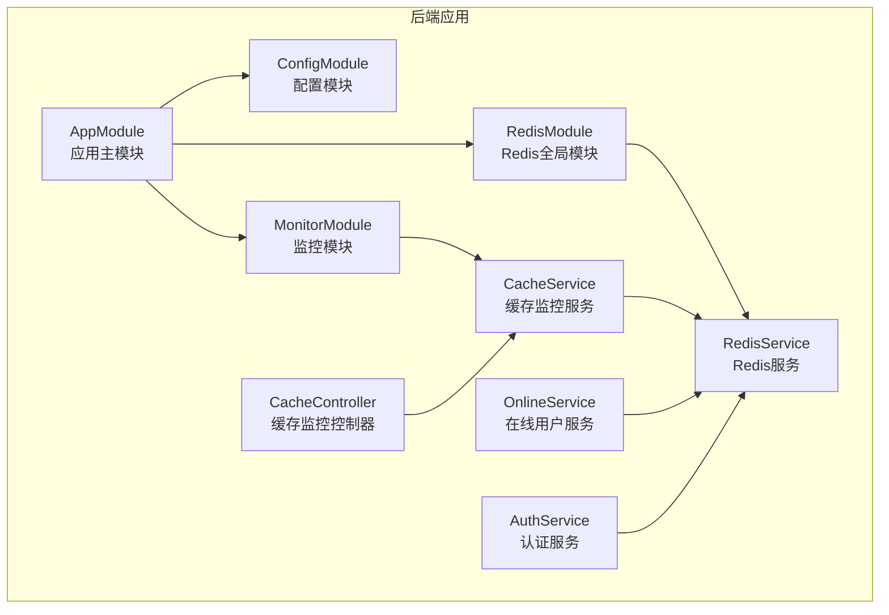
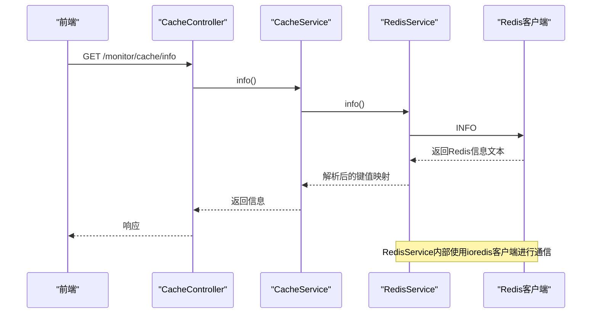
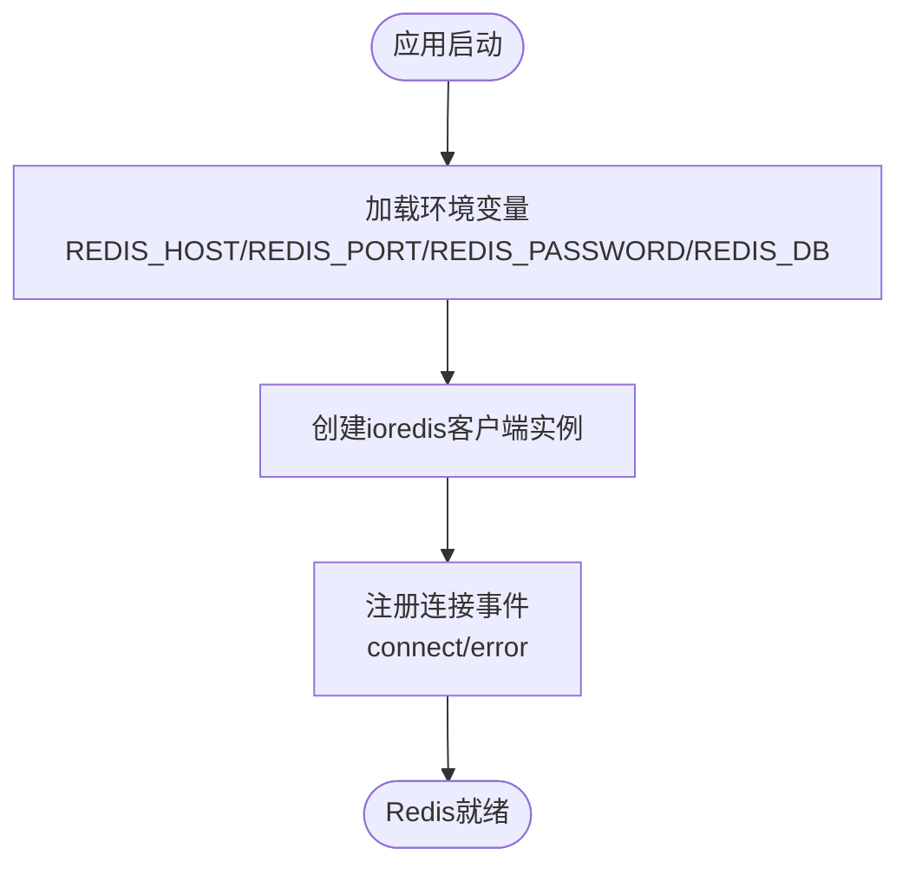
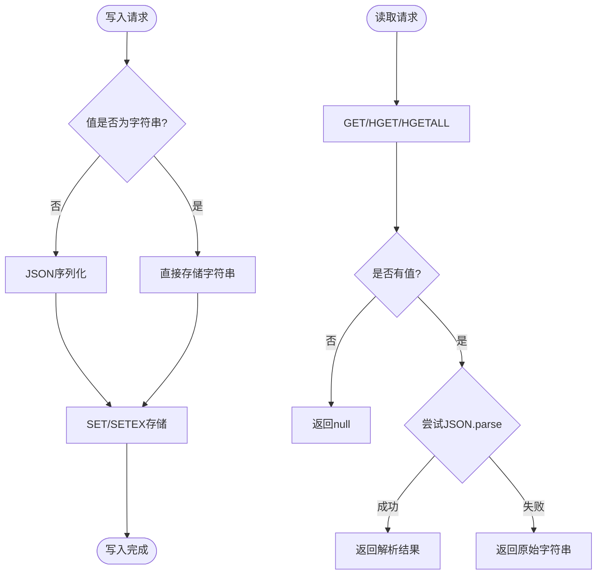
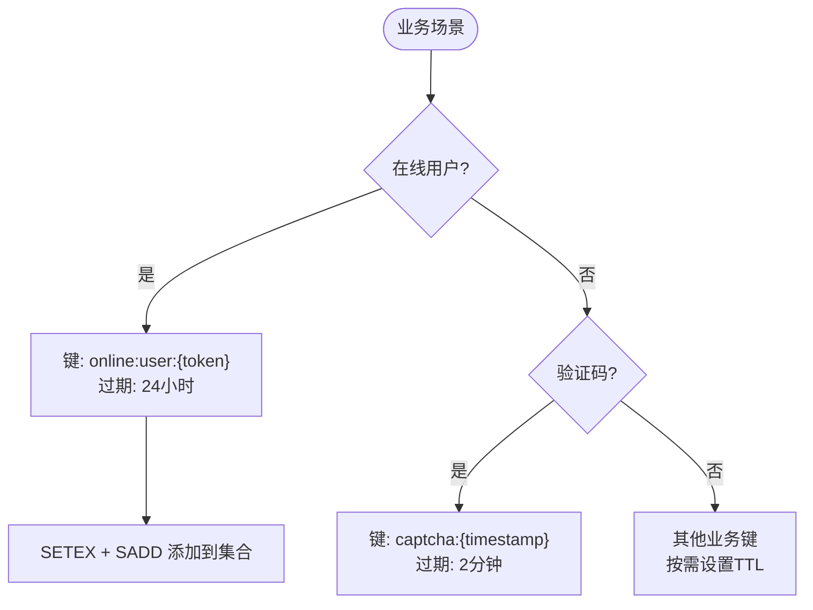
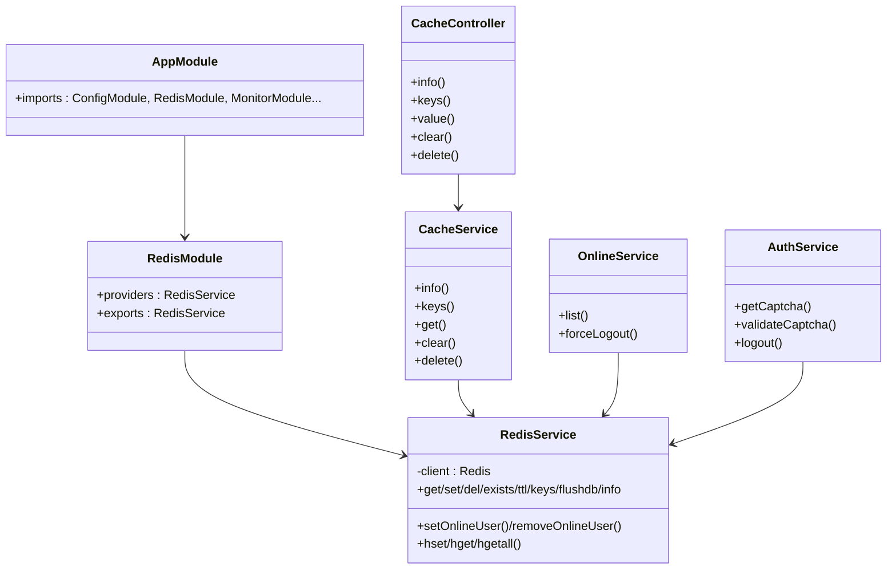

# Redis缓存配置

<cite>
**本文档引用的文件**
- [redis.module.ts](file://apps/backend/src/cache/redis.module.ts)
- [redis.service.ts](file://apps/backend/src/cache/redis.service.ts)
- [env.config.ts](file://apps/backend/src/config/env.config.ts)
- [app.module.ts](file://apps/backend/src/app.module.ts)
- [cache.controller.ts](file://apps/backend/src/modules/monitor/cache/cache.controller.ts)
- [cache.service.ts](file://apps/backend/src/modules/monitor/cache/cache.service.ts)
- [online.service.ts](file://apps/backend/src/modules/monitor/online/online.service.ts)
- [auth.service.ts](file://apps/backend/src/auth/auth.service.ts)
- [.env 示例](file://README.md)
</cite>

## 目录
1. [简介](#简介)
2. [项目结构](#项目结构)
3. [核心组件](#核心组件)
4. [架构总览](#架构总览)
5. [详细组件分析](#详细组件分析)
6. [依赖关系分析](#依赖关系分析)
7. [性能考虑](#性能考虑)
8. [故障排查指南](#故障排查指南)
9. [结论](#结论)
10. [附录](#附录)

## 简介
本文件面向Redis缓存配置与使用，结合项目现有实现，系统性说明：
- Redis连接配置（主机、端口、密码、数据库）
- 连接池、超时与重连机制现状
- 序列化与数据格式转换策略
- 缓存键命名规范与过期策略
- 在项目中的典型应用场景（会话存储、验证码缓存、在线用户管理、缓存监控）
- 性能优化建议与监控方法

## 项目结构
Redis相关能力集中在后端应用的cache模块，并通过全局模块注入到整个应用生命周期中；监控模块通过RedisService暴露Redis能力供前端调用。

**图表来源**
- [app.module.ts:18-38](file://apps/backend/src/app.module.ts#L18-L38)
- [redis.module.ts:4-8](file://apps/backend/src/cache/redis.module.ts#L4-L8)
- [redis.service.ts:5-27](file://apps/backend/src/cache/redis.service.ts#L5-L27)
- [cache.service.ts:5-6](file://apps/backend/src/modules/monitor/cache/cache.service.ts#L5-L6)
- [cache.controller.ts:10-11](file://apps/backend/src/modules/monitor/cache/cache.controller.ts#L10-L11)
- [online.service.ts:6-7](file://apps/backend/src/modules/monitor/online/online.service.ts#L6-L7)
- [auth.service.ts:120-128](file://apps/backend/src/auth/auth.service.ts#L120-L128)

**章节来源**
- [app.module.ts:18-38](file://apps/backend/src/app.module.ts#L18-L38)
- [redis.module.ts:4-8](file://apps/backend/src/cache/redis.module.ts#L4-L8)

## 核心组件
- RedisModule：将RedisService声明为全局单例，便于在整个应用范围内注入使用。
- RedisService：封装ioredis客户端，提供基础读写、存在性检查、TTL查询、键扫描、清库、INFO解析、在线用户集合管理以及哈希读写等能力。
- 配置模块：通过ConfigModule加载环境变量，提供redisConfig配置对象。
- 监控模块：CacheController与CacheService通过RedisService提供Redis信息、键列表、值读取、清库、删除等运维能力。
- 在线用户模块：OnlineService通过RedisService维护在线用户集合，实现强制下线等功能。
- 认证模块：AuthService使用Redis缓存验证码，验证后删除键，实现一次性验证码。

**章节来源**
- [redis.module.ts:4-8](file://apps/backend/src/cache/redis.module.ts#L4-L8)
- [redis.service.ts:5-27](file://apps/backend/src/cache/redis.service.ts#L5-L27)
- [env.config.ts:28-33](file://apps/backend/src/config/env.config.ts#L28-L33)
- [cache.controller.ts:10-11](file://apps/backend/src/modules/monitor/cache/cache.controller.ts#L10-L11)
- [cache.service.ts:5-6](file://apps/backend/src/modules/monitor/cache/cache.service.ts#L5-L6)
- [online.service.ts:6-7](file://apps/backend/src/modules/monitor/online/online.service.ts#L6-L7)
- [auth.service.ts:110-128](file://apps/backend/src/auth/auth.service.ts#L110-L128)

## 架构总览
Redis在本项目中的定位是：
- 作为统一缓存层，支撑验证码、在线用户、临时数据等场景
- 通过全局模块注入，被认证、监控、在线用户等多个模块复用
- 提供基础的键值操作与集合操作，满足会话与轻量数据存储需求

**图表来源**
- [cache.controller.ts:13-18](file://apps/backend/src/modules/monitor/cache/cache.controller.ts#L13-L18)
- [cache.service.ts:8-10](file://apps/backend/src/modules/monitor/cache/cache.service.ts#L8-L10)
- [redis.service.ts:70-80](file://apps/backend/src/cache/redis.service.ts#L70-L80)

## 详细组件分析

### Redis连接配置
- 连接参数来源于环境变量，支持主机、端口、密码、数据库索引。
- 默认值：主机本地回环、端口标准端口、无密码、数据库索引0。
- 配置加载：通过ConfigModule加载env.config.ts中的redisConfig对象。
- 连接事件：监听connect与error事件，便于诊断连接状态。

**图表来源**
- [env.config.ts:28-33](file://apps/backend/src/config/env.config.ts#L28-L33)
- [redis.service.ts:8-23](file://apps/backend/src/cache/redis.service.ts#L8-L23)

**章节来源**
- [env.config.ts:28-33](file://apps/backend/src/config/env.config.ts#L28-L33)
- [redis.service.ts:8-23](file://apps/backend/src/cache/redis.service.ts#L8-L23)
- [.env 示例:143-146](file://README.md#L143-L146)

### 连接池、超时与重连机制
- 当前实现未显式配置连接池大小、超时时间、重连策略等高级参数，使用ioredis默认行为。
- 建议：在生产环境中明确设置连接池大小、超时、重试间隔与最大重试次数，以提升稳定性与可观测性。

**章节来源**
- [redis.service.ts:8-14](file://apps/backend/src/cache/redis.service.ts#L8-L14)

### 序列化与数据格式转换
- 写入时：若值为字符串则直接存储，否则JSON序列化；支持set方法传入可选TTL秒数。
- 读取时：优先尝试JSON反序列化，失败则返回原始字符串；hget/hgetall对哈希字段同样进行JSON解析。
- 键值对存储：使用SET/SETEX；哈希存储：使用HSET/HGET/HGETALL。

**图表来源**
- [redis.service.ts:39-47](file://apps/backend/src/cache/redis.service.ts#L39-L47)
- [redis.service.ts:29-37](file://apps/backend/src/cache/redis.service.ts#L29-L37)
- [redis.service.ts:102-127](file://apps/backend/src/cache/redis.service.ts#L102-L127)

**章节来源**
- [redis.service.ts:29-47](file://apps/backend/src/cache/redis.service.ts#L29-L47)
- [redis.service.ts:102-127](file://apps/backend/src/cache/redis.service.ts#L102-L127)

### 缓存键命名规范与过期策略
- 在线用户键：online:user:{token}（SETEX带过期），online:users（集合，成员为token）。
- 验证码键：captcha:{timestamp}（SETEX短 TTL）。
- 其他键：可按功能域前缀区分，如业务键建议加上业务前缀，避免冲突。
- 过期策略：在线用户默认一天；验证码默认两分钟；其他场景按业务需要设置TTL。

**图表来源**
- [redis.service.ts:83-99](file://apps/backend/src/cache/redis.service.ts#L83-L99)
- [auth.service.ts:116-118](file://apps/backend/src/auth/auth.service.ts#L116-L118)

**章节来源**
- [redis.service.ts:83-99](file://apps/backend/src/cache/redis.service.ts#L83-L99)
- [auth.service.ts:116-128](file://apps/backend/src/auth/auth.service.ts#L116-L128)

### 应用场景
- 会话存储：通过在线用户集合与SETEX键实现会话有效期管理，支持强制下线。
- 缓存数据：验证码缓存，验证后立即删除，降低数据库压力。
- 分布式锁：当前实现未包含分布式锁逻辑，如需可基于SET key value NX EX ttl扩展。
- 缓存监控：通过监控模块提供Redis信息、键扫描、值读取、清库、删除等运维能力。

**章节来源**
- [redis.service.ts:83-99](file://apps/backend/src/cache/redis.service.ts#L83-L99)
- [auth.service.ts:110-128](file://apps/backend/src/auth/auth.service.ts#L110-L128)
- [cache.controller.ts:13-48](file://apps/backend/src/modules/monitor/cache/cache.controller.ts#L13-L48)
- [cache.service.ts:8-28](file://apps/backend/src/modules/monitor/cache/cache.service.ts#L8-L28)
- [online.service.ts:9-30](file://apps/backend/src/modules/monitor/online/online.service.ts#L9-L30)

## 依赖关系分析
- AppModule导入RedisModule，使RedisService成为全局可用的服务。
- MonitorModule中的CacheController与CacheService依赖RedisService。
- OnlineService与AuthService也直接依赖RedisService。
- 配置模块通过env.config.ts提供redisConfig，供RedisService构造客户端。

**图表来源**
- [app.module.ts:18-38](file://apps/backend/src/app.module.ts#L18-L38)
- [redis.module.ts:4-8](file://apps/backend/src/cache/redis.module.ts#L4-L8)
- [redis.service.ts:5-27](file://apps/backend/src/cache/redis.service.ts#L5-L27)
- [cache.controller.ts:10-11](file://apps/backend/src/modules/monitor/cache/cache.controller.ts#L10-L11)
- [cache.service.ts:5-6](file://apps/backend/src/modules/monitor/cache/cache.service.ts#L5-L6)
- [online.service.ts:6-7](file://apps/backend/src/modules/monitor/online/online.service.ts#L6-L7)
- [auth.service.ts:120-133](file://apps/backend/src/auth/auth.service.ts#L120-L133)

**章节来源**
- [app.module.ts:18-38](file://apps/backend/src/app.module.ts#L18-L38)
- [redis.module.ts:4-8](file://apps/backend/src/cache/redis.module.ts#L4-L8)
- [redis.service.ts:5-27](file://apps/backend/src/cache/redis.service.ts#L5-L27)
- [cache.controller.ts:10-11](file://apps/backend/src/modules/monitor/cache/cache.controller.ts#L10-L11)
- [cache.service.ts:5-6](file://apps/backend/src/modules/monitor/cache/cache.service.ts#L5-L6)
- [online.service.ts:6-7](file://apps/backend/src/modules/monitor/online/online.service.ts#L6-L7)
- [auth.service.ts:120-133](file://apps/backend/src/auth/auth.service.ts#L120-L133)

## 性能考虑
- 连接池与超时：建议显式配置连接池大小、命令超时、阻塞超时与重试策略，避免默认配置导致的资源争用与延迟抖动。
- 序列化开销：大量对象序列化/反序列化会带来CPU与内存压力，建议：
  - 仅对非字符串值进行JSON序列化；
  - 对热点数据可考虑更高效的序列化方案（如MessagePack）。
- 键设计：使用前缀+命名空间隔离键，避免键冲突；合理设置TTL，防止内存泄漏。
- 批量操作：批量读写时尽量使用管道（pipeline）减少RTT。
- 监控指标：关注连接数、命中率、内存使用、慢查询、错误计数等关键指标。

[本节为通用性能建议，不直接分析具体文件]

## 故障排查指南
- 连接失败：检查环境变量配置与网络连通性；查看connect/error事件日志输出。
- 读取异常：确认键是否存在、值是否为有效JSON；注意读取返回null的情况。
- 在线用户异常：核对online:user:{token}与online:users集合的状态一致性；确保TTL设置合理。
- 清库与删除：谨慎使用清库操作，建议先keys扫描再按需删除；删除后确认集合内成员已移除。

**章节来源**
- [redis.service.ts:16-22](file://apps/backend/src/cache/redis.service.ts#L16-L22)
- [redis.service.ts:53-56](file://apps/backend/src/cache/redis.service.ts#L53-L56)
- [redis.service.ts:83-99](file://apps/backend/src/cache/redis.service.ts#L83-L99)

## 结论
本项目通过全局RedisModule与RedisService提供了简洁而实用的Redis能力，覆盖验证码、在线用户、缓存监控等关键场景。建议在生产环境中完善连接池与超时配置、优化序列化策略、加强键命名规范与监控告警，以进一步提升稳定性与性能。

[本节为总结性内容，不直接分析具体文件]

## 附录

### 环境变量与默认值
- REDIS_HOST：Redis主机，默认本地回环
- REDIS_PORT：Redis端口，默认标准端口
- REDIS_PASSWORD：Redis密码，默认无密码
- REDIS_DB：Redis数据库索引，默认0

**章节来源**
- [.env 示例:143-146](file://README.md#L143-L146)
- [env.config.ts:28-33](file://apps/backend/src/config/env.config.ts#L28-L33)
- [redis.service.ts:9-14](file://apps/backend/src/cache/redis.service.ts#L9-L14)

### 关键API与职责
- RedisService：连接管理、键值操作、集合操作、哈希操作、在线用户管理、INFO解析
- CacheController/CacheService：对外提供缓存监控接口（信息、键、值、清库、删除）
- OnlineService：在线用户列表与强制下线
- AuthService：验证码缓存与验证

**章节来源**
- [redis.service.ts:29-127](file://apps/backend/src/cache/redis.service.ts#L29-L127)
- [cache.controller.ts:13-48](file://apps/backend/src/modules/monitor/cache/cache.controller.ts#L13-L48)
- [cache.service.ts:8-28](file://apps/backend/src/modules/monitor/cache/cache.service.ts#L8-L28)
- [online.service.ts:9-30](file://apps/backend/src/modules/monitor/online/online.service.ts#L9-L30)
- [auth.service.ts:110-133](file://apps/backend/src/auth/auth.service.ts#L110-L133)