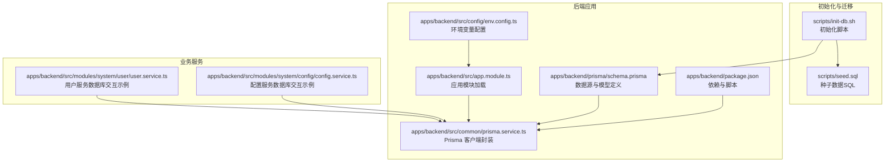
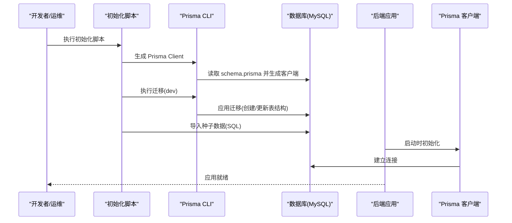
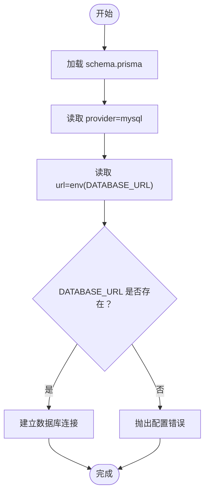
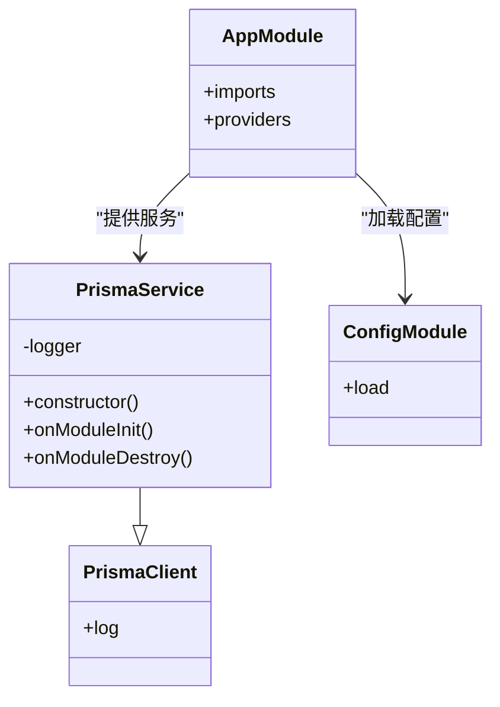
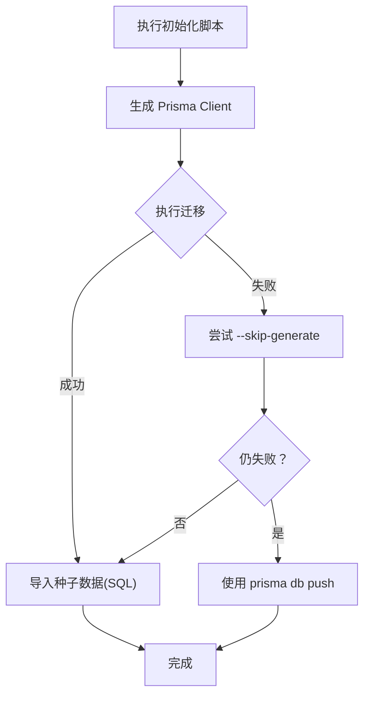
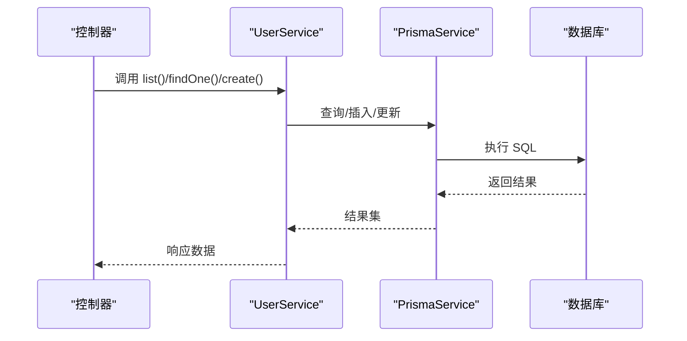
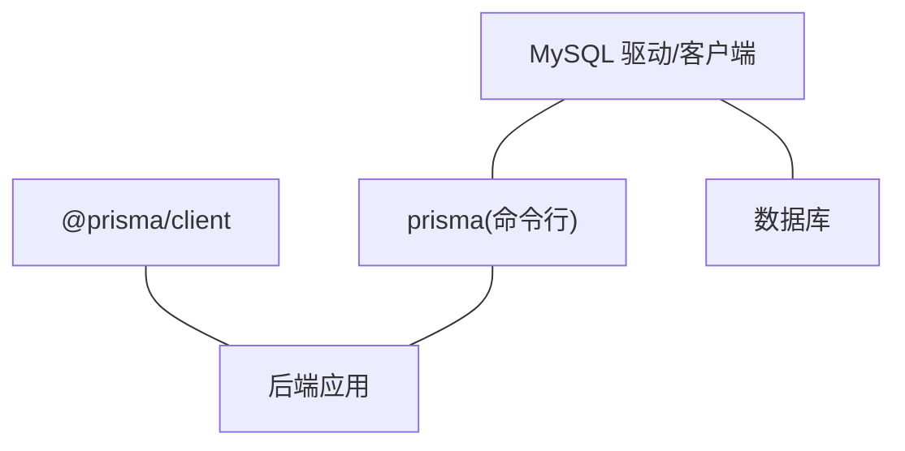
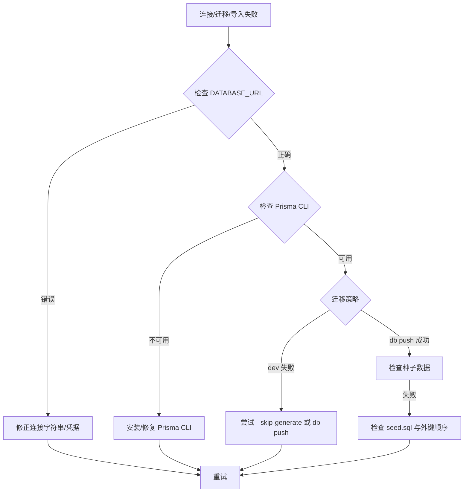

# 数据库配置

<cite>
**本文档引用的文件**
- [schema.prisma](file://apps/backend/prisma/schema.prisma)
- [prisma.service.ts](file://apps/backend/src/common/prisma.service.ts)
- [env.config.ts](file://apps/backend/src/config/env.config.ts)
- [init-db.sh](file://scripts/init-db.sh)
- [seed.sql](file://scripts/seed.sql)
- [package.json](file://apps/backend/package.json)
- [app.module.ts](file://apps/backend/src/app.module.ts)
- [user.service.ts](file://apps/backend/src/modules/system/user/user.service.ts)
- [config.service.ts](file://apps/backend/src/modules/system/config/config.service.ts)
- [exception.filter.ts](file://apps/backend/src/common/exception.filter.ts)
- [oper-log.interceptor.ts](file://apps/backend/src/common/oper-log.interceptor.ts)
</cite>

## 目录
1. [简介](#简介)
2. [项目结构](#项目结构)
3. [核心组件](#核心组件)
4. [架构总览](#架构总览)
5. [详细组件分析](#详细组件分析)
6. [依赖关系分析](#依赖关系分析)
7. [性能考虑](#性能考虑)
8. [故障排除指南](#故障排除指南)
9. [结论](#结论)
10. [附录](#附录)

## 简介
本文件面向数据库配置与运维人员，系统性说明本项目中基于 Prisma ORM 的数据库配置方法，涵盖：
- 数据库连接字符串格式与环境变量注入
- 连接池与性能相关配置要点
- 不同数据库类型（MySQL）的连接差异与迁移策略
- Prisma 客户端初始化流程与配置项
- 数据库迁移与种子数据配置方法
- 连接故障排除与监控手段

## 项目结构
与数据库配置直接相关的文件主要分布在后端应用的 Prisma 配置、环境变量配置、初始化脚本与服务层中。

**图表来源**
- [schema.prisma:1-8](file://apps/backend/prisma/schema.prisma#L1-L8)
- [prisma.service.ts:1-22](file://apps/backend/src/common/prisma.service.ts#L1-L22)
- [env.config.ts:24-26](file://apps/backend/src/config/env.config.ts#L24-L26)
- [app.module.ts:18-38](file://apps/backend/src/app.module.ts#L18-L38)
- [package.json:1-50](file://apps/backend/package.json#L1-L50)
- [init-db.sh:1-85](file://scripts/init-db.sh#L1-L85)
- [seed.sql:1-186](file://scripts/seed.sql#L1-L186)
- [user.service.ts:1-144](file://apps/backend/src/modules/system/user/user.service.ts#L1-L144)
- [config.service.ts:1-56](file://apps/backend/src/modules/system/config/config.service.ts#L1-L56)

**章节来源**
- [schema.prisma:1-8](file://apps/backend/prisma/schema.prisma#L1-L8)
- [prisma.service.ts:1-22](file://apps/backend/src/common/prisma.service.ts#L1-L22)
- [env.config.ts:24-26](file://apps/backend/src/config/env.config.ts#L24-L26)
- [app.module.ts:18-38](file://apps/backend/src/app.module.ts#L18-L38)
- [package.json:1-50](file://apps/backend/package.json#L1-L50)
- [init-db.sh:1-85](file://scripts/init-db.sh#L1-L85)
- [seed.sql:1-186](file://scripts/seed.sql#L1-L186)
- [user.service.ts:1-144](file://apps/backend/src/modules/system/user/user.service.ts#L1-L144)
- [config.service.ts:1-56](file://apps/backend/src/modules/system/config/config.service.ts#L1-L56)

## 核心组件
- 数据源与模型定义：在 Prisma Schema 中声明数据源 provider 为 MySQL，并通过环境变量注入连接字符串。
- Prisma 客户端封装：继承 PrismaClient，在模块初始化时建立连接并在销毁时断开连接。
- 环境变量配置：集中管理 DATABASE_URL 等配置，供 Prisma 读取。
- 初始化脚本：自动化执行 Prisma 生成、迁移与种子数据导入。
- 业务服务：通过 Prisma Service 访问数据库，体现典型的数据访问模式。

**章节来源**
- [schema.prisma:5-8](file://apps/backend/prisma/schema.prisma#L5-L8)
- [prisma.service.ts:8-21](file://apps/backend/src/common/prisma.service.ts#L8-L21)
- [env.config.ts:24-26](file://apps/backend/src/config/env.config.ts#L24-L26)
- [init-db.sh:43-79](file://scripts/init-db.sh#L43-L79)

## 架构总览
下图展示了从应用启动到数据库连接、迁移与种子数据导入的整体流程。

**图表来源**
- [init-db.sh:43-79](file://scripts/init-db.sh#L43-L79)
- [schema.prisma:1-8](file://apps/backend/prisma/schema.prisma#L1-L8)
- [prisma.service.ts:14-16](file://apps/backend/src/common/prisma.service.ts#L14-L16)

**章节来源**
- [init-db.sh:43-79](file://scripts/init-db.sh#L43-L79)
- [schema.prisma:1-8](file://apps/backend/prisma/schema.prisma#L1-L8)
- [prisma.service.ts:14-16](file://apps/backend/src/common/prisma.service.ts#L14-L16)

## 详细组件分析

### Prisma 数据源与连接字符串
- 数据源声明：provider 指定为 mysql；连接字符串通过环境变量 DATABASE_URL 注入。
- 环境变量来源：在环境配置模块中集中定义 DATABASE_URL。
- 迁移与生成：初始化脚本调用 Prisma CLI 执行 generate 与 migrate dev/db push 等命令。

**图表来源**
- [schema.prisma:5-8](file://apps/backend/prisma/schema.prisma#L5-L8)
- [env.config.ts:24-26](file://apps/backend/src/config/env.config.ts#L24-L26)

**章节来源**
- [schema.prisma:5-8](file://apps/backend/prisma/schema.prisma#L5-L8)
- [env.config.ts:24-26](file://apps/backend/src/config/env.config.ts#L24-L26)

### Prisma 客户端初始化与生命周期
- 客户端封装：继承 PrismaClient，构造函数可传入日志级别等选项。
- 生命周期钩子：在模块初始化时执行连接，在模块销毁时断开连接。
- 应用集成：AppModule 加载 ConfigModule 并注入全局配置，PrismaService 作为全局提供者被各模块注入使用。

**图表来源**
- [prisma.service.ts:5-21](file://apps/backend/src/common/prisma.service.ts#L5-L21)
- [app.module.ts:18-38](file://apps/backend/src/app.module.ts#L18-L38)

**章节来源**
- [prisma.service.ts:8-21](file://apps/backend/src/common/prisma.service.ts#L8-L21)
- [app.module.ts:18-38](file://apps/backend/src/app.module.ts#L18-L38)

### 数据库迁移与种子数据
- 迁移策略：使用 Prisma migrate dev 进行开发环境迁移；若失败则尝试跳过生成继续迁移。
- 结构同步：当无迁移可用时，使用 prisma db push 快速同步结构。
- 种子数据：优先执行 SQL 脚本导入；若不存在则回退到结构同步。

**图表来源**
- [init-db.sh:43-79](file://scripts/init-db.sh#L43-L79)
- [seed.sql:1-186](file://scripts/seed.sql#L1-L186)

**章节来源**
- [init-db.sh:43-79](file://scripts/init-db.sh#L43-L79)
- [seed.sql:1-186](file://scripts/seed.sql#L1-L186)

### 不同数据库类型的连接差异（MySQL）
- 当前 schema.prisma 已指定 provider 为 mysql，连接字符串由 DATABASE_URL 提供。
- 若需切换至其他数据库类型（如 PostgreSQL），需：
  - 在 schema.prisma 中将 provider 修改为目标数据库类型
  - 更新 DATABASE_URL 为对应数据库的连接字符串格式
  - 确保相应驱动已安装（例如 PostgreSQL 需要对应的驱动）

注意：本仓库未包含 PostgreSQL 的 schema 示例，实际切换时请参考 Prisma 官方文档与数据库驱动要求。

**章节来源**
- [schema.prisma:5-8](file://apps/backend/prisma/schema.prisma#L5-L8)
- [package.json:37-37](file://apps/backend/package.json#L37-L37)

### 连接池与性能相关配置
- Prisma 默认行为：在当前实现中未显式配置连接池参数（如连接池大小、空闲超时等）。
- 实践建议：
  - 在生产环境中，建议通过 Prisma 引擎参数或数据库驱动参数进行连接池调优
  - 关注数据库侧的最大连接数限制，避免超过数据库许可
  - 结合应用并发量与数据库性能指标，逐步调整连接池大小与超时参数

说明：本仓库未提供显式的连接池配置片段，以上为通用实践建议。

**章节来源**
- [prisma.service.ts:8-11](file://apps/backend/src/common/prisma.service.ts#L8-L11)

### 数据库访问示例（用户服务）
用户服务展示了典型的数据库访问模式：查询、分页、更新与删除等操作均通过 Prisma Service 执行。

**图表来源**
- [user.service.ts:18-46](file://apps/backend/src/modules/system/user/user.service.ts#L18-L46)
- [prisma.service.ts:1-22](file://apps/backend/src/common/prisma.service.ts#L1-L22)

**章节来源**
- [user.service.ts:18-46](file://apps/backend/src/modules/system/user/user.service.ts#L18-L46)
- [prisma.service.ts:1-22](file://apps/backend/src/common/prisma.service.ts#L1-L22)

## 依赖关系分析
- Prisma 依赖：后端应用依赖 @prisma/client 与 prisma 包，用于生成客户端与执行迁移。
- 数据库驱动：当前 schema.prisma 指向 mysql，需确保相应驱动可用。
- 初始化脚本：依赖 Prisma CLI 与数据库客户端工具（如 mysql）。

**图表来源**
- [package.json:26-37](file://apps/backend/package.json#L26-L37)
- [schema.prisma:5-8](file://apps/backend/prisma/schema.prisma#L5-L8)
- [init-db.sh:25-25](file://scripts/init-db.sh#L25-L25)

**章节来源**
- [package.json:26-37](file://apps/backend/package.json#L26-L37)
- [schema.prisma:5-8](file://apps/backend/prisma/schema.prisma#L5-L8)
- [init-db.sh:25-25](file://scripts/init-db.sh#L25-L25)

## 性能考虑
- 连接池调优：根据应用并发与数据库承载能力，合理设置连接池大小与超时时间。
- 查询优化：对高频查询添加索引，避免 N+1 查询，必要时使用事务批量写入。
- 监控与日志：启用 Prisma 日志与应用级操作日志拦截，结合数据库慢查询日志定位瓶颈。
- 缓存策略：结合 Redis 缓存热点数据，降低数据库压力。

说明：本仓库未提供专门的连接池配置片段，以上为通用性能建议。

**章节来源**
- [prisma.service.ts:8-11](file://apps/backend/src/common/prisma.service.ts#L8-L11)
- [oper-log.interceptor.ts:33-61](file://apps/backend/src/common/oper-log.interceptor.ts#L33-L61)

## 故障排除指南
- 连接字符串问题
  - 确认 DATABASE_URL 是否正确设置且指向 MySQL
  - 检查网络连通性与数据库凭据
- 迁移失败
  - 查看初始化脚本输出，确认 Prisma CLI 可用
  - 若 migrate dev 失败，尝试使用 --skip-generate 继续
  - 最终可使用 prisma db push 同步结构
- 种子数据导入
  - 确认 seed.sql 存在且具备正确的外键依赖顺序
  - 检查数据库字符集与排序规则是否匹配
- 错误处理与日志
  - 应用级异常统一通过全局过滤器处理
  - 操作日志拦截器会记录请求与响应信息，便于排查

**图表来源**
- [env.config.ts:24-26](file://apps/backend/src/config/env.config.ts#L24-L26)
- [init-db.sh:43-79](file://scripts/init-db.sh#L43-L79)
- [seed.sql:1-186](file://scripts/seed.sql#L1-L186)
- [exception.filter.ts:12-36](file://apps/backend/src/common/exception.filter.ts#L12-L36)

**章节来源**
- [env.config.ts:24-26](file://apps/backend/src/config/env.config.ts#L24-L26)
- [init-db.sh:43-79](file://scripts/init-db.sh#L43-L79)
- [seed.sql:1-186](file://scripts/seed.sql#L1-L186)
- [exception.filter.ts:12-36](file://apps/backend/src/common/exception.filter.ts#L12-L36)

## 结论
本项目的数据库配置以 Prisma 为核心，采用环境变量注入连接字符串的方式，配合初始化脚本完成客户端生成、迁移与种子数据导入。当前实现未显式配置连接池参数，建议在生产环境中结合数据库与应用负载进行连接池与查询性能调优，并完善监控与日志体系以提升可观测性与可维护性。

## 附录
- 数据库类型切换：将 schema.prisma 中 provider 切换为目标数据库类型，并更新 DATABASE_URL 与驱动
- 迁移与种子：优先使用迁移；若无迁移可用，使用 db push；种子数据优先使用 SQL 脚本

**章节来源**
- [schema.prisma:5-8](file://apps/backend/prisma/schema.prisma#L5-L8)
- [init-db.sh:43-79](file://scripts/init-db.sh#L43-L79)
- [seed.sql:1-186](file://scripts/seed.sql#L1-L186)