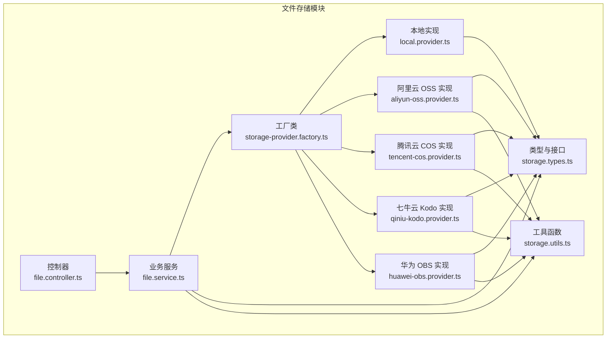
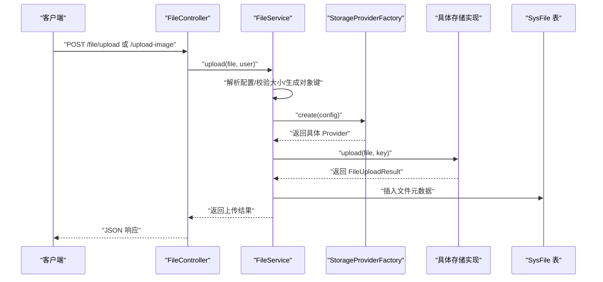
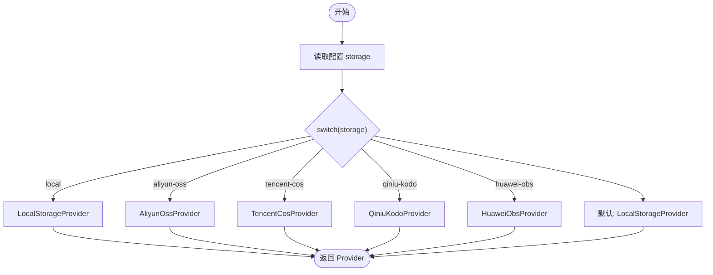
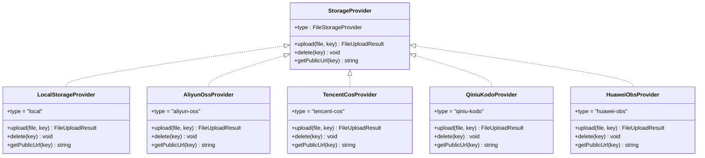
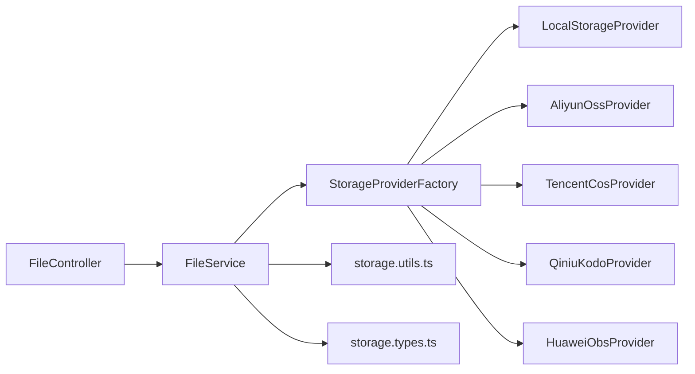

# 文件存储配置

<cite>
**本文引用的文件**
- [apps/backend/src/modules/file/storage/storage-provider.factory.ts](file://apps/backend/src/modules/file/storage/storage-provider.factory.ts)
- [apps/backend/src/modules/file/storage/storage.types.ts](file://apps/backend/src/modules/file/storage/storage.types.ts)
- [apps/backend/src/modules/file/storage/storage.utils.ts](file://apps/backend/src/modules/file/storage/storage.utils.ts)
- [apps/backend/src/modules/file/storage/local.provider.ts](file://apps/backend/src/modules/file/storage/local.provider.ts)
- [apps/backend/src/modules/file/storage/aliyun-oss.provider.ts](file://apps/backend/src/modules/file/storage/aliyun-oss.provider.ts)
- [apps/backend/src/modules/file/storage/tencent-cos.provider.ts](file://apps/backend/src/modules/file/storage/tencent-cos.provider.ts)
- [apps/backend/src/modules/file/storage/qiniu-kodo.provider.ts](file://apps/backend/src/modules/file/storage/qiniu-kodo.provider.ts)
- [apps/backend/src/modules/file/storage/huawei-obs.provider.ts](file://apps/backend/src/modules/file/storage/huawei-obs.provider.ts)
- [apps/backend/src/modules/file/file.service.ts](file://apps/backend/src/modules/file/file.service.ts)
- [apps/backend/src/modules/file/file.controller.ts](file://apps/backend/src/modules/file/file.controller.ts)
- [apps/backend/prisma/schema.prisma](file://apps/backend/prisma/schema.prisma)
</cite>

## 目录
1. [简介](#简介)
2. [项目结构](#项目结构)
3. [核心组件](#核心组件)
4. [架构总览](#架构总览)
5. [详细组件分析](#详细组件分析)
6. [依赖关系分析](#依赖关系分析)
7. [性能与安全考量](#性能与安全考量)
8. [故障排查指南](#故障排查指南)
9. [结论](#结论)
10. [附录：配置示例与最佳实践](#附录配置示例与最佳实践)

## 简介
本文件面向后端文件存储配置，覆盖本地存储与多家云存储提供商（阿里云 OSS、腾讯云 COS、七牛云 Kodo、华为 OBS）的配置方法、参数说明、选择逻辑与工厂模式实现、访问 URL 与 CDN 设置、上传限制与安全策略，并提供可直接对照的配置示例与最佳实践。

## 项目结构
文件存储模块位于后端应用中，采用“接口 + 工厂 + 多实现”的分层设计：
- 接口与类型定义：统一存储提供者接口、配置结构、返回结果等
- 工厂类：根据配置动态选择具体存储实现
- 各云厂商实现：封装各自 SDK 的上传、删除、URL 生成
- 工具函数：通用的键名生成、URL 构建、配置校验与规范化
- 业务服务：读取系统配置、执行上传、预览、删除、列表查询
- 控制器：对外暴露配置读写、上传、预览等接口

图表来源
- [apps/backend/src/modules/file/storage/storage.types.ts:1-43](file://apps/backend/src/modules/file/storage/storage.types.ts#L1-L43)
- [apps/backend/src/modules/file/storage/storage.utils.ts:1-62](file://apps/backend/src/modules/file/storage/storage.utils.ts#L1-L62)
- [apps/backend/src/modules/file/storage/storage-provider.factory.ts:1-25](file://apps/backend/src/modules/file/storage/storage-provider.factory.ts#L1-L25)
- [apps/backend/src/modules/file/storage/local.provider.ts:1-46](file://apps/backend/src/modules/file/storage/local.provider.ts#L1-L46)
- [apps/backend/src/modules/file/storage/aliyun-oss.provider.ts:1-51](file://apps/backend/src/modules/file/storage/aliyun-oss.provider.ts#L1-L51)
- [apps/backend/src/modules/file/storage/tencent-cos.provider.ts:1-74](file://apps/backend/src/modules/file/storage/tencent-cos.provider.ts#L1-L74)
- [apps/backend/src/modules/file/storage/qiniu-kodo.provider.ts:1-68](file://apps/backend/src/modules/file/storage/qiniu-kodo.provider.ts#L1-L68)
- [apps/backend/src/modules/file/storage/huawei-obs.provider.ts:1-93](file://apps/backend/src/modules/file/storage/huawei-obs.provider.ts#L1-L93)
- [apps/backend/src/modules/file/file.service.ts:1-310](file://apps/backend/src/modules/file/file.service.ts#L1-L310)
- [apps/backend/src/modules/file/file.controller.ts:1-100](file://apps/backend/src/modules/file/file.controller.ts#L1-L100)

章节来源
- [apps/backend/src/modules/file/storage/storage.types.ts:1-43](file://apps/backend/src/modules/file/storage/storage.types.ts#L1-L43)
- [apps/backend/src/modules/file/storage/storage-provider.factory.ts:1-25](file://apps/backend/src/modules/file/storage/storage-provider.factory.ts#L1-L25)
- [apps/backend/src/modules/file/file.controller.ts:1-100](file://apps/backend/src/modules/file/file.controller.ts#L1-L100)

## 核心组件
- 存储提供者接口与类型
  - 统一的存储提供者接口包含类型标识、上传、删除、生成公开 URL 方法
  - 配置结构包含存储类型、本地上传目录、最大文件/图片大小、区域、桶、密钥、端点、前缀、公开 URL、HTTPS 标记等
  - 返回结果包含 URL、文件名、对象键、大小、存储类型
- 工具函数
  - 生成存储文件名、生成云端对象键（含日期路径与随机名）、规范化原始文件名、构建公开 URL、校验云配置、标准化存储类型
- 工厂类
  - 根据配置 storage 字段选择具体实现，默认为本地存储
- 业务服务
  - 从系统配置表读取与合并环境变量，支持更新配置、上传文件、上传图片、预览、删除、列表查询
  - 上传时按存储类型生成对象键，调用对应提供者完成上传并持久化元数据
- 控制器
  - 提供配置读取/更新、文件列表、详情、删除、上传（文件/图片）、预览下载接口

章节来源
- [apps/backend/src/modules/file/storage/storage.types.ts:1-43](file://apps/backend/src/modules/file/storage/storage.types.ts#L1-L43)
- [apps/backend/src/modules/file/storage/storage.utils.ts:1-62](file://apps/backend/src/modules/file/storage/storage.utils.ts#L1-L62)
- [apps/backend/src/modules/file/storage/storage-provider.factory.ts:1-25](file://apps/backend/src/modules/file/storage/storage-provider.factory.ts#L1-L25)
- [apps/backend/src/modules/file/file.service.ts:1-310](file://apps/backend/src/modules/file/file.service.ts#L1-L310)
- [apps/backend/src/modules/file/file.controller.ts:1-100](file://apps/backend/src/modules/file/file.controller.ts#L1-L100)

## 架构总览
文件上传处理流程如下：

图表来源
- [apps/backend/src/modules/file/file.controller.ts:77-91](file://apps/backend/src/modules/file/file.controller.ts#L77-L91)
- [apps/backend/src/modules/file/file.service.ts:150-209](file://apps/backend/src/modules/file/file.service.ts#L150-L209)
- [apps/backend/src/modules/file/storage/storage-provider.factory.ts:8-23](file://apps/backend/src/modules/file/storage/storage-provider.factory.ts#L8-L23)

章节来源
- [apps/backend/src/modules/file/file.controller.ts:1-100](file://apps/backend/src/modules/file/file.controller.ts#L1-L100)
- [apps/backend/src/modules/file/file.service.ts:150-209](file://apps/backend/src/modules/file/file.service.ts#L150-L209)
- [apps/backend/src/modules/file/storage/storage-provider.factory.ts:1-25](file://apps/backend/src/modules/file/storage/storage-provider.factory.ts#L1-L25)

## 详细组件分析

### 工厂模式与选择逻辑
- 工厂根据配置中的 storage 字段选择实现：
  - ali-yun OSS、tencent-COS、qiniu-Kodo、huawei-OBS、local
  - 默认回退到本地存储
- 选择逻辑简单明确，便于扩展新提供商

图表来源
- [apps/backend/src/modules/file/storage/storage-provider.factory.ts:8-23](file://apps/backend/src/modules/file/storage/storage-provider.factory.ts#L8-L23)

章节来源
- [apps/backend/src/modules/file/storage/storage-provider.factory.ts:1-25](file://apps/backend/src/modules/file/storage/storage-provider.factory.ts#L1-L25)

### 类型与接口
- 存储提供者接口包含：
  - type：存储类型常量
  - upload(file, key)：上传并返回结果
  - delete(key)：删除对象
  - getPublicUrl(key)：生成公开访问 URL
- 配置结构 FileStorageConfig 包含：
  - storage、uploadDir、maxImageSize、maxFileSize、region、bucket、accessKeyId、accessKeySecret、endpoint、prefix、publicUrl、secure
- 返回结果 FileUploadResult 包含：
  - url、filename、key、size、storage

图表来源
- [apps/backend/src/modules/file/storage/storage.types.ts:33-38](file://apps/backend/src/modules/file/storage/storage.types.ts#L33-L38)
- [apps/backend/src/modules/file/storage/local.provider.ts:6-44](file://apps/backend/src/modules/file/storage/local.provider.ts#L6-L44)
- [apps/backend/src/modules/file/storage/aliyun-oss.provider.ts:6-49](file://apps/backend/src/modules/file/storage/aliyun-oss.provider.ts#L6-L49)
- [apps/backend/src/modules/file/storage/tencent-cos.provider.ts:7-72](file://apps/backend/src/modules/file/storage/tencent-cos.provider.ts#L7-L72)
- [apps/backend/src/modules/file/storage/qiniu-kodo.provider.ts:7-54](file://apps/backend/src/modules/file/storage/qiniu-kodo.provider.ts#L7-L54)
- [apps/backend/src/modules/file/storage/huawei-obs.provider.ts:8-91](file://apps/backend/src/modules/file/storage/huawei-obs.provider.ts#L8-L91)

章节来源
- [apps/backend/src/modules/file/storage/storage.types.ts:1-43](file://apps/backend/src/modules/file/storage/storage.types.ts#L1-L43)

### 本地存储实现
- 上传：确保本地目录存在，写入文件，返回公开 URL
- 删除：解析绝对路径并删除，带路径遍历防护
- URL：基于路由 /file/{filename} 生成

章节来源
- [apps/backend/src/modules/file/storage/local.provider.ts:1-46](file://apps/backend/src/modules/file/storage/local.provider.ts#L1-L46)

### 阿里云 OSS 实现
- 上传：使用 OSS SDK，支持自定义 endpoint 与 secure
- 删除：同 SDK 删除
- URL：优先使用配置 publicUrl，否则使用 OSS 默认域名

章节来源
- [apps/backend/src/modules/file/storage/aliyun-oss.provider.ts:1-51](file://apps/backend/src/modules/file/storage/aliyun-oss.provider.ts#L1-L51)

### 腾讯云 COS 实现
- 上传：使用 cos-nodejs-sdk-v5，通过 SecretId/SecretKey 认证
- 删除：同 SDK 删除
- URL：优先使用 publicUrl；若无则按 bucket.cos.region.myqcloud.com/key 生成

章节来源
- [apps/backend/src/modules/file/storage/tencent-cos.provider.ts:1-74](file://apps/backend/src/modules/file/storage/tencent-cos.provider.ts#L1-L74)

### 七牛云 Kodo 实现
- 上传：生成上传 Token，按区域选择 Zone，使用表单上传
- 删除：BucketManager 删除
- URL：优先使用 publicUrl

章节来源
- [apps/backend/src/modules/file/storage/qiniu-kodo.provider.ts:1-68](file://apps/backend/src/modules/file/storage/qiniu-kodo.provider.ts#L1-L68)

### 华为云 OBS 实现
- 上传：使用 esdk-obs-nodejs，要求 endpoint 必填
- 删除：同 SDK 删除
- URL：优先使用 publicUrl；若无则以 endpoint 作为基础拼接

章节来源
- [apps/backend/src/modules/file/storage/huawei-obs.provider.ts:1-93](file://apps/backend/src/modules/file/storage/huawei-obs.provider.ts#L1-L93)

### 工具函数与公共逻辑
- 键名生成：本地使用时间戳+随机数+扩展名；云端使用 prefix/datePath/时间戳+随机数+扩展名
- URL 构建：优先使用 publicUrl，否则按各云厂商规则或 endpoint 拼装
- 配置校验：云厂商需提供 region/bucket/accessKeyId/accessKeySecret
- 存储类型规范化：兼容 oss -> aliyun-oss

章节来源
- [apps/backend/src/modules/file/storage/storage.utils.ts:1-62](file://apps/backend/src/modules/file/storage/storage.utils.ts#L1-L62)

### 业务服务与控制器
- 配置读取与更新：从 sys_config 读取/写入，支持旧字段别名（如 ossRegion），并持久化到数据库
- 上传限制：按 maxFileSize 与 maxImageSize 校验；图片类型白名单校验
- 预览：非本地存储重定向至公开 URL；本地存储进行路径合法性检查后返回文件
- 删除：按文件记录的 storage 类型选择对应 Provider 执行删除，再标记软删除

章节来源
- [apps/backend/src/modules/file/file.service.ts:45-257](file://apps/backend/src/modules/file/file.service.ts#L45-L257)
- [apps/backend/src/modules/file/file.controller.ts:1-100](file://apps/backend/src/modules/file/file.controller.ts#L1-L100)
- [apps/backend/prisma/schema.prisma:182-207](file://apps/backend/prisma/schema.prisma#L182-L207)

## 依赖关系分析
- 控制器依赖服务；服务依赖工厂与工具；工厂依赖各存储实现；实现依赖各自 SDK 与工具
- 配置来源：sys_config 表 + 环境变量（具备向后兼容性）

图表来源
- [apps/backend/src/modules/file/file.controller.ts:1-100](file://apps/backend/src/modules/file/file.controller.ts#L1-L100)
- [apps/backend/src/modules/file/file.service.ts:1-310](file://apps/backend/src/modules/file/file.service.ts#L1-L310)
- [apps/backend/src/modules/file/storage/storage-provider.factory.ts:1-25](file://apps/backend/src/modules/file/storage/storage-provider.factory.ts#L1-L25)
- [apps/backend/src/modules/file/storage/storage.types.ts:1-43](file://apps/backend/src/modules/file/storage/storage.types.ts#L1-L43)
- [apps/backend/src/modules/file/storage/storage.utils.ts:1-62](file://apps/backend/src/modules/file/storage/storage.utils.ts#L1-L62)

章节来源
- [apps/backend/src/modules/file/file.controller.ts:1-100](file://apps/backend/src/modules/file/file.controller.ts#L1-L100)
- [apps/backend/src/modules/file/file.service.ts:1-310](file://apps/backend/src/modules/file/file.service.ts#L1-L310)

## 性能与安全考量
- 上传缓冲区：控制器使用内存存储，受 fileSize 限制；建议在高并发场景下评估内存占用
- 上传大小限制：服务端与控制器均有限制，避免超大文件导致内存压力
- 路径安全：本地存储在预览与删除时进行路径遍历校验，防止目录穿越
- CDN 与 HTTPS：通过 publicUrl 与 secure 控制；云厂商实现会优先使用 publicUrl
- 密钥管理：secretKey 不随配置返回；更新配置时可选择是否保留密钥值

章节来源
- [apps/backend/src/modules/file/file.controller.ts:25-30](file://apps/backend/src/modules/file/file.controller.ts#L25-L30)
- [apps/backend/src/modules/file/file.service.ts:150-166](file://apps/backend/src/modules/file/file.service.ts#L150-L166)
- [apps/backend/src/modules/file/storage/local.provider.ts:39-44](file://apps/backend/src/modules/file/storage/local.provider.ts#L39-L44)

## 故障排查指南
- 配置不完整
  - 现象：云厂商上传报错提示配置不完整
  - 原因：缺少 region/bucket/accessKeyId/accessKeySecret
  - 处理：补齐配置项或切换为本地存储
- 华为 OBS 缺少 endpoint
  - 现象：初始化时报 endpoint 缺失
  - 原因：华为 OBS 要求 endpoint
  - 处理：按区域填写 endpoint
- 本地文件无法预览
  - 现象：返回文件不存在或路径非法
  - 原因：路径越界或文件未生成
  - 处理：确认 uploadDir 与文件名，检查权限
- 删除失败但元数据仍存在
  - 现象：删除远程对象失败，但本地记录仍存在
  - 处理：服务端删除时捕获异常并继续软删除，确保数据一致性

章节来源
- [apps/backend/src/modules/file/storage/storage.utils.ts:42-46](file://apps/backend/src/modules/file/storage/storage.utils.ts#L42-L46)
- [apps/backend/src/modules/file/storage/huawei-obs.provider.ts:11-16](file://apps/backend/src/modules/file/storage/huawei-obs.provider.ts#L11-L16)
- [apps/backend/src/modules/file/file.service.ts:137-147](file://apps/backend/src/modules/file/file.service.ts#L137-L147)

## 结论
该文件存储模块通过统一接口与工厂模式，实现了对本地与多家云存储的一致抽象。配置项覆盖了关键参数，工具函数提供了通用能力，业务服务与控制器提供了完善的上传、预览、删除与管理能力。结合 CDN 与 HTTPS 配置，可在不同环境下灵活部署与扩展。

## 附录：配置示例与最佳实践

### 配置参数说明
- storage：存储类型，可选 local、aliyun-oss、tencent-cos、qiniu-kodo、huawei-obs
- uploadDir：本地上传目录（仅 local 生效）
- maxImageSize/maxFileSize：字节
- region：区域（云厂商必填）
- bucket：存储桶（云厂商必填）
- accessKeyId/accessKeySecret：凭证（云厂商必填）
- endpoint：端点（部分云厂商必填，如华为 OBS）
- prefix：对象键前缀（云端生效）
- publicUrl：公开访问域名（优先级高于默认域名）
- secure：是否启用 HTTPS（默认开启）

章节来源
- [apps/backend/src/modules/file/storage/storage.types.ts:10-23](file://apps/backend/src/modules/file/storage/storage.types.ts#L10-L23)
- [apps/backend/src/modules/file/storage/storage.utils.ts:11-20](file://apps/backend/src/modules/file/storage/storage.utils.ts#L11-L20)
- [apps/backend/src/modules/file/file.service.ts:211-257](file://apps/backend/src/modules/file/file.service.ts#L211-L257)

### 本地存储
- 适用场景：开发测试、小规模部署
- 关键点：uploadDir 可配置；预览走本地文件系统；删除进行路径校验
- 最佳实践：定期清理 uploadDir；生产环境建议迁移到云存储

章节来源
- [apps/backend/src/modules/file/storage/local.provider.ts:1-46](file://apps/backend/src/modules/file/storage/local.provider.ts#L1-L46)

### 阿里云 OSS
- 适用场景：稳定的企业级对象存储
- 关键点：支持自定义 endpoint；优先使用 publicUrl；secure 控制协议
- 最佳实践：使用 RAM 子账号与最小权限；开启 CDN 与 HTTPS；合理设置 prefix

章节来源
- [apps/backend/src/modules/file/storage/aliyun-oss.provider.ts:1-51](file://apps/backend/src/modules/file/storage/aliyun-oss.provider.ts#L1-L51)

### 腾讯云 COS
- 适用场景：国内用户较多的场景
- 关键点：SecretId/SecretKey 认证；publicUrl 优先；无 publicUrl 时按默认域名生成
- 最佳实践：使用临时密钥；开启 CDN；注意 Region 与 Bucket 命名规范

章节来源
- [apps/backend/src/modules/file/storage/tencent-cos.provider.ts:1-74](file://apps/backend/src/modules/file/storage/tencent-cos.provider.ts#L1-L74)

### 七牛云 Kodo
- 适用场景：国内中小型项目
- 关键点：上传 Token 机制；按 region 解析 Zone；publicUrl 优先
- 最佳实践：使用上传策略与回调；合理设置过期时间；开启 CDN

章节来源
- [apps/backend/src/modules/file/storage/qiniu-kodo.provider.ts:1-68](file://apps/backend/src/modules/file/storage/qiniu-kodo.provider.ts#L1-L68)

### 华为云 OBS
- 适用场景：需要严格 endpoint 控制的场景
- 关键点：必须提供 endpoint；publicUrl 优先；secure 控制协议
- 最佳实践：使用 IAM 凭证；按区域配置 endpoint；开启 HTTPS 与 CDN

章节来源
- [apps/backend/src/modules/file/storage/huawei-obs.provider.ts:1-93](file://apps/backend/src/modules/file/storage/huawei-obs.provider.ts#L1-L93)

### CDN 与访问 URL
- 优先使用 publicUrl；若未配置，则由各云实现按默认规则生成
- secure 为 true 时优先 https；否则 http
- 预览接口对非本地存储会重定向到公开 URL

章节来源
- [apps/backend/src/modules/file/storage/storage.utils.ts:35-40](file://apps/backend/src/modules/file/storage/storage.utils.ts#L35-L40)
- [apps/backend/src/modules/file/file.service.ts:168-185](file://apps/backend/src/modules/file/file.service.ts#L168-L185)

### 上传限制与安全策略
- 上传大小限制：maxFileSize 与 maxImageSize 双重控制
- 图片类型校验：仅允许常见图片扩展名
- 路径安全：本地预览与删除进行路径遍历校验
- 密钥保护：敏感字段不在配置读取响应中返回

章节来源
- [apps/backend/src/modules/file/file.service.ts:150-166](file://apps/backend/src/modules/file/file.service.ts#L150-L166)
- [apps/backend/src/modules/file/storage/local.provider.ts:39-44](file://apps/backend/src/modules/file/storage/local.provider.ts#L39-L44)