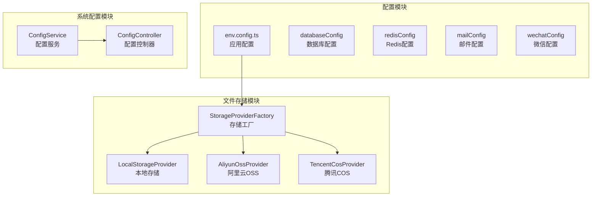
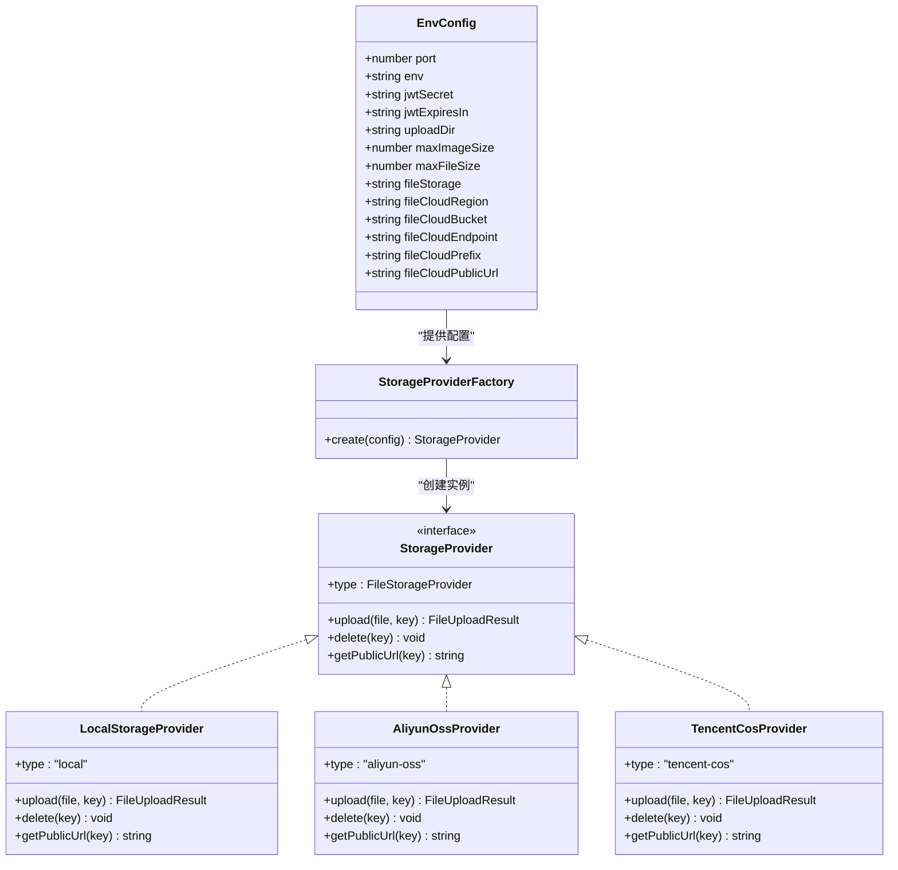
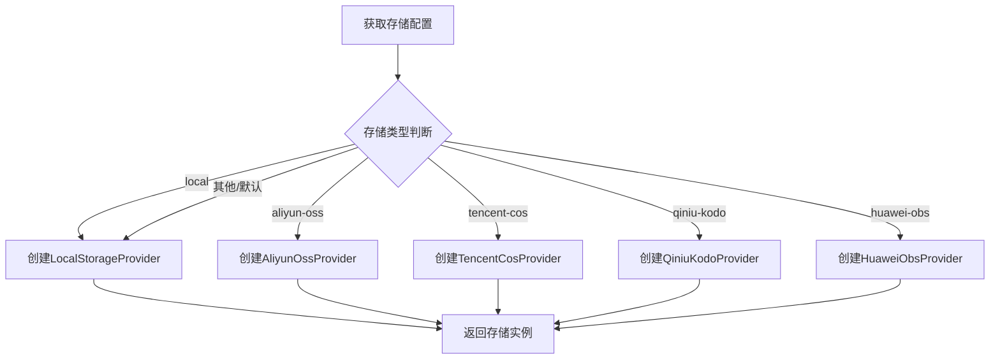
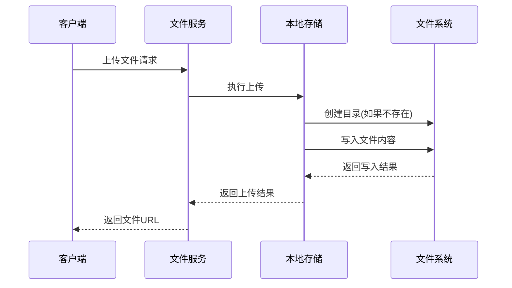
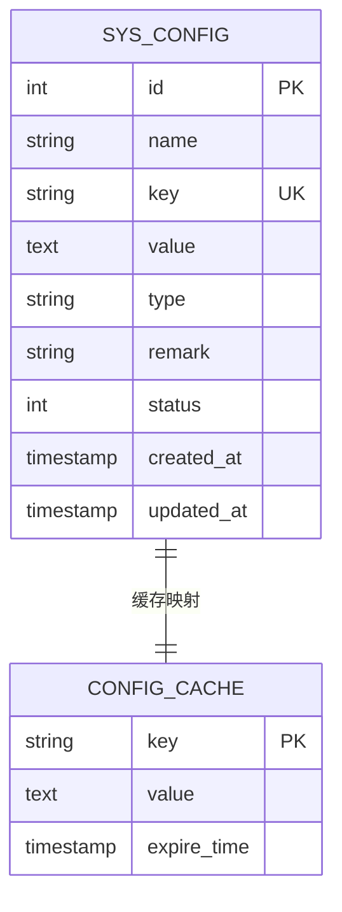
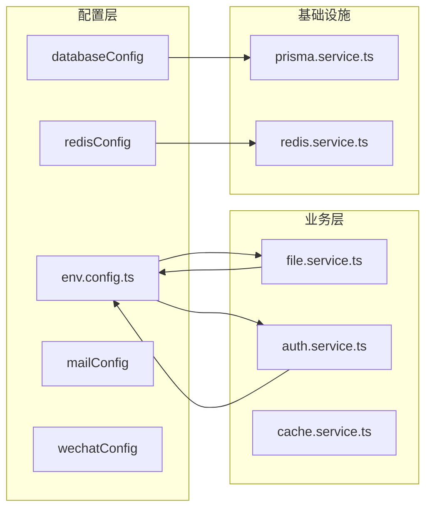

# 环境变量配置

<cite>
**本文档引用的文件**
- [env.config.ts](file://apps/backend/src/config/env.config.ts)
- [storage-provider.factory.ts](file://apps/backend/src/modules/file/storage/storage-provider.factory.ts)
- [storage.types.ts](file://apps/backend/src/modules/file/storage/storage.types.ts)
- [local.provider.ts](file://apps/backend/src/modules/file/storage/local.provider.ts)
- [aliyun-oss.provider.ts](file://apps/backend/src/modules/file/storage/aliyun-oss.provider.ts)
- [tencent-cos.provider.ts](file://apps/backend/src/modules/file/storage/tencent-cos.provider.ts)
- [file.service.ts](file://apps/backend/src/modules/file/file.service.ts)
- [config.service.ts](file://apps/backend/src/modules/system/config/config.service.ts)
- [config.controller.ts](file://apps/backend/src/modules/system/config/config.controller.ts)
- [prisma.service.ts](file://apps/backend/src/common/prisma.service.ts)
</cite>

## 目录
1. [简介](#简介)
2. [项目结构](#项目结构)
3. [核心组件](#核心组件)
4. [架构概览](#架构概览)
5. [详细组件分析](#详细组件分析)
6. [依赖关系分析](#依赖关系分析)
7. [性能考虑](#性能考虑)
8. [故障排除指南](#故障排除指南)
9. [结论](#结论)

## 简介

本文件详细介绍了 Nest-Admin-Pro 项目中的环境变量配置系统。该系统采用集中式配置管理模式，通过 NestJS 的 Config 模块统一管理应用程序的各种配置参数。环境变量配置涵盖了应用运行配置、JWT 安全配置、文件上传配置以及多种云存储服务配置。

## 项目结构

项目采用分层架构设计，环境变量配置主要集中在后端应用的配置模块中：

**图表来源**
- [env.config.ts:1-47](file://apps/backend/src/config/env.config.ts#L1-L47)
- [storage-provider.factory.ts:1-25](file://apps/backend/src/modules/file/storage/storage-provider.factory.ts#L1-L25)
- [config.service.ts:1-56](file://apps/backend/src/modules/system/config/config.service.ts#L1-L56)

**章节来源**
- [env.config.ts:1-47](file://apps/backend/src/config/env.config.ts#L1-L47)
- [storage-provider.factory.ts:1-25](file://apps/backend/src/modules/file/storage/storage-provider.factory.ts#L1-L25)

## 核心组件

### 应用配置组件

应用配置组件负责管理应用程序的基本运行参数，包括端口设置、环境模式、JWT 配置和文件上传相关参数。

### 文件存储配置组件

文件存储配置组件支持多种存储提供商，包括本地存储和多家云存储服务，提供了灵活的文件存储解决方案。

### 系统配置管理组件

系统配置管理组件允许通过数据库动态管理配置参数，并支持 Redis 缓存以提高配置访问性能。

**章节来源**
- [env.config.ts:3-22](file://apps/backend/src/config/env.config.ts#L3-L22)
- [storage.types.ts:10-23](file://apps/backend/src/modules/file/storage/storage.types.ts#L10-L23)
- [config.service.ts:8-56](file://apps/backend/src/modules/system/config/config.service.ts#L8-L56)

## 架构概览

环境变量配置系统采用工厂模式和策略模式相结合的设计，实现了配置的可扩展性和灵活性：

**图表来源**
- [env.config.ts:3-22](file://apps/backend/src/config/env.config.ts#L3-L22)
- [storage-provider.factory.ts:8-24](file://apps/backend/src/modules/file/storage/storage-provider.factory.ts#L8-L24)
- [storage.types.ts:33-38](file://apps/backend/src/modules/file/storage/storage.types.ts#L33-L38)

## 详细组件分析

### 应用配置参数详解

#### 基础应用配置

| 参数名称 | 默认值 | 数据类型 | 取值范围 | 描述 |
|---------|--------|----------|----------|------|
| APP_PORT | 3000 | number | 1-65535 | 应用程序监听端口号 |
| APP_ENV | dev | string | dev/prod/test | 应用程序运行环境 |

#### JWT 安全配置

| 参数名称 | 默认值 | 数据类型 | 取值范围 | 描述 |
|---------|--------|----------|----------|------|
| JWT_SECRET | default-secret-change-me | string | 长度≥32字符 | JWT 密钥，必须足够复杂 |
| JWT_EXPIRES_IN | 7d | string | 时间格式如: 1h, 30m, 7d | JWT 令牌过期时间 |

#### 文件上传配置

| 参数名称 | 默认值 | 数据类型 | 取值范围 | 描述 |
|---------|--------|----------|----------|------|
| UPLOAD_DIR | ./uploads | string | 有效文件路径 | 本地文件上传目录 |
| MAX_IMAGE_SIZE | 2097152 | number | 1024*1024-1024*1024*1024 | 图片最大文件大小(字节) |
| MAX_FILE_SIZE | 104857600 | number | 1024*1024-1024*1024*1024 | 文件最大文件大小(字节) |

#### 存储配置参数

| 参数名称 | 默认值 | 数据类型 | 取值范围 | 描述 |
|---------|--------|----------|----------|------|
| FILE_STORAGE | local | string | local/aliyun-oss/tencent-cos/qiniu-kodo/huawei-obs | 文件存储提供商 |

#### 云存储兼容配置

为确保向后兼容性，系统同时支持新的 FILE_CLOUD_* 和旧的 OSS_* 前缀：

| 新参数前缀 | 旧参数前缀 | 默认值 | 描述 |
|-----------|-----------|--------|------|
| FILE_CLOUD_REGION | OSS_REGION | 空字符串 | 云存储区域 |
| FILE_CLOUD_BUCKET | OSS_BUCKET | 空字符串 | 云存储桶名称 |
| FILE_CLOUD_ENDPOINT | OSS_ENDPOINT | 空字符串 | 云存储端点 |
| FILE_CLOUD_PREFIX | OSS_PREFIX | uploads | 文件前缀 |
| FILE_CLOUD_PUBLIC_URL | OSS_PUBLIC_URL/OSS_CDN_URL | 空字符串 | 公共访问URL |

**章节来源**
- [env.config.ts:3-22](file://apps/backend/src/config/env.config.ts#L3-L22)

### 存储提供商工厂

存储提供商工厂根据配置选择合适的存储服务实现：

**图表来源**
- [storage-provider.factory.ts:8-24](file://apps/backend/src/modules/file/storage/storage-provider.factory.ts#L8-L24)

**章节来源**
- [storage-provider.factory.ts:1-25](file://apps/backend/src/modules/file/storage/storage-provider.factory.ts#L1-L25)

### 本地存储实现

本地存储提供最简单的文件存储解决方案，适用于开发环境和小规模部署：

**图表来源**
- [local.provider.ts:11-26](file://apps/backend/src/modules/file/storage/local.provider.ts#L11-L26)

**章节来源**
- [local.provider.ts:1-46](file://apps/backend/src/modules/file/storage/local.provider.ts#L1-L46)

### 阿里云 OSS 存储实现

阿里云 OSS 提供企业级的对象存储服务，支持高可用性和高扩展性：

| 配置参数 | 必需性 | 描述 |
|---------|--------|------|
| ACCESS_KEY_ID | 必需 | 阿里云访问密钥ID |
| ACCESS_KEY_SECRET | 必需 | 阿里云访问密钥 |
| REGION | 必需 | 阿里云区域标识 |
| BUCKET | 必需 | 存储桶名称 |
| ENDPOINT | 可选 | 自定义域名或端点 |

**章节来源**
- [aliyun-oss.provider.ts:13-34](file://apps/backend/src/modules/file/storage/aliyun-oss.provider.ts#L13-L34)

### 腾讯云 COS 存储实现

腾讯云 COS 提供安全、可靠且低成本的对象存储服务：

| 配置参数 | 必需性 | 描述 |
|---------|--------|------|
| SECRET_ID | 必需 | 腾讯云 SecretId |
| SECRET_KEY | 必需 | 腾讯云 SecretKey |
| REGION | 必需 | 腾讯云区域 |
| BUCKET | 必需 | 存储桶名称 |

**章节来源**
- [tencent-cos.provider.ts:14-43](file://apps/backend/src/modules/file/storage/tencent-cos.provider.ts#L14-L43)

### 动态配置管理系统

系统支持通过数据库动态管理配置参数，并提供 Redis 缓存优化：

**图表来源**
- [config.service.ts:31-42](file://apps/backend/src/modules/system/config/config.service.ts#L31-L42)

**章节来源**
- [config.service.ts:1-56](file://apps/backend/src/modules/system/config/config.service.ts#L1-L56)
- [config.controller.ts:1-63](file://apps/backend/src/modules/system/config/config.controller.ts#L1-L63)

## 依赖关系分析

环境变量配置系统与其他组件的依赖关系如下：

**图表来源**
- [env.config.ts:24-46](file://apps/backend/src/config/env.config.ts#L24-L46)
- [file.service.ts:211-253](file://apps/backend/src/modules/file/file.service.ts#L211-L253)

**章节来源**
- [env.config.ts:24-46](file://apps/backend/src/config/env.config.ts#L24-L46)
- [file.service.ts:211-253](file://apps/backend/src/modules/file/file.service.ts#L211-L253)

## 性能考虑

### 配置缓存策略

系统通过 Redis 对配置参数进行缓存，减少数据库查询压力：

- **缓存键格式**: `config:{key}`
- **缓存更新**: 通过配置刷新接口同步更新缓存
- **缓存失效**: 配置更新时自动失效相关缓存

### 存储性能优化

不同存储提供商的性能特点：

| 存储类型 | 读取延迟 | 写入延迟 | 扩展性 | 成本 |
|---------|----------|----------|--------|------|
| 本地存储 | 低 | 低 | 有限 | 低 |
| 阿里云OSS | 中等 | 中等 | 高 | 中等 |
| 腾讯COS | 中等 | 中等 | 高 | 中等 |

## 故障排除指南

### 常见配置问题

#### 数据库连接失败
- 检查 DATABASE_URL 格式是否正确
- 验证数据库服务状态
- 确认网络连接和防火墙设置

#### JWT 配置错误
- 确保 JWT_SECRET 长度至少32字符
- 验证 JWT_EXPIRES_IN 格式正确
- 检查密钥是否在所有实例间保持一致

#### 文件上传失败
- 验证 UPLOAD_DIR 权限设置
- 检查磁盘空间和配额限制
- 确认文件大小限制配置合理

#### 云存储连接问题
- 验证访问密钥和区域配置
- 检查网络连通性和DNS解析
- 确认存储桶权限设置正确

**章节来源**
- [env.config.ts:24-46](file://apps/backend/src/config/env.config.ts#L24-L46)
- [prisma.service.ts:8-21](file://apps/backend/src/common/prisma.service.ts#L8-L21)

## 结论

Nest-Admin-Pro 项目的环境变量配置系统设计合理，具有以下特点：

1. **模块化设计**: 将不同类型的配置分离到独立的配置模块中
2. **可扩展性**: 支持多种存储提供商和配置来源
3. **安全性**: 提供敏感信息的安全处理机制
4. **灵活性**: 支持运行时配置更新和动态调整

建议在实际部署中：
- 使用环境特定的配置文件管理敏感信息
- 定期轮换 JWT 密钥和云存储访问密钥
- 建立配置变更的审计和回滚机制
- 实施监控和告警系统跟踪配置相关问题