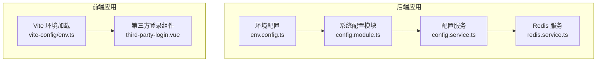
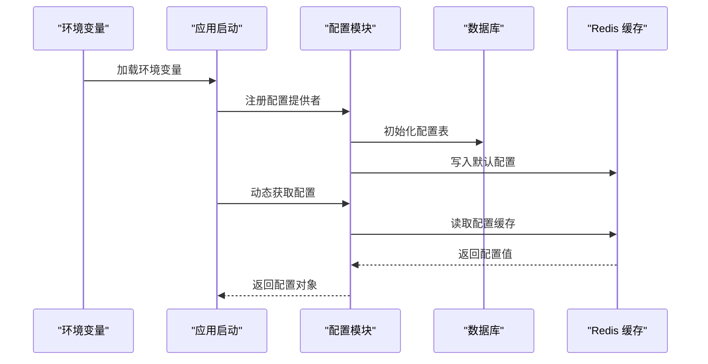
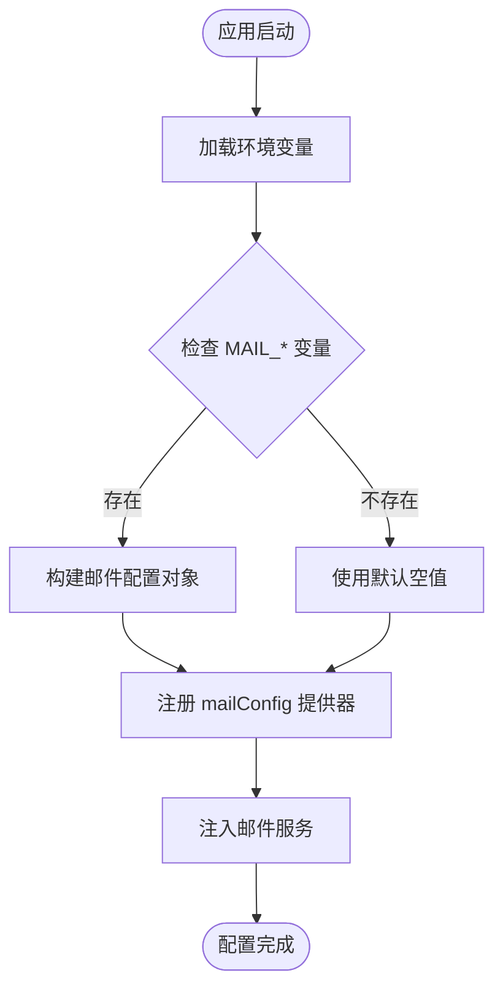
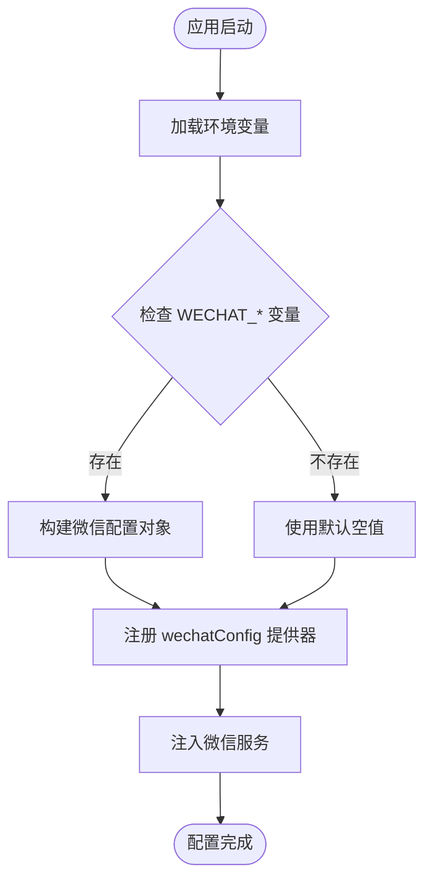
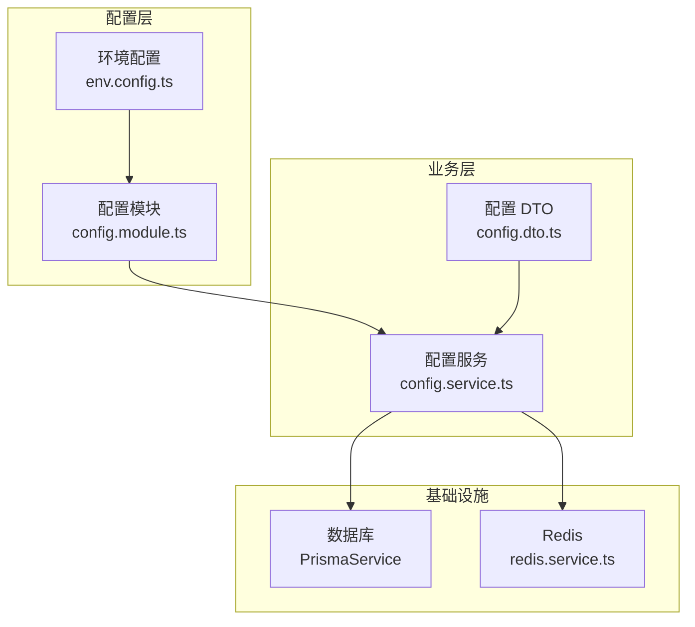

# 第三方服务配置

<cite>
**本文档引用的文件**
- [apps/backend/src/config/env.config.ts](file://apps/backend/src/config/env.config.ts)
- [apps/backend/src/modules/system/config/config.service.ts](file://apps/backend/src/modules/system/config/config.service.ts)
- [apps/backend/src/modules/system/config/config.controller.ts](file://apps/backend/src/modules/system/config/config.controller.ts)
- [apps/backend/src/modules/system/config/dto/config.dto.ts](file://apps/backend/src/modules/system/config/dto/config.dto.ts)
- [apps/backend/src/cache/redis.service.ts](file://apps/backend/src/cache/redis.service.ts)
- [apps/vben-admin/internal/vite-config/src/utils/env.ts](file://apps/vben-admin/internal/vite-config/src/utils/env.ts)
- [apps/vben-admin/packages/effects/common-ui/src/ui/authentication/third-party-login.vue](file://apps/vben-admin/packages/effects/common-ui/src/ui/authentication/third-party-login.vue)
</cite>

## 目录
1. [简介](#简介)
2. [项目结构](#项目结构)
3. [核心组件](#核心组件)
4. [架构概览](#架构概览)
5. [详细组件分析](#详细组件分析)
6. [依赖关系分析](#依赖关系分析)
7. [性能考虑](#性能考虑)
8. [故障排除指南](#故障排除指南)
9. [结论](#结论)
10. [附录](#附录)

## 简介

本文件详细介绍 Nest-Admin-Pro 项目中第三方服务的配置方法，包括邮件服务（SMTP）、微信服务（AppId/Secret）以及其他第三方服务的配置实践。文档涵盖配置文件的组织结构与命名规范、环境变量管理、配置的动态加载与缓存机制、安全管理和敏感信息保护措施，以及测试方法和故障排除指南。

## 项目结构

项目采用多应用架构，包含后端 NestJS 应用、前端 Vben Admin 应用和前端 UniApp 应用。第三方服务配置主要集中在后端配置模块和前端环境配置工具中：

**图表来源**
- [apps/backend/src/config/env.config.ts:1-47](file://apps/backend/src/config/env.config.ts#L1-L47)
- [apps/backend/src/modules/system/config/config.module.ts:1-10](file://apps/backend/src/modules/system/config/config.module.ts#L1-L10)
- [apps/backend/src/modules/system/config/config.service.ts:1-56](file://apps/backend/src/modules/system/config/config.service.ts#L1-L56)
- [apps/backend/src/cache/redis.service.ts:1-128](file://apps/backend/src/cache/redis.service.ts#L1-L128)
- [apps/vben-admin/internal/vite-config/src/utils/env.ts:43-93](file://apps/vben-admin/internal/vite-config/src/utils/env.ts#L43-L93)
- [apps/vben-admin/packages/effects/common-ui/src/ui/authentication/third-party-login.vue:1-32](file://apps/vben-admin/packages/effects/common-ui/src/ui/authentication/third-party-login.vue#L1-L32)

**章节来源**
- [apps/backend/src/config/env.config.ts:1-47](file://apps/backend/src/config/env.config.ts#L1-L47)
- [apps/backend/src/modules/system/config/config.module.ts:1-10](file://apps/backend/src/modules/system/config/config.module.ts#L1-L10)

## 核心组件

### 环境配置模块

后端通过 `env.config.ts` 定义了多个配置注册器，用于从环境变量加载第三方服务配置：

- 应用配置：端口、环境、JWT 密钥、上传目录等
- 数据库配置：数据库连接 URL
- Redis 配置：主机、端口、密码、数据库索引
- 邮件配置（SMTP）：主机、端口、用户名、密码、发件人
- 微信配置：AppId、Secret

这些配置以 `registerAs` 形式导出，便于在 NestJS 应用中注入使用。

**章节来源**
- [apps/backend/src/config/env.config.ts:1-47](file://apps/backend/src/config/env.config.ts#L1-L47)

### 系统配置模块

系统配置模块提供了运行时配置管理能力，支持通过数据库存储配置项，并将其同步到 Redis 缓存中：

- 支持查询、创建、更新、删除配置项
- 更新配置时自动刷新 Redis 缓存
- 提供批量刷新缓存接口

该模块为第三方服务配置提供了动态化管理能力，允许管理员在不重启服务的情况下调整配置。

**章节来源**
- [apps/backend/src/modules/system/config/config.service.ts:1-56](file://apps/backend/src/modules/system/config/config.service.ts#L1-L56)
- [apps/backend/src/modules/system/config/config.controller.ts:1-63](file://apps/backend/src/modules/system/config/config.controller.ts#L1-L63)
- [apps/backend/src/modules/system/config/dto/config.dto.ts:1-28](file://apps/backend/src/modules/system/config/dto/config.dto.ts#L1-L28)

### Redis 缓存服务

Redis 服务负责缓存第三方服务配置，提供高性能的读取能力：

- 连接配置：主机、端口、密码、数据库索引
- 基础操作：get、set、del、exists、ttl、keys
- 在线用户管理：基于集合的在线用户跟踪
- 哈希操作：hset、hget、hgetall 辅助缓存复杂数据结构

**章节来源**
- [apps/backend/src/cache/redis.service.ts:1-128](file://apps/backend/src/cache/redis.service.ts#L1-L128)

## 架构概览

第三方服务配置的整体架构由环境配置、系统配置管理、缓存层和前端配置加载组成：

**图表来源**
- [apps/backend/src/config/env.config.ts:35-46](file://apps/backend/src/config/env.config.ts#L35-L46)
- [apps/backend/src/modules/system/config/config.service.ts:49-55](file://apps/backend/src/modules/system/config/config.service.ts#L49-L55)
- [apps/backend/src/cache/redis.service.ts:39-47](file://apps/backend/src/cache/redis.service.ts#L39-L47)

## 详细组件分析

### 邮件服务配置（SMTP）

邮件服务配置通过 `mailConfig` 提供器实现，支持以下关键参数：

- 主机（host）：SMTP 服务器地址
- 端口（port）：SMTP 服务器端口号，默认 587
- 用户名（user）：SMTP 认证用户名
- 密码（pass）：SMTP 认证密码
- 发件人（from）：默认发件人地址

配置加载流程：

**图表来源**
- [apps/backend/src/config/env.config.ts:35-41](file://apps/backend/src/config/env.config.ts#L35-L41)

**章节来源**
- [apps/backend/src/config/env.config.ts:35-41](file://apps/backend/src/config/env.config.ts#L35-L41)

### 微信服务配置

微信服务配置通过 `wechatConfig` 提供器实现，包含以下核心参数：

- AppId：微信应用标识
- Secret：微信应用密钥

配置加载流程：

**图表来源**
- [apps/backend/src/config/env.config.ts:43-46](file://apps/backend/src/config/env.config.ts#L43-L46)

**章节来源**
- [apps/backend/src/config/env.config.ts:43-46](file://apps/backend/src/config/env.config.ts#L43-L46)

### 其他第三方服务配置

项目中还支持其他第三方服务的配置模式：

- 文件存储服务：支持阿里云 OSS、腾讯 COS、七牛 Kodo、华为 OBS 等
- 存储配置：区域（region）、存储桶（bucket）、端点（endpoint）、前缀（prefix）、公共 URL（publicUrl）
- 统一的存储提供者工厂模式，支持动态切换存储提供商

**章节来源**
- [apps/backend/src/config/env.config.ts:11-21](file://apps/backend/src/config/env.config.ts#L11-L21)

### 配置文件组织结构与命名规范

前端环境配置采用 Vite 的环境变量加载机制：

- 环境文件位置：`apps/vben-admin/internal/vite-config/src/utils/env.ts`
- 支持多种环境文件格式：`.env`、`.env.local`、`.env.[mode]` 等
- 环境变量前缀过滤：仅加载指定前缀的变量
- 动态转换：将字符串类型的配置转换为应用所需的类型

**章节来源**
- [apps/vben-admin/internal/vite-config/src/utils/env.ts:43-93](file://apps/vben-admin/internal/vite-config/src/utils/env.ts#L43-L93)

### 前端第三方登录集成

前端提供了第三方登录组件，支持多种第三方认证方式：

- GitHub 登录
- Google 登录  
- QQ 登录
- 微信登录
- 钉钉登录

组件通过应用配置加载第三方认证提供商的配置信息。

**章节来源**
- [apps/vben-admin/packages/effects/common-ui/src/ui/authentication/third-party-login.vue:1-32](file://apps/vben-admin/packages/effects/common-ui/src/ui/authentication/third-party-login.vue#L1-L32)

## 依赖关系分析

第三方服务配置的依赖关系如下：

**图表来源**
- [apps/backend/src/config/env.config.ts:1-47](file://apps/backend/src/config/env.config.ts#L1-L47)
- [apps/backend/src/modules/system/config/config.module.ts:1-10](file://apps/backend/src/modules/system/config/config.module.ts#L1-L10)
- [apps/backend/src/modules/system/config/config.service.ts:1-56](file://apps/backend/src/modules/system/config/config.service.ts#L1-L56)
- [apps/backend/src/modules/system/config/dto/config.dto.ts:1-28](file://apps/backend/src/modules/system/config/dto/config.dto.ts#L1-L28)
- [apps/backend/src/cache/redis.service.ts:1-128](file://apps/backend/src/cache/redis.service.ts#L1-L128)

**章节来源**
- [apps/backend/src/modules/system/config/config.service.ts:1-56](file://apps/backend/src/modules/system/config/config.service.ts#L1-L56)
- [apps/backend/src/cache/redis.service.ts:1-128](file://apps/backend/src/cache/redis.service.ts#L1-L128)

## 性能考虑

### 缓存策略

系统采用 Redis 作为配置缓存层，提供以下性能优化：

- 快速读取：配置项通过 Redis 键值对存储，读取延迟低
- 类型安全：支持字符串和 JSON 对象的自动序列化/反序列化
- TTL 支持：可为配置项设置过期时间
- 批量操作：支持批量刷新配置缓存

### 配置加载优化

- 环境变量预加载：应用启动时一次性加载所有环境变量
- 懒加载机制：按需访问配置，避免不必要的初始化
- 连接池管理：Redis 连接采用连接池复用

## 故障排除指南

### 常见问题诊断

#### 邮件服务配置问题

**症状**：邮件发送失败或连接超时
**排查步骤**：
1. 检查 SMTP 服务器连通性
2. 验证用户名和密码正确性
3. 确认端口和加密方式配置正确
4. 查看 Redis 缓存中配置是否正确

**章节来源**
- [apps/backend/src/config/env.config.ts:35-41](file://apps/backend/src/config/env.config.ts#L35-L41)
- [apps/backend/src/cache/redis.service.ts:16-22](file://apps/backend/src/cache/redis.service.ts#L16-L22)

#### 微信服务配置问题

**症状**：微信登录失败或获取用户信息异常
**排查步骤**：
1. 验证 AppId 和 Secret 配置正确
2. 检查微信回调域名配置
3. 确认微信开放平台权限配置
4. 查看系统配置表中的对应记录

**章节来源**
- [apps/backend/src/config/env.config.ts:43-46](file://apps/backend/src/config/env.config.ts#L43-L46)

#### 配置缓存问题

**症状**：配置更新后未生效
**排查步骤**：
1. 调用配置刷新接口重新加载缓存
2. 检查 Redis 连接状态
3. 验证配置键值格式正确
4. 查看系统日志中的错误信息

**章节来源**
- [apps/backend/src/modules/system/config/config.service.ts:49-55](file://apps/backend/src/modules/system/config/config.service.ts#L49-L55)
- [apps/backend/src/cache/redis.service.ts:39-47](file://apps/backend/src/cache/redis.service.ts#L39-L47)

### 测试方法

#### 环境变量测试

1. 创建测试环境文件
2. 验证环境变量加载
3. 检查配置提供器返回值
4. 确认类型转换正确

#### 配置接口测试

1. 使用系统配置管理接口
2. 验证 CRUD 操作
3. 测试缓存同步机制
4. 检查权限控制

## 结论

Nest-Admin-Pro 项目的第三方服务配置体系具有以下特点：

- **统一管理**：通过配置模块集中管理所有第三方服务配置
- **动态更新**：支持运行时配置修改和缓存刷新
- **安全可靠**：采用 Redis 缓存和严格的类型验证
- **易于扩展**：模块化的配置提供器设计便于添加新的第三方服务

该配置体系为开发者提供了灵活、安全、高效的第三方服务集成方案。

## 附录

### 配置参数参考表

| 服务类别 | 参数名称 | 环境变量键 | 默认值 | 说明 |
|---------|----------|------------|--------|------|
| 邮件服务 | 主机 | MAIL_HOST | 空 | SMTP 服务器地址 |
| 邮件服务 | 端口 | MAIL_PORT | 587 | SMTP 服务器端口 |
| 邮件服务 | 用户名 | MAIL_USER | 空 | SMTP 认证用户名 |
| 邮件服务 | 密码 | MAIL_PASS | 空 | SMTP 认证密码 |
| 邮件服务 | 发件人 | MAIL_FROM | 空 | 默认发件人地址 |
| 微信服务 | AppId | WECHAT_APPID | 空 | 微信应用标识 |
| 微信服务 | Secret | WECHAT_SECRET | 空 | 微信应用密钥 |

### 最佳实践建议

1. **安全配置**：敏感信息使用环境变量管理，避免硬编码
2. **配置验证**：在应用启动时验证关键配置的有效性
3. **缓存策略**：合理设置配置缓存的 TTL 值
4. **监控告警**：建立配置变更的监控和告警机制
5. **备份恢复**：定期备份配置数据，建立快速恢复机制