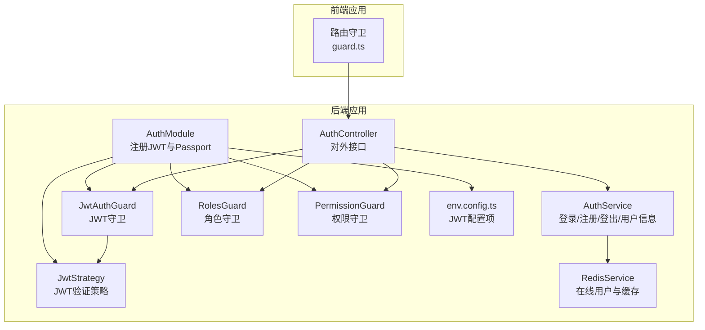
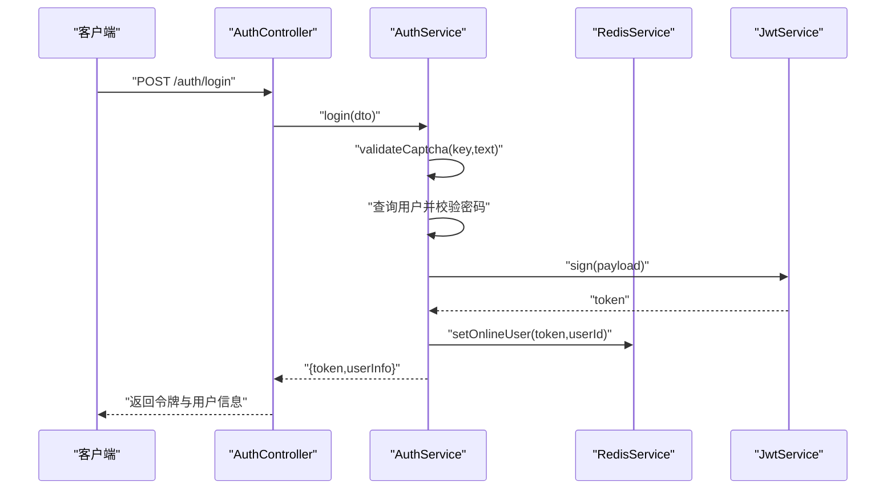
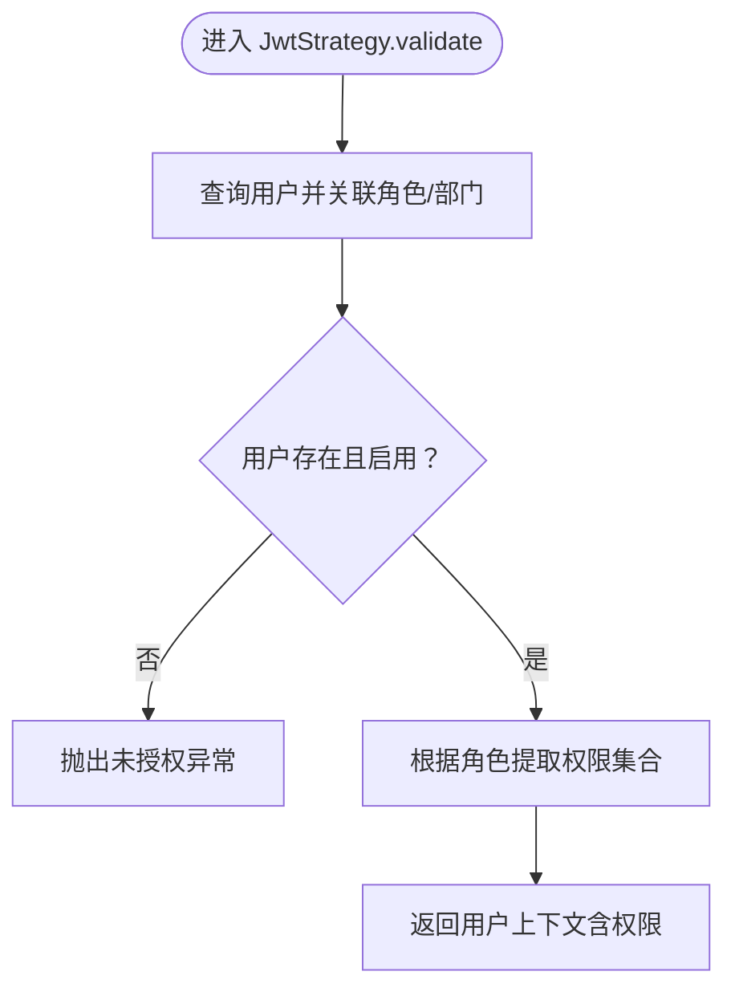
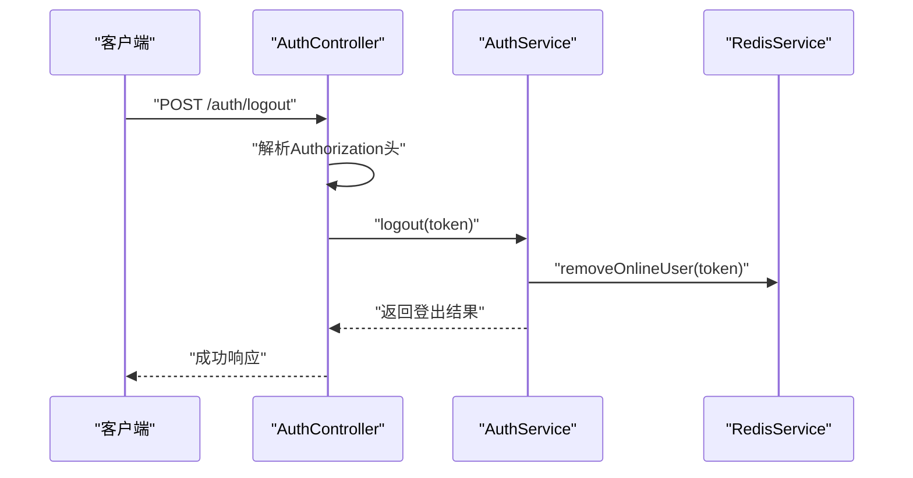
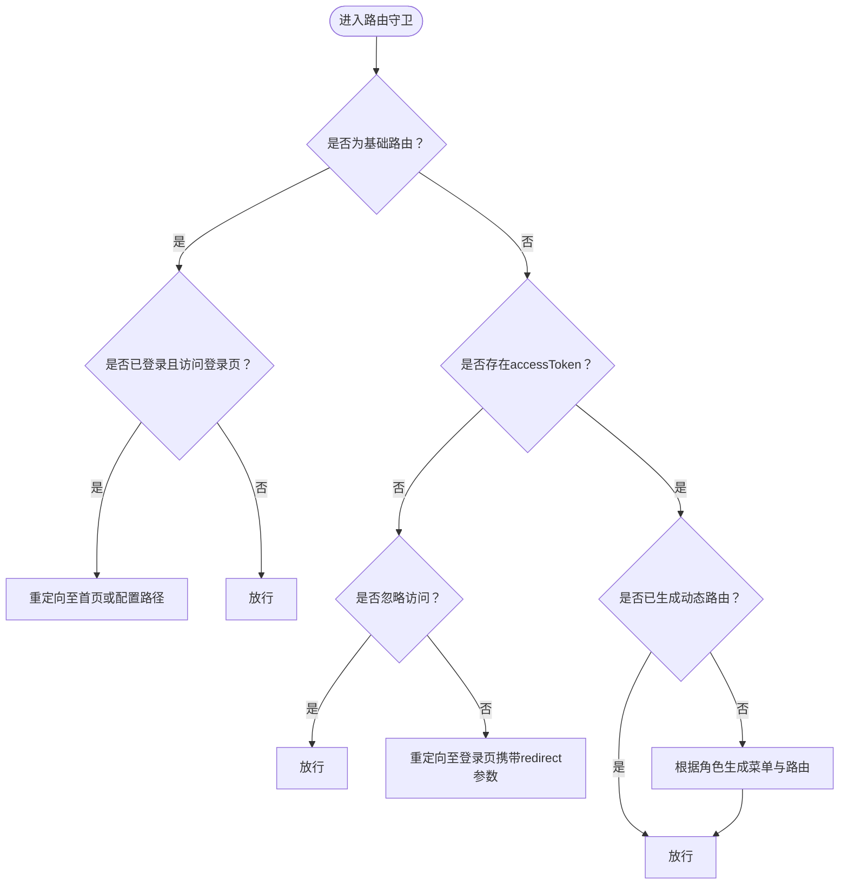
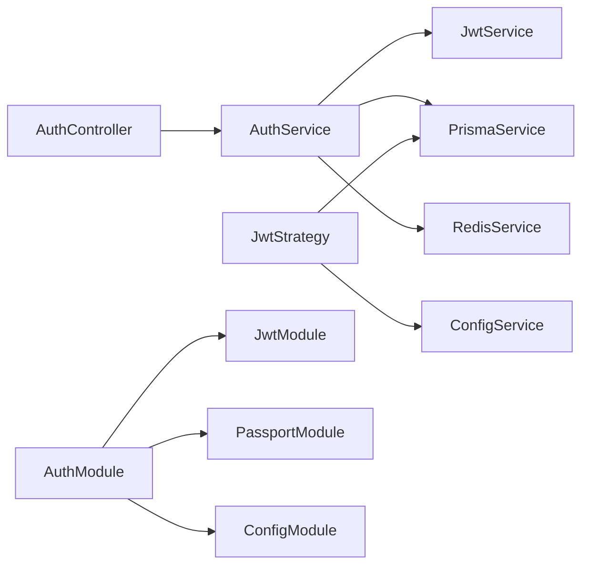

# 认证配置

<cite>
**本文档引用的文件**
- [apps/backend/src/auth/auth.module.ts](file://apps/backend/src/auth/auth.module.ts)
- [apps/backend/src/auth/jwt.strategy.ts](file://apps/backend/src/auth/jwt.strategy.ts)
- [apps/backend/src/auth/guards.ts](file://apps/backend/src/auth/guards.ts)
- [apps/backend/src/auth/jwt.guard.ts](file://apps/backend/src/auth/jwt.guard.ts)
- [apps/backend/src/auth/auth.service.ts](file://apps/backend/src/auth/auth.service.ts)
- [apps/backend/src/auth/auth.controller.ts](file://apps/backend/src/auth/auth.controller.ts)
- [apps/backend/src/auth/dto/auth.dto.ts](file://apps/backend/src/auth/dto/auth.dto.ts)
- [apps/backend/src/config/env.config.ts](file://apps/backend/src/config/env.config.ts)
- [apps/backend/src/cache/redis.service.ts](file://apps/backend/src/cache/redis.service.ts)
- [apps/backend/src/app.module.ts](file://apps/backend/src/app.module.ts)
- [apps/vben-admin/apps/web-antd/src/router/guard.ts](file://apps/vben-admin/apps/web-antd/src/router/guard.ts)
</cite>

## 目录
1. [简介](#简介)
2. [项目结构](#项目结构)
3. [核心组件](#核心组件)
4. [架构总览](#架构总览)
5. [详细组件分析](#详细组件分析)
6. [依赖关系分析](#依赖关系分析)
7. [性能考虑](#性能考虑)
8. [故障排除指南](#故障排除指南)
9. [结论](#结论)
10. [附录](#附录)

## 简介
本文件系统性梳理后端认证与授权体系，重点覆盖以下方面：
- JWT 配置：密钥、过期时间、签名算法、令牌提取方式
- JWT 策略与验证机制：载荷校验、用户状态检查、权限提取
- 认证守卫：全局与局部守卫、角色守卫、权限守卫
- 不同认证方式：密码认证（用户名/密码）、图形验证码、登出与在线用户管理
- 认证中间件与拦截器：请求拦截、响应转换、异常过滤
- 安全最佳实践与常见问题排查

## 项目结构
后端采用 NestJS 架构，认证相关代码集中在 auth 模块；前端使用 Vue Router 的导航守卫进行权限拦截。



**图表来源**
- [apps/backend/src/auth/auth.module.ts:11-28](file://apps/backend/src/auth/auth.module.ts#L11-L28)
- [apps/backend/src/auth/auth.service.ts:20-27](file://apps/backend/src/auth/auth.service.ts#L20-L27)
- [apps/backend/src/auth/auth.controller.ts:1-87](file://apps/backend/src/auth/auth.controller.ts#L1-L87)
- [apps/backend/src/auth/jwt.strategy.ts:8-18](file://apps/backend/src/auth/jwt.strategy.ts#L8-L18)
- [apps/backend/src/auth/jwt.guard.ts:1-5](file://apps/backend/src/auth/jwt.guard.ts#L1-L5)
- [apps/backend/src/auth/guards.ts:19-50](file://apps/backend/src/auth/guards.ts#L19-L50)
- [apps/backend/src/cache/redis.service.ts:82-99](file://apps/backend/src/cache/redis.service.ts#L82-L99)
- [apps/backend/src/config/env.config.ts:3-22](file://apps/backend/src/config/env.config.ts#L3-L22)
- [apps/vben-admin/apps/web-antd/src/router/guard.ts:47-120](file://apps/vben-admin/apps/web-antd/src/router/guard.ts#L47-L120)

**章节来源**
- [apps/backend/src/auth/auth.module.ts:1-29](file://apps/backend/src/auth/auth.module.ts#L1-L29)
- [apps/backend/src/app.module.ts:18-58](file://apps/backend/src/app.module.ts#L18-L58)

## 核心组件
- AuthModule：集中注册 Passport 默认策略为 jwt，异步配置 JWT 密钥与过期时间，并导出 AuthService、JwtAuthGuard、RolesGuard、PermissionGuard。
- JwtStrategy：从 Authorization 头部提取 Bearer 令牌，校验过期与签名，查询用户并构建包含角色与权限的上下文对象。
- JwtAuthGuard：基于 Passport 的 jwt 策略的便捷守卫。
- RolesGuard/PermissionGuard：基于反射元数据的角色与权限校验。
- AuthService：实现登录（含验证码校验）、注册、登出、用户信息与菜单权限树构建。
- AuthController：暴露认证相关 API，结合守卫控制访问。
- RedisService：维护在线用户集合与令牌映射，支持登出时移除在线状态。
- env.config.ts：定义 JWT 密钥与过期时间的环境变量默认值。

**章节来源**
- [apps/backend/src/auth/auth.module.ts:11-28](file://apps/backend/src/auth/auth.module.ts#L11-L28)
- [apps/backend/src/auth/jwt.strategy.ts:8-18](file://apps/backend/src/auth/jwt.strategy.ts#L8-L18)
- [apps/backend/src/auth/jwt.guard.ts:1-5](file://apps/backend/src/auth/jwt.guard.ts#L1-L5)
- [apps/backend/src/auth/guards.ts:19-50](file://apps/backend/src/auth/guards.ts#L19-L50)
- [apps/backend/src/auth/auth.service.ts:20-89](file://apps/backend/src/auth/auth.service.ts#L20-L89)
- [apps/backend/src/auth/auth.controller.ts:1-87](file://apps/backend/src/auth/auth.controller.ts#L1-L87)
- [apps/backend/src/cache/redis.service.ts:82-99](file://apps/backend/src/cache/redis.service.ts#L82-L99)
- [apps/backend/src/config/env.config.ts:3-22](file://apps/backend/src/config/env.config.ts#L3-L22)

## 架构总览
下图展示从客户端发起登录请求到服务端签发 JWT 并写入在线状态的整体流程。



**图表来源**
- [apps/backend/src/auth/auth.controller.ts:13-19](file://apps/backend/src/auth/auth.controller.ts#L13-L19)
- [apps/backend/src/auth/auth.service.ts:29-89](file://apps/backend/src/auth/auth.service.ts#L29-L89)
- [apps/backend/src/cache/redis.service.ts:82-99](file://apps/backend/src/cache/redis.service.ts#L82-L99)

## 详细组件分析

### JWT 配置与策略
- 密钥设置
  - 使用 ConfigService 获取 app.jwtSecret，未配置时回退至默认密钥。
  - JwtStrategy 同样从 ConfigService 读取密钥用于解密与校验。
- 过期时间
  - AuthModule 中通过 signOptions.expirseIn 设置，默认为 7 天。
  - 登录成功后，前端可按需刷新令牌或延长会话（由业务决定）。
- 签名算法
  - 未显式指定算法，默认使用 HS256（由 @nestjs/jwt 内部处理）。
- 令牌提取
  - JwtStrategy 使用 ExtractJwt.fromAuthHeaderAsBearerToken() 从 Authorization 头部提取 Bearer 令牌。
- 用户状态与权限校验
  - validate 方法在通过签名与过期校验后，查询用户并检查状态与逻辑删除标记。
  - 根据角色动态计算权限集合（超级管理员拥有全部权限，普通用户根据菜单 ID 计算）。



**图表来源**
- [apps/backend/src/auth/jwt.strategy.ts:20-43](file://apps/backend/src/auth/jwt.strategy.ts#L20-L43)

**章节来源**
- [apps/backend/src/auth/auth.module.ts:14-23](file://apps/backend/src/auth/auth.module.ts#L14-L23)
- [apps/backend/src/auth/jwt.strategy.ts:8-18](file://apps/backend/src/auth/jwt.strategy.ts#L8-L18)
- [apps/backend/src/config/env.config.ts:6-7](file://apps/backend/src/config/env.config.ts#L6-L7)

### 认证守卫与拦截规则
- 全局与局部守卫
  - JwtAuthGuard 继承自 AuthGuard('jwt')，用于保护需要认证的路由。
  - RolesGuard 与 PermissionGuard 通过反射读取元数据，分别校验角色编码与权限字符串数组。
  - Public 装饰器允许特定路由忽略认证。
- 拦截器与过滤器
  - 全局注册 ThrottlerGuard、TransformInterceptor、OperLogInterceptor、GlobalExceptionFilter。
  - 登录/注册等接口使用 @Public() 允许匿名访问；其他接口默认受 JwtAuthGuard 保护。

```mermaid
classDiagram
class JwtAuthGuard {
+canActivate(context)
}
class RolesGuard {
+canActivate(context)
}
class PermissionGuard {
+canActivate(context)
}
JwtAuthGuard --> "继承" AuthGuard("jwt")
RolesGuard --> "反射元数据" ROLES_KEY
PermissionGuard --> "反射元数据" PERMS_KEY
```

**图表来源**
- [apps/backend/src/auth/jwt.guard.ts:1-5](file://apps/backend/src/auth/jwt.guard.ts#L1-L5)
- [apps/backend/src/auth/guards.ts:19-50](file://apps/backend/src/auth/guards.ts#L19-L50)

**章节来源**
- [apps/backend/src/auth/guards.ts:10-17](file://apps/backend/src/auth/guards.ts#L10-L17)
- [apps/backend/src/auth/jwt.guard.ts:1-5](file://apps/backend/src/auth/jwt.guard.ts#L1-L5)
- [apps/backend/src/app.module.ts:39-55](file://apps/backend/src/app.module.ts#L39-L55)

### 认证控制器与路由
- 登录：@Public() + 验证验证码 + 校验用户名/密码 + 签发 JWT + 写入在线用户。
- 注册：校验用户名唯一性 + 密码哈希 + 创建用户。
- 验证码：生成 SVG 图形验证码并存储到 Redis，设置过期时间。
- 登出：从 Authorization 头解析令牌并调用 AuthService.logout，移除在线状态。
- 用户信息与菜单：根据角色动态构建可访问菜单树与权限集合。
- 在线用户：通过 Redis 集合维护当前在线令牌列表。



**图表来源**
- [apps/backend/src/auth/auth.controller.ts:44-51](file://apps/backend/src/auth/auth.controller.ts#L44-L51)
- [apps/backend/src/auth/auth.service.ts:130-133](file://apps/backend/src/auth/auth.service.ts#L130-L133)
- [apps/backend/src/cache/redis.service.ts:88-91](file://apps/backend/src/cache/redis.service.ts#L88-L91)

**章节来源**
- [apps/backend/src/auth/auth.controller.ts:13-87](file://apps/backend/src/auth/auth.controller.ts#L13-L87)
- [apps/backend/src/auth/auth.service.ts:29-89](file://apps/backend/src/auth/auth.service.ts#L29-L89)
- [apps/backend/src/cache/redis.service.ts:82-99](file://apps/backend/src/cache/redis.service.ts#L82-L99)

### 前端路由守卫
- 通用守卫：记录页面加载状态与进度条。
- 权限访问守卫：在进入非基础路由前检查 accessToken；若无权限则重定向至登录页；已登录则根据用户角色生成可访问菜单与路由。
- 忽略访问：可通过路由 meta.ignoreAccess 允许无需权限访问的页面。



**图表来源**
- [apps/vben-admin/apps/web-antd/src/router/guard.ts:47-120](file://apps/vben-admin/apps/web-antd/src/router/guard.ts#L47-L120)

**章节来源**
- [apps/vben-admin/apps/web-antd/src/router/guard.ts:17-134](file://apps/vben-admin/apps/web-antd/src/router/guard.ts#L17-L134)

## 依赖关系分析
- 模块耦合
  - AuthModule 依赖 ConfigModule 提供 JWT 配置；导出 JwtAuthGuard、RolesGuard、PermissionGuard 供全局使用。
  - AuthController 依赖 AuthService；AuthService 依赖 JwtService、PrismaService、RedisService。
  - JwtStrategy 依赖 ConfigService 与 PrismaService。
- 外部依赖
  - @nestjs/jwt、passport-jwt、bcryptjs、svg-captcha、ioredis。
- 可能的循环依赖
  - 当前模块间为单向依赖，未见循环导入。



**图表来源**
- [apps/backend/src/auth/auth.module.ts:11-28](file://apps/backend/src/auth/auth.module.ts#L11-L28)
- [apps/backend/src/auth/auth.controller.ts:1-11](file://apps/backend/src/auth/auth.controller.ts#L1-L11)
- [apps/backend/src/auth/auth.service.ts:20-27](file://apps/backend/src/auth/auth.service.ts#L20-L27)
- [apps/backend/src/auth/jwt.strategy.ts:8-12](file://apps/backend/src/auth/jwt.strategy.ts#L8-L12)

**章节来源**
- [apps/backend/src/auth/auth.module.ts:1-29](file://apps/backend/src/auth/auth.module.ts#L1-L29)
- [apps/backend/src/auth/auth.service.ts:20-27](file://apps/backend/src/auth/auth.service.ts#L20-L27)

## 性能考虑
- 令牌过期时间
  - 默认 7 天，建议根据业务风险调整；短期会话可缩短以提升安全性。
- Redis 在线用户
  - 登录时写入在线集合与令牌映射，登出时移除；建议为在线键设置合理 TTL。
- 密码哈希成本
  - bcrypt 默认成本较高，注意登录延迟；可根据服务器性能调整。
- 验证码缓存
  - 验证码文本存储于 Redis，设置较短 TTL（例如 120 秒），避免内存泄漏。
- 请求限制
  - 全局注册 ThrottlerGuard，防止暴力破解与频繁请求。

[本节为通用指导，不涉及具体文件分析]

## 故障排除指南
- 登录失败
  - 验证码错误：确认 captchaKey 与 captchaText 匹配且未过期。
  - 用户名或密码错误：检查数据库中用户状态与密码哈希。
  - 账户禁用：用户状态非启用状态将被拒绝。
- 令牌无效
  - 确认 Authorization 头格式为 Bearer <token>。
  - 检查 JWT 密钥一致性与过期时间。
- 权限不足
  - 确认用户角色与权限元数据是否正确设置；超级管理员拥有全部权限。
- 登出未生效
  - 确认登出时传入的令牌与登录时一致；Redis 中在线状态应被移除。
- 前端无法访问受保护页面
  - 检查路由守卫是否正确读取 accessToken；确认已生成动态路由。

**章节来源**
- [apps/backend/src/auth/auth.service.ts:29-89](file://apps/backend/src/auth/auth.service.ts#L29-L89)
- [apps/backend/src/auth/jwt.strategy.ts:20-43](file://apps/backend/src/auth/jwt.strategy.ts#L20-L43)
- [apps/backend/src/cache/redis.service.ts:88-91](file://apps/backend/src/cache/redis.service.ts#L88-L91)
- [apps/vben-admin/apps/web-antd/src/router/guard.ts:47-120](file://apps/vben-admin/apps/web-antd/src/router/guard.ts#L47-L120)

## 结论
本认证体系以 JWT 为核心，结合 Passport 策略与 NestJS 守卫实现多层防护。通过 ConfigModule 动态注入 JWT 配置，配合 Redis 实现在线用户管理与验证码缓存，满足生产级的安全与可用性需求。前端路由守卫进一步强化了访问控制链路。建议在部署时统一密钥与过期策略，并结合业务场景优化令牌刷新与会话管理。

[本节为总结性内容，不涉及具体文件分析]

## 附录

### JWT 配置项清单
- app.jwtSecret：JWT 密钥（建议强口令）
- app.jwtExpiresIn：令牌过期时间（如 7d、2h）

**章节来源**
- [apps/backend/src/config/env.config.ts:6-7](file://apps/backend/src/config/env.config.ts#L6-L7)

### 认证接口一览
- POST /auth/login：用户名/密码 + 验证码登录
- POST /auth/register：注册新用户
- GET /auth/captcha：获取验证码图片与键
- POST /auth/captcha/validate：验证验证码
- POST /auth/logout：登出并移除在线状态
- GET /auth/user/info：获取当前用户信息与权限
- GET /auth/profile：获取个人资料
- PUT /auth/profile：更新个人资料
- PUT /auth/profile/password：修改密码
- GET /auth/online/users：获取在线用户列表

**章节来源**
- [apps/backend/src/auth/auth.controller.ts:13-87](file://apps/backend/src/auth/auth.controller.ts#L13-L87)
- [apps/backend/src/auth/dto/auth.dto.ts:43-91](file://apps/backend/src/auth/dto/auth.dto.ts#L43-L91)