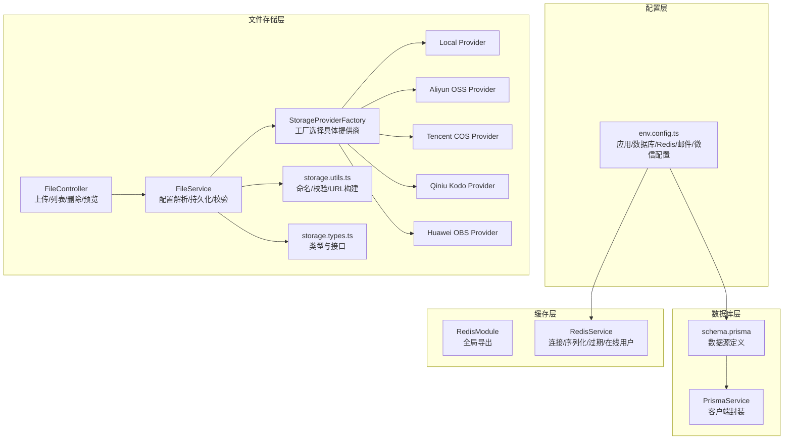
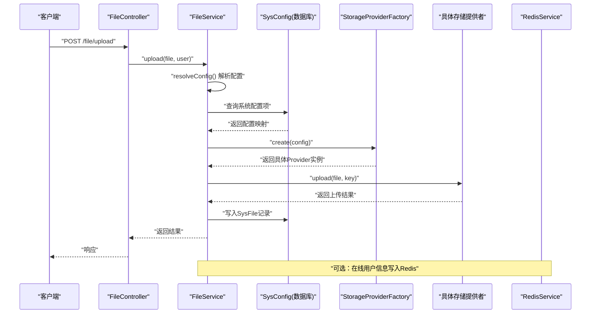
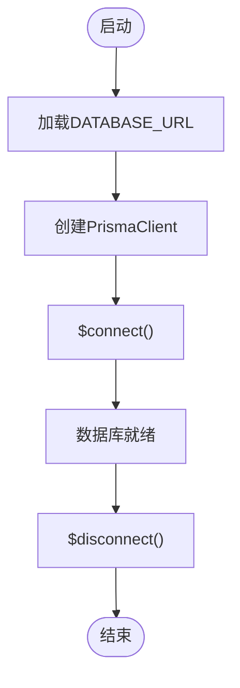
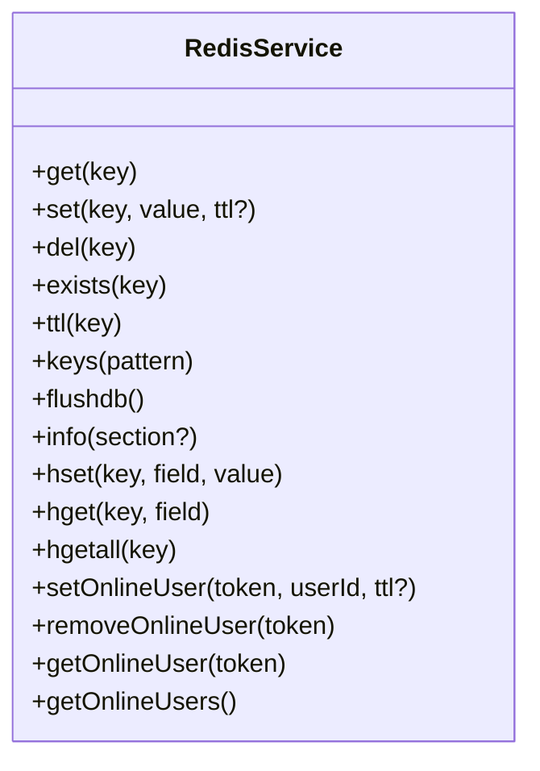
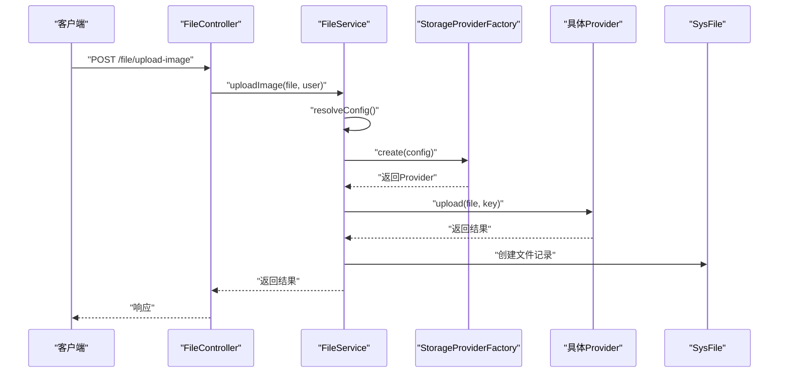
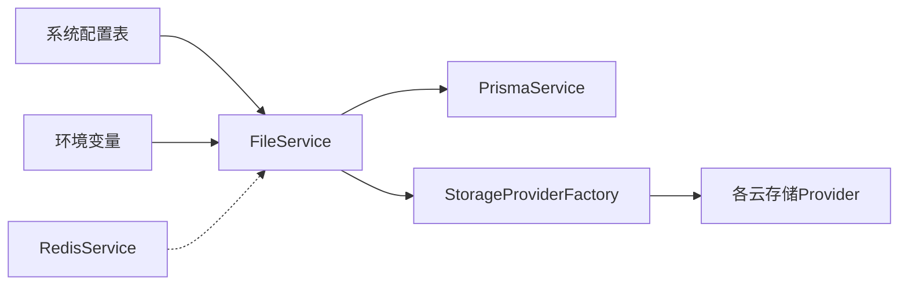

# 配置管理

<cite>
**本文引用的文件**
- [apps/backend/src/config/env.config.ts](file://apps/backend/src/config/env.config.ts)
- [apps/backend/prisma/schema.prisma](file://apps/backend/prisma/schema.prisma)
- [apps/backend/src/common/prisma.service.ts](file://apps/backend/src/common/prisma.service.ts)
- [apps/backend/src/cache/redis.module.ts](file://apps/backend/src/cache/redis.module.ts)
- [apps/backend/src/cache/redis.service.ts](file://apps/backend/src/cache/redis.service.ts)
- [apps/backend/src/modules/file/storage/storage-provider.factory.ts](file://apps/backend/src/modules/file/storage/storage-provider.factory.ts)
- [apps/backend/src/modules/file/storage/storage.types.ts](file://apps/backend/src/modules/file/storage/storage.types.ts)
- [apps/backend/src/modules/file/storage/local.provider.ts](file://apps/backend/src/modules/file/storage/local.provider.ts)
- [apps/backend/src/modules/file/storage/aliyun-oss.provider.ts](file://apps/backend/src/modules/file/storage/aliyun-oss.provider.ts)
- [apps/backend/src/modules/file/storage/tencent-cos.provider.ts](file://apps/backend/src/modules/file/storage/tencent-cos.provider.ts)
- [apps/backend/src/modules/file/storage/qiniu-kodo.provider.ts](file://apps/backend/src/modules/file/storage/qiniu-kodo.provider.ts)
- [apps/backend/src/modules/file/storage/huawei-obs.provider.ts](file://apps/backend/src/modules/file/storage/huawei-obs.provider.ts)
- [apps/backend/src/modules/file/storage/storage.utils.ts](file://apps/backend/src/modules/file/storage/storage.utils.ts)
- [apps/backend/src/modules/file/file.service.ts](file://apps/backend/src/modules/file/file.service.ts)
- [apps/backend/src/modules/file/file.controller.ts](file://apps/backend/src/modules/file/file.controller.ts)
</cite>

## 目录
1. [简介](#简介)
2. [项目结构](#项目结构)
3. [核心组件](#核心组件)
4. [架构总览](#架构总览)
5. [详细组件分析](#详细组件分析)
6. [依赖关系分析](#依赖关系分析)
7. [性能考量](#性能考量)
8. [故障排查指南](#故障排查指南)
9. [结论](#结论)
10. [附录](#附录)

## 简介
本文件系统性梳理并说明本项目的配置管理体系，涵盖以下方面：
- 环境变量与配置源
- 数据库连接与Prisma客户端配置
- Redis缓存连接、序列化与过期策略
- JWT认证密钥与过期时间
- 文件存储配置与多对象存储提供商适配
- 配置优先级与覆盖规则
- 生产环境最佳实践与安全建议
- 配置验证与错误处理机制

## 项目结构
配置相关的核心位置集中在后端应用中：
- 应用与通用配置：apps/backend/src/config/env.config.ts
- 数据库模型与连接：apps/backend/prisma/schema.prisma
- 数据库服务封装：apps/backend/src/common/prisma.service.ts
- 缓存模块：apps/backend/src/cache/redis.module.ts、apps/backend/src/cache/redis.service.ts
- 文件存储模块：apps/backend/src/modules/file/* 及其子目录

图表来源
- [apps/backend/src/config/env.config.ts:1-47](file://apps/backend/src/config/env.config.ts#L1-L47)
- [apps/backend/prisma/schema.prisma:1-347](file://apps/backend/prisma/schema.prisma#L1-L347)
- [apps/backend/src/common/prisma.service.ts:1-22](file://apps/backend/src/common/prisma.service.ts#L1-L22)
- [apps/backend/src/cache/redis.module.ts:1-9](file://apps/backend/src/cache/redis.module.ts#L1-L9)
- [apps/backend/src/cache/redis.service.ts:1-128](file://apps/backend/src/cache/redis.service.ts#L1-L128)
- [apps/backend/src/modules/file/file.controller.ts:1-100](file://apps/backend/src/modules/file/file.controller.ts#L1-L100)
- [apps/backend/src/modules/file/file.service.ts:1-310](file://apps/backend/src/modules/file/file.service.ts#L1-L310)
- [apps/backend/src/modules/file/storage/storage-provider.factory.ts:1-25](file://apps/backend/src/modules/file/storage/storage-provider.factory.ts#L1-L25)
- [apps/backend/src/modules/file/storage/storage.types.ts:1-43](file://apps/backend/src/modules/file/storage/storage.types.ts#L1-L43)
- [apps/backend/src/modules/file/storage/storage.utils.ts:1-62](file://apps/backend/src/modules/file/storage/storage.utils.ts#L1-L62)
- [apps/backend/src/modules/file/storage/local.provider.ts:1-46](file://apps/backend/src/modules/file/storage/local.provider.ts#L1-L46)
- [apps/backend/src/modules/file/storage/aliyun-oss.provider.ts:1-51](file://apps/backend/src/modules/file/storage/aliyun-oss.provider.ts#L1-L51)
- [apps/backend/src/modules/file/storage/tencent-cos.provider.ts:1-74](file://apps/backend/src/modules/file/storage/tencent-cos.provider.ts#L1-L74)
- [apps/backend/src/modules/file/storage/qiniu-kodo.provider.ts:1-68](file://apps/backend/src/modules/file/storage/qiniu-kodo.provider.ts#L1-L68)
- [apps/backend/src/modules/file/storage/huawei-obs.provider.ts:1-93](file://apps/backend/src/modules/file/storage/huawei-obs.provider.ts#L1-L93)

章节来源
- [apps/backend/src/config/env.config.ts:1-47](file://apps/backend/src/config/env.config.ts#L1-L47)
- [apps/backend/src/modules/file/file.controller.ts:1-100](file://apps/backend/src/modules/file/file.controller.ts#L1-L100)
- [apps/backend/src/modules/file/file.service.ts:1-310](file://apps/backend/src/modules/file/file.service.ts#L1-L310)

## 核心组件
- 应用配置（环境变量）：统一通过注册函数导出，包含应用端口、运行环境、JWT密钥与过期时间、文件上传目录与大小限制、文件存储提供商与对象存储参数等。
- 数据库配置：通过Prisma schema中的数据源定义读取DATABASE_URL；PrismaService负责连接生命周期与日志级别。
- Redis缓存：RedisModule全局导出，RedisService负责连接、键值操作、哈希操作、在线用户集合管理以及序列化/反序列化。
- 文件存储：FileController提供上传/列表/删除/预览接口；FileService解析系统配置与环境变量，决定存储提供商与参数；StorageProviderFactory根据配置选择具体实现；各云厂商提供者封装上传、删除与公共URL生成。

章节来源
- [apps/backend/src/config/env.config.ts:1-47](file://apps/backend/src/config/env.config.ts#L1-L47)
- [apps/backend/src/common/prisma.service.ts:1-22](file://apps/backend/src/common/prisma.service.ts#L1-L22)
- [apps/backend/src/cache/redis.module.ts:1-9](file://apps/backend/src/cache/redis.module.ts#L1-L9)
- [apps/backend/src/cache/redis.service.ts:1-128](file://apps/backend/src/cache/redis.service.ts#L1-L128)
- [apps/backend/src/modules/file/file.controller.ts:1-100](file://apps/backend/src/modules/file/file.controller.ts#L1-L100)
- [apps/backend/src/modules/file/file.service.ts:1-310](file://apps/backend/src/modules/file/file.service.ts#L1-L310)

## 架构总览
下图展示配置在系统中的流向与交互：

图表来源
- [apps/backend/src/modules/file/file.controller.ts:77-91](file://apps/backend/src/modules/file/file.controller.ts#L77-L91)
- [apps/backend/src/modules/file/file.service.ts:150-209](file://apps/backend/src/modules/file/file.service.ts#L150-L209)
- [apps/backend/src/modules/file/storage/storage-provider.factory.ts:8-24](file://apps/backend/src/modules/file/storage/storage-provider.factory.ts#L8-L24)
- [apps/backend/src/cache/redis.service.ts:82-99](file://apps/backend/src/cache/redis.service.ts#L82-L99)

## 详细组件分析

### 应用配置与环境变量
- 关键配置项
  - 应用端口、运行环境、JWT密钥与过期时间、上传目录、最大图片/文件大小、文件存储提供商、对象存储区域/桶/凭证/端点/前缀/公开URL、OSS兼容别名字段。
- 默认值与容错
  - 数值型默认值以字符串形式给出并通过解析转为数字；未设置时采用合理缺省。
- 配置来源
  - 优先从系统配置表读取；若不存在则回退到环境变量；最后使用代码内默认值。

章节来源
- [apps/backend/src/config/env.config.ts:3-22](file://apps/backend/src/config/env.config.ts#L3-L22)
- [apps/backend/src/modules/file/file.service.ts:211-257](file://apps/backend/src/modules/file/file.service.ts#L211-L257)

### 数据库连接与Prisma客户端
- 连接来源
  - DATABASE_URL来自环境变量，由Prisma schema的数据源读取。
- 客户端封装
  - PrismaService继承PrismaClient，构造时设定日志级别为错误与警告；在模块初始化时连接，在销毁时断开。
- 连接池与超时
  - 仓库未显式配置连接池参数与超时；如需调整，可在PrismaService构造参数中补充相应选项。

图表来源
- [apps/backend/prisma/schema.prisma:5-8](file://apps/backend/prisma/schema.prisma#L5-L8)
- [apps/backend/src/common/prisma.service.ts:8-21](file://apps/backend/src/common/prisma.service.ts#L8-L21)

章节来源
- [apps/backend/prisma/schema.prisma:5-8](file://apps/backend/prisma/schema.prisma#L5-L8)
- [apps/backend/src/common/prisma.service.ts:1-22](file://apps/backend/src/common/prisma.service.ts#L1-L22)

### Redis缓存配置与使用
- 连接配置
  - 主机、端口、密码、数据库索引均来自环境变量，默认值见配置文件。
- 序列化与反序列化
  - set/get/setex等操作对非字符串值进行JSON序列化；读取时尝试JSON.parse，失败则按原始字符串返回。
- 过期策略
  - 支持带TTL的setex；在线用户会话默认过期时间可自定义。
- 在线用户管理
  - 提供在线用户集合与令牌到用户ID的映射，便于鉴权与统计。

图表来源
- [apps/backend/src/cache/redis.service.ts:29-127](file://apps/backend/src/cache/redis.service.ts#L29-L127)

章节来源
- [apps/backend/src/config/env.config.ts:28-33](file://apps/backend/src/config/env.config.ts#L28-L33)
- [apps/backend/src/cache/redis.service.ts:1-128](file://apps/backend/src/cache/redis.service.ts#L1-L128)

### JWT认证配置
- 密钥与过期时间
  - 从环境变量读取JWT密钥与过期时间；未设置时采用默认值。
- 使用场景
  - 文件上传等受保护接口使用JWT守卫与权限守卫进行鉴权。

章节来源
- [apps/backend/src/config/env.config.ts:6-7](file://apps/backend/src/config/env.config.ts#L6-L7)
- [apps/backend/src/modules/file/file.controller.ts:37-91](file://apps/backend/src/modules/file/file.controller.ts#L37-L91)

### 文件存储配置与多提供商适配
- 存储提供商类型
  - 支持本地(local)、阿里云OSS(aliyun-oss)、腾讯云COS(tencent-cos)、七牛云Kodo(qiniu-kodo)、华为OBS(huawei-obs)。
- 配置来源与覆盖
  - 优先从系统配置表读取；其次回退到环境变量；最后使用代码默认值。
  - 旧版OSS相关环境变量与新字段共存，确保向后兼容。
- 上传流程
  - 生成对象Key或本地文件名；调用具体Provider执行上传；写入文件元数据。
- 删除流程
  - 根据文件存储类型调用对应Provider删除；即使远端已不存在，仍尝试更新元数据状态。
- 预览流程
  - 若为本地存储，检查路径合法性并直接发送文件；否则重定向至公共URL。

图表来源
- [apps/backend/src/modules/file/file.controller.ts:85-91](file://apps/backend/src/modules/file/file.controller.ts#L85-L91)
- [apps/backend/src/modules/file/file.service.ts:157-209](file://apps/backend/src/modules/file/file.service.ts#L157-L209)
- [apps/backend/src/modules/file/storage/storage-provider.factory.ts:8-24](file://apps/backend/src/modules/file/storage/storage-provider.factory.ts#L8-L24)

#### 各提供商配置要点与差异
- 本地存储
  - 仅需上传目录；生成安全的本地文件名；公共URL基于相对路径。
- 阿里云OSS
  - 必须提供区域、桶、AccessKey ID/Secret、端点(可选)、HTTPS开关；支持自定义公共URL。
- 腾讯云COS
  - 必须提供SecretId/SecretKey、区域、桶；支持自定义公共URL或自动拼接域名。
- 七牛云Kodo
  - 必须提供AccessKey/SecretKey、区域、桶；上传使用上传Token；支持自定义公共URL。
- 华为OBS
  - 必须提供endpoint；其他与OSS类似；缺少endpoint将触发异常。

章节来源
- [apps/backend/src/modules/file/storage/local.provider.ts:11-30](file://apps/backend/src/modules/file/storage/local.provider.ts#L11-L30)
- [apps/backend/src/modules/file/storage/aliyun-oss.provider.ts:13-38](file://apps/backend/src/modules/file/storage/aliyun-oss.provider.ts#L13-L38)
- [apps/backend/src/modules/file/storage/tencent-cos.provider.ts:14-51](file://apps/backend/src/modules/file/storage/tencent-cos.provider.ts#L14-L51)
- [apps/backend/src/modules/file/storage/qiniu-kodo.provider.ts:14-41](file://apps/backend/src/modules/file/storage/qiniu-kodo.provider.ts#L14-L41)
- [apps/backend/src/modules/file/storage/huawei-obs.provider.ts:18-62](file://apps/backend/src/modules/file/storage/huawei-obs.provider.ts#L18-L62)
- [apps/backend/src/modules/file/storage/storage.utils.ts:42-46](file://apps/backend/src/modules/file/storage/storage.utils.ts#L42-L46)

#### 工厂与类型定义
- 工厂根据配置storage字段选择具体Provider。
- 类型定义约束了配置字段与接口契约。

章节来源
- [apps/backend/src/modules/file/storage/storage-provider.factory.ts:8-24](file://apps/backend/src/modules/file/storage/storage-provider.factory.ts#L8-L24)
- [apps/backend/src/modules/file/storage/storage.types.ts:10-42](file://apps/backend/src/modules/file/storage/storage.types.ts#L10-L42)

#### 配置解析与持久化
- 解析逻辑
  - 从系统配置表批量读取；合并环境变量与旧版OSS字段；转换布尔与数值类型；最终形成FileStorageConfig。
- 更新逻辑
  - 将新配置写入系统配置表，同时保留敏感字段不回传给前端。
- 前端兼容
  - 返回字段包含旧版OSS字段别名，保证历史客户端可用。

章节来源
- [apps/backend/src/modules/file/file.service.ts:45-98](file://apps/backend/src/modules/file/file.service.ts#L45-L98)
- [apps/backend/src/modules/file/file.service.ts:211-257](file://apps/backend/src/modules/file/file.service.ts#L211-L257)

## 依赖关系分析
- 配置来源依赖链
  - 系统配置表 → 环境变量 → 代码默认值
- 组件耦合
  - FileService依赖PrismaService与StorageProviderFactory；StorageProviderFactory依赖各云厂商Provider；RedisService独立于配置表但可被业务模块使用。
- 外部依赖
  - 数据库驱动、Redis客户端、各云SDK。

图表来源
- [apps/backend/src/modules/file/file.service.ts:211-257](file://apps/backend/src/modules/file/file.service.ts#L211-L257)
- [apps/backend/src/common/prisma.service.ts:1-22](file://apps/backend/src/common/prisma.service.ts#L1-L22)
- [apps/backend/src/cache/redis.service.ts:1-128](file://apps/backend/src/cache/redis.service.ts#L1-L128)
- [apps/backend/src/modules/file/storage/storage-provider.factory.ts:1-25](file://apps/backend/src/modules/file/storage/storage-provider.factory.ts#L1-L25)

章节来源
- [apps/backend/src/modules/file/file.service.ts:1-310](file://apps/backend/src/modules/file/file.service.ts#L1-L310)

## 性能考量
- 数据库连接
  - 如需连接池与超时控制，建议在PrismaService构造参数中补充相应选项，避免默认行为在高并发场景下的瓶颈。
- Redis序列化
  - JSON序列化带来CPU与内存开销；建议对频繁读写的键值尽量保持简单类型，或在上层做缓存层优化。
- 文件上传
  - 上传缓冲区使用内存存储；大文件可能导致内存压力；建议结合NestJS的文件拦截器与限流策略，必要时改为流式处理或分片上传。

## 故障排查指南
- 数据库连接失败
  - 检查DATABASE_URL是否正确；确认PrismaService日志输出；核对网络连通性。
- Redis连接异常
  - 查看连接事件回调输出；确认主机、端口、密码、DB索引；检查防火墙与网络策略。
- 文件上传失败
  - 校验系统配置表中的存储类型与凭证；检查对象存储区域/桶/密钥/端点；查看Provider抛出的异常信息。
- 预览失败
  - 本地存储需确保路径解析合法且文件存在；非本地存储需确认公共URL可达。

章节来源
- [apps/backend/src/common/prisma.service.ts:14-21](file://apps/backend/src/common/prisma.service.ts#L14-L21)
- [apps/backend/src/cache/redis.service.ts:16-23](file://apps/backend/src/cache/redis.service.ts#L16-L23)
- [apps/backend/src/modules/file/file.service.ts:150-185](file://apps/backend/src/modules/file/file.service.ts#L150-L185)

## 结论
本项目的配置体系以“系统配置表 + 环境变量 + 代码默认值”的三层结构实现灵活切换与可运维性。数据库、缓存与文件存储均通过清晰的抽象与工厂模式解耦，便于扩展新的存储提供商与优化性能。建议在生产环境中完善连接池与超时配置、强化密钥管理与最小权限原则，并对上传与缓存策略进行容量与性能评估。

## 附录

### 配置优先级与覆盖规则
- 优先级（从高到低）
  1) 系统配置表（动态配置）
  2) 环境变量（部署配置）
  3) 代码默认值（开发/兜底）
- 覆盖规则
  - 文件存储：storage、uploadDir、maxImageSize、maxFileSize、region、bucket、accessKeyId、accessKeySecret、endpoint、prefix、publicUrl、secure。
  - 兼容旧版OSS字段：ossRegion、ossBucket、ossAccessKeyId、ossAccessKeySecret、ossEndpoint、ossPrefix、ossPublicUrl、ossSecure。
- 返回给前端的配置
  - 敏感字段不回传；提供旧版OSS字段别名以兼容历史客户端。

章节来源
- [apps/backend/src/modules/file/file.service.ts:64-98](file://apps/backend/src/modules/file/file.service.ts#L64-L98)
- [apps/backend/src/modules/file/file.service.ts:45-62](file://apps/backend/src/modules/file/file.service.ts#L45-L62)
- [apps/backend/src/modules/file/file.service.ts:244-256](file://apps/backend/src/modules/file/file.service.ts#L244-L256)

### 生产环境最佳实践与安全建议
- 密钥管理
  - JWT密钥与各云厂商AccessKey/Secret必须妥善保管，避免硬编码；使用密钥管理服务或平台提供的密钥注入能力。
- 最小权限
  - 对象存储的凭证仅授予必要权限；定期轮换密钥。
- 网络与TLS
  - 对象存储建议启用HTTPS；Redis与数据库连接建议走内网或专用VPC。
- 配置审计
  - 所有配置变更应记录在案；对敏感字段变更进行二次确认。
- 监控告警
  - 开启数据库、Redis与对象存储的健康检查与错误日志告警。

### 配置验证与错误处理
- 配置验证
  - 云存储提供者在构造时校验必需字段；缺失时抛出明确异常。
- 错误处理
  - 文件删除时捕获异常以保证元数据一致性；本地路径解析防止路径穿越；上传大小与类型校验在服务层集中处理。

章节来源
- [apps/backend/src/modules/file/storage/storage.utils.ts:42-46](file://apps/backend/src/modules/file/storage/storage.utils.ts#L42-L46)
- [apps/backend/src/modules/file/file.service.ts:129-148](file://apps/backend/src/modules/file/file.service.ts#L129-L148)
- [apps/backend/src/modules/file/storage/huawei-obs.provider.ts:11-16](file://apps/backend/src/modules/file/storage/huawei-obs.provider.ts#L11-L16)