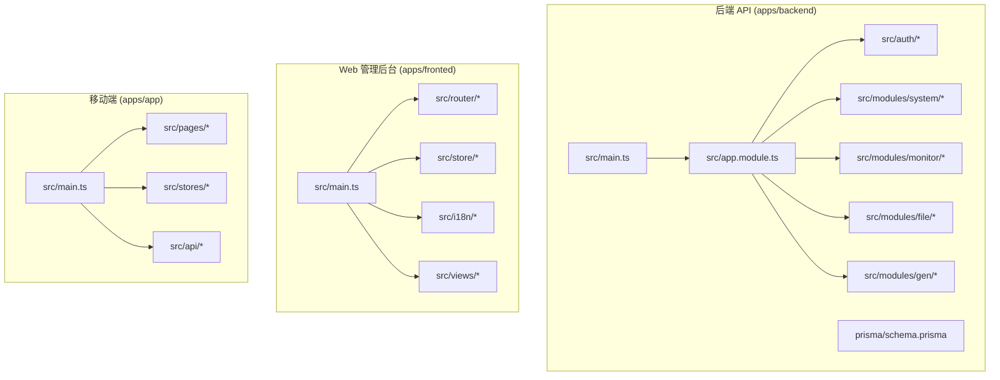
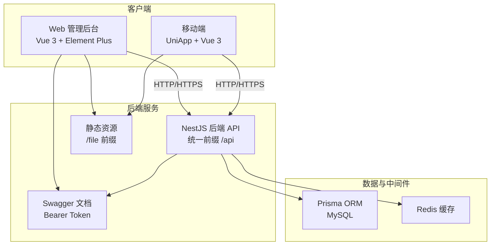
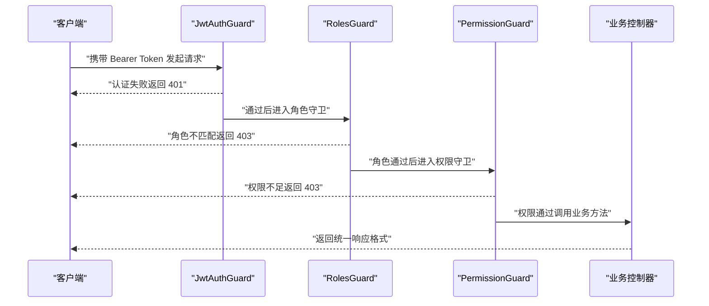
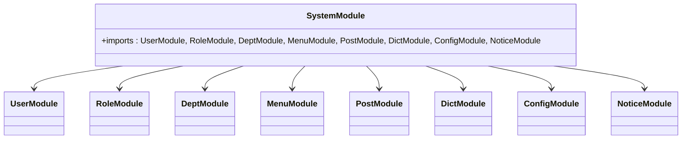
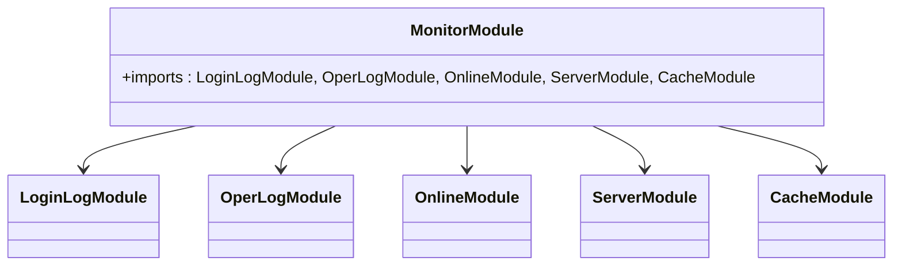
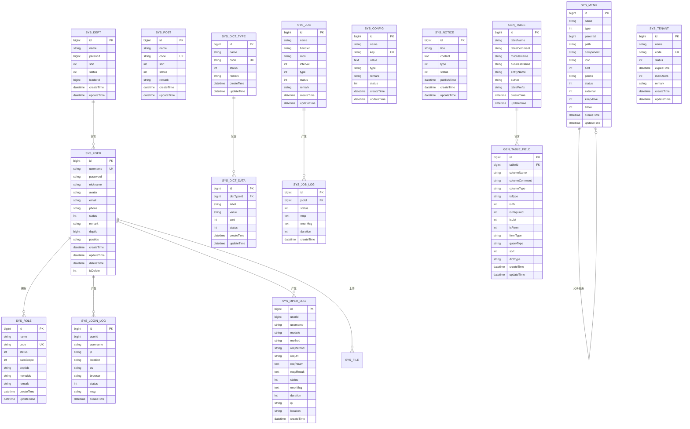
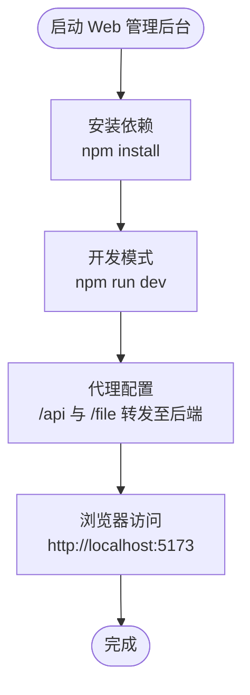
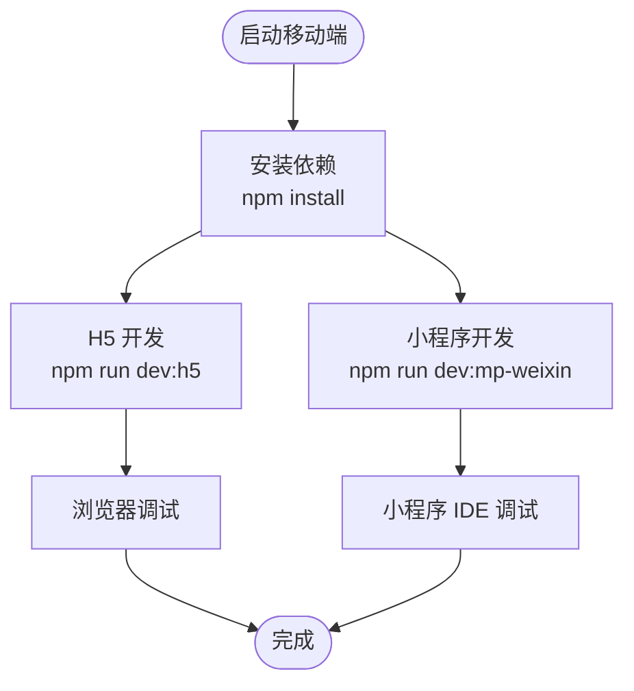
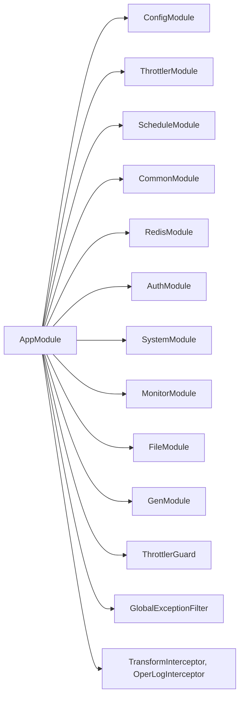

# 项目概述

<cite>
**本文档引用的文件**
- [README.md](file://README.md)
- [apps/backend/package.json](file://apps/backend/package.json)
- [apps/fronted/package.json](file://apps/fronted/package.json)
- [apps/app/package.json](file://apps/app/package.json)
- [apps/backend/src/main.ts](file://apps/backend/src/main.ts)
- [apps/backend/prisma/schema.prisma](file://apps/backend/prisma/schema.prisma)
- [apps/backend/src/app.module.ts](file://apps/backend/src/app.module.ts)
- [apps/backend/src/auth/guards.ts](file://apps/backend/src/auth/guards.ts)
- [apps/backend/src/auth/jwt.guard.ts](file://apps/backend/src/auth/jwt.guard.ts)
- [apps/backend/src/modules/system/user/user.controller.ts](file://apps/backend/src/modules/system/user/user.controller.ts)
- [apps/backend/src/modules/system/system.module.ts](file://apps/backend/src/modules/system/system.module.ts)
- [apps/backend/src/modules/monitor/monitor.module.ts](file://apps/backend/src/modules/monitor/monitor.module.ts)
- [apps/fronted/src/main.ts](file://apps/fronted/src/main.ts)
- [apps/app/src/main.ts](file://apps/app/src/main.ts)
</cite>

## 目录
1. [简介](#简介)
2. [项目结构](#项目结构)
3. [核心组件](#核心组件)
4. [架构总览](#架构总览)
5. [详细组件分析](#详细组件分析)
6. [依赖关系分析](#依赖关系分析)
7. [性能考虑](#性能考虑)
8. [故障排除指南](#故障排除指南)
9. [结论](#结论)
10. [附录](#附录)

## 简介
Nest-Admin-Pro 是一个基于 NestJS、Prisma、Vue 3、Element Plus 与 UniApp 的全栈后台管理系统模板。项目采用多应用架构，将后端 API、Web 管理后台与移动端应用统一置于同一仓库，适合中小型管理系统、接单项目以及二次开发脚手架。项目提供完善的 RBAC 权限体系、系统管理、系统监控、代码生成器、文件上传等核心能力，并具备良好的开发体验与可扩展性。

- 核心价值
  - 一体化多端同仓：后端、Web 管理后台、移动端三端统一维护，降低协作成本
  - 成熟技术栈组合：NestJS + Prisma + Vue 3 + Element Plus + UniApp，兼顾性能与开发效率
  - 完整权限体系：JWT 认证、角色权限、按钮级权限守卫、动态菜单渲染
  - 丰富功能矩阵：系统管理、系统监控、代码生成器、文件上传、主题系统、国际化
  - 可靠的工程化：统一响应、全局异常过滤、参数校验、接口限流、Swagger 文档

- 技术特色
  - 后端：NestJS 11 + Prisma 5 + MySQL + Redis + JWT + Swagger + class-validator + ioredis + svg-captcha
  - Web 前端：Vue 3 + Vite 8 + Element Plus 2 + Pinia 3 + Vue Router 5 + Axios + Tailwind CSS 4 + ECharts 6 + vue-i18n 11
  - 移动端：UniApp 3 + Vue 3，覆盖 H5 与 13 个小程序平台

- 应用场景
  - 中小型企业后台管理
  - SaaS 多租户后台（预留模型）
  - 快速原型与二次开发脚手架
  - 跨平台移动应用需求

**章节来源**
- [README.md:1-417](file://README.md#L1-L417)

## 项目结构
项目采用“多应用”目录组织，三个子应用分别位于 apps/backend、apps/fronted、apps/app，配合 scripts 与 docs 提供初始化与文档支持。

**图示来源**
- [apps/backend/src/main.ts:1-48](file://apps/backend/src/main.ts#L1-L48)
- [apps/backend/src/app.module.ts:1-59](file://apps/backend/src/app.module.ts#L1-L59)
- [apps/backend/prisma/schema.prisma:1-347](file://apps/backend/prisma/schema.prisma#L1-L347)
- [apps/fronted/src/main.ts:1-27](file://apps/fronted/src/main.ts#L1-L27)
- [apps/app/src/main.ts:1-9](file://apps/app/src/main.ts#L1-L9)

**章节来源**
- [README.md:26-118](file://README.md#L26-L118)

## 核心组件
- 后端核心能力
  - 全局前缀与静态资源：统一 /api 前缀、/file 前缀提供上传文件访问
  - 统一响应与异常处理：ApiResponse 统一格式、全局异常过滤器、拦截器链路
  - 参数校验与限流：ValidationPipe 白名单/禁止非白名单、Throttler 60 次/分钟
  - 文档与安全：Swagger 文档（Bearer Token）、CORS、静态资源托管
  - 模块化组织：CommonModule、RedisModule、AuthModule、SystemModule、MonitorModule、FileModule、GenModule

- 权限与认证
  - JWT 守卫：JwtAuthGuard
  - 角色守卫：RolesGuard（基于角色编码）
  - 权限守卫：PermissionGuard（基于权限标识）
  - 公开接口标记：Public 装饰器

- 数据模型（Prisma）
  - 系统核心：用户、角色、部门、岗位、菜单、字典、参数、通知公告
  - 日志与监控：登录日志、操作日志
  - 定时任务：任务与任务日志
  - 代码生成：表配置与字段配置
  - 租户：预留模型

- Web 管理后台
  - 动态菜单：登录后从后端拉取菜单树渲染
  - 权限路由：基于 localStorage token 与 userStore.menus 控制访问
  - 主题系统：6 套玻璃拟态主题，data-theme 切换
  - 国际化：zh-CN / en-US
  - 图表：ECharts 仪表盘与服务监控

- 移动端
  - 跨平台：H5 + 13 个小程序平台
  - 认证：JWT Bearer Token，401 自动跳转登录
  - 功能：登录、首页、个人中心、资料修改、密码修改、头像上传

**章节来源**
- [apps/backend/src/main.ts:14-46](file://apps/backend/src/main.ts#L14-L46)
- [apps/backend/src/app.module.ts:18-59](file://apps/backend/src/app.module.ts#L18-L59)
- [apps/backend/src/auth/guards.ts:19-51](file://apps/backend/src/auth/guards.ts#L19-L51)
- [apps/backend/prisma/schema.prisma:12-347](file://apps/backend/prisma/schema.prisma#L12-L347)
- [apps/fronted/src/main.ts:12-26](file://apps/fronted/src/main.ts#L12-L26)
- [README.md:71-118](file://README.md#L71-L118)

## 架构总览
系统采用“后端 API + 多前端应用”的分层架构，后端提供统一 REST API，Web 与移动端分别消费接口并提供各自用户体验。

**图示来源**
- [apps/backend/src/main.ts:14-46](file://apps/backend/src/main.ts#L14-L46)
- [apps/backend/src/app.module.ts:18-59](file://apps/backend/src/app.module.ts#L18-L59)
- [apps/backend/prisma/schema.prisma:1-8](file://apps/backend/prisma/schema.prisma#L1-L8)

**章节来源**
- [README.md:71-118](file://README.md#L71-L118)

## 详细组件分析

### 认证与权限控制流程
系统通过装饰器与守卫实现细粒度的权限控制，结合 JWT 实现认证与授权。

**图示来源**
- [apps/backend/src/auth/jwt.guard.ts:1-5](file://apps/backend/src/auth/jwt.guard.ts#L1-L5)
- [apps/backend/src/auth/guards.ts:19-51](file://apps/backend/src/auth/guards.ts#L19-L51)
- [apps/backend/src/modules/system/user/user.controller.ts:20-89](file://apps/backend/src/modules/system/user/user.controller.ts#L20-L89)

**章节来源**
- [apps/backend/src/auth/guards.ts:10-51](file://apps/backend/src/auth/guards.ts#L10-L51)
- [apps/backend/src/auth/jwt.guard.ts:1-5](file://apps/backend/src/auth/jwt.guard.ts#L1-L5)
- [apps/backend/src/modules/system/user/user.controller.ts:16-89](file://apps/backend/src/modules/system/user/user.controller.ts#L16-L89)

### 系统管理模块（用户/角色/菜单等）
系统管理模块按领域拆分为多个子模块，统一在 SystemModule 下聚合。

**图示来源**
- [apps/backend/src/modules/system/system.module.ts:1-23](file://apps/backend/src/modules/system/system.module.ts#L1-L23)

**章节来源**
- [apps/backend/src/modules/system/system.module.ts:11-23](file://apps/backend/src/modules/system/system.module.ts#L11-L23)

### 系统监控模块（登录日志/操作日志/在线用户/服务器/缓存）
监控模块聚合了登录日志、操作日志、在线用户、服务器信息与缓存监控。

**图示来源**
- [apps/backend/src/modules/monitor/monitor.module.ts:1-11](file://apps/backend/src/modules/monitor/monitor.module.ts#L1-L11)

**章节来源**
- [apps/backend/src/modules/monitor/monitor.module.ts:8-11](file://apps/backend/src/modules/monitor/monitor.module.ts#L8-L11)

### 数据模型与关系（Prisma）
系统核心围绕用户、角色、部门、岗位、菜单、字典、参数、通知等构建，形成完整的后台管理数据骨架。

**图示来源**
- [apps/backend/prisma/schema.prisma:12-347](file://apps/backend/prisma/schema.prisma#L12-L347)

**章节来源**
- [apps/backend/prisma/schema.prisma:12-347](file://apps/backend/prisma/schema.prisma#L12-L347)

### Web 管理后台启动与依赖
Web 管理后台基于 Vue 3 + Element Plus，使用 Vite 构建，集成 Pinia、Vue Router、Axios、Tailwind CSS、ECharts、vue-i18n 等生态库。

**图示来源**
- [apps/fronted/src/main.ts:12-26](file://apps/fronted/src/main.ts#L12-L26)
- [apps/fronted/package.json:1-34](file://apps/fronted/package.json#L1-L34)

**章节来源**
- [apps/fronted/src/main.ts:12-26](file://apps/fronted/src/main.ts#L12-L26)
- [apps/fronted/package.json:6-10](file://apps/fronted/package.json#L6-L10)

### 移动端启动与跨平台支持
移动端基于 UniApp + Vue 3，支持 H5 与 13 个小程序平台，提供登录、首页、个人中心、资料修改、密码修改等基础页面。

**图示来源**
- [apps/app/src/main.ts:1-9](file://apps/app/src/main.ts#L1-L9)
- [apps/app/package.json:4-38](file://apps/app/package.json#L4-L38)

**章节来源**
- [apps/app/src/main.ts:1-9](file://apps/app/src/main.ts#L1-L9)
- [apps/app/package.json:4-38](file://apps/app/package.json#L4-L38)

## 依赖关系分析
后端应用通过 AppModule 聚合各模块，并注入全局守卫、过滤器与拦截器，形成统一的横切关注点。

**图示来源**
- [apps/backend/src/app.module.ts:18-59](file://apps/backend/src/app.module.ts#L18-L59)

**章节来源**
- [apps/backend/src/app.module.ts:18-59](file://apps/backend/src/app.module.ts#L18-L59)

## 性能考虑
- 接口限流：默认 60 次/分钟，避免滥用与 DDoS
- 参数校验：开启白名单与禁止非白名单，减少无效请求
- 缓存：Redis 模块已接入，可用于热点数据与会话存储
- 静态资源：统一前缀 /file，便于 CDN 与反向代理优化
- ORM 优化：Prisma 模型索引完善，建议结合查询分析器优化复杂查询

[本节为通用指导，无需列出章节来源]

## 故障排除指南
- 移动端依赖缺失
  - 现象：源码使用 Pinia 但 package.json 未声明
  - 处理：在 apps/app 目录执行依赖安装
  - 参考：README 中已标注该问题

- 文档目录名不一致
  - 现象：docs/ 内部分文档仍使用旧目录名 apps/api 与 apps/web
  - 处理：使用实际源码目录 apps/backend 与 apps/fronted

- 工作区未配置
  - 现象：根目录未配置 pnpm/npm workspace，需分别进入子应用安装与启动
  - 处理：按 README 的常用命令分别进入各应用目录

**章节来源**
- [README.md:366-371](file://README.md#L366-L371)

## 结论
Nest-Admin-Pro 提供了一套成熟、可扩展且易于二次开发的全栈后台管理解决方案。其多应用架构与完善的功能矩阵，使其既能满足快速交付的需求，又能在长期演进中保持良好的可维护性。对于初学者而言，项目提供了清晰的目录结构与文档；对于有经验的开发者，项目在权限体系、数据模型、工程化等方面都具备深入的设计考量。

[本节为总结性内容，无需列出章节来源]

## 附录
- 版本与许可证
  - 许可证：MIT License
  - 后端版本：NestJS 11、Prisma 5
  - Web 前端版本：Vue 3、Element Plus 2、Vite 8
  - 移动端版本：UniApp 3

**章节来源**
- [README.md:414-417](file://README.md#L414-L417)
- [apps/backend/package.json:16-42](file://apps/backend/package.json#L16-L42)
- [apps/fronted/package.json:11-24](file://apps/fronted/package.json#L11-L24)
- [apps/app/package.json:39-58](file://apps/app/package.json#L39-L58)